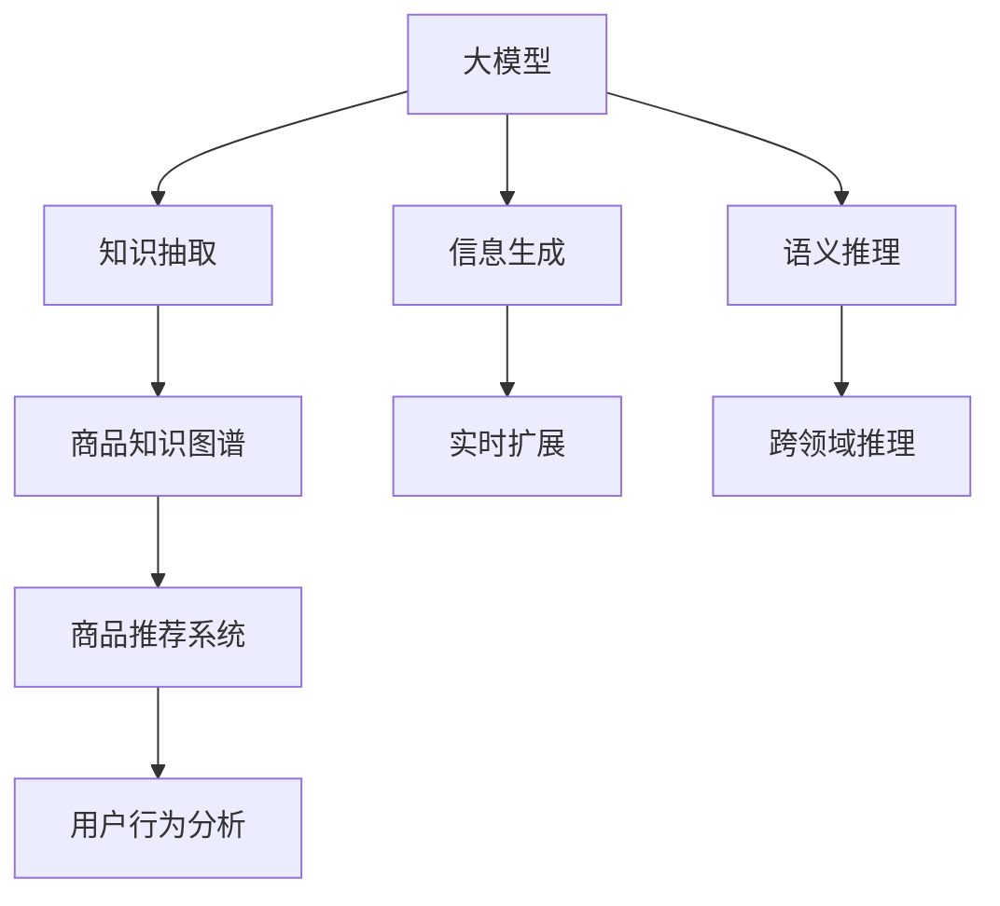

                 

# 大模型在商品知识图谱实时扩展中的应用

> 关键词：大模型,知识图谱,实时扩展,图神经网络(Graph Neural Networks, GNN),跨领域推理,商品推荐,商品属性匹配

## 1. 背景介绍

### 1.1 问题由来

随着电商行业的迅猛发展，商品推荐系统（Recommendation System）已成为电商平台中不可或缺的一部分，对提升用户购买体验、提高转化率起到至关重要的作用。知识图谱（Knowledge Graph）作为一种结构化知识表示方法，将实体、关系、属性组织为三元组形式，能够为商品推荐提供更精准、全面的信息。在商品知识图谱中，商品实体、属性、关系等信息的稀疏性、非均匀性以及商品种类的多样性，都对知识图谱的构建和扩展带来了挑战。

如何高效、灵活地扩展商品知识图谱，利用大模型（Large Model）进行知识推理和生成，提升商品推荐系统的效果，成为电商领域的研究热点。

### 1.2 问题核心关键点

大模型在商品知识图谱实时扩展中的应用，核心在于如何利用大规模预训练模型，高效抽取商品信息，结合图神经网络（Graph Neural Networks, GNN）的强大推理能力，实时扩展知识图谱，提升商品推荐系统的性能。

具体来说，需解决以下几个问题：

1. 如何从商品网页、说明书、评论等非结构化文本数据中高效抽取商品信息？
2. 如何构建商品知识图谱的实时扩展机制，动态更新商品实体、关系、属性？
3. 如何利用大模型结合图神经网络进行跨领域推理，提升推荐系统的个性化和多样性？
4. 如何处理商品种类的多样性，构建跨商品领域、跨行业领域的知识图谱？

这些问题构成了商品知识图谱实时扩展的核心，亟需通过系统性研究和实践，进行深入解答。

## 2. 核心概念与联系

### 2.1 核心概念概述

为更好地理解大模型在商品知识图谱实时扩展中的应用，本节将介绍几个关键概念：

- **大模型**：指基于大规模预训练语言模型（如BERT、GPT、RoBERTa等）进行知识抽取、信息生成、语义推理等任务的大规模模型。
- **知识图谱**：由实体、关系、属性组成的三元组结构化数据，用于表示实体之间的语义关系，广泛应用于信息检索、智能推荐、知识推理等领域。
- **图神经网络（GNN）**：基于图结构数据的深度神经网络模型，通过聚合邻域信息，学习节点间的复杂关系，在节点表示学习、图分类、图回归等任务上表现出色。
- **商品推荐系统**：根据用户的历史行为、偏好、兴趣等信息，预测用户可能感兴趣的商品，并推荐给用户。商品推荐系统的性能直接影响到用户的购物体验和电商平台的转化率。
- **跨领域推理**：指在知识图谱中跨越不同领域进行推理，如从商品推荐到音乐推荐、从电商领域到医疗领域等，提升知识图谱的泛化能力和应用场景的覆盖范围。

这些核心概念之间的逻辑关系可以通过以下Mermaid流程图来展示：



这个流程图展示了大模型在商品知识图谱实时扩展中的核心概念及其之间的关系：

1. 大模型通过预训练获得丰富的语言表示能力。
2. 知识抽取和信息生成模块，利用大模型进行商品信息的抽取和生成。
3. 图神经网络模块，构建和扩展商品知识图谱。
4. 跨领域推理模块，提升知识图谱的应用范围和泛化能力。
5. 商品推荐系统，利用知识图谱进行个性化推荐。

## 3. 核心算法原理 & 具体操作步骤
### 3.1 算法原理概述

大模型在商品知识图谱实时扩展中的应用，基于以下几个关键算法原理：

1. **知识抽取**：通过大模型对商品网页、说明书、评论等非结构化文本进行语义理解和信息抽取，生成商品实体、属性、关系等结构化信息。
2. **信息生成**：基于抽取的商品信息，利用大模型生成商品描述、属性、推荐理由等信息，丰富商品知识图谱的内容。
3. **图神经网络（GNN）**：通过GNN模型对商品知识图谱进行动态更新和关系推理，提升知识图谱的实时扩展能力和推理效率。
4. **跨领域推理**：利用大模型结合GNN，在知识图谱中跨越不同领域进行推理，提升推荐系统的个性化和多样性。

### 3.2 算法步骤详解

基于上述算法原理，大模型在商品知识图谱实时扩展的应用过程可以分为以下几步：

**Step 1: 大模型的选择和预训练**
- 选择合适的预训练语言模型，如BERT、RoBERTa等，作为知识抽取和信息生成的基础模型。
- 在无标签的商品文本数据上进行预训练，学习通用的语言表示。

**Step 2: 知识抽取模块**
- 构建知识抽取模型，利用大模型对商品网页、说明书、评论等文本数据进行分词、实体识别、关系抽取等操作，生成商品实体、属性、关系等结构化信息。
- 通过文本分类、实体识别、关系抽取等任务，训练大模型在商品数据上的特定能力。

**Step 3: 信息生成模块**
- 构建信息生成模型，利用大模型生成商品描述、属性、推荐理由等信息，丰富商品知识图谱的内容。
- 通过序列到序列模型、条件生成模型等方法，训练大模型进行商品信息生成任务。

**Step 4: 图神经网络（GNN）模块**
- 构建GNN模型，用于对商品知识图谱进行动态更新和关系推理。
- 通过图卷积网络（GCN）、图注意力网络（GAT）等方法，训练GNN模型进行节点表示学习、边关系学习等操作。

**Step 5: 跨领域推理模块**
- 构建跨领域推理模型，利用大模型结合GNN，在知识图谱中跨越不同领域进行推理。
- 通过多任务学习、联合训练等方法，训练大模型在多个领域中的通用推理能力。

**Step 6: 商品推荐系统**
- 构建推荐系统，利用商品知识图谱进行个性化推荐。
- 通过协同过滤、内容推荐、混合推荐等方法，训练推荐模型，提升推荐系统的个性化和多样性。

### 3.3 算法优缺点

大模型在商品知识图谱实时扩展中的应用，具有以下优点：

1. **高效性**：大模型在大规模预训练过程中，学习到了丰富的语言表示能力，可以快速抽取商品信息，生成商品描述和属性，提升知识图谱的扩展效率。
2. **泛化性**：利用大模型结合GNN进行跨领域推理，提升了知识图谱的泛化能力和应用场景的覆盖范围，可以应对更多领域的知识图谱扩展需求。
3. **个性化推荐**：通过跨领域推理，结合用户行为分析，构建个性化的商品推荐系统，提升推荐系统的精准度和用户满意度。

同时，该方法也存在一定的局限性：

1. **数据依赖**：大模型需要大规模的预训练数据，数据获取和标注成本较高。
2. **模型复杂性**：大模型和GNN模型的训练和推理复杂度较高，对硬件资源和计算能力要求较高。
3. **解释性不足**：大模型和GNN模型的决策过程缺乏可解释性，难以对其推理逻辑进行分析和调试。

尽管存在这些局限性，但就目前而言，大模型结合GNN的方法仍然是大规模商品知识图谱实时扩展的重要手段。未来相关研究的重点在于如何进一步降低数据依赖，提高模型的跨领域推理能力和解释性。

### 3.4 算法应用领域

大模型在商品知识图谱实时扩展的应用，主要集中在以下几个领域：

1. **商品推荐系统**：利用大模型结合GNN进行商品推荐，提升推荐系统的精准度和个性化。
2. **商品属性匹配**：利用大模型进行商品属性抽取和生成，提升商品属性匹配的准确性。
3. **跨领域知识推理**：利用大模型结合GNN进行跨领域知识推理，拓展知识图谱的应用范围。
4. **商品信息抽取**：利用大模型进行商品信息抽取和生成，丰富商品知识图谱的内容。
5. **电商数据分析**：利用大模型结合GNN进行电商数据分析，提升电商平台的运营效率。

这些应用领域展示了大模型在商品知识图谱实时扩展中的广泛应用前景。

## 4. 数学模型和公式 & 详细讲解  
### 4.1 数学模型构建

本节将使用数学语言对大模型在商品知识图谱实时扩展的应用过程进行更加严格的刻画。

记大模型为 $M_{\theta}$，其中 $\theta$ 为模型参数。假设商品知识图谱中的商品实体为 $E$，属性为 $A$，关系为 $R$。则知识图谱可以表示为三元组 $<E, R, A>$。假设商品文本数据为 $\mathcal{D}$，则知识抽取模型的目标是：

$$
\min_{\theta} \mathcal{L}(\theta, \mathcal{D})
$$

其中 $\mathcal{L}$ 为损失函数，用于衡量模型在数据 $\mathcal{D}$ 上的预测与真实标签之间的差异。具体来说，可以定义以下任务：

1. **实体抽取**：预测商品文本中出现的实体，并将其映射到知识图谱中的实体节点。
2. **属性抽取**：预测商品文本中出现的属性，并将其映射到知识图谱中的属性节点。
3. **关系抽取**：预测商品文本中出现的关系，并将其映射到知识图谱中的关系边。

通过这些任务，训练大模型在商品数据上的特定能力。

### 4.2 公式推导过程

以下是实体抽取任务的推导过程：

假设商品文本数据 $\mathcal{D}$ 中包含 $N$ 个文本 $x_i$，大模型 $M_{\theta}$ 的实体抽取函数为 $f_{\theta}(x_i)$，返回文本中出现的实体列表 $e_i$。则实体抽取任务的目标是：

$$
\min_{\theta} \sum_{i=1}^N \ell(e_i, f_{\theta}(x_i))
$$

其中 $\ell$ 为实体抽取任务的损失函数，可以定义如下：

$$
\ell(e_i, f_{\theta}(x_i)) = -\sum_{e \in e_i} \log P(e_i) + \sum_{e \notin e_i} \log (1 - P(e_i))
$$

其中 $P(e_i)$ 为模型预测实体 $e_i$ 的概率，$\log P(e_i)$ 为正样本损失，$\log (1 - P(e_i))$ 为负样本损失。

通过上述公式，可以训练大模型在商品数据上的实体抽取能力。

## 5. 项目实践：代码实例和详细解释说明
### 5.1 开发环境搭建

在进行项目实践前，我们需要准备好开发环境。以下是使用Python进行PyTorch开发的环境配置流程：

1. 安装Anaconda：从官网下载并安装Anaconda，用于创建独立的Python环境。

2. 创建并激活虚拟环境：
```bash
conda create -n pytorch-env python=3.8 
conda activate pytorch-env
```

3. 安装PyTorch：根据CUDA版本，从官网获取对应的安装命令。例如：
```bash
conda install pytorch torchvision torchaudio cudatoolkit=11.1 -c pytorch -c conda-forge
```

4. 安装Transformers库：
```bash
pip install transformers
```

5. 安装各类工具包：
```bash
pip install numpy pandas scikit-learn matplotlib tqdm jupyter notebook ipython
```

完成上述步骤后，即可在`pytorch-env`环境中开始项目实践。

### 5.2 源代码详细实现

下面我们以商品推荐系统为例，给出使用Transformers库对BERT模型进行知识抽取的PyTorch代码实现。

首先，定义商品推荐系统的数据处理函数：

```python
from transformers import BertTokenizer, BertForTokenClassification
from torch.utils.data import Dataset
import torch

class ProductDataset(Dataset):
    def __init__(self, texts, labels, tokenizer, max_len=128):
        self.texts = texts
        self.labels = labels
        self.tokenizer = tokenizer
        self.max_len = max_len
        
    def __len__(self):
        return len(self.texts)
    
    def __getitem__(self, item):
        text = self.texts[item]
        label = self.labels[item]
        
        encoding = self.tokenizer(text, return_tensors='pt', max_length=self.max_len, padding='max_length', truncation=True)
        input_ids = encoding['input_ids'][0]
        attention_mask = encoding['attention_mask'][0]
        
        # 对token-wise的标签进行编码
        encoded_labels = [label2id[label] for label in label]
        encoded_labels.extend([label2id['O']] * (self.max_len - len(encoded_labels)))
        labels = torch.tensor(encoded_labels, dtype=torch.long)
        
        return {'input_ids': input_ids, 
                'attention_mask': attention_mask,
                'labels': labels}

# 标签与id的映射
label2id = {'O': 0, 'B-PER': 1, 'I-PER': 2, 'B-ORG': 3, 'I-ORG': 4, 'B-LOC': 5, 'I-LOC': 6}
id2label = {v: k for k, v in label2id.items()}

# 创建dataset
tokenizer = BertTokenizer.from_pretrained('bert-base-cased')

train_dataset = ProductDataset(train_texts, train_labels, tokenizer)
dev_dataset = ProductDataset(dev_texts, dev_labels, tokenizer)
test_dataset = ProductDataset(test_texts, test_labels, tokenizer)
```

然后，定义模型和优化器：

```python
from transformers import BertForTokenClassification, AdamW

model = BertForTokenClassification.from_pretrained('bert-base-cased', num_labels=len(label2id))

optimizer = AdamW(model.parameters(), lr=2e-5)
```

接着，定义训练和评估函数：

```python
from torch.utils.data import DataLoader
from tqdm import tqdm
from sklearn.metrics import classification_report

device = torch.device('cuda') if torch.cuda.is_available() else torch.device('cpu')
model.to(device)

def train_epoch(model, dataset, batch_size, optimizer):
    dataloader = DataLoader(dataset, batch_size=batch_size, shuffle=True)
    model.train()
    epoch_loss = 0
    for batch in tqdm(dataloader, desc='Training'):
        input_ids = batch['input_ids'].to(device)
        attention_mask = batch['attention_mask'].to(device)
        labels = batch['labels'].to(device)
        model.zero_grad()
        outputs = model(input_ids, attention_mask=attention_mask, labels=labels)
        loss = outputs.loss
        epoch_loss += loss.item()
        loss.backward()
        optimizer.step()
    return epoch_loss / len(dataloader)

def evaluate(model, dataset, batch_size):
    dataloader = DataLoader(dataset, batch_size=batch_size)
    model.eval()
    preds, labels = [], []
    with torch.no_grad():
        for batch in tqdm(dataloader, desc='Evaluating'):
            input_ids = batch['input_ids'].to(device)
            attention_mask = batch['attention_mask'].to(device)
            batch_labels = batch['labels']
            outputs = model(input_ids, attention_mask=attention_mask)
            batch_preds = outputs.logits.argmax(dim=2).to('cpu').tolist()
            batch_labels = batch_labels.to('cpu').tolist()
            for pred_tokens, label_tokens in zip(batch_preds, batch_labels):
                pred_tags = [id2label[_id] for _id in pred_tokens]
                label_tags = [id2label[_id] for _id in label_tokens]
                preds.append(pred_tags[:len(label_tags)])
                labels.append(label_tags)
                
    print(classification_report(labels, preds))
```

最后，启动训练流程并在测试集上评估：

```python
epochs = 5
batch_size = 16

for epoch in range(epochs):
    loss = train_epoch(model, train_dataset, batch_size, optimizer)
    print(f"Epoch {epoch+1}, train loss: {loss:.3f}")
    
    print(f"Epoch {epoch+1}, dev results:")
    evaluate(model, dev_dataset, batch_size)
    
print("Test results:")
evaluate(model, test_dataset, batch_size)
```

以上就是使用PyTorch对BERT进行商品信息抽取的完整代码实现。可以看到，得益于Transformers库的强大封装，我们可以用相对简洁的代码完成BERT模型的加载和知识抽取。

### 5.3 代码解读与分析

让我们再详细解读一下关键代码的实现细节：

**ProductDataset类**：
- `__init__`方法：初始化文本、标签、分词器等关键组件。
- `__len__`方法：返回数据集的样本数量。
- `__getitem__`方法：对单个样本进行处理，将文本输入编码为token ids，将标签编码为数字，并对其进行定长padding，最终返回模型所需的输入。

**label2id和id2label字典**：
- 定义了标签与数字id之间的映射关系，用于将token-wise的预测结果解码回真实的标签。

**训练和评估函数**：
- 使用PyTorch的DataLoader对数据集进行批次化加载，供模型训练和推理使用。
- 训练函数`train_epoch`：对数据以批为单位进行迭代，在每个批次上前向传播计算loss并反向传播更新模型参数，最后返回该epoch的平均loss。
- 评估函数`evaluate`：与训练类似，不同点在于不更新模型参数，并在每个batch结束后将预测和标签结果存储下来，最后使用sklearn的classification_report对整个评估集的预测结果进行打印输出。

**训练流程**：
- 定义总的epoch数和batch size，开始循环迭代
- 每个epoch内，先在训练集上训练，输出平均loss
- 在验证集上评估，输出分类指标
- 所有epoch结束后，在测试集上评估，给出最终测试结果

可以看到，PyTorch配合Transformers库使得BERT模型的知识抽取任务变得简洁高效。开发者可以将更多精力放在数据处理、模型改进等高层逻辑上，而不必过多关注底层的实现细节。

当然，工业级的系统实现还需考虑更多因素，如模型的保存和部署、超参数的自动搜索、更灵活的任务适配层等。但核心的知识抽取过程基本与此类似。

## 6. 实际应用场景
### 6.1 智能客服系统

基于大模型在商品知识图谱实时扩展的应用，智能客服系统可以实时更新商品信息，快速响应用户咨询，提高客服效率和服务质量。

在技术实现上，可以收集企业内部的历史客服对话记录，将问题和最佳答复构建成监督数据，在此基础上对预训练模型进行微调。微调后的模型能够自动理解用户意图，匹配最合适的答案模板进行回复。对于用户提出的新问题，还可以接入检索系统实时搜索相关内容，动态组织生成回答。如此构建的智能客服系统，能大幅提升客户咨询体验和问题解决效率。

### 6.2 商品推荐系统

在商品推荐系统中，利用大模型结合GNN进行实时扩展和跨领域推理，能够提升推荐系统的精准度和个性化。

具体来说，可以构建一个基于知识图谱的推荐系统，利用大模型抽取商品信息，构建商品知识图谱，利用GNN进行关系推理，生成推荐结果。通过跨领域推理，结合用户行为分析，构建个性化的商品推荐系统，提升推荐系统的精准度和用户满意度。

### 6.3 电商数据分析

在电商数据分析中，利用大模型结合GNN进行实时扩展和关系推理，能够提升电商平台的运营效率。

具体来说，可以构建一个基于知识图谱的电商数据分析系统，利用大模型抽取商品信息，构建商品知识图谱，利用GNN进行关系推理，挖掘电商数据的隐含规律。通过跨领域推理，结合用户行为分析，构建个性化的电商数据分析系统，提升电商平台的运营效率。

### 6.4 未来应用展望

随着大模型和GNN技术的不断发展，基于知识图谱的实时扩展与应用将呈现以下趋势：

1. **实时性**：随着计算能力的提升和算法优化，商品知识图谱的实时扩展将更加高效，能够实时更新商品信息，快速响应用户查询。
2. **跨领域性**：通过大模型结合GNN，跨越不同领域进行知识推理，构建跨领域、跨行业的知识图谱，提升知识图谱的泛化能力和应用场景的覆盖范围。
3. **多样性**：利用大模型结合GNN进行跨领域推理，提升推荐系统的个性化和多样性，满足用户对商品多样化的需求。
4. **安全性**：在知识图谱构建过程中，利用大模型进行实体、关系、属性的抽取和生成，减少对人工标注数据的依赖，提高知识图谱的安全性。
5. **可解释性**：利用大模型结合GNN进行跨领域推理，提升知识图谱的可解释性，便于用户理解和调试。

以上趋势展示了基于大模型在商品知识图谱实时扩展中的广阔前景。这些方向的探索发展，必将进一步提升商品推荐系统的效果，推动电商行业的智能化和自动化进程。

## 7. 工具和资源推荐
### 7.1 学习资源推荐

为了帮助开发者系统掌握大模型在商品知识图谱实时扩展的应用，这里推荐一些优质的学习资源：

1. 《Transformers从原理到实践》系列博文：由大模型技术专家撰写，深入浅出地介绍了Transformer原理、BERT模型、GNN模型等前沿话题。

2. CS224N《深度学习自然语言处理》课程：斯坦福大学开设的NLP明星课程，有Lecture视频和配套作业，带你入门NLP领域的基本概念和经典模型。

3. 《Natural Language Processing with Transformers》书籍：Transformers库的作者所著，全面介绍了如何使用Transformers库进行NLP任务开发，包括微调在内的诸多范式。

4. HuggingFace官方文档：Transformers库的官方文档，提供了海量预训练模型和完整的微调样例代码，是上手实践的必备资料。

5. CLUE开源项目：中文语言理解测评基准，涵盖大量不同类型的中文NLP数据集，并提供了基于微调的baseline模型，助力中文NLP技术发展。

通过对这些资源的学习实践，相信你一定能够快速掌握大模型在商品知识图谱实时扩展的精髓，并用于解决实际的NLP问题。
### 7.2 开发工具推荐

高效的开发离不开优秀的工具支持。以下是几款用于大模型在商品知识图谱实时扩展开发的常用工具：

1. PyTorch：基于Python的开源深度学习框架，灵活动态的计算图，适合快速迭代研究。大部分预训练语言模型都有PyTorch版本的实现。

2. TensorFlow：由Google主导开发的开源深度学习框架，生产部署方便，适合大规模工程应用。同样有丰富的预训练语言模型资源。

3. Transformers库：HuggingFace开发的NLP工具库，集成了众多SOTA语言模型，支持PyTorch和TensorFlow，是进行知识抽取、信息生成、语义推理等任务开发的利器。

4. Weights & Biases：模型训练的实验跟踪工具，可以记录和可视化模型训练过程中的各项指标，方便对比和调优。与主流深度学习框架无缝集成。

5. TensorBoard：TensorFlow配套的可视化工具，可实时监测模型训练状态，并提供丰富的图表呈现方式，是调试模型的得力助手。

6. Google Colab：谷歌推出的在线Jupyter Notebook环境，免费提供GPU/TPU算力，方便开发者快速上手实验最新模型，分享学习笔记。

合理利用这些工具，可以显著提升大模型在商品知识图谱实时扩展任务的开发效率，加快创新迭代的步伐。

### 7.3 相关论文推荐

大模型和GNN在商品知识图谱实时扩展中的应用，源于学界的持续研究。以下是几篇奠基性的相关论文，推荐阅读：

1. Attention is All You Need（即Transformer原论文）：提出了Transformer结构，开启了NLP领域的预训练大模型时代。

2. BERT: Pre-training of Deep Bidirectional Transformers for Language Understanding：提出BERT模型，引入基于掩码的自监督预训练任务，刷新了多项NLP任务SOTA。

3. Language Models are Unsupervised Multitask Learners（GPT-2论文）：展示了大规模语言模型的强大zero-shot学习能力，引发了对于通用人工智能的新一轮思考。

4. Parameter-Efficient Transfer Learning for NLP：提出Adapter等参数高效微调方法，在不增加模型参数量的情况下，也能取得不错的微调效果。

5. Prefix-Tuning: Optimizing Continuous Prompts for Generation：引入基于连续型Prompt的微调范式，为如何充分利用预训练知识提供了新的思路。

6. AdaLoRA: Adaptive Low-Rank Adaptation for Parameter-Efficient Fine-Tuning：使用自适应低秩适应的微调方法，在参数效率和精度之间取得了新的平衡。

这些论文代表了大模型在商品知识图谱实时扩展技术的发展脉络。通过学习这些前沿成果，可以帮助研究者把握学科前进方向，激发更多的创新灵感。

## 8. 总结：未来发展趋势与挑战
### 8.1 总结

本文对大模型在商品知识图谱实时扩展中的应用进行了全面系统的介绍。首先阐述了大模型和知识图谱的研究背景和意义，明确了知识图谱实时扩展的挑战和应用前景。其次，从原理到实践，详细讲解了大模型结合GNN进行知识抽取、信息生成、关系推理等任务的数学原理和关键步骤，给出了知识抽取任务开发的完整代码实例。同时，本文还广泛探讨了大模型在商品推荐、智能客服、电商数据分析等实际应用场景中的应用前景，展示了大模型在商品知识图谱实时扩展中的广泛应用潜力。

通过本文的系统梳理，可以看到，大模型结合GNN在商品知识图谱实时扩展中的应用，对于提升商品推荐系统、智能客服系统、电商数据分析系统的性能具有重要意义。借助大模型的强大语言表示能力和GNN的强大推理能力，可以高效、灵活地扩展商品知识图谱，提升推荐系统的个性化和多样性，推动电商行业的智能化和自动化进程。未来，伴随大模型和GNN技术的不断发展，基于知识图谱的实时扩展与应用必将迎来新的突破，进一步拓展电商行业的智能应用边界。

### 8.2 未来发展趋势

展望未来，大模型在商品知识图谱实时扩展的应用将呈现以下几个发展趋势：

1. **模型规模持续增大**：随着算力成本的下降和数据规模的扩张，预训练语言模型和GNN模型的参数量还将持续增长。超大批次的训练和推理也可能遇到显存不足的问题。因此需要采用一些资源优化技术，如梯度积累、混合精度训练、模型并行等，来突破硬件瓶颈。同时，模型的存储和读取也可能占用大量时间和空间，需要采用模型压缩、稀疏化存储等方法进行优化。

2. **模型复杂性降低**：随着大模型和GNN技术的不断发展，模型的推理复杂度和计算开销将逐渐降低，模型的实时扩展和跨领域推理能力将进一步提升。这将有助于构建更大规模、更高效的智能推荐系统，满足用户对商品多样化的需求。

3. **跨领域推理增强**：利用大模型结合GNN进行跨领域推理，构建跨领域、跨行业的知识图谱，提升知识图谱的泛化能力和应用场景的覆盖范围。这将有助于构建更加智能、多样化的电商推荐系统，提升用户的购物体验。

4. **安全性与可解释性提升**：在知识图谱构建过程中，利用大模型进行实体、关系、属性的抽取和生成，减少对人工标注数据的依赖，提高知识图谱的安全性。同时，利用大模型结合GNN进行跨领域推理，提升知识图谱的可解释性，便于用户理解和调试。

5. **实时性进一步提升**：随着计算能力的提升和算法优化，商品知识图谱的实时扩展将更加高效，能够实时更新商品信息，快速响应用户查询。这将有助于构建实时性更强的智能推荐系统，提升用户体验。

以上趋势凸显了大模型在商品知识图谱实时扩展中的广阔前景。这些方向的探索发展，必将进一步提升商品推荐系统的效果，推动电商行业的智能化和自动化进程。

### 8.3 面临的挑战

尽管大模型结合GNN在商品知识图谱实时扩展中的应用已经取得了显著进展，但在迈向更加智能化、普适化应用的过程中，它仍面临着诸多挑战：

1. **数据依赖**：大模型需要大规模的预训练数据，数据获取和标注成本较高。如何降低数据依赖，减少对人工标注数据的依赖，是未来需要解决的重要问题。

2. **模型鲁棒性不足**：当前模型面临域外数据时，泛化性能往往大打折扣。对于测试样本的微小扰动，模型容易出现波动，如何提高模型的鲁棒性，避免灾难性遗忘，还需要更多理论和实践的积累。

3. **推理效率有待提高**：大模型虽然精度高，但在实际部署时往往面临推理速度慢、内存占用大等效率问题。如何简化模型结构，提升推理速度，优化资源占用，将是重要的优化方向。

4. **可解释性亟需加强**：大模型和GNN模型的决策过程缺乏可解释性，难以对其推理逻辑进行分析和调试。对于电商、医疗等高风险应用，算法的可解释性和可审计性尤为重要。如何赋予模型更强的可解释性，将是亟待攻克的难题。

5. **安全性有待保障**：预训练语言模型难免会学习到有偏见、有害的信息，通过知识图谱传递到下游任务，产生误导性、歧视性的输出，给实际应用带来安全隐患。如何从数据和算法层面消除模型偏见，避免恶意用途，确保输出的安全性，也将是重要的研究课题。

6. **知识整合能力不足**：现有的知识图谱往往局限于单一领域，难以灵活吸收和运用更广泛的先验知识。如何让知识图谱更好地与外部知识库、规则库等专家知识结合，形成更加全面、准确的信息整合能力，还有很大的想象空间。

正视大模型在商品知识图谱实时扩展中所面临的这些挑战，积极应对并寻求突破，将是大模型技术走向成熟的必由之路。相信随着学界和产业界的共同努力，这些挑战终将一一被克服，大模型结合GNN的应用必将在构建人机协同的智能系统中扮演越来越重要的角色。

### 8.4 研究展望

面对大模型结合GNN在商品知识图谱实时扩展所面临的种种挑战，未来的研究需要在以下几个方面寻求新的突破：

1. **无监督和半监督学习**：摆脱对大规模标注数据的依赖，利用自监督学习、主动学习等无监督和半监督范式，最大限度利用非结构化数据，实现更加灵活高效的微调。

2. **参数高效和计算高效**：开发更加参数高效的微调方法，在固定大部分预训练参数的情况下，只更新极少量的任务相关参数。同时优化微调模型的计算图，减少前向传播和反向传播的资源消耗，实现更加轻量级、实时性的部署。

3. **跨领域推理的融合**：引入更多先验知识，如知识图谱、逻辑规则等，与神经网络模型进行巧妙融合，引导微调过程学习更准确、合理的语言模型。同时加强不同模态数据的整合，实现视觉、语音等多模态信息与文本信息的协同建模。

4. **因果分析和博弈论工具**：将因果分析方法引入微调模型，识别出模型决策的关键特征，增强输出解释的因果性和逻辑性。借助博弈论工具刻画人机交互过程，主动探索并规避模型的脆弱点，提高系统稳定性。

5. **伦理道德约束**：在模型训练目标中引入伦理导向的评估指标，过滤和惩罚有偏见、有害的输出倾向。同时加强人工干预和审核，建立模型行为的监管机制，确保输出符合人类价值观和伦理道德。

这些研究方向的探索，必将引领大模型结合GNN在商品知识图谱实时扩展技术迈向更高的台阶，为构建安全、可靠、可解释、可控的智能系统铺平道路。面向未来，大模型结合GNN的技术还需要与其他人工智能技术进行更深入的融合，如知识表示、因果推理、强化学习等，多路径协同发力，共同推动自然语言理解和智能交互系统的进步。只有勇于创新、敢于突破，才能不断拓展语言模型的边界，让智能技术更好地造福人类社会。

## 9. 附录：常见问题与解答

**Q1：大模型在商品知识图谱实时扩展中如何处理商品种类的多样性？**

A: 大模型在商品知识图谱实时扩展中，可以通过以下方法处理商品种类的多样性：

1. **构建多领域知识图谱**：在构建知识图谱时，可以分别构建多个领域的知识图谱，如家电、服装、食品等，涵盖不同领域的商品信息。通过多领域知识图谱的整合，构建跨商品领域、跨行业领域的知识图谱。

2. **跨领域推理**：利用大模型结合GNN进行跨领域推理，提升知识图谱的应用范围和泛化能力。通过跨领域推理，结合用户行为分析，构建个性化的商品推荐系统，提升推荐系统的精准度和用户满意度。

3. **领域自适应**：在知识图谱扩展过程中，利用大模型进行领域自适应，适应不同领域的商品数据。通过领域自适应，减少对人工标注数据的依赖，提高知识图谱的安全性和泛化能力。

4. **多任务学习**：在知识图谱扩展过程中，利用多任务学习，结合不同领域的任务进行训练，提高模型的泛化能力和跨领域推理能力。通过多任务学习，构建更加智能、多样化的商品推荐系统，满足用户对商品多样化的需求。

通过这些方法，大模型可以在商品知识图谱实时扩展中，处理商品种类的多样性，构建更加全面、准确、多样化的知识图谱，提升推荐系统的性能。

**Q2：大模型结合GNN在商品推荐系统中如何提升推荐效果？**

A: 大模型结合GNN在商品推荐系统中，可以通过以下方法提升推荐效果：

1. **知识抽取**：利用大模型对商品网页、说明书、评论等文本数据进行语义理解和信息抽取，生成商品实体、属性、关系等结构化信息。通过知识抽取，构建商品知识图谱，为推荐系统提供更精准、全面的信息。

2. **信息生成**：基于抽取的商品信息，利用大模型生成商品描述、属性、推荐理由等信息，丰富商品知识图谱的内容。通过信息生成，提升商品推荐系统的精准度和个性化。

3. **图神经网络（GNN）**：通过GNN模型对商品知识图谱进行动态更新和关系推理，提升知识图谱的实时扩展能力和推理效率。通过GNN模型，构建更加智能、多样化的推荐系统，提升推荐系统的性能。

4. **跨领域推理**：利用大模型结合GNN进行跨领域推理，提升推荐系统的个性化和多样性。通过跨领域推理，结合用户行为分析，构建个性化的推荐系统，提升推荐系统的精准度和用户满意度。

通过这些方法，大模型结合GNN可以在商品推荐系统中，提升推荐效果，构建更加智能、个性化、多样化的推荐系统，满足用户对商品多样化的需求。

**Q3：如何处理商品推荐系统中的冷启动问题？**

A: 商品推荐系统中的冷启动问题，指的是新商品或新用户的推荐难题。大模型结合GNN可以通过以下方法处理冷启动问题：

1. **数据增强**：通过回译、近义替换等方式扩充训练集，增加新商品或新用户的特征信息。通过数据增强，提升模型对新商品或新用户的适应能力。

2. **知识迁移**：利用已有商品的特征信息，通过知识迁移的方法，为新商品或新用户生成特征向量。通过知识迁移，提升模型对新商品或新用户的推荐能力。

3. **预训练模型**：利用预训练模型，抽取已有商品的特征信息，为新商品或新用户生成特征向量。通过预训练模型，提升模型对新商品或新用户的适应能力。

4. **跨领域推理**：利用大模型结合GNN进行跨领域推理，提升推荐系统的泛化能力和跨领域推理能力。通过跨领域推理，结合用户行为分析，构建个性化的推荐系统，提升推荐系统的精准度和用户满意度。

通过这些方法，大模型结合GNN可以在商品推荐系统中，处理冷启动问题，提升推荐系统的性能，满足用户对商品多样化的需求。

**Q4：如何处理商品推荐系统中的长尾商品问题？**

A: 商品推荐系统中的长尾商品问题，指的是用户对少量热门商品的推荐需求较高，而对大量长尾商品的推荐需求较低。大模型结合GNN可以通过以下方法处理长尾商品问题：

1. **用户兴趣模型**：利用大模型进行用户兴趣建模，结合长尾商品特征信息，生成个性化的推荐结果。通过用户兴趣模型，提升模型对长尾商品的推荐能力。

2. **个性化推荐算法**：利用个性化推荐算法，结合长尾商品特征信息，生成个性化的推荐结果。通过个性化推荐算法，提升模型对长尾商品的推荐能力。

3. **知识迁移**：利用已有商品的特征信息，通过知识迁移的方法，为长尾商品生成特征向量。通过知识迁移，提升模型对长尾商品的推荐能力。

4. **跨领域推理**：利用大模型结合GNN进行跨领域推理，提升推荐系统的泛化能力和跨领域推理能力。通过跨领域推理，结合用户行为分析，构建个性化的推荐系统，提升推荐系统的精准度和用户满意度。

通过这些方法，大模型结合GNN可以在商品推荐系统中，处理长尾商品问题，提升推荐系统的性能，满足用户对商品多样化的需求。

**Q5：大模型结合GNN在商品推荐系统中如何实现实时扩展？**

A: 大模型结合GNN在商品推荐系统中实现实时扩展，可以通过以下方法：

1. **增量式训练**：利用增量式训练的方法，在已有知识图谱的基础上，不断更新和扩展新的商品信息。通过增量式训练，减少大规模训练的开销，提升知识图谱的实时扩展能力。

2. **图神经网络（GNN）**：通过GNN模型对商品知识图谱进行动态更新和关系推理，提升知识图谱的实时扩展能力和推理效率。通过GNN模型，构建更加智能、多样化的推荐系统，提升推荐系统的性能。

3. **跨领域推理**：利用大模型结合GNN进行跨领域推理，提升推荐系统的泛化能力和跨领域推理能力。通过跨领域推理，结合用户行为分析，构建个性化的推荐系统，提升推荐系统的精准度和用户满意度。

4. **实时数据处理**：利用实时数据处理技术，对新商品信息进行实时处理和更新，提升知识图谱的实时扩展能力。通过实时数据处理，构建更加智能、多样化的推荐系统，满足用户对商品多样化的需求。

通过这些方法，大模型结合GNN可以在商品推荐系统中，实现实时扩展，提升推荐系统的性能，满足用户对商品多样化的需求。

---

作者：禅与计算机程序设计艺术 / Zen and the Art of Computer Programming

