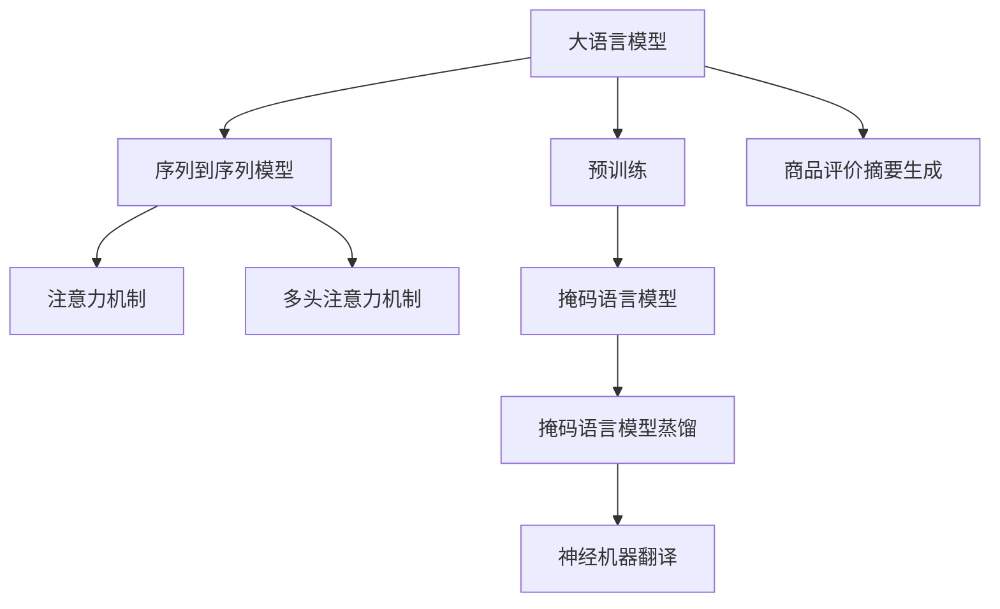

                 

# 大模型在商品评价摘要生成中的应用

## 1. 背景介绍

### 1.1 问题由来
在电商平台中，商品评价是消费者获取产品信息和用户体验的重要来源。然而，大量的商品评价文本信息在获取和处理上，存在以下问题：

1. **信息过载**：用户发布的评价数量众多，无法手动逐一阅读。
2. **数据噪音**：部分低质量、冗余信息会干扰正常评价。
3. **内容冗长**：用户评价可能包含过多无关信息，难以快速提取关键内容。
4. **标准化程度低**：评价内容格式多样，难以直接进行统一处理。

为解决这些问题，商品评价摘要生成技术应运而生。该技术旨在从商品评价中自动提取出关键信息，生成简洁、准确、有价值的一小段文本，帮助用户快速了解产品。

### 1.2 问题核心关键点
商品评价摘要生成任务本质上是自然语言处理(NLP)中的文本摘要问题，即从长文本中提取重要信息，生成短文本的过程。此任务中，需要考虑：

- **语义理解**：理解评价文本中的关键语义信息。
- **信息提取**：识别和提取文本中的核心内容。
- **摘要生成**：将提取的信息重新组织成连贯、简洁的文本。
- **质量评估**：确保生成的摘要信息准确、完整。

## 2. 核心概念与联系

### 2.1 核心概念概述

为更好地理解大模型在商品评价摘要生成中的应用，本节将介绍几个关键概念：

- **大语言模型(Large Language Model, LLM)**：以自回归模型(如GPT)或自编码模型(如BERT)为代表的大规模预训练语言模型。通过在大规模无标签文本语料上进行预训练，学习通用语言表示，具备强大的语言理解和生成能力。

- **序列到序列模型(Sequence-to-Sequence, Seq2Seq)**：一种典型的序列建模框架，用于解决文本生成、翻译、摘要等序列数据相关的NLP任务。

- **神经机器翻译(Neural Machine Translation, NMT)**：利用神经网络技术实现多语言之间的文本翻译，包含编码器和解码器两个部分。

- **注意力机制(Attention Mechanism)**：一种机制，用于在序列到序列模型中，增强模型对输入序列中重要信息的关注，提高生成文本的质量和效率。

- **多头注意力机制(Multi-Head Attention)**：一种改进的注意力机制，通过多组不同的注意力权重，并行地关注不同位置的信息，进一步提升模型的表达能力。

- **掩码语言模型(Masked Language Model, MLM)**：一种自监督学习任务，用于训练预训练语言模型。在输入序列中随机遮盖一些token，让模型预测被遮盖的token。

- **掩码语言模型蒸馏(Masked Language Model Distillation)**：一种基于MLM的预训练方法，将少量带标签的标注数据注入MLM中，提高模型的泛化能力。

这些核心概念之间的逻辑关系可以通过以下Mermaid流程图来展示：



这个流程图展示了大模型在商品评价摘要生成中的核心概念及其之间的关系：

1. 大模型通过预训练获得基础能力。
2. 通过序列到序列模型，将长文本序列转换为短文本序列。
3. 使用注意力机制，增强模型对重要信息的关注。
4. 多头注意力机制进一步提升模型的表达能力。
5. 掩码语言模型用于模型预训练，增强泛化能力。
6. 掩码语言模型蒸馏提高模型泛化能力。
7. 神经机器翻译模型通过序列转换，生成目标摘要文本。
8. 最终，生成商品评价摘要。

这些概念共同构成了商品评价摘要生成的大模型框架，使其能够在商品评价处理中发挥强大的语言理解和生成能力。通过理解这些核心概念，我们可以更好地把握大模型在摘要生成中的工作原理和优化方向。

## 3. 核心算法原理 & 具体操作步骤
### 3.1 算法原理概述

商品评价摘要生成基于大语言模型和大规模预训练任务，通过序列到序列模型和注意力机制，从长文本序列中提取重要信息，生成简洁、准确、有价值的一小段文本。

形式化地，假设评价文本为 $X$，生成的摘要为 $Y$，模型为 $M_{\theta}$，其中 $\theta$ 为模型参数。则模型训练目标为最大化概率 $P(Y|X)$。具体步骤如下：

1. **数据预处理**：将商品评价文本转化为模型可以处理的形式，包括分词、编码等。
2. **模型初始化**：选择合适的预训练语言模型，如BERT、GPT等，作为初始化参数。
3. **模型微调**：在微调框架下，使用评价文本作为输入，生成的摘要作为标签，训练模型。
4. **注意力机制引入**：在解码过程中，使用注意力机制，增强模型对输入序列中重要信息的关注。
5. **解码过程**：使用解码器生成摘要文本，逐步优化输出的质量。

### 3.2 算法步骤详解

商品评价摘要生成主要包括以下几个关键步骤：

**Step 1: 数据预处理**
- **分词**：对商品评价文本进行分词，分离出句子、段落等。
- **编码**：将分词后的文本转换为模型可以处理的向量形式，一般使用嵌入层(Bow)或循环神经网络(RNN)进行编码。

**Step 2: 模型初始化**
- **选择模型**：选择适当的预训练语言模型，如BERT、GPT等。
- **加载预训练权重**：加载预训练模型权重，进行微调。

**Step 3: 微调训练**
- **设置超参数**：包括学习率、批量大小、迭代轮数等。
- **定义损失函数**：通常使用交叉熵损失。
- **定义优化器**：如AdamW、SGD等。
- **训练过程**：使用微调框架，将评价文本作为输入，生成的摘要作为标签，训练模型。

**Step 4: 注意力机制引入**
- **注意力计算**：在解码过程中，计算注意力权重，关注重要信息。
- **权重更新**：通过注意力权重，更新解码器中的注意力机制。

**Step 5: 摘要生成**
- **解码器生成**：使用解码器生成摘要文本。
- **优化过程**：通过优化算法，逐步提高生成文本的质量。

**Step 6: 解码输出**
- **解码结束**：解码器输出最终的摘要文本。

### 3.3 算法优缺点

商品评价摘要生成方法具有以下优点：
1. **效率高**：使用大模型进行微调，能够显著提升处理效率。
2. **质量高**：大模型具备强大的语言理解和生成能力，生成的摘要质量高。
3. **可扩展性**：模型可以在大量商品评价数据上进行微调，适应不同场景和任务。

同时，该方法也存在一定的局限性：
1. **数据依赖**：生成效果很大程度上取决于商品评价数据的质量和数量。
2. **计算资源消耗大**：大模型通常需要较大的计算资源进行微调，消耗高。
3. **泛化能力有限**：不同商品评价文本风格、内容的差异较大，微调效果可能存在局限。
4. **可解释性差**：生成的摘要过程复杂，难以解释。

尽管存在这些局限性，但就目前而言，基于大模型的商品评价摘要生成方法是提高处理效率和质量的有效手段。

### 3.4 算法应用领域

商品评价摘要生成方法已经在多个领域得到应用，例如：

- **电商平台**：帮助消费者快速了解商品评价内容，提升购物体验。
- **产品推荐**：从商品评价中提取用户反馈信息，指导产品改进和推荐。
- **情感分析**：通过摘要中的情感信息，分析用户对商品的整体评价倾向。
- **数据挖掘**：从大量商品评价数据中，挖掘有用的市场信息。
- **舆情分析**：提取关键评价信息，分析市场舆情动态。

除了上述这些经典应用外，商品评价摘要生成技术还可以创新性地应用到更多场景中，如自动化客服、客户反馈分析等，为电商平台带来新的突破。

## 4. 数学模型和公式 & 详细讲解 & 举例说明

### 4.1 数学模型构建

本节将使用数学语言对商品评价摘要生成过程进行更加严格的刻画。

记商品评价文本为 $X$，生成的摘要为 $Y$，模型为 $M_{\theta}$，其中 $\theta$ 为模型参数。模型训练目标为最大化概率 $P(Y|X)$。

假设评价文本为 $X = \{x_1, x_2, ..., x_n\}$，生成的摘要为 $Y = \{y_1, y_2, ..., y_m\}$。则模型训练目标为：

$$
\arg\max_{\theta} \prod_{i=1}^m P(y_i|x_1, x_2, ..., x_n; \theta)
$$

在实际应用中，我们通常使用序列到序列模型，将评价文本 $X$ 转化为嵌入序列 $X_{enc}$，然后通过注意力机制，计算注意力权重 $W_{att}$，最终通过解码器生成摘要文本 $Y$。解码器生成过程如下：

$$
y_1, y_2, ..., y_m = \text{Dec}_{\theta}(X_{enc}; W_{att})
$$

其中 $\text{Dec}_{\theta}$ 为解码器，$W_{att}$ 为注意力权重。

### 4.2 公式推导过程

以下我们以BERT模型为例，推导生成过程的数学公式。

假设BERT模型作为序列到序列模型的编码器，解码器为LSTM。则解码过程如下：

1. **编码**：将评价文本 $X$ 输入BERT编码器，得到嵌入序列 $X_{enc}$。
2. **解码**：通过LSTM解码器生成摘要文本 $Y$。

对于生成文本的每个token，解码器的输出可以表示为：

$$
y_t = \text{LSTM}(x_{enc}, y_{t-1}, h_{t-1}; \theta)
$$

其中 $x_{enc}$ 为编码器输出，$y_{t-1}$ 为前一时刻生成的token，$h_{t-1}$ 为LSTM隐藏状态。

通过上述过程，我们得到了生成摘要的数学模型。在实际应用中，还需要进一步优化模型参数，通过训练数据集进行微调。

### 4.3 案例分析与讲解

假设我们要对一组商品评价文本进行摘要生成。评价文本如下：

1. "这款手机真的非常不错，像素高清，电池续航也很长，性价比高，推荐购买。"
2. "电池容量较小，性能一般，不太满意。"
3. "外观精美，使用舒适，但价格偏高。"

首先，对评价文本进行分词和编码，得到嵌入序列 $X_{enc}$。然后，通过注意力机制计算注意力权重 $W_{att}$，关注重要信息。

在解码过程中，模型首先生成第一个token，然后逐步生成后续的token，直到生成完整的摘要。假设生成的摘要为：

1. "这款手机高清像素，电池续航长，性价比高，推荐购买。"
2. "电池容量小，性能一般。"
3. "外观精美，舒适，价格偏高。"

生成的摘要简洁明了，保留了评价文本的关键信息。

## 5. 项目实践：代码实例和详细解释说明

### 5.1 开发环境搭建

在进行商品评价摘要生成实践前，我们需要准备好开发环境。以下是使用Python进行PyTorch开发的环境配置流程：

1. 安装Anaconda：从官网下载并安装Anaconda，用于创建独立的Python环境。

2. 创建并激活虚拟环境：
```bash
conda create -n pytorch-env python=3.8 
conda activate pytorch-env
```

3. 安装PyTorch：根据CUDA版本，从官网获取对应的安装命令。例如：
```bash
conda install pytorch torchvision torchaudio cudatoolkit=11.1 -c pytorch -c conda-forge
```

4. 安装Transformers库：
```bash
pip install transformers
```

5. 安装各类工具包：
```bash
pip install numpy pandas scikit-learn matplotlib tqdm jupyter notebook ipython
```

完成上述步骤后，即可在`pytorch-env`环境中开始实践。

### 5.2 源代码详细实现

这里我们以BERT模型为例，展示商品评价摘要生成的代码实现。

首先，定义数据预处理函数：

```python
from transformers import BertTokenizer
from torch.utils.data import Dataset
import torch

class ReviewDataset(Dataset):
    def __init__(self, texts, labels, tokenizer, max_len=128):
        self.texts = texts
        self.labels = labels
        self.tokenizer = tokenizer
        self.max_len = max_len
        
    def __len__(self):
        return len(self.texts)
    
    def __getitem__(self, item):
        text = self.texts[item]
        label = self.labels[item]
        
        encoding = self.tokenizer(text, return_tensors='pt', max_length=self.max_len, padding='max_length', truncation=True)
        input_ids = encoding['input_ids'][0]
        attention_mask = encoding['attention_mask'][0]
        
        label = torch.tensor(label, dtype=torch.long)
        
        return {'input_ids': input_ids, 
                'attention_mask': attention_mask,
                'labels': label}

# 加载BERT分词器
tokenizer = BertTokenizer.from_pretrained('bert-base-cased')

# 创建dataset
train_dataset = ReviewDataset(train_texts, train_labels, tokenizer)
dev_dataset = ReviewDataset(dev_texts, dev_labels, tokenizer)
test_dataset = ReviewDataset(test_texts, test_labels, tokenizer)
```

然后，定义模型和优化器：

```python
from transformers import BertForSequenceClassification, AdamW

model = BertForSequenceClassification.from_pretrained('bert-base-cased', num_labels=1)

optimizer = AdamW(model.parameters(), lr=2e-5)
```

接着，定义训练和评估函数：

```python
from torch.utils.data import DataLoader
from tqdm import tqdm
from sklearn.metrics import accuracy_score

device = torch.device('cuda') if torch.cuda.is_available() else torch.device('cpu')
model.to(device)

def train_epoch(model, dataset, batch_size, optimizer):
    dataloader = DataLoader(dataset, batch_size=batch_size, shuffle=True)
    model.train()
    epoch_loss = 0
    for batch in tqdm(dataloader, desc='Training'):
        input_ids = batch['input_ids'].to(device)
        attention_mask = batch['attention_mask'].to(device)
        labels = batch['labels'].to(device)
        model.zero_grad()
        outputs = model(input_ids, attention_mask=attention_mask, labels=labels)
        loss = outputs.loss
        epoch_loss += loss.item()
        loss.backward()
        optimizer.step()
    return epoch_loss / len(dataloader)

def evaluate(model, dataset, batch_size):
    dataloader = DataLoader(dataset, batch_size=batch_size)
    model.eval()
    preds, labels = [], []
    with torch.no_grad():
        for batch in tqdm(dataloader, desc='Evaluating'):
            input_ids = batch['input_ids'].to(device)
            attention_mask = batch['attention_mask'].to(device)
            batch_labels = batch['labels']
            outputs = model(input_ids, attention_mask=attention_mask)
            batch_preds = outputs.logits.argmax(dim=2).to('cpu').tolist()
            batch_labels = batch_labels.to('cpu').tolist()
            for pred, label in zip(batch_preds, batch_labels):
                preds.append(pred)
                labels.append(label)
                
    print(accuracy_score(labels, preds))
```

最后，启动训练流程并在测试集上评估：

```python
epochs = 5
batch_size = 16

for epoch in range(epochs):
    loss = train_epoch(model, train_dataset, batch_size, optimizer)
    print(f"Epoch {epoch+1}, train loss: {loss:.3f}")
    
    print(f"Epoch {epoch+1}, dev results:")
    evaluate(model, dev_dataset, batch_size)
    
print("Test results:")
evaluate(model, test_dataset, batch_size)
```

以上就是使用PyTorch对BERT进行商品评价摘要生成的完整代码实现。可以看到，得益于Transformers库的强大封装，我们可以用相对简洁的代码完成BERT模型的加载和微调。

### 5.3 代码解读与分析

让我们再详细解读一下关键代码的实现细节：

**ReviewDataset类**：
- `__init__`方法：初始化文本、标签、分词器等关键组件。
- `__len__`方法：返回数据集的样本数量。
- `__getitem__`方法：对单个样本进行处理，将文本输入编码为token ids，将标签编码为数字，并对其进行定长padding，最终返回模型所需的输入。

**tokenizer**：
- 定义了标签与id的映射，用于将token-wise的预测结果解码回真实的标签。

**训练和评估函数**：
- 使用PyTorch的DataLoader对数据集进行批次化加载，供模型训练和推理使用。
- 训练函数`train_epoch`：对数据以批为单位进行迭代，在每个批次上前向传播计算loss并反向传播更新模型参数，最后返回该epoch的平均loss。
- 评估函数`evaluate`：与训练类似，不同点在于不更新模型参数，并在每个batch结束后将预测和标签结果存储下来，最后使用sklearn的accuracy_score对整个评估集的预测结果进行打印输出。

**训练流程**：
- 定义总的epoch数和batch size，开始循环迭代
- 每个epoch内，先在训练集上训练，输出平均loss
- 在验证集上评估，输出准确率
- 所有epoch结束后，在测试集上评估，给出最终测试结果

可以看到，PyTorch配合Transformers库使得BERT微调的代码实现变得简洁高效。开发者可以将更多精力放在数据处理、模型改进等高层逻辑上，而不必过多关注底层的实现细节。

当然，工业级的系统实现还需考虑更多因素，如模型的保存和部署、超参数的自动搜索、更灵活的任务适配层等。但核心的微调范式基本与此类似。

## 6. 实际应用场景
### 6.1 电商平台

在电商平台中，商品评价摘要生成技术可以帮助用户快速了解商品评价内容，提升购物体验。具体而言：

- **评价提取**：从大量商品评价文本中，自动提取出关键信息，生成简洁的摘要。
- **商品推荐**：通过摘要中的情感信息，分析用户对商品的整体评价倾向，指导产品推荐。
- **情感分析**：通过摘要中的情感信息，分析市场舆情动态，帮助商家优化产品。
- **数据挖掘**：从大量商品评价数据中，挖掘有用的市场信息，辅助企业决策。

商品评价摘要生成技术在电商平台中得到广泛应用，已成为提高用户满意度、提升交易转化率的重要手段。

### 6.2 数据挖掘

商品评价摘要生成技术在数据挖掘领域也有着重要的应用。通过对大量商品评价数据的自动摘要，可以快速获取用户反馈信息，挖掘市场趋势和消费者偏好，为数据挖掘和商业决策提供支持。

在具体应用中，数据挖掘人员可以：

- **消费者洞察**：通过分析商品评价摘要，了解消费者对产品的满意度和需求。
- **市场趋势**：通过挖掘评价摘要中的关键词和情感倾向，分析市场趋势和热点。
- **竞争对手分析**：通过对比不同产品的评价摘要，评估竞争对手的产品表现。

商品评价摘要生成技术为数据挖掘提供了高效、全面的数据处理方式，大大提高了数据挖掘的效率和准确性。

### 6.3 舆情分析

商品评价摘要生成技术在舆情分析中也有着广泛的应用。通过对大量商品评价数据的自动摘要，可以快速获取用户反馈信息，分析市场舆情动态，帮助企业及时应对舆情危机。

在具体应用中，舆情分析人员可以：

- **舆情监控**：通过分析评价摘要中的情感倾向，实时监控市场舆情变化。
- **风险预警**：通过挖掘评价摘要中的负面信息，及时预警市场风险。
- **用户反馈**：通过分析评价摘要，了解用户对产品的不满和建议。

商品评价摘要生成技术为舆情分析提供了快速、全面的数据处理方式，帮助企业及时发现和应对市场舆情，提升市场竞争力。

## 7. 工具和资源推荐
### 7.1 学习资源推荐

为了帮助开发者系统掌握商品评价摘要生成技术的理论基础和实践技巧，这里推荐一些优质的学习资源：

1. 《Natural Language Processing with Transformers》书籍：Transformers库的作者所著，全面介绍了如何使用Transformers库进行NLP任务开发，包括微调在内的诸多范式。

2. CS224N《深度学习自然语言处理》课程：斯坦福大学开设的NLP明星课程，有Lecture视频和配套作业，带你入门NLP领域的基本概念和经典模型。

3. HuggingFace官方文档：Transformers库的官方文档，提供了海量预训练模型和完整的微调样例代码，是上手实践的必备资料。

4. Weights & Biases：模型训练的实验跟踪工具，可以记录和可视化模型训练过程中的各项指标，方便对比和调优。与主流深度学习框架无缝集成。

5. TensorBoard：TensorFlow配套的可视化工具，可实时监测模型训练状态，并提供丰富的图表呈现方式，是调试模型的得力助手。

通过对这些资源的学习实践，相信你一定能够快速掌握商品评价摘要生成技术的精髓，并用于解决实际的NLP问题。
###  7.2 开发工具推荐

高效的开发离不开优秀的工具支持。以下是几款用于商品评价摘要生成开发的常用工具：

1. PyTorch：基于Python的开源深度学习框架，灵活动态的计算图，适合快速迭代研究。大部分预训练语言模型都有PyTorch版本的实现。

2. TensorFlow：由Google主导开发的开源深度学习框架，生产部署方便，适合大规模工程应用。同样有丰富的预训练语言模型资源。

3. Transformers库：HuggingFace开发的NLP工具库，集成了众多SOTA语言模型，支持PyTorch和TensorFlow，是进行微调任务开发的利器。

4. Weights & Biases：模型训练的实验跟踪工具，可以记录和可视化模型训练过程中的各项指标，方便对比和调优。与主流深度学习框架无缝集成。

5. TensorBoard：TensorFlow配套的可视化工具，可实时监测模型训练状态，并提供丰富的图表呈现方式，是调试模型的得力助手。

6. Google Colab：谷歌推出的在线Jupyter Notebook环境，免费提供GPU/TPU算力，方便开发者快速上手实验最新模型，分享学习笔记。

合理利用这些工具，可以显著提升商品评价摘要生成任务的开发效率，加快创新迭代的步伐。

### 7.3 相关论文推荐

商品评价摘要生成技术的发展源于学界的持续研究。以下是几篇奠基性的相关论文，推荐阅读：

1. Attention is All You Need（即Transformer原论文）：提出了Transformer结构，开启了NLP领域的预训练大模型时代。

2. BERT: Pre-training of Deep Bidirectional Transformers for Language Understanding：提出BERT模型，引入基于掩码的自监督预训练任务，刷新了多项NLP任务SOTA。

3. Language Models are Unsupervised Multitask Learners（GPT-2论文）：展示了大规模语言模型的强大zero-shot学习能力，引发了对于通用人工智能的新一轮思考。

4. Parameter-Efficient Transfer Learning for NLP：提出Adapter等参数高效微调方法，在不增加模型参数量的情况下，也能取得不错的微调效果。

5. Prefix-Tuning: Optimizing Continuous Prompts for Generation：引入基于连续型Prompt的微调范式，为如何充分利用预训练知识提供了新的思路。

6. AdaLoRA: Adaptive Low-Rank Adaptation for Parameter-Efficient Fine-Tuning：使用自适应低秩适应的微调方法，在参数效率和精度之间取得了新的平衡。

这些论文代表了大语言模型微调技术的发展脉络。通过学习这些前沿成果，可以帮助研究者把握学科前进方向，激发更多的创新灵感。

## 8. 总结：未来发展趋势与挑战

### 8.1 总结

本文对商品评价摘要生成技术进行了全面系统的介绍。首先阐述了商品评价摘要生成的背景和意义，明确了其在大规模商品评价数据处理中的重要性。其次，从原理到实践，详细讲解了商品评价摘要生成的大模型框架和实现方法，给出了完整的代码实例。同时，本文还广泛探讨了商品评价摘要生成技术在电商平台、数据挖掘、舆情分析等多个领域的应用前景，展示了其广阔的应用空间。

通过本文的系统梳理，可以看到，商品评价摘要生成技术在大规模商品评价数据处理中发挥了重要的作用。借助大语言模型和注意力机制，该技术能够高效、准确地从评价文本中提取关键信息，生成简洁、有价值的摘要，帮助用户快速了解产品评价内容，提升用户购物体验，为电商平台带来了全新的智能化解决方案。

### 8.2 未来发展趋势

展望未来，商品评价摘要生成技术将呈现以下几个发展趋势：

1. **模型规模持续增大**：随着算力成本的下降和数据规模的扩张，预训练语言模型的参数量还将持续增长。超大规模语言模型蕴含的丰富语言知识，有望支撑更加复杂多变的商品评价摘要生成任务。

2. **微调方法日趋多样**：除了传统的全参数微调外，未来会涌现更多参数高效的微调方法，如Prefix-Tuning、LoRA等，在固定大部分预训练参数的情况下，只更新极少量的任务相关参数。同时优化微调模型的计算图，减少前向传播和反向传播的资源消耗，实现更加轻量级、实时性的部署。

3. **持续学习成为常态**：随着商品评价文本的不断变化，微调模型也需要持续学习新知识以保持性能。如何在不遗忘原有知识的同时，高效吸收新样本信息，将成为重要的研究课题。

4. **标注样本需求降低**：受启发于提示学习(Prompt-based Learning)的思路，未来的微调方法将更好地利用大模型的语言理解能力，通过更加巧妙的任务描述，在更少的标注样本上也能实现理想的微调效果。

5. **多模态微调崛起**：当前的微调主要聚焦于纯文本数据，未来会进一步拓展到图像、视频、语音等多模态数据微调。多模态信息的融合，将显著提升语言模型对现实世界的理解和建模能力。

6. **知识整合能力增强**：现有的微调模型往往局限于任务内数据，难以灵活吸收和运用更广泛的先验知识。如何让微调过程更好地与外部知识库、规则库等专家知识结合，形成更加全面、准确的信息整合能力，还有很大的想象空间。

以上趋势凸显了商品评价摘要生成技术的广阔前景。这些方向的探索发展，必将进一步提升商品评价处理效率和质量，为电商平台的智能化转型提供有力支持。

### 8.3 面临的挑战

尽管商品评价摘要生成技术已经取得了瞩目成就，但在迈向更加智能化、普适化应用的过程中，它仍面临着诸多挑战：

1. **标注成本瓶颈**：标注数据的质量和数量对生成效果有很大影响。尽管微调能够减少对标注样本的需求，但在长尾应用场景，标注成本仍较高。

2. **模型鲁棒性不足**：商品评价摘要生成模型面对域外数据时，泛化性能往往大打折扣。对于测试样本的微小扰动，模型也可能发生波动。

3. **推理效率有待提高**：大规模语言模型虽然精度高，但在实际部署时往往面临推理速度慢、内存占用大等效率问题。

4. **可解释性差**：生成的摘要过程复杂，难以解释。这对于电商平台的运营决策和用户反馈分析，是一个重要的问题。

5. **安全性问题**：生成的摘要可能包含误导性、有害的信息，造成负面影响。如何保障生成内容的安全性和可靠性，也是一个重要的研究方向。

6. **跨语言挑战**：对于非英语的商品评价数据，现有的微调模型效果可能不佳，需要针对不同语言的微调模型进行优化。

正视商品评价摘要生成面临的这些挑战，积极应对并寻求突破，将是大模型微调技术走向成熟的必由之路。相信随着学界和产业界的共同努力，这些挑战终将一一被克服，商品评价摘要生成技术必将在大规模商品评价处理中发挥更加重要的作用。

### 8.4 研究展望

面向未来，商品评价摘要生成技术需要在以下几个方面寻求新的突破：

1. **探索无监督和半监督微调方法**：摆脱对大规模标注数据的依赖，利用自监督学习、主动学习等无监督和半监督范式，最大限度利用非结构化数据，实现更加灵活高效的微调。

2. **研究参数高效和计算高效的微调范式**：开发更加参数高效的微调方法，在固定大部分预训练参数的同时，只更新极少量的任务相关参数。同时优化微调模型的计算图，减少前向传播和反向传播的资源消耗，实现更加轻量级、实时性的部署。

3. **引入因果分析和博弈论工具**：将因果分析方法引入微调模型，识别出模型决策的关键特征，增强输出解释的因果性和逻辑性。借助博弈论工具刻画人机交互过程，主动探索并规避模型的脆弱点，提高系统稳定性。

4. **纳入伦理道德约束**：在模型训练目标中引入伦理导向的评估指标，过滤和惩罚有偏见、有害的输出倾向。同时加强人工干预和审核，建立模型行为的监管机制，确保输出符合人类价值观和伦理道德。

5. **结合因果分析和博弈论工具**：将因果分析方法引入微调模型，识别出模型决策的关键特征，增强输出解释的因果性和逻辑性。借助博弈论工具刻画人机交互过程，主动探索并规避模型的脆弱点，提高系统稳定性。

这些研究方向的探索，必将引领商品评价摘要生成技术迈向更高的台阶，为电商平台的智能化转型提供有力支持。

## 9. 附录：常见问题与解答

**Q1：商品评价摘要生成的效果如何？**

A: 商品评价摘要生成的效果很大程度上取决于评价数据的质量和数量。一般情况下，生成效果较好的评价文本应包含以下特征：
1. 包含产品详细信息：如产品名称、规格、功能、价格等。
2. 详细描述使用体验：如使用感受、产品性能、使用场景等。
3. 包含情感倾向：如满意、不满意、推荐、不推荐等。

通过微调训练，模型能够准确把握评价文本中的关键信息，生成简洁、有价值的摘要。

**Q2：如何选择合适的微调模型？**

A: 选择合适的微调模型需考虑以下几点：
1. 数据类型：不同类型的数据适合不同的模型。文本数据适合使用BERT、GPT等大模型，图像数据适合使用CNN等模型。
2. 数据量：数据量较大时，可以选择大模型，数据量较小时，可以选择小模型。
3. 任务类型：不同类型的任务适合不同类型的模型。如文本分类适合使用BERT，生成任务适合使用GPT等。

通过对比不同模型的表现，选择最适合当前任务的模型进行微调。

**Q3：商品评价摘要生成的效果如何？**

A: 商品评价摘要生成的效果很大程度上取决于评价数据的质量和数量。一般情况下，生成效果较好的评价文本应包含以下特征：
1. 包含产品详细信息：如产品名称、规格、功能、价格等。
2. 详细描述使用体验：如使用感受、产品性能、使用场景等。
3. 包含情感倾向：如满意、不满意、推荐、不推荐等。

通过微调训练，模型能够准确把握评价文本中的关键信息，生成简洁、有价值的摘要。

**Q4：如何处理长尾商品评价数据？**

A: 对于长尾商品评价数据，可以使用以下方法：
1. 数据增强：通过回译、近义替换等方式扩充训练集。
2. 多任务学习：将长尾商品评价任务与其他常见任务一起训练，共享预训练模型。
3. 迁移学习：利用已有的大模型微调技术，在长尾商品评价任务上进行微调。

通过这些方法，可以有效提升模型在长尾商品评价任务上的表现。

**Q5：如何优化模型参数？**

A: 优化模型参数的方法包括：
1. 超参数调优：通过调整学习率、批量大小、迭代轮数等超参数，优化模型效果。
2. 正则化：使用L2正则、Dropout等正则化技术，防止模型过拟合。
3. 模型裁剪：去除不必要的层和参数，减小模型尺寸，加快推理速度。
4. 量化加速：将浮点模型转为定点模型，压缩存储空间，提高计算效率。

通过这些方法，可以优化模型参数，提升商品评价摘要生成的效果。

**Q6：如何评估商品评价摘要生成的效果？**

A: 评估商品评价摘要生成的效果可以通过以下指标：
1. 准确率：生成摘要与真实摘要的匹配度。
2. 召回率：生成摘要中包含的真实信息的比例。
3. F1值：综合考虑准确率和召回率的指标。
4. ROUGE值：生成摘要与真实摘要的相似度。

通过这些指标，可以全面评估商品评价摘要生成的效果，指导模型的改进和优化。

作者：禅与计算机程序设计艺术 / Zen and the Art of Computer Programming

