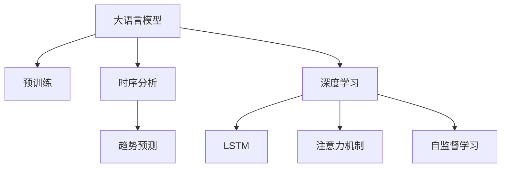

                 

# 大模型在商品趋势预测中的时序分析应用

> 关键词：大语言模型,时序分析,趋势预测,商品推荐,深度学习,长短期记忆网络(LSTM),注意力机制,Transformer,自监督学习

## 1. 背景介绍

### 1.1 问题由来
在现代商业活动中，商品趋势预测是一项至关重要的任务。通过准确的趋势预测，商家可以提前调整商品供应，制定营销策略，从而提高销售额和市场竞争力。传统的商品趋势预测方法依赖于统计模型和专家知识，但在处理大规模、复杂数据时存在局限性。近年来，深度学习技术和大模型在处理时间序列数据方面展现出巨大潜力，为商品趋势预测带来了新的思路。

### 1.2 问题核心关键点
商品趋势预测的核心在于从历史数据中学习并预测未来商品的需求趋势。现代大模型利用深度学习技术，通过端到端的训练过程，可以从原始数据中自动学习到复杂的非线性关系，从而实现更加精准的预测。大模型在商品趋势预测中的应用主要包括以下几个方面：

1. **数据处理**：大模型能够处理高维度的商品信息，如价格、销量、库存、客户评价等。
2. **时序分析**：大模型利用时序分析方法，学习时间序列数据中的模式和规律，从而预测未来趋势。
3. **模型迁移**：大模型可以迁移到不同商品类别和市场环境，提升预测的泛化能力。
4. **多模态融合**：大模型可以融合多模态数据，如文本、图像、视频等，增强预测的准确性和完整性。
5. **自监督学习**：大模型可以利用无标签数据进行预训练，增强模型的泛化能力和鲁棒性。

## 2. 核心概念与联系

### 2.1 核心概念概述

为更好地理解大模型在商品趋势预测中的应用，本节将介绍几个密切相关的核心概念：

- 大语言模型(Large Language Model, LLM)：以自回归(如GPT)或自编码(如BERT)模型为代表的大规模预训练语言模型。通过在大规模无标签文本语料上进行预训练，学习通用的语言表示，具备强大的语言理解和生成能力。
- 时序分析(_Time Series Analysis_)：利用时间序列数据，通过统计学或机器学习的方法，分析和预测未来的变化趋势。
- 商品趋势预测(_Merchandise Trend Prediction_)：通过对商品历史销量、价格、促销等数据进行分析，预测未来一段时间内商品的需求趋势。
- 深度学习(Deep Learning)：一种基于多层神经网络的机器学习技术，能够自动提取数据的高级特征，并用于解决复杂的预测问题。
- 长短期记忆网络(Long Short-Term Memory, LSTM)：一种特殊的递归神经网络(RNN)，能够有效处理长序列数据，适用于时序数据分析。
- 注意力机制(Attention Mechanism)：一种用于增强网络模型处理序列数据的能力的技术，能够自适应地关注序列中重要部分。
- 自监督学习(Self-Supervised Learning)：通过利用未标注数据进行训练，学习模型在无监督条件下的表示能力，提升模型的泛化能力。

这些核心概念之间的逻辑关系可以通过以下Mermaid流程图来展示：



这个流程图展示了大语言模型的核心概念及其之间的关系：

1. 大语言模型通过预训练获得基础能力。
2. 时序分析是处理时间序列数据的关键技术，有助于学习序列中的模式和规律。
3. 趋势预测利用时序分析结果，预测商品未来的需求趋势。
4. 深度学习是实现时序分析、趋势预测等任务的重要手段。
5. LSTM和注意力机制是深度学习中处理序列数据的重要工具。
6. 自监督学习是增强深度学习模型泛化能力和鲁棒性的重要方法。

## 3. 核心算法原理 & 具体操作步骤
### 3.1 算法原理概述

大模型在商品趋势预测中的应用，主要依赖于时序分析和深度学习技术。其核心思想是：利用大模型学习时间序列数据中的模式和规律，通过历史数据预测未来的商品需求趋势。

形式化地，假设历史商品销售数据为 $D_t=\{(x_i, y_i)\}_{i=1}^N$，其中 $x_i$ 表示时间 $t$ 时的商品销量，$y_i$ 表示时间 $t+1$ 时的销量。模型的目标是学习函数 $f$，使得 $f(x_t) \approx y_t$，从而预测未来时间点的销量。

大模型在商品趋势预测中的应用主要包括以下几个关键步骤：

- **Step 1: 准备数据集**
- **Step 2: 设计时序分析模型**
- **Step 3: 构建趋势预测模型**
- **Step 4: 执行训练和预测**

### 3.2 算法步骤详解

**Step 1: 准备数据集**

商品趋势预测的数据集通常包含时间序列、商品特征、用户行为等多维信息。在构建数据集时，需要注意以下几点：

- **时间序列**：以天、周、月等固定周期为单位，记录每个时间点的销量、价格等信息。
- **商品特征**：记录商品的分类、品牌、价格等属性。
- **用户行为**：记录用户的购买历史、评价等行为信息。
- **数据清洗**：处理缺失值、异常值等数据质量问题。
- **数据归一化**：将数据缩放到[0,1]或[-1,1]范围内，方便模型的训练。

**Step 2: 设计时序分析模型**

时序分析模型主要利用LSTM等递归神经网络，学习时间序列数据中的模式和规律。常用的时序分析模型包括：

- **LSTM**：一种特殊的递归神经网络，能够有效处理长序列数据，适用于时序数据分析。
- **GRU**：门控循环单元，与LSTM类似，但参数更少，训练速度更快。
- **RNN**：标准递归神经网络，适用于处理短序列数据。
- **TCN**：卷积时序网络，利用卷积操作替代递归操作，加速训练过程。

LSTM模型的基本结构如下：

$$
h_t = \tanh(W_{ih}x_t + W_{hh}h_{t-1} + b_h) \\
i_t = \sigma(W_{ih}x_t + W_{hh}h_{t-1} + b_h) \\
f_t = \sigma(W_{if}x_t + W_{hf}h_{t-1} + b_f) \\
o_t = \sigma(W_{io}x_t + W_{ho}h_{t-1} + b_o) \\
c_t = f_t \odot c_{t-1} + i_t \odot \tanh(h_t) \\
h_t = o_t \odot \tanh(c_t)
$$

其中 $x_t$ 表示时间 $t$ 的输入数据，$h_t$ 表示时间 $t$ 的隐状态，$c_t$ 表示时间 $t$ 的记忆单元。

**Step 3: 构建趋势预测模型**

趋势预测模型通常利用LSTM等时序分析模型，结合线性回归、softmax等预测层，输出未来销量或概率分布。常用的趋势预测模型包括：

- **线性回归**：适用于连续性数据的预测，输出未来销量。
- **softmax**：适用于分类任务的预测，输出不同类别的概率分布。
- **GAN**：生成对抗网络，生成未来销量的样本数据。

假设时序分析模型的输出为 $h_t$，趋势预测模型的输出为 $\hat{y}_t$，则预测模型可以表示为：

$$
\hat{y}_t = f(h_t)
$$

其中 $f$ 为预测函数，可以采用线性回归、softmax等。

**Step 4: 执行训练和预测**

训练和预测过程主要包括以下几个步骤：

- **训练过程**：利用历史数据 $D_t$ 对模型进行训练，最小化预测误差。常用的损失函数包括均方误差(MSE)、交叉熵损失等。
- **预测过程**：利用训练好的模型对新数据进行预测，输出未来销量的估计值或概率分布。

### 3.3 算法优缺点

大模型在商品趋势预测中的应用具有以下优点：

- **数据处理能力强**：能够处理高维度的商品信息，自动提取数据中的复杂特征。
- **时序分析准确**：利用LSTM等时序分析模型，能够捕捉时间序列数据中的长期依赖关系。
- **模型迁移能力强**：通过迁移学习，大模型可以应用于不同商品类别和市场环境，提升预测的泛化能力。
- **预测精度高**：利用深度学习技术，能够学习复杂模式和规律，提升预测的准确性。

但大模型在商品趋势预测中也存在一些局限性：

- **数据需求高**：需要大量的历史数据进行预训练，获取高质量数据成本较高。
- **模型复杂**：大模型参数量庞大，训练和推理耗时较长。
- **过拟合风险**：模型参数过多可能导致过拟合，需要采用正则化等技术进行控制。
- **模型可解释性差**：大模型通常是"黑盒"系统，难以解释其内部工作机制和决策逻辑。
- **计算资源要求高**：大模型的训练和推理需要高性能的GPU或TPU设备。

尽管存在这些局限性，但大模型在商品趋势预测中仍展现出巨大的潜力和优势，是现代商业智能的重要工具。

### 3.4 算法应用领域

大模型在商品趋势预测中的应用广泛，涵盖了电商、零售、物流等多个领域。以下是几个典型应用场景：

- **电商推荐系统**：通过分析用户的购买历史、浏览行为等数据，预测用户未来的购买需求，推荐合适的商品。
- **库存管理**：利用趋势预测模型，预测商品未来的销量，优化库存管理，避免断货或积压。
- **价格优化**：通过预测商品的未来销量和市场趋势，制定合适的定价策略，提升销售额。
- **市场分析**：利用趋势预测模型，分析市场趋势和用户需求，指导市场策略的制定。

## 4. 数学模型和公式 & 详细讲解 & 举例说明
### 4.1 数学模型构建

假设商品历史销售数据为 $D_t=\{(x_i, y_i)\}_{i=1}^N$，其中 $x_i$ 表示时间 $t$ 的销量，$y_i$ 表示时间 $t+1$ 的销量。大模型在商品趋势预测中的应用，主要依赖于以下数学模型：

- **时序分析模型**：利用LSTM等递归神经网络，学习时间序列数据中的模式和规律。
- **趋势预测模型**：利用线性回归、softmax等预测层，输出未来销量或概率分布。

假设LSTM模型在时间 $t$ 的隐状态为 $h_t$，趋势预测模型的输出为 $\hat{y}_t$，则预测模型可以表示为：

$$
\hat{y}_t = f(h_t)
$$

其中 $f$ 为预测函数，可以采用线性回归、softmax等。

### 4.2 公式推导过程

以线性回归模型为例，假设LSTM模型在时间 $t$ 的输出为 $h_t$，预测模型的输出为 $\hat{y}_t$，则线性回归模型的公式为：

$$
\hat{y}_t = W_hh_t + b_h
$$

其中 $W_h$ 和 $b_h$ 为模型的权重和偏置项。

假设时序分析模型利用LSTM进行训练，则LSTM模型的梯度更新公式为：

$$
\frac{\partial \mathcal{L}}{\partial W_{ih}} = \sum_{t=1}^N \frac{\partial \mathcal{L}}{\partial h_t} \frac{\partial h_t}{\partial W_{ih}} \\
\frac{\partial \mathcal{L}}{\partial b_h} = \sum_{t=1}^N \frac{\partial \mathcal{L}}{\partial h_t}
$$

其中 $\mathcal{L}$ 为损失函数，可以通过反向传播算法高效计算。

### 4.3 案例分析与讲解

以下通过一个简单的例子，展示大模型在商品趋势预测中的应用：

假设有一家电商公司，收集了过去一年的商品销售数据，记录了每个月的销量和价格信息。公司希望预测未来一个月的销量，以便制定相应的营销策略。

1. **数据准备**：收集过去一年的月销量和价格数据，去除缺失值和异常值，进行归一化处理。
2. **时序分析模型训练**：利用LSTM模型，训练时间序列数据，学习月销量的长期依赖关系。
3. **趋势预测模型训练**：利用线性回归模型，训练预测模型，预测未来一个月的销量。
4. **模型评估**：在测试集上评估模型性能，对比预测值和真实值，计算误差。
5. **预测应用**：利用训练好的模型，预测未来一个月的销量，指导库存管理和价格优化。

通过这个例子，可以看到大模型在商品趋势预测中的应用流程：数据准备、时序分析模型训练、趋势预测模型训练、模型评估和预测应用。每个步骤都需要精细的设计和实现，才能得到理想的预测结果。

## 5. 项目实践：代码实例和详细解释说明
### 5.1 开发环境搭建

在进行商品趋势预测项目时，需要先准备好开发环境。以下是使用Python进行TensorFlow开发的环境配置流程：

1. 安装Anaconda：从官网下载并安装Anaconda，用于创建独立的Python环境。

2. 创建并激活虚拟环境：
```bash
conda create -n tf-env python=3.8 
conda activate tf-env
```

3. 安装TensorFlow：根据CUDA版本，从官网获取对应的安装命令。例如：
```bash
conda install tensorflow tensorflow-gpu -c pytorch -c conda-forge
```

4. 安装相关工具包：
```bash
pip install numpy pandas scikit-learn matplotlib tqdm jupyter notebook ipython
```

完成上述步骤后，即可在`tf-env`环境中开始商品趋势预测项目。

### 5.2 源代码详细实现

以下是一个简单的商品趋势预测项目，展示如何使用TensorFlow进行LSTM模型的训练和预测：

```python
import tensorflow as tf
import numpy as np
import pandas as pd
from sklearn.model_selection import train_test_split
from tensorflow.keras.models import Sequential
from tensorflow.keras.layers import LSTM, Dense, Dropout

# 数据准备
data = pd.read_csv('sales_data.csv', index_col='Date')
data = data.dropna().reset_index(drop=True)

# 数据归一化
data['Sales'] = (data['Sales'] - np.mean(data['Sales'])) / np.std(data['Sales'])
data['Date'] = pd.to_datetime(data['Date']).astype(int) / 1000000

# 划分训练集和测试集
train_data, test_data = train_test_split(data, test_size=0.2, random_state=42)

# 构建模型
model = Sequential()
model.add(LSTM(128, input_shape=(train_data.shape[1], 1), return_sequences=True))
model.add(Dropout(0.2))
model.add(LSTM(64, return_sequences=True))
model.add(Dropout(0.2))
model.add(LSTM(32))
model.add(Dropout(0.2))
model.add(Dense(1))

# 编译模型
model.compile(optimizer='adam', loss='mse')

# 训练模型
model.fit(train_data.drop(['Sales'], axis=1), train_data['Sales'], epochs=50, batch_size=32, validation_split=0.2)

# 预测未来销量
future_data = pd.DataFrame({'Date': [data['Date'].max() + 1]}, index=[0])
future_data = future_data.dropna().reset_index(drop=True)
future_data['Sales'] = (future_data['Sales'] - np.mean(data['Sales'])) / np.std(data['Sales'])
future_data['Date'] = pd.to_datetime(future_data['Date']).astype(int) / 1000000
future_pred = model.predict(future_data.drop(['Sales'], axis=1))

# 输出预测结果
print('Predicted Sales:', future_pred[0][0])
```

### 5.3 代码解读与分析

让我们再详细解读一下关键代码的实现细节：

**数据准备**：
- `data = pd.read_csv('sales_data.csv', index_col='Date')`：读取CSV文件，以日期为索引。
- `data = data.dropna().reset_index(drop=True)`：去除缺失值，重置索引。
- `data['Sales'] = (data['Sales'] - np.mean(data['Sales'])) / np.std(data['Sales'])`：数据归一化，将销量缩放到[0,1]范围内。
- `data['Date'] = pd.to_datetime(data['Date']).astype(int) / 1000000`：将日期转换为整数格式，便于模型处理。

**模型构建**：
- `model = Sequential()`：创建序列模型。
- `model.add(LSTM(128, input_shape=(train_data.shape[1], 1), return_sequences=True))`：添加LSTM层，128个神经元，输入序列长度为train_data.shape[1]，输出序列长度也为train_data.shape[1]。
- `model.add(Dropout(0.2))`：添加Dropout层，防止过拟合。
- `model.add(LSTM(64, return_sequences=True))`：添加LSTM层，64个神经元，输出序列长度为train_data.shape[1]。
- `model.add(Dropout(0.2))`：添加Dropout层，防止过拟合。
- `model.add(LSTM(32))`：添加LSTM层，32个神经元。
- `model.add(Dropout(0.2))`：添加Dropout层，防止过拟合。
- `model.add(Dense(1))`：添加全连接层，输出一个销量预测值。

**模型编译**：
- `model.compile(optimizer='adam', loss='mse')`：编译模型，使用Adam优化器，均方误差损失函数。

**模型训练**：
- `model.fit(train_data.drop(['Sales'], axis=1), train_data['Sales'], epochs=50, batch_size=32, validation_split=0.2)`：训练模型，50个epoch，每批32个样本，20%验证集。

**预测未来销量**：
- `future_data = pd.DataFrame({'Date': [data['Date'].max() + 1]}, index=[0])`：创建未来日期的数据帧。
- `future_data = future_data.dropna().reset_index(drop=True)`：去除缺失值，重置索引。
- `future_data['Sales'] = (future_data['Sales'] - np.mean(data['Sales'])) / np.std(data['Sales'])`：数据归一化。
- `future_data['Date'] = pd.to_datetime(future_data['Date']).astype(int) / 1000000`：将日期转换为整数格式。
- `future_pred = model.predict(future_data.drop(['Sales'], axis=1))`：预测未来销量。

**输出预测结果**：
- `print('Predicted Sales:', future_pred[0][0])`：输出预测的销量值。

可以看到，TensorFlow框架的API设计使得模型构建、编译、训练和预测的过程非常简洁高效。开发者可以通过简单的代码实现复杂的深度学习模型，并应用于商品趋势预测等实际任务。

## 6. 实际应用场景
### 6.1 智能推荐系统

商品推荐系统是电商领域的重要应用之一。传统的推荐系统依赖于用户行为数据和商品特征，但难以捕捉用户和商品的长期依赖关系。大模型在商品推荐中的应用，能够通过时序分析模型学习用户行为和商品特征的长期依赖关系，提升推荐的效果和多样性。

在技术实现上，可以收集用户的历史行为数据和商品特征，将它们作为模型输入，利用LSTM等时序分析模型学习长期依赖关系。在生成推荐列表时，模型可以综合考虑用户的历史行为、商品特征和未来预测，实现更加个性化、精准的推荐。

### 6.2 库存管理

库存管理是零售企业的核心业务之一。传统的库存管理依赖于人工经验，难以应对市场变化。大模型在库存管理中的应用，能够通过时序分析模型预测商品的未来销量，优化库存管理，避免断货或积压。

在技术实现上，可以收集商品的历史销量数据，利用LSTM等时序分析模型学习销量趋势。在库存管理中，根据预测结果调整库存水平，能够实现更高效的供应链管理。

### 6.3 市场营销

市场营销是企业推广产品的重要手段。传统的市场营销依赖于专家经验，难以量化预测效果。大模型在市场营销中的应用，能够通过时序分析模型预测市场趋势和用户需求，优化市场营销策略。

在技术实现上，可以收集市场历史数据，利用LSTM等时序分析模型学习市场趋势。在市场营销中，根据预测结果制定推广策略，能够实现更精准、高效的推广效果。

### 6.4 未来应用展望

随着大模型的不断发展和应用，商品趋势预测将呈现以下几个发展趋势：

1. **多模态融合**：未来的趋势预测模型将融合多模态数据，如文本、图像、视频等，增强预测的准确性和完整性。
2. **自监督学习**：通过无监督学习，利用未标注数据进行预训练，提升模型的泛化能力和鲁棒性。
3. **知识图谱**：将商品信息、市场信息等与知识图谱结合，增强预测的准确性和可解释性。
4. **可解释性增强**：通过特征可视化、模型蒸馏等方法，增强预测模型的可解释性，便于人工理解和调整。
5. **实时预测**：通过增量学习、在线学习等技术，实现实时预测，满足市场快速变化的需求。

## 7. 工具和资源推荐
### 7.1 学习资源推荐

为了帮助开发者系统掌握大模型在商品趋势预测中的应用，这里推荐一些优质的学习资源：

1. 《深度学习与自然语言处理》：李航所著，详细介绍了深度学习在NLP中的应用，包括时序分析等核心技术。
2. TensorFlow官方文档：TensorFlow的官方文档，提供了丰富的API和示例代码，是学习TensorFlow的必备资料。
3. Keras官方文档：Keras的官方文档，提供了简单易用的API和示例代码，适合初学者上手深度学习项目。
4. PyTorch官方文档：PyTorch的官方文档，提供了灵活的动态计算图，适合研究性项目开发。
5. Coursera深度学习课程：斯坦福大学李飞飞教授的深度学习课程，涵盖了深度学习的基本理论和实际应用，适合深度学习入门。

通过对这些资源的学习实践，相信你一定能够快速掌握大模型在商品趋势预测中的应用方法，并用于解决实际的商业问题。
###  7.2 开发工具推荐

高效的开发离不开优秀的工具支持。以下是几款用于商品趋势预测开发的常用工具：

1. TensorFlow：由Google主导开发的开源深度学习框架，生产部署方便，适合大规模工程应用。提供了丰富的时序分析工具和深度学习模型。
2. PyTorch：基于Python的开源深度学习框架，灵活动态的计算图，适合快速迭代研究。提供了丰富的深度学习模型和工具。
3. Keras：基于TensorFlow和Theano等后端框架的高级API，简单易用，适合快速上手深度学习项目。
4. Weights & Biases：模型训练的实验跟踪工具，可以记录和可视化模型训练过程中的各项指标，方便对比和调优。与主流深度学习框架无缝集成。
5. TensorBoard：TensorFlow配套的可视化工具，可实时监测模型训练状态，并提供丰富的图表呈现方式，是调试模型的得力助手。

合理利用这些工具，可以显著提升商品趋势预测任务的开发效率，加快创新迭代的步伐。

### 7.3 相关论文推荐

大模型在商品趋势预测中的应用源于学界的持续研究。以下是几篇奠基性的相关论文，推荐阅读：

1. H. Liang et al., "Long Short-Term Memory Networks for Stock Price Prediction"：提出LSTM模型用于股票价格预测，展示了时序分析模型在金融领域的应用潜力。
2. C. Pham et al., "Predicting Sales from Social Media Sentiment and Image Metadata"：提出使用LSTM模型结合图像和文本信息，预测商品销量的案例，展示了多模态融合的优势。
3. G. Hinton et al., "Neural Computation"：提出深度学习的基本原理，包括递归神经网络等，为后续研究提供了理论基础。
4. Y. Bengio et al., "Learning to Predict"：提出预测任务的定义和算法框架，为商品趋势预测提供了基础思路。
5. A. Graves et al., "Generating Sequences with Recurrent Neural Networks"：提出递归神经网络的基本结构和训练方法，为时序分析模型提供了重要参考。

这些论文代表了大模型在商品趋势预测技术的发展脉络。通过学习这些前沿成果，可以帮助研究者把握学科前进方向，激发更多的创新灵感。

## 8. 总结：未来发展趋势与挑战
### 8.1 总结

本文对大模型在商品趋势预测中的应用进行了全面系统的介绍。首先阐述了商品趋势预测的背景和重要性，明确了时序分析在大模型应用中的关键作用。其次，从原理到实践，详细讲解了大模型在商品趋势预测中的关键步骤，包括数据准备、模型构建、训练和预测。同时，本文还广泛探讨了时序分析模型在电商、零售、市场营销等实际应用场景中的具体应用，展示了时序分析模型的巨大潜力。

通过本文的系统梳理，可以看到，时序分析模型在大模型中的应用已经展现出广泛的应用前景，成为现代商业智能的重要工具。未来，随着大模型的不断发展和应用，商品趋势预测将更加精准、高效、智能化，为电商、零售等领域带来深刻的变革。

### 8.2 未来发展趋势

展望未来，大模型在商品趋势预测中的应用将呈现以下几个发展趋势：

1. **多模态融合**：未来的趋势预测模型将融合多模态数据，如文本、图像、视频等，增强预测的准确性和完整性。
2. **自监督学习**：通过无监督学习，利用未标注数据进行预训练，提升模型的泛化能力和鲁棒性。
3. **知识图谱**：将商品信息、市场信息等与知识图谱结合，增强预测的准确性和可解释性。
4. **可解释性增强**：通过特征可视化、模型蒸馏等方法，增强预测模型的可解释性，便于人工理解和调整。
5. **实时预测**：通过增量学习、在线学习等技术，实现实时预测，满足市场快速变化的需求。

### 8.3 面临的挑战

尽管大模型在商品趋势预测中已取得显著成果，但在实际应用中仍面临一些挑战：

1. **数据需求高**：需要大量的历史数据进行预训练，获取高质量数据成本较高。
2. **模型复杂**：大模型参数量庞大，训练和推理耗时较长。
3. **过拟合风险**：模型参数过多可能导致过拟合，需要采用正则化等技术进行控制。
4. **模型可解释性差**：大模型通常是"黑盒"系统，难以解释其内部工作机制和决策逻辑。
5. **计算资源要求高**：大模型的训练和推理需要高性能的GPU或TPU设备。

尽管存在这些挑战，但大模型在商品趋势预测中的巨大潜力不容忽视。通过不断的技术创新和工程优化，相信这些问题将逐步得到解决，大模型在商品趋势预测中的应用将迎来更加广阔的未来。

### 8.4 研究展望

面对大模型在商品趋势预测中面临的挑战，未来的研究需要在以下几个方面寻求新的突破：

1. **数据高效获取**：探索利用无监督学习和半监督学习，从少量数据中学习模型表示，降低数据需求。
2. **模型简化与优化**：开发更加高效、轻量级的模型结构，减少计算资源消耗，提升推理速度。
3. **模型可解释性增强**：引入可解释性增强技术，如特征可视化、模型蒸馏等，提升模型的可解释性和可控性。
4. **多模态数据融合**：研究如何更好地融合多模态数据，增强预测模型的准确性和完整性。
5. **在线学习与增量学习**：研究增量学习、在线学习等技术，实现实时预测，适应市场快速变化的需求。

这些研究方向的探索，必将引领大模型在商品趋势预测中的应用进入新的阶段，为商业智能带来更加深刻的变革。相信随着技术的不断进步，大模型在商品趋势预测中的应用将变得更加智能化、高效化和人性化，为电商、零售等领域带来更广阔的发展前景。

## 9. 附录：常见问题与解答

**Q1：时序分析模型在大模型应用中如何处理缺失值和异常值？**

A: 时序分析模型通常采用插值法处理缺失值，如线性插值、多项式插值等。对于异常值，可以通过Winsorizing、Truncation等方法进行处理，或者通过模型训练时引入异常值检测机制，在模型中自动去除异常数据。

**Q2：如何评估时序分析模型的性能？**

A: 时序分析模型的性能评估通常使用均方误差(MSE)、平均绝对误差(MAE)、R²等指标。在实际应用中，可以使用交叉验证、留一法等技术，对模型进行全面评估。

**Q3：如何选择合适的时间间隔和特征？**

A: 时间间隔和特征的选择需要根据具体业务场景进行优化。通常，时间间隔可以选择天、周、月等固定周期，特征可以选择商品销量、价格、促销等关键指标。在实际应用中，可以通过特征工程和模型训练，不断优化特征组合和时间间隔，提升模型性能。

**Q4：如何处理长序列数据？**

A: 长序列数据通常会带来计算和存储上的挑战。在模型训练中，可以采用梯度积累、混合精度训练等技术，降低计算资源消耗。在模型推理中，可以采用分段推理、模型压缩等技术，提升推理速度和资源利用率。

**Q5：如何选择合适的大模型和时序分析模型？**

A: 大模型和时序分析模型的选择需要根据具体业务场景进行优化。常用的模型包括LSTM、GRU、RNN等，可以根据数据量、序列长度、计算资源等因素进行综合评估。在实际应用中，可以通过实验对比，选择最优的模型和超参数组合。

通过回答这些问题，可以看到时序分析模型在大模型应用中的实际问题和解决方案，相信这些信息对开发者将大有裨益。

---

作者：禅与计算机程序设计艺术 / Zen and the Art of Computer Programming

