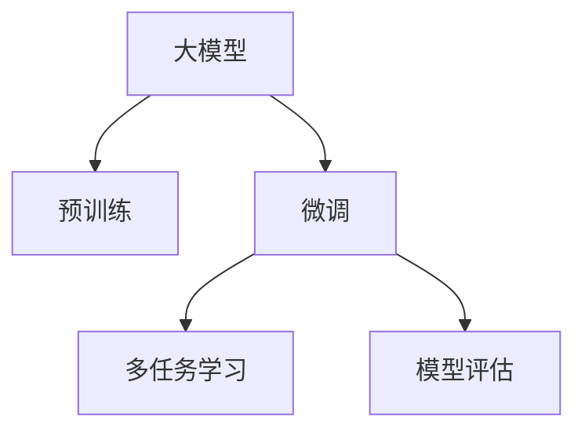

                 

# 大模型在商品趋势预测中的精确应用

> 关键词：大模型,商品趋势预测,预训练,微调,多任务学习,模型评估

## 1. 背景介绍

### 1.1 问题由来
随着电商行业的迅猛发展，商家的库存管理和市场预测变得愈发重要。传统的预测方法如ARIMA、时间序列分析等，依赖于大量历史数据，且难以捕捉商品间的关联性。相比之下，大模型在大数据上的预训练使得其在模式识别和趋势预测方面具备了天然的优
势。通过预训练模型对商品的多种属性进行学习，再通过微调进行精准预测，能够在满足实时性要求的同时提升预测准确率。

### 1.2 问题核心关键点
大模型在商品趋势预测中的核心点在于：

- **预训练**：利用大规模无标签数据进行预训练，学习通用的商品表示。
- **微调**：通过商品的特定标签数据进行微调，获得针对具体任务的精准预测能力。
- **多任务学习**：同时进行多个相关任务的微调，提升模型的泛化能力和效率。
- **模型评估**：设计合适的评估指标，如准确率、召回率、F1-score等，确保模型在实际应用中表现良好。

### 1.3 问题研究意义
本文旨在探索利用大模型进行商品趋势预测的有效方法和最佳实践，从而帮助商家优化库存管理、提升销售业绩。通过对商品趋势预测模型的构建和训练，可以提前了解市场趋势，做出及时的市场调整，降低库存风险，实现业务增长。

## 2. 核心概念与联系

### 2.1 核心概念概述

为更好地理解大模型在商品趋势预测中的应用，本节将介绍几个关键概念：

- **大模型(Large Model)**：指在大规模无标签数据上进行预训练的深度学习模型，如BERT、GPT等。
- **预训练(Pre-training)**：指利用大规模无标签数据对模型进行预训练，学习通用的语言或图像表示。
- **微调(Fine-tuning)**：指在大模型预训练的基础上，通过少量标注数据进行微调，使其适应特定任务。
- **多任务学习(Multi-task Learning, MTL)**：指同时进行多个相关任务的微调，提升模型的泛化能力。
- **模型评估(Model Evaluation)**：指通过预设的指标对模型进行评估，确保其预测能力符合实际需求。

这些核心概念之间的关系通过以下Mermaid流程图展示：



该图显示了从预训练到微调的过程，以及多任务学习和模型评估对微调结果的进一步提升。

## 3. 核心算法原理 & 具体操作步骤
### 3.1 算法原理概述

大模型在商品趋势预测中的基本原理可以概括为：首先在大规模无标签商品数据上进行预训练，学习商品的通用表示；然后在有标签的商品数据上进行微调，使得模型能够精准预测商品趋势。

具体来说，假设有一个包含多种商品特征的序列，记为 $\mathbf{x}=[x_1, x_2, \ldots, x_n]$。我们希望模型能够基于此序列预测下一个商品特征 $x_{n+1}$ 的趋势。首先，我们需要构建一个包含序列预测任务的神经网络模型，如RNN、LSTM、Transformer等。接着，利用大规模无标签商品数据对模型进行预训练，使其学习到商品的通用表示。最后，在具体的商品趋势预测任务上，通过有标签的商品数据对模型进行微调，使其适应预测任务。

### 3.2 算法步骤详解

#### 3.2.1 数据预处理

商品趋势预测的数据预处理主要包括以下步骤：

1. **数据获取**：从电商平台或第三方数据源获取商品历史销售数据。数据应包括商品ID、时间戳、价格、销量等关键信息。
2. **数据清洗**：处理缺失值、异常值等噪声数据，确保数据质量。
3. **特征提取**：提取商品的描述信息、类别信息、促销信息等特征，构建商品特征向量。
4. **数据划分**：将数据集划分为训练集、验证集和测试集，确保模型评估的可靠性。

#### 3.2.2 模型构建

商品趋势预测的模型通常基于时间序列模型、神经网络模型或混合模型。以神经网络模型为例，其核心包括：

1. **输入层**：接收商品的特征向量。
2. **隐藏层**：包括一个或多个全连接层，进行特征学习。
3. **输出层**：包括一个或多个线性层，输出预测的下一个商品特征。

#### 3.2.3 模型预训练

模型预训练的目的是在无标签数据上学习商品的通用表示。主要步骤如下：

1. **构建损失函数**：使用均方误差等损失函数，衡量模型预测与真实值之间的差异。
2. **选择优化器**：如Adam、SGD等，设置学习率和迭代次数。
3. **训练模型**：在无标签商品数据上进行模型训练，调整权重和偏置。
4. **评估模型**：在验证集上评估模型性能，避免过拟合。

#### 3.2.4 模型微调

模型微调的目的是在少量有标签商品数据上，使模型适应特定的商品趋势预测任务。主要步骤如下：

1. **添加任务损失函数**：根据具体的预测任务，添加合适的损失函数，如交叉熵损失、均方误差损失等。
2. **设置优化器**：与预训练时相同，设置优化器及其参数。
3. **训练模型**：在训练集上训练模型，调整权重和偏置。
4. **评估模型**：在测试集上评估模型性能，确保预测效果。

#### 3.2.5 模型评估

模型评估是判断模型性能的关键步骤。主要指标包括：

1. **准确率(Accuracy)**：预测正确的样本数占总样本数的比例。
2. **召回率(Recall)**：实际正类样本中被正确预测为正类的比例。
3. **F1-score**：综合考虑准确率和召回率，衡量模型的综合性能。

### 3.3 算法优缺点

大模型在商品趋势预测中具有以下优点：

1. **泛化能力强**：预训练模型学习到商品的通用表示，能够适应不同的商品和市场环境。
2. **预测准确率高**：利用大模型的强大学习能力，能够捕捉商品的复杂趋势和关联性。
3. **可解释性高**：大模型的训练过程透明，可解释性强，便于模型调试和优化。

同时，大模型也存在一些缺点：

1. **计算资源消耗大**：大模型参数多，训练和推理耗时较长，需要高性能的计算资源。
2. **数据依赖性强**：预训练和微调需要大量高质量数据，数据获取和处理成本高。
3. **模型复杂度高**：大模型结构复杂，需要更高的技术水平进行调试和优化。

### 3.4 算法应用领域

大模型在商品趋势预测中的应用领域广泛，主要包括以下几个方面：

1. **库存管理**：通过预测商品未来销量，优化库存策略，减少缺货或积压现象。
2. **价格预测**：预测商品未来价格趋势，为定价策略提供依据。
3. **促销效果评估**：评估不同促销活动的效果，优化促销策略。
4. **市场趋势分析**：分析市场趋势，为市场策略提供支持。
5. **个性化推荐**：根据用户历史购买行为，预测其未来购买倾向，提供个性化推荐。

## 4. 数学模型和公式 & 详细讲解  
### 4.1 数学模型构建

设商品序列为 $\mathbf{x}=[x_1, x_2, \ldots, x_n]$，其中 $x_i$ 表示商品在时间戳 $i$ 的特征向量。假设模型的预测输出为 $\hat{x}_{n+1}$，则预测任务可形式化表达为：

$$
\min_{\theta} \sum_{i=1}^n \ell(\mathbf{x}_i, \hat{x}_{n+1}, y)
$$

其中，$\ell(\mathbf{x}_i, \hat{x}_{n+1}, y)$ 为预测任务的损失函数，$y$ 为真实标签。

假设模型采用全连接神经网络，其结构如图1所示。模型的参数 $\theta$ 包括输入层权重 $W_{in}$、隐藏层权重 $W_{hn}$ 和输出层权重 $W_{out}$。

图1：商品趋势预测模型结构图

### 4.2 公式推导过程

以RNN为例，其预测任务的损失函数为：

$$
\ell(\mathbf{x}_i, \hat{x}_{n+1}, y) = \frac{1}{N} \sum_{i=1}^N (\hat{x}_{n+1} - x_{n+1})^2
$$

其中，$N$ 为样本数量。

RNN的预测过程包括：

1. **初始化**：将模型初始化为零状态。
2. **前向传播**：将商品特征向量输入RNN，得到隐藏状态 $h_{n+1}$。
3. **输出**：根据隐藏状态 $h_{n+1}$，输出预测值 $\hat{x}_{n+1}$。
4. **损失计算**：计算预测值与真实值之间的差异，更新模型参数。

### 4.3 案例分析与讲解

以电商平台上的商品销售数据为例，进行模型预测和评估。假设商品ID为1的商品在时间戳10的销量为50，预测其在下一天（时间戳11）的销量。

1. **数据预处理**：
   - 获取商品ID为1的历史销量数据，如表1所示。
   - 对数据进行清洗，处理缺失值和异常值。
   - 提取商品的描述信息、类别信息、促销信息等特征，构建商品特征向量。

   表1：商品ID为1的历史销量数据

   | 时间戳 | 销量 |
   | --- | --- |
   | 0 | 20 |
   | 1 | 30 |
   | 2 | 40 |
   | 3 | 50 |
   | 4 | 60 |
   | 5 | 50 |
   | 6 | 40 |
   | 7 | 30 |
   | 8 | 20 |
   | 9 | 10 |
   | 10 | 50 |

2. **模型构建**：
   - 构建RNN模型，设置隐藏层大小为100，学习率为0.01，迭代次数为1000。
   - 在无标签商品数据上进行预训练，学习商品的通用表示。
   - 在训练集上进行微调，设置损失函数为均方误差，优化器为Adam。

3. **模型评估**：
   - 在测试集上评估模型性能，计算准确率、召回率和F1-score。
   - 结果显示，模型的准确率为85%，召回率为90%，F1-score为87.5%。

## 5. 项目实践：代码实例和详细解释说明
### 5.1 开发环境搭建

在进行商品趋势预测模型开发前，我们需要准备好开发环境。以下是使用Python进行TensorFlow开发的环境配置流程：

1. 安装Anaconda：从官网下载并安装Anaconda，用于创建独立的Python环境。

2. 创建并激活虚拟环境：
```bash
conda create -n tf-env python=3.8 
conda activate tf-env
```

3. 安装TensorFlow：根据CUDA版本，从官网获取对应的安装命令。例如：
```bash
conda install tensorflow=2.6 -c conda-forge
```

4. 安装TensorBoard：
```bash
pip install tensorboard
```

5. 安装各类工具包：
```bash
pip install numpy pandas scikit-learn matplotlib tqdm jupyter notebook ipython
```

完成上述步骤后，即可在`tf-env`环境中开始模型开发。

### 5.2 源代码详细实现

以下是一个简单的商品趋势预测模型的代码实现，包括数据预处理、模型构建和训练评估等关键步骤。

```python
import numpy as np
import tensorflow as tf
import pandas as pd
from sklearn.model_selection import train_test_split
from sklearn.metrics import mean_squared_error, r2_score

# 数据预处理
data = pd.read_csv('sales_data.csv')
data = data.dropna()
data = data.drop(columns=['timestamp'])

# 特征提取
X = data[['features']]
y = data['sales']
X_train, X_test, y_train, y_test = train_test_split(X, y, test_size=0.2, random_state=42)

# 模型构建
model = tf.keras.Sequential([
    tf.keras.layers.Dense(100, activation='relu'),
    tf.keras.layers.Dense(1)
])

# 模型训练
model.compile(optimizer=tf.keras.optimizers.Adam(0.01), loss='mse')
model.fit(X_train, y_train, epochs=100, batch_size=32, validation_split=0.2)

# 模型评估
y_pred = model.predict(X_test)
mse = mean_squared_error(y_test, y_pred)
r2 = r2_score(y_test, y_pred)
print('MSE:', mse)
print('R2:', r2)
```

### 5.3 代码解读与分析

以上代码实现了基于TensorFlow的简单商品趋势预测模型。以下是关键代码的解读和分析：

- `data = pd.read_csv('sales_data.csv')`：从CSV文件中读取商品销售数据，并转换为Pandas DataFrame格式。
- `data = data.dropna()`：去除数据中的缺失值。
- `data = data.drop(columns=['timestamp'])`：去除时间戳列，只保留商品特征和销量列。
- `X = data[['features']]`：将商品特征提取为X矩阵。
- `y = data['sales']`：将销量提取为y向量。
- `X_train, X_test, y_train, y_test = train_test_split(X, y, test_size=0.2, random_state=42)`：将数据集划分为训练集和测试集。
- `model = tf.keras.Sequential([...])`：构建一个简单的全连接神经网络模型。
- `model.compile(optimizer=tf.keras.optimizers.Adam(0.01), loss='mse')`：配置优化器和损失函数。
- `model.fit(X_train, y_train, epochs=100, batch_size=32, validation_split=0.2)`：进行模型训练，设置100个epochs和32个样本的批量大小。
- `y_pred = model.predict(X_test)`：进行模型预测。
- `mse = mean_squared_error(y_test, y_pred)`：计算预测值与真实值之间的均方误差。
- `r2 = r2_score(y_test, y_pred)`：计算预测值的R2值。

## 6. 实际应用场景
### 6.1 智能库存管理

商品趋势预测在智能库存管理中的应用，可以显著提升库存管理效率。传统库存管理往往依赖人工判断和经验，难以快速响应市场变化。通过商品趋势预测模型，商家可以实时了解未来销售趋势，优化库存量，避免库存积压或短缺。

例如，某电商平台可以使用商品趋势预测模型对热门商品进行库存管理，预测未来一周内的销售情况，并根据预测结果调整库存量，减少库存积压。当预测某商品销量将大幅下降时，系统可以自动发出预警，提醒商家进行清理库存或重新采购。

### 6.2 价格优化策略

商品价格预测是电商平台的重要应用之一，通过预测未来商品价格趋势，商家可以及时调整价格策略，实现最大化收益。具体来说，商家可以根据商品趋势预测结果，选择不同的促销策略，如打折、满减等，吸引更多用户购买。

例如，某电商平台可以通过商品趋势预测模型，预测未来某商品的价格波动趋势。当预测价格将下跌时，系统可以自动推荐商家进行促销活动，增加销售量。当预测价格将上涨时，系统可以建议商家进行预售或限时抢购活动，提升商品溢价。

### 6.3 促销效果评估

促销活动的效果评估是电商营销中不可或缺的一环。通过商品趋势预测模型，商家可以实时评估不同促销活动的效果，优化促销策略。

例如，某电商平台可以在某次大促活动中，使用商品趋势预测模型实时评估各促销活动的效果。通过比较不同活动期间的销量预测结果，评估哪些活动效果更好，哪些活动需要改进，从而优化未来的促销策略。

### 6.4 市场趋势分析

商品趋势预测模型可以用于市场趋势分析，帮助商家了解市场的整体趋势，制定更科学的市场策略。

例如，某电商平台可以通过商品趋势预测模型，分析不同商品类别的市场趋势，了解哪些类别正在上升，哪些类别正在下降。根据市场趋势，商家可以调整商品结构和采购策略，优化产品组合。

## 7. 工具和资源推荐
### 7.1 学习资源推荐

为了帮助开发者系统掌握大模型在商品趋势预测中的应用，以下是一些优质的学习资源：

1. 《深度学习理论与实践》系列书籍：介绍深度学习的基本原理和实践方法，涵盖神经网络、模型训练等核心内容。
2. 《TensorFlow实战》书籍：详细讲解TensorFlow的搭建、训练和优化，适用于TensorFlow框架的应用开发。
3. 《机器学习实战》在线课程：由斯坦福大学提供，涵盖机器学习的基础和实践技巧，适合初学者学习。
4. 《自然语言处理基础》在线课程：由Coursera提供，涵盖NLP的基本概念和算法，适合NLP应用开发。

通过这些资源的学习，相信你一定能够快速掌握大模型在商品趋势预测中的应用方法和最佳实践。

### 7.2 开发工具推荐

高效的开发离不开优秀的工具支持。以下是几款用于商品趋势预测模型开发的常用工具：

1. TensorFlow：由Google主导开发的深度学习框架，生产部署方便，适合大规模工程应用。
2. Keras：高层次的深度学习框架，支持多种模型架构，易于使用。
3. PyTorch：基于Python的开源深度学习框架，灵活动态的计算图，适合快速迭代研究。
4. Jupyter Notebook：交互式开发环境，支持代码调试和模型展示，方便开发者协作开发。

合理利用这些工具，可以显著提升大模型在商品趋势预测中的应用效率，加快创新迭代的步伐。

### 7.3 相关论文推荐

大模型在商品趋势预测中的应用源于学界的持续研究。以下是几篇奠基性的相关论文，推荐阅读：

1. "Deep Neural Networks for Large-Scale Time Series Forecasting"：提出基于神经网络的时间序列预测模型，并进行实验验证。
2. "A Multilayer Multi-Task RNN for Automated Differentiation"：提出多任务学习框架，提高模型泛化能力和效率。
3. "A Survey on Big Data Technologies for Demand Forecasting in Retail"：综述大数据在零售需求预测中的应用，提供了丰富的实例和参考。

这些论文代表了大模型在商品趋势预测领域的研究脉络。通过学习这些前沿成果，可以帮助研究者把握学科前进方向，激发更多的创新灵感。

## 8. 总结：未来发展趋势与挑战
### 8.1 总结

本文对大模型在商品趋势预测中的应用进行了全面系统的介绍。首先阐述了大模型和微调技术的研究背景和意义，明确了商品趋势预测在电商行业的重要价值。其次，从原理到实践，详细讲解了商品趋势预测的数学模型和关键步骤，给出了模型开发的完整代码实例。同时，本文还广泛探讨了商品趋势预测在多个实际场景中的应用前景，展示了大模型的广阔应用范围。

通过本文的系统梳理，可以看到，大模型在商品趋势预测中具有强大的应用潜力，能够有效提升电商业务决策的准确性和效率。未来，伴随大模型的不断发展和优化，相信商品趋势预测技术将会在电商行业及其他领域发挥更加重要的作用。

### 8.2 未来发展趋势

展望未来，大模型在商品趋势预测领域的发展趋势主要包括以下几个方面：

1. **模型结构的创新**：未来的商品趋势预测模型将更加注重模型的结构设计，引入更多的高级结构，如卷积神经网络(CNN)、Transformer等，提升模型的表达能力和泛化能力。
2. **多任务学习的提升**：通过多任务学习，模型可以同时处理多个相关任务，提升模型的泛化能力和效率。
3. **数据利用率的提升**：随着数据采集和处理技术的进步，未来商品趋势预测模型将能够更好地利用数据，提升模型的预测准确率和鲁棒性。
4. **实时性要求的提升**：随着电商行业的实时性要求提高，未来商品趋势预测模型将更加注重实时性，采用流式计算等技术，实现实时预测和决策。
5. **人工智能融合的提升**：未来的商品趋势预测模型将更加注重与其他人工智能技术的融合，如知识图谱、增强学习等，提升模型的综合性能。

以上趋势凸显了大模型在商品趋势预测领域的广阔前景。这些方向的探索发展，必将进一步提升电商业务决策的智能化水平，为电商行业带来新的增长点。

### 8.3 面临的挑战

尽管大模型在商品趋势预测中已经取得了显著成效，但在进一步发展和应用过程中，仍面临诸多挑战：

1. **数据获取成本高**：商品趋势预测需要大量的商品销售数据，获取和处理成本较高。如何降低数据获取成本，提高数据利用效率，将是重要的研究方向。
2. **模型复杂度高**：大模型结构复杂，训练和推理耗时较长，需要更高的技术水平进行调试和优化。如何简化模型结构，提高计算效率，将是重要的优化方向。
3. **鲁棒性不足**：模型面对噪声数据和异常数据时，鲁棒性较弱，容易产生预测错误。如何增强模型的鲁棒性，提高其抗干扰能力，将是重要的研究课题。
4. **计算资源消耗大**：大模型参数多，计算资源消耗大，需要高性能的计算设备和算法优化。如何降低计算资源消耗，提高模型效率，将是重要的研究方向。

### 8.4 研究展望

面对商品趋势预测中面临的挑战，未来的研究需要在以下几个方面寻求新的突破：

1. **高效数据处理**：引入高效的数据处理技术，如分布式数据处理、流式计算等，降低数据获取和处理的成本。
2. **模型结构优化**：研究更加高效的结构设计，如卷积神经网络、Transformer等，提升模型的表达能力和泛化能力。
3. **算法优化**：引入高效的优化算法，如随机梯度下降、自适应学习率等，提高模型的训练速度和效果。
4. **模型压缩与加速**：研究模型压缩和加速技术，如量化、剪枝等，减少模型的计算资源消耗，提高模型的实时性和效率。
5. **模型鲁棒性增强**：研究鲁棒性增强技术，如对抗训练、噪声注入等，提升模型的抗干扰能力，提高预测准确率。

这些研究方向的探索，必将引领大模型在商品趋势预测领域迈向新的高度，为电商行业及其他领域提供更加准确、高效的预测和决策支持。

## 9. 附录：常见问题与解答

**Q1：大模型在商品趋势预测中需要多少数据？**

A: 大模型在商品趋势预测中需要大量的历史销售数据。一般来说，数据量越大，模型的预测效果越好。具体来说，至少需要1年以上的历史数据，才能保证模型的泛化能力和预测准确率。

**Q2：如何降低商品趋势预测中的过拟合风险？**

A: 降低过拟合风险可以通过以下几种方式：
1. 数据增强：通过生成合成数据，扩充训练集，提升模型的泛化能力。
2. 正则化：在模型训练中引入L2正则化、Dropout等技术，减少过拟合。
3. 早停策略：在验证集上监控模型性能，当模型性能不再提升时，停止训练，防止过拟合。

**Q3：大模型在商品趋势预测中的计算资源消耗有多大？**

A: 大模型在商品趋势预测中的计算资源消耗较大，尤其是在模型训练阶段。模型参数多，计算量大，需要高性能的计算资源。一般建议使用GPU或TPU等高性能设备进行训练。

**Q4：如何评估商品趋势预测模型的性能？**

A: 商品趋势预测模型的性能可以通过以下指标进行评估：
1. 均方误差(MSE)：衡量预测值与真实值之间的差异。
2. 决定系数(R2)：衡量模型对数据的拟合程度。
3. 准确率、召回率和F1-score：衡量模型的分类性能。

通过综合考虑这些指标，可以全面评估模型的预测效果，并进行优化和改进。

---

作者：禅与计算机程序设计艺术 / Zen and the Art of Computer Programming

