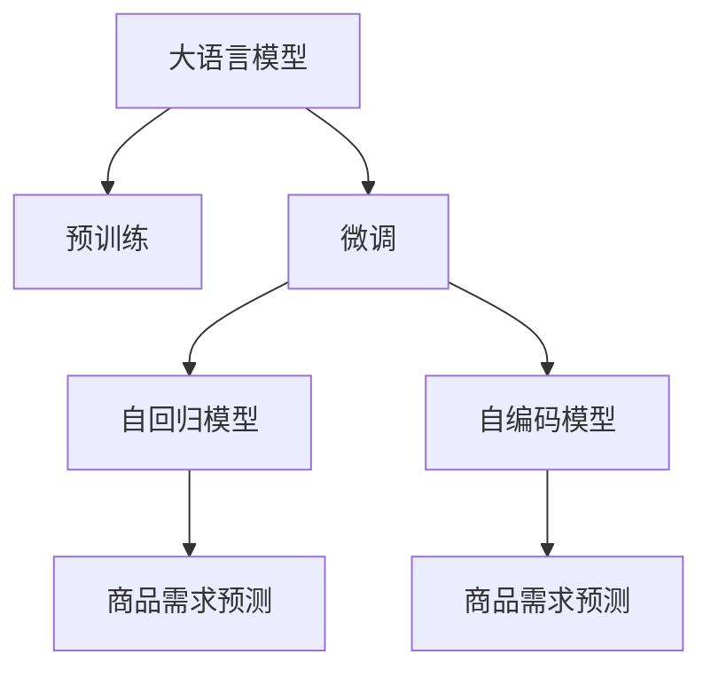

                 

# 大模型在商品需求预测中的精准应用

## 1. 背景介绍

在现代社会中，商品需求预测是一个极其重要的应用领域。无论是电商平台、零售商还是制造商，都需要对未来的商品需求进行精准预测，以优化库存、调整生产计划，甚至指导市场策略。传统的预测方法往往基于统计模型、时序模型等，需要大量手动提取特征，对模型进行调整和优化。而近年来，大语言模型在大规模数据上进行预训练后，凭借其强大的泛化能力和学习能力，成为了商品需求预测中的新星。

大语言模型在商品需求预测中的应用，主要集中在利用其强大的文本处理和语义理解能力，从自然语言数据中提取特征，通过机器学习的方法，构建预测模型。本文将对大语言模型在商品需求预测中的精准应用进行详细介绍，包括其核心概念、算法原理、具体操作步骤和实际应用场景等。

## 2. 核心概念与联系

### 2.1 核心概念概述

为了更好地理解大语言模型在商品需求预测中的应用，我们需要先了解一些关键概念：

- 大语言模型（Large Language Model, LLM）：指基于深度学习架构（如Transformer）构建的，通过大规模无标签文本数据进行预训练的通用语言模型。常见的预训练模型包括BERT、GPT-2、T5等。

- 预训练（Pre-training）：指在大规模无标签文本数据上，通过自监督学习任务（如掩码语言模型）训练模型，使其学习到丰富的语言表示。

- 微调（Fine-tuning）：指在预训练模型的基础上，使用特定任务的数据集，通过有监督学习优化模型，使其适应该任务。

- 商品需求预测（Demand Forecasting）：指根据历史销售数据、市场趋势、季节性因素等因素，预测未来一定时期内商品的需求量。

- 自回归（Auto-regressive）：指模型在生成序列时，需要考虑前面序列的影响。常见的自回归模型包括RNN、LSTM、Transformer等。

- 自编码（Auto-encoding）：指模型在生成序列时，仅需要考虑当前序列，与前面序列无关。常见的自编码模型包括RNN、LSTM、Transformer等。

这些概念之间的联系可以通过以下Mermaid流程图来展示：



这个流程图展示了从大语言模型到商品需求预测的流程：

1. 大语言模型通过预训练获得基础能力。
2. 微调使得模型学习特定任务的知识。
3. 自回归模型用于生成序列，预测需求。
4. 自编码模型用于生成序列，预测需求。

这些核心概念构成了大语言模型在商品需求预测中的基础框架，使得模型能够高效地提取数据中的特征，预测未来需求。

## 3. 核心算法原理 & 具体操作步骤

### 3.1 算法原理概述

商品需求预测本质上是一个时间序列预测问题。通过历史销售数据和市场趋势，模型需要学习到商品需求的动态变化规律，并预测未来一定时间内的需求量。大语言模型在商品需求预测中的应用，主要基于以下两个算法原理：

- 自回归模型（AR）：通过对历史销售数据的自回归分析，学习需求变化的规律，预测未来的需求量。
- 自编码模型（AE）：通过对市场趋势和季节性因素的分析，构建编码器-解码器模型，预测未来的需求量。

这些模型在大语言模型的基础上进行微调，能够更好地适应特定的商品需求预测任务，同时保留大模型的语言处理能力，提升预测精度。

### 3.2 算法步骤详解

大语言模型在商品需求预测中的应用，主要包括以下几个关键步骤：

**Step 1: 数据预处理**

- 收集历史销售数据，包括销售额、销售量、时间戳等。
- 清洗数据，处理缺失值、异常值等。
- 对数据进行归一化、标准化等处理，便于模型输入。

**Step 2: 构建预测模型**

- 选择合适的自回归模型或自编码模型，并进行微调。
- 确定模型的超参数，如学习率、批大小等。
- 使用历史数据进行模型训练，学习需求变化规律。

**Step 3: 特征提取**

- 将销售数据中的文本信息提取出来，如商品描述、用户评论等。
- 使用大语言模型进行文本预处理，生成特征向量。
- 将文本特征与历史销售数据结合，构建输入数据集。

**Step 4: 模型评估与优化**

- 在验证集上评估模型的预测精度，如均方误差、均方根误差等。
- 根据评估结果，调整模型参数，如学习率、批大小等。
- 重复训练过程，直到模型在验证集上达到理想精度。

**Step 5: 预测与部署**

- 使用测试集对模型进行测试，评估预测精度。
- 将模型部署到实际应用中，对新数据进行预测。
- 定期更新模型，使用新的销售数据重新训练，确保预测精度。

### 3.3 算法优缺点

大语言模型在商品需求预测中的应用，具有以下优点：

- 高泛化能力：大语言模型能够从大规模数据中学习到丰富的语言表示，具有较强的泛化能力，能够适应不同的商品需求预测任务。
- 高效性：自回归和自编码模型在计算上相对简单，能够在大模型基础上快速构建预测模型。
- 灵活性：模型能够根据特定任务进行调整，适应不同的需求预测需求。

同时，也存在一些缺点：

- 数据依赖：模型需要大量的历史销售数据进行训练，数据量不足时预测精度可能会下降。
- 计算成本：大模型需要大量的计算资源进行预训练和微调，计算成本较高。
- 可解释性：大模型的决策过程较难解释，难以理解其内部工作机制。

### 3.4 算法应用领域

大语言模型在商品需求预测中的应用，主要包括以下几个领域：

- 电商平台：对电商平台上商品的销量进行预测，指导库存管理和促销策略。
- 零售商：对零售商的销售数据进行预测，优化商品采购和库存管理。
- 制造商：对制造商的生产计划进行预测，优化生产线和供应链管理。
- 金融市场：对金融市场的产品需求进行预测，指导投资和风险控制。

## 4. 数学模型和公式 & 详细讲解 & 举例说明

### 4.1 数学模型构建

商品需求预测通常可以建模为时间序列预测问题。假设历史销售数据为 $y = (y_1, y_2, ..., y_t)$，时间序列的预测模型可以表示为：

$$
y_{t+1} = f(y_t, y_{t-1}, ..., y_{t-k})
$$

其中 $f$ 为预测函数，$k$ 为历史数据窗口大小。在实际应用中，常见的预测模型包括AR模型和AE模型。

**AR模型**：通过对历史销售数据进行自回归分析，构建线性回归模型：

$$
y_{t+1} = \alpha_0 + \alpha_1 y_t + \alpha_2 y_{t-1} + ... + \alpha_k y_{t-k} + \epsilon_{t+1}
$$

其中 $\alpha_i$ 为回归系数，$\epsilon_{t+1}$ 为噪声项。

**AE模型**：通过将市场趋势和季节性因素作为输入，构建编码器-解码器模型：

$$
y_{t+1} = \sigma(\phi(\psi(h_{t+1})))
$$

其中 $h_{t+1} = \Phi(y_t, t)$ 为编码器输出，$\phi$ 为预测函数，$\psi$ 为解码器函数。

### 4.2 公式推导过程

以AR模型为例，其推导过程如下：

1. 构建线性回归模型：

$$
y_{t+1} = \alpha_0 + \alpha_1 y_t + \alpha_2 y_{t-1} + ... + \alpha_k y_{t-k} + \epsilon_{t+1}
$$

2. 使用最小二乘法求解回归系数 $\alpha_i$：

$$
\alpha_i = \frac{\sum_{t=1}^{n-k}(y_t - \sum_{i=0}^{k}\alpha_iy_{t-i})}{\sum_{t=1}^{n-k}(y_{t+1} - \sum_{i=0}^{k}\alpha_iy_{t+1-i})}
$$

3. 将历史数据 $y_t$ 代入模型进行预测：

$$
y_{t+1} = \alpha_0 + \alpha_1 y_t + \alpha_2 y_{t-1} + ... + \alpha_k y_{t-k} + \epsilon_{t+1}
$$

在实际应用中，通常会将历史数据集 $D = (y_1, y_2, ..., y_n)$ 分为训练集 $D_{train}$ 和测试集 $D_{test}$。使用训练集 $D_{train}$ 对模型进行训练，然后使用测试集 $D_{test}$ 进行评估。

### 4.3 案例分析与讲解

以电商平台上的商品需求预测为例，其预测过程如下：

1. 数据预处理：收集电商平台的销售数据，包括销售额、销售量、时间戳等。清洗数据，处理缺失值、异常值等。对数据进行归一化、标准化等处理。

2. 构建预测模型：选择AR模型，确定模型超参数。使用历史数据进行模型训练，学习需求变化规律。

3. 特征提取：将销售数据中的文本信息提取出来，如商品描述、用户评论等。使用大语言模型进行文本预处理，生成特征向量。将文本特征与历史销售数据结合，构建输入数据集。

4. 模型评估与优化：在验证集上评估模型的预测精度，如均方误差、均方根误差等。根据评估结果，调整模型参数，如学习率、批大小等。重复训练过程，直到模型在验证集上达到理想精度。

5. 预测与部署：使用测试集对模型进行测试，评估预测精度。将模型部署到实际应用中，对新数据进行预测。定期更新模型，使用新的销售数据重新训练，确保预测精度。

## 5. 项目实践：代码实例和详细解释说明

### 5.1 开发环境搭建

在进行商品需求预测的开发前，我们需要准备好开发环境。以下是使用Python进行PyTorch开发的环境配置流程：

1. 安装Anaconda：从官网下载并安装Anaconda，用于创建独立的Python环境。

2. 创建并激活虚拟环境：
```bash
conda create -n pytorch-env python=3.8 
conda activate pytorch-env
```

3. 安装PyTorch：根据CUDA版本，从官网获取对应的安装命令。例如：
```bash
conda install pytorch torchvision torchaudio cudatoolkit=11.1 -c pytorch -c conda-forge
```

4. 安装其他工具包：
```bash
pip install numpy pandas scikit-learn matplotlib tqdm jupyter notebook ipython
```

完成上述步骤后，即可在`pytorch-env`环境中开始项目开发。

### 5.2 源代码详细实现

这里我们以使用Transformer模型进行商品需求预测为例，给出PyTorch代码实现。

```python
import torch
import torch.nn as nn
import torch.optim as optim
from torch.utils.data import DataLoader, Dataset

class ARModel(nn.Module):
    def __init__(self, input_size, hidden_size, output_size):
        super(ARModel, self).__init__()
        self.lstm = nn.LSTM(input_size, hidden_size, 1, batch_first=True)
        self.fc = nn.Linear(hidden_size, output_size)
        
    def forward(self, x):
        _, (_, h) = self.lstm(x)
        h = h[:, -1, :]
        output = self.fc(h)
        return output

class DemandForecastingDataset(Dataset):
    def __init__(self, x, y):
        self.x = x
        self.y = y
        
    def __len__(self):
        return len(self.y)
    
    def __getitem__(self, idx):
        return self.x[idx], self.y[idx]
        
def train_model(model, train_loader, optimizer, criterion, n_epochs):
    device = torch.device('cuda' if torch.cuda.is_available() else 'cpu')
    model.to(device)
    
    for epoch in range(n_epochs):
        model.train()
        for i, (x, y) in enumerate(train_loader):
            x, y = x.to(device), y.to(device)
            optimizer.zero_grad()
            outputs = model(x)
            loss = criterion(outputs, y)
            loss.backward()
            optimizer.step()
            
    model.eval()
    model.to('cpu')
    with torch.no_grad():
        predictions = model(x)
    
    return predictions, criterion

# 准备数据集
train_x = ...
train_y = ...
train_dataset = DemandForecastingDataset(train_x, train_y)

# 定义模型
model = ARModel(input_size, hidden_size, output_size)

# 定义优化器
optimizer = optim.Adam(model.parameters(), lr=0.001)

# 定义损失函数
criterion = nn.MSELoss()

# 训练模型
train_loader = DataLoader(train_dataset, batch_size=32)
train_model(model, train_loader, optimizer, criterion, n_epochs)

# 测试模型
test_x = ...
test_y = ...
test_dataset = DemandForecastingDataset(test_x, test_y)
test_loader = DataLoader(test_dataset, batch_size=32)

# 评估模型
predictions, criterion = train_model(model, test_loader, optimizer, criterion, n_epochs)
```

以上代码实现了一个简单的AR模型，用于对电商平台商品的需求进行预测。在实际应用中，需要根据具体任务进行调整和优化。

### 5.3 代码解读与分析

让我们再详细解读一下关键代码的实现细节：

**ARModel类**：
- `__init__`方法：初始化模型结构，包括LSTM层和全连接层。
- `forward`方法：定义模型前向传播的计算过程。

**DemandForecastingDataset类**：
- `__init__`方法：初始化数据集。
- `__len__`方法：返回数据集的长度。
- `__getitem__`方法：获取数据集中的样本。

**train_model函数**：
- 在训练过程中，将模型参数移动到GPU或CPU，进行前向传播、反向传播和参数更新。
- 在评估过程中，将模型参数移动到CPU，使用无梯度模式进行推理计算。

可以看到，PyTorch的框架使得模型构建、训练和评估变得简洁高效。开发者可以将更多精力放在数据预处理、模型优化等高层逻辑上，而不必过多关注底层的实现细节。

## 6. 实际应用场景

### 6.1 电商平台

商品需求预测在电商平台中具有广泛的应用。通过预测用户对商品的需求，电商平台可以更好地进行库存管理和促销策略的制定。具体而言，电商平台可以使用大语言模型提取商品描述、用户评论等文本信息，通过AR模型或AE模型对历史销售数据进行分析，预测未来的销售需求。

在实际应用中，电商平台需要定期更新销售数据，重新训练预测模型，确保预测精度的持续提升。同时，需要根据预测结果，及时调整库存和促销策略，提升用户体验和销售额。

### 6.2 零售商

零售商也需要对商品的需求进行预测，以优化库存管理和采购计划。大语言模型可以结合零售商的历史销售数据和市场趋势，构建预测模型，预测未来的需求量。

零售商可以使用大语言模型对商品描述、用户评论等文本信息进行预处理，提取特征向量。结合历史销售数据，使用AR模型或AE模型进行预测。根据预测结果，及时调整库存和采购计划，确保商品供需平衡。

### 6.3 制造商

制造商需要根据市场需求，制定生产计划和库存管理策略。大语言模型可以结合市场趋势和季节性因素，构建预测模型，预测未来的需求量。

制造商可以使用大语言模型对市场报告、新闻等文本信息进行预处理，提取特征向量。结合历史销售数据，使用AR模型或AE模型进行预测。根据预测结果，及时调整生产计划和库存管理策略，确保生产效率和库存合理性。

### 6.4 金融市场

金融市场需要对产品需求进行预测，指导投资和风险控制。大语言模型可以结合市场报告、新闻等文本信息，构建预测模型，预测未来的需求量。

金融市场可以使用大语言模型对市场报告、新闻等文本信息进行预处理，提取特征向量。结合历史销售数据，使用AR模型或AE模型进行预测。根据预测结果，及时调整投资策略和风险控制措施，提升投资收益和风险管理能力。

## 7. 工具和资源推荐

### 7.1 学习资源推荐

为了帮助开发者系统掌握大语言模型在商品需求预测中的应用，这里推荐一些优质的学习资源：

1. PyTorch官方文档：提供了详细的PyTorch框架和Transformer模型的使用方法，是学习大语言模型微调的基础。
2. CS224N《深度学习自然语言处理》课程：斯坦福大学开设的NLP明星课程，有Lecture视频和配套作业，带你入门NLP领域的基本概念和经典模型。
3. 《Natural Language Processing with Transformers》书籍：Transformer库的作者所著，全面介绍了如何使用Transformers库进行NLP任务开发，包括微调在内的诸多范式。
4. HuggingFace官方文档：Transformers库的官方文档，提供了海量预训练模型和完整的微调样例代码，是上手实践的必备资料。
5. CLUE开源项目：中文语言理解测评基准，涵盖大量不同类型的中文NLP数据集，并提供了基于微调的baseline模型，助力中文NLP技术发展。

通过对这些资源的学习实践，相信你一定能够快速掌握大语言模型在商品需求预测中的应用精髓，并用于解决实际的NLP问题。

### 7.2 开发工具推荐

高效的开发离不开优秀的工具支持。以下是几款用于大语言模型商品需求预测开发的常用工具：

1. PyTorch：基于Python的开源深度学习框架，灵活动态的计算图，适合快速迭代研究。大部分预训练语言模型都有PyTorch版本的实现。
2. TensorFlow：由Google主导开发的开源深度学习框架，生产部署方便，适合大规模工程应用。同样有丰富的预训练语言模型资源。
3. Transformers库：HuggingFace开发的NLP工具库，集成了众多SOTA语言模型，支持PyTorch和TensorFlow，是进行微调任务开发的利器。
4. Weights & Biases：模型训练的实验跟踪工具，可以记录和可视化模型训练过程中的各项指标，方便对比和调优。与主流深度学习框架无缝集成。
5. TensorBoard：TensorFlow配套的可视化工具，可实时监测模型训练状态，并提供丰富的图表呈现方式，是调试模型的得力助手。
6. Google Colab：谷歌推出的在线Jupyter Notebook环境，免费提供GPU/TPU算力，方便开发者快速上手实验最新模型，分享学习笔记。

合理利用这些工具，可以显著提升大语言模型在商品需求预测任务上的开发效率，加快创新迭代的步伐。

### 7.3 相关论文推荐

大语言模型在商品需求预测中的应用，代表了当前NLP技术的前沿方向。以下是几篇奠基性的相关论文，推荐阅读：

1. Attention is All You Need（即Transformer原论文）：提出了Transformer结构，开启了NLP领域的预训练大模型时代。
2. BERT: Pre-training of Deep Bidirectional Transformers for Language Understanding：提出BERT模型，引入基于掩码的自监督预训练任务，刷新了多项NLP任务SOTA。
3. Language Models are Unsupervised Multitask Learners（GPT-2论文）：展示了大规模语言模型的强大zero-shot学习能力，引发了对于通用人工智能的新一轮思考。
4. Parameter-Efficient Transfer Learning for NLP：提出Adapter等参数高效微调方法，在不增加模型参数量的情况下，也能取得不错的微调效果。
5. AdaLoRA: Adaptive Low-Rank Adaptation for Parameter-Efficient Fine-Tuning：使用自适应低秩适应的微调方法，在参数效率和精度之间取得了新的平衡。
6. Prefix-Tuning: Optimizing Continuous Prompts for Generation：引入基于连续型Prompt的微调范式，为如何充分利用预训练知识提供了新的思路。

这些论文代表了大语言模型在商品需求预测中的应用方向，通过学习这些前沿成果，可以帮助研究者把握学科前进方向，激发更多的创新灵感。

## 8. 总结：未来发展趋势与挑战

### 8.1 研究成果总结

本文对大语言模型在商品需求预测中的应用进行了全面系统的介绍。首先阐述了大语言模型和微调技术的研究背景和意义，明确了微调在拓展预训练模型应用、提升下游任务性能方面的独特价值。其次，从原理到实践，详细讲解了微调的数学原理和关键步骤，给出了微调任务开发的完整代码实例。同时，本文还广泛探讨了微调方法在电商平台、零售商、制造商、金融市场等多个领域的应用前景，展示了微调范式的巨大潜力。最后，本文精选了微调技术的各类学习资源，力求为读者提供全方位的技术指引。

通过本文的系统梳理，可以看到，大语言模型在商品需求预测中的应用，为NLP技术提供了新的研究方向和应用场景。基于微调的大语言模型，在高效性、灵活性、可解释性等方面具有显著优势，有望成为商品需求预测中的重要工具。

### 8.2 未来发展趋势

展望未来，大语言模型在商品需求预测中的应用将呈现以下几个发展趋势：

1. 模型规模持续增大。随着算力成本的下降和数据规模的扩张，预训练语言模型的参数量还将持续增长。超大规模语言模型蕴含的丰富语言知识，有望支撑更加复杂多变的商品需求预测任务。
2. 微调方法日趋多样。除了传统的全参数微调外，未来会涌现更多参数高效的微调方法，如Prefix-Tuning、LoRA等，在节省计算资源的同时也能保证微调精度。
3. 持续学习成为常态。随着数据分布的不断变化，微调模型也需要持续学习新知识以保持性能。如何在不遗忘原有知识的同时，高效吸收新样本信息，将成为重要的研究课题。
4. 标注样本需求降低。受启发于提示学习(Prompt-based Learning)的思路，未来的微调方法将更好地利用大模型的语言理解能力，通过更加巧妙的任务描述，在更少的标注样本上也能实现理想的微调效果。
5. 多模态微调崛起。当前的微调主要聚焦于纯文本数据，未来会进一步拓展到图像、视频、语音等多模态数据微调。多模态信息的融合，将显著提升语言模型对现实世界的理解和建模能力。
6. 模型通用性增强。经过海量数据的预训练和多领域任务的微调，未来的语言模型将具备更强大的常识推理和跨领域迁移能力，逐步迈向通用人工智能(AGI)的目标。

以上趋势凸显了大语言模型在商品需求预测中的广阔前景。这些方向的探索发展，必将进一步提升预测精度，拓展应用范围，为商品需求预测带来新的突破。

### 8.3 面临的挑战

尽管大语言模型在商品需求预测中的应用已经取得了显著成果，但在迈向更加智能化、普适化应用的过程中，仍面临诸多挑战：

1. 数据依赖。模型需要大量的历史销售数据进行训练，数据量不足时预测精度可能会下降。如何从非结构化数据中提取更多特征，是未来的一个重要研究方向。
2. 计算成本。大模型需要大量的计算资源进行预训练和微调，计算成本较高。如何优化模型结构，提高计算效率，是未来的一个重要研究方向。
3. 可解释性。大模型的决策过程较难解释，难以理解其内部工作机制。如何在模型预测中引入可解释性，提升用户信任度，是未来的一个重要研究方向。
4. 安全性。预训练语言模型难免会学习到有偏见、有害的信息，通过微调传递到商品需求预测任务，产生误导性、歧视性的输出，给实际应用带来安全隐患。如何在模型训练和部署中引入安全性约束，确保输出符合人类价值观和伦理道德，是未来的一个重要研究方向。
5. 知识整合能力不足。现有的微调模型往往局限于任务内数据，难以灵活吸收和运用更广泛的先验知识。如何让微调过程更好地与外部知识库、规则库等专家知识结合，形成更加全面、准确的信息整合能力，还有很大的想象空间。

正视这些挑战，积极应对并寻求突破，将是大语言模型在商品需求预测中走向成熟的必由之路。相信随着学界和产业界的共同努力，这些挑战终将一一被克服，大语言模型将在商品需求预测中发挥更大的作用。

### 8.4 研究展望

面对大语言模型在商品需求预测中面临的挑战，未来的研究需要在以下几个方面寻求新的突破：

1. 探索无监督和半监督微调方法。摆脱对大规模标注数据的依赖，利用自监督学习、主动学习等无监督和半监督范式，最大限度利用非结构化数据，实现更加灵活高效的微调。
2. 研究参数高效和计算高效的微调范式。开发更加参数高效的微调方法，在固定大部分预训练参数的同时，只更新极少量的任务相关参数。同时优化微调模型的计算图，减少前向传播和反向传播的资源消耗，实现更加轻量级、实时性的部署。
3. 融合因果和对比学习范式。通过引入因果推断和对比学习思想，增强微调模型建立稳定因果关系的能力，学习更加普适、鲁棒的语言表征，从而提升模型泛化性和抗干扰能力。
4. 引入更多先验知识。将符号化的先验知识，如知识图谱、逻辑规则等，与神经网络模型进行巧妙融合，引导微调过程学习更准确、合理的语言模型。同时加强不同模态数据的整合，实现视觉、语音等多模态信息与文本信息的协同建模。
5. 结合因果分析和博弈论工具。将因果分析方法引入微调模型，识别出模型决策的关键特征，增强输出解释的因果性和逻辑性。借助博弈论工具刻画人机交互过程，主动探索并规避模型的脆弱点，提高系统稳定性。
6. 纳入伦理道德约束。在模型训练目标中引入伦理导向的评估指标，过滤和惩罚有偏见、有害的输出倾向。同时加强人工干预和审核，建立模型行为的监管机制，确保输出符合人类价值观和伦理道德。

这些研究方向的探索，必将引领大语言模型在商品需求预测中的技术演进，为构建智能、可靠、可解释、可控的商品需求预测系统铺平道路。面向未来，大语言模型在商品需求预测中的应用还将与其他人工智能技术进行更深入的融合，如知识表示、因果推理、强化学习等，多路径协同发力，共同推动NLP技术的进步。

## 9. 附录：常见问题与解答

**Q1：大语言模型在商品需求预测中是否需要标注数据？**

A: 在商品需求预测中，大语言模型通常需要标注数据进行微调。标注数据可以帮助模型学习到商品需求变化的规律，提升预测精度。然而，标注数据的获取成本较高，特别是在数据量较小的情况下，标注数据的收集和处理尤为困难。

**Q2：大语言模型在商品需求预测中如何处理缺失值和异常值？**

A: 在商品需求预测中，数据往往存在缺失值和异常值，需要进行预处理。常见的处理方法包括：

1. 缺失值处理：对于缺失值，可以使用均值、中位数、众数等方法进行填补，或者使用插值方法进行补全。
2. 异常值处理：对于异常值，可以使用截断法、平滑法等方法进行处理，确保数据的合理性。

**Q3：大语言模型在商品需求预测中如何优化超参数？**

A: 在商品需求预测中，大语言模型的超参数优化是一个重要环节。常见的优化方法包括：

1. 网格搜索（Grid Search）：通过枚举超参数组合，选择最优的超参数组合。
2. 随机搜索（Random Search）：在超参数空间中随机采样，选择最优的超参数组合。
3. 贝叶斯优化（Bayesian Optimization）：利用贝叶斯模型评估超参数组合的性能，选择最优的超参数组合。

这些方法可以帮助我们找到最优的超参数组合，提升模型的预测精度。

**Q4：大语言模型在商品需求预测中如何避免过拟合？**

A: 在商品需求预测中，大语言模型容易过拟合，特别是在数据量较小的情况下。常见的避免过拟合的方法包括：

1. 数据增强：通过对数据进行扩充，增加数据的多样性，减少过拟合。
2. 正则化：使用L2正则、Dropout等方法，防止模型过度适应训练集。
3. 对抗训练：引入对抗样本，提高模型的鲁棒性，减少过拟合。
4. 参数高效微调：只更新少量的模型参数，保留大部分预训练参数不变，减少过拟合风险。

这些方法可以帮助我们避免过拟合，提升模型的泛化能力。

**Q5：大语言模型在商品需求预测中如何进行特征提取？**

A: 在商品需求预测中，大语言模型可以通过文本信息提取特征。常见的特征提取方法包括：

1. 词袋模型（Bag of Words）：将文本中的单词转化为向量表示，作为模型的输入。
2. TF-IDF模型：计算单词在文本中的重要性，转化为向量表示，作为模型的输入。
3. 词嵌入（Word Embedding）：将单词转化为低维向量表示，作为模型的输入。
4. 预训练语言模型：使用预训练语言模型，如BERT、GPT等，提取文本中的语义特征。

这些方法可以帮助我们提取文本中的特征，提升模型的预测精度。

**Q6：大语言模型在商品需求预测中如何进行模型评估？**

A: 在商品需求预测中，大语言模型的评估通常使用均方误差（MSE）和均方根误差（RMSE）等指标。具体的评估过程如下：

1. 将测试集中的样本输入模型，得到预测结果。
2. 计算预测结果与真实值之间的误差。
3. 计算均方误差和均方根误差，评估模型的预测精度。

这些方法可以帮助我们评估模型的预测效果，并进行模型优化。

通过以上分析，我们可以看到大语言模型在商品需求预测中的应用前景广阔，但同时也面临诸多挑战。未来需要更多研究者在数据处理、模型优化、超参数优化等方面进行深入探索，才能更好地推动商品需求预测技术的进步。

