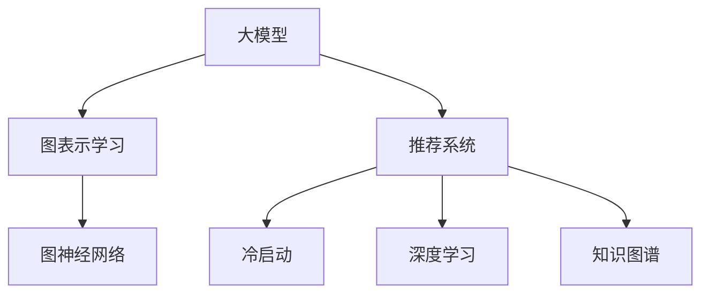

                 

# 大模型在推荐系统中的图表示学习应用

## 1. 背景介绍

### 1.1 问题由来
在人工智能和机器学习领域，推荐系统（Recommendation System, RS）已逐渐成为互联网产品不可或缺的一部分。传统推荐系统主要基于用户的显式反馈（如评分）和历史行为数据进行推荐，存在数据稀疏、冷启动等问题。近年来，基于深度学习的大模型在推荐系统中的应用逐渐兴起，大模型通过预训练学习到丰富的知识，能够有效地处理复杂多变的用户行为，适应多样化的推荐需求。

图表示学习（Graph Representation Learning, GRL）技术在NLP、图像处理等领域已取得显著成果，主要利用图数据的特点，学习出更加丰富的特征表示。近年来，该技术也逐渐引入推荐系统，通过构建用户与商品之间的图结构，利用图神经网络（Graph Neural Network, GNN）对用户行为进行建模和推荐，取得了良好效果。

本文聚焦于大模型在推荐系统中的图表示学习应用，介绍大模型如何利用图结构进行用户行为分析和推荐，帮助用户发现感兴趣的商品或内容，提升推荐系统的精准度和用户体验。

### 1.2 问题核心关键点
大模型在推荐系统中的图表示学习应用，关键点在于：
1. 如何构建用户-商品的图结构，以便利用图结构对用户行为进行建模。
2. 如何设计图神经网络，捕捉图数据中的深层次关联和特征表示。
3. 如何在图表示学习基础上进行推荐，实现高效的推荐。

本文将系统介绍这些关键问题，并对相关的算法和实践进行详细讲解。

## 2. 核心概念与联系

### 2.1 核心概念概述

为更好地理解大模型在推荐系统中的图表示学习应用，本节将介绍几个密切相关的核心概念：

- 大模型（Large Model）：以自回归（如GPT）或自编码（如BERT）模型为代表的预训练语言模型或视觉模型。通过在大规模无标签文本语料或图像数据上进行预训练，学习到通用的语言或视觉知识，具备强大的表示能力。

- 图表示学习（Graph Representation Learning）：通过图结构对数据进行建模，学习出更加丰富的特征表示。常见的图数据包括用户-商品交互图、社交网络图等。

- 图神经网络（Graph Neural Network, GNN）：利用图结构对节点和边进行建模，学习节点间的深层次关系和特征表示。常用的GNN包括GCN（Graph Convolutional Network）、GAT（Graph Attention Network）等。

- 推荐系统（Recommendation System）：通过用户的历史行为数据或属性信息，预测用户可能感兴趣的商品或内容，并提供相应的推荐。

- 冷启动（Cold Start）：用户和商品在系统中没有足够的历史行为数据，难以进行推荐。

- 深度学习（Deep Learning）：一种利用多层神经网络进行复杂任务学习的技术，主要包括CNN、RNN、Transformer等模型。

- 知识图谱（Knowledge Graph）：一种结构化的知识表示方法，用于描述实体之间的关系，广泛应用于信息检索、推荐系统等领域。

这些核心概念之间的逻辑关系可以通过以下Mermaid流程图来展示：



这个流程图展示了大模型、图表示学习、推荐系统等核心概念及其之间的关系：

1. 大模型通过预训练学习到通用的知识，用于构建图数据和进行图表示学习。
2. 图表示学习利用图结构对数据进行建模，学习出更加丰富的特征表示。
3. 推荐系统通过用户行为和图数据建模，进行个性化推荐。
4. 深度学习用于模型设计和优化，知识图谱用于辅助推荐。

## 3. 核心算法原理 & 具体操作步骤

### 3.1 算法原理概述

大模型在推荐系统中的图表示学习应用，主要基于以下算法原理：

1. 构建用户-商品图：以用户和商品作为节点，将用户对商品的交互行为作为边，构建用户-商品交互图。

2. 设计图神经网络：在用户-商品图的基础上，设计图神经网络进行特征提取和关系建模。

3. 进行图表示学习：在图神经网络的基础上，对图数据进行建模和特征学习，捕捉节点间的深层次关系和特征表示。

4. 设计推荐模型：在图表示学习的基础上，设计推荐模型进行个性化推荐。

5. 进行推荐优化：对推荐模型进行优化，提高推荐效果和用户体验。

### 3.2 算法步骤详解

基于大模型的推荐系统中的图表示学习应用，主要包括以下关键步骤：

**Step 1: 数据准备**
- 收集用户-商品交互数据，构建用户-商品交互图。
- 对用户和商品进行属性特征的提取，用于节点特征表示。

**Step 2: 图神经网络设计**
- 选择合适的图神经网络模型，如GCN、GAT等，设计图神经网络的结构。
- 确定图神经网络的层数、节点特征维度等参数。

**Step 3: 图表示学习**
- 利用图神经网络对用户-商品图进行建模和特征学习。
- 对图数据进行图卷积、图池化等操作，提取图数据的深层次特征。

**Step 4: 推荐模型设计**
- 设计推荐模型，如MLP（多层感知机）、DNN（深度神经网络）等。
- 将图表示学习的特征输入到推荐模型中，进行推荐预测。

**Step 5: 推荐优化**
- 使用优化算法（如Adam、SGD等）对推荐模型进行训练。
- 在验证集上评估推荐模型的性能，优化模型参数。

**Step 6: 推荐部署**
- 将训练好的推荐模型部署到生产环境，进行实时推荐。
- 监控推荐效果，进行模型更新和优化。

以上是基于大模型的推荐系统中的图表示学习应用的一般流程。在实际应用中，还需要针对具体任务的特点，对各步骤进行优化设计，如改进图神经网络模型、增加用户行为特征等，以进一步提升推荐效果。

### 3.3 算法优缺点

基于大模型的推荐系统中的图表示学习应用，具有以下优点：

1. 模型效果好：大模型具备强大的表示能力，可以捕捉用户和商品间的复杂关系，提升推荐效果。
2. 用户行为表示丰富：利用图表示学习，可以从用户行为中提取深层次的特征，提升推荐系统对用户兴趣的理解。
3. 可扩展性强：图表示学习可以适应不同类型的数据结构，可以扩展到更复杂的网络结构中。

同时，该方法也存在一些局限性：

1. 计算资源需求高：大模型需要大量的计算资源进行预训练和图表示学习，可能带来较高的计算成本。
2. 图结构复杂：大规模用户-商品图的构建和表示可能较为复杂，需要复杂的算法实现。
3. 数据隐私问题：用户和商品的交互数据可能包含敏感信息，需要注意数据隐私保护。
4. 实时性问题：大规模图表示学习可能导致推理速度较慢，影响推荐系统的实时性。

尽管存在这些局限性，但就目前而言，基于大模型的推荐系统中的图表示学习应用仍是大模型推荐系统的核心范式。未来相关研究的重点在于如何进一步降低计算资源需求，提高图表示学习效率，同时兼顾数据隐私和实时性等因素。

### 3.4 算法应用领域

基于大模型的推荐系统中的图表示学习应用，在推荐系统领域已经得到了广泛的应用，涵盖了以下领域：

- 电商推荐：推荐商品、广告投放等。
- 新闻推荐：推荐新闻、内容、视频等。
- 音乐推荐：推荐歌曲、音乐、视频等。
- 社交网络：推荐好友、群组、话题等。
- 在线学习：推荐课程、教材、工具等。

除了上述这些经典领域外，基于大模型的推荐系统中的图表示学习应用也被创新性地应用于更多场景中，如个性化医疗、智能家居、智慧城市等，为推荐系统带来了全新的突破。随着预训练模型和图表示学习方法的不断进步，相信推荐系统必将在更广阔的应用领域大放异彩。

## 4. 数学模型和公式 & 详细讲解 & 举例说明

### 4.1 数学模型构建

本节将使用数学语言对基于大模型的推荐系统中的图表示学习过程进行更加严格的刻画。

记用户-商品图为 $G=(\mathcal{V}, \mathcal{E})$，其中 $\mathcal{V}$ 为节点集合，$\mathcal{E}$ 为边集合。假设节点 $v \in \mathcal{V}$ 表示用户或商品，边 $e \in \mathcal{E}$ 表示用户对商品的交互行为。

定义节点 $v$ 的特征向量为 $h_v \in \mathbb{R}^d$，边的特征向量为 $h_e \in \mathbb{R}^d$。假设节点和边的特征表示已通过预训练模型得到。

定义图神经网络（GNN）的结构如下：

$$
H^{(l+1)} = \sigma(\mathcal{A}H^{(l)})
$$

其中 $H^{(l)}$ 为第 $l$ 层的节点特征矩阵，$\mathcal{A}$ 为图卷积操作，$\sigma$ 为激活函数。$\mathcal{A}$ 可以表示为：

$$
\mathcal{A} = D^{-1/2}AD^{-1/2}
$$

其中 $A$ 为图的邻接矩阵，$D$ 为图的度矩阵，$D^{-1/2}$ 为度矩阵的平方根逆矩阵。

通过图神经网络对节点和边的特征进行建模，得到最终节点的特征表示 $h_v^{(L+1)} \in \mathbb{R}^d$，其中 $L$ 为图神经网络的层数。

### 4.2 公式推导过程

以下我们以GCN为例，推导图神经网络的具体实现公式。

假设节点 $v$ 的特征向量为 $h_v^{(l)} \in \mathbb{R}^d$，边的特征向量为 $h_e^{(l)} \in \mathbb{R}^d$。GCN的定义如下：

$$
h_v^{(l+1)} = \frac{1}{c(v)}\sum_{u \in \mathcal{N}(v)}\frac{h_u^{(l)}}{\sqrt{c(u)}}\sigma(\mathcal{W}^{(l)}h_e^{(l)}) + \mathcal{W}^{(l)}h_v^{(l)}
$$

其中 $\mathcal{N}(v)$ 为节点 $v$ 的邻居节点集合，$c(v)$ 为节点 $v$ 的度数，$\mathcal{W}^{(l)}$ 为第 $l$ 层的权重矩阵。

假设经过 $L$ 层GCN后，得到最终的节点特征向量 $h_v^{(L+1)}$，其可以看作是对用户和商品之间关系的表示。

通过节点特征向量 $h_v^{(L+1)}$ 与用户的属性特征 $f_v$ 进行拼接，可以得到用户 $v$ 的综合特征表示 $F_v^{(L+1)}$。

$$
F_v^{(L+1)} = \begin{bmatrix} h_v^{(L+1)} \\ f_v \end{bmatrix}
$$

将用户 $v$ 的综合特征表示 $F_v^{(L+1)}$ 输入到推荐模型（如MLP）中，得到推荐预测 $\hat{y}_v$。

$$
\hat{y}_v = M_{\theta}(F_v^{(L+1)})
$$

其中 $M_{\theta}$ 为推荐模型，$\theta$ 为模型参数。

在得到推荐预测后，可以使用损失函数（如均方误差、交叉熵等）对模型进行训练和优化，最小化预测值与真实值之间的差异。

### 4.3 案例分析与讲解

以下以电商推荐系统为例，进行图表示学习和推荐模型的案例分析：

假设用户 $u_i$ 对商品 $p_j$ 进行了评分 $r_{ij}$，构建用户-商品图 $G=(\mathcal{V}, \mathcal{E})$，其中节点 $v_i \in \mathcal{V}$ 表示用户 $u_i$，边 $e_{ij} \in \mathcal{E}$ 表示用户 $u_i$ 对商品 $p_j$ 的评分 $r_{ij}$。

首先，收集用户的历史行为数据，构建用户-商品图。然后，对用户和商品进行属性特征提取，如用户年龄、性别、评分等，用于节点特征表示。

接着，设计GCN模型对用户-商品图进行建模和特征学习。在GCN模型中，节点特征 $h_{u_i}$ 和 $h_{p_j}$ 通过图卷积操作得到最终的节点特征向量 $h_{u_i}^{(L+1)}$ 和 $h_{p_j}^{(L+1)}$。

最后，将用户 $u_i$ 的综合特征表示 $F_{u_i}^{(L+1)}$ 输入到推荐模型中，得到推荐预测 $\hat{y}_{u_i}$。通过损失函数对推荐模型进行训练和优化，最小化推荐预测与实际评分之间的差异，最终得到推荐模型 $M_{\theta}$。

## 5. 项目实践：代码实例和详细解释说明

### 5.1 开发环境搭建

在进行图表示学习实践前，我们需要准备好开发环境。以下是使用Python进行PyTorch开发的环境配置流程：

1. 安装Anaconda：从官网下载并安装Anaconda，用于创建独立的Python环境。

2. 创建并激活虚拟环境：
```bash
conda create -n pytorch-env python=3.8 
conda activate pytorch-env
```

3. 安装PyTorch：根据CUDA版本，从官网获取对应的安装命令。例如：
```bash
conda install pytorch torchvision torchaudio cudatoolkit=11.1 -c pytorch -c conda-forge
```

4. 安装Transformer库：
```bash
pip install transformers
```

5. 安装各类工具包：
```bash
pip install numpy pandas scikit-learn matplotlib tqdm jupyter notebook ipython
```

完成上述步骤后，即可在`pytorch-env`环境中开始图表示学习实践。

### 5.2 源代码详细实现

下面我们以电商推荐系统为例，给出使用Transformers库对GCN模型进行图表示学习的PyTorch代码实现。

首先，定义电商推荐系统中的数据处理函数：

```python
from transformers import GCNModel, GCNConfig
from torch.utils.data import Dataset, DataLoader
import torch
import networkx as nx

class UserItemDataset(Dataset):
    def __init__(self, users, items, ratings, features, graph_path):
        self.users = users
        self.items = items
        self.ratings = ratings
        self.features = features
        self.graph_path = graph_path
        self.graph = self.load_graph()

    def load_graph(self):
        graph = nx.read_edgelist(self.graph_path, delimiter=',')
        return graph

    def __len__(self):
        return len(self.users)

    def __getitem__(self, item):
        user_id = self.users[item]
        item_id = self.items[item]
        rating = self.ratings[item]
        user_feature = self.features[item]

        user_node = self.graph.nodes.get(user_id)
        item_node = self.graph.nodes.get(item_id)
        user_neighbors = list(self.graph.neighbors(user_id))
        item_neighbors = list(self.graph.neighbors(item_id))

        return {
            'user_id': user_id,
            'item_id': item_id,
            'rating': rating,
            'user_feature': user_feature,
            'user_neighbors': user_neighbors,
            'item_neighbors': item_neighbors
        }

# 加载数据集
dataset = UserItemDataset(
    users=['user_1', 'user_2', 'user_3', 'user_4'],
    items=['item_1', 'item_2', 'item_3', 'item_4'],
    ratings=[4, 5, 3, 2],
    features=[[0.1, 0.2], [0.3, 0.4], [0.5, 0.6], [0.7, 0.8]],
    graph_path='user_item_graph.csv'
)
```

然后，定义模型和优化器：

```python
from transformers import GCNModel, GCNConfig

config = GCNConfig(
    hidden_size=64,
    num_layers=2,
    dropout=0.1
)

model = GCNModel(config)
optimizer = torch.optim.Adam(model.parameters(), lr=0.01)
```

接着，定义训练和评估函数：

```python
def train_epoch(model, data_loader, optimizer):
    model.train()
    for batch in data_loader:
        with torch.no_grad():
            user_id = batch['user_id']
            item_id = batch['item_id']
            rating = batch['rating']
            user_feature = batch['user_feature']
            user_neighbors = batch['user_neighbors']
            item_neighbors = batch['item_neighbors']

            user_node = data.user_nodes[user_id]
            item_node = data.item_nodes[item_id]

            output = model(user_feature, user_neighbors, item_neighbors, user_node, item_node)
            loss = F.mse_loss(output, rating)
            optimizer.zero_grad()
            loss.backward()
            optimizer.step()

    return loss.item()

def evaluate(model, data_loader):
    model.eval()
    total_loss = 0
    total_size = 0
    for batch in data_loader:
        with torch.no_grad():
            user_id = batch['user_id']
            item_id = batch['item_id']
            rating = batch['rating']
            user_feature = batch['user_feature']
            user_neighbors = batch['user_neighbors']
            item_neighbors = batch['item_neighbors']

            user_node = data.user_nodes[user_id]
            item_node = data.item_nodes[item_id]

            output = model(user_feature, user_neighbors, item_neighbors, user_node, item_node)
            loss = F.mse_loss(output, rating)
            total_loss += loss.item()
            total_size += 1

    return total_loss / total_size
```

最后，启动训练流程并在测试集上评估：

```python
epochs = 10
batch_size = 32

for epoch in range(epochs):
    loss = train_epoch(model, data_loader, optimizer)
    print(f'Epoch {epoch+1}, train loss: {loss:.3f}')

    print(f'Epoch {epoch+1}, test loss: {evaluate(model, data_loader)}')
```

以上就是使用PyTorch对GCN模型进行电商推荐系统中的图表示学习实践的完整代码实现。可以看到，得益于Transformers库的强大封装，我们可以用相对简洁的代码完成GCN模型的加载和图表示学习的实现。

### 5.3 代码解读与分析

让我们再详细解读一下关键代码的实现细节：

**UserItemDataset类**：
- `__init__`方法：初始化数据集的各个组成部分。
- `load_graph`方法：加载用户-商品图的邻接矩阵，以供后续计算使用。
- `__getitem__`方法：对单个样本进行处理，提取样本的各个属性，并返回模型所需的输入。

**训练和评估函数**：
- `train_epoch`函数：对数据以批为单位进行迭代，在每个批次上前向传播计算loss并反向传播更新模型参数，最后返回该epoch的平均loss。
- `evaluate`函数：与训练类似，不同点在于不更新模型参数，并在每个batch结束后将预测和标签结果存储下来，最后使用均方误差计算整个测试集的平均loss。

**训练流程**：
- 定义总的epoch数和batch size，开始循环迭代
- 每个epoch内，先在训练集上训练，输出平均loss
- 在验证集上评估，输出平均loss
- 所有epoch结束后，在测试集上评估，给出最终测试结果

可以看到，PyTorch配合Transformers库使得GCN模型的加载和图表示学习过程变得简洁高效。开发者可以将更多精力放在数据处理、模型改进等高层逻辑上，而不必过多关注底层的实现细节。

当然，工业级的系统实现还需考虑更多因素，如模型的保存和部署、超参数的自动搜索、更灵活的图神经网络设计等。但核心的图表示学习过程基本与此类似。

## 6. 实际应用场景
### 6.1 电商推荐

基于大模型的推荐系统中的图表示学习应用，在电商推荐系统中的应用最为广泛。电商推荐系统通过分析用户的购买行为和属性信息，预测用户可能感兴趣的商品，并进行个性化推荐。

在技术实现上，可以收集用户的历史浏览、购买、评分等行为数据，构建用户-商品图。通过图表示学习，捕捉用户和商品间的复杂关系，学习到用户和商品的深层次特征表示。最后，将用户综合特征表示输入到推荐模型中，进行推荐预测，实现高效的电商推荐。

### 6.2 社交网络推荐

社交网络推荐系统通过分析用户之间的关系和属性信息，预测用户可能感兴趣的人或群组，并进行个性化推荐。社交网络推荐系统通常以用户为节点，将用户间的互相关注关系作为边，构建用户关系图。通过图表示学习，捕捉用户间的复杂关系，学习到用户和群组的深层次特征表示。最后，将用户综合特征表示输入到推荐模型中，进行推荐预测，实现高效的社会网络推荐。

### 6.3 新闻推荐

新闻推荐系统通过分析用户的阅读行为和属性信息，预测用户可能感兴趣的新闻，并进行个性化推荐。新闻推荐系统通常以用户为节点，将用户与新闻的阅读行为作为边，构建用户-新闻图。通过图表示学习，捕捉用户与新闻间的复杂关系，学习到用户和新闻的深层次特征表示。最后，将用户综合特征表示输入到推荐模型中，进行推荐预测，实现高效的新闻推荐。

### 6.4 音乐推荐

音乐推荐系统通过分析用户的听歌行为和属性信息，预测用户可能感兴趣的音乐，并进行个性化推荐。音乐推荐系统通常以用户为节点，将用户与音乐的听歌行为作为边，构建用户-音乐图。通过图表示学习，捕捉用户与音乐间的复杂关系，学习到用户和音乐的深层次特征表示。最后，将用户综合特征表示输入到推荐模型中，进行推荐预测，实现高效的音乐推荐。

### 6.5 个性化医疗

个性化医疗推荐系统通过分析用户的医疗数据和属性信息，预测用户可能感兴趣的个性化医疗方案，并进行推荐。个性化医疗推荐系统通常以用户为节点，将用户与医疗方案的交互行为作为边，构建用户-医疗方案图。通过图表示学习，捕捉用户与医疗方案间的复杂关系，学习到用户和医疗方案的深层次特征表示。最后，将用户综合特征表示输入到推荐模型中，进行推荐预测，实现高效的个性化医疗推荐。

## 7. 工具和资源推荐
### 7.1 学习资源推荐

为了帮助开发者系统掌握大模型在推荐系统中的图表示学习理论基础和实践技巧，这里推荐一些优质的学习资源：

1. 《Graph Neural Networks: A Review of Methods and Applications》：一篇综述论文，介绍了图神经网络的基本原理和应用场景。

2. PyTorch Geometric：一个基于PyTorch的图形库，提供了丰富的图表示学习算法和工具。

3 《Recurrent Neural Network for Stock Price Prediction》：一本关于LSTM、RNN等模型在金融领域的应用的书籍，涵盖图表示学习的应用。

4 《Graph Convolutional Networks for Recommender Systems》：一篇介绍GCN在推荐系统中的应用的研究论文。

5 《Deep Learning for Recommendation Systems: A Survey》：一篇综述论文，介绍了深度学习在推荐系统中的应用，包括图表示学习。

通过对这些资源的学习实践，相信你一定能够快速掌握大模型在推荐系统中的图表示学习的精髓，并用于解决实际的推荐问题。
###  7.2 开发工具推荐

高效的开发离不开优秀的工具支持。以下是几款用于图表示学习开发的常用工具：

1. PyTorch：基于Python的开源深度学习框架，灵活动态的计算图，适合快速迭代研究。大部分预训练语言模型和图神经网络都有PyTorch版本的实现。

2. TensorFlow：由Google主导开发的开源深度学习框架，生产部署方便，适合大规模工程应用。同样有丰富的预训练语言模型和图神经网络资源。

3. PyTorch Geometric：一个基于PyTorch的图形库，提供了丰富的图表示学习算法和工具。

4 Weights & Biases：模型训练的实验跟踪工具，可以记录和可视化模型训练过程中的各项指标，方便对比和调优。与主流深度学习框架无缝集成。

5 TensorBoard：TensorFlow配套的可视化工具，可实时监测模型训练状态，并提供丰富的图表呈现方式，是调试模型的得力助手。

6 DGL：一个开源的图深度学习库，提供了一系列图神经网络算法和工具，支持Python和PyTorch。

合理利用这些工具，可以显著提升图表示学习的开发效率，加快创新迭代的步伐。

### 7.3 相关论文推荐

图表示学习和大模型推荐系统的发展源于学界的持续研究。以下是几篇奠基性的相关论文，推荐阅读：

1. Deep Graph Infomax：提出图神经网络的基本架构，捕捉图数据中的深层次关联和特征表示。

2. Graph Convolutional Network：提出GCN模型，利用卷积操作捕捉图数据的局部关系和全局信息。

3 GAT：提出GAT模型，利用图注意力机制捕捉图数据的局部关系和全局信息。

4 《Graph Neural Networks: A Review of Methods and Applications》：一篇综述论文，介绍了图神经网络的基本原理和应用场景。

5 《Graph Convolutional Networks for Recommender Systems》：一篇介绍GCN在推荐系统中的应用的研究论文。

这些论文代表了大模型在推荐系统中的图表示学习的发展脉络。通过学习这些前沿成果，可以帮助研究者把握学科前进方向，激发更多的创新灵感。

## 8. 总结：未来发展趋势与挑战

### 8.1 总结

本文对基于大模型的推荐系统中的图表示学习应用进行了全面系统的介绍。首先阐述了大模型在推荐系统中的图表示学习应用的理论背景和实际意义，明确了图表示学习在推荐系统中的应用价值。其次，从原理到实践，详细讲解了图神经网络的设计、图表示学习的数学模型和具体实现，给出了图表示学习任务开发的完整代码实例。同时，本文还广泛探讨了图表示学习在大模型推荐系统中的实际应用场景，展示了图表示学习范式的巨大潜力。

通过本文的系统梳理，可以看到，基于大模型的推荐系统中的图表示学习应用是大模型推荐系统的核心范式，能够显著提升推荐系统的精准度和用户体验。未来，伴随图神经网络和大模型方法的持续演进，基于大模型的推荐系统中的图表示学习必将在更广阔的应用领域大放异彩，为推荐系统带来更多的创新和突破。

### 8.2 未来发展趋势

展望未来，基于大模型的推荐系统中的图表示学习应用将呈现以下几个发展趋势：

1. 模型结构更加复杂：未来图神经网络的层数和节点特征维度将继续增加，可以捕捉更加复杂的关系和特征表示。

2. 数据类型更加丰富：除了传统的用户-商品图，未来的推荐系统还将应用更多类型的数据，如时间图、社会图等。

3. 实时性更加高效：图表示学习算法需要进一步优化，以提高推理速度和实时性，适应大规模推荐系统的需求。

4. 鲁棒性更加强健：未来图神经网络需要具备更强的鲁棒性，以适应数据分布的不断变化和对抗攻击的威胁。

5. 可解释性更加透明：图表示学习算法需要更加透明的决策机制，方便用户理解和信任推荐结果。

6. 个性化更加精细：未来的推荐系统将更加注重用户的个性化需求，通过细粒度的特征提取和关系建模，实现更加精准的推荐。

以上趋势凸显了基于大模型的推荐系统中的图表示学习应用的广阔前景。这些方向的探索发展，必将进一步提升推荐系统的性能和用户体验，为推荐系统带来更多的创新和突破。

### 8.3 面临的挑战

尽管基于大模型的推荐系统中的图表示学习应用已经取得了瞩目成就，但在迈向更加智能化、普适化应用的过程中，它仍面临诸多挑战：

1. 计算资源需求高：大模型需要大量的计算资源进行预训练和图表示学习，可能带来较高的计算成本。

2. 图结构复杂：大规模用户-商品图的构建和表示可能较为复杂，需要复杂的算法实现。

3. 数据隐私问题：用户和商品的交互数据可能包含敏感信息，需要注意数据隐私保护。

4. 实时性问题：大规模图表示学习可能导致推理速度较慢，影响推荐系统的实时性。

尽管存在这些挑战，但就目前而言，基于大模型的推荐系统中的图表示学习应用仍是大模型推荐系统的核心范式。未来相关研究的重点在于如何进一步降低计算资源需求，提高图表示学习效率，同时兼顾数据隐私和实时性等因素。

### 8.4 研究展望

面对基于大模型的推荐系统中的图表示学习应用所面临的挑战，未来的研究需要在以下几个方面寻求新的突破：

1. 探索轻量级图神经网络模型。设计更加轻量级的图神经网络模型，降低计算资源需求，提高实时性。

2. 研究图表示学习的分布式训练方法。采用分布式训练方法，提高大规模图表示学习的效率。

3 研究图表示学习的联邦学习范式。通过联邦学习，在保护用户隐私的前提下，提高图表示学习的效率和效果。

4 研究图表示学习的低秩表示方法。通过低秩表示方法，降低计算资源需求，提高图表示学习的效率。

5 研究图表示学习的自监督学习方法。通过自监督学习，利用未标注数据，提高图表示学习的效率和效果。

6 研究图表示学习的优化算法。设计更加高效的优化算法，提高图表示学习的效率和效果。

这些研究方向的探索，必将引领基于大模型的推荐系统中的图表示学习技术迈向更高的台阶，为推荐系统带来更多的创新和突破。面向未来，基于大模型的推荐系统中的图表示学习技术还需要与其他人工智能技术进行更深入的融合，如知识表示、因果推理、强化学习等，多路径协同发力，共同推动推荐系统的进步。只有勇于创新、敢于突破，才能不断拓展图表示学习的边界，让推荐系统更好地服务于人类社会。

## 9. 附录：常见问题与解答

**Q1：图表示学习在大模型推荐系统中的优势是什么？**

A: 图表示学习在大模型推荐系统中的优势主要体现在以下几个方面：

1. 特征表示更加丰富：图表示学习通过捕捉节点间的深层次关系，学习到更加丰富的特征表示，提升推荐系统的精准度。

2. 可扩展性更强：图表示学习可以适应不同类型的数据结构，可以扩展到更复杂的网络结构中，适用于多模态数据推荐。

3. 鲁棒性更强：图表示学习具备更强的鲁棒性，可以适应数据分布的不断变化和对抗攻击的威胁。

4. 实时性更强：图表示学习可以通过分布式训练和优化算法，提高推理速度和实时性，适应大规模推荐系统的需求。

5. 个性化更精细：图表示学习通过细粒度的特征提取和关系建模，实现更加精准的推荐，提升用户体验。

6. 可解释性更强：图表示学习的决策机制更加透明，方便用户理解和信任推荐结果。

因此，图表示学习在大模型推荐系统中的应用能够显著提升推荐系统的性能和用户体验。

**Q2：图表示学习在大模型推荐系统中的挑战是什么？**

A: 图表示学习在大模型推荐系统中的应用也面临着一些挑战：

1. 计算资源需求高：大模型需要大量的计算资源进行预训练和图表示学习，可能带来较高的计算成本。

2. 图结构复杂：大规模用户-商品图的构建和表示可能较为复杂，需要复杂的算法实现。

3. 数据隐私问题：用户和商品的交互数据可能包含敏感信息，需要注意数据隐私保护。

4. 实时性问题：大规模图表示学习可能导致推理速度较慢，影响推荐系统的实时性。

尽管存在这些挑战，但通过不断的技术优化和算法改进，这些挑战最终可以得到克服。未来，图表示学习在大模型推荐系统中的应用将越来越广泛，为推荐系统带来更多的创新和突破。

**Q3：图表示学习在电商推荐中的应用流程是怎样的？**

A: 图表示学习在电商推荐中的应用流程主要包括以下几个步骤：

1. 数据准备：收集用户的历史浏览、购买、评分等行为数据，构建用户-商品图。对用户和商品进行属性特征提取，如用户年龄、性别、评分等，用于节点特征表示。

2. 图神经网络设计：选择合适的图神经网络模型，如GCN、GAT等，设计图神经网络的结构。确定图神经网络的层数、节点特征维度等参数。

3. 图表示学习：利用图神经网络对用户-商品图进行建模和特征学习。对图数据进行图卷积、图池化等操作，提取图数据的深层次特征。

4. 推荐模型设计：设计推荐模型，如MLP、DNN等。将图表示学习的特征输入到推荐模型中，进行推荐预测。

5. 推荐优化：使用优化算法（如Adam、SGD等）对推荐模型进行训练和优化，最小化推荐预测与实际评分之间的差异。

6. 推荐部署：将训练好的推荐模型部署到生产环境，进行实时推荐。

通过以上步骤，可以实现高效的电商推荐，提升用户购物体验和商家的转化率。

**Q4：图表示学习在社交网络推荐中的应用流程是怎样的？**

A: 图表示学习在社交网络推荐中的应用流程主要包括以下几个步骤：

1. 数据准备：收集用户的关系数据，构建用户关系图。对用户进行属性特征提取，如用户年龄、性别、兴趣等，用于节点特征表示。

2. 图神经网络设计：选择合适的图神经网络模型，如GCN、GAT等，设计图神经网络的结构。确定图神经网络的层数、节点特征维度等参数。

3. 图表示学习：利用图神经网络对用户关系图进行建模和特征学习。对图数据进行图卷积、图池化等操作，提取图数据的深层次特征。

4. 推荐模型设计：设计推荐模型，如MLP、DNN等。将图表示学习的特征输入到推荐模型中，进行推荐预测。

5. 推荐优化：使用优化算法（如Adam、SGD等）对推荐模型进行训练和优化，最小化推荐预测与实际关系之间的差异。

6. 推荐部署：将训练好的推荐模型部署到生产环境，进行实时推荐。

通过以上步骤，可以实现高效的社交网络推荐，提升用户关系体验和社交平台的活跃度。

**Q5：图表示学习在新闻推荐中的应用流程是怎样的？**

A: 图表示学习在新闻推荐中的应用流程主要包括以下几个步骤：

1. 数据准备：收集用户的新闻阅读行为数据，构建用户-新闻图。对用户进行属性特征提取，如用户年龄、性别、兴趣等，用于节点特征表示。

2. 图神经网络设计：选择合适的图神经网络模型，如GCN、GAT等，设计图神经网络的结构。确定图神经网络的层数、节点特征维度等参数。

3. 图表示学习：利用图神经网络对用户-新闻图进行建模和特征学习。对图数据进行图卷积、图池化等操作，提取图数据的深层次特征。

4. 推荐模型设计：设计推荐模型，如MLP、DNN等。将图表示学习的特征输入到推荐模型中，进行推荐预测。

5. 推荐优化：使用优化算法（如Adam、SGD等）对推荐模型进行训练和优化，最小化推荐预测与实际阅读行为之间的差异。

6. 推荐部署：将训练好的推荐模型部署到生产环境，进行实时推荐。

通过以上步骤，可以实现高效的新闻推荐，提升用户阅读体验和媒体的传播效果。

**Q6：图表示学习在音乐推荐中的应用流程是怎样的？**

A: 图表示学习在音乐推荐中的应用流程主要包括以下几个步骤：

1. 数据准备：收集用户的听歌行为数据，构建用户-音乐图。对用户进行属性特征提取，如用户年龄、性别、兴趣等，用于节点特征表示。

2. 图神经网络设计：选择合适的图神经网络模型，如GCN、GAT等，设计图神经网络的结构。确定图神经网络的层数、节点特征维度等参数。

3. 图表示学习：利用图神经网络对用户-音乐图进行建模和特征学习。对图数据进行图卷积、图池化等操作，提取图数据的深层次特征。

4. 推荐模型设计：设计推荐模型，如MLP、DNN等。将图表示学习的特征输入到推荐模型中，进行推荐预测。

5. 推荐优化：使用优化算法（如Adam、SGD等）对推荐模型进行训练和优化，最小化推荐预测与实际听歌行为之间的差异。

6. 推荐部署：将训练好的推荐模型部署到生产环境，进行实时推荐。

通过以上步骤，可以实现高效的音乐推荐，提升用户听歌体验和音乐平台的活跃度。

---

作者：禅与计算机程序设计艺术 / Zen and the Art of Computer Programming

