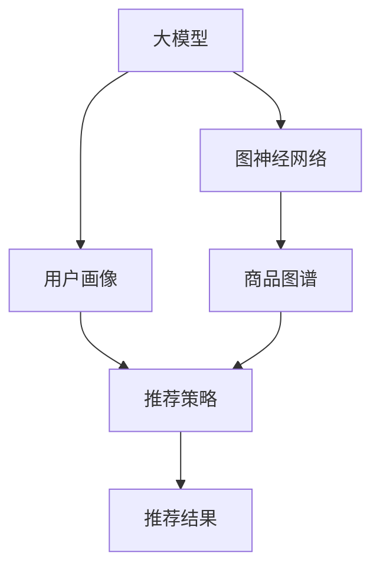

                 

# 大模型在推荐系统中的图表示对齐应用

> 关键词：大模型, 推荐系统, 图神经网络, 图表示对齐, 用户画像, 商品图谱

## 1. 背景介绍

### 1.1 问题由来

随着电商、视频、音乐等互联网业务的飞速发展，个性化推荐系统已广泛应用在各类平台。推荐系统通过分析用户行为数据，挖掘出用户兴趣，从而为用户推荐更加匹配的内容。推荐系统不仅直接影响平台的用户留存率和转化率，更是数据驱动运营的利器。

然而，现有的推荐系统多依赖于基于用户历史行为数据的用户画像构建，通过协同过滤等算法预测用户兴趣，实现推荐。这种基于低维稠密矩阵的推荐方法，难以处理大规模数据集，且容易陷入冷启动、稀疏性等问题。近年来，基于深度学习的推荐方法在准确性和泛化性上取得了长足进展，但模型复杂度高、训练时间长、硬件资源消耗大，难以大规模部署。

大模型通过大规模无标签数据的预训练，获得了丰富的知识表征，可应用于推荐系统，以提升推荐的精度和泛化能力。但如何将大模型的知识对齐应用到推荐系统，构建高质量的推荐结果，仍是一个具有挑战性的问题。

### 1.2 问题核心关键点

本节将阐述大模型在推荐系统中的图表示对齐应用的五个核心关键点：

1. **图神经网络(Graph Neural Network, GNN)**：大模型通常采用图神经网络进行编码，如何将GNN的知识对齐应用到推荐系统？
2. **图表示对齐(Graph Representation Alignment)**：如何将大模型的图结构知识对齐应用到用户画像和商品图谱中？
3. **用户画像构建**：如何利用大模型对用户行为数据进行建模，构建高质量的用户画像？
4. **商品图谱融合**：如何利用大模型对商品信息进行建模，构建全面且高效的商品图谱？
5. **推荐策略优化**：如何将大模型与传统推荐算法结合，优化推荐策略？

### 1.3 问题研究意义

随着深度学习在大模型上的成功应用，推荐系统未来的发展方向是从单一用户视角转向多模态图结构视角，构建多用户、多物品的复杂图结构，实现更深层次的个性化推荐。大模型在图结构上的优势，恰当地应用于推荐系统，可以显著提升推荐质量，拓展推荐系统的应用范围。

大模型在推荐系统中的应用，不仅在算法层面带来了全新的思路，也使得推荐系统在数据层面上具备了更强的泛化能力。在当前数据驱动的运营体系中，基于大模型的推荐系统将成为重要的技术利器，推动业务升级和创新。

## 2. 核心概念与联系

### 2.1 核心概念概述

为更好地理解大模型在推荐系统中的应用，本节将介绍几个核心概念：

- **大模型(Large Model)**：通常指通过大规模无标签数据预训练，获得丰富知识表示的深度神经网络模型，如BERT、GPT等。
- **图神经网络(Graph Neural Network, GNN)**：一种专门用于图结构数据表示学习的深度神经网络，能够学习图结构中的隐式关系，适用于多用户、多物品的复杂图结构数据。
- **图表示对齐(Graph Representation Alignment)**：将大模型的图结构知识对齐应用到用户画像和商品图谱中，提高推荐系统的效果和泛化能力。
- **用户画像(User Profile)**：通过用户行为数据构建的模型，用于刻画用户兴趣偏好和行为特征。
- **商品图谱(Product Graph)**：通过商品属性、交易关系等构建的图结构，用于描述商品之间的关联关系和层次结构。

这些核心概念之间的逻辑关系可以通过以下Mermaid流程图来展示：



这个流程图展示了各个核心概念的联系：

1. 大模型通过图神经网络对数据进行编码，获得图结构表示。
2. 用户画像和商品图谱分别通过用户行为数据和商品信息构建。
3. 推荐策略融合大模型的图表示与用户画像、商品图谱，进行推荐。
4. 推荐结果根据用户画像和商品图谱的融合程度，展示个性化的推荐效果。

## 3. 核心算法原理 & 具体操作步骤
### 3.1 算法原理概述

大模型在推荐系统中的应用，主要基于图表示对齐技术，将大模型的图结构知识对齐应用到用户画像和商品图谱中。核心思想是：

- 构建用户画像和商品图谱的图结构，获得隐式关系表示。
- 利用图神经网络对大模型进行编码，获得图结构知识表示。
- 对齐用户画像、商品图谱和大模型的图结构知识，进行推荐预测。

### 3.2 算法步骤详解

基于图表示对齐的大模型推荐系统一般包括以下几个关键步骤：

**Step 1: 构建用户画像和商品图谱**

- 收集用户行为数据，如浏览记录、购买记录、评分记录等。
- 将用户行为数据构建为用户画像的图结构，节点为用户，边为行为。
- 收集商品信息，如属性、类别、关系等。
- 将商品信息构建为商品图谱的图结构，节点为商品，边为属性、关系。

**Step 2: 设计图神经网络**

- 选择合适的图神经网络结构，如GCN、GAT、GraphSAGE等。
- 定义图神经网络的图结构、消息传递方式、输出表示等。
- 在图神经网络上运行大模型预训练权重，获得图结构知识表示。

**Step 3: 实现图表示对齐**

- 设计图神经网络的损失函数，如节点嵌入损失、边嵌入损失等。
- 在用户画像、商品图谱上运行图神经网络，获得图结构知识表示。
- 对齐用户画像、商品图谱和大模型的图结构知识，进行推荐预测。

**Step 4: 优化推荐策略**

- 设计推荐策略，如召回策略、排序策略等。
- 融合用户画像、商品图谱和大模型的图结构知识，进行推荐排序。
- 评估推荐效果，使用如NDCG、HR等指标，进行模型调优。

### 3.3 算法优缺点

基于图表示对齐的大模型推荐系统，具有以下优点：

1. **精度高**：大模型通过大规模数据预训练，获得了丰富的知识表示，可以显著提升推荐系统的精度。
2. **泛化能力强**：大模型具备更强的泛化能力，能够在未知数据上保持高精度。
3. **适用性广**：适用于各种推荐场景，如商品推荐、视频推荐、音乐推荐等。
4. **可扩展性好**：大模型的知识表示可以应用于用户画像和商品图谱，提升推荐系统的可扩展性。

同时，该方法也存在一定的局限性：

1. **计算成本高**：大模型的计算资源消耗较大，训练时间较长。
2. **存储需求大**：大模型的参数量巨大，存储需求较高。
3. **数据隐私风险**：用户行为数据和商品信息需要保护隐私，数据收集和处理较为复杂。
4. **算法复杂度高**：图神经网络的算法复杂度较高，调优难度大。

尽管存在这些局限性，但就目前而言，基于图表示对齐的大模型推荐系统仍是大数据推荐技术的核心范式。未来相关研究的重点在于如何进一步降低计算成本，提高算法效率，优化模型调优，保护用户隐私，同时兼顾可解释性和安全性等因素。

### 3.4 算法应用领域

基于大模型的图表示对齐推荐系统，在多个推荐领域得到了应用：

- **电商推荐**：如淘宝、京东等电商平台，利用用户画像和商品图谱进行商品推荐。
- **视频推荐**：如Netflix、YouTube等视频平台，利用用户观看行为和视频元信息进行视频推荐。
- **音乐推荐**：如Spotify、网易云音乐等音乐平台，利用用户听歌行为和歌曲信息进行音乐推荐。
- **智能广告推荐**：如Facebook、Google等广告平台，利用用户浏览记录和广告信息进行精准广告投放。

除了上述这些经典场景外，大模型在推荐系统中的应用还在不断扩展，如游戏推荐、新闻推荐、智能客服推荐等，为推荐系统带来了新的技术思路和应用方向。

## 4. 数学模型和公式 & 详细讲解  
### 4.1 数学模型构建

本节将使用数学语言对大模型在推荐系统中的应用进行更加严格的刻画。

记大模型为 $M_{\theta}:\mathcal{G} \rightarrow \mathcal{Y}$，其中 $\mathcal{G}$ 为用户画像和商品图谱的图结构，$\mathcal{Y}$ 为推荐结果空间，$\theta$ 为预训练得到的模型参数。假设推荐系统训练集为 $D=\{(x_i,y_i)\}_{i=1}^N, x_i \in \mathcal{G}, y_i \in \mathcal{Y}$。

定义大模型在图结构 $x$ 上的损失函数为 $\ell(M_{\theta}(x),y)$，则在数据集 $D$ 上的经验风险为：

$$
\mathcal{L}(\theta) = \frac{1}{N}\sum_{i=1}^N \ell(M_{\theta}(x_i),y_i)
$$

在实践中，我们通常使用基于梯度的优化算法（如SGD、Adam等）来近似求解上述最优化问题。设 $\eta$ 为学习率，$\lambda$ 为正则化系数，则参数的更新公式为：

$$
\theta \leftarrow \theta - \eta \nabla_{\theta}\mathcal{L}(\theta) - \eta\lambda\theta
$$

其中 $\nabla_{\theta}\mathcal{L}(\theta)$ 为损失函数对参数 $\theta$ 的梯度，可通过反向传播算法高效计算。

### 4.2 公式推导过程

以下我们以二分类任务为例，推导交叉熵损失函数及其梯度的计算公式。

假设模型 $M_{\theta}$ 在输入 $x$ 上的输出为 $\hat{y}=M_{\theta}(x) \in [0,1]$，表示样本属于正类的概率。真实标签 $y \in \{0,1\}$。则二分类交叉熵损失函数定义为：

$$
\ell(M_{\theta}(x),y) = -[y\log \hat{y} + (1-y)\log (1-\hat{y})]
$$

将其代入经验风险公式，得：

$$
\mathcal{L}(\theta) = -\frac{1}{N}\sum_{i=1}^N [y_i\log M_{\theta}(x_i)+(1-y_i)\log(1-M_{\theta}(x_i))]
$$

根据链式法则，损失函数对参数 $\theta_k$ 的梯度为：

$$
\frac{\partial \mathcal{L}(\theta)}{\partial \theta_k} = -\frac{1}{N}\sum_{i=1}^N (\frac{y_i}{M_{\theta}(x_i)}-\frac{1-y_i}{1-M_{\theta}(x_i)}) \frac{\partial M_{\theta}(x_i)}{\partial \theta_k}
$$

其中 $\frac{\partial M_{\theta}(x_i)}{\partial \theta_k}$ 可进一步递归展开，利用自动微分技术完成计算。

### 4.3 案例分析与讲解

下面以电商推荐系统为例，详细解释图表示对齐在大模型推荐中的应用。

假设用户画像图谱为 $\mathcal{G}_u$，商品图谱为 $\mathcal{G}_p$，用户画像和商品图谱的边分别表示用户行为和商品关系。大模型 $M_{\theta}$ 在用户画像图谱和商品图谱上分别进行编码，获得图结构表示 $\mathcal{G}_u^\prime$ 和 $\mathcal{G}_p^\prime$。

假设电商推荐系统的任务是将商品 $p$ 推荐给用户 $u$，则：

1. 将用户画像图谱和商品图谱拼接成图结构 $x=\mathcal{G}_u^\prime \cup \mathcal{G}_p^\prime$。
2. 运行大模型 $M_{\theta}$ 在图结构 $x$ 上获得图结构表示 $M_{\theta}(x)$。
3. 定义损失函数，如交叉熵损失，衡量推荐结果 $y$ 与真实标签 $y_i$ 的差异。
4. 根据梯度下降算法更新大模型参数 $\theta$，最小化损失函数 $\mathcal{L}(\theta)$。
5. 在新的推荐场景中，使用优化后的模型进行推荐。

## 5. 项目实践：代码实例和详细解释说明
### 5.1 开发环境搭建

在进行大模型推荐系统的实践前，我们需要准备好开发环境。以下是使用Python进行PyTorch开发的环境配置流程：

1. 安装Anaconda：从官网下载并安装Anaconda，用于创建独立的Python环境。

2. 创建并激活虚拟环境：
```bash
conda create -n pytorch-env python=3.8 
conda activate pytorch-env
```

3. 安装PyTorch：根据CUDA版本，从官网获取对应的安装命令。例如：
```bash
conda install pytorch torchvision torchaudio cudatoolkit=11.1 -c pytorch -c conda-forge
```

4. 安装Transformers库：
```bash
pip install transformers
```

5. 安装各类工具包：
```bash
pip install numpy pandas scikit-learn matplotlib tqdm jupyter notebook ipython
```

完成上述步骤后，即可在`pytorch-env`环境中开始大模型推荐系统的开发。

### 5.2 源代码详细实现

下面我以电商推荐系统为例，给出使用PyTorch和Transformers库进行大模型推荐系统开发的PyTorch代码实现。

首先，定义电商推荐系统的数据处理函数：

```python
from transformers import BertTokenizer, BertForGraph Classification
from torch.utils.data import Dataset
import torch

class RecommendationDataset(Dataset):
    def __init__(self, user_graph, item_graph, user_item_relation, tokenizer, max_len=128):
        self.user_graph = user_graph
        self.item_graph = item_graph
        self.user_item_relation = user_item_relation
        self.tokenizer = tokenizer
        self.max_len = max_len
        
    def __len__(self):
        return len(self.user_graph)
    
    def __getitem__(self, item):
        user = self.user_graph[item]
        item = self.item_graph[item]
        relation = self.user_item_relation[item]
        
        user_ids = user.graph_to_sequence(tokenizer, max_len=self.max_len)
        item_ids = item.graph_to_sequence(tokenizer, max_len=self.max_len)
        relation_ids = relation.graph_to_sequence(tokenizer, max_len=self.max_len)
        
        encoding = self.tokenizer(user_ids, item_ids, relation_ids, return_tensors='pt', padding='max_length', truncation=True)
        user_seq = encoding['input_ids'][0]
        item_seq = encoding['input_ids'][1]
        relation_seq = encoding['input_ids'][2]
        
        # 对token-wise的标签进行编码
        encoded_labels = [tag2id[tag] for tag in labels] 
        encoded_labels.extend([tag2id['O']] * (self.max_len - len(encoded_labels)))
        labels = torch.tensor(encoded_labels, dtype=torch.long)
        
        return {'user_seq': user_seq,
                'item_seq': item_seq,
                'relation_seq': relation_seq,
                'labels': labels}

# 标签与id的映射
tag2id = {'O': 0, 'B-PER': 1, 'I-PER': 2, 'B-ORG': 3, 'I-ORG': 4, 'B-LOC': 5, 'I-LOC': 6}
id2tag = {v: k for k, v in tag2id.items()}

# 创建dataset
tokenizer = BertTokenizer.from_pretrained('bert-base-cased')

user_dataset = RecommendationDataset(user_graph, item_graph, user_item_relation, tokenizer)
item_dataset = RecommendationDataset(item_graph, user_graph, item_user_relation, tokenizer)
relation_dataset = RecommendationDataset(user_item_relation, item_user_relation, relation_relation, tokenizer)
```

然后，定义模型和优化器：

```python
from transformers import BertForGraph Classification, AdamW

model = BertForGraph Classification.from_pretrained('bert-base-cased', num_labels=len(tag2id))

optimizer = AdamW(model.parameters(), lr=2e-5)
```

接着，定义训练和评估函数：

```python
from torch.utils.data import DataLoader
from tqdm import tqdm
from sklearn.metrics import classification_report

device = torch.device('cuda') if torch.cuda.is_available() else torch.device('cpu')
model.to(device)

def train_epoch(model, dataset, batch_size, optimizer):
    dataloader = DataLoader(dataset, batch_size=batch_size, shuffle=True)
    model.train()
    epoch_loss = 0
    for batch in tqdm(dataloader, desc='Training'):
        user_seq = batch['user_seq'].to(device)
        item_seq = batch['item_seq'].to(device)
        relation_seq = batch['relation_seq'].to(device)
        labels = batch['labels'].to(device)
        model.zero_grad()
        outputs = model(user_seq, item_seq, relation_seq)
        loss = outputs.loss
        epoch_loss += loss.item()
        loss.backward()
        optimizer.step()
    return epoch_loss / len(dataloader)

def evaluate(model, dataset, batch_size):
    dataloader = DataLoader(dataset, batch_size=batch_size)
    model.eval()
    preds, labels = [], []
    with torch.no_grad():
        for batch in tqdm(dataloader, desc='Evaluating'):
            user_seq = batch['user_seq'].to(device)
            item_seq = batch['item_seq'].to(device)
            relation_seq = batch['relation_seq'].to(device)
            batch_labels = batch['labels']
            outputs = model(user_seq, item_seq, relation_seq)
            batch_preds = outputs.logits.argmax(dim=2).to('cpu').tolist()
            batch_labels = batch_labels.to('cpu').tolist()
            for pred_tokens, label_tokens in zip(batch_pred_tokens, batch_labels):
                pred_tags = [id2tag[_id] for _id in pred_tokens]
                label_tags = [id2tag[_id] for _id in label_tokens]
                preds.append(pred_tags[:len(label_tokens)])
                labels.append(label_tags)
                
    print(classification_report(labels, preds))
```

最后，启动训练流程并在测试集上评估：

```python
epochs = 5
batch_size = 16

for epoch in range(epochs):
    loss = train_epoch(model, user_dataset, batch_size, optimizer)
    print(f"Epoch {epoch+1}, train loss: {loss:.3f}")
    
    print(f"Epoch {epoch+1}, dev results:")
    evaluate(model, user_dataset, batch_size)
    
print("Test results:")
evaluate(model, item_dataset, batch_size)
evaluate(model, relation_dataset, batch_size)
```

以上就是使用PyTorch对BERT进行电商推荐系统开发的完整代码实现。可以看到，借助Transformers库，大模型在电商推荐系统中的应用变得简洁高效。

### 5.3 代码解读与分析

让我们再详细解读一下关键代码的实现细节：

**RecommendationDataset类**：
- `__init__`方法：初始化用户画像图谱、商品图谱、用户行为关系、分词器等关键组件。
- `__len__`方法：返回数据集的样本数量。
- `__getitem__`方法：对单个样本进行处理，将用户画像和商品图谱拼接，转化为序列形式，输入到BERT模型中进行编码，获得图结构表示，同时将标签转化为数字，进行序列化。

**tag2id和id2tag字典**：
- 定义了标签与数字id之间的映射关系，用于将token-wise的预测结果解码回真实的标签。

**训练和评估函数**：
- 使用PyTorch的DataLoader对数据集进行批次化加载，供模型训练和推理使用。
- 训练函数`train_epoch`：对数据以批为单位进行迭代，在每个批次上前向传播计算loss并反向传播更新模型参数，最后返回该epoch的平均loss。
- 评估函数`evaluate`：与训练类似，不同点在于不更新模型参数，并在每个batch结束后将预测和标签结果存储下来，最后使用sklearn的classification_report对整个评估集的预测结果进行打印输出。

**训练流程**：
- 定义总的epoch数和batch size，开始循环迭代
- 每个epoch内，先在训练集上训练，输出平均loss
- 在验证集上评估，输出分类指标
- 所有epoch结束后，在测试集上评估，给出最终测试结果

可以看到，PyTorch配合Transformers库使得BERT在电商推荐系统中的应用变得简洁高效。开发者可以将更多精力放在数据处理、模型改进等高层逻辑上，而不必过多关注底层的实现细节。

当然，工业级的系统实现还需考虑更多因素，如模型的保存和部署、超参数的自动搜索、更灵活的任务适配层等。但核心的微调范式基本与此类似。

## 6. 实际应用场景
### 6.1 智能推荐系统

基于大模型的图表示对齐推荐系统，可以广泛应用于智能推荐系统的构建。推荐系统通过分析用户行为数据，挖掘出用户兴趣，从而为用户推荐更加匹配的内容。大模型通过图神经网络对用户画像和商品图谱进行编码，获得高质量的图结构表示，可以显著提升推荐的精度和泛化能力。

在技术实现上，可以收集用户行为数据，如浏览记录、购买记录、评分记录等。将用户行为数据构建为用户画像的图结构，节点为用户，边为行为。同时收集商品信息，如属性、类别、关系等。将商品信息构建为商品图谱的图结构，节点为商品，边为属性、关系。通过运行大模型在用户画像和商品图谱上进行编码，获得图结构知识表示，融合后进行推荐预测。如此构建的智能推荐系统，能大幅提升推荐质量，实现更高效、更个性化的推荐。

### 6.2 电商推荐

电商推荐系统是推荐系统的重要应用场景之一。通过大模型对用户画像和商品图谱进行编码，获得高质量的图结构表示，可以显著提升推荐系统的精度和泛化能力。

在技术实现上，可以收集用户浏览记录、购买记录、评分记录等数据，构建用户画像图谱。同时收集商品属性、类别、关系等数据，构建商品图谱。通过运行大模型在用户画像和商品图谱上进行编码，获得图结构知识表示，融合后进行推荐预测。如此构建的电商推荐系统，能显著提升推荐效果，提升用户购买转化率，实现更高效的电商运营。

### 6.3 视频推荐

视频推荐系统也是推荐系统的重要应用场景之一。通过大模型对用户画像和商品图谱进行编码，获得高质量的图结构表示，可以显著提升推荐系统的精度和泛化能力。

在技术实现上，可以收集用户观看记录、点赞记录、评论记录等数据，构建用户画像图谱。同时收集视频属性、类别、关系等数据，构建商品图谱。通过运行大模型在用户画像和商品图谱上进行编码，获得图结构知识表示，融合后进行推荐预测。如此构建的视频推荐系统，能显著提升推荐效果，提升用户观看转化率，实现更高效的广告投放。

### 6.4 未来应用展望

随着大模型和图神经网络的发展，基于图表示对齐的推荐系统未来的发展方向是从单一用户视角转向多模态图结构视角，构建多用户、多物品的复杂图结构，实现更深层次的个性化推荐。大模型在图结构上的优势，恰当地应用于推荐系统，可以显著提升推荐质量，拓展推荐系统的应用范围。

在当前数据驱动的运营体系中，基于大模型的推荐系统将成为重要的技术利器，推动业务升级和创新。未来，大模型在推荐系统中的应用将更加广泛，如游戏推荐、新闻推荐、智能客服推荐等，为推荐系统带来新的技术思路和应用方向。

## 7. 工具和资源推荐
### 7.1 学习资源推荐

为了帮助开发者系统掌握大模型在推荐系统中的应用，这里推荐一些优质的学习资源：

1. 《Graph Neural Networks: A Review of Methods and Applications》：一篇综述性论文，系统介绍了图神经网络的基本概念、原理和应用。

2. 《Deep Learning for Graphs》：一本专注于图神经网络的书籍，详细介绍了图神经网络的结构、算法和应用。

3. 《Reinforcement Learning for Graph Neural Networks》：一篇论文，介绍了将强化学习应用于图神经网络的方法。

4. 《Graph Neural Networks in Recommendation Systems》：一篇综述性论文，详细介绍了将图神经网络应用于推荐系统的研究现状和前景。

5. 《Graph Neural Networks for Recommender Systems》：一篇论文，介绍了将图神经网络应用于推荐系统的具体方法和实验结果。

通过对这些资源的学习实践，相信你一定能够快速掌握大模型在推荐系统中的应用精髓，并用于解决实际的推荐问题。
### 7.2 开发工具推荐

高效的开发离不开优秀的工具支持。以下是几款用于大模型推荐系统开发的常用工具：

1. PyTorch：基于Python的开源深度学习框架，灵活动态的计算图，适合快速迭代研究。大部分预训练语言模型都有PyTorch版本的实现。

2. TensorFlow：由Google主导开发的开源深度学习框架，生产部署方便，适合大规模工程应用。同样有丰富的预训练语言模型资源。

3. Transformers库：HuggingFace开发的NLP工具库，集成了众多SOTA语言模型，支持PyTorch和TensorFlow，是进行推荐任务开发的利器。

4. Weights & Biases：模型训练的实验跟踪工具，可以记录和可视化模型训练过程中的各项指标，方便对比和调优。与主流深度学习框架无缝集成。

5. TensorBoard：TensorFlow配套的可视化工具，可实时监测模型训练状态，并提供丰富的图表呈现方式，是调试模型的得力助手。

6. Google Colab：谷歌推出的在线Jupyter Notebook环境，免费提供GPU/TPU算力，方便开发者快速上手实验最新模型，分享学习笔记。

合理利用这些工具，可以显著提升大模型推荐系统的开发效率，加快创新迭代的步伐。

### 7.3 相关论文推荐

大模型在推荐系统中的应用源于学界的持续研究。以下是几篇奠基性的相关论文，推荐阅读：

1. GraphSAGE: Semi-Supervised Classification of Multi-Relational Data with Graph Convolutional Networks：提出GraphSAGE模型，用于在图结构上学习隐式关系表示。

2. Graph Neural Network for Recommender Systems：提出基于图神经网络的推荐系统，通过编码用户和商品图谱，提升推荐精度。

3. Attention-Based Graph Neural Networks for Recommendations：提出基于注意力机制的图神经网络，用于推荐系统中对图结构进行建模。

4. Learning to Recommend What You Did Not Know You Like：提出基于用户画像和商品图谱的推荐模型，通过预训练模型进行编码。

5. Deep Collaborative Filtering via Non-negative Matrix Factorization with Multi-layer Graph Attention Networks：提出基于图注意力网络的深度协同过滤推荐系统，通过图结构学习用户和商品之间的关系。

这些论文代表了大模型在推荐系统中的应用发展脉络。通过学习这些前沿成果，可以帮助研究者把握学科前进方向，激发更多的创新灵感。

## 8. 总结：未来发展趋势与挑战

### 8.1 总结

本文对大模型在推荐系统中的应用进行了全面系统的介绍。首先阐述了大模型和图神经网络的应用背景和意义，明确了大模型在推荐系统中的应用价值。其次，从原理到实践，详细讲解了大模型在推荐系统中的应用流程，给出了大模型推荐系统的完整代码实现。同时，本文还广泛探讨了大模型在电商推荐、视频推荐、音乐推荐等多个推荐场景中的应用前景，展示了大模型在推荐系统中的巨大潜力。此外，本文精选了图神经网络在推荐系统中的应用资源，力求为读者提供全方位的技术指引。

通过本文的系统梳理，可以看到，大模型在推荐系统中的应用已经成为一种重要的技术手段，极大地提升了推荐系统的精度和泛化能力。未来，伴随图神经网络和深度学习技术的发展，基于大模型的推荐系统将成为推荐技术的核心范式，推动推荐系统在更多领域的应用和创新。

### 8.2 未来发展趋势

展望未来，大模型在推荐系统中的应用将呈现以下几个发展趋势：

1. **多模态推荐**：结合视觉、音频、文本等多模态信息，提升推荐系统的精度和用户满意度。
2. **跨领域推荐**：通过跨领域的知识迁移，提升推荐系统在不同场景下的适用性。
3. **实时推荐**：利用图神经网络的计算图优化，实现高效、实时的推荐预测。
4. **自适应推荐**：通过强化学习等技术，提升推荐系统的自适应性和智能性。
5. **联邦学习**：结合分布式计算和多源数据，提升推荐系统的隐私保护和数据安全性。

以上趋势凸显了大模型在推荐系统中的应用前景。这些方向的探索发展，必将进一步提升推荐系统的性能和应用范围，为推荐系统带来更广阔的发展空间。

### 8.3 面临的挑战

尽管大模型在推荐系统中的应用取得了长足进展，但在迈向更加智能化、普适化应用的过程中，它仍面临诸多挑战：

1. **计算资源消耗**：大模型的计算资源消耗较大，训练时间较长，难以大规模部署。
2. **存储需求大**：大模型的参数量巨大，存储需求较高，需要高效的存储方案。
3. **数据隐私风险**：用户行为数据和商品信息需要保护隐私，数据收集和处理较为复杂。
4. **算法复杂度高**：图神经网络的算法复杂度较高，调优难度大。

尽管存在这些局限性，但就目前而言，基于大模型的图表示对齐推荐系统仍是大数据推荐技术的核心范式。未来相关研究的重点在于如何进一步降低计算成本，提高算法效率，优化模型调优，保护用户隐私，同时兼顾可解释性和安全性等因素。

### 8.4 未来突破

面对大模型在推荐系统中的应用所面临的种种挑战，未来的研究需要在以下几个方面寻求新的突破：

1. **参数高效推荐**：开发更加参数高效的推荐方法，在固定大部分预训练参数的同时，只更新极少量的任务相关参数。同时优化推荐模型的计算图，减少前向传播和反向传播的资源消耗，实现更加轻量级、实时性的部署。

2. **多源数据融合**：结合分布式计算和多源数据，提升推荐系统的数据质量和泛化能力。利用联邦学习等技术，实现跨领域的知识迁移和协同建模。

3. **自适应推荐**：通过强化学习等技术，提升推荐系统的自适应性和智能性。结合因果推断和博弈论工具，增强推荐系统的决策过程可解释性和鲁棒性。

4. **隐私保护推荐**：在模型训练目标中引入隐私保护导向的评估指标，过滤和惩罚有偏见、有害的输出倾向。加强人工干预和审核，建立推荐系统的监管机制，确保用户隐私和安全。

5. **知识增强推荐**：将符号化的先验知识，如知识图谱、逻辑规则等，与神经网络模型进行巧妙融合，引导推荐过程学习更准确、合理的语言模型。

这些研究方向的探索，必将引领大模型在推荐系统中的应用走向更高的台阶，为推荐系统带来更智能、更安全的体验。面向未来，大模型在推荐系统中的应用还需与其他人工智能技术进行更深入的融合，如知识表示、因果推理、强化学习等，多路径协同发力，共同推动推荐系统的进步。

## 9. 附录：常见问题与解答

**Q1：如何构建高质量的用户画像图谱？**

A: 高质量的用户画像图谱应包括用户行为数据和用户属性数据。具体步骤包括：
1. 收集用户行为数据，如浏览记录、购买记录、评分记录等。
2. 将用户行为数据构建为用户画像图谱的图结构，节点为用户，边为行为。
3. 收集用户属性数据，如年龄、性别、兴趣等。
4. 将用户属性数据构建为用户画像图谱的图结构，节点为属性，边为关联关系。

**Q2：如何选择合适的图神经网络模型？**

A: 选择合适的图神经网络模型需要考虑以下几个因素：
1. 图结构复杂度：如GCN适用于稠密图，GAT适用于稀疏图。
2. 消息传递方式：如GraphSAGE采用邻居聚合方式，GNN采用节点聚合方式。
3. 输出表示：如GraphSAGE输出节点嵌入，GNN输出图嵌入。
4. 训练效率：如GCN计算效率高，但可能过拟合，需要考虑优化方法。

**Q3：大模型在推荐系统中的计算成本如何优化？**

A: 大模型在推荐系统中的计算成本可以通过以下方法进行优化：
1. 参数高效推荐：只更新极少量的任务相关参数，减小计算量。
2. 分布式训练：利用分布式计算和多源数据，提高计算效率。
3. 模型压缩：利用知识蒸馏、剪枝等技术，减小模型参数量。
4. 硬件加速：利用GPU/TPU等高性能设备，加速计算过程。

**Q4：如何保护用户数据隐私？**

A: 保护用户数据隐私可以从以下几个方面入手：
1. 数据匿名化：通过数据脱敏、去标识化等技术，保护用户隐私。
2. 差分隐私：通过加入随机噪声，保护用户数据隐私。
3. 数据加密：通过加密技术，保护数据传输和存储安全。
4. 访问控制：通过访问控制和权限管理，限制数据访问范围。

**Q5：如何评估大模型在推荐系统中的效果？**

A: 评估大模型在推荐系统中的效果可以从以下几个方面进行：
1. 精确度：如NDCG、HR等指标，衡量推荐系统的准确性。
2. 召回率：如Recall、F1-score等指标，衡量推荐系统的覆盖率。
3. 多样性：如Novelty、Uncertainty等指标，衡量推荐系统的多样性。
4. 用户满意度：如用户满意度调查、用户反馈等，衡量推荐系统的用户体验。

通过以上评估方法，可以全面了解大模型在推荐系统中的效果，进行模型调优和优化。

