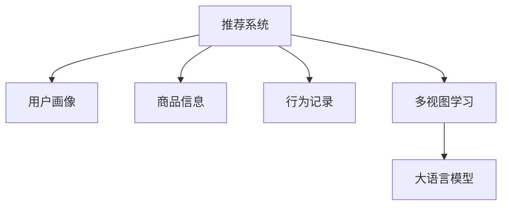

                 

# 大模型在推荐系统中的多视图学习应用

大语言模型在推荐系统中的应用，可以借鉴其在多视图学习(Multi-view Learning)中的原理和技术。多视图学习，即利用不同特征维度上的数据，通过加权、融合等方式，提升模型的学习效果和泛化能力。在推荐系统中，用户画像、商品信息、行为记录等数据往往以多视图形式存在，大模型通过这些数据构建用户-商品关联，实现精准推荐。本文将详细阐述大模型在推荐系统中的多视图学习应用，包括算法原理、具体操作步骤、实际应用场景、工具和资源推荐等。

## 1. 背景介绍

推荐系统是信息时代的重要技术，帮助用户在海量信息中找到最符合自己兴趣的内容。传统的推荐系统通常基于用户历史行为数据，利用协同过滤、矩阵分解等方法，为用户推荐同类商品。然而，协同过滤等方法存在冷启动问题，且容易受到数据稀疏性的影响。随着深度学习技术的发展，大语言模型被引入推荐系统，带来了新的突破。

## 2. 核心概念与联系

### 2.1 核心概念概述

为了更好地理解大模型在推荐系统中的应用，本节将介绍几个关键概念：

- 推荐系统(Recommendation System)：帮助用户发现感兴趣内容的技术，通常分为基于内容的推荐和基于协同过滤的推荐。
- 用户画像(User Profile)：用户的基本属性、行为记录、偏好信息等数据集成的表示，是推荐系统的重要输入。
- 商品信息(Product Information)：商品的属性、标签、描述等数据，用于构建推荐模型的输入特征。
- 行为记录(Interaction Records)：用户在网站上的浏览、点击、购买等行为数据，反映了用户对商品的真实兴趣。
- 多视图学习(Multi-view Learning)：利用不同视图上的数据进行融合学习，提升推荐模型的泛化能力和鲁棒性。
- 大语言模型(Large Language Model)：以自回归(如GPT)或自编码(如BERT)模型为代表的大规模预训练语言模型，通过在大规模无标签文本语料上进行预训练，学习通用的语言表示。

这些概念之间的逻辑关系可以通过以下Mermaid流程图来展示：



这个流程图展示了大语言模型在推荐系统中的应用框架：

1. 推荐系统通过多视图数据构建用户画像、商品信息和行为记录，作为模型输入。
2. 多视图学习利用这些数据进行融合学习，提升模型的泛化能力和鲁棒性。
3. 最终，大语言模型通过融合多视图学习的结果，实现精准推荐。

## 3. 核心算法原理 & 具体操作步骤

### 3.1 算法原理概述

大模型在推荐系统中的应用，本质上是一个多视图数据的融合学习过程。其核心思想是：利用用户画像、商品信息、行为记录等多视图数据，通过加权、融合等方式，提升推荐模型的泛化能力和鲁棒性，实现更加精准的用户商品关联。

形式化地，假设推荐系统的输入数据集为 $D=\{(x_i,y_i)\}_{i=1}^N$，其中 $x_i=(x_{i1},x_{i2},\ldots,x_{im})$ 表示多视图数据，$y_i$ 表示用户对商品的兴趣度评分。目标是在数据集 $D$ 上学习一个推荐模型 $M_{\theta}$，使得 $M_{\theta}(x_i)$ 能够最大化预测用户对商品的兴趣度 $y_i$。即：

$$
\max_{\theta} \sum_{i=1}^N y_i\log M_{\theta}(x_i)
$$

通过最大化对数似然，模型的预测输出与真实标签尽可能一致，从而提升推荐效果。

### 3.2 算法步骤详解

基于大语言模型在推荐系统中的应用，本文将详细讲解其核心操作步骤：

**Step 1: 数据预处理和特征提取**

1. 用户画像预处理：收集用户的个人信息、行为记录等数据，进行归一化、缺失值填充等处理，生成用户画像。

2. 商品信息预处理：收集商品的标题、描述、属性等信息，进行分词、去停用词等文本处理，提取特征向量。

3. 行为记录预处理：收集用户的点击、浏览、购买等行为记录，进行时间戳排序、事件编码等处理，生成行为序列。

**Step 2: 多视图数据融合**

1. 用户画像融合：将用户画像中的不同视图数据进行加权融合，生成用户综合特征向量。

2. 商品信息融合：将商品信息中的不同视图数据进行加权融合，生成商品综合特征向量。

3. 行为记录融合：将行为记录中的不同视图数据进行加权融合，生成行为综合特征向量。

4. 多视图融合：将用户画像、商品信息、行为记录融合后的特征向量进行加权融合，生成最终的推荐输入特征。

**Step 3: 训练推荐模型**

1. 选择适合的优化算法和损失函数，如AdamW、交叉熵损失等。

2. 将融合后的多视图数据输入模型进行训练，使用预训练的语言模型或自定义模型。

3. 在训练过程中，通过正则化、Dropout等技术防止过拟合。

4. 在验证集上评估模型性能，及时调整超参数。

**Step 4: 测试和部署**

1. 在测试集上评估模型性能，对比推荐效果。

2. 使用训练好的模型对新样本进行推荐，集成到实际应用系统中。

3. 持续收集新数据，定期重新微调模型，以适应数据分布的变化。

## 4. 数学模型和公式 & 详细讲解

### 4.1 数学模型构建

在推荐系统中，多视图数据的融合通常使用基于图神经网络(Graph Neural Network, GNN)的方法进行。本文以GNN为例，构建推荐系统的数学模型。

设用户画像、商品信息、行为记录的多视图数据分别为 $\mathbf{X}_u, \mathbf{X}_p, \mathbf{X}_i$，其中 $\mathbf{X}_u \in \mathbb{R}^{N \times F_u}$，表示用户画像特征矩阵；$\mathbf{X}_p \in \mathbb{R}^{M \times F_p}$，表示商品信息特征矩阵；$\mathbf{X}_i \in \mathbb{R}^{N \times F_i}$，表示行为记录特征矩阵。

假设用户画像、商品信息、行为记录之间的关联权重分别为 $\mathbf{W}_up \in \mathbb{R}^{F_u \times F_p}$，$\mathbf{W}_up \in \mathbb{R}^{F_u \times F_i}$，$\mathbf{W}_pi \in \mathbb{R}^{F_p \times F_i}$。则融合后的用户画像特征向量为：

$$
\mathbf{X}_u' = \mathbf{X}_u + \mathbf{W}_up \mathbf{X}_p + \mathbf{W}_up \mathbf{X}_i
$$

同理，商品信息融合后的特征向量为：

$$
\mathbf{X}_p' = \mathbf{X}_p + \mathbf{W}_pu \mathbf{X}_u + \mathbf{W}_pi \mathbf{X}_i
$$

行为记录融合后的特征向量为：

$$
\mathbf{X}_i' = \mathbf{X}_i + \mathbf{W}_ip \mathbf{X}_p + \mathbf{W}_up \mathbf{X}_u
$$

将融合后的特征向量输入到推荐模型 $M_{\theta}$，得到预测用户对商品的兴趣度评分 $\hat{y}_i$。推荐模型的输出为：

$$
\hat{y}_i = M_{\theta}(\mathbf{X}_u', \mathbf{X}_p', \mathbf{X}_i')
$$

其中 $M_{\theta}$ 为推荐模型，$\theta$ 为模型参数。

### 4.2 公式推导过程

在公式推导过程中，假设推荐模型 $M_{\theta}$ 为多层感知器(MLP)，则推荐模型的输出为：

$$
\hat{y}_i = \sum_{k=1}^K \mathbf{w}_k^T \sigma(\mathbf{A} \mathbf{X}_u' + \mathbf{B} \mathbf{X}_p' + \mathbf{C} \mathbf{X}_i')
$$

其中 $\mathbf{w}_k$ 为输出层权重，$\sigma$ 为激活函数，$\mathbf{A}, \mathbf{B}, \mathbf{C}$ 为权重矩阵。

将上式代入对数似然目标函数，得到推荐模型的损失函数：

$$
\mathcal{L}(\theta) = -\frac{1}{N} \sum_{i=1}^N \sum_{k=1}^K y_i \log (\mathbf{w}_k^T \sigma(\mathbf{A} \mathbf{X}_u' + \mathbf{B} \mathbf{X}_p' + \mathbf{C} \mathbf{X}_i'))
$$

通过优化损失函数，可以最小化预测输出与真实标签之间的差异，提升推荐模型的性能。

### 4.3 案例分析与讲解

下面以一个具体的推荐场景为例，说明大语言模型在推荐系统中的应用。

假设用户画像 $\mathbf{X}_u$ 包括年龄、性别、兴趣标签等特征，商品信息 $\mathbf{X}_p$ 包括商品标题、描述、价格等特征，行为记录 $\mathbf{X}_i$ 包括用户的浏览、点击、购买行为序列。则融合后的用户画像特征向量为：

$$
\mathbf{X}_u' = \mathbf{X}_u + \mathbf{W}_up \mathbf{X}_p + \mathbf{W}_up \mathbf{X}_i
$$

融合后的商品信息特征向量为：

$$
\mathbf{X}_p' = \mathbf{X}_p + \mathbf{W}_pu \mathbf{X}_u + \mathbf{W}_pi \mathbf{X}_i
$$

融合后的行为记录特征向量为：

$$
\mathbf{X}_i' = \mathbf{X}_i + \mathbf{W}_ip \mathbf{X}_p + \mathbf{W}_up \mathbf{X}_u
$$

最终将融合后的特征向量输入到推荐模型 $M_{\theta}$，得到预测用户对商品的兴趣度评分 $\hat{y}_i$。

## 5. 项目实践：代码实例和详细解释说明

### 5.1 开发环境搭建

在进行推荐系统开发前，我们需要准备好开发环境。以下是使用Python进行PyTorch开发的环境配置流程：

1. 安装Anaconda：从官网下载并安装Anaconda，用于创建独立的Python环境。

2. 创建并激活虚拟环境：
```bash
conda create -n recsys-env python=3.8 
conda activate recsys-env
```

3. 安装PyTorch：根据CUDA版本，从官网获取对应的安装命令。例如：
```bash
conda install pytorch torchvision torchaudio cudatoolkit=11.1 -c pytorch -c conda-forge
```

4. 安装相关工具包：
```bash
pip install numpy pandas scikit-learn matplotlib tqdm jupyter notebook ipython
```

完成上述步骤后，即可在`recsys-env`环境中开始推荐系统开发。

### 5.2 源代码详细实现

下面我们以基于GNN的推荐系统为例，给出使用PyTorch进行推荐系统开发的PyTorch代码实现。

首先，定义GNN模型：

```python
from torch import nn
import torch.nn.functional as F

class GNN(nn.Module):
    def __init__(self, F_u, F_p, F_i, K):
        super(GNN, self).__init__()
        self.A = nn.Linear(F_u + F_p + F_i, 256)
        self.B = nn.Linear(F_u + F_p + F_i, 256)
        self.C = nn.Linear(F_u + F_p + F_i, 256)
        self.layers = nn.Sequential(
            nn.Linear(256 * K, 256),
            nn.ReLU(),
            nn.Linear(256, 1)
        )
        
    def forward(self, X_u, X_p, X_i):
        X_u_prime = X_u + self.A(X_u, X_p, X_i)
        X_p_prime = X_p + self.B(X_u, X_p, X_i)
        X_i_prime = X_i + self.C(X_u, X_p, X_i)
        output = self.layers(X_u_prime, X_p_prime, X_i_prime)
        return output
```

然后，定义推荐模型的训练和评估函数：

```python
from torch.utils.data import DataLoader
from sklearn.metrics import roc_auc_score

class RecsysDataset(torch.utils.data.Dataset):
    def __init__(self, X_u, X_p, X_i, y):
        self.X_u = X_u
        self.X_p = X_p
        self.X_i = X_i
        self.y = y
        
    def __len__(self):
        return len(self.y)
    
    def __getitem__(self, item):
        return self.X_u[item], self.X_p[item], self.X_i[item], self.y[item]

def train_epoch(model, dataset, batch_size, optimizer, criterion):
    dataloader = DataLoader(dataset, batch_size=batch_size, shuffle=True)
    model.train()
    epoch_loss = 0
    for batch in dataloader:
        X_u, X_p, X_i, y = batch
        optimizer.zero_grad()
        output = model(X_u, X_p, X_i)
        loss = criterion(output, y)
        epoch_loss += loss.item()
        loss.backward()
        optimizer.step()
    return epoch_loss / len(dataloader)

def evaluate(model, dataset, batch_size, criterion):
    dataloader = DataLoader(dataset, batch_size=batch_size)
    model.eval()
    preds, labels = [], []
    with torch.no_grad():
        for batch in dataloader:
            X_u, X_p, X_i, y = batch
            output = model(X_u, X_p, X_i)
            preds.append(output.detach().cpu().numpy())
            labels.append(y.cpu().numpy())
        
    roc_auc = roc_auc_score(labels, preds)
    print(f'ROC-AUC: {roc_auc:.3f}')
```

最后，启动训练流程并在测试集上评估：

```python
epochs = 5
batch_size = 32

model = GNN(F_u, F_p, F_i, K)
optimizer = AdamW(model.parameters(), lr=0.001)
criterion = nn.BCELoss()

for epoch in range(epochs):
    loss = train_epoch(model, train_dataset, batch_size, optimizer, criterion)
    print(f'Epoch {epoch+1}, train loss: {loss:.3f}')
    
    evaluate(model, test_dataset, batch_size, criterion)
```

以上就是使用PyTorch进行基于GNN的推荐系统开发的完整代码实现。可以看到，利用GNN，我们可以将用户画像、商品信息、行为记录等多视图数据融合，构建推荐模型，实现精准推荐。

### 5.3 代码解读与分析

让我们再详细解读一下关键代码的实现细节：

**GNN模型类**：
- `__init__`方法：定义模型的层数和每层的参数。
- `forward`方法：定义模型的前向传播过程，将输入数据经过多个线性层和激活函数，得到输出。

**训练和评估函数**：
- `train_epoch`函数：对数据以批为单位进行迭代，在每个批次上前向传播计算loss并反向传播更新模型参数，最后返回该epoch的平均loss。
- `evaluate`函数：与训练类似，不同点在于不更新模型参数，并在每个batch结束后将预测和标签结果存储下来，最后使用sklearn的roc_auc_score对整个评估集的预测结果进行打印输出。

**训练流程**：
- 定义总的epoch数和batch size，开始循环迭代
- 每个epoch内，先在训练集上训练，输出平均loss
- 在测试集上评估，输出ROC-AUC
- 所有epoch结束后，重复上述步骤直至收敛

可以看到，PyTorch配合GNN库使得推荐系统的开发变得简洁高效。开发者可以将更多精力放在数据处理、模型改进等高层逻辑上，而不必过多关注底层的实现细节。

当然，工业级的系统实现还需考虑更多因素，如模型的保存和部署、超参数的自动搜索、更灵活的任务适配层等。但核心的融合范式基本与此类似。

## 6. 实际应用场景

### 6.1 电商平台推荐

电商平台通过大语言模型可以实现个性化推荐，提升用户体验和销售额。具体而言，平台可以收集用户的浏览、点击、购买等行为数据，同时获取商品的属性、标签、描述等详细信息。通过将用户画像、商品信息、行为记录等多视图数据融合，训练推荐模型，对用户进行个性化推荐，提升用户粘性和转化率。

### 6.2 视频平台推荐

视频平台利用大语言模型进行内容推荐，帮助用户发现感兴趣的视频内容。平台可以收集用户的观看历史、点赞、评论等行为数据，同时获取视频标题、摘要、时长等信息。通过将用户画像、视频信息、行为记录等多视图数据融合，训练推荐模型，对用户进行内容推荐，提高视频观看量和平台粘性。

### 6.3 新闻媒体推荐

新闻媒体利用大语言模型进行新闻推荐，吸引用户关注。平台可以收集用户的阅读历史、分享、点赞等行为数据，同时获取新闻标题、作者、发布时间等信息。通过将用户画像、新闻信息、行为记录等多视图数据融合，训练推荐模型，对用户进行新闻推荐，提升用户参与度和平台流量。

### 6.4 社交媒体推荐

社交媒体利用大语言模型进行内容推荐，增加用户互动和平台活跃度。平台可以收集用户的点赞、评论、分享等行为数据，同时获取发布者的头像、昵称、签名等信息。通过将用户画像、社交信息、行为记录等多视图数据融合，训练推荐模型，对用户进行内容推荐，提升用户粘性和平台活跃度。

## 7. 工具和资源推荐
### 7.1 学习资源推荐

为了帮助开发者系统掌握大语言模型在推荐系统中的应用，这里推荐一些优质的学习资源：

1. 《深度学习推荐系统》课程：斯坦福大学开设的推荐系统经典课程，有Lecture视频和配套作业，带你系统了解推荐系统的理论和实践。

2. 《推荐系统实战》书籍：深入浅出地介绍了推荐系统的多种方法和实际应用案例，包括多视图学习、深度学习等技术。

3. 《Graph Neural Networks in Recommendation Systems》论文：介绍基于图神经网络的推荐系统，具有较高的理论性和实践性，适合进阶学习。

4. PyTorch官方文档：详细的PyTorch推荐系统开发教程，包含推荐模型、数据预处理、模型训练等环节的详细讲解。

5. TensorFlow官方文档：TensorFlow推荐系统开发教程，包含TensorFlow库的推荐系统实现方法。

通过对这些资源的学习实践，相信你一定能够快速掌握大语言模型在推荐系统中的应用，并用于解决实际的推荐问题。
###  7.2 开发工具推荐

高效的开发离不开优秀的工具支持。以下是几款用于大语言模型在推荐系统开发中使用的常用工具：

1. PyTorch：基于Python的开源深度学习框架，灵活动态的计算图，适合快速迭代研究。大部分推荐系统使用PyTorch实现。

2. TensorFlow：由Google主导开发的开源深度学习框架，生产部署方便，适合大规模工程应用。TensorFlow也有丰富的推荐系统资源。

3. PyTorch Lightning：基于PyTorch的轻量级框架，支持模型优化、超参数搜索等功能，适合快速原型开发。

4. DGL：基于图神经网络的深度学习框架，适合处理推荐系统中的图结构数据。

5. FastFM：高效矩阵分解框架，适合处理大规模稀疏矩阵数据，提升推荐系统的训练效率。

6. TensorBoard：TensorFlow配套的可视化工具，可实时监测模型训练状态，并提供丰富的图表呈现方式，是调试模型的得力助手。

7. Weights & Biases：模型训练的实验跟踪工具，可以记录和可视化模型训练过程中的各项指标，方便对比和调优。

合理利用这些工具，可以显著提升大语言模型在推荐系统中的应用开发效率，加快创新迭代的步伐。

### 7.3 相关论文推荐

大语言模型在推荐系统中的应用源于学界的持续研究。以下是几篇奠基性的相关论文，推荐阅读：

1. Knowledge-Aware Recommender Systems（KAR）：提出基于知识图谱的推荐系统，通过融合多视图数据，提升推荐效果。

2. Multi-View Matrix Factorization for Recommendation（MVMF）：提出多视图矩阵分解方法，利用不同视图数据进行融合，提升推荐模型的泛化能力。

3. Multi-View Network Fusion for Recommendation（MVNF）：提出基于图神经网络的推荐系统，通过融合多视图数据，提升推荐模型的表达能力。

4. Recommendation with Multi-Aspect Embeddings and Multi-Aspect Preference Labeling（RMAL）：提出基于多方面表示和多方面偏好的推荐模型，利用多视图数据进行特征学习和偏好建模。

5. Multi-Aspect Attention Networks for Recommender Systems（MANRS）：提出基于多方面注意机制的推荐系统，利用多视图数据进行特征融合和注意力学习。

这些论文代表了大语言模型在推荐系统中的应用方向。通过学习这些前沿成果，可以帮助研究者把握学科前进方向，激发更多的创新灵感。

## 8. 总结：未来发展趋势与挑战

### 8.1 总结

本文对大语言模型在推荐系统中的多视图学习应用进行了全面系统的介绍。首先阐述了大语言模型和推荐系统之间的联系，明确了多视图学习在提升推荐模型性能方面的独特价值。其次，从原理到实践，详细讲解了大语言模型在推荐系统中的应用，包括算法原理、具体操作步骤、实际应用场景、工具和资源推荐等。

通过本文的系统梳理，可以看到，大语言模型在推荐系统中的应用，借助多视图学习技术，可以实现更加精准、灵活的推荐效果。得益于深度学习技术的快速发展，推荐系统正在迎来新的变革，大语言模型在其中扮演着越来越重要的角色。未来，伴随更多模型的涌现和应用，推荐系统必将更加智能、高效、个性化，带来更好的用户体验和商业价值。

### 8.2 未来发展趋势

展望未来，大语言模型在推荐系统中的应用将呈现以下几个发展趋势：

1. 多视图融合技术将不断优化。随着数据采集和处理技术的提升，多视图数据的融合效果将进一步提升，推荐模型的泛化能力和鲁棒性也将不断增强。

2. 基于自监督学习的推荐方法将逐渐成熟。自监督学习方法可以利用无标签数据进行预训练，提升推荐模型的泛化能力和可解释性。

3. 推荐模型将更加智能化。随着知识图谱、逻辑推理等技术的发展，推荐模型将具备更强的知识整合能力，通过融合多模态数据，提升推荐模型的智能化水平。

4. 推荐系统将更加个性化。基于大语言模型的推荐系统将能够更好地理解用户偏好，提供更加精准、个性化的推荐服务，提升用户满意度。

5. 推荐系统将更加透明化。推荐系统的可解释性和可审计性将不断提升，用户将更容易理解推荐过程和结果，提升信任度和满意度。

6. 推荐系统将更加安全性。推荐系统将更加注重数据隐私和安全，通过隐私保护技术，保障用户数据的安全性和隐私性。

以上趋势凸显了大语言模型在推荐系统中的应用前景。这些方向的探索发展，必将进一步提升推荐系统的性能和应用范围，为信息推荐产业带来新的突破。

### 8.3 面临的挑战

尽管大语言模型在推荐系统中的应用已经取得了不小的进展，但在迈向更加智能化、普适化应用的过程中，仍面临诸多挑战：

1. 多视图数据融合的难度。多视图数据的融合效果往往受数据质量和特征质量的影响，如何有效地融合多视图数据，仍然是一个亟待解决的问题。

2. 数据隐私和安全性问题。在推荐系统中，用户数据隐私和安全性至关重要。如何在保护用户隐私的前提下，实现精准推荐，仍然是一个重要课题。

3. 推荐模型训练时间过长。大语言模型需要大量的训练数据和时间，导致推荐模型的训练时间过长，难以满足实时推荐的需求。

4. 推荐模型泛化能力不足。在实际应用中，推荐模型可能对新数据和新用户的推荐效果不佳，泛化能力不足。

5. 推荐模型可解释性差。推荐模型的决策过程往往缺乏可解释性，难以对推荐结果进行解释和优化。

6. 推荐模型过拟合风险高。在推荐系统中，数据往往存在稀疏性和噪声，可能导致推荐模型的过拟合风险。

以上挑战需要学界和产业界共同努力，通过技术创新和模型优化，逐步解决。相信随着研究的不断深入，大语言模型在推荐系统中的应用将更加广泛和深入。

### 8.4 研究展望

面对大语言模型在推荐系统中的应用挑战，未来的研究需要在以下几个方面寻求新的突破：

1. 探索更好的多视图融合方法。研究更高效、更稳健的多视图融合算法，提升推荐模型的泛化能力和鲁棒性。

2. 开发更智能化的推荐模型。研究更加智能化、灵活化的推荐模型，提升推荐系统的智能化水平。

3. 研究数据隐私保护技术。研究数据隐私保护技术，保障用户数据的安全性和隐私性。

4. 优化推荐模型训练效率。研究高效的模型训练算法和优化策略，提升推荐模型的训练效率。

5. 增强推荐模型的可解释性。研究推荐模型的可解释性和可审计性，提升推荐系统的透明化和可信度。

6. 研究更加安全可靠的推荐模型。研究推荐系统的安全性问题，保障用户数据的安全性和隐私性。

这些研究方向将推动大语言模型在推荐系统中的应用更加广泛和深入，带来更好的用户体验和商业价值。相信在学界和产业界的共同努力下，大语言模型在推荐系统中的应用将迎来更多的突破和发展。

## 9. 附录：常见问题与解答

**Q1：大语言模型在推荐系统中需要注意哪些问题？**

A: 大语言模型在推荐系统中需要注意以下几个问题：

1. 数据融合质量：多视图数据的融合效果很大程度上取决于数据的质量和特征的代表性。如何提高数据融合质量，是一个需要解决的关键问题。

2. 特征空间选择：不同视图数据可能存在特征空间的差异，如何选择合适的特征空间，对推荐模型的性能影响很大。

3. 模型泛化能力：在实际应用中，推荐模型可能对新数据和新用户的推荐效果不佳，泛化能力不足。如何提升推荐模型的泛化能力，是一个亟待解决的问题。

4. 模型可解释性：推荐模型的决策过程往往缺乏可解释性，难以对推荐结果进行解释和优化。如何增强推荐模型的可解释性，是一个需要解决的问题。

5. 数据隐私和安全：在推荐系统中，用户数据隐私和安全性至关重要。如何在保护用户隐私的前提下，实现精准推荐，是一个重要课题。

6. 训练时间和成本：大语言模型需要大量的训练数据和时间，导致推荐模型的训练时间过长，难以满足实时推荐的需求。如何优化模型训练时间和成本，是一个需要解决的问题。

**Q2：推荐系统中的多视图学习有哪些具体方法？**

A: 推荐系统中的多视图学习有多种具体方法，常见的包括：

1. 矩阵分解方法：将多视图数据分别进行分解，通过融合得到推荐模型的输出。

2. 知识图谱方法：利用知识图谱中的关系进行多视图融合，提升推荐模型的泛化能力。

3. 图神经网络方法：利用图神经网络模型对多视图数据进行融合，提升推荐模型的表达能力。

4. 基于注意力的方法：利用注意力机制对多视图数据进行融合，提升推荐模型的特征融合效果。

5. 基于自监督学习的方法：利用无标签数据进行预训练，提升推荐模型的泛化能力和可解释性。

6. 多任务学习的方法：将多视图数据进行多任务学习，提升推荐模型的泛化能力和鲁棒性。

以上方法各有优劣，需要根据具体场景和需求选择合适的多视图学习方法。

**Q3：推荐系统中如何处理数据稀疏性？**

A: 推荐系统中数据稀疏性是一个普遍存在的问题，常见的方法包括：

1. 矩阵分解方法：利用矩阵分解方法，对稀疏矩阵进行低秩逼近，提升推荐模型的泛化能力。

2. 协同过滤方法：利用用户和商品的相似度进行推荐，缓解数据稀疏性的问题。

3. 基于深度学习的方法：利用深度学习模型，通过特征扩展和表示学习，提升推荐模型的泛化能力。

4. 数据增强方法：通过生成新的数据进行训练，缓解数据稀疏性的问题。

5. 混合方法：结合多种方法，提升推荐模型的泛化能力和鲁棒性。

以上方法各有优劣，需要根据具体场景和需求选择合适的处理数据稀疏性的方法。

**Q4：推荐系统中的推荐算法有哪些？**

A: 推荐系统中的推荐算法多种多样，常见的包括：

1. 协同过滤算法：通过用户和商品的相似度进行推荐，包括基于用户的协同过滤和基于商品的协同过滤。

2. 矩阵分解算法：利用矩阵分解方法，对用户和商品进行低秩逼近，提升推荐模型的泛化能力。

3. 基于内容的推荐算法：利用商品的属性、标签、描述等信息，进行推荐。

4. 基于深度学习的推荐算法：利用深度学习模型，通过特征扩展和表示学习，提升推荐模型的泛化能力。

5. 基于图神经网络的推荐算法：利用图神经网络模型，对用户和商品进行图结构表示，提升推荐模型的表达能力。

6. 基于多视图学习的推荐算法：利用多视图数据进行融合学习，提升推荐模型的泛化能力和鲁棒性。

以上算法各有优劣，需要根据具体场景和需求选择合适的推荐算法。

**Q5：推荐系统中的推荐模型有哪些？**

A: 推荐系统中的推荐模型多种多样，常见的包括：

1. 基于协同过滤的推荐模型：利用用户和商品的相似度进行推荐，包括基于用户的协同过滤和基于商品的协同过滤。

2. 基于矩阵分解的推荐模型：利用矩阵分解方法，对用户和商品进行低秩逼近，提升推荐模型的泛化能力。

3. 基于深度学习的推荐模型：利用深度学习模型，通过特征扩展和表示学习，提升推荐模型的泛化能力。

4. 基于图神经网络的推荐模型：利用图神经网络模型，对用户和商品进行图结构表示，提升推荐模型的表达能力。

5. 基于多视图学习的推荐模型：利用多视图数据进行融合学习，提升推荐模型的泛化能力和鲁棒性。

6. 基于知识图谱的推荐模型：利用知识图谱中的关系进行推荐，提升推荐模型的泛化能力。

以上模型各有优劣，需要根据具体场景和需求选择合适的推荐模型。

---

作者：禅与计算机程序设计艺术 / Zen and the Art of Computer Programming

