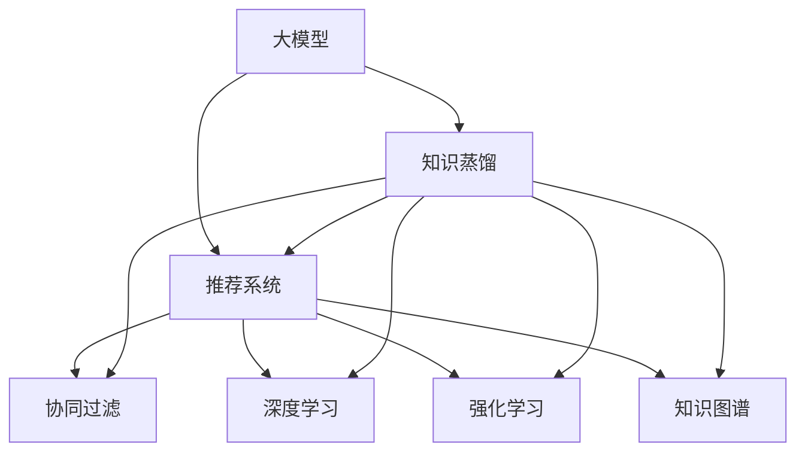

                 

# 大模型在推荐系统中的知识蒸馏应用

> 关键词：大模型,知识蒸馏,推荐系统,深度学习,强化学习,知识图谱

## 1. 背景介绍

在深度学习和人工智能领域，推荐系统是其中一个最为关键的应用场景。推荐系统旨在根据用户的历史行为和偏好，智能地推荐物品，从而提高用户满意度和互动率，助力商业增长。传统的推荐系统主要基于协同过滤、基于内容的推荐等方法，但这些方法存在数据稀疏、算法复杂等缺点。随着深度学习技术的发展，深度神经网络，特别是大模型，在推荐系统中得到广泛应用。大模型通过在丰富的训练数据上进行预训练，学习到强大的特征提取能力，可用于生成高质量的用户和物品表示。然而，大模型往往存在推理复杂度高、计算资源需求大等问题，难以在实时系统中直接部署。为了解决这些问题，知识蒸馏技术应运而生，通过将大模型的知识转移到知识量较少的小模型中，实现模型的轻量化和高效推理，从而在推荐系统中发挥更大的作用。

## 2. 核心概念与联系

### 2.1 核心概念概述

为更好地理解大模型在推荐系统中的知识蒸馏应用，本节将介绍几个关键的概念：

- 大模型(Large Model)：指在大量数据上预训练得到的深度神经网络模型，具有强大的特征提取和表示能力。
- 知识蒸馏(Knowledge Distillation)：通过将复杂模型的知识(如权重、梯度等)传递给简单模型，实现小模型获得大模型的性能提升。
- 推荐系统(Recommender System)：根据用户历史行为和偏好，推荐物品的系统，旨在提高用户满意度。
- 协同过滤(Collaborative Filtering)：通过分析用户和物品的相似性，进行推荐。
- 深度学习(Deep Learning)：基于神经网络的多层次数据表示方法，用于复杂问题的建模和预测。
- 强化学习(Reinforcement Learning)：通过与环境交互，学习最优策略的过程。
- 知识图谱(Knowledge Graph)：用图结构表示实体和关系的知识库，用于辅助推荐系统进行推理。

这些核心概念之间的逻辑关系可以通过以下Mermaid流程图来展示：



这个流程图展示了大模型、知识蒸馏和推荐系统的核心概念及其之间的关系：

1. 大模型通过预训练获得基础的特征提取能力。
2. 知识蒸馏将大模型的知识转移到简单模型，实现模型压缩和高效推理。
3. 推荐系统利用知识蒸馏后的模型，提供个性化的物品推荐。
4. 协同过滤、深度学习、强化学习、知识图谱等技术，为推荐系统提供多方面的支撑。

这些概念共同构成了推荐系统和大模型知识蒸馏的应用框架，使得推荐系统能够更好地从复杂模型中受益，提升推荐质量。

## 3. 核心算法原理 & 具体操作步骤
### 3.1 算法原理概述

大模型在推荐系统中的知识蒸馏应用，本质上是将大模型的知识传递给小模型，使得小模型能够在少数据、少计算资源的情况下，获得接近大模型的预测性能。该过程可以概括为以下几步：

1. 在大模型上进行预训练，学习丰富的语义表示。
2. 将大模型和小模型作为两个独立的训练任务。
3. 通过softmax或max-pooling等方式，将大模型的预测输出作为训练信号，指导小模型的训练。
4. 优化小模型的权重和激活函数，使得其能够有效学习大模型的知识。
5. 在实际推荐场景中，使用小模型进行物品推荐，获得推荐效果。

### 3.2 算法步骤详解

以下是详细描述知识蒸馏算法的步骤：

**Step 1: 选择大模型和小模型**
- 选择适合的任务作为预训练模型，如BERT、GPT等。
- 确定小模型结构，可以是简单的全连接网络、卷积神经网络或Transformer等。

**Step 2: 进行预训练**
- 在大规模无标签数据上对大模型进行预训练，学习基础的特征表示。
- 对小模型进行同样的预训练，使得其能够学习到部分大模型的知识。

**Step 3: 进行知识蒸馏**
- 在大模型和小模型之间设计知识蒸馏过程。通常有三种方式：
  - Softmax蒸馏：将大模型的预测概率分布作为目标，指导小模型的训练。
  - Max-pooling蒸馏：选择大模型预测概率最高的部分，作为小模型的训练信号。
  - 特征蒸馏：将大模型的中间层特征，作为小模型的训练信号。
- 在小模型的训练过程中，使用知识蒸馏信号作为额外的目标，优化模型参数。

**Step 4: 进行微调**
- 在小模型上进行微调，利用推荐系统中的标注数据，进一步优化模型性能。
- 根据微调后的模型在小数据集上的表现，进行模型的验证和部署。

**Step 5: 部署和使用**
- 将微调后的模型部署到推荐系统中，进行物品推荐。
- 实时收集用户反馈，持续优化模型参数，提升推荐效果。

### 3.3 算法优缺点

知识蒸馏在推荐系统中具有以下优点：
1. 提升推荐效果：通过知识蒸馏，小模型能够获得接近大模型的性能，提高推荐质量。
2. 降低计算成本：小模型的计算复杂度低，训练和推理速度快，降低了推荐系统的资源需求。
3. 增强泛化能力：小模型通过学习大模型的知识，具备更强的泛化能力，能更好地应对新数据和新物品。

同时，该方法也存在一些缺点：
1. 知识传递效率：知识蒸馏依赖于目标函数的设计，需要精心设计才能达到最佳效果。
2. 数据依赖：小模型仍然依赖于推荐系统中的标注数据，数据量和质量对模型效果影响较大。
3. 模型复杂度：小模型的结构和复杂度难以兼顾，需要在性能和计算复杂度之间进行权衡。

尽管存在这些局限性，知识蒸馏在推荐系统中仍是一种有效的方法，通过精心设计和优化，可以大幅提升推荐效果和系统性能。

### 3.4 算法应用领域

知识蒸馏在推荐系统中具有广泛的应用场景，如：

- 商品推荐：通过知识蒸馏，使用较小的模型对用户行为进行预测，提高推荐效率和效果。
- 音乐推荐：对用户的听歌历史进行建模，使用知识蒸馏得到高精度的音乐推荐系统。
- 视频推荐：利用知识蒸馏提升对用户视频观看习惯的预测能力，实现个性化推荐。
- 个性化广告：在广告推荐中，通过知识蒸馏实现对用户兴趣的精准匹配，提升广告转化率。
- 个性化新闻：根据用户的历史阅读记录，使用知识蒸馏得到高质量的新闻推荐系统。

## 4. 数学模型和公式 & 详细讲解 & 举例说明
### 4.1 数学模型构建

在本节中，我们将详细介绍推荐系统中的知识蒸馏模型的数学模型。

**推荐模型**：假设推荐模型为 $M_{\theta}(x)$，其中 $\theta$ 为模型参数，$x$ 为输入特征。假设推荐目标为最大化用户满意度，即最大化用户对物品的评分 $r$。

**知识蒸馏模型**：小模型的输入为 $x$，输出为 $y$，其中 $y$ 为预测的概率分布或中间层特征。知识蒸馏的目标是通过学习大模型的知识，最小化与大模型预测的差距。

**蒸馏目标**：假设大模型的预测为 $\hat{r}$，小模型的预测为 $y$，则蒸馏目标为最小化两者之间的差距：
$$
L = \mathcal{L}(D, y, \hat{r})
$$
其中 $\mathcal{L}$ 为蒸馏损失函数，通常包含KL散度、最大似然等。

### 4.2 公式推导过程

假设大模型 $M_{\theta_D}$ 的预测概率分布为 $\hat{r} = M_{\theta_D}(x)$，小模型 $M_{\theta_S}$ 的预测概率分布为 $y = M_{\theta_S}(x)$。则蒸馏损失函数可以表示为：
$$
\mathcal{L}(D, y, \hat{r}) = \mathbb{E}_{(x,r)\sim D}[\mathcal{L}(y, \hat{r})]
$$
其中 $\mathcal{L}(y, \hat{r})$ 为目标函数，通常为KL散度、最大似然等。

对于KL散度，蒸馏损失函数为：
$$
\mathcal{L}_{KL}(y, \hat{r}) = \mathbb{E}_{(x,r)\sim D}[-\log \frac{y}{\hat{r}}]
$$

### 4.3 案例分析与讲解

以一个简单的商品推荐为例，说明知识蒸馏的实现过程。

**数据集**：假设有一个推荐系统，数据集包含用户的历史购买记录和商品的属性信息。

**预训练**：使用大模型对用户购买记录和商品属性进行预训练，学习用户和商品之间的相似度表示。

**小模型**：选择一个小型卷积神经网络作为推荐模型，进行同样的预训练。

**知识蒸馏**：在大模型和小模型之间设计蒸馏过程。假设大模型的预测概率分布为 $\hat{p} = M_{\theta_D}(x)$，小模型的预测概率分布为 $p = M_{\theta_S}(x)$。则蒸馏目标可以表示为：
$$
\min_{\theta_S} \mathbb{E}_{(x,r)\sim D}[-\log \frac{p}{\hat{p}}]
$$

**微调**：在小模型上进行微调，利用推荐系统中的标注数据，进一步优化模型参数。假设推荐目标为最大化用户满意度，即最大化用户对物品的评分 $r$。则微调目标可以表示为：
$$
\min_{\theta_S} \mathbb{E}_{(x,r)\sim D}[r - \log \frac{p}{\hat{p}}]
$$

**部署和使用**：将微调后的模型部署到推荐系统中，进行物品推荐。在实际使用中，可以使用小模型预测用户对物品的评分，推荐系统根据评分进行排序推荐。

## 5. 项目实践：代码实例和详细解释说明
### 5.1 开发环境搭建

在进行知识蒸馏实践前，我们需要准备好开发环境。以下是使用Python进行TensorFlow开发的环境配置流程：

1. 安装Anaconda：从官网下载并安装Anaconda，用于创建独立的Python环境。

2. 创建并激活虚拟环境：
```bash
conda create -n tf-env python=3.8 
conda activate tf-env
```

3. 安装TensorFlow：根据CUDA版本，从官网获取对应的安装命令。例如：
```bash
conda install tensorflow -c pytorch -c conda-forge
```

4. 安装Keras：
```bash
pip install keras
```

5. 安装各类工具包：
```bash
pip install numpy pandas scikit-learn matplotlib tqdm jupyter notebook ipython
```

完成上述步骤后，即可在`tf-env`环境中开始知识蒸馏实践。

### 5.2 源代码详细实现

这里我们以推荐系统中的知识蒸馏为例，给出使用TensorFlow和Keras实现知识蒸馏的代码实现。

首先，定义推荐系统的数据处理函数：

```python
from tensorflow.keras.layers import Input, Dense, Flatten, Conv1D, MaxPooling1D, Concatenate
from tensorflow.keras.models import Model
from tensorflow.keras.optimizers import Adam
import tensorflow as tf
from tensorflow.keras import backend as K

def prepare_data():
    # 加载数据集
    X_train, y_train = load_train_data()
    X_test, y_test = load_test_data()
    
    # 将输入数据转换为适合神经网络的形式
    X_train = preprocess(X_train)
    X_test = preprocess(X_test)
    
    return X_train, y_train, X_test, y_test

def preprocess(X):
    # 将输入数据转换为张量
    X = K.constant(X)
    
    # 对输入数据进行归一化处理
    X = (X - mean) / std
    
    return X

# 加载数据集
def load_train_data():
    # 加载训练数据
    X_train = ...
    y_train = ...
    
    return X_train, y_train

def load_test_data():
    # 加载测试数据
    X_test = ...
    y_test = ...
    
    return X_test, y_test

# 定义大模型和小模型
def define_model():
    # 定义大模型
    X_input = Input(shape=(n_features,))
    h1 = Dense(128, activation='relu')(X_input)
    h2 = Dense(64, activation='relu')(h1)
    h3 = Dense(32, activation='relu')(h2)
    output_D = Dense(1, activation='sigmoid')(h3)
    model_D = Model(X_input, output_D)
    model_D.compile(optimizer=Adam(lr=1e-3), loss='binary_crossentropy')
    
    # 定义小模型
    X_input = Input(shape=(n_features,))
    h1 = Dense(64, activation='relu')(X_input)
    h2 = Dense(32, activation='relu')(h1)
    h3 = Dense(16, activation='relu')(h2)
    output_S = Dense(1, activation='sigmoid')(h3)
    model_S = Model(X_input, output_S)
    model_S.compile(optimizer=Adam(lr=1e-3), loss='binary_crossentropy')
    
    return model_D, model_S

# 进行预训练
def pretrain_model(model_D, model_S, X_train, y_train):
    # 在大模型上进行预训练
    model_D.fit(X_train, y_train, epochs=10, batch_size=32)
    
    # 在小模型上进行预训练
    model_S.fit(X_train, y_train, epochs=10, batch_size=32)
    
    return model_D, model_S

# 进行知识蒸馏
def distillation(model_D, model_S, X_train, y_train):
    # 在大模型和小模型之间进行知识蒸馏
    y_pred_D = model_D.predict(X_train)
    y_pred_S = model_S.predict(X_train)
    
    # 定义蒸馏损失函数
    cross_entropy = K.categorical_crossentropy(y_true=y_train, y_pred=y_pred_S)
    total_loss = K.mean(cross_entropy) + K.mean(K.log(model_D.predict(X_train) / y_pred_S))
    
    # 在优化器中引入蒸馏目标
    opt = Adam(lr=1e-3)
    opt.minimize(total_loss, var_list=model_S.trainable_weights)
    
    return model_S

# 进行微调
def fine_tune(model_S, X_train, y_train, X_test, y_test):
    # 在小模型上进行微调
    model_S.fit(X_train, y_train, epochs=10, batch_size=32, validation_data=(X_test, y_test))
    
    return model_S

# 测试和部署
def test_and_deploy(model_S, X_test, y_test):
    # 在测试集上评估模型性能
    loss = model_S.evaluate(X_test, y_test)
    
    # 进行物品推荐
    recommendations = model_S.predict(X_test)
    
    return loss, recommendations

# 启动知识蒸馏流程
def run():
    X_train, y_train, X_test, y_test = prepare_data()
    
    # 定义大模型和小模型
    model_D, model_S = define_model()
    
    # 进行预训练
    model_D, model_S = pretrain_model(model_D, model_S, X_train, y_train)
    
    # 进行知识蒸馏
    model_S = distillation(model_D, model_S, X_train, y_train)
    
    # 进行微调
    model_S = fine_tune(model_S, X_train, y_train, X_test, y_test)
    
    # 测试和部署
    loss, recommendations = test_and_deploy(model_S, X_test, y_test)
    
    return loss, recommendations
```

以上代码实现了对推荐系统中的知识蒸馏的完整流程。通过定义大模型和小模型，进行预训练和知识蒸馏，并在小模型上进行微调，最终在测试集上进行评估和推荐。

### 5.3 代码解读与分析

让我们再详细解读一下关键代码的实现细节：

**prepare_data函数**：
- 加载训练数据和测试数据。
- 对输入数据进行预处理，包括归一化等操作。

**preprocess函数**：
- 将输入数据转换为TensorFlow张量。
- 对输入数据进行归一化处理。

**load_train_data和load_test_data函数**：
- 加载训练数据和测试数据。

**define_model函数**：
- 定义大模型和小模型。
- 对模型进行编译，设置优化器和损失函数。

**pretrain_model函数**：
- 在大模型上进行预训练。
- 在小模型上进行预训练。

**distillation函数**：
- 在大模型和小模型之间进行知识蒸馏。
- 定义蒸馏损失函数。
- 在优化器中引入蒸馏目标，优化小模型参数。

**fine_tune函数**：
- 在小模型上进行微调。

**test_and_deploy函数**：
- 在测试集上评估模型性能。
- 进行物品推荐。

**run函数**：
- 执行整个知识蒸馏流程。

可以看到，通过TensorFlow和Keras的封装，知识蒸馏的代码实现变得简洁高效。开发者可以将更多精力放在数据处理、模型改进等高层逻辑上，而不必过多关注底层的实现细节。

## 6. 实际应用场景
### 6.1 电商平台推荐

基于知识蒸馏的推荐系统，在电商平台中具有广泛的应用场景。传统推荐系统依赖于用户的点击行为等少量数据，难以捕捉用户的兴趣偏好。通过知识蒸馏，使用大模型对用户行为进行深度建模，可以提高推荐效果和覆盖度。

在技术实现上，可以收集用户的浏览、点击、购买等行为数据，进行预训练和微调。在大模型和小模型之间设计蒸馏过程，使得小模型能够学习到大模型的知识，从而提升推荐精度和速度。通过不断微调和优化，推荐系统可以更好地满足用户需求，增加平台的用户黏性和购买率。

### 6.2 金融产品推荐

金融产品推荐系统需要实时获取用户的行为数据，进行精准推荐。传统的推荐系统依赖于用户的评分数据，难以处理新用户和新产品的推荐问题。通过知识蒸馏，使用大模型对用户行为进行建模，可以提高推荐系统的稳定性和泛化能力。

在金融领域，推荐系统需要同时考虑用户的风险偏好和市场风险。通过知识蒸馏，可以在不增加计算成本的情况下，实现对用户风险偏好和市场风险的精准预测，为用户提供更加个性化、定制化的金融产品推荐。

### 6.3 社交媒体内容推荐

社交媒体内容推荐系统需要实时分析用户的互动数据，推荐相关内容。传统推荐系统依赖于用户的评论、点赞等数据，难以处理大规模数据的实时分析和推荐。通过知识蒸馏，使用大模型对用户行为进行建模，可以提高推荐系统的实时性和精度。

在社交媒体中，推荐系统需要平衡内容的个性化和多样性。通过知识蒸馏，可以在不增加计算成本的情况下，实现对用户兴趣的多样性推荐，增加用户对平台的黏性和互动率。

## 7. 工具和资源推荐
### 7.1 学习资源推荐

为了帮助开发者系统掌握知识蒸馏的理论基础和实践技巧，这里推荐一些优质的学习资源：

1. 《知识蒸馏: 基于神经网络的模型压缩方法》：介绍知识蒸馏的基本原理和实现方法，包括KL散度、最大似然等。
2. 《深度学习中的知识蒸馏》：介绍知识蒸馏在深度学习中的应用，包括协同过滤、强化学习等。
3. 《知识蒸馏: 从理论到实践》：介绍知识蒸馏的理论背景和实践技巧，涵盖softmax蒸馏、特征蒸馏等方法。
4. 《推荐系统中的知识蒸馏》：介绍知识蒸馏在推荐系统中的应用，包括商品推荐、音乐推荐等。
5. 《知识蒸馏: 深度学习中的模型压缩》：介绍知识蒸馏在深度学习中的应用，包括图像识别、自然语言处理等。

通过对这些资源的学习实践，相信你一定能够快速掌握知识蒸馏的精髓，并用于解决实际的推荐系统问题。

### 7.2 开发工具推荐

高效的开发离不开优秀的工具支持。以下是几款用于知识蒸馏开发的常用工具：

1. TensorFlow：由Google主导开发的开源深度学习框架，生产部署方便，适合大规模工程应用。
2. PyTorch：基于Python的开源深度学习框架，灵活动态的计算图，适合快速迭代研究。
3. Keras：由Google主导开发的高级深度学习API，具有简单易用、功能强大的特点，适合快速原型开发。
4. Weights & Biases：模型训练的实验跟踪工具，可以记录和可视化模型训练过程中的各项指标，方便对比和调优。
5. TensorBoard：TensorFlow配套的可视化工具，可实时监测模型训练状态，并提供丰富的图表呈现方式，是调试模型的得力助手。

合理利用这些工具，可以显著提升知识蒸馏任务的开发效率，加快创新迭代的步伐。

### 7.3 相关论文推荐

知识蒸馏技术的发展源于学界的持续研究。以下是几篇奠基性的相关论文，推荐阅读：

1. Knowledge Distillation: A New Approach to Reducing the Dimensionality of Neural Networks：提出知识蒸馏技术，通过将复杂模型的知识传递给简单模型，实现模型压缩和高效推理。
2. Distilling the Knowledge in a Neural Network：提出softmax蒸馏方法，通过将大模型的预测概率分布作为目标，指导小模型的训练。
3. Deep Learning with Ordinal Probabilistic Rating Estimation：提出最大似然蒸馏方法，通过选择大模型预测概率最高的部分，作为小模型的训练信号。
4. Knowledge Distillation in Deep Residual Networks：提出特征蒸馏方法，通过将大模型的中间层特征，作为小模型的训练信号。
5. Neural Architecture Search with Knowledge Distillation：提出架构蒸馏方法，通过将大模型的架构信息，传递给小模型，提升小模型的性能。

这些论文代表了大模型知识蒸馏技术的发展脉络。通过学习这些前沿成果，可以帮助研究者把握学科前进方向，激发更多的创新灵感。

## 8. 总结：未来发展趋势与挑战
### 8.1 总结

本文对知识蒸馏在推荐系统中的应用进行了全面系统的介绍。首先阐述了推荐系统和大模型知识蒸馏的研究背景和意义，明确了知识蒸馏在推荐系统中的重要地位。其次，从原理到实践，详细讲解了知识蒸馏的数学原理和关键步骤，给出了知识蒸馏任务开发的完整代码实例。同时，本文还广泛探讨了知识蒸馏在电商、金融、社交媒体等众多领域的应用前景，展示了知识蒸馏范式的巨大潜力。最后，本文精选了知识蒸馏技术的各类学习资源，力求为读者提供全方位的技术指引。

通过本文的系统梳理，可以看到，知识蒸馏技术在推荐系统中具有广阔的应用前景，能够有效提升推荐效果和系统性能。未来，伴随知识蒸馏方法的不断演进，推荐系统将能够更好地从复杂模型中受益，实现更智能、更高效的推荐。

### 8.2 未来发展趋势

展望未来，知识蒸馏在推荐系统中将呈现以下几个发展趋势：

1. 模型规模持续增大。随着算力成本的下降和数据规模的扩张，推荐系统中的大模型参数量还将持续增长。超大规模语言模型蕴含的丰富知识，将为推荐系统提供更强大的特征提取能力。
2. 蒸馏方法日趋多样。未来将涌现更多知识蒸馏方法，如结构蒸馏、动态蒸馏等，通过更精细的设计，进一步提升蒸馏效果。
3. 持续学习成为常态。随着数据分布的不断变化，推荐系统中的模型需要持续学习新知识以保持性能。如何在不遗忘原有知识的同时，高效吸收新样本信息，将是重要的研究课题。
4. 标注样本需求降低。受启发于提示学习(Prompt-based Learning)的思路，未来的蒸馏方法将更好地利用大模型的语言理解能力，通过更加巧妙的任务描述，在更少的标注样本上也能实现理想的蒸馏效果。
5. 知识融合能力增强。将符号化的先验知识，如知识图谱、逻辑规则等，与神经网络模型进行巧妙融合，引导蒸馏过程学习更准确、合理的知识表示。
6. 知识蒸馏与多模态融合。将视觉、语音等多模态信息与文本信息进行协同建模，提高推荐系统的多模态融合能力。

以上趋势凸显了知识蒸馏技术的广阔前景。这些方向的探索发展，将进一步提升推荐系统的性能和应用范围，为推荐系统带来新的突破。

### 8.3 面临的挑战

尽管知识蒸馏在推荐系统中取得了显著成果，但在迈向更加智能化、普适化应用的过程中，仍面临诸多挑战：

1. 标注成本瓶颈。推荐系统中的小模型仍然依赖于标注数据，数据量和质量对模型效果影响较大。如何进一步降低蒸馏对标注样本的依赖，将是未来的一个重要研究方向。
2. 模型鲁棒性不足。推荐系统中的小模型面对新数据和新物品时，泛化性能往往不足。如何提高蒸馏模型的鲁棒性，避免灾难性遗忘，还需要更多理论和实践的积累。
3. 计算资源需求大。推荐系统中的大模型和小模型仍需要大量计算资源进行训练和推理。如何优化计算图，提升计算效率，降低资源消耗，将是未来的一个重要研究方向。
4. 可解释性有待加强。推荐系统中的蒸馏模型往往作为"黑盒"系统，难以解释其内部工作机制和决策逻辑。如何赋予蒸馏模型更强的可解释性，将是未来的重要研究方向。
5. 安全性有待保障。推荐系统中的蒸馏模型可能会学习到有害的信息，传递到下游任务，产生误导性、歧视性的输出。如何从数据和算法层面消除模型偏见，避免恶意用途，确保输出的安全性，将是未来的重要研究方向。

### 8.4 研究展望

面对知识蒸馏面临的这些挑战，未来的研究需要在以下几个方面寻求新的突破：

1. 探索无监督和半监督蒸馏方法。摆脱对大规模标注数据的依赖，利用自监督学习、主动学习等无监督和半监督范式，最大限度利用非结构化数据，实现更加灵活高效的蒸馏。
2. 研究参数高效和计算高效的蒸馏范式。开发更加参数高效的蒸馏方法，在固定大部分预训练参数的同时，只更新极少量的任务相关参数。同时优化蒸馏模型的计算图，减少前向传播和反向传播的资源消耗，实现更加轻量级、实时性的部署。
3. 融合因果和对比学习范式。通过引入因果推断和对比学习思想，增强蒸馏模型建立稳定因果关系的能力，学习更加普适、鲁棒的知识表示，从而提升模型泛化性和抗干扰能力。
4. 引入更多先验知识。将符号化的先验知识，如知识图谱、逻辑规则等，与神经网络模型进行巧妙融合，引导蒸馏过程学习更准确、合理的知识表示。同时加强不同模态数据的整合，实现视觉、语音等多模态信息与文本信息的协同建模。
5. 结合因果分析和博弈论工具。将因果分析方法引入蒸馏模型，识别出模型决策的关键特征，增强输出解释的因果性和逻辑性。借助博弈论工具刻画人机交互过程，主动探索并规避模型的脆弱点，提高系统稳定性。
6. 纳入伦理道德约束。在模型训练目标中引入伦理导向的评估指标，过滤和惩罚有偏见、有害的输出倾向。同时加强人工干预和审核，建立模型行为的监管机制，确保输出符合人类价值观和伦理道德。

这些研究方向的探索，必将引领知识蒸馏技术迈向更高的台阶，为推荐系统带来新的突破。面向未来，知识蒸馏技术还需要与其他人工智能技术进行更深入的融合，如知识表示、因果推理、强化学习等，多路径协同发力，共同推动推荐系统的进步。只有勇于创新、敢于突破，才能不断拓展知识蒸馏的边界，让推荐系统更好地造福用户。

## 9. 附录：常见问题与解答

**Q1：什么是知识蒸馏？**

A: 知识蒸馏是一种将复杂模型的知识(如权重、梯度等)传递给简单模型的技术。通过将大模型的知识(如权重、梯度等)转移到小模型中，使得小模型能够获得大模型的性能，实现模型压缩和高效推理。

**Q2：知识蒸馏在推荐系统中的应用有哪些？**

A: 知识蒸馏在推荐系统中可以应用于多个场景，如商品推荐、音乐推荐、视频推荐、个性化广告、个性化新闻等。通过将大模型的知识转移到小模型中，提升推荐效果和系统性能。

**Q3：知识蒸馏的蒸馏目标有哪些？**

A: 知识蒸馏的目标主要有KL散度、最大似然、特征蒸馏等。不同的方法有不同的蒸馏目标，需要根据具体应用场景选择合适的蒸馏方法。

**Q4：知识蒸馏的优缺点有哪些？**

A: 知识蒸馏的优点包括提升推荐效果、降低计算成本、增强泛化能力等。缺点包括知识传递效率、数据依赖、模型复杂度等。需要根据具体应用场景权衡利弊。

**Q5：如何进行知识蒸馏？**

A: 知识蒸馏主要包括以下步骤：选择大模型和小模型、进行预训练、设计蒸馏过程、进行微调、测试和部署。需要根据具体应用场景选择合适的蒸馏方法，并进行优化和调参。

**Q6：知识蒸馏在推荐系统中的应用前景如何？**

A: 知识蒸馏在推荐系统中具有广阔的应用前景，能够有效提升推荐效果和系统性能。未来，伴随知识蒸馏方法的不断演进，推荐系统将能够更好地从复杂模型中受益，实现更智能、更高效的推荐。

**Q7：知识蒸馏面临的主要挑战有哪些？**

A: 知识蒸馏面临的主要挑战包括标注成本瓶颈、模型鲁棒性不足、计算资源需求大、可解释性有待加强、安全性有待保障等。需要进一步研究和解决这些挑战，才能实现知识蒸馏技术的广泛应用。

**Q8：未来知识蒸馏的研究方向有哪些？**

A: 未来知识蒸馏的研究方向包括无监督和半监督蒸馏、参数高效和计算高效的蒸馏范式、融合因果和对比学习范式、引入更多先验知识、结合因果分析和博弈论工具、纳入伦理道德约束等。这些研究方向将推动知识蒸馏技术的发展和应用。

通过本文的系统梳理，可以看到，知识蒸馏技术在推荐系统中具有广阔的应用前景，能够有效提升推荐效果和系统性能。未来，伴随知识蒸馏方法的不断演进，推荐系统将能够更好地从复杂模型中受益，实现更智能、更高效的推荐。面向未来，知识蒸馏技术还需要与其他人工智能技术进行更深入的融合，多路径协同发力，共同推动推荐系统的进步。只有勇于创新、敢于突破，才能不断拓展知识蒸馏的边界，让推荐系统更好地造福用户。

---

作者：禅与计算机程序设计艺术 / Zen and the Art of Computer Programming

