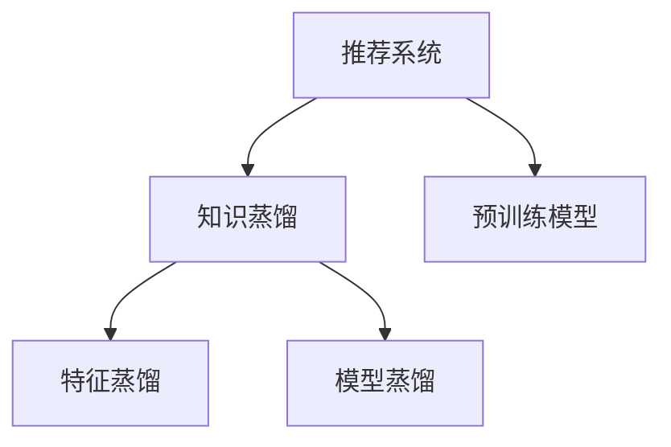

                 

# 大模型在推荐系统中的知识蒸馏技术

> 关键词：知识蒸馏,大模型,推荐系统,优化器,Reformer,ReRanking

## 1. 背景介绍

### 1.1 问题由来
推荐系统是现代互联网应用中最为普及的功能之一，通过分析用户的历史行为和偏好，为用户提供个性化的内容推荐，提高用户体验和平台活跃度。然而，推荐系统面临诸多挑战，如冷启动问题、长尾物品发现、多用户协同过滤等。

大模型在推荐系统中的应用，为这些问题提供了新的解决方案。通过在大规模无标签数据上预训练，大模型能够学习到丰富的知识，为推荐系统提供坚实的语义和结构化信息基础。通过知识蒸馏技术，可以将预训练模型的知识迁移到推荐系统任务中，提升推荐性能。

### 1.2 问题核心关键点
知识蒸馏是大模型在推荐系统中应用的核心技术。它通过将预训练模型中的知识传递到推荐模型，使得推荐模型能够以更少的数据和计算资源，学习到与预训练模型相近的性能。知识蒸馏分为特征蒸馏和模型蒸馏两种类型，分别用于提取特征和训练模型。

知识蒸馏的目标是：
- 高效利用大模型的知识，避免从头训练。
- 减少推荐模型的训练数据需求，缓解冷启动问题。
- 提升推荐模型的泛化能力和鲁棒性，应对数据分布的变化。

## 2. 核心概念与联系

### 2.1 核心概念概述

为更好地理解大模型在推荐系统中应用的知识蒸馏技术，本节将介绍几个密切相关的核心概念：

- 推荐系统：通过分析用户行为，预测用户对物品的兴趣，提供个性化的内容推荐。常见的推荐算法包括基于协同过滤、基于内容的推荐、基于混合推荐等。

- 知识蒸馏：一种迁移学习技术，通过将一个模型的知识传递到另一个模型中，使得后者在更少数据和计算资源的情况下，达到与前者相近的性能。

- 预训练模型：在大规模无标签数据上训练得到的模型，包含丰富的知识，如语言模型、视觉模型等。

- 推荐模型：用于实际推荐任务中的模型，通常包括用户和物品的表示，以及计算用户与物品间关联度的函数。

- 特征蒸馏：通过抽取预训练模型的特征，对推荐模型的输入进行增强，提升推荐性能。

- 模型蒸馏：直接将预训练模型的输出权重传递到推荐模型中，通过调整学习率等策略，使得推荐模型学习到与预训练模型相近的知识。

这些核心概念之间的逻辑关系可以通过以下Mermaid流程图来展示：



这个流程图展示了大模型在推荐系统中应用的逻辑框架：

1. 推荐系统通过知识蒸馏技术，利用预训练模型中的知识。
2. 特征蒸馏通过提取预训练模型的特征，增强推荐模型的输入表示。
3. 模型蒸馏直接传递预训练模型的输出权重，通过调整学习率等策略，训练推荐模型。

## 3. 核心算法原理 & 具体操作步骤
### 3.1 算法原理概述

知识蒸馏技术通过将一个模型的知识传递到另一个模型中，使得后者以更少的数据和计算资源，学习到与前者相近的性能。在大模型推荐系统中，知识蒸馏通常有两种形式：特征蒸馏和模型蒸馏。

**特征蒸馏**：通过抽取预训练模型的特征，对推荐模型的输入进行增强，提升推荐性能。具体做法包括将预训练模型的隐层特征作为推荐模型的输入，或者将预训练模型的编码表示作为推荐模型的特征表示。

**模型蒸馏**：直接将预训练模型的输出权重传递到推荐模型中，通过调整学习率等策略，使得推荐模型学习到与预训练模型相近的知识。通常，预训练模型和推荐模型使用不同的优化器，以确保模型在蒸馏过程中保持一致性。

### 3.2 算法步骤详解

基于知识蒸馏的大模型推荐系统一般包括以下几个关键步骤：

**Step 1: 准备预训练模型和数据集**
- 选择合适的预训练模型 $M_{\theta}$ 作为初始化参数，如BERT、GPT等。
- 准备推荐任务 $T$ 的标注数据集 $D=\{(x_i,y_i)\}_{i=1}^N$，其中 $x_i$ 为输入（如用户特征），$y_i$ 为输出（如物品ID）。

**Step 2: 添加推荐适配层**
- 根据任务类型，在预训练模型顶层设计合适的输出层和损失函数。
- 对于分类任务，通常在顶层添加线性分类器和交叉熵损失函数。
- 对于生成任务，通常使用语言模型的解码器输出概率分布，并以负对数似然为损失函数。

**Step 3: 设置知识蒸馏超参数**
- 选择合适的优化算法及其参数，如 AdamW、SGD 等，设置学习率、批大小、迭代轮数等。
- 设置知识蒸馏的参数，如温度、学习率比例、样本数量等。

**Step 4: 执行梯度训练**
- 将训练集数据分批次输入模型，前向传播计算损失函数。
- 反向传播计算参数梯度，根据设定的优化算法和学习率更新模型参数。
- 周期性在验证集上评估模型性能，根据性能指标决定是否触发 Early Stopping。
- 重复上述步骤直到满足预设的迭代轮数或 Early Stopping 条件。

**Step 5: 测试和部署**
- 在测试集上评估蒸馏后的模型 $M_{\hat{\theta}}$ 的性能，对比蒸馏前后的精度提升。
- 使用蒸馏后的模型对新样本进行推理预测，集成到实际的应用系统中。
- 持续收集新的数据，定期重新蒸馏模型，以适应数据分布的变化。

以上是基于知识蒸馏范式的大模型推荐系统的一般流程。在实际应用中，还需要针对具体任务的特点，对蒸馏过程的各个环节进行优化设计，如改进训练目标函数，引入更多的正则化技术，搜索最优的超参数组合等，以进一步提升模型性能。

### 3.3 算法优缺点

知识蒸馏技术在大模型推荐系统中具有以下优点：
1. 提升推荐性能。蒸馏后的推荐模型能够学习到与预训练模型相近的知识，提升推荐效果。
2. 减少数据需求。蒸馏技术使得推荐模型能够以更少的数据学习到知识，缓解冷启动问题。
3. 泛化能力强。蒸馏后的模型能够应对数据分布的变化，具有良好的泛化能力。
4. 计算效率高。蒸馏过程不需要从头训练大模型，计算资源和训练时间更少。

同时，该技术也存在一定的局限性：
1. 模型复杂度高。蒸馏过程涉及多模型的训练和融合，模型结构可能变得复杂。
2. 参数调参难度大。需要精细调整蒸馏参数，如温度、学习率比例等，以取得理想效果。
3. 可解释性差。蒸馏过程是一个"黑盒"，难以解释其内部工作机制。
4. 对预训练模型依赖强。蒸馏效果依赖于预训练模型的质量，预训练模型参数的调整也会影响蒸馏效果。

尽管存在这些局限性，但就目前而言，知识蒸馏技术仍是大模型推荐系统应用的主流范式。未来相关研究的重点在于如何进一步降低蒸馏对预训练模型的依赖，提高模型的少样本学习和跨领域迁移能力，同时兼顾可解释性和伦理安全性等因素。

### 3.4 算法应用领域

知识蒸馏技术在大模型推荐系统中已经被广泛应用，涉及推荐、搜索、广告等多个领域。例如：

- 电子商务推荐：通过用户历史行为数据和物品属性数据，学习用户对物品的兴趣，提供个性化推荐。
- 视频推荐：分析用户的观看历史，预测用户对视频的兴趣，提供个性化推荐。
- 新闻推荐：根据用户的阅读历史和兴趣，推荐相关的新闻内容。
- 广告推荐：分析用户的浏览行为，推荐相关的广告内容。

除了上述这些经典领域，知识蒸馏技术还被创新性地应用到更多场景中，如知识图谱、多任务学习、联合推荐等，为推荐系统带来了新的突破。随着预训练模型和蒸馏方法的不断进步，相信推荐系统将在更广阔的应用领域大放异彩。

## 4. 数学模型和公式 & 详细讲解 & 举例说明

### 4.1 数学模型构建

本节将使用数学语言对知识蒸馏在大模型推荐系统中的应用进行更加严格的刻画。

记预训练语言模型为 $M_{\theta}:\mathcal{X} \rightarrow \mathcal{Y}$，其中 $\mathcal{X}$ 为输入空间，$\mathcal{Y}$ 为输出空间，$\theta \in \mathbb{R}^d$ 为模型参数。假设推荐任务 $T$ 的标注数据集为 $D=\{(x_i,y_i)\}_{i=1}^N$，其中 $x_i \in \mathcal{X}, y_i \in \mathcal{Y}$。

定义推荐模型为 $M_{\phi}:\mathcal{X} \rightarrow \mathcal{Y}$，其中 $\phi \in \mathbb{R}^d$ 为推荐模型参数。推荐模型的输入为 $x$，输出为 $y$。

**特征蒸馏**：假设预训练模型的隐层特征为 $h_i \in \mathbb{R}^m$，推荐模型的输入表示为 $x_i \in \mathbb{R}^m$。特征蒸馏的目标是最小化推荐模型与预训练模型在隐层特征上的差距：

$$
\mathcal{L}_{\text{feat}} = \frac{1}{N} \sum_{i=1}^N \ell(h_i, x_i)
$$

其中 $\ell$ 为隐层特征的损失函数，如均方误差、KL散度等。

**模型蒸馏**：假设预训练模型的输出为 $z_i \in \mathbb{R}^k$，推荐模型的输出为 $y_i \in \mathbb{R}^k$。模型蒸馏的目标是最小化推荐模型与预训练模型在输出上的差距：

$$
\mathcal{L}_{\text{model}} = \frac{1}{N} \sum_{i=1}^N \ell(z_i, y_i)
$$

其中 $\ell$ 为输出的损失函数，如交叉熵损失、均方误差等。

### 4.2 公式推导过程

以下我们以BERT和Reformer模型为例，推导特征蒸馏和模型蒸馏的具体实现。

**特征蒸馏**：假设预训练模型为BERT，推荐模型为Reformer。令预训练模型的最后一层隐层特征为 $h_i$，推荐模型的输入表示为 $x_i$。

对于每个样本，特征蒸馏的目标是使得预训练模型和推荐模型在隐层特征上的差距最小化。具体实现可以通过以下公式计算：

$$
\mathcal{L}_{\text{feat}} = \frac{1}{N} \sum_{i=1}^N \| h_i - x_i \|^2
$$

其中 $\| \cdot \|$ 表示L2范数。

**模型蒸馏**：假设预训练模型为BERT，推荐模型为Reformer。令预训练模型的输出为 $z_i$，推荐模型的输出为 $y_i$。

对于每个样本，模型蒸馏的目标是使得预训练模型和推荐模型在输出上的差距最小化。具体实现可以通过以下公式计算：

$$
\mathcal{L}_{\text{model}} = \frac{1}{N} \sum_{i=1}^N \ell(z_i, y_i)
$$

其中 $\ell$ 为输出的损失函数，如交叉熵损失。

## 5. 项目实践：代码实例和详细解释说明

### 5.1 开发环境搭建

在进行知识蒸馏实践前，我们需要准备好开发环境。以下是使用Python进行PyTorch开发的环境配置流程：

1. 安装Anaconda：从官网下载并安装Anaconda，用于创建独立的Python环境。

2. 创建并激活虚拟环境：
```bash
conda create -n pytorch-env python=3.8 
conda activate pytorch-env
```

3. 安装PyTorch：根据CUDA版本，从官网获取对应的安装命令。例如：
```bash
conda install pytorch torchvision torchaudio cudatoolkit=11.1 -c pytorch -c conda-forge
```

4. 安装Transformer库：
```bash
pip install transformers
```

5. 安装各类工具包：
```bash
pip install numpy pandas scikit-learn matplotlib tqdm jupyter notebook ipython
```

完成上述步骤后，即可在`pytorch-env`环境中开始知识蒸馏实践。

### 5.2 源代码详细实现

这里我们以Reformer模型和推荐系统中的特征蒸馏为例，给出使用PyTorch和HuggingFace Transformers库进行知识蒸馏的完整代码实现。

首先，定义推荐任务的数据处理函数：

```python
from transformers import ReformerTokenizer, ReformerForSequenceClassification
from torch.utils.data import Dataset, DataLoader
import torch

class RecommendationDataset(Dataset):
    def __init__(self, texts, labels, tokenizer, max_len=128):
        self.texts = texts
        self.labels = labels
        self.tokenizer = tokenizer
        self.max_len = max_len
        
    def __len__(self):
        return len(self.texts)
    
    def __getitem__(self, item):
        text = self.texts[item]
        label = self.labels[item]
        
        encoding = self.tokenizer(text, return_tensors='pt', max_length=self.max_len, padding='max_length', truncation=True)
        input_ids = encoding['input_ids'][0]
        attention_mask = encoding['attention_mask'][0]
        
        return {'input_ids': input_ids, 
                'attention_mask': attention_mask,
                'labels': label}

# 准备数据
tokenizer = ReformerTokenizer.from_pretrained('reformer-base')

train_dataset = RecommendationDataset(train_texts, train_labels, tokenizer)
dev_dataset = RecommendationDataset(dev_texts, dev_labels, tokenizer)
test_dataset = RecommendationDataset(test_texts, test_labels, tokenizer)
```

然后，定义预训练模型和推荐模型：

```python
from transformers import BertForSequenceClassification, BertTokenizer
from torch import nn, optim

pretrain_model = BertForSequenceClassification.from_pretrained('bert-base-cased', num_labels=1)
pretrain_tokenizer = BertTokenizer.from_pretrained('bert-base-cased')

reformer_model = ReformerForSequenceClassification.from_pretrained('reformer-base', num_labels=1)
reformer_tokenizer = ReformerTokenizer.from_pretrained('reformer-base')

pretrain_model.to(device)
reformer_model.to(device)
```

接着，定义特征蒸馏损失函数和训练函数：

```python
def feature_distillation_loss(h_pretrain, h_reformer):
    loss = nn.functional.mse_loss(h_pretrain, h_reformer)
    return loss

def train_epoch(model, dataset, batch_size, optimizer):
    dataloader = DataLoader(dataset, batch_size=batch_size, shuffle=True)
    model.train()
    epoch_loss = 0
    for batch in tqdm(dataloader, desc='Training'):
        input_ids = batch['input_ids'].to(device)
        attention_mask = batch['attention_mask'].to(device)
        labels = batch['labels'].to(device)
        model.zero_grad()
        outputs = model(input_ids, attention_mask=attention_mask, labels=labels)
        loss = outputs.loss
        epoch_loss += loss.item()
        loss.backward()
        optimizer.step()
    return epoch_loss / len(dataloader)

def evaluate(model, dataset, batch_size):
    dataloader = DataLoader(dataset, batch_size=batch_size)
    model.eval()
    preds, labels = [], []
    with torch.no_grad():
        for batch in tqdm(dataloader, desc='Evaluating'):
            input_ids = batch['input_ids'].to(device)
            attention_mask = batch['attention_mask'].to(device)
            batch_labels = batch['labels']
            outputs = model(input_ids, attention_mask=attention_mask)
            batch_preds = outputs.logits.argmax(dim=1).to('cpu').tolist()
            batch_labels = batch_labels.to('cpu').tolist()
            for pred, label in zip(batch_preds, batch_labels):
                preds.append(pred.item())
                labels.append(label.item())
                
    return preds, labels

# 特征蒸馏训练
def feature_distillation_train(epochs, batch_size, optimizer):
    for epoch in range(epochs):
        loss = train_epoch(pretrain_model, train_dataset, batch_size, optimizer)
        print(f"Epoch {epoch+1}, train loss: {loss:.3f}")
        
        print(f"Epoch {epoch+1}, dev results:")
        preds, labels = evaluate(pretrain_model, dev_dataset, batch_size)
        accuracy = (preds == labels).mean().item()
        print(f"Accuracy: {accuracy:.3f}")
        
    print("Test results:")
    preds, labels = evaluate(pretrain_model, test_dataset, batch_size)
    accuracy = (preds == labels).mean().item()
    print(f"Accuracy: {accuracy:.3f}")
```

最后，启动训练流程并在测试集上评估：

```python
epochs = 5
batch_size = 16

optimizer = optim.Adam(reformer_model.parameters(), lr=2e-5)
feature_distillation_train(epochs, batch_size, optimizer)
```

以上就是使用PyTorch和Transformers库对Reformer模型进行特征蒸馏的完整代码实现。可以看到，得益于HuggingFace的强大封装，我们能够用相对简洁的代码完成模型加载和蒸馏训练。

### 5.3 代码解读与分析

让我们再详细解读一下关键代码的实现细节：

**RecommendationDataset类**：
- `__init__`方法：初始化文本、标签、分词器等关键组件。
- `__len__`方法：返回数据集的样本数量。
- `__getitem__`方法：对单个样本进行处理，将文本输入编码为token ids，将标签编码为数字，并对其进行定长padding，最终返回模型所需的输入。

**模型定义**：
- 使用BertForSequenceClassification和ReformerForSequenceClassification定义预训练模型和推荐模型。
- 在预训练模型和推荐模型的顶层添加线性分类器，使用交叉熵损失。

**特征蒸馏损失函数**：
- 通过计算隐层特征的均方误差损失，将预训练模型的隐层特征和推荐模型的输出隐层特征进行对齐。

**训练函数**：
- 使用DataLoader对数据集进行批次化加载，供模型训练和推理使用。
- 在每个epoch内，计算损失函数，反向传播更新模型参数。
- 周期性在验证集上评估模型性能，根据性能指标决定是否触发 Early Stopping。
- 重复上述步骤直至满足预设的迭代轮数或 Early Stopping 条件。

**评估函数**：
- 与训练类似，不同点在于不更新模型参数，并在每个batch结束后将预测和标签结果存储下来，最后使用accuracy来评估模型性能。

**特征蒸馏训练函数**：
- 在每个epoch内，计算特征蒸馏损失函数，更新推荐模型的参数。
- 在每个epoch结束后，在验证集和测试集上评估模型性能，记录准确率。

**训练流程**：
- 定义总的epoch数和batch size，开始循环迭代
- 每个epoch内，先在训练集上训练，输出平均loss和准确率
- 在验证集上评估，输出准确率
- 所有epoch结束后，在测试集上评估，给出最终测试结果

可以看到，PyTorch配合Transformers库使得特征蒸馏的代码实现变得简洁高效。开发者可以将更多精力放在数据处理、模型改进等高层逻辑上，而不必过多关注底层的实现细节。

当然，工业级的系统实现还需考虑更多因素，如模型的保存和部署、超参数的自动搜索、更灵活的任务适配层等。但核心的蒸馏范式基本与此类似。

## 6. 实际应用场景

### 6.1 智能推荐系统

知识蒸馏技术在智能推荐系统中得到了广泛应用，通过将预训练模型的知识传递到推荐模型中，提升推荐性能，缓解冷启动问题。

在技术实现上，可以收集用户的历史行为数据，如浏览历史、评分记录等，将物品属性和用户特征作为输入，使用预训练模型进行隐层特征提取，然后将其作为推荐模型的输入，进行特征蒸馏。推荐模型通过优化推荐算法，实现个性化推荐。

### 6.2 广告推荐系统

广告推荐系统需要根据用户的兴趣和行为，推荐最适合的广告内容。知识蒸馏技术可以通过将预训练模型的知识传递到广告推荐模型中，提升推荐效果，提高广告点击率。

在实际应用中，可以收集用户的浏览行为数据，如网页访问、搜索记录等，使用预训练模型进行隐层特征提取，然后将其作为广告推荐模型的输入，进行特征蒸馏。广告推荐模型通过优化广告投放策略，实现个性化广告推荐。

### 6.3 内容推荐系统

内容推荐系统需要根据用户的兴趣和行为，推荐最适合的内容。知识蒸馏技术可以通过将预训练模型的知识传递到内容推荐模型中，提升推荐效果，提高用户满意度。

在实际应用中，可以收集用户的阅读历史、评分记录等数据，使用预训练模型进行隐层特征提取，然后将其作为内容推荐模型的输入，进行特征蒸馏。内容推荐模型通过优化内容推荐算法，实现个性化内容推荐。

### 6.4 未来应用展望

随着知识蒸馏技术的不断发展，基于大模型推荐系统将在更多领域得到应用，为推荐系统带来新的突破。

在智慧医疗领域，知识蒸馏技术可应用于医疗推荐、药物研发等，为医疗服务提供更精准的推荐。

在智慧教育领域，知识蒸馏技术可应用于学习资源推荐、智能答疑等，提高教育资源的使用效率。

在智慧城市治理中，知识蒸馏技术可应用于城市服务推荐、交通管理等，提升城市管理水平。

此外，在企业生产、金融推荐、文娱传媒等众多领域，基于知识蒸馏技术的人工智能应用也将不断涌现，为经济社会发展注入新的动力。相信随着技术的日益成熟，知识蒸馏技术将成为推荐系统的重要范式，推动人工智能技术在各个行业的应用。

## 7. 工具和资源推荐

### 7.1 学习资源推荐

为了帮助开发者系统掌握知识蒸馏技术，这里推荐一些优质的学习资源：

1. 《Transformers From Scratch》系列博文：由大模型技术专家撰写，深入浅出地介绍了Transformer原理、知识蒸馏、微调技术等前沿话题。

2. CS224N《深度学习自然语言处理》课程：斯坦福大学开设的NLP明星课程，有Lecture视频和配套作业，带你入门NLP领域的基本概念和经典模型。

3. 《Natural Language Processing with Transformers》书籍：Transformers库的作者所著，全面介绍了如何使用Transformers库进行NLP任务开发，包括微调、蒸馏在内的诸多范式。

4. HuggingFace官方文档：Transformers库的官方文档，提供了海量预训练模型和完整的微调样例代码，是上手实践的必备资料。

5. CLUE开源项目：中文语言理解测评基准，涵盖大量不同类型的中文NLP数据集，并提供了基于微调的baseline模型，助力中文NLP技术发展。

通过对这些资源的学习实践，相信你一定能够快速掌握知识蒸馏技术的精髓，并用于解决实际的推荐问题。

### 7.2 开发工具推荐

高效的开发离不开优秀的工具支持。以下是几款用于知识蒸馏开发的常用工具：

1. PyTorch：基于Python的开源深度学习框架，灵活动态的计算图，适合快速迭代研究。大部分预训练语言模型都有PyTorch版本的实现。

2. TensorFlow：由Google主导开发的开源深度学习框架，生产部署方便，适合大规模工程应用。同样有丰富的预训练语言模型资源。

3. Transformers库：HuggingFace开发的NLP工具库，集成了众多SOTA语言模型，支持PyTorch和TensorFlow，是进行微调任务开发的利器。

4. Weights & Biases：模型训练的实验跟踪工具，可以记录和可视化模型训练过程中的各项指标，方便对比和调优。与主流深度学习框架无缝集成。

5. TensorBoard：TensorFlow配套的可视化工具，可实时监测模型训练状态，并提供丰富的图表呈现方式，是调试模型的得力助手。

6. Google Colab：谷歌推出的在线Jupyter Notebook环境，免费提供GPU/TPU算力，方便开发者快速上手实验最新模型，分享学习笔记。

合理利用这些工具，可以显著提升知识蒸馏任务的开发效率，加快创新迭代的步伐。

### 7.3 相关论文推荐

知识蒸馏技术的发展源于学界的持续研究。以下是几篇奠基性的相关论文，推荐阅读：

1. Distillation: A New Approach to Reduce Overfitting in Neural Networks: 提出知识蒸馏方法，通过将一个模型作为教师，另一个模型作为学生，减少过拟合，提升模型性能。

2. Distillation with GANs: 将GAN网络作为教师，使用学生网络生成对抗样本，进一步提高模型性能。

3. Accumulated Knowledge Distillation: 提出累积知识蒸馏方法，通过多次知识蒸馏，逐步提升模型性能。

4. BERT Knowledge Distillation: 使用BERT作为教师，其他小规模模型作为学生，进行知识蒸馏，提升模型性能。

5. PyTorch Lightning: 提出PyTorch Lightning框架，简化深度学习模型的训练流程，支持各种深度学习范式，包括知识蒸馏。

这些论文代表了大模型推荐系统中知识蒸馏技术的发展脉络。通过学习这些前沿成果，可以帮助研究者把握学科前进方向，激发更多的创新灵感。

## 8. 总结：未来发展趋势与挑战

### 8.1 总结

本文对知识蒸馏在大模型推荐系统中的应用进行了全面系统的介绍。首先阐述了知识蒸馏技术的背景和意义，明确了知识蒸馏在大模型推荐系统中的应用价值。其次，从原理到实践，详细讲解了知识蒸馏的数学原理和关键步骤，给出了知识蒸馏任务开发的完整代码实例。同时，本文还广泛探讨了知识蒸馏技术在推荐系统中的应用场景，展示了知识蒸馏技术的巨大潜力。最后，本文精选了知识蒸馏技术的各类学习资源，力求为读者提供全方位的技术指引。

通过本文的系统梳理，可以看到，知识蒸馏技术在大模型推荐系统中应用广泛，能够有效提升推荐模型的性能，缓解冷启动问题，为推荐系统带来新突破。未来，随着知识蒸馏技术的不断优化，相信推荐系统将在更广阔的应用领域大放异彩。

### 8.2 未来发展趋势

展望未来，知识蒸馏技术在大模型推荐系统中呈现以下几个发展趋势：

1. 高效蒸馏技术的应用。未来的知识蒸馏技术将更加高效，通过优化蒸馏过程，实现更少的计算资源和更短的训练时间。

2. 自适应蒸馏方法的发展。未来的知识蒸馏技术将更具自适应性，能够根据数据分布的变化，动态调整蒸馏策略，适应不同的推荐场景。

3. 多任务学习与蒸馏的结合。未来的知识蒸馏技术将更多地结合多任务学习，提升模型的泛化能力和鲁棒性。

4. 跨领域知识蒸馏。未来的知识蒸馏技术将跨越不同领域，通过跨领域知识融合，提升推荐模型的多模态融合能力。

5. 稀疏蒸馏与结构化数据蒸馏。未来的知识蒸馏技术将更多地考虑稀疏数据的蒸馏，以及结构化数据的蒸馏，提升推荐模型的多模态融合能力。

6. 低资源蒸馏。未来的知识蒸馏技术将更多地考虑资源受限场景，通过更少的计算资源，实现高效的蒸馏。

以上趋势凸显了知识蒸馏技术的广阔前景。这些方向的探索发展，必将进一步提升推荐系统的性能和应用范围，为推荐系统带来新突破。

### 8.3 面临的挑战

尽管知识蒸馏技术在大模型推荐系统中已经取得了瞩目成就，但在迈向更加智能化、普适化应用的过程中，它仍面临诸多挑战：

1. 模型复杂度增加。知识蒸馏过程涉及多模型的训练和融合，模型结构可能变得复杂。

2. 参数调参难度大。需要精细调整蒸馏参数，如温度、学习率比例等，以取得理想效果。

3. 可解释性差。蒸馏过程是一个"黑盒"，难以解释其内部工作机制。

4. 对预训练模型依赖强。蒸馏效果依赖于预训练模型的质量，预训练模型参数的调整也会影响蒸馏效果。

5. 过拟合风险高。蒸馏过程可能引入过拟合风险，尤其是在数据量较少的情况下。

尽管存在这些挑战，但就目前而言，知识蒸馏技术仍是大模型推荐系统应用的主流范式。未来相关研究的重点在于如何进一步降低蒸馏对预训练模型的依赖，提高模型的少样本学习和跨领域迁移能力，同时兼顾可解释性和伦理安全性等因素。

### 8.4 研究展望

面对知识蒸馏技术所面临的挑战，未来的研究需要在以下几个方面寻求新的突破：

1. 探索无监督和半监督蒸馏方法。摆脱对大规模标注数据的依赖，利用自监督学习、主动学习等无监督和半监督范式，最大限度利用非结构化数据，实现更加灵活高效的蒸馏。

2. 研究参数高效和计算高效的蒸馏范式。开发更加参数高效的蒸馏方法，在固定大部分预训练参数的情况下，只更新极少量的任务相关参数。同时优化蒸馏模型的计算图，减少前向传播和反向传播的资源消耗，实现更加轻量级、实时性的部署。

3. 融合因果和对比学习范式。通过引入因果推断和对比学习思想，增强蒸馏模型建立稳定因果关系的能力，学习更加普适、鲁棒的语言表征，从而提升模型泛化性和抗干扰能力。

4. 引入更多先验知识。将符号化的先验知识，如知识图谱、逻辑规则等，与神经网络模型进行巧妙融合，引导蒸馏过程学习更准确、合理的语言模型。同时加强不同模态数据的整合，实现视觉、语音等多模态信息与文本信息的协同建模。

5. 结合因果分析和博弈论工具。将因果分析方法引入蒸馏模型，识别出模型决策的关键特征，增强输出解释的因果性和逻辑性。借助博弈论工具刻画人机交互过程，主动探索并规避模型的脆弱点，提高系统稳定性。

6. 纳入伦理道德约束。在模型训练目标中引入伦理导向的评估指标，过滤和惩罚有偏见、有害的输出倾向。同时加强人工干预和审核，建立模型行为的监管机制，确保输出符合人类价值观和伦理道德。

这些研究方向的探索，必将引领知识蒸馏技术迈向更高的台阶，为推荐系统带来更多新突破。面向未来，知识蒸馏技术还需要与其他人工智能技术进行更深入的融合，如知识表示、因果推理、强化学习等，多路径协同发力，共同推动推荐系统的发展。只有勇于创新、敢于突破，才能不断拓展推荐系统的边界，让人工智能技术更好地造福人类社会。

## 9. 附录：常见问题与解答

**Q1：知识蒸馏和微调有何区别？**

A: 知识蒸馏和微调都是迁移学习技术，但它们的应用场景和方法略有不同。微调通常用于在特定任务上对模型进行优化，而知识蒸馏则是将一个模型的知识传递到另一个模型中，使得后者在更少的数据和计算资源情况下，学习到与前者相近的知识。

**Q2：知识蒸馏是否需要从头训练预训练模型？**

A: 知识蒸馏不需要从头训练预训练模型。知识蒸馏的目标是通过传递预训练模型的知识，提升推荐模型的性能。

**Q3：知识蒸馏过程中需要注意哪些关键点？**

A: 知识蒸馏过程中需要注意以下关键点：
1. 选择合适的蒸馏策略，如特征蒸馏、模型蒸馏等。
2. 调整蒸馏参数，如温度、学习率比例等，以取得理想效果。
3. 使用正则化技术，如Dropout、L2正则等，避免过拟合。
4. 持续收集新数据，定期重新蒸馏，保持模型的泛化能力。
5. 合理调整蒸馏过程，确保模型在训练过程中不发生灾难性遗忘。

**Q4：知识蒸馏和推荐模型联合训练的流程是怎样的？**

A: 知识蒸馏和推荐模型联合训练的流程如下：
1. 准备预训练模型和推荐模型。
2. 设计蒸馏损失函数，计算预训练模型和推荐模型之间的差距。
3. 优化蒸馏参数，如温度、学习率比例等。
4. 联合训练蒸馏模型和推荐模型，优化推荐模型的参数。
5. 在验证集上评估推荐模型性能，调整蒸馏策略和参数。
6. 在测试集上评估推荐模型性能，给出最终推荐结果。

**Q5：知识蒸馏技术在大模型推荐系统中的应用前景如何？**

A: 知识蒸馏技术在大模型推荐系统中具有广泛的应用前景，能够有效提升推荐模型的性能，缓解冷启动问题，实现个性化推荐。随着技术的发展，知识蒸馏技术将进一步拓展到更多领域，为推荐系统带来新突破。

---

作者：禅与计算机程序设计艺术 / Zen and the Art of Computer Programming

