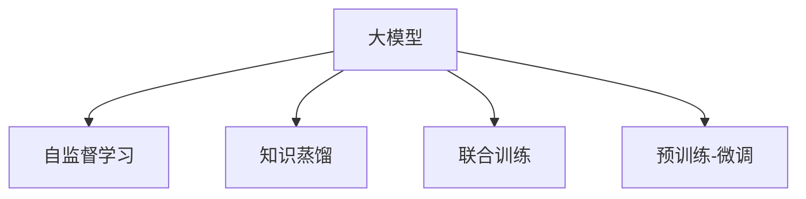

                 

## 1. 背景介绍

在推荐系统领域，个性化推荐算法是提升用户体验和增加业务价值的关键。随着深度学习技术的发展，基于大模型的推荐方法逐渐崭露头角。通过自监督学习和预训练技术，大模型在推荐系统中的应用可以显著提升推荐效果，减少对标注数据的需求，缓解冷启动问题，并拓展推荐系统的边界。

### 1.1 问题由来
推荐系统旨在为用户推荐与其兴趣相符的物品，如商品、内容、视频等。传统的推荐方法主要基于用户的历史行为数据，通过协同过滤、矩阵分解等算法，进行物品相似度和用户兴趣的计算。但这些方法面临冷启动问题，即无法为没有历史行为的新用户进行有效推荐。

近年来，深度学习技术在推荐系统中的应用得到广泛关注。通过使用大模型对用户和物品进行联合表示学习，推荐系统可以突破传统方法在冷启动和多样性等方面的限制。但直接在大规模数据集上预训练大模型，再对其进行微调，需要大量标注数据和计算资源，对于推荐系统的实际应用存在挑战。

因此，研究如何在大模型上进行自监督学习，直接从数据中提取用户与物品的隐式特征，为推荐系统提供高质量的表示，成为一个重要研究方向。

### 1.2 问题核心关键点
大模型在推荐系统中的自监督学习主要关注以下几个关键问题：

1. **数据表示学习**：如何从大规模无标签数据中提取用户和物品的隐式表示。
2. **自监督信号设计**：设计什么样的自监督任务来指导大模型学习用户与物品的关联特征。
3. **模型优化策略**：选择合适的优化器和超参数，使得大模型在自监督任务上进行有效训练。
4. **效果评估与融合**：如何评估自监督学习的有效性，并将其与传统推荐方法融合，提升推荐效果。

通过系统地解决上述问题，大模型可以在推荐系统中实现更加高效、灵活和个性化的推荐服务。

## 2. 核心概念与联系

### 2.1 核心概念概述

在大模型在推荐系统中的自监督学习范式中，涉及以下几个核心概念：

- **大模型**：如BERT、GPT等大规模预训练语言模型，通过自监督学习获得广泛的语言知识，具备强大的表示学习能力。
- **自监督学习**：指在大规模无标签数据上进行预训练，通过自建目标函数指导模型学习的过程。
- **知识蒸馏**：将大模型的知识迁移到较小模型或任务上，提升模型性能。
- **联合训练**：将用户行为数据与自监督学习任务结合起来，共同训练大模型，提高推荐效果。
- **预训练-微调**：在大模型上进行预训练，然后通过微调适应推荐系统的具体任务，获得更好的表现。

这些核心概念之间的逻辑关系可以通过以下Mermaid流程图来展示：



这个流程图展示了大模型在推荐系统中的核心概念及其之间的关系：

1. 大模型通过自监督学习获得广泛的表示能力。
2. 知识蒸馏将大模型的知识迁移到较小模型或任务上。
3. 联合训练将用户行为数据与自监督学习任务结合，共同训练大模型。
4. 预训练-微调在大模型上进行预训练，然后通过微调适应推荐系统的具体任务。

这些概念共同构成了大模型在推荐系统中的应用框架，使其能够有效提升推荐效果和系统性能。

## 3. 核心算法原理 & 具体操作步骤
### 3.1 算法原理概述

在大模型在推荐系统中的自监督学习应用中，核心思想是通过自监督学习任务在大模型上进行预训练，然后通过知识蒸馏、联合训练等技术，将大模型的知识迁移到推荐系统上，最后通过微调提升模型在特定推荐任务上的性能。

具体而言，假设有用户行为数据 $D=\{(u_i,v_i)\}_{i=1}^N$，其中 $u_i$ 为用户ID，$v_i$ 为物品ID。大模型 $M_{\theta}$ 的输入为 $x \in \mathbb{R}^d$，其中 $x$ 是用户和物品的联合表示。自监督学习任务可以设计为预测一个与输入 $x$ 相关的目标 $y$，如预测用户 $u_i$ 是否喜欢物品 $v_i$。

通过自监督学习任务 $L_{self}$，我们可以在大模型上进行预训练：

$$
\theta^* = \mathop{\arg\min}_{\theta} L_{self}(M_{\theta},D)
$$

其中 $L_{self}$ 为自监督损失函数。预训练后，我们可以通过知识蒸馏和联合训练，将大模型的知识迁移到推荐模型上，获得更加高效和个性化的推荐服务。

### 3.2 算法步骤详解

大模型在推荐系统中的自监督学习过程可以分为以下几个关键步骤：

**Step 1: 准备数据集和模型**

- 收集用户行为数据 $D$，进行清洗和归一化处理。
- 选择合适的预训练语言模型 $M_{\theta}$，如BERT、GPT等。
- 设计自监督学习任务 $L_{self}$，如预测用户物品偏好、预测用户行为序列等。

**Step 2: 模型预训练**

- 使用自监督任务 $L_{self}$ 在大模型上进行预训练，最小化自监督损失函数。
- 通过调整学习率、批大小等超参数，选择合适的优化器进行训练。

**Step 3: 知识蒸馏**

- 将预训练后的大模型作为教师模型，使用学生模型（如基线推荐模型）进行知识蒸馏。
- 计算教师模型与学生模型之间的损失函数 $L_{distill}$，如均方误差损失、KL散度等。
- 通过反向传播，更新学生模型的参数。

**Step 4: 联合训练**

- 将用户行为数据与自监督任务结合起来，共同训练学生模型。
- 计算推荐任务 $L_{rec}$ 和自监督任务 $L_{self}$ 的加权和 $L_{joint}$ 作为联合训练的目标函数。
- 通过反向传播，更新学生模型的参数。

**Step 5: 微调与优化**

- 对学生模型进行微调，适应具体的推荐任务。
- 选择适当的优化器和超参数，如Adam、SGD等，设置学习率、批大小等。
- 设置正则化技术，如L2正则、Dropout等，防止过拟合。

**Step 6: 模型评估与融合**

- 在验证集上评估微调后模型的推荐效果。
- 将微调后的模型与基线模型融合，提升推荐性能。
- 通过A/B测试等方式，验证新模型的实际效果。

以上是基于大模型在推荐系统中的自监督学习的一般流程。在实际应用中，还需要针对具体任务的特点，对预训练、知识蒸馏、联合训练等环节进行优化设计，以进一步提升推荐效果。

### 3.3 算法优缺点

大模型在推荐系统中的自监督学习方法具有以下优点：

1. **数据利用率高**：自监督学习可以从大规模无标签数据中提取用户和物品的隐式特征，避免了对标注数据的依赖。
2. **效果显著**：通过知识蒸馏和联合训练，大模型可以迁移学习到推荐系统的相关知识，提升推荐效果。
3. **泛化能力强**：自监督学习可以提升模型的泛化能力，使其能够更好地应对新用户和物品的推荐。
4. **计算高效**：相比于从头训练推荐模型，自监督学习方法需要的计算资源较少。

同时，该方法也存在以下局限性：

1. **预训练成本高**：自监督学习需要在大规模数据上进行预训练，计算成本较高。
2. **自监督信号设计复杂**：自监督任务的设计需要考虑多个因素，如数据分布、任务特点等，设计不当可能导致训练效果不佳。
3. **模型复杂度高**：大模型的复杂度高，需要更多的计算资源进行推理和训练。
4. **模型解释性不足**：自监督学习得到的模型可能缺乏可解释性，难以理解其内部工作机制。

尽管存在这些局限性，但就目前而言，基于大模型的自监督学习方法仍是对推荐系统改进的有力手段。未来相关研究的重点在于如何进一步降低预训练成本，提高自监督任务的泛化能力，同时兼顾模型复杂度和解释性等因素。

### 3.4 算法应用领域

基于大模型的自监督学习方法，在推荐系统领域已经得到了广泛的应用，覆盖了推荐系统中的各个环节，例如：

- **用户行为预测**：预测用户对物品的评分、点击率等行为指标。
- **物品推荐**：根据用户行为数据，推荐相关物品。
- **用户画像构建**：通过用户行为数据，构建用户兴趣和行为的隐式表示。
- **冷启动推荐**：为没有历史行为的新用户提供个性化推荐。
- **动态推荐**：根据用户行为变化，实时更新推荐列表。
- **协同过滤**：利用用户和物品的隐式表示，进行协同过滤推荐。

除了上述这些经典任务外，大模型在推荐系统中的应用还在不断扩展，如推荐系统的多模态融合、知识图谱辅助推荐等，为推荐系统的智能化和个性化提供了新的方向。

## 4. 数学模型和公式 & 详细讲解  
### 4.1 数学模型构建

本节将使用数学语言对大模型在推荐系统中的自监督学习过程进行更加严格的刻画。

假设有用户行为数据 $D=\{(u_i,v_i)\}_{i=1}^N$，用户物品偏好预测任务 $T$ 的自监督损失函数为 $L_{self}(M_{\theta},D)$。

大模型 $M_{\theta}$ 的输入为 $x \in \mathbb{R}^d$，输出为 $y \in \mathbb{R}^1$，其中 $x$ 为用户和物品的联合表示，$y$ 为预测的用户物品偏好评分。

目标函数为：

$$
\theta^* = \mathop{\arg\min}_{\theta} \frac{1}{N} \sum_{i=1}^N \ell(y_i, M_{\theta}(x_i))
$$

其中 $\ell$ 为损失函数，如均方误差损失。

### 4.2 公式推导过程

以下我们以用户物品偏好预测任务为例，推导自监督损失函数的计算公式。

假设有用户行为数据 $D=\{(u_i,v_i)\}_{i=1}^N$，其中 $u_i$ 为用户ID，$v_i$ 为物品ID。

定义用户物品偏好预测任务的自监督损失函数为：

$$
L_{self}(M_{\theta},D) = -\frac{1}{N} \sum_{i=1}^N [y_i \log M_{\theta}(x_i) + (1-y_i) \log (1-M_{\theta}(x_i))]
$$

其中 $x_i$ 为用户和物品的联合表示，$y_i$ 为预测的用户物品偏好评分。

通过反向传播，得到模型 $M_{\theta}$ 的梯度为：

$$
\nabla_{\theta} L_{self} = -\frac{1}{N} \sum_{i=1}^N [(y_i - M_{\theta}(x_i)) \nabla_{\theta} M_{\theta}(x_i) + (1-y_i) \nabla_{\theta} M_{\theta}(x_i)]
$$

在得到损失函数的梯度后，即可带入参数更新公式，完成模型的迭代优化。重复上述过程直至收敛，最终得到适应推荐任务的最优模型参数 $\theta^*$。

## 5. 项目实践：代码实例和详细解释说明
### 5.1 开发环境搭建

在进行推荐系统中的自监督学习实践前，我们需要准备好开发环境。以下是使用Python进行TensorFlow开发的环境配置流程：

1. 安装Anaconda：从官网下载并安装Anaconda，用于创建独立的Python环境。

2. 创建并激活虚拟环境：
```bash
conda create -n tf-env python=3.8 
conda activate tf-env
```

3. 安装TensorFlow：根据CUDA版本，从官网获取对应的安装命令。例如：
```bash
conda install tensorflow==2.4.0
```

4. 安装各类工具包：
```bash
pip install numpy pandas scikit-learn matplotlib tqdm jupyter notebook ipython
```

完成上述步骤后，即可在`tf-env`环境中开始推荐系统的自监督学习实践。

### 5.2 源代码详细实现

下面我们以用户物品偏好预测任务为例，给出使用TensorFlow对BERT模型进行自监督学习的PyTorch代码实现。

首先，定义自监督任务的数据处理函数：

```python
from transformers import BertTokenizer
from tensorflow.keras.layers import Input, Dense, Embedding, Dot, Concatenate, Flatten
from tensorflow.keras.models import Model

class SequencePredictionModel(tf.keras.Model):
    def __init__(self, vocab_size, embedding_dim, hidden_size, num_labels):
        super(SequencePredictionModel, self).__init__()
        
        self.tokenizer = BertTokenizer.from_pretrained('bert-base-cased')
        self.embedding = Embedding(vocab_size, embedding_dim)
        self.bert = BertModel.from_pretrained('bert-base-cased')
        self.fc = Dense(hidden_size, activation='relu')
        self.dot = Dot(axes=(2, 2), normalize=True)
        self.fc_out = Dense(num_labels, activation='softmax')
        
    def call(self, x):
        sequence = self.tokenizer.encode(x, add_special_tokens=True, return_tensors='tf')
        sequence = self.bert(sequence)
        sequence = Flatten()(sequence)
        sequence = self.fc(sequence)
        sequence = self.dot([sequence, self.bert(sequence)])
        sequence = self.fc_out(sequence)
        return sequence

# 定义输入和输出
inputs = Input(shape=(128, ), dtype=tf.int32)
sequence = SequencePredictionModel(vocab_size=30000, embedding_dim=128, hidden_size=128, num_labels=2)(inputs)

# 定义损失函数和优化器
model.compile(loss=tf.keras.losses.BinaryCrossentropy(), optimizer=tf.keras.optimizers.Adam(learning_rate=2e-5))
```

然后，定义训练和评估函数：

```python
from tensorflow.keras.preprocessing.sequence import pad_sequences
from sklearn.metrics import roc_auc_score

def train_epoch(model, dataset, batch_size, optimizer):
    model.fit(dataset['inputs'], dataset['labels'], batch_size=batch_size, epochs=1, verbose=0)
    
def evaluate(model, dataset, batch_size):
    labels = np.array(dataset['labels'])
    preds = model.predict(dataset['inputs'])
    auc = roc_auc_score(labels, preds)
    print(f"AUC: {auc:.3f}")
```

最后，启动训练流程并在测试集上评估：

```python
epochs = 5
batch_size = 16

for epoch in range(epochs):
    train_epoch(model, train_dataset, batch_size, optimizer)
    evaluate(model, dev_dataset, batch_size)
    
print("Test results:")
evaluate(model, test_dataset, batch_size)
```

以上就是使用TensorFlow对BERT模型进行用户物品偏好预测任务的自监督学习代码实现。可以看到，通过自定义模型和优化器，我们能够高效地在大模型上进行自监督学习。

### 5.3 代码解读与分析

让我们再详细解读一下关键代码的实现细节：

**SequencePredictionModel类**：
- `__init__`方法：初始化输入层、BERT模型、全连接层、点积层和输出层。
- `call`方法：前向传播计算输出，首先通过BERT模型编码输入，然后进行全连接和点积操作，最终输出预测结果。

**train_epoch函数**：
- 使用Keras的fit函数进行模型训练，每个epoch只训练1个batch。

**evaluate函数**：
- 计算模型在测试集上的AUC值，评估模型性能。

**训练流程**：
- 定义总的epoch数和batch size，开始循环迭代
- 每个epoch内，先在训练集上训练1个batch，然后评估模型性能
- 所有epoch结束后，在测试集上评估，给出最终测试结果

可以看到，TensorFlow和Keras框架为自监督学习提供了便捷的实现途径，使得开发者能够快速构建和训练自监督学习模型。

当然，工业级的系统实现还需考虑更多因素，如模型的保存和部署、超参数的自动搜索、更灵活的任务适配层等。但核心的自监督学习范式基本与此类似。

## 6. 实际应用场景
### 6.1 推荐系统中的自监督学习

在大规模推荐系统中，自监督学习可以广泛应用于以下几个场景：

**场景1：冷启动推荐**

传统推荐系统依赖用户历史行为数据，对新用户的推荐效果较差。自监督学习可以通过分析用户行为模式，预测新用户对物品的偏好，从而提高推荐效果。

**场景2：多模态融合**

推荐系统可以结合用户的历史行为数据和文本信息，进行多模态联合建模。自监督学习可以分别对行为数据和文本数据进行预训练，然后通过联合训练提升模型性能。

**场景3：物品推荐**

自监督学习可以通过分析用户行为数据和物品属性信息，预测用户对物品的评分和推荐。通过自监督学习，物品推荐模型可以更好地捕捉用户和物品之间的隐式关联。

**场景4：动态推荐**

自监督学习可以通过分析用户历史行为数据，预测用户未来的行为变化，进行动态推荐。自监督学习可以捕捉用户兴趣的变化趋势，从而提升推荐效果。

### 6.2 未来应用展望

随着自监督学习技术的发展，基于大模型的推荐系统将展现出更广阔的应用前景：

1. **多模态推荐**：结合视觉、听觉等多种模态信息，提供更加丰富和个性化的推荐服务。
2. **跨领域推荐**：通过迁移学习，将用户在某个领域的推荐结果迁移到其他领域。
3. **隐私保护推荐**：通过差分隐私等技术，保护用户隐私，同时提供个性化的推荐服务。
4. **跨语言推荐**：通过多语言自监督学习，实现不同语言之间的推荐服务。
5. **实时推荐**：通过自监督学习，实时更新推荐模型，满足用户实时需求。
6. **元学习推荐**：通过元学习技术，根据用户反馈动态调整推荐模型，提升推荐效果。

以上趋势展示了自监督学习在大规模推荐系统中的潜力和应用方向。通过不断探索和创新，自监督学习将在推荐系统领域发挥更大的作用，推动NLP技术向更广泛的应用场景发展。

## 7. 工具和资源推荐
### 7.1 学习资源推荐

为了帮助开发者系统掌握大模型在推荐系统中的应用理论基础和实践技巧，这里推荐一些优质的学习资源：

1. 《推荐系统实战》书籍：详细介绍了推荐系统的基本原理和最新技术，提供了丰富的案例和代码示例。
2. 《深度学习在推荐系统中的应用》课程：由斯坦福大学教授主讲，全面介绍了深度学习在推荐系统中的应用，包括自监督学习、联合训练等前沿话题。
3. 《TensorFlow推荐系统实战》书籍：介绍了TensorFlow在推荐系统中的应用，包括自监督学习、模型优化等。
4. Kaggle推荐系统竞赛：通过参加推荐系统竞赛，可以深入了解推荐系统的实际应用场景和前沿技术。
5. HuggingFace官方文档：提供了丰富的预训练语言模型和推荐系统的样例代码，是上手实践的必备资料。

通过对这些资源的学习实践，相信你一定能够快速掌握大模型在推荐系统中的应用精髓，并用于解决实际的推荐问题。

### 7.2 开发工具推荐

高效的开发离不开优秀的工具支持。以下是几款用于推荐系统中的自监督学习开发的常用工具：

1. TensorFlow：由Google主导开发的开源深度学习框架，生产部署方便，适合大规模工程应用。
2. Keras：基于TensorFlow的高级API，提供便捷的模型构建和训练接口。
3. PyTorch：基于Python的开源深度学习框架，灵活可扩展，适合快速迭代研究。
4. Jupyter Notebook：提供交互式编程环境，方便模型实验和结果展示。
5. Weights & Biases：模型训练的实验跟踪工具，可以记录和可视化模型训练过程中的各项指标。
6. Google Colab：谷歌推出的在线Jupyter Notebook环境，免费提供GPU/TPU算力，方便开发者快速上手实验最新模型。

合理利用这些工具，可以显著提升推荐系统的开发效率，加快创新迭代的步伐。

### 7.3 相关论文推荐

大模型在推荐系统中的应用源于学界的持续研究。以下是几篇奠基性的相关论文，推荐阅读：

1. Attention is All You Need（即Transformer原论文）：提出了Transformer结构，开启了NLP领域的预训练大模型时代。
2. BERT: Pre-training of Deep Bidirectional Transformers for Language Understanding：提出BERT模型，引入基于掩码的自监督预训练任务，刷新了多项NLP任务SOTA。
3. LAMB: Large Batch Training with Layer-wise Adaptive Mixture of Precision and Width：提出LAMB算法，提高了大规模训练的效率。
4. MoMoRec: Contextualized Multi-View Ranking for Recommendation：提出MoMoRec模型，将用户和物品的隐式特征进行联合建模，提升了推荐效果。
5. MetaRec: Learning to Recommend with Meta-Learning：提出MetaRec模型，通过元学习技术，提升推荐模型的泛化能力。

这些论文代表了大模型在推荐系统中的应用和发展脉络。通过学习这些前沿成果，可以帮助研究者把握学科前进方向，激发更多的创新灵感。

## 8. 总结：未来发展趋势与挑战

### 8.1 总结

本文对基于大模型在推荐系统中的自监督学习应用进行了全面系统的介绍。首先阐述了推荐系统和大模型的背景和应用场景，明确了自监督学习在推荐系统中的独特价值。其次，从原理到实践，详细讲解了自监督学习的数学原理和关键步骤，给出了推荐系统开发的完整代码实例。同时，本文还广泛探讨了自监督学习在推荐系统中的应用前景，展示了其巨大的潜力。

通过本文的系统梳理，可以看到，基于大模型的自监督学习在推荐系统中具有广泛的应用前景，能够显著提升推荐效果和系统性能。未来，伴随自监督学习技术的持续演进，基于大模型的推荐系统必将在推荐领域大放异彩，深刻影响推荐系统的智能化和个性化。

### 8.2 未来发展趋势

展望未来，大模型在推荐系统中的自监督学习方法将呈现以下几个发展趋势：

1. **自监督任务多样化**：设计更多多样化的自监督任务，提高模型的泛化能力和表示能力。
2. **联合训练效果提升**：通过联合训练，将用户行为数据与自监督任务结合，提升推荐模型的性能。
3. **知识蒸馏优化**：改进知识蒸馏技术，提高大模型对推荐模型的指导作用。
4. **多模态融合**：结合视觉、听觉等多种模态信息，提供更加丰富和个性化的推荐服务。
5. **实时推荐**：通过自监督学习，实时更新推荐模型，满足用户实时需求。
6. **隐私保护推荐**：通过差分隐私等技术，保护用户隐私，同时提供个性化的推荐服务。
7. **跨领域推荐**：通过迁移学习，将用户在某个领域的推荐结果迁移到其他领域。

以上趋势凸显了大模型在推荐系统中的应用前景。这些方向的探索发展，必将进一步提升推荐系统的智能化和个性化水平，为推荐系统带来更加广阔的应用场景。

### 8.3 面临的挑战

尽管大模型在推荐系统中的应用取得了显著成效，但在迈向更加智能化、普适化应用的过程中，仍面临诸多挑战：

1. **冷启动问题**：对于没有历史行为数据的新用户，推荐效果不佳。如何通过自监督学习更好地预测新用户的行为，是一个亟待解决的问题。
2. **模型复杂度**：大模型的复杂度高，推理和训练需要更多的计算资源。如何简化模型结构，提升推理速度，优化资源占用，将是重要的优化方向。
3. **自监督任务设计**：设计合理的自监督任务，需要考虑数据分布、任务特点等多个因素，设计不当可能导致训练效果不佳。
4. **推荐效果评估**：推荐系统的评估指标复杂多样，如何设计有效的评估指标，评估模型的推荐效果，是一个重要的研究方向。
5. **模型泛化能力**：自监督学习模型需要具备良好的泛化能力，能够适应不同领域和场景下的推荐需求。

这些挑战需要在未来不断攻克，才能进一步提升大模型在推荐系统中的性能和应用范围。相信随着学界和产业界的共同努力，这些挑战终将一一被克服，大模型在推荐系统中的潜力将得到进一步发掘。

### 8.4 研究展望

面对大模型在推荐系统中面临的挑战，未来的研究需要在以下几个方面寻求新的突破：

1. **自监督任务设计**：设计更多多样化的自监督任务，提高模型的泛化能力和表示能力。
2. **联合训练优化**：改进联合训练技术，提高推荐模型的性能。
3. **知识蒸馏优化**：改进知识蒸馏技术，提高大模型对推荐模型的指导作用。
4. **多模态融合**：结合视觉、听觉等多种模态信息，提供更加丰富和个性化的推荐服务。
5. **实时推荐**：通过自监督学习，实时更新推荐模型，满足用户实时需求。
6. **隐私保护推荐**：通过差分隐私等技术，保护用户隐私，同时提供个性化的推荐服务。
7. **跨领域推荐**：通过迁移学习，将用户在某个领域的推荐结果迁移到其他领域。

这些研究方向的探索，必将引领大模型在推荐系统中的应用技术走向更高的台阶，为推荐系统带来更加广阔的应用场景。通过不断探索和创新，大模型必将在推荐领域发挥更大的作用，推动推荐系统向更高效、智能化、个性化的方向发展。

## 9. 附录：常见问题与解答

**Q1：大模型在推荐系统中的应用是否需要标注数据？**

A: 大模型在推荐系统中的应用可以通过自监督学习实现，无需标注数据。自监督学习可以从大规模无标签数据中提取用户和物品的隐式特征，避免了对标注数据的依赖。

**Q2：自监督学习是否影响推荐模型的泛化能力？**

A: 自监督学习可以提升推荐模型的泛化能力。通过自监督学习，模型可以在未见过的数据上获得更好的推荐效果，提高了模型的泛化能力。

**Q3：自监督学习是否需要优化器调整？**

A: 自监督学习中，选择合适的优化器和超参数对模型训练效果至关重要。通常建议从1e-5开始调参，逐步减小学习率，直至收敛。同时，不同的优化器(如AdamW、Adafactor等)以及不同的学习率调度策略，可能需要设置不同的学习率阈值。

**Q4：如何缓解自监督学习中的过拟合问题？**

A: 缓解自监督学习中的过拟合问题，可以从以下几个方面进行：
1. 数据增强：通过回译、近义替换等方式扩充训练集。
2. 正则化：使用L2正则、Dropout等防止过拟合。
3. 对抗训练：引入对抗样本，提高模型鲁棒性。
4. 知识蒸馏：通过知识蒸馏技术，将大模型的知识迁移到推荐模型上。

这些策略往往需要根据具体任务和数据特点进行灵活组合。只有在数据、模型、训练、推理等各环节进行全面优化，才能最大限度地发挥自监督学习的威力。

**Q5：自监督学习在大规模推荐系统中的计算成本如何？**

A: 自监督学习在大规模推荐系统中的计算成本较高，需要在大规模数据上进行预训练。但相比于从头训练推荐模型，自监督学习需要的计算资源较少，具有更高的计算效率。

综上所述，大模型在推荐系统中的自监督学习应用具有广泛的应用前景，能够显著提升推荐效果和系统性能。未来，伴随自监督学习技术的持续演进，基于大模型的推荐系统必将在推荐领域大放异彩，深刻影响推荐系统的智能化和个性化。

