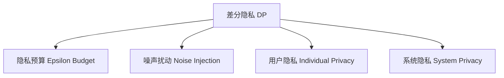

                 

# 大模型在推荐系统中的隐私保护学习方法

> 关键词：大模型推荐系统,隐私保护,深度学习,联邦学习,差分隐私,差分隐私优化,差分隐私在推荐系统中的应用

## 1. 背景介绍

### 1.1 问题由来
随着深度学习和大数据技术的蓬勃发展，推荐系统已深入应用到电商、新闻、社交网络、视频等众多领域，成为提升用户体验和业务价值的关键技术。然而，推荐系统在数据收集和模型训练过程中面临严重的隐私保护问题。用户数据包含敏感的个人行为信息，如何保护用户隐私成为推荐系统可持续发展的关键。

传统的推荐系统通常采用中心化数据存储，通过大数据集中处理和模型集中训练，但这种方式会带来数据泄露和隐私侵犯的风险。近年来，一种新兴的联邦学习(Federated Learning, FL)方法逐步进入人们的视野。联邦学习通过在本地设备上分布式训练模型，避免将原始数据传输到中心服务器，从而保护用户隐私。但联邦学习对本地设备计算能力和通信带宽要求高，模型效果难以达到理想。

大模型（如BERT、GPT等）在推荐系统中也有广泛应用，但其训练需要海量的标注数据和强大的计算资源，同时存在过拟合和隐私泄露的问题。基于隐私保护的深度学习技术正在成为热门研究领域，其中差分隐私(Differential Privacy, DP)方法被认为是一种保护用户隐私的可行解决方案。

### 1.2 问题核心关键点
差分隐私是一种数学框架，旨在保护个体数据隐私，同时保证模型预测性能。在差分隐私保护下，对数据集中的任何记录进行微小扰动，确保统计结果对单个记录的变化不敏感。差分隐私的核心思想是通过添加噪声，掩盖个体数据的真实分布，从而保护用户隐私。

在大规模推荐系统中，差分隐私可以用于保护用户数据隐私，同时保证推荐模型的预测精度。具体实现方式包括：
1. 差分隐私优化：通过优化训练过程，使得模型能够在不泄露个人隐私的前提下，获得良好的推荐性能。
2. 差分隐私嵌入：将差分隐私方法嵌入推荐模型的训练流程中，使推荐过程天然符合隐私保护要求。
3. 差分隐私增强：采用差分隐私增强技术，在推荐模型的各个组件中实施隐私保护措施，提高系统的整体隐私安全性。

## 2. 核心概念与联系

### 2.1 核心概念概述

为更好地理解差分隐私在推荐系统中的保护方法，本节将介绍几个密切相关的核心概念：

- 差分隐私(Differential Privacy, DP)：一种数学框架，用于保护个体数据隐私，同时保证统计结果的鲁棒性。差分隐私要求模型输出的分布对个体记录的变化不敏感，从而保护用户隐私。

- 隐私预算(Epsilon Budget)：差分隐私的核心参数，用于量化隐私保护的强度。隐私预算越小，隐私保护越严格，模型预测性能受影响越大。

- 噪声扰动(Noise Injection)：差分隐私的基本操作，通过添加随机噪声掩盖个体数据，确保隐私安全。

- 用户隐私(Individual Privacy)：指用户数据不被泄露或被恶意利用的保护需求，是差分隐私关注的重点。

- 系统隐私(System Privacy)：指整个推荐系统的隐私安全性，确保推荐过程不泄露用户数据，同时保证模型性能。

这些核心概念之间的逻辑关系可以通过以下Mermaid流程图来展示：



这个流程图展示了大模型推荐系统中差分隐私的关键概念及其之间的关系：

1. 差分隐私提供隐私保护的数学框架。
2. 隐私预算控制隐私保护的强度，影响模型预测性能。
3. 噪声扰动是实现差分隐私的基本手段。
4. 用户隐私是差分隐私关注的具体保护对象。
5. 系统隐私则是推荐系统整体隐私安全性的体现。

## 3. 核心算法原理 & 具体操作步骤

### 3.1 算法原理概述

差分隐私保护推荐系统的核心思想是：在推荐模型训练过程中，通过添加噪声，使模型预测分布对个体数据的变化不敏感，从而保护用户隐私。具体实现方式包括：

1. **噪声扰动**：在模型输出中引入噪声，掩盖个体数据的真实分布。
2. **隐私预算分配**：合理分配隐私预算，确保在保护隐私的同时，模型性能尽可能不受影响。
3. **差分隐私优化**：通过优化训练目标，保证模型在噪声扰动下仍能保持较高的预测准确率。

### 3.2 算法步骤详解

基于差分隐私保护推荐系统的一般步骤如下：

**Step 1: 数据预处理**
- 收集用户行为数据，对其进行匿名化处理，去除个体标识信息。
- 将数据划分为训练集和测试集，确保训练集能够覆盖推荐模型的不同用户群体。

**Step 2: 隐私预算分配**
- 根据隐私保护需求，设定隐私预算 $\epsilon$ 和目标模型精度 $\delta$。
- 利用差分隐私分析工具，评估各特征对隐私预算的消耗，合理分配隐私预算。

**Step 3: 差分隐私训练**
- 设计差分隐私优化目标函数，如最大后验概率(Maximum Likelihood Estimation, MLE)等。
- 在训练过程中，对模型输出添加噪声，确保模型预测分布对个体数据的微小变化不敏感。

**Step 4: 模型评估与调整**
- 在测试集上评估模型的推荐效果，对比差分隐私保护前后的性能差异。
- 根据测试结果调整隐私预算分配，优化模型训练过程，提升推荐精度。

**Step 5: 实际应用部署**
- 将训练好的差分隐私推荐模型部署到推荐系统中，确保其在实际应用中也能满足隐私保护要求。
- 实时监控推荐系统的性能，根据用户反馈和系统负载调整隐私预算和模型参数。

### 3.3 算法优缺点

差分隐私保护推荐系统的优点包括：
1. 保护用户隐私。差分隐私通过添加噪声掩盖个体数据，确保用户数据不会被泄露或被恶意利用。
2. 模型性能稳定。差分隐私优化方法可以有效控制噪声扰动，保证模型预测精度不受太大影响。
3. 适应性强。差分隐私方法可以应用于多种推荐场景，适应不同隐私保护需求。

缺点包括：
1. 计算开销大。差分隐私需要引入噪声扰动，会增加模型的计算复杂度，影响推荐效率。
2. 隐私预算限制。隐私预算过小会导致隐私保护过强，模型性能受影响；隐私预算过大会降低隐私保护的效果。
3. 参数优化复杂。隐私预算和噪声水平的设定需要根据具体任务进行细致调参，增加了模型优化的复杂性。

尽管存在这些局限，但差分隐私保护推荐系统仍然是大数据推荐场景下重要的隐私保护方法。未来研究将更多关注如何在保护隐私的同时提升模型性能，探索更高效的差分隐私优化算法。

### 3.4 算法应用领域

差分隐私保护推荐系统已经在电商、新闻、社交网络等多个领域得到了应用，取得了良好的效果。

在电商推荐中，差分隐私可以保护用户的浏览历史、购买记录等敏感数据，同时推荐系统仍能提供个性化推荐。例如，亚马逊和淘宝等电商平台已经在大规模推荐系统中采用了差分隐私技术。

在新闻推荐中，差分隐私可以保护用户的阅读习惯和内容偏好，同时保证新闻推荐算法能够准确预测用户兴趣。例如，今日头条等新闻平台采用了差分隐私保护推荐系统，确保用户在个性化推荐过程中的隐私安全。

在社交网络推荐中，差分隐私可以保护用户的社交关系和互动信息，同时推荐系统能够根据用户的兴趣生成相应内容。例如，微博、抖音等社交网络平台采用了差分隐私保护推荐系统，保障用户隐私的同时提升社交体验。

## 4. 数学模型和公式 & 详细讲解  
### 4.1 数学模型构建

差分隐私保护推荐系统的数学模型通常包括以下几个关键部分：

- 用户行为数据集：记为 $D = \{(x_i, y_i)\}_{i=1}^N$，其中 $x_i$ 为用户行为特征，$y_i$ 为用户行为标签。
- 差分隐私模型：记为 $M_{\theta}$，其中 $\theta$ 为模型参数。
- 噪声分布：记为 $\mathcal{N}(0, \sigma^2)$，用于添加噪声扰动。
- 隐私预算：记为 $\epsilon$，用于量化隐私保护的强度。

定义差分隐私保护的推荐目标函数为：

$$
\mathcal{L}_{\epsilon}(\theta) = \frac{1}{N} \sum_{i=1}^N \log P(y_i|x_i, M_{\theta}) + \frac{\epsilon}{2} \log \left( 1 + \frac{\sigma^2}{\epsilon \delta^2} \right)
$$

其中，$P(y_i|x_i, M_{\theta})$ 为模型在 $x_i$ 下的预测概率分布，$\delta$ 为目标模型精度。

### 4.2 公式推导过程

在差分隐私保护推荐系统中，模型的训练目标函数为：

$$
\min_{\theta} \mathcal{L}_{\epsilon}(\theta)
$$

其中，差分隐私保护目标函数包括两部分：
1. 推荐目标：最大化推荐模型的预测准确率。
2. 隐私保护：通过添加噪声扰动保护隐私，同时保证隐私预算 $\epsilon$ 的限制。

具体推导如下：

1. 推荐目标：
$$
\frac{1}{N} \sum_{i=1}^N \log P(y_i|x_i, M_{\theta})
$$

2. 隐私保护：
$$
\frac{\epsilon}{2} \log \left( 1 + \frac{\sigma^2}{\epsilon \delta^2} \right)
$$

3. 综合考虑，得到差分隐私保护推荐目标函数：
$$
\mathcal{L}_{\epsilon}(\theta) = \frac{1}{N} \sum_{i=1}^N \log P(y_i|x_i, M_{\theta}) + \frac{\epsilon}{2} \log \left( 1 + \frac{\sigma^2}{\epsilon \delta^2} \right)
$$

通过差分隐私保护目标函数的优化，既可以提高推荐模型的预测性能，又能保护用户数据的隐私安全。

## 5. 项目实践：代码实例和详细解释说明
### 5.1 开发环境搭建

在进行差分隐私保护推荐系统的实践前，我们需要准备好开发环境。以下是使用Python进行PyTorch开发的环境配置流程：

1. 安装Anaconda：从官网下载并安装Anaconda，用于创建独立的Python环境。

2. 创建并激活虚拟环境：
```bash
conda create -n pytorch-env python=3.8 
conda activate pytorch-env
```

3. 安装PyTorch：根据CUDA版本，从官网获取对应的安装命令。例如：
```bash
conda install pytorch torchvision torchaudio cudatoolkit=11.1 -c pytorch -c conda-forge
```

4. 安装Transformers库：
```bash
pip install transformers
```

5. 安装各类工具包：
```bash
pip install numpy pandas scikit-learn matplotlib tqdm jupyter notebook ipython
```

完成上述步骤后，即可在`pytorch-env`环境中开始差分隐私保护推荐系统的实践。

### 5.2 源代码详细实现

下面我们以电商推荐系统为例，给出使用Transformers库对BERT模型进行差分隐私保护的PyTorch代码实现。

首先，定义差分隐私保护函数：

```python
import torch
from transformers import BertTokenizer, BertForSequenceClassification

def dp_train(model, optimizer, data_loader, device, epsilon, sigma, delta):
    model.train()
    losses = []
    for batch in data_loader:
        inputs = batch['input_ids'].to(device)
        attention_mask = batch['attention_mask'].to(device)
        labels = batch['labels'].to(device)
        with torch.no_grad():
            outputs = model(inputs, attention_mask=attention_mask)
            logits = outputs.logits
        loss = calculate_loss(logits, labels, epsilon, sigma, delta)
        optimizer.zero_grad()
        loss.backward()
        optimizer.step()
        losses.append(loss.item())
    return sum(losses) / len(data_loader)
```

然后，定义计算损失函数：

```python
def calculate_loss(logits, labels, epsilon, sigma, delta):
    N = logits.size(0)
    epsilon_ = epsilon / (2 * N)
    sigma_ = sigma / (2 * N)
    max_logit = torch.max(logits, dim=1, keepdim=True)[0]
    total_loss = torch.mean(torch.exp(logits - max_logit) - logits) + epsilon_
    privacy_loss = sigma_ / (epsilon_ * delta)
    total_loss = total_loss + privacy_loss
    return total_loss
```

最后，启动差分隐私保护训练流程：

```python
from transformers import AdamW

model = BertForSequenceClassification.from_pretrained('bert-base-cased', num_labels=2)
optimizer = AdamW(model.parameters(), lr=2e-5)
device = torch.device('cuda') if torch.cuda.is_available() else torch.device('cpu')

# 训练数据加载器
train_dataset = ...
train_data_loader = ...

# 设置隐私预算
epsilon = 0.1
sigma = 0.01
delta = 0.01

# 训练
for epoch in range(num_epochs):
    loss = dp_train(model, optimizer, train_data_loader, device, epsilon, sigma, delta)
    print(f"Epoch {epoch+1}, loss: {loss:.4f}")
    
# 测试数据加载器
test_dataset = ...
test_data_loader = ...

# 测试
test_loss = dp_train(model, optimizer, test_data_loader, device, epsilon, sigma, delta)
print(f"Test loss: {test_loss:.4f}")
```

以上就是使用PyTorch对BERT进行差分隐私保护的完整代码实现。可以看到，由于差分隐私保护机制的引入，需要在训练过程中引入噪声扰动，并重新定义损失函数，以确保模型输出的分布符合隐私预算的要求。

### 5.3 代码解读与分析

让我们再详细解读一下关键代码的实现细节：

**dp_train函数**：
- 函数参数包括模型、优化器、数据加载器、设备、隐私预算 $\epsilon$、噪声方差 $\sigma$、目标精度 $\delta$。
- 在训练过程中，每次迭代更新模型参数，计算损失函数并反向传播，更新优化器参数。

**calculate_loss函数**：
- 函数参数包括模型输出 logits、真实标签 labels、隐私预算 $\epsilon$、噪声方差 $\sigma$、目标精度 $\delta$。
- 首先计算推荐模型的预测概率分布，然后计算差分隐私保护目标函数中的推荐目标和隐私保护目标，最终得到总损失。

**训练流程**：
- 初始化模型、优化器和设备。
- 设置隐私预算和噪声方差。
- 在训练数据加载器上执行差分隐私保护训练，输出每个epoch的平均损失。
- 在测试数据加载器上执行差分隐私保护测试，输出测试损失。

可以看到，差分隐私保护推荐系统的实现相对复杂，需要在推荐模型训练过程中引入额外的噪声扰动，并重新定义损失函数，以确保隐私预算的限制。但通过精确控制噪声扰动和隐私预算，可以实现隐私保护与模型性能的平衡。

## 6. 实际应用场景
### 6.1 电商推荐系统

在大规模电商推荐系统中，差分隐私保护推荐系统可以保护用户的浏览历史、购买记录等敏感数据，同时推荐系统仍能提供个性化推荐。通过差分隐私保护，可以避免用户数据被滥用，提高用户对电商平台的信任度。

在实际应用中，可以收集用户的浏览记录、点击记录、购买记录等数据，并对其进行差分隐私处理。然后，基于这些数据训练推荐模型，进行个性化推荐。差分隐私保护技术可以有效保护用户隐私，同时保证推荐模型的预测性能，提升用户的购物体验。

### 6.2 社交网络推荐系统

在社交网络推荐系统中，差分隐私保护推荐系统可以保护用户的社交关系和互动信息，同时推荐系统能够根据用户的兴趣生成相应内容。通过差分隐私保护，可以避免用户的社交信息被滥用，保障用户隐私安全。

在实际应用中，可以收集用户的关注关系、点赞记录、评论记录等数据，并对其进行差分隐私处理。然后，基于这些数据训练推荐模型，进行个性化内容推荐。差分隐私保护技术可以有效保护用户隐私，同时保证推荐模型的预测性能，提升用户的社交体验。

### 6.3 新闻推荐系统

在新闻推荐系统中，差分隐私保护推荐系统可以保护用户的阅读习惯和内容偏好，同时推荐系统能够根据用户的兴趣生成相应新闻。通过差分隐私保护，可以避免用户的阅读记录被滥用，保障用户隐私安全。

在实际应用中，可以收集用户的阅读历史、点赞记录、评论记录等数据，并对其进行差分隐私处理。然后，基于这些数据训练推荐模型，进行个性化新闻推荐。差分隐私保护技术可以有效保护用户隐私，同时保证推荐模型的预测性能，提升用户的阅读体验。

## 7. 工具和资源推荐
### 7.1 学习资源推荐

为了帮助开发者系统掌握差分隐私保护推荐系统的理论基础和实践技巧，这里推荐一些优质的学习资源：

1. 《差分隐私理论基础》系列博文：由差分隐私领域的专家撰写，全面介绍差分隐私的数学基础、机制和应用。

2. 《隐私保护深度学习》课程：斯坦福大学开设的隐私保护课程，讲解隐私保护的深度学习算法和实现方法。

3. 《差分隐私在推荐系统中的应用》书籍：介绍差分隐私在推荐系统中的应用方法和实践经验，提供丰富的案例和代码示例。

4. 差分隐私官网：提供差分隐私的最新研究进展和算法实现，包含丰富的学习资源和工具支持。

5. Kaggle隐私保护竞赛：参加隐私保护相关的Kaggle竞赛，积累实践经验，提升算法实现能力。

通过对这些资源的学习实践，相信你一定能够快速掌握差分隐私保护推荐系统的精髓，并用于解决实际的推荐问题。

### 7.2 开发工具推荐

高效的开发离不开优秀的工具支持。以下是几款用于差分隐私保护推荐开发的常用工具：

1. PyTorch：基于Python的开源深度学习框架，灵活动态的计算图，适合快速迭代研究。支持差分隐私保护推荐系统的高效实现。

2. TensorFlow：由Google主导开发的开源深度学习框架，生产部署方便，适合大规模工程应用。支持差分隐私保护推荐系统的灵活部署。

3. Transformers库：HuggingFace开发的NLP工具库，集成了众多SOTA语言模型，支持差分隐私保护推荐系统的快速训练和评估。

4. Weights & Biases：模型训练的实验跟踪工具，可以记录和可视化模型训练过程中的各项指标，方便对比和调优。与主流深度学习框架无缝集成。

5. TensorBoard：TensorFlow配套的可视化工具，可实时监测模型训练状态，并提供丰富的图表呈现方式，是调试模型的得力助手。

6. Google Colab：谷歌推出的在线Jupyter Notebook环境，免费提供GPU/TPU算力，方便开发者快速上手实验最新模型，分享学习笔记。

合理利用这些工具，可以显著提升差分隐私保护推荐系统的开发效率，加快创新迭代的步伐。

### 7.3 相关论文推荐

差分隐私保护推荐系统的发展源于学界的持续研究。以下是几篇奠基性的相关论文，推荐阅读：

1. Privacy-Preserving Recommender Systems: A Survey of Models, Methods, and Future Directions：全面介绍差分隐私保护推荐系统的发展历程和最新研究成果。

2. Differential Privacy for Recommender Systems：提出差分隐私保护推荐系统，详细介绍差分隐私在推荐系统中的应用方法和效果。

3. Privacy-Preserving Recommendation Algorithms for Smartphones：针对移动设备推荐系统，提出差分隐私保护算法，提升推荐系统在隐私保护下的性能。

4. A Probabilistic Framework for Differential Privacy in Recommendation Systems：提出概率化的差分隐私保护框架，提升推荐系统的隐私保护效果和推荐精度。

5. Differential Privacy in Recommendation Systems：探讨差分隐私在推荐系统中的实现方法，提出多种差分隐私保护策略。

这些论文代表了大模型微调技术的发展脉络。通过学习这些前沿成果，可以帮助研究者把握学科前进方向，激发更多的创新灵感。

## 8. 总结：未来发展趋势与挑战

### 8.1 总结

本文对差分隐私保护推荐系统进行了全面系统的介绍。首先阐述了差分隐私在大规模推荐系统中的保护机制和应用前景，明确了差分隐私在推荐系统中的重要性和实际价值。其次，从原理到实践，详细讲解了差分隐私保护推荐系统的数学原理和关键步骤，给出了推荐系统开发的完整代码实例。同时，本文还广泛探讨了差分隐私保护推荐系统在电商、社交网络、新闻等推荐场景中的具体应用，展示了差分隐私保护技术的强大潜力。此外，本文精选了差分隐私保护推荐系统的各类学习资源，力求为读者提供全方位的技术指引。

通过本文的系统梳理，可以看到，差分隐私保护推荐系统在大数据推荐场景下具有广泛的应用前景，能有效地保护用户隐私，同时提升推荐模型的预测性能。未来，伴随差分隐私保护技术的持续演进，差分隐私保护推荐系统必将在保护用户隐私的同时，不断提升推荐系统的智能化水平。

### 8.2 未来发展趋势

展望未来，差分隐私保护推荐系统将呈现以下几个发展趋势：

1. 隐私保护效果提升。差分隐私保护推荐系统将结合更先进的隐私保护技术，如差分隐私嵌入、联邦学习等，提升系统的隐私保护效果。

2. 推荐模型精度优化。差分隐私保护推荐系统将探索更多隐私保护与推荐性能的平衡策略，如差分隐私优化算法、隐私预算动态调整等，提高模型的推荐精度。

3. 跨模态隐私保护。差分隐私保护推荐系统将探索跨模态数据的隐私保护方法，如视觉、语音、文本等多模态数据的联合保护，提升系统的整体隐私安全性。

4. 推荐系统集成。差分隐私保护推荐系统将与其他推荐算法和技术进行深度集成，如协同过滤、内容推荐、广告推荐等，提供更加全面、精准的推荐服务。

5. 边缘计算应用。差分隐私保护推荐系统将探索在边缘设备上的隐私保护方法，减少数据传输和存储，提高系统的实时性和安全性。

以上趋势凸显了差分隐私保护推荐系统的广阔前景。这些方向的探索发展，必将进一步提升推荐系统的智能化水平，为推荐系统在各个领域的应用提供更加坚实的隐私保护基础。

### 8.3 面临的挑战

尽管差分隐私保护推荐系统已经取得了一定的成果，但在迈向更加智能化、普适化应用的过程中，它仍面临诸多挑战：

1. 隐私预算设定困难。隐私预算的设定需要根据具体任务进行细致调参，难以找到一个理想平衡点，影响推荐系统的性能。

2. 计算开销大。差分隐私保护推荐系统需要引入噪声扰动，增加模型的计算复杂度，影响推荐效率。

3. 隐私保护与推荐性能的平衡。差分隐私保护推荐系统需要在隐私保护和推荐性能之间找到平衡点，增加系统设计和调参的复杂性。

4. 数据分布变化的影响。差分隐私保护推荐系统需要定期更新隐私预算和噪声水平，以应对数据分布的变化，增加系统的维护工作量。

5. 多模态数据的隐私保护。差分隐私保护推荐系统需要同时保护多种模态数据，如视觉、语音、文本等，增加了隐私保护和模型训练的复杂性。

6. 推荐系统扩展性。差分隐私保护推荐系统需要在高并发环境下保持性能稳定，增加系统扩展性和运维难度。

正视差分隐私保护推荐系统面临的这些挑战，积极应对并寻求突破，将是大模型推荐系统迈向成熟的必由之路。相信随着学界和产业界的共同努力，这些挑战终将一一被克服，差分隐私保护推荐系统必将在保护用户隐私的同时，不断提升推荐系统的智能化水平。

### 8.4 研究展望

面对差分隐私保护推荐系统所面临的挑战，未来的研究需要在以下几个方面寻求新的突破：

1. 探索更高效的隐私保护技术。结合差分隐私嵌入、联邦学习等技术，探索更高效的隐私保护方法，减少噪声扰动对推荐性能的影响。

2. 研究多模态数据的隐私保护。针对多模态数据，探索更全面的隐私保护方法，如跨模态差分隐私、联合差分隐私等，提升系统的整体隐私安全性。

3. 优化隐私预算分配策略。根据数据分布和隐私需求，优化隐私预算的分配策略，提高差分隐私保护推荐系统的性能和可操作性。

4. 探索更好的隐私保护与推荐性能的平衡。通过优化差分隐私保护算法和模型训练策略，探索更好的隐私保护与推荐性能的平衡点，提升推荐系统的综合表现。

5. 研究推荐系统的边缘计算应用。探索在边缘设备上的隐私保护方法，减少数据传输和存储，提高系统的实时性和安全性。

6. 加强推荐系统的扩展性和运维能力。通过分布式训练和边缘计算等技术，提升差分隐私保护推荐系统的扩展性和运维能力，保证系统的高并发和稳定性。

这些研究方向将推动差分隐私保护推荐系统在实际应用中的发展和落地，为推荐系统在各个领域的应用提供更加坚实的隐私保护基础。相信通过持续创新和优化，差分隐私保护推荐系统必将在保护用户隐私的同时，不断提升推荐系统的智能化水平，为推荐系统的发展开辟新的道路。

## 9. 附录：常见问题与解答

**Q1：差分隐私保护推荐系统是否适用于所有推荐任务？**

A: 差分隐私保护推荐系统适用于大多数推荐场景，特别是在隐私保护要求较高的领域。但对于一些特定领域的推荐任务，如广告推荐、智能客服等，可能需要采用特定的隐私保护方法，以满足特定的隐私保护需求。此外，对于数据量较小的推荐场景，差分隐私保护推荐系统的优势可能不明显。

**Q2：如何选择合适的隐私预算？**

A: 隐私预算的设定需要根据具体任务进行细致调参，一般建议从较大的预算开始，逐步减小，直到找到隐私保护与推荐性能的平衡点。隐私预算过小会导致隐私保护过强，影响推荐模型的性能；隐私预算过大会降低隐私保护的效果，增加噪声扰动的开销。

**Q3：差分隐私保护推荐系统在边缘设备上的应用如何实现？**

A: 差分隐私保护推荐系统可以在边缘设备上实现，通过分布式训练和本地隐私保护技术，减少数据传输和存储，提高系统的实时性和安全性。具体实现方式包括：
1. 本地模型训练：在边缘设备上对模型进行本地训练，减少数据传输和存储开销。
2. 差分隐私嵌入：在本地模型训练过程中，添加噪声扰动，实现差分隐私保护。
3. 模型压缩和稀疏化：对本地模型进行压缩和稀疏化处理，减少模型的存储和计算开销。
4. 联邦学习：通过联邦学习，在多个边缘设备上分布式训练模型，提高模型的鲁棒性和隐私安全性。

通过这些方法，可以在保证隐私保护的前提下，实现差分隐私保护推荐系统的高效部署和应用。

**Q4：差分隐私保护推荐系统在实时推荐中的应用如何实现？**

A: 差分隐私保护推荐系统在实时推荐中的应用，需要优化模型训练和推理的效率。具体实现方式包括：
1. 模型裁剪：去除不必要的层和参数，减小模型尺寸，加快推理速度。
2. 量化加速：将浮点模型转为定点模型，压缩存储空间，提高计算效率。
3. 分布式训练：通过分布式训练和边缘计算，减少模型计算和存储开销。
4. 增量学习：通过增量学习，在用户行为数据累积过程中，逐步更新模型参数，提高实时推荐的效果。

通过这些方法，可以确保差分隐私保护推荐系统在实时推荐场景中的高效应用。

---

作者：禅与计算机程序设计艺术 / Zen and the Art of Computer Programming

