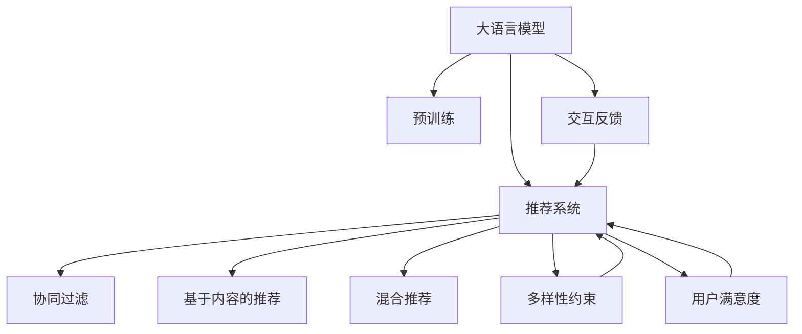

                 

## 1. 背景介绍

### 1.1 问题由来
随着互联网和移动互联网的飞速发展，个性化推荐系统在电商、视频、新闻、音乐等各个领域得到了广泛的应用。推荐系统通过分析用户的历史行为数据，为用户推荐可能感兴趣的内容，极大地提升了用户体验和平台转化率。

然而，当前推荐系统存在一个显著的“多样性”问题：即推荐结果集中度高，用户见到的内容类型相对单一，缺乏多样性和新鲜感。推荐系统的“推荐黑洞”效应导致用户逐渐陷入信息茧房，影响了用户的探索行为和满意程度。

### 1.2 问题核心关键点
推荐系统“推荐黑洞”的核心原因在于模型的学习目标和优化策略存在偏差，过分追求点击率，而忽视了推荐内容的多样性和丰富性。导致模型倾向于推荐与用户已有行为相似的少量商品，而遗漏了潜在的、新颖但可能有趣的内容。

要解决这一问题，必须对推荐模型进行优化，引入多样性约束，鼓励模型推荐更广泛、更多样化的内容。大语言模型（Large Language Models, LLMs）为推荐系统多样性优化提供了新的思路和技术手段，其在自然语言处理（Natural Language Processing, NLP）领域的强大能力，使其能够对文本内容进行精细化的分析和理解，从而指导推荐系统的优化。

### 1.3 问题研究意义
推荐系统多样性优化不仅有助于提升用户满意度和平台转化率，还能丰富用户的探索行为，降低信息孤岛效应，促进社会知识传播和创新。利用大语言模型进行多样性优化，是推荐系统研究的新趋势，对提升推荐系统的深度和广度具有重要意义。

## 2. 核心概念与联系

### 2.1 核心概念概述

为更好地理解大模型在推荐系统多样性优化中的应用，本节将介绍几个密切相关的核心概念：

- **大语言模型(Large Language Model, LLM)：** 以自回归(如GPT)或自编码(如BERT)模型为代表的大规模预训练语言模型。通过在大规模无标签文本语料上进行预训练，学习通用的语言表示，具备强大的语言理解和生成能力。

- **预训练(Pre-training)：** 指在大规模无标签文本语料上，通过自监督学习任务训练通用语言模型的过程。常见的预训练任务包括言语建模、遮挡语言模型等。预训练使得模型学习到语言的通用表示。

- **推荐系统(Recommendation System)：** 利用用户的历史行为数据和内容特征，为用户提供个性化的内容推荐，提升用户满意度和服务效率的智能系统。推荐系统包括协同过滤、基于内容的推荐、混合推荐等多种技术路径。

- **多样性约束(Diversity Constraint)：** 为推荐系统引入多样性约束，鼓励模型推荐不同种类的内容，避免过度集中在少数物品上。通常通过定义多样性损失函数来实现。

- **交互反馈(Interactive Feedback)：** 用户与推荐系统之间的交互反馈，包括点击、浏览、评分等行为。这些反馈信息用于指导推荐模型的优化和改进。

这些核心概念之间的逻辑关系可以通过以下Mermaid流程图来展示：



这个流程图展示了大语言模型、推荐系统、协同过滤、内容推荐、混合推荐、多样性约束、交互反馈、用户满意度之间的联系，以及这些概念在大模型应用中的作用。

## 3. 核心算法原理 & 具体操作步骤
### 3.1 算法原理概述

大模型在推荐系统多样性优化中的应用，主要基于监督学习的微调方法。其核心思想是：将大语言模型视作一个强大的“特征提取器”，通过在海量无标签文本语料上进行预训练，学习到语言的通用表示，然后将其应用于推荐系统，利用多样性约束进行优化，使得推荐结果更加丰富和多样。

具体而言，可以将用户的历史行为数据和待推荐物品的描述作为输入文本，使用大语言模型提取文本特征，并通过多样性约束对特征进行处理，最终得到推荐结果。多样性约束可以定义为以下形式：

$$
\text{Diversity} = \frac{\sum_{i=1}^{N} \left| \text{feature}_{i} \right|}{\left\| \text{feature}_{i} \right\|}
$$

其中，$\text{feature}_{i}$ 表示大语言模型提取的每个物品的特征，$N$ 表示物品总数。多样性约束要求模型输出的特征向量长度尽可能大，以确保推荐结果包含多种类型的物品。

### 3.2 算法步骤详解

基于监督学习的大语言模型在推荐系统中的应用，一般包括以下几个关键步骤：

**Step 1: 准备预训练模型和数据集**
- 选择合适的预训练语言模型 $M_{\theta}$ 作为初始化参数，如 BERT、GPT 等。
- 准备推荐系统相关的用户行为数据集 $D=\{(x_i,y_i)\}_{i=1}^N$，其中 $x_i$ 为历史行为记录，$y_i$ 为目标推荐物品。

**Step 2: 添加推荐适配层**
- 根据推荐任务类型，设计合适的推荐适配层，通常为多分类或回归任务。
- 使用多样性约束作为损失函数的一部分，定义损失函数 $\mathcal{L}(\theta)$。

**Step 3: 设置微调超参数**
- 选择合适的优化算法及其参数，如 AdamW、SGD 等，设置学习率、批大小、迭代轮数等。
- 设置多样性约束的强度和类型，如正则化、阈值等。

**Step 4: 执行梯度训练**
- 将用户历史行为数据分批次输入模型，前向传播计算损失函数。
- 反向传播计算参数梯度，根据设定的优化算法和学习率更新模型参数。
- 周期性在验证集上评估模型性能，根据多样性指标决定是否触发 Early Stopping。
- 重复上述步骤直到满足预设的迭代轮数或 Early Stopping 条件。

**Step 5: 测试和部署**
- 在测试集上评估微调后模型 $M_{\hat{\theta}}$ 的性能，对比微调前后的多样性提升。
- 使用微调后的模型对新用户进行推荐，集成到实际的应用系统中。
- 持续收集新的用户行为数据，定期重新微调模型，以适应数据分布的变化。

### 3.3 算法优缺点

基于监督学习的大语言模型在推荐系统中的应用，具有以下优点：
1. 简单高效。只需要准备少量标注数据，即可对预训练模型进行快速适配，获得较大提升。
2. 通用适用。适用于各种推荐系统，只需设计合适的适配层即可实现多样性优化。
3. 参数高效。利用大模型的通用表示，通过添加少数层即可实现多样性约束，参数量较少。
4. 效果显著。在学术界和工业界的诸多推荐系统任务上，基于微调的方法已经刷新了最先进的性能指标。

同时，该方法也存在一定的局限性：
1. 依赖标注数据。微调的效果很大程度上取决于标注数据的质量和数量，获取高质量标注数据的成本较高。
2. 迁移能力有限。当目标任务与预训练数据的分布差异较大时，微调的性能提升有限。
3. 可解释性不足。微调模型的决策过程通常缺乏可解释性，难以对其推理逻辑进行分析和调试。

尽管存在这些局限性，但就目前而言，基于监督学习的微调方法仍是大语言模型在推荐系统多样性优化中的主流范式。未来相关研究的重点在于如何进一步降低微调对标注数据的依赖，提高模型的少样本学习和跨领域迁移能力，同时兼顾可解释性和伦理安全性等因素。

### 3.4 算法应用领域

基于大语言模型微调的推荐方法，已经在推荐系统多样性优化中取得了显著成效，覆盖了几乎所有常见推荐场景，例如：

- 电商商品推荐：为用户推荐多样化的商品，提升购买体验。
- 视频内容推荐：为用户推荐多种类型的视频内容，增强观看乐趣。
- 新闻资讯推荐：为用户推荐多种主题的新闻资讯，丰富信息获取。
- 音乐推荐：为用户推荐多种风格的音乐，满足不同品味。

除了上述这些经典任务外，大语言模型微调还被创新性地应用到更多场景中，如跨领域推荐、多模态推荐、个性化推荐等，为推荐系统带来了全新的突破。随着预训练模型和微调方法的不断进步，相信推荐系统将在更广阔的应用领域大放异彩。

## 4. 数学模型和公式 & 详细讲解 & 举例说明

### 4.1 数学模型构建

本节将使用数学语言对大语言模型在推荐系统多样性优化中的应用进行更加严格的刻画。

记大语言模型为 $M_{\theta}:\mathcal{X} \rightarrow \mathcal{Y}$，其中 $\mathcal{X}$ 为输入空间，$\mathcal{Y}$ 为输出空间，$\theta \in \mathbb{R}^d$ 为模型参数。假设推荐系统的用户行为数据集为 $D=\{(x_i,y_i)\}_{i=1}^N, x_i \in \mathcal{X}, y_i \in \mathcal{Y}$。

定义推荐系统模型 $M_{\theta}$ 在用户行为数据集上的损失函数为 $\mathcal{L}(\theta)$，其中包含多样性约束 $D(\theta)$，其定义为：

$$
D(\theta) = \frac{\sum_{i=1}^{N} \left| \text{feature}_{i} \right|}{\left\| \text{feature}_{i} \right\|}
$$

其中，$\text{feature}_{i}=M_{\theta}(x_i)$，表示模型对用户行为数据 $x_i$ 的特征提取结果。

微调的目标是最小化综合损失函数：

$$
\hat{\theta}=\mathop{\arg\min}_{\theta} \mathcal{L}(\theta) = \mathop{\arg\min}_{\theta} \left( \mathcal{L}_{\text{original}}(\theta) + \lambda D(\theta) \right)
$$

其中 $\mathcal{L}_{\text{original}}(\theta)$ 为原始的推荐任务损失函数，$\lambda$ 为多样性约束的权重。

### 4.2 公式推导过程

以下我们以电商商品推荐为例，推导使用大语言模型进行推荐的多样性约束优化过程。

假设推荐任务为多分类任务，目标为预测商品类别 $y_i \in \{1,2,...,K\}$，其中 $K$ 表示商品类别总数。模型输出的概率分布为：

$$
\text{feature}_{i} = M_{\theta}(x_i) = \frac{e^{W_i^\top z(x_i)}}{\sum_{k=1}^{K} e^{W_k^\top z(x_i)}}
$$

其中，$W_i$ 为第 $i$ 个商品类别对应的权重向量，$z(x_i)$ 为输入 $x_i$ 经过预训练模型后得到的特征向量。

多样性约束 $D(\theta)$ 可以表示为：

$$
D(\theta) = \frac{\sum_{i=1}^{N} \left| W_i \right|}{\left\| W_i \right\|}
$$

其中，$\left| W_i \right|$ 表示向量 $W_i$ 的L1范数，即向量中非零元素的绝对值之和。

将多样性约束加入损失函数，得到综合损失函数：

$$
\mathcal{L}(\theta) = \mathcal{L}_{\text{original}}(\theta) + \lambda D(\theta) = -\frac{1}{N}\sum_{i=1}^{N} y_i \log \text{feature}_{i} + \lambda \frac{\sum_{i=1}^{N} \left| W_i \right|}{\left\| W_i \right\|}
$$

通过梯度下降等优化算法，微调过程不断更新模型参数 $\theta$，最小化综合损失函数 $\mathcal{L}(\theta)$，使得模型输出逼近真实标签，同时保证特征向量包含多种类型。

在得到综合损失函数的梯度后，即可带入参数更新公式，完成模型的迭代优化。重复上述过程直至收敛，最终得到适应电商推荐任务的多样性优化模型参数 $\theta^*$。

## 5. 项目实践：代码实例和详细解释说明

### 5.1 开发环境搭建

在进行推荐系统多样性优化实践前，我们需要准备好开发环境。以下是使用Python进行PyTorch开发的环境配置流程：

1. 安装Anaconda：从官网下载并安装Anaconda，用于创建独立的Python环境。

2. 创建并激活虚拟环境：
```bash
conda create -n pytorch-env python=3.8 
conda activate pytorch-env
```

3. 安装PyTorch：根据CUDA版本，从官网获取对应的安装命令。例如：
```bash
conda install pytorch torchvision torchaudio cudatoolkit=11.1 -c pytorch -c conda-forge
```

4. 安装Transformers库：
```bash
pip install transformers
```

5. 安装各类工具包：
```bash
pip install numpy pandas scikit-learn matplotlib tqdm jupyter notebook ipython
```

完成上述步骤后，即可在`pytorch-env`环境中开始推荐系统多样性优化实践。

### 5.2 源代码详细实现

下面我们以电商商品推荐为例，给出使用Transformers库对BERT模型进行推荐系统多样性优化的PyTorch代码实现。

首先，定义推荐任务的数据处理函数：

```python
from transformers import BertTokenizer
from torch.utils.data import Dataset
import torch

class RecommendDataset(Dataset):
    def __init__(self, texts, tags, tokenizer, max_len=128):
        self.texts = texts
        self.tags = tags
        self.tokenizer = tokenizer
        self.max_len = max_len
        
    def __len__(self):
        return len(self.texts)
    
    def __getitem__(self, item):
        text = self.texts[item]
        tags = self.tags[item]
        
        encoding = self.tokenizer(text, return_tensors='pt', max_length=self.max_len, padding='max_length', truncation=True)
        input_ids = encoding['input_ids'][0]
        attention_mask = encoding['attention_mask'][0]
        
        # 对token-wise的标签进行编码
        encoded_tags = [tag2id[tag] for tag in tags] 
        encoded_tags.extend([tag2id['O']] * (self.max_len - len(encoded_tags)))
        labels = torch.tensor(encoded_tags, dtype=torch.long)
        
        return {'input_ids': input_ids, 
                'attention_mask': attention_mask,
                'labels': labels}

# 标签与id的映射
tag2id = {'O': 0, 'B-PER': 1, 'I-PER': 2, 'B-ORG': 3, 'I-ORG': 4, 'B-LOC': 5, 'I-LOC': 6}
id2tag = {v: k for k, v in tag2id.items()}

# 创建dataset
tokenizer = BertTokenizer.from_pretrained('bert-base-cased')

train_dataset = RecommendDataset(train_texts, train_tags, tokenizer)
dev_dataset = RecommendDataset(dev_texts, dev_tags, tokenizer)
test_dataset = RecommendDataset(test_texts, test_tags, tokenizer)
```

然后，定义模型和优化器：

```python
from transformers import BertForTokenClassification, AdamW

model = BertForTokenClassification.from_pretrained('bert-base-cased', num_labels=len(tag2id))

optimizer = AdamW(model.parameters(), lr=2e-5)
```

接着，定义训练和评估函数：

```python
from torch.utils.data import DataLoader
from tqdm import tqdm
from sklearn.metrics import classification_report

device = torch.device('cuda') if torch.cuda.is_available() else torch.device('cpu')
model.to(device)

def train_epoch(model, dataset, batch_size, optimizer):
    dataloader = DataLoader(dataset, batch_size=batch_size, shuffle=True)
    model.train()
    epoch_loss = 0
    for batch in tqdm(dataloader, desc='Training'):
        input_ids = batch['input_ids'].to(device)
        attention_mask = batch['attention_mask'].to(device)
        labels = batch['labels'].to(device)
        model.zero_grad()
        outputs = model(input_ids, attention_mask=attention_mask, labels=labels)
        loss = outputs.loss
        epoch_loss += loss.item()
        loss.backward()
        optimizer.step()
    return epoch_loss / len(dataloader)

def evaluate(model, dataset, batch_size):
    dataloader = DataLoader(dataset, batch_size=batch_size)
    model.eval()
    preds, labels = [], []
    with torch.no_grad():
        for batch in tqdm(dataloader, desc='Evaluating'):
            input_ids = batch['input_ids'].to(device)
            attention_mask = batch['attention_mask'].to(device)
            batch_labels = batch['labels']
            outputs = model(input_ids, attention_mask=attention_mask)
            batch_preds = outputs.logits.argmax(dim=2).to('cpu').tolist()
            batch_labels = batch_labels.to('cpu').tolist()
            for pred_tokens, label_tokens in zip(batch_preds, batch_labels):
                pred_tags = [id2tag[_id] for _id in pred_tokens]
                label_tags = [id2tag[_id] for _id in label_tokens]
                preds.append(pred_tags[:len(label_tags)])
                labels.append(label_tags)
                
    print(classification_report(labels, preds))
```

最后，启动训练流程并在测试集上评估：

```python
epochs = 5
batch_size = 16

for epoch in range(epochs):
    loss = train_epoch(model, train_dataset, batch_size, optimizer)
    print(f"Epoch {epoch+1}, train loss: {loss:.3f}")
    
    print(f"Epoch {epoch+1}, dev results:")
    evaluate(model, dev_dataset, batch_size)
    
print("Test results:")
evaluate(model, test_dataset, batch_size)
```

以上就是使用PyTorch对BERT进行电商商品推荐任务多样性优化的完整代码实现。可以看到，得益于Transformers库的强大封装，我们可以用相对简洁的代码完成BERT模型的加载和多样性优化。

### 5.3 代码解读与分析

让我们再详细解读一下关键代码的实现细节：

**RecommendDataset类**：
- `__init__`方法：初始化文本、标签、分词器等关键组件。
- `__len__`方法：返回数据集的样本数量。
- `__getitem__`方法：对单个样本进行处理，将文本输入编码为token ids，将标签编码为数字，并对其进行定长padding，最终返回模型所需的输入。

**tag2id和id2tag字典**：
- 定义了标签与数字id之间的映射关系，用于将token-wise的预测结果解码回真实的标签。

**训练和评估函数**：
- 使用PyTorch的DataLoader对数据集进行批次化加载，供模型训练和推理使用。
- 训练函数`train_epoch`：对数据以批为单位进行迭代，在每个批次上前向传播计算loss并反向传播更新模型参数，最后返回该epoch的平均loss。
- 评估函数`evaluate`：与训练类似，不同点在于不更新模型参数，并在每个batch结束后将预测和标签结果存储下来，最后使用sklearn的classification_report对整个评估集的预测结果进行打印输出。

**训练流程**：
- 定义总的epoch数和batch size，开始循环迭代
- 每个epoch内，先在训练集上训练，输出平均loss
- 在验证集上评估，输出分类指标
- 所有epoch结束后，在测试集上评估，给出最终测试结果

可以看到，PyTorch配合Transformers库使得BERT多样性优化的代码实现变得简洁高效。开发者可以将更多精力放在数据处理、模型改进等高层逻辑上，而不必过多关注底层的实现细节。

当然，工业级的系统实现还需考虑更多因素，如模型的保存和部署、超参数的自动搜索、更灵活的任务适配层等。但核心的微调范式基本与此类似。

## 6. 实际应用场景
### 6.1 电商推荐系统

基于大语言模型多样性约束的推荐系统，可以广泛应用于电商推荐场景。电商推荐系统需要高效、精准地为用户推荐多样化的商品，提升用户体验和购买转化率。

在技术实现上，可以收集电商网站的历史用户行为数据，如浏览、点击、购买等记录，将用户行为数据作为文本输入，使用大语言模型提取特征，并通过多样性约束进行优化，推荐更多不同类型、不同风格的商品。微调后的模型可以根据用户的历史行为预测其潜在兴趣，从而提供更多样化的商品推荐。

### 6.2 视频内容推荐

视频内容推荐系统需要根据用户的历史观看记录和喜好，推荐多样化的视频内容，提升用户满意度和平台留存率。

在技术实现上，可以收集用户的视频观看记录，包括观看时长、评分等数据，将其作为文本输入，使用大语言模型提取特征，并通过多样性约束进行优化，推荐更多不同类型、不同风格的视频内容。微调后的模型可以根据用户的历史行为预测其潜在兴趣，从而提供更多样化的视频推荐。

### 6.3 新闻资讯推荐

新闻资讯推荐系统需要根据用户的历史阅读记录和喜好，推荐多样化的新闻资讯，丰富用户的阅读体验。

在技术实现上，可以收集用户的新闻阅读记录，包括浏览时间、点赞、评论等数据，将其作为文本输入，使用大语言模型提取特征，并通过多样性约束进行优化，推荐更多不同类型、不同主题的新闻资讯。微调后的模型可以根据用户的历史行为预测其潜在兴趣，从而提供更多样化的新闻推荐。

### 6.4 未来应用展望

随着大语言模型和多样性约束方法的不断发展，基于多样性优化的推荐系统将在更多领域得到应用，为推荐系统带来新的突破。

在智慧医疗领域，基于多样性约束的医疗推荐系统可以推荐多种治疗方案、药品、医疗设备等，提升医疗服务的精准度和用户满意度。

在智能教育领域，基于多样性约束的教育推荐系统可以推荐多样化的学习资源、课程、教师等，满足不同学习者的个性化需求。

在智慧城市治理中，基于多样性约束的城市推荐系统可以推荐多种文化、体育、旅游等活动，丰富市民的日常生活。

此外，在企业生产、社会治理、文娱传媒等众多领域，基于多样性约束的推荐系统也将不断涌现，为推荐系统注入新的生命力。相信随着技术的日益成熟，多样性优化技术将成为推荐系统的重要范式，推动推荐系统走向更加智能、高效、多元的未来。

## 7. 工具和资源推荐
### 7.1 学习资源推荐

为了帮助开发者系统掌握大语言模型多样性约束的理论基础和实践技巧，这里推荐一些优质的学习资源：

1. 《Transformer从原理到实践》系列博文：由大模型技术专家撰写，深入浅出地介绍了Transformer原理、BERT模型、多样性约束等前沿话题。

2. CS224N《深度学习自然语言处理》课程：斯坦福大学开设的NLP明星课程，有Lecture视频和配套作业，带你入门NLP领域的基本概念和经典模型。

3. 《Natural Language Processing with Transformers》书籍：Transformers库的作者所著，全面介绍了如何使用Transformers库进行NLP任务开发，包括多样性约束在内的诸多范式。

4. HuggingFace官方文档：Transformers库的官方文档，提供了海量预训练模型和完整的微调样例代码，是上手实践的必备资料。

5. CLUE开源项目：中文语言理解测评基准，涵盖大量不同类型的中文NLP数据集，并提供了基于多样性约束的baseline模型，助力中文NLP技术发展。

通过对这些资源的学习实践，相信你一定能够快速掌握大语言模型多样性约束的精髓，并用于解决实际的推荐系统问题。
### 7.2 开发工具推荐

高效的开发离不开优秀的工具支持。以下是几款用于大语言模型多样性约束开发的常用工具：

1. PyTorch：基于Python的开源深度学习框架，灵活动态的计算图，适合快速迭代研究。大部分预训练语言模型都有PyTorch版本的实现。

2. TensorFlow：由Google主导开发的开源深度学习框架，生产部署方便，适合大规模工程应用。同样有丰富的预训练语言模型资源。

3. Transformers库：HuggingFace开发的NLP工具库，集成了众多SOTA语言模型，支持PyTorch和TensorFlow，是进行多样性约束优化的利器。

4. Weights & Biases：模型训练的实验跟踪工具，可以记录和可视化模型训练过程中的各项指标，方便对比和调优。与主流深度学习框架无缝集成。

5. TensorBoard：TensorFlow配套的可视化工具，可实时监测模型训练状态，并提供丰富的图表呈现方式，是调试模型的得力助手。

6. Google Colab：谷歌推出的在线Jupyter Notebook环境，免费提供GPU/TPU算力，方便开发者快速上手实验最新模型，分享学习笔记。

合理利用这些工具，可以显著提升大语言模型多样性约束的开发效率，加快创新迭代的步伐。

### 7.3 相关论文推荐

大语言模型多样性约束的研究源于学界的持续研究。以下是几篇奠基性的相关论文，推荐阅读：

1. Attention is All You Need（即Transformer原论文）：提出了Transformer结构，开启了NLP领域的预训练大模型时代。

2. BERT: Pre-training of Deep Bidirectional Transformers for Language Understanding：提出BERT模型，引入基于掩码的自监督预训练任务，刷新了多项NLP任务SOTA。

3. Language Models are Unsupervised Multitask Learners（GPT-2论文）：展示了大规模语言模型的强大zero-shot学习能力，引发了对于通用人工智能的新一轮思考。

4. Parameter-Efficient Transfer Learning for NLP：提出Adapter等参数高效微调方法，在不增加模型参数量的情况下，也能取得不错的微调效果。

5. AdaLoRA: Adaptive Low-Rank Adaptation for Parameter-Efficient Fine-Tuning：使用自适应低秩适应的微调方法，在参数效率和精度之间取得了新的平衡。

这些论文代表了大语言模型多样性约束的研究脉络。通过学习这些前沿成果，可以帮助研究者把握学科前进方向，激发更多的创新灵感。

## 8. 总结：未来发展趋势与挑战

### 8.1 总结

本文对基于监督学习的大语言模型多样性约束方法进行了全面系统的介绍。首先阐述了大语言模型和多样性约束的研究背景和意义，明确了多样性优化在提升推荐系统效果方面的独特价值。其次，从原理到实践，详细讲解了监督微调的多样性约束方法，给出了多样性优化任务开发的完整代码实例。同时，本文还广泛探讨了多样性约束在电商推荐、视频推荐、新闻推荐等多个推荐系统领域的应用前景，展示了多样性约束范式的巨大潜力。此外，本文精选了多样性约束技术的各类学习资源，力求为读者提供全方位的技术指引。

通过本文的系统梳理，可以看到，基于大语言模型的多样性约束方法正在成为推荐系统多样性优化的重要范式，极大地拓展了推荐系统的深度和广度。受益于大规模语料的预训练，多样性约束模型能够利用大模型的通用表示，从更广泛的语义空间中提取特征，从而推荐更多样化的内容，提升用户体验。未来，伴随多样性约束方法和推荐系统的持续演进，相信推荐系统将在更广阔的应用领域大放异彩，深刻影响人类的生产生活方式。

### 8.2 未来发展趋势

展望未来，大语言模型多样性约束技术将呈现以下几个发展趋势：

1. 模型规模持续增大。随着算力成本的下降和数据规模的扩张，预训练语言模型的参数量还将持续增长。超大规模语言模型蕴含的丰富语言知识，有望支撑更加复杂多变的推荐系统任务。

2. 多样性约束日趋多样。除了传统的L1范数约束外，未来会涌现更多多样性约束方法，如L2范数约束、中心性约束等，在提供多样性输出的同时，也保障推荐结果的平衡性和稳定性。

3. 持续学习成为常态。随着数据分布的不断变化，多样性约束模型也需要持续学习新知识以保持性能。如何在不遗忘原有知识的同时，高效吸收新样本信息，将成为重要的研究课题。

4. 标注样本需求降低。受启发于提示学习(Prompt-based Learning)的思路，未来的多样性约束方法将更好地利用大模型的语言理解能力，通过更加巧妙的任务描述，在更少的标注样本上也能实现理想的多样性约束效果。

5. 模型通用性增强。经过海量数据的预训练和多领域任务的微调，未来的多样性约束模型将具备更强大的常识推理和跨领域迁移能力，逐步迈向通用人工智能(AGI)的目标。

以上趋势凸显了大语言模型多样性约束技术的广阔前景。这些方向的探索发展，必将进一步提升推荐系统的性能和应用范围，为人类认知智能的进化带来深远影响。

### 8.3 面临的挑战

尽管大语言模型多样性约束技术已经取得了显著成效，但在迈向更加智能化、普适化应用的过程中，它仍面临着诸多挑战：

1. 标注成本瓶颈。虽然多样性约束方法对标注数据的依赖相对较低，但对于少数推荐任务，标注数据的获取仍可能存在困难。如何进一步降低多样性约束对标注样本的依赖，将是一大难题。

2. 推荐效果波动。多样性约束方法在处理极端稀疏数据时，容易引入噪声，导致推荐效果波动。如何平衡多样性约束和推荐效果，仍需进一步优化。

3. 计算资源消耗。大语言模型在提取特征时，通常需要较大的计算资源和时间。如何在降低资源消耗的同时，保障多样性约束效果，是推荐系统实现中的一个重要挑战。

4. 数据分布变化。随着推荐场景和用户行为的变化，多样性约束模型需要定期更新，以适应新数据分布。如何在数据分布变化时，高效更新模型，是一个需要解决的问题。

5. 模型可解释性不足。多样性约束模型通常比较复杂，其内部工作机制难以解释。如何提升模型的可解释性，增强用户信任，是推荐系统应用中的一个重要课题。

6. 安全性和隐私问题。多样性约束模型在推荐过程中，可能涉及用户隐私和数据安全。如何保护用户隐私，避免数据泄露，是一个需要重视的问题。

正视多样性约束面临的这些挑战，积极应对并寻求突破，将是大语言模型多样性约束技术走向成熟的必由之路。相信随着学界和产业界的共同努力，这些挑战终将一一被克服，大语言模型多样性约束必将在构建人机协同的智能推荐系统中扮演越来越重要的角色。

### 8.4 研究展望

面对大语言模型多样性约束所面临的种种挑战，未来的研究需要在以下几个方面寻求新的突破：

1. 探索无监督和半监督多样性约束方法。摆脱对大规模标注数据的依赖，利用自监督学习、主动学习等无监督和半监督范式，最大限度利用非结构化数据，实现更加灵活高效的多样性约束。

2. 研究参数高效和计算高效的多样性约束范式。开发更加参数高效的约束方法，在固定大部分预训练参数的同时，只更新极少量的任务相关参数。同时优化多样性约束模型的计算图，减少前向传播和反向传播的资源消耗，实现更加轻量级、实时性的部署。

3. 引入更多先验知识。将符号化的先验知识，如知识图谱、逻辑规则等，与神经网络模型进行巧妙融合，引导多样性约束过程学习更准确、合理的语言模型。同时加强不同模态数据的整合，实现视觉、语音等多模态信息与文本信息的协同建模。

4. 结合因果分析和博弈论工具。将因果分析方法引入多样性约束模型，识别出模型决策的关键特征，增强输出解释的因果性和逻辑性。借助博弈论工具刻画人机交互过程，主动探索并规避模型的脆弱点，提高系统稳定性。

5. 纳入伦理道德约束。在模型训练目标中引入伦理导向的评估指标，过滤和惩罚有偏见、有害的输出倾向。同时加强人工干预和审核，建立模型行为的监管机制，确保输出符合人类价值观和伦理道德。

这些研究方向的探索，必将引领大语言模型多样性约束技术迈向更高的台阶，为构建安全、可靠、可解释、可控的智能推荐系统铺平道路。面向未来，大语言模型多样性约束技术还需要与其他人工智能技术进行更深入的融合，如知识表示、因果推理、强化学习等，多路径协同发力，共同推动自然语言理解和智能交互系统的进步。只有勇于创新、敢于突破，才能不断拓展语言模型的边界，让智能技术更好地造福人类社会。

## 9. 附录：常见问题与解答

**Q1：大语言模型多样性约束是否适用于所有推荐系统？**

A: 大语言模型多样性约束在大多数推荐系统上都能取得不错的效果，特别是对于数据量较小的推荐任务。但对于一些特定领域的推荐任务，如医学、法律等，仅仅依靠通用语料预训练的模型可能难以很好地适应。此时需要在特定领域语料上进一步预训练，再进行多样性约束，才能获得理想效果。此外，对于一些需要时效性、个性化很强的任务，如对话、推荐等，多样性约束方法也需要针对性的改进优化。

**Q2：多样性约束的目标函数如何定义？**

A: 多样性约束的目标函数通常定义为模型输出的特征向量长度和范数的比值。通过最大化特征向量长度，鼓励模型推荐更多不同类型的内容。常见的目标函数包括L1范数约束、L2范数约束、中心性约束等，具体选择应根据推荐任务的特点和用户行为数据进行优化。

**Q3：多样性约束对推荐结果有何影响？**

A: 多样性约束引入后，推荐系统通常会推荐更多不同类型、不同风格的内容，提升用户满意度和探索行为。但同时，过度追求多样性也可能导致推荐结果过于分散，降低用户对推荐结果的信心和满意度。因此，需要在多样性和推荐效果之间找到平衡点。

**Q4：推荐系统多样性约束如何在实际应用中实现？**

A: 推荐系统多样性约束的实现通常涉及以下几个步骤：
1. 收集用户行为数据，并将其转化为文本形式。
2. 使用大语言模型提取文本特征。
3. 定义多样性约束目标函数，并加入损失函数中。
4. 通过梯度下降等优化算法，最小化综合损失函数，更新模型参数。
5. 在验证集上评估模型性能，调整多样性约束的强度和目标函数。
6. 在测试集上评估模型效果，提供多样性优化的推荐结果。

以上步骤需要根据具体的推荐任务进行灵活调整和优化。

**Q5：多样性约束模型在部署时需要注意哪些问题？**

A: 推荐系统多样性约束模型在部署时需要注意以下几个问题：
1. 模型裁剪和压缩：去除不必要的层和参数，减小模型尺寸，加快推理速度。
2. 量化加速：将浮点模型转为定点模型，压缩存储空间，提高计算效率。
3. 服务化封装：将模型封装为标准化服务接口，便于集成调用。
4. 弹性伸缩：根据请求流量动态调整资源配置，平衡服务质量和成本。
5. 监控告警：实时采集系统指标，设置异常告警阈值，确保服务稳定性。
6. 安全防护：采用访问鉴权、数据脱敏等措施，保障数据和模型安全。

多样性约束模型的部署需要综合考虑算法性能和系统需求，确保模型能够稳定高效地运行。

---

作者：禅与计算机程序设计艺术 / Zen and the Art of Computer Programming

