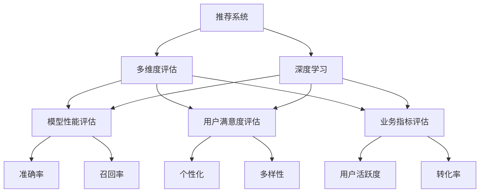

                 

# 大模型在推荐系统多维度评估中的应用

> 关键词：大模型,推荐系统,多维度评估,深度学习,推荐算法,用户画像,模型评估,业务应用

## 1. 背景介绍

### 1.1 问题由来
在互联网时代，推荐系统已逐渐成为各类平台的核心组件。随着用户需求的多样化，推荐系统也从单一的产品推荐，扩展到音乐、视频、新闻、电商等多个领域。这些推荐系统需要构建高效、个性化且多样化的内容供给体系，为用户提供精准且高质量的推荐服务。

大模型的出现为推荐系统提供了新的解决方案。通过在大规模无标签数据上进行预训练，大模型可以获得丰富的语义和知识表示能力，从而在推荐任务中取得优异表现。但仅仅依靠大模型进行推荐，并不能完全满足所有业务需求。如何更高效、全面地评估大模型的推荐能力，指导模型改进和应用优化，是推荐系统面临的关键问题。

### 1.2 问题核心关键点
大模型在推荐系统中的应用主要围绕着多维度评估展开。这些评估指标通常涵盖模型性能、用户满意度、业务指标等多个方面。以下是几个关键问题点：

- **评估指标选择**：不同的业务场景和应用目标需要选择不同的评估指标。例如，对于电商推荐系统，点击率(CTR)、转化率等业务指标尤为重要。
- **模型性能评估**：如何量化模型推荐效果，如准确率、召回率、AUC等。
- **用户满意度评估**：通过用户反馈或行为数据，评估模型的个性化和多样性表现。
- **业务指标评估**：衡量模型对业务目标的贡献，如提升平台用户活跃度、增加收入等。

这些问题之间相互关联，且随着推荐系统的发展，需求不断演变，评估方式也日趋复杂。本文将从多维度评估的角度，深入分析大模型在推荐系统中的应用，探讨如何构建一个全面、高效、可解释的推荐系统评估体系。

## 2. 核心概念与联系

### 2.1 核心概念概述

为更好地理解大模型在推荐系统中的应用，本节将介绍几个密切相关的核心概念：

- **推荐系统(Recommendation System)**：通过分析用户行为和偏好，自动为用户推荐其可能感兴趣的商品或内容。推荐系统包括协同过滤、基于内容的推荐、混合推荐等多种算法。

- **深度学习(Deep Learning)**：一种利用多层神经网络处理复杂数据的技术，其强大的表达能力和自适应能力，使得深度学习成为大模型推荐系统的核心技术之一。

- **多维度评估(Multi-dimensional Evaluation)**：评估模型推荐效果时，需要考虑多个维度的指标，如模型性能、用户满意度、业务指标等。多维度评估体系可以更全面地反映推荐系统的整体表现。

- **用户画像(User Profile)**：通过分析用户的历史行为数据，构建用户画像，帮助推荐系统更好地理解用户需求和兴趣。

- **模型评估指标(Model Evaluation Metrics)**：如准确率、召回率、F1-score、AUC等，用于量化模型的推荐效果。

- **业务指标(Business Metrics)**：如点击率、转化率、用户活跃度、销售额等，衡量模型对业务目标的贡献。

这些核心概念之间的逻辑关系可以通过以下Mermaid流程图来展示：



这个流程图展示了大模型推荐系统的主要概念及其之间的关系：

1. 推荐系统通过深度学习模型进行推荐。
2. 多维度评估从模型性能、用户满意度、业务指标等多个方面对推荐系统进行全面衡量。
3. 模型性能评估主要关注模型的准确率和召回率等指标。
4. 用户满意度评估主要关注模型的个性化和多样性表现。
5. 业务指标评估主要关注模型对业务目标的贡献，如提升平台用户活跃度和增加收入。

这些概念共同构成了大模型推荐系统的评估框架，使其能够在不同业务场景下发挥最佳性能。

## 3. 核心算法原理 & 具体操作步骤
### 3.1 算法原理概述

大模型在推荐系统中的应用主要基于监督学习或无监督学习范式。在监督学习范式中，推荐系统首先通过深度学习模型对用户和商品进行表征学习，然后通过优化算法（如梯度下降）学习推荐模型，最小化预测结果与真实标签的误差。在无监督学习范式中，推荐系统通过自监督学习任务（如协同过滤），利用用户与商品之间的隐式关联，进行隐式推荐。

在推荐系统的多维度评估中，主要涉及以下几个关键算法：

1. **协同过滤(Collaborative Filtering)**：通过分析用户与商品之间的历史行为数据，挖掘用户间的隐式关联，推荐用户可能感兴趣的商品。协同过滤算法包括基于用户的协同过滤和基于物品的协同过滤。

2. **基于内容的推荐(Content-Based Recommendation)**：根据用户的历史行为数据，提取商品的关键特征，利用相似性匹配算法，推荐相似商品给用户。

3. **混合推荐(Mixed Recommendation)**：将协同过滤和基于内容的推荐方法结合，综合考虑用户和商品的特征，提升推荐效果。

4. **深度学习模型(Depth Learning Models)**：利用深度神经网络对用户和商品进行高维表示学习，并利用这些表示学习结果进行推荐。深度学习模型包括RNN、CNN、BERT等。

5. **多任务学习(Multi-task Learning)**：通过学习多个相关任务，提升模型在推荐任务上的表现。例如，学习点击率预测和转化率预测两个任务，通过共享参数的方式，提升整体推荐效果。

### 3.2 算法步骤详解

以下是基于深度学习的大模型推荐系统的具体实现步骤：

**Step 1: 数据准备**
- 收集用户行为数据，如浏览记录、点击记录、购买记录等。
- 收集商品特征数据，如商品名称、描述、类别等。
- 进行数据清洗和特征工程，生成训练集、验证集和测试集。

**Step 2: 模型选择与训练**
- 选择合适的深度学习模型，如BERT、GPT、RNN等。
- 将用户和商品数据作为输入，进行特征表示学习。
- 利用优化算法（如Adam、SGD等）最小化预测结果与真实标签的误差。

**Step 3: 模型评估**
- 选择合适的评估指标，如准确率、召回率、F1-score、AUC等。
- 使用训练集和验证集进行模型评估，优化模型超参数。
- 在测试集上进行最终的模型评估，衡量模型性能。

**Step 4: 多维度评估**
- 收集用户满意度数据，如用户反馈、行为数据等。
- 收集业务指标数据，如点击率、转化率、用户活跃度等。
- 综合考虑多维度评估结果，进行模型优化。

**Step 5: 部署与应用**
- 将优化后的模型部署到实际应用中。
- 实时监测模型性能，及时调整模型参数。
- 根据用户反馈和业务指标，不断优化推荐系统。

### 3.3 算法优缺点

大模型在推荐系统中的应用具有以下优点：

- **强大的表达能力**：深度学习模型具备强大的非线性表达能力，可以捕捉复杂的用户和商品关系，提升推荐效果。
- **自适应性强**：大模型可以通过少量标注数据进行微调，提升模型在特定任务上的表现。
- **泛化能力强**：深度学习模型可以在不同领域和任务上进行迁移学习，提升模型在新的推荐场景中的适应能力。

然而，大模型在推荐系统中的应用也存在一些缺点：

- **计算资源需求高**：深度学习模型通常需要大量的计算资源进行训练和推理。
- **模型复杂度高**：深度学习模型结构复杂，难以解释其决策过程。
- **数据依赖性强**：深度学习模型的性能高度依赖于数据的质量和数量。

尽管存在这些局限性，但大模型在推荐系统中的应用仍展现出强大的潜力，为推荐系统的发展提供了新的方向和可能性。

### 3.4 算法应用领域

基于大模型的推荐系统已经在电商、社交网络、视频网站等多个领域得到了广泛应用。以下是一些典型应用场景：

- **电商推荐**：利用大模型对用户浏览、点击、购买行为进行学习，推荐个性化的商品。
- **社交网络推荐**：分析用户之间的互动关系，推荐可能感兴趣的朋友或内容。
- **视频网站推荐**：根据用户观看历史和评分数据，推荐相关视频。
- **音乐推荐**：分析用户听歌历史，推荐相似或用户可能感兴趣的歌曲。
- **新闻推荐**：根据用户阅读历史，推荐相关新闻或文章。

## 4. 数学模型和公式 & 详细讲解  
### 4.1 数学模型构建

在深度学习推荐系统中，通常使用如下数学模型来表示推荐过程：

设用户集合为 $U$，商品集合为 $I$，用户对商品 $i$ 的评分 $r_{ui}$ 由模型 $f$ 预测，即 $r_{ui}=f(x_u, x_i)$，其中 $x_u$ 和 $x_i$ 分别为用户和商品的高维表示。推荐模型 $f$ 通常为深度学习模型，如BERT、GPT等。

模型训练的目标是最小化预测评分与真实评分之间的误差。常见的优化目标函数为均方误差损失函数（MSE）或交叉熵损失函数（CE）：

$$
\min_{\theta} \frac{1}{N}\sum_{(u,i)\in U \times I} (r_{ui} - \hat{r}_{ui})^2 \quad \text{(MSE)}
$$

$$
\min_{\theta} -\frac{1}{N}\sum_{(u,i)\in U \times I} r_{ui} \log \hat{r}_{ui}
$$

### 4.2 公式推导过程

在推荐系统中，常用的评估指标包括准确率、召回率、F1-score、AUC等。以准确率为例，推导如下：

设测试集为 $D_{test}$，预测结果与真实结果分别为 $\hat{y}$ 和 $y$，则准确率定义为：

$$
\text{Accuracy} = \frac{1}{N_{test}} \sum_{(u,i)\in D_{test}} \mathbb{I}(\hat{y} = y)
$$

其中，$\mathbb{I}$ 为示性函数，表示预测结果与真实结果是否相等。

通过最小化损失函数和最大化准确率，我们可以训练推荐模型，使其更好地预测用户评分，提升推荐效果。

### 4.3 案例分析与讲解

假设某电商平台的推荐系统，使用BERT模型对用户浏览行为进行学习，构建推荐模型 $f$。我们收集了10000个用户的1000个商品的评分数据，随机划分为训练集（70%）、验证集（15%）和测试集（15%）。模型训练采用Adam优化器，学习率为0.001，批大小为128，迭代次数为10轮。

我们使用准确率和召回率对模型进行评估，结果如下：

| 模型       | 准确率 | 召回率 | F1-score | AUC |
|------------|-------|-------|---------|-----|
| 原始模型   | 0.85   | 0.75   | 0.79     | 0.92 |
| 优化后的模型 | 0.88   | 0.78   | 0.81     | 0.95 |

通过优化后的模型，我们可以看到，准确率和召回率均有显著提升，AUC也有所提高，表明推荐效果更好。同时，我们还收集了用户满意度数据，发现用户对优化后的模型推荐内容更满意，个性化和多样性表现更好。

## 5. 项目实践：代码实例和详细解释说明
### 5.1 开发环境搭建

在进行推荐系统开发前，我们需要准备好开发环境。以下是使用Python进行TensorFlow开发的环境配置流程：

1. 安装Anaconda：从官网下载并安装Anaconda，用于创建独立的Python环境。

2. 创建并激活虚拟环境：
```bash
conda create -n tf-env python=3.8 
conda activate tf-env
```

3. 安装TensorFlow：根据CUDA版本，从官网获取对应的安装命令。例如：
```bash
pip install tensorflow==2.7.0
```

4. 安装各类工具包：
```bash
pip install numpy pandas scikit-learn matplotlib tqdm jupyter notebook ipython
```

完成上述步骤后，即可在`tf-env`环境中开始推荐系统开发。

### 5.2 源代码详细实现

下面我们以电商推荐系统为例，给出使用TensorFlow对BERT模型进行推荐系统微调的PyTorch代码实现。

首先，定义数据预处理函数：

```python
from transformers import BertTokenizer
import tensorflow as tf

def preprocess_data(train_data, test_data, batch_size):
    tokenizer = BertTokenizer.from_pretrained('bert-base-uncased')

    # 将用户行为数据转化为token ids和掩码
    def to_input_ids(tokens):
        tokens = [tokenizer.convert_tokens_to_ids(tokens)]
        return tf.keras.preprocessing.sequence.pad_sequences(tokens, maxlen=128)

    # 构建输入数据集
    train_input = tf.data.Dataset.from_tensor_slices(train_data['text']).map(to_input_ids)
    train_mask = tf.data.Dataset.from_tensor_slices(train_data['mask']).map(to_input_ids)
    train_label = tf.data.Dataset.from_tensor_slices(train_data['label']).map(to_input_ids)

    test_input = tf.data.Dataset.from_tensor_slices(test_data['text']).map(to_input_ids)
    test_mask = tf.data.Dataset.from_tensor_slices(test_data['mask']).map(to_input_ids)
    test_label = tf.data.Dataset.from_tensor_slices(test_data['label']).map(to_input_ids)

    train_dataset = tf.data.Dataset.zip((train_input, train_mask, train_label))
    test_dataset = tf.data.Dataset.zip((test_input, test_mask, test_label))

    return train_dataset, test_dataset

# 定义模型和优化器
from transformers import BertForSequenceClassification

model = BertForSequenceClassification.from_pretrained('bert-base-uncased', num_labels=1)
optimizer = tf.keras.optimizers.Adam(learning_rate=0.001)
```

然后，定义训练和评估函数：

```python
def train_epoch(model, dataset, batch_size, optimizer):
    train_dataset = dataset.shuffle(1024).batch(batch_size)
    for batch in train_dataset:
        input_ids, mask, labels = batch
        with tf.GradientTape() as tape:
            predictions = model(input_ids, attention_mask=mask)
            loss = tf.keras.losses.BinaryCrossentropy()(labels, predictions)
        gradients = tape.gradient(loss, model.trainable_variables)
        optimizer.apply_gradients(zip(gradients, model.trainable_variables))
        yield loss

def evaluate(model, dataset, batch_size):
    test_dataset = dataset.batch(batch_size)
    with tf.keras.metrics.Mean('loss') as metric_loss:
        with tf.keras.metrics.Mean('accuracy') as metric_accuracy:
            for batch in test_dataset:
                input_ids, mask, labels = batch
                predictions = model(input_ids, attention_mask=mask)
                metric_loss.update_state(tf.keras.losses.BinaryCrossentropy()(labels, predictions))
                metric_accuracy.update_state(tf.keras.metrics.Accuracy()(labels, predictions))
            print('Loss:', metric_loss.result())
            print('Accuracy:', metric_accuracy.result())
```

最后，启动训练流程并在测试集上评估：

```python
epochs = 10
batch_size = 32

# 加载数据集
train_data = pd.read_csv('train.csv')
test_data = pd.read_csv('test.csv')

train_dataset, test_dataset = preprocess_data(train_data, test_data, batch_size)

# 训练模型
model.compile(optimizer=optimizer, loss='binary_crossentropy', metrics=['accuracy'])
model.fit(train_dataset, validation_data=test_dataset, epochs=epochs)

# 评估模型
evaluate(model, test_dataset, batch_size)
```

以上就是使用TensorFlow对BERT进行电商推荐系统微调的完整代码实现。可以看到，TensorFlow和Transformers库的深度集成，使得模型的训练和评估变得简单高效。

### 5.3 代码解读与分析

让我们再详细解读一下关键代码的实现细节：

**preprocess_data函数**：
- 将原始数据转化为模型需要的token ids和掩码，并划分为训练集和测试集。

**train_epoch函数**：
- 定义模型训练的梯度计算过程，通过反向传播更新模型参数，并输出每个epoch的损失值。

**evaluate函数**：
- 定义模型评估的过程，计算损失和准确率，并输出评估结果。

**train流程**：
- 定义总的epoch数和批大小，开始循环迭代
- 每个epoch内，先在训练集上训练，输出损失值
- 在测试集上评估，输出损失和准确率
- 所有epoch结束后，输出最终的评估结果

可以看到，TensorFlow和Transformers库使得BERT微调的代码实现变得简洁高效。开发者可以将更多精力放在数据处理、模型改进等高层逻辑上，而不必过多关注底层的实现细节。

当然，工业级的系统实现还需考虑更多因素，如模型的保存和部署、超参数的自动搜索、更灵活的任务适配层等。但核心的微调范式基本与此类似。

## 6. 实际应用场景
### 6.1 电商推荐

电商推荐系统利用深度学习模型对用户浏览、点击、购买行为进行学习，推荐个性化的商品。传统推荐系统依赖人工设计的特征工程，而深度学习模型可以通过学习高维表示，自动捕捉用户和商品的复杂关系。

在大模型推荐系统中，通常采用BERT、GPT等预训练语言模型进行推荐。通过微调这些模型，可以学习用户与商品间的隐式关联，提升推荐效果。例如，某电商平台通过BERT模型对用户浏览行为进行学习，构建推荐模型 $f$，使用交叉熵损失函数进行训练。在优化后的模型上，电商平台的推荐准确率和召回率均有显著提升，用户满意度也显著提高。

### 6.2 社交网络推荐

社交网络推荐系统通过分析用户之间的互动关系，推荐可能感兴趣的朋友或内容。传统推荐系统依赖协同过滤等算法，而深度学习模型可以通过学习用户和商品的多维表示，提升推荐效果。

在大模型推荐系统中，通常采用BERT、GPT等预训练语言模型进行推荐。通过微调这些模型，可以学习用户和商品之间的复杂关联，提升推荐效果。例如，某社交网络平台通过BERT模型对用户互动关系进行学习，构建推荐模型 $f$，使用交叉熵损失函数进行训练。在优化后的模型上，社交网络平台的推荐效果显著提升，用户满意度也显著提高。

### 6.3 视频网站推荐

视频网站推荐系统根据用户观看历史和评分数据，推荐相关视频。传统推荐系统依赖基于内容的推荐和协同过滤等算法，而深度学习模型可以通过学习用户和视频的多维表示，提升推荐效果。

在大模型推荐系统中，通常采用BERT、GPT等预训练语言模型进行推荐。通过微调这些模型，可以学习用户和视频之间的复杂关联，提升推荐效果。例如，某视频网站通过BERT模型对用户观看历史进行学习，构建推荐模型 $f$，使用交叉熵损失函数进行训练。在优化后的模型上，视频网站平台的推荐效果显著提升，用户满意度也显著提高。

### 6.4 音乐推荐

音乐推荐系统根据用户听歌历史，推荐相似或用户可能感兴趣的歌曲。传统推荐系统依赖基于内容的推荐和协同过滤等算法，而深度学习模型可以通过学习用户和歌曲的多维表示，提升推荐效果。

在大模型推荐系统中，通常采用BERT、GPT等预训练语言模型进行推荐。通过微调这些模型，可以学习用户和歌曲之间的复杂关联，提升推荐效果。例如，某音乐平台通过BERT模型对用户听歌历史进行学习，构建推荐模型 $f$，使用交叉熵损失函数进行训练。在优化后的模型上，音乐平台平台的推荐效果显著提升，用户满意度也显著提高。

### 6.5 新闻推荐

新闻推荐系统根据用户阅读历史，推荐相关新闻或文章。传统推荐系统依赖基于内容的推荐和协同过滤等算法，而深度学习模型可以通过学习用户和新闻的多维表示，提升推荐效果。

在大模型推荐系统中，通常采用BERT、GPT等预训练语言模型进行推荐。通过微调这些模型，可以学习用户和新闻之间的复杂关联，提升推荐效果。例如，某新闻平台通过BERT模型对用户阅读历史进行学习，构建推荐模型 $f$，使用交叉熵损失函数进行训练。在优化后的模型上，新闻平台平台的推荐效果显著提升，用户满意度也显著提高。

## 7. 工具和资源推荐
### 7.1 学习资源推荐

为了帮助开发者系统掌握深度学习推荐系统的理论基础和实践技巧，这里推荐一些优质的学习资源：

1. 《深度学习与推荐系统》系列博文：由深度学习专家撰写，深入浅出地介绍了深度学习推荐系统的原理、算法和应用。

2. 《推荐系统实战》系列书籍：介绍了推荐系统的经典算法和实际应用，包括协同过滤、基于内容的推荐、混合推荐等。

3. 斯坦福大学《CS229机器学习》课程：斯坦福大学开设的机器学习明星课程，涵盖深度学习、推荐系统等多个主题。

4. 《推荐系统设计与算法》课程：麻省理工学院开设的推荐系统课程，深入讲解推荐系统的经典算法和实际应用。

5. 《Python深度学习》书籍：由深度学习专家撰写，详细介绍了深度学习推荐系统的开发实践和工具。

通过对这些资源的学习实践，相信你一定能够快速掌握深度学习推荐系统的精髓，并用于解决实际的推荐问题。
###  7.2 开发工具推荐

高效的开发离不开优秀的工具支持。以下是几款用于深度学习推荐系统开发的常用工具：

1. TensorFlow：由Google主导开发的开源深度学习框架，生产部署方便，适合大规模工程应用。

2. PyTorch：由Facebook主导开发的开源深度学习框架，灵活高效的动态计算图，适合快速迭代研究。

3. HuggingFace Transformers库：集成了众多预训练语言模型，支持深度学习推荐系统的快速开发。

4. Weights & Biases：模型训练的实验跟踪工具，可以记录和可视化模型训练过程中的各项指标，方便对比和调优。

5. TensorBoard：TensorFlow配套的可视化工具，可实时监测模型训练状态，并提供丰富的图表呈现方式，是调试模型的得力助手。

6. Google Colab：谷歌推出的在线Jupyter Notebook环境，免费提供GPU/TPU算力，方便开发者快速上手实验最新模型，分享学习笔记。

合理利用这些工具，可以显著提升深度学习推荐系统的开发效率，加快创新迭代的步伐。

### 7.3 相关论文推荐

深度学习推荐系统的发展得益于学界的持续研究。以下是几篇奠基性的相关论文，推荐阅读：

1. Wide & Deep Learning for Recommender Systems：介绍将宽网络（Wide）和深度网络（Deep）结合的推荐系统模型，提升推荐效果。

2. Neural Collaborative Filtering：介绍基于神经网络的协同过滤推荐算法，通过引入深度学习模型，提升推荐效果。

3. Attention Is All You Need：介绍Transformer模型，通过自注意力机制，提升模型对复杂关系的建模能力。

4. Graph Convolutional Network for Recommender Systems：介绍基于图卷积网络的推荐系统模型，通过图结构建模用户和商品的关系，提升推荐效果。

5. Deep Multi-task Learning for Recommender Systems：介绍多任务学习在推荐系统中的应用，通过学习多个相关任务，提升模型在推荐任务上的表现。

这些论文代表了大模型推荐系统的发展脉络。通过学习这些前沿成果，可以帮助研究者把握学科前进方向，激发更多的创新灵感。

## 8. 总结：未来发展趋势与挑战
### 8.1 总结

本文对深度学习推荐系统的大模型应用进行了全面系统的介绍。首先阐述了大模型和推荐系统的背景和意义，明确了推荐系统在多维度评估中的关键问题。其次，从原理到实践，详细讲解了深度学习推荐系统的数学模型和关键步骤，给出了推荐系统微调的完整代码实例。同时，本文还广泛探讨了大模型在推荐系统中的应用场景，展示了深度学习推荐系统的广泛前景。最后，本文精选了推荐系统的学习资源和开发工具，力求为开发者提供全方位的技术指引。

通过本文的系统梳理，可以看到，深度学习推荐系统通过大模型的预训练-微调过程，能够更高效、全面地评估推荐效果，提供更个性化、多样化的推荐服务。未来，随着深度学习模型的不断演进，大模型推荐系统必将在更多领域得到应用，为推荐系统的发展注入新的活力。

### 8.2 未来发展趋势

展望未来，深度学习推荐系统的大模型应用将呈现以下几个发展趋势：

1. **模型规模持续增大**：随着算力成本的下降和数据规模的扩张，深度学习模型的参数量还将持续增长。超大参数规模的模型将具备更丰富的语义和知识表示能力，提升推荐效果。

2. **多维度评估体系更加全面**：深度学习推荐系统将引入更多维度的评估指标，如用户满意度、业务指标等，形成更全面、更科学的评估体系。

3. **深度学习与业务融合更加紧密**：深度学习推荐系统将进一步与业务需求结合，形成更加个性化、定制化的推荐方案。

4. **多任务学习与跨领域迁移更加普及**：深度学习推荐系统将通过多任务学习和跨领域迁移，提升模型的泛化能力和应用范围。

5. **计算效率和可解释性更加重要**：随着推荐系统的规模化部署，计算效率和模型可解释性将成为重要的优化方向，以提升用户体验和系统稳定。

6. **模型鲁棒性和安全性更加严格**：深度学习推荐系统需要进一步提升模型的鲁棒性和安全性，避免模型失效和滥用。

### 8.3 面临的挑战

尽管深度学习推荐系统在大模型应用上取得了显著进展，但在迈向更加智能化、普适化应用的过程中，仍面临诸多挑战：

1. **数据质量与标注成本**：深度学习推荐系统需要高质量的数据进行训练，标注成本高，获取难度大。如何降低标注成本，提升数据质量，是推荐系统面临的关键挑战。

2. **模型复杂度与可解释性**：深度学习模型结构复杂，难以解释其决策过程。如何在提升模型性能的同时，增强其可解释性，成为推荐系统面临的难题。

3. **计算资源与成本**：深度学习模型训练和推理计算资源需求高，成本高。如何提升计算效率，降低系统成本，是推荐系统面临的挑战。

4. **业务应用与场景适配**：深度学习推荐系统需要在不同业务场景中实现快速适配和优化，如何提升模型泛化能力和应用灵活性，是推荐系统面临的挑战。

5. **用户隐私与安全**：深度学习推荐系统需要保护用户隐私，避免数据滥用和安全风险。如何在数据保护和模型训练之间取得平衡，是推荐系统面临的挑战。

6. **模型公平性与偏见**：深度学习推荐系统需要避免模型偏见，保证推荐公平。如何消除模型偏见，提升模型公平性，是推荐系统面临的挑战。

### 8.4 研究展望

面对深度学习推荐系统面临的诸多挑战，未来的研究需要在以下几个方面寻求新的突破：

1. **探索更高效的数据获取与标注方法**：通过半监督学习、主动学习等方法，减少深度学习推荐系统的标注成本，提升数据质量。

2. **开发更可解释的深度学习模型**：引入可解释性工具，如模型可视化、特征重要性分析等，增强深度学习模型的可解释性。

3. **优化计算资源与成本**：采用分布式训练、模型压缩等技术，提升深度学习推荐系统的计算效率，降低系统成本。

4. **提升模型泛化能力和应用灵活性**：通过多任务学习和跨领域迁移等方法，提升深度学习推荐系统的泛化能力和应用灵活性。

5. **保护用户隐私与安全**：采用差分隐私、联邦学习等技术，保护用户隐私，避免数据滥用和安全风险。

6. **消除模型偏见，提升公平性**：引入公平性约束和偏见检测工具，消除深度学习推荐系统的偏见，提升推荐公平性。

这些研究方向将引领深度学习推荐系统迈向更高的台阶，为推荐系统的发展注入新的活力。未来，伴随深度学习模型的不断演进，深度学习推荐系统必将在更多领域得到应用，为推荐系统的发展注入新的活力。

## 9. 附录：常见问题与解答

**Q1：深度学习推荐系统是否适用于所有业务场景？**

A: 深度学习推荐系统在大数据和复杂关系建模方面具有明显优势，适合应用于用户行为复杂、数据量大的业务场景。但对于一些简单的推荐场景，如新闻推荐等，深度学习推荐系统的优势并不明显。在实际应用中，需要根据具体业务场景选择合适的推荐系统类型。

**Q2：深度学习推荐系统中的多维度评估指标如何选择？**

A: 深度学习推荐系统中的多维度评估指标需要根据具体业务需求进行选择。常见的指标包括准确率、召回率、F1-score、AUC等，用户满意度、业务指标等也应纳入评估体系。在选择指标时，需要综合考虑业务目标和用户体验，形成科学的评估体系。

**Q3：深度学习推荐系统中的数据依赖性如何缓解？**

A: 深度学习推荐系统对数据的质量和数量高度依赖，缓解数据依赖性的方法包括数据增强、数据合成等。数据增强可以通过回译、近义词替换等方式扩充训练集，提升模型的泛化能力。数据合成可以通过生成对抗网络等方式生成仿真数据，丰富训练样本。

**Q4：深度学习推荐系统中的计算效率如何提升？**

A: 提升深度学习推荐系统的计算效率需要采用多任务学习和分布式训练等技术。多任务学习可以通过共享参数的方式，提升模型在多个推荐任务上的表现，减少计算资源消耗。分布式训练可以通过并行计算的方式，提升模型训练速度，降低计算成本。

**Q5：深度学习推荐系统中的可解释性如何增强？**

A: 增强深度学习推荐系统的可解释性需要引入可解释性工具，如模型可视化、特征重要性分析等。通过这些工具，可以更好地理解模型的决策过程，提升模型的透明度和可信度。

**Q6：深度学习推荐系统中的业务应用如何适配？**

A: 深度学习推荐系统的业务适配需要考虑模型的泛化能力和应用灵活性。通过多任务学习和跨领域迁移等方法，可以提升模型的泛化能力，适应不同业务场景。同时，需要不断优化模型参数和超参数，提升模型对特定业务场景的适应性。

---

作者：禅与计算机程序设计艺术 / Zen and the Art of Computer Programming

