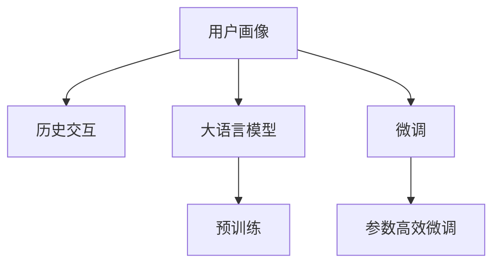

                 

## 1. 背景介绍

### 1.1 问题由来
近年来，用户画像技术在互联网和移动互联网领域得到了广泛应用。用户画像通过对用户行为数据进行建模，能够刻画用户在不同场景下的行为特征，从而为用户提供个性化推荐、精准广告投放、智能客服等高级服务。随着移动互联网的普及和智能设备的增多，用户产生的海量数据成为了用户画像构建的基础。然而，如何高效、准确地从用户行为数据中提取和建模用户特征，仍是用户画像研究中的一个重要问题。

### 1.2 问题核心关键点
用户画像的构建基于用户历史交互数据，通过机器学习等方法对数据进行建模，提炼出用户特征。传统的用户画像模型通常基于统计方法，如K-Means聚类、PCA降维等，这些方法对数据结构要求较高，对于非结构化数据的建模能力较弱。

近年来，深度学习技术在用户画像领域取得了突破性进展，以深度神经网络为代表的模型因其强大的特征提取和泛化能力，得到了广泛应用。特别是大语言模型，如BERT、GPT等，由于其超大规模的预训练数据和参数，能够捕捉到更为丰富的语义信息，在用户画像构建中表现出色。

### 1.3 问题研究意义
大模型在用户画像与历史交互建模中的应用，对提升用户体验、优化推荐系统、增强广告投放效果、提高客服质量等方面具有重要意义：

1. 准确性提升：大模型强大的语义理解能力，能够准确捕捉用户行为中的隐含信息，为用户画像提供更为精细的刻画。
2. 泛化能力增强：大模型通过自监督预训练，能够学习到更通用的用户特征，具有较强的泛化能力，在应对新用户时表现优异。
3. 特征维度丰富：大模型能够提取更丰富的用户行为特征，不仅包括文本信息，还包括图像、音频等多模态数据，为全面理解用户行为提供了更多维度。
4. 实时响应：大模型推理速度快，能够实时响应用户行为变化，及时更新用户画像，适应用户需求变化。
5. 可扩展性强：大模型结构灵活，易于扩展到更多模态数据，支撑更广泛的场景应用。

## 2. 核心概念与联系

### 2.1 核心概念概述

为更好地理解大模型在用户画像与历史交互建模中的应用，本节将介绍几个关键概念：

- 用户画像(User Profile)：通过对用户行为数据的建模，刻画用户在特定场景下的行为特征，从而实现个性化服务。
- 历史交互(Historical Interaction)：用户在使用产品或服务的过程中，与系统交互产生的行为数据，如点击、浏览、搜索等。
- 大语言模型(Large Language Model)：以自回归(如GPT)或自编码(如BERT)模型为代表的大规模预训练语言模型。通过在大规模无标签文本数据上进行预训练，学习通用的语言知识。
- 预训练(Pre-training)：指在大规模无标签文本数据上，通过自监督学习任务训练语言模型的过程。常见的预训练任务包括语言建模、掩码语言模型等。
- 微调(Fine-tuning)：指在预训练模型的基础上，使用下游任务的少量标注数据，通过有监督学习优化模型在下游任务上的性能。

这些核心概念之间的逻辑关系可以通过以下Mermaid流程图来展示：



这个流程图展示了大语言模型在用户画像与历史交互建模中的核心概念及其之间的关系：

1. 大语言模型通过预训练获得基础能力。
2. 微调是对预训练模型进行任务特定的优化，从而适应特定的用户画像任务。
3. 参数高效微调使得在固定大部分预训练参数的情况下，仍可取得不错的微调效果。
4. 历史交互数据作为模型输入，通过微调得到用户画像，实现个性化服务。

## 3. 核心算法原理 & 具体操作步骤
### 3.1 算法原理概述

基于大模型的用户画像与历史交互建模，本质上是一个基于监督学习的微调过程。其核心思想是：将用户历史交互数据作为监督信号，对预训练的大语言模型进行有监督的微调，使得模型能够从用户行为数据中学习到用户特征，从而构建高质量的用户画像。

形式化地，假设用户历史交互数据为 $D=\{(x_i,y_i)\}_{i=1}^N$，其中 $x_i$ 为历史行为数据，$y_i$ 为对应的用户画像标签。定义模型 $M_{\theta}$，其中 $\theta$ 为预训练得到的模型参数。微调的目标是最小化经验风险，即找到新的模型参数 $\hat{\theta}$，使得：

$$
\hat{\theta}=\mathop{\arg\min}_{\theta} \mathcal{L}(M_{\theta},D)
$$

其中 $\mathcal{L}$ 为针对任务设计的损失函数，用于衡量模型预测输出与真实标签之间的差异。常见的损失函数包括交叉熵损失、均方误差损失等。

通过梯度下降等优化算法，微调过程不断更新模型参数 $\theta$，最小化损失函数 $\mathcal{L}$，使得模型输出逼近真实标签。由于 $\theta$ 已经通过预训练获得了较好的初始化，因此即便在少量标注数据上，也能较快收敛到理想的模型参数 $\hat{\theta}$。

### 3.2 算法步骤详解

基于大模型的用户画像与历史交互建模，一般包括以下几个关键步骤：

**Step 1: 准备预训练模型和数据集**
- 选择合适的预训练语言模型 $M_{\theta}$ 作为初始化参数，如 BERT、GPT等。
- 准备用户历史交互数据集 $D$，划分为训练集、验证集和测试集。一般要求标注数据与预训练数据的分布不要差异过大。

**Step 2: 设计任务适配层**
- 根据用户画像任务类型，设计合适的输出层和损失函数。
- 对于分类任务，通常在顶层添加线性分类器，使用交叉熵损失函数。
- 对于回归任务，通常使用均方误差损失函数。

**Step 3: 设置微调超参数**
- 选择合适的优化算法及其参数，如 AdamW、SGD 等，设置学习率、批大小、迭代轮数等。
- 设置正则化技术及强度，包括权重衰减、Dropout、Early Stopping等。
- 确定冻结预训练参数的策略，如仅微调顶层，或全部参数都参与微调。

**Step 4: 执行梯度训练**
- 将训练集数据分批次输入模型，前向传播计算损失函数。
- 反向传播计算参数梯度，根据设定的优化算法和学习率更新模型参数。
- 周期性在验证集上评估模型性能，根据性能指标决定是否触发 Early Stopping。
- 重复上述步骤直到满足预设的迭代轮数或 Early Stopping 条件。

**Step 5: 测试和部署**
- 在测试集上评估微调后模型 $M_{\hat{\theta}}$ 的性能，对比微调前后的精度提升。
- 使用微调后的模型对新用户进行特征预测，集成到实际的应用系统中。
- 持续收集新的用户行为数据，定期重新微调模型，以适应用户需求变化。

以上是基于大模型的用户画像与历史交互建模的一般流程。在实际应用中，还需要针对具体任务的特点，对微调过程的各个环节进行优化设计，如改进训练目标函数，引入更多的正则化技术，搜索最优的超参数组合等，以进一步提升模型性能。

### 3.3 算法优缺点

基于大模型的用户画像与历史交互建模方法具有以下优点：
1. 数据需求低：相比于传统统计方法，大模型在少量标注数据上就能取得不错的效果，降低了数据收集和标注的难度和成本。
2. 特征提取能力强：大模型通过自监督预训练，能够提取更丰富的语义信息，对用户行为进行全面刻画。
3. 泛化能力强：大模型预训练权重固定，微调权重较小，对新用户表现良好，具有较强的泛化能力。
4. 实时性高：大模型推理速度快，能够实时响应用户行为变化，及时更新用户画像。

同时，该方法也存在一定的局限性：
1. 依赖于高质量数据：大模型需要大量高质量的标注数据进行微调，对数据质量的要求较高。
2. 对数据分布敏感：微调模型的效果很大程度上取决于用户数据与预训练数据分布的一致性。
3. 资源消耗高：大模型的计算和存储资源消耗较大，需要进行一定的优化才能在实际部署中发挥作用。
4. 可解释性不足：大模型往往作为"黑盒"使用，其内部工作机制难以解释，用户画像的透明度和可信度较低。

尽管存在这些局限性，但就目前而言，基于大模型的用户画像与历史交互建模方法仍是最主流范式。未来相关研究的重点在于如何进一步降低对标注数据的依赖，提高模型的泛化能力，同时兼顾可解释性和资源优化。

### 3.4 算法应用领域

基于大模型的用户画像与历史交互建模方法，已经在个性化推荐、精准广告投放、智能客服、用户行为分析等多个领域得到了广泛应用：

1. 个性化推荐系统：通过对用户行为数据的建模，预测用户的偏好和需求，提供个性化的推荐服务。
2. 精准广告投放：利用用户画像对广告进行定向投放，提高广告点击率和转化率。
3. 智能客服系统：通过对用户历史交互数据的分析，预测用户需求，提供个性化客服解答。
4. 用户行为分析：分析用户行为数据，挖掘用户兴趣和行为模式，为业务优化提供支持。

除了上述这些经典应用外，大模型在用户画像领域还有更多创新性的应用，如基于用户画像的风险评估、基于用户画像的内容生成等，为用户画像技术带来了新的突破。

## 4. 数学模型和公式 & 详细讲解 & 举例说明

### 4.1 数学模型构建

本节将使用数学语言对基于大模型的用户画像与历史交互建模过程进行更加严格的刻画。

记用户历史交互数据为 $D=\{(x_i,y_i)\}_{i=1}^N$，其中 $x_i \in \mathcal{X}$ 为行为数据，$y_i \in \mathcal{Y}$ 为用户画像标签。假设预训练语言模型为 $M_{\theta}$，其中 $\theta$ 为预训练得到的模型参数。定义模型 $M_{\theta}$ 在数据样本 $(x,y)$ 上的损失函数为 $\ell(M_{\theta}(x),y)$，则在数据集 $D$ 上的经验风险为：

$$
\mathcal{L}(\theta) = \frac{1}{N} \sum_{i=1}^N \ell(M_{\theta}(x_i),y_i)
$$

微调的优化目标是最小化经验风险，即找到最优参数：

$$
\theta^* = \mathop{\arg\min}_{\theta} \mathcal{L}(\theta)
$$

在实践中，我们通常使用基于梯度的优化算法（如SGD、Adam等）来近似求解上述最优化问题。设 $\eta$ 为学习率，$\lambda$ 为正则化系数，则参数的更新公式为：

$$
\theta \leftarrow \theta - \eta \nabla_{\theta}\mathcal{L}(\theta) - \eta\lambda\theta
$$

其中 $\nabla_{\theta}\mathcal{L}(\theta)$ 为损失函数对参数 $\theta$ 的梯度，可通过反向传播算法高效计算。

### 4.2 公式推导过程

以下我们以用户画像分类任务为例，推导交叉熵损失函数及其梯度的计算公式。

假设模型 $M_{\theta}$ 在输入 $x$ 上的输出为 $\hat{y}=M_{\theta}(x) \in [0,1]$，表示样本属于正类的概率。真实标签 $y \in \{0,1\}$。则二分类交叉熵损失函数定义为：

$$
\ell(M_{\theta}(x),y) = -[y\log \hat{y} + (1-y)\log (1-\hat{y})]
$$

将其代入经验风险公式，得：

$$
\mathcal{L}(\theta) = -\frac{1}{N}\sum_{i=1}^N [y_i\log M_{\theta}(x_i)+(1-y_i)\log(1-M_{\theta}(x_i))]
$$

根据链式法则，损失函数对参数 $\theta_k$ 的梯度为：

$$
\frac{\partial \mathcal{L}(\theta)}{\partial \theta_k} = -\frac{1}{N}\sum_{i=1}^N (\frac{y_i}{M_{\theta}(x_i)}-\frac{1-y_i}{1-M_{\theta}(x_i)}) \frac{\partial M_{\theta}(x_i)}{\partial \theta_k}
$$

其中 $\frac{\partial M_{\theta}(x_i)}{\partial \theta_k}$ 可进一步递归展开，利用自动微分技术完成计算。

在得到损失函数的梯度后，即可带入参数更新公式，完成模型的迭代优化。重复上述过程直至收敛，最终得到适应下游任务的最优模型参数 $\theta^*$。

### 4.3 案例分析与讲解

假设我们有一个电商平台，希望通过大模型对用户行为数据进行建模，预测用户的购买意向。具体步骤如下：

**Step 1: 准备数据**
- 收集用户浏览、点击、购买等行为数据，并标记用户的购买意向（如是否购买）。
- 将用户行为数据作为输入，购买意向标记作为输出，构建训练集。

**Step 2: 选择预训练模型**
- 选择适合的多模态预训练模型，如BERT、GPT等，作为用户画像的初始化模型。

**Step 3: 微调超参数设置**
- 选择合适的优化算法及其参数，如AdamW、SGD等，设置学习率、批大小、迭代轮数等。
- 设置正则化技术及强度，包括权重衰减、Dropout、Early Stopping等。
- 确定冻结预训练参数的策略，如仅微调顶层，或全部参数都参与微调。

**Step 4: 模型训练**
- 将训练集数据分批次输入模型，前向传播计算损失函数。
- 反向传播计算参数梯度，根据设定的优化算法和学习率更新模型参数。
- 周期性在验证集上评估模型性能，根据性能指标决定是否触发 Early Stopping。
- 重复上述步骤直到满足预设的迭代轮数或 Early Stopping 条件。

**Step 5: 模型评估与部署**
- 在测试集上评估微调后模型 $M_{\hat{\theta}}$ 的性能，对比微调前后的精度提升。
- 使用微调后的模型对新用户进行购买意向预测，集成到实际的应用系统中。
- 持续收集新的用户行为数据，定期重新微调模型，以适应用户需求变化。

以上步骤展示了基于大模型的用户画像与历史交互建模的完整流程。通过模型的微调，用户画像能够更全面、准确地反映用户的购买意向，从而为电商平台的个性化推荐、精准广告投放等应用提供支持。

## 5. 项目实践：代码实例和详细解释说明
### 5.1 开发环境搭建

在进行用户画像与历史交互建模的实践前，我们需要准备好开发环境。以下是使用Python进行PyTorch开发的环境配置流程：

1. 安装Anaconda：从官网下载并安装Anaconda，用于创建独立的Python环境。

2. 创建并激活虚拟环境：
```bash
conda create -n pytorch-env python=3.8 
conda activate pytorch-env
```

3. 安装PyTorch：根据CUDA版本，从官网获取对应的安装命令。例如：
```bash
conda install pytorch torchvision torchaudio cudatoolkit=11.1 -c pytorch -c conda-forge
```

4. 安装Transformers库：
```bash
pip install transformers
```

5. 安装各类工具包：
```bash
pip install numpy pandas scikit-learn matplotlib tqdm jupyter notebook ipython
```

完成上述步骤后，即可在`pytorch-env`环境中开始用户画像与历史交互建模的实践。

### 5.2 源代码详细实现

下面我们以用户画像分类任务为例，给出使用Transformers库对BERT模型进行微调的PyTorch代码实现。

首先，定义用户画像分类任务的数据处理函数：

```python
from transformers import BertTokenizer
from torch.utils.data import Dataset
import torch

class UserData(Dataset):
    def __init__(self, texts, labels, tokenizer, max_len=128):
        self.texts = texts
        self.labels = labels
        self.tokenizer = tokenizer
        self.max_len = max_len
        
    def __len__(self):
        return len(self.texts)
    
    def __getitem__(self, item):
        text = self.texts[item]
        label = self.labels[item]
        
        encoding = self.tokenizer(text, return_tensors='pt', max_length=self.max_len, padding='max_length', truncation=True)
        input_ids = encoding['input_ids'][0]
        attention_mask = encoding['attention_mask'][0]
        
        # 对label进行编码
        encoded_labels = [label2id[label] for label in label_list] 
        encoded_labels.extend([label2id['O']] * (self.max_len - len(encoded_labels)))
        labels = torch.tensor(encoded_labels, dtype=torch.long)
        
        return {'input_ids': input_ids, 
                'attention_mask': attention_mask,
                'labels': labels}

# 标签与id的映射
label2id = {'O': 0, 'B': 1, 'I': 2}
id2label = {v: k for k, v in label2id.items()}

# 创建dataset
tokenizer = BertTokenizer.from_pretrained('bert-base-cased')

train_dataset = UserData(train_texts, train_labels, tokenizer)
dev_dataset = UserData(dev_texts, dev_labels, tokenizer)
test_dataset = UserData(test_texts, test_labels, tokenizer)
```

然后，定义模型和优化器：

```python
from transformers import BertForTokenClassification, AdamW

model = BertForTokenClassification.from_pretrained('bert-base-cased', num_labels=len(label2id))

optimizer = AdamW(model.parameters(), lr=2e-5)
```

接着，定义训练和评估函数：

```python
from torch.utils.data import DataLoader
from tqdm import tqdm
from sklearn.metrics import classification_report

device = torch.device('cuda') if torch.cuda.is_available() else torch.device('cpu')
model.to(device)

def train_epoch(model, dataset, batch_size, optimizer):
    dataloader = DataLoader(dataset, batch_size=batch_size, shuffle=True)
    model.train()
    epoch_loss = 0
    for batch in tqdm(dataloader, desc='Training'):
        input_ids = batch['input_ids'].to(device)
        attention_mask = batch['attention_mask'].to(device)
        labels = batch['labels'].to(device)
        model.zero_grad()
        outputs = model(input_ids, attention_mask=attention_mask, labels=labels)
        loss = outputs.loss
        epoch_loss += loss.item()
        loss.backward()
        optimizer.step()
    return epoch_loss / len(dataloader)

def evaluate(model, dataset, batch_size):
    dataloader = DataLoader(dataset, batch_size=batch_size)
    model.eval()
    preds, labels = [], []
    with torch.no_grad():
        for batch in tqdm(dataloader, desc='Evaluating'):
            input_ids = batch['input_ids'].to(device)
            attention_mask = batch['attention_mask'].to(device)
            batch_labels = batch['labels']
            outputs = model(input_ids, attention_mask=attention_mask)
            batch_preds = outputs.logits.argmax(dim=2).to('cpu').tolist()
            batch_labels = batch_labels.to('cpu').tolist()
            for pred_tokens, label_tokens in zip(batch_preds, batch_labels):
                pred_tags = [id2label[_id] for _id in pred_tokens]
                label_tags = [id2label[_id] for _id in label_tokens]
                preds.append(pred_tags[:len(label_tags)])
                labels.append(label_tags)
                
    print(classification_report(labels, preds))
```

最后，启动训练流程并在测试集上评估：

```python
epochs = 5
batch_size = 16

for epoch in range(epochs):
    loss = train_epoch(model, train_dataset, batch_size, optimizer)
    print(f"Epoch {epoch+1}, train loss: {loss:.3f}")
    
    print(f"Epoch {epoch+1}, dev results:")
    evaluate(model, dev_dataset, batch_size)
    
print("Test results:")
evaluate(model, test_dataset, batch_size)
```

以上就是使用PyTorch对BERT进行用户画像分类任务微调的完整代码实现。可以看到，得益于Transformers库的强大封装，我们可以用相对简洁的代码完成BERT模型的加载和微调。

### 5.3 代码解读与分析

让我们再详细解读一下关键代码的实现细节：

**UserData类**：
- `__init__`方法：初始化文本、标签、分词器等关键组件。
- `__len__`方法：返回数据集的样本数量。
- `__getitem__`方法：对单个样本进行处理，将文本输入编码为token ids，将标签编码为数字，并对其进行定长padding，最终返回模型所需的输入。

**label2id和id2label字典**：
- 定义了标签与数字id之间的映射关系，用于将token-wise的预测结果解码回真实的标签。

**训练和评估函数**：
- 使用PyTorch的DataLoader对数据集进行批次化加载，供模型训练和推理使用。
- 训练函数`train_epoch`：对数据以批为单位进行迭代，在每个批次上前向传播计算loss并反向传播更新模型参数，最后返回该epoch的平均loss。
- 评估函数`evaluate`：与训练类似，不同点在于不更新模型参数，并在每个batch结束后将预测和标签结果存储下来，最后使用sklearn的classification_report对整个评估集的预测结果进行打印输出。

**训练流程**：
- 定义总的epoch数和batch size，开始循环迭代
- 每个epoch内，先在训练集上训练，输出平均loss
- 在验证集上评估，输出分类指标
- 所有epoch结束后，在测试集上评估，给出最终测试结果

可以看到，PyTorch配合Transformers库使得BERT微调的代码实现变得简洁高效。开发者可以将更多精力放在数据处理、模型改进等高层逻辑上，而不必过多关注底层的实现细节。

当然，工业级的系统实现还需考虑更多因素，如模型的保存和部署、超参数的自动搜索、更灵活的任务适配层等。但核心的微调范式基本与此类似。

## 6. 实际应用场景
### 6.1 电商推荐系统

基于用户画像与历史交互建模，电商推荐系统可以通过分析用户行为数据，预测用户的购买意向，从而提供个性化的商品推荐。通过微调大模型，电商推荐系统能够更准确地理解用户需求，提高推荐效果和用户满意度。

在技术实现上，可以收集用户的浏览、点击、购买等行为数据，并将这些数据输入到大模型中。通过对用户行为进行微调，模型能够学习到用户的兴趣和偏好，并在每次用户访问时，根据其行为历史生成个性化的推荐列表。此外，还可以通过定期更新模型参数，及时捕捉用户需求变化，提高推荐系统的实时性。

### 6.2 广告投放系统

广告投放系统通过对用户画像与历史交互数据的建模，能够实现精准的广告投放，提高广告的点击率和转化率。广告投放系统可以根据用户的购买历史、搜索记录等信息，预测用户对特定广告的兴趣程度，从而进行定向投放。通过微调大模型，广告投放系统能够更准确地识别目标用户，提升广告的投放效果。

在实际应用中，可以将用户的浏览、点击、搜索等行为数据作为输入，广告的点击率、转化率等指标作为输出，构建训练集。通过对大模型进行微调，广告投放系统能够学习到用户对不同广告的兴趣分布，从而实现精准投放。

### 6.3 金融风控系统

金融风控系统通过对用户画像与历史交互数据的建模，能够识别潜在的金融风险，提高风控系统的准确性。金融风控系统可以根据用户的消费记录、信用历史等信息，预测用户是否存在欺诈行为或违约风险，从而进行风险控制。通过微调大模型，金融风控系统能够更全面地识别用户行为特征，提高风险识别的准确性。

在实际应用中，可以将用户的交易记录、信用评分等信息作为输入，风控系统的判别结果（如是否存在风险）作为输出，构建训练集。通过对大模型进行微调，金融风控系统能够学习到用户行为特征与风险之间的关系，从而提高风险识别的准确性。

### 6.4 未来应用展望

随着大模型和微调方法的不断发展，基于用户画像与历史交互建模的应用场景也将不断扩展，为更多行业带来变革性影响。

在智慧医疗领域，通过微调大模型，医疗推荐系统能够根据患者的健康记录、病史等信息，推荐适合的诊疗方案，提高医疗服务的精准性。

在智能教育领域，通过微调大模型，个性化推荐系统能够根据学生的学习行为数据，推荐适合的课程、资源，提高学习效果。

在智慧城市治理中，通过微调大模型，智能监控系统能够根据市民的出行记录、社交行为等信息，识别潜在的社会风险，提高城市管理的智能化水平。

此外，在企业生产、社会治理、文娱传媒等众多领域，基于用户画像与历史交互建模的人工智能应用也将不断涌现，为经济社会发展注入新的动力。相信随着技术的日益成熟，微调方法将成为人工智能落地应用的重要范式，推动人工智能技术在垂直行业的规模化落地。总之，用户画像与历史交互建模技术将成为AI技术落地应用的重要方向，为各行各业带来更加智能化的解决方案。

## 7. 工具和资源推荐
### 7.1 学习资源推荐

为了帮助开发者系统掌握用户画像与历史交互建模的理论基础和实践技巧，这里推荐一些优质的学习资源：

1. 《Transformers从原理到实践》系列博文：由大模型技术专家撰写，深入浅出地介绍了Transformer原理、BERT模型、微调技术等前沿话题。

2. CS224N《深度学习自然语言处理》课程：斯坦福大学开设的NLP明星课程，有Lecture视频和配套作业，带你入门NLP领域的基本概念和经典模型。

3. 《Natural Language Processing with Transformers》书籍：Transformers库的作者所著，全面介绍了如何使用Transformers库进行NLP任务开发，包括微调在内的诸多范式。

4. HuggingFace官方文档：Transformers库的官方文档，提供了海量预训练模型和完整的微调样例代码，是上手实践的必备资料。

5. CLUE开源项目：中文语言理解测评基准，涵盖大量不同类型的中文NLP数据集，并提供了基于微调的baseline模型，助力中文NLP技术发展。

通过对这些资源的学习实践，相信你一定能够快速掌握大模型在用户画像与历史交互建模的精髓，并用于解决实际的NLP问题。
###  7.2 开发工具推荐

高效的开发离不开优秀的工具支持。以下是几款用于大模型微调开发的常用工具：

1. PyTorch：基于Python的开源深度学习框架，灵活动态的计算图，适合快速迭代研究。大部分预训练语言模型都有PyTorch版本的实现。

2. TensorFlow：由Google主导开发的开源深度学习框架，生产部署方便，适合大规模工程应用。同样有丰富的预训练语言模型资源。

3. Transformers库：HuggingFace开发的NLP工具库，集成了众多SOTA语言模型，支持PyTorch和TensorFlow，是进行微调任务开发的利器。

4. Weights & Biases：模型训练的实验跟踪工具，可以记录和可视化模型训练过程中的各项指标，方便对比和调优。与主流深度学习框架无缝集成。

5. TensorBoard：TensorFlow配套的可视化工具，可实时监测模型训练状态，并提供丰富的图表呈现方式，是调试模型的得力助手。

6. Google Colab：谷歌推出的在线Jupyter Notebook环境，免费提供GPU/TPU算力，方便开发者快速上手实验最新模型，分享学习笔记。

合理利用这些工具，可以显著提升大模型微调任务的开发效率，加快创新迭代的步伐。

### 7.3 相关论文推荐

大模型和微调技术的发展源于学界的持续研究。以下是几篇奠基性的相关论文，推荐阅读：

1. Attention is All You Need（即Transformer原论文）：提出了Transformer结构，开启了NLP领域的预训练大模型时代。

2. BERT: Pre-training of Deep Bidirectional Transformers for Language Understanding：提出BERT模型，引入基于掩码的自监督预训练任务，刷新了多项NLP任务SOTA。

3. Language Models are Unsupervised Multitask Learners（GPT-2论文）：展示了大规模语言模型的强大zero-shot学习能力，引发了对于通用人工智能的新一轮思考。

4. Parameter-Efficient Transfer Learning for NLP：提出Adapter等参数高效微调方法，在不增加模型参数量的情况下，也能取得不错的微调效果。

5. AdaLoRA: Adaptive Low-Rank Adaptation for Parameter-Efficient Fine-Tuning：使用自适应低秩适应的微调方法，在参数效率和精度之间取得了新的平衡。

6. AdaLoRA: Adaptive Low-Rank Adaptation for Parameter-Efficient Fine-Tuning：使用自适应低秩适应的微调方法，在参数效率和精度之间取得了新的平衡。

这些论文代表了大模型微调技术的发展脉络。通过学习这些前沿成果，可以帮助研究者把握学科前进方向，激发更多的创新灵感。

## 8. 总结：未来发展趋势与挑战

### 8.1 总结

本文对基于大模型的用户画像与历史交互建模方法进行了全面系统的介绍。首先阐述了用户画像构建的背景和意义，明确了微调在提升推荐系统性能、实现精准广告投放等方面的重要作用。其次，从原理到实践，详细讲解了基于大模型的微调过程，给出了微调任务开发的完整代码实例。同时，本文还探讨了大模型在多个实际场景中的应用前景，展示了微调范式的广泛价值。

通过本文的系统梳理，可以看到，基于大模型的用户画像与历史交互建模技术正在成为NLP领域的重要范式，极大地提升了推荐系统、广告投放、风控系统等应用的智能化水平，为用户提供了更加个性化的服务。未来，伴随大模型和微调方法的持续演进，基于用户画像与历史交互建模的应用也将不断拓展，为更多行业带来变革性影响。

### 8.2 未来发展趋势

展望未来，基于大模型的用户画像与历史交互建模技术将呈现以下几个发展趋势：

1. 数据需求降低：随着自监督学习、主动学习等技术的发展，未来微调方法对标注数据的需求将进一步降低，使得大模型微调技术更易于应用到实际场景中。

2. 多模态数据融合：大模型的预训练数据将不仅包含文本信息，还将融合图像、音频等多模态数据，提升对用户行为的全面理解。

3. 少样本学习能力增强：未来微调方法将更加关注少样本学习能力的提升，使得大模型在数据稀缺的情况下也能取得理想的效果。

4. 模型结构优化：通过优化模型结构，减少前向传播和反向传播的资源消耗，实现更加轻量级、实时性的部署。

5. 伦理安全性提升：随着模型应用的普及，如何确保用户隐私、避免模型偏见、提高系统透明性将是重要的研究方向。

6. 跨领域迁移能力增强：未来微调模型将具备更强的跨领域迁移能力，能够应对不同场景下的用户画像需求。

这些趋势凸显了基于大模型的用户画像与历史交互建模技术的广阔前景。这些方向的探索发展，必将进一步提升用户画像与历史交互建模的效果和应用范围，为更多行业带来变革性影响。

### 8.3 面临的挑战

尽管基于大模型的用户画像与历史交互建模技术已经取得了显著进展，但在迈向更加智能化、普适化应用的过程中，它仍面临诸多挑战：

1. 数据隐私保护：大模型需要大量的用户行为数据进行训练，如何保护用户隐私，避免数据泄露，将是一个重要问题。

2. 模型偏见：大模型可能学习到数据中的偏见信息，对特定群体产生歧视性影响，如何消除模型偏见，提高公平性，仍需进一步研究。

3. 计算资源消耗：大模型在推理和训练时资源消耗较大，如何提高模型效率，降低计算成本，是未来需要解决的问题。

4. 跨领域泛化能力：不同领域的用户画像需求差异较大，如何构建跨领域的通用模型，提高模型的泛化能力，将是一个重要挑战。

5. 模型解释性不足：大模型往往作为"黑盒"使用，其内部工作机制难以解释，用户画像的可解释性较低，影响系统的透明度和可信度。

6. 多模态数据整合：不同模态的数据格式和特征差异较大，如何有效地整合这些数据，进行统一建模，也是未来需要解决的问题。

这些挑战需要学界和产业界的共同努力，才能推动大模型在用户画像与历史交互建模领域的应用。相信随着研究的深入和技术的发展，这些挑战终将逐步被克服，大模型将发挥更加重要的作用，为用户画像与历史交互建模带来新的突破。

### 8.4 研究展望

面向未来，基于大模型的用户画像与历史交互建模技术需要在以下几个方面寻求新的突破：

1. 探索更多无监督和半监督微调方法。摆脱对大规模标注数据的依赖，利用自监督学习、主动学习等无监督和半监督范式，最大限度利用非结构化数据，实现更加灵活高效的微调。

2. 研究参数高效和计算高效的微调范式。开发更加参数高效的微调方法，在固定大部分预训练参数的同时，只更新极少量的任务相关参数。同时优化微调模型的计算图，减少前向传播和反向传播的资源消耗，实现更加轻量级、实时性的部署。

3. 融合因果和对比学习范式。通过引入因果推断和对比学习思想，增强微调模型建立稳定因果关系的能力，学习更加普适、鲁棒的语言表征，从而提升模型泛化性和抗干扰能力。

4. 引入更多先验知识。将符号化的先验知识，如知识图谱、逻辑规则等，与神经网络模型进行巧妙融合，引导微调过程学习更准确、合理的语言模型。同时加强不同模态数据的整合，实现视觉、语音等多模态信息与文本信息的协同建模。

5. 结合因果分析和博弈论工具。将因果分析方法引入微调模型，识别出模型决策的关键特征，增强输出解释的因果性和逻辑性。借助博弈论工具刻画人机交互过程，主动探索并规避模型的脆弱点，提高系统稳定性。

6. 纳入伦理道德约束。在模型训练目标中引入伦理导向的评估指标，过滤和惩罚有偏见、有害的输出倾向。同时加强人工干预和审核，建立模型行为的监管机制，确保输出符合人类价值观和伦理道德。

这些研究方向将推动大模型在用户画像与历史交互建模领域的应用走向成熟，为构建安全、可靠、可解释、可控的智能系统铺平道路。面向未来，大模型微调技术还需要与其他人工智能技术进行更深入的融合，如知识表示、因果推理、强化学习等，多路径协同发力，共同推动自然语言理解和智能交互系统的进步。只有勇于创新、敢于突破，才能不断拓展语言模型的边界，让智能技术更好地造福人类社会。

## 9. 附录：常见问题与解答

**Q1：用户画像与历史交互建模是否适用于所有NLP任务？**

A: 用户画像与历史交互建模方法适用于大多数NLP任务，特别是对于需要捕捉用户行为特征的任务，如推荐系统、广告投放、风控系统等。但对于一些特定领域的任务，如医学、法律等，仅仅依靠通用语料预训练的模型可能难以很好地适应。此时需要在特定领域语料上进一步预训练，再进行微调，才能获得理想效果。此外，对于一些需要时效性、个性化很强的任务，如对话、推荐等，微调方法也需要针对性的改进优化。

**Q2：大模型在用户画像与历史交互建模中面临哪些挑战？**

A: 大模型在用户画像与历史交互建模中面临以下挑战：

1. 数据隐私保护：大模型需要大量的用户行为数据进行训练，如何保护用户隐私，避免数据泄露，将是一个重要问题。

2. 模型偏见：大模型可能学习到数据中的偏见信息，对特定群体产生歧视性影响，如何消除模型偏见，提高公平性，仍需进一步研究。

3. 计算资源消耗：大模型在推理和训练时资源消耗较大，如何提高模型效率，降低计算成本，是未来需要解决的问题。

4. 跨领域泛化能力：不同领域的用户画像需求差异较大，如何构建跨领域的通用模型，提高模型的泛化能力，将是一个重要挑战。

5. 模型解释性不足：大模型往往作为"黑盒"使用，其内部工作机制难以解释，用户画像的可解释性较低，影响系统的透明度和可信度。

6. 多模态数据整合：不同模态的数据格式和特征差异较大，如何有效地整合这些数据，进行统一建模，也是未来需要解决的问题。

这些挑战需要学界和产业界的共同努力，才能推动大模型在用户画像与历史交互建模领域的应用。

**Q3：如何提高大模型的泛化能力和鲁棒性？**

A: 提高大模型的泛化能力和鲁棒性，可以采用以下方法：

1. 数据增强：通过回译、近义替换等方式扩充训练集，增加数据多样性。

2. 对抗训练：引入对抗样本，提高模型鲁棒性，减少过拟合风险。

3. 正则化技术：使用L2正则、Dropout等技术，防止模型过度适应训练集。

4. 多模型集成：训练多个微调模型，取平均输出，抑制过拟合，提升泛化能力。

5. 参数高效微调：采用如Adapter、Prefix等方法，只更新极少量的任务相关参数，提高泛化能力。

6. 少样本学习：通过精心设计的提示模板，在少量标注样本上也能取得理想的微调效果，提高泛化能力。

这些方法可以结合使用，根据具体任务需求进行优化，以提高大模型的泛化能力和鲁棒性。

**Q4：如何提升大模型在少样本学习中的表现？**

A: 提升大模型在少样本学习中的表现，可以采用以下方法：

1. 少样本学习：通过精心设计的提示模板，在少量标注样本上也能取得理想的微调效果，提高少样本学习效果。

2. 迁移学习：利用预训练模型的泛化能力，在少样本学习场景中提取更有效的特征表示，提高模型性能。

3. 知识蒸馏：利用预训练模型的知识，对少样本学习模型进行蒸馏，提高其泛化能力和鲁棒性。

4. 对抗训练：引入对抗样本，增强模型对少样本学习样本的适应能力，提高鲁棒性。

5. 多模态融合：将文本、图像、音频等多模态信息融合，提高模型对用户行为的全面理解，提升少样本学习效果。

这些方法可以结合使用，根据具体任务需求进行优化，以提升大模型在少样本学习中的表现。

**Q5：大模型在用户画像与历史交互建模中如何进行多模态数据融合？**

A: 大模型在用户画像与历史交互建模中进行多模态数据融合，可以采用以下方法：

1. 特征提取：对不同模态的数据进行特征提取，得到统一的特征表示。

2. 拼接融合：将不同模态的特征拼接在一起，输入到模型中进行联合建模。

3. 多模态自监督学习：通过自监督学习任务，学习不同模态数据之间的关系，提高模型泛化能力。

4. 数据增强：对不同模态的数据进行数据增强，增加数据多样性，提高模型鲁棒性。

5. 联合优化：在多模态数据上联合训练模型，优化不同模态数据之间的权重，提升模型性能。

这些方法可以结合使用，根据具体任务需求进行优化，以实现大模型在用户画像与历史交互建模中的多模态数据融合。

---

作者：禅与计算机程序设计艺术 / Zen and the Art of Computer Programming

