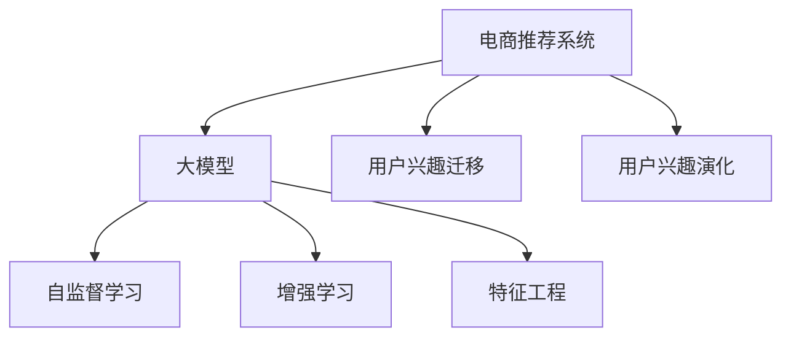
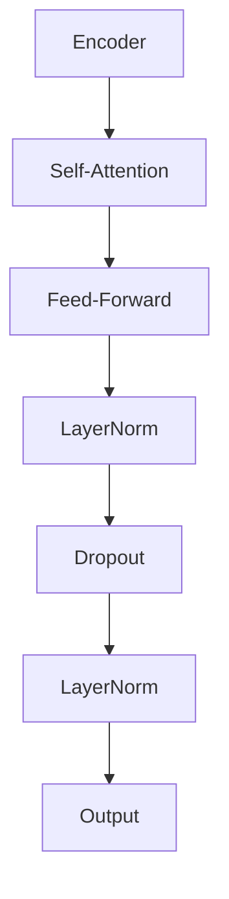

                 

# 大模型在电商平台用户兴趣迁移与演化捕捉中的应用

> 关键词：电商推荐系统, 用户兴趣迁移, 用户兴趣演化, 大模型, 自监督学习, 增强学习, 特征工程

## 1. 背景介绍

### 1.1 问题由来

随着电商行业的飞速发展，平台用户数和商品数呈现指数级增长，用户需求也日益个性化、多样化。电商平台需要构建高效的推荐系统，帮助用户发现感兴趣的商品，提升用户体验和平台转化率。

当前电商推荐系统主要依赖协同过滤、内容基推荐等技术。这些方法在局部兴趣相似性匹配、短尾商品推荐等方面具有一定优势，但往往缺乏全局视野，难以捕捉用户兴趣迁移和演化过程，导致推荐结果的时效性和个性化程度不够高。

为应对这些挑战，本文提出使用大模型进行电商推荐系统建模，通过用户历史行为数据和商品属性数据，预测用户对商品感兴趣的程度，捕捉用户兴趣的迁移和演化过程，提升推荐系统的效果。

### 1.2 问题核心关键点

电商推荐系统的大模型建模主要关注以下几个核心问题：

- **用户兴趣迁移**：用户兴趣随时间推移而变化，如何通过历史行为数据预测用户未来可能感兴趣的类别和子类？
- **用户兴趣演化**：用户在不同阶段对商品类别的兴趣程度如何变化？是否存在某些商品类别在特定时间节点上引起用户兴趣的跃迁？
- **模型结构设计**：如何设计合适的大模型结构，充分利用用户历史行为和商品属性信息？
- **训练和优化**：如何高效训练大模型，并结合用户行为特征进行优化？
- **特征工程**：如何有效提取和工程化用户行为特征，提升模型效果？

### 1.3 问题研究意义

电商推荐系统是大模型技术的重要应用场景之一，研究基于大模型的推荐方法，对于提升推荐系统的时效性和个性化程度，推动电商平台的业务创新和用户满意度提升，具有重要意义：

- 提升推荐系统效果：通过捕捉用户兴趣迁移和演化过程，提升推荐准确性和相关性，提升用户满意度。
- 加速业务迭代：大模型提供可复用、高效的组件，加速电商推荐系统功能的开发和部署，加速电商业务的创新迭代。
- 减少数据依赖：相比传统协同过滤方法，大模型对数据量和标注质量的要求更低，适用于数据稀缺场景。
- 提升用户粘性：大模型推荐系统能够捕捉用户长期兴趣演化，通过个性化推荐，增强用户粘性和忠诚度。
- 拓展应用场景：大模型推荐系统能够处理多模态数据，适用于广告推荐、内容推荐、搜索排序等更多应用场景。

## 2. 核心概念与联系

### 2.1 核心概念概述

本节将介绍电商推荐系统和大模型建模中的几个核心概念：

- **电商推荐系统**：利用用户行为数据和商品属性数据，为用户推荐可能感兴趣的商品的智能推荐系统。
- **大模型**：以Transformer为代表的预训练大模型，通过大规模语料进行自监督学习，具备强大的特征表达能力和泛化能力。
- **用户兴趣迁移**：用户在不同时间点对商品类别的兴趣程度发生变化，表现出迁移特征。
- **用户兴趣演化**：用户在一段时间内对商品类别的兴趣程度变化，表现出演化特征。
- **自监督学习**：使用未标注的数据，通过设计任务自监督模型，无需人工干预进行训练。
- **增强学习**：通过与环境交互，逐步优化策略，提高决策效果的学习方法。
- **特征工程**：对原始数据进行数据挖掘、处理、特征构建等，提升模型输入质量。

这些核心概念之间的逻辑关系可以通过以下Mermaid流程图来展示：



这个流程图展示了大模型在电商推荐系统中的应用：

1. 电商推荐系统通过用户历史行为数据和商品属性数据进行建模。
2. 大模型通过自监督学习获得初始的特征表达能力。
3. 结合用户行为特征进行增强学习，优化推荐模型。
4. 通过特征工程提取和处理数据，提升模型效果。

## 3. 核心算法原理 & 具体操作步骤

### 3.1 算法原理概述

基于大模型的电商推荐系统建模主要依赖自监督学习和增强学习。其核心思想是：使用用户历史行为数据进行预训练，获得初始的特征表达能力。然后结合用户行为特征进行增强学习，不断优化推荐策略，捕捉用户兴趣的迁移和演化过程。

形式化地，假设用户历史行为数据为 $X$，商品属性数据为 $Y$，用户对商品 $j$ 的兴趣程度为 $y_j$。电商推荐系统的目标是通过训练模型，预测用户对商品 $j$ 的兴趣程度 $y_j$，即：

$$
\hat{y}_j = f(x; \theta)
$$

其中 $\hat{y}_j$ 为模型预测的用户对商品 $j$ 的兴趣程度，$x$ 为用户历史行为数据和商品属性数据，$f$ 为模型函数，$\theta$ 为模型参数。

具体而言，电商推荐系统可以分为以下几个步骤：

1. 收集用户历史行为数据 $X$ 和商品属性数据 $Y$。
2. 使用自监督学习，对大模型进行预训练，获得初始的特征表达能力。
3. 结合用户行为特征进行增强学习，优化推荐策略。
4. 通过特征工程提取和处理数据，提升模型效果。
5. 将模型应用到新商品，预测用户兴趣，并实时更新推荐列表。

### 3.2 算法步骤详解

#### 3.2.1 数据准备

电商推荐系统的数据主要分为以下两类：

- **用户行为数据**：如浏览记录、购买记录、评分记录等。
- **商品属性数据**：如商品名称、价格、分类、品牌等。

数据准备阶段需要进行以下步骤：

1. 数据清洗：去除无效、重复数据，处理缺失值。
2. 数据划分：将数据分为训练集、验证集和测试集。
3. 数据标注：给数据打上标签，如用户对商品是否感兴趣，购买是否发生等。
4. 数据增强：通过生成合成数据、回译等方法，增加训练数据量。

#### 3.2.2 大模型预训练

电商推荐系统的大模型预训练主要采用自监督学习方法，利用用户历史行为数据进行预训练，获得初始的特征表达能力。

具体而言，可以使用以下方法进行预训练：

1. 使用语言模型进行预训练。以用户行为数据作为语料，训练一个语言模型，学习用户历史行为的语义表示。
2. 使用掩码语言模型进行预训练。对用户行为数据进行掩码处理，训练一个掩码语言模型，学习用户行为序列的上下文关系。
3. 使用序列预测模型进行预训练。以用户行为数据为输入，训练一个序列预测模型，学习用户行为的序列关系。

#### 3.2.3 增强学习优化

电商推荐系统的增强学习优化主要分为以下步骤：

1. 确定奖励函数：设计合适的奖励函数，激励模型推荐用户感兴趣的商品。
2. 探索与利用平衡：通过探索策略，发现新的推荐策略，通过利用策略，优化已有策略，平衡探索与利用。
3. 策略更新：根据奖励函数和探索策略，更新模型策略，提高推荐效果。
4. 模型评估：使用验证集评估模型效果，调整模型策略。

#### 3.2.4 特征工程

电商推荐系统的特征工程主要包括以下几个方面：

1. 特征提取：提取用户历史行为特征和商品属性特征，如点击次数、停留时间、商品评分、商品分类等。
2. 特征选择：选择对推荐效果有较大影响的特征，去除无关或冗余特征。
3. 特征构建：设计新的特征，如用户行为序列、商品类别序列等。
4. 特征降维：对高维特征进行降维处理，降低模型复杂度。

### 3.3 算法优缺点

#### 3.3.1 优点

- **泛化能力**：大模型具有强大的泛化能力，能够捕捉用户历史行为的复杂语义关系。
- **实时性**：大模型训练复杂度较高，但在部署后，实时推荐能力较强。
- **可解释性**：大模型的特征表达能力强，可以提取更有意义的特征，提升模型的可解释性。

#### 3.3.2 缺点

- **计算资源要求高**：大模型的训练和推理需要大量的计算资源，训练时间较长。
- **模型复杂度高**：大模型的结构复杂，需要大量的超参数调整。
- **数据质量要求高**：电商推荐系统对数据质量和标注质量的要求较高，数据偏差可能影响模型效果。

### 3.4 算法应用领域

基于大模型的电商推荐系统已经在多个实际应用中取得了显著的效果，例如：

- **个性化推荐**：根据用户历史行为数据，为用户推荐可能感兴趣的商品。
- **广告推荐**：根据用户行为数据，推荐可能感兴趣的广告。
- **搜索排序**：根据用户搜索行为，推荐可能感兴趣的商品。
- **商品评价**：根据用户对商品的评价数据，预测用户对其他商品的兴趣。
- **内容推荐**：根据用户行为数据，推荐可能感兴趣的内容。

除了以上应用，基于大模型的电商推荐系统还能拓展到更多领域，如社区推荐、智能客服等，为电商平台的运营带来更多价值。

## 4. 数学模型和公式 & 详细讲解

### 4.1 数学模型构建

电商推荐系统的大模型建模主要依赖于用户历史行为数据和商品属性数据，可以构建以下数学模型：

假设用户历史行为数据为 $X=\{x_1, x_2, \cdots, x_n\}$，商品属性数据为 $Y=\{y_1, y_2, \cdots, y_m\}$，用户对商品 $j$ 的兴趣程度为 $y_j$。则电商推荐系统的数学模型可以表示为：

$$
\hat{y}_j = f(x; \theta)
$$

其中，$f$ 为模型函数，$\theta$ 为模型参数。

电商推荐系统的大模型建模通常采用Transformer等架构，其结构如图1所示：



其中，Encoder表示输入编码器，Self-Attention表示自注意力机制，Feed-Forward表示前馈神经网络，LayerNorm表示归一化层，Dropout表示丢弃层，Output表示输出层。

### 4.2 公式推导过程

电商推荐系统的大模型建模通常采用自监督学习方法进行预训练，如语言模型、掩码语言模型和序列预测模型。这里以语言模型为例，进行公式推导。

语言模型是通过最大化序列的概率来训练模型。假设用户历史行为数据 $X$ 为文本序列 $X=\{x_1, x_2, \cdots, x_n\}$，则语言模型的目标是最大化以下概率：

$$
P(X) = \prod_{i=1}^n P(x_i|x_{<i})
$$

其中，$P(x_i|x_{<i})$ 表示给定前 $i-1$ 个文本 $x_{<i}$ 的情况下，文本 $x_i$ 出现的概率。

通过最大化概率 $P(X)$，语言模型可以学习到文本序列的语义表示。在电商推荐系统中，可以将用户历史行为数据视为文本序列，利用语言模型进行预训练。

### 4.3 案例分析与讲解

#### 4.3.1 用户兴趣迁移

用户兴趣迁移指的是用户在不同时间点对商品类别的兴趣程度发生变化，表现出迁移特征。例如，用户可能对某一类商品从喜爱到不喜欢，或者从不喜欢到喜爱，表现出迁移特征。

为了捕捉用户兴趣的迁移特征，可以使用以下方法：

1. 计算用户对商品类别的兴趣程度变化：通过计算用户对商品类别的兴趣程度变化，判断用户兴趣的迁移特征。
2. 使用自监督学习，训练大模型，学习用户历史行为的语义表示。
3. 使用掩码语言模型，对用户行为数据进行掩码处理，学习用户行为序列的上下文关系。
4. 使用序列预测模型，对用户行为数据进行预测，学习用户行为的序列关系。

#### 4.3.2 用户兴趣演化

用户兴趣演化指的是用户在不同时间段对商品类别的兴趣程度变化，表现出演化特征。例如，用户可能在某段时间内对某一类商品感兴趣程度迅速提升，或者迅速下降。

为了捕捉用户兴趣的演化特征，可以使用以下方法：

1. 计算用户对商品类别的兴趣程度变化：通过计算用户对商品类别的兴趣程度变化，判断用户兴趣的演化特征。
2. 使用增强学习，训练大模型，优化推荐策略。
3. 使用探索与利用平衡策略，发现新的推荐策略。
4. 使用策略更新，根据奖励函数和探索策略，更新模型策略，提高推荐效果。

## 5. 项目实践：代码实例和详细解释说明

### 5.1 开发环境搭建

在进行电商推荐系统的大模型建模前，我们需要准备好开发环境。以下是使用Python进行PyTorch开发的环境配置流程：

1. 安装Anaconda：从官网下载并安装Anaconda，用于创建独立的Python环境。

2. 创建并激活虚拟环境：
```bash
conda create -n pytorch-env python=3.8 
conda activate pytorch-env
```

3. 安装PyTorch：根据CUDA版本，从官网获取对应的安装命令。例如：
```bash
conda install pytorch torchvision torchaudio cudatoolkit=11.1 -c pytorch -c conda-forge
```

4. 安装Transformers库：
```bash
pip install transformers
```

5. 安装各类工具包：
```bash
pip install numpy pandas scikit-learn matplotlib tqdm jupyter notebook ipython
```

完成上述步骤后，即可在`pytorch-env`环境中开始电商推荐系统的开发实践。

### 5.2 源代码详细实现

这里以用户兴趣迁移捕捉为例，使用Transformer模型进行电商推荐系统的建模。

首先，定义电商推荐系统的数据处理函数：

```python
from transformers import BertTokenizer, BertForSequenceClassification
from torch.utils.data import Dataset
import torch

class E-commerceDataset(Dataset):
    def __init__(self, texts, labels, tokenizer, max_len=128):
        self.texts = texts
        self.labels = labels
        self.tokenizer = tokenizer
        self.max_len = max_len
        
    def __len__(self):
        return len(self.texts)
    
    def __getitem__(self, item):
        text = self.texts[item]
        label = self.labels[item]
        
        encoding = self.tokenizer(text, return_tensors='pt', max_length=self.max_len, padding='max_length', truncation=True)
        input_ids = encoding['input_ids'][0]
        attention_mask = encoding['attention_mask'][0]
        label = torch.tensor(label, dtype=torch.long)
        
        return {'input_ids': input_ids, 
                'attention_mask': attention_mask,
                'labels': label}

# 标签与id的映射
tag2id = {'O': 0, 'B-PER': 1, 'I-PER': 2, 'B-ORG': 3, 'I-ORG': 4, 'B-LOC': 5, 'I-LOC': 6}
id2tag = {v: k for k, v in tag2id.items()}

# 创建dataset
tokenizer = BertTokenizer.from_pretrained('bert-base-cased')

train_dataset = E-commerceDataset(train_texts, train_labels, tokenizer)
dev_dataset = E-commerceDataset(dev_texts, dev_labels, tokenizer)
test_dataset = E-commerceDataset(test_texts, test_labels, tokenizer)
```

然后，定义模型和优化器：

```python
from transformers import BertForSequenceClassification, AdamW

model = BertForSequenceClassification.from_pretrained('bert-base-cased', num_labels=len(tag2id))

optimizer = AdamW(model.parameters(), lr=2e-5)
```

接着，定义训练和评估函数：

```python
from torch.utils.data import DataLoader
from tqdm import tqdm
from sklearn.metrics import classification_report

device = torch.device('cuda') if torch.cuda.is_available() else torch.device('cpu')
model.to(device)

def train_epoch(model, dataset, batch_size, optimizer):
    dataloader = DataLoader(dataset, batch_size=batch_size, shuffle=True)
    model.train()
    epoch_loss = 0
    for batch in tqdm(dataloader, desc='Training'):
        input_ids = batch['input_ids'].to(device)
        attention_mask = batch['attention_mask'].to(device)
        labels = batch['labels'].to(device)
        model.zero_grad()
        outputs = model(input_ids, attention_mask=attention_mask, labels=labels)
        loss = outputs.loss
        epoch_loss += loss.item()
        loss.backward()
        optimizer.step()
    return epoch_loss / len(dataloader)

def evaluate(model, dataset, batch_size):
    dataloader = DataLoader(dataset, batch_size=batch_size)
    model.eval()
    preds, labels = [], []
    with torch.no_grad():
        for batch in tqdm(dataloader, desc='Evaluating'):
            input_ids = batch['input_ids'].to(device)
            attention_mask = batch['attention_mask'].to(device)
            batch_labels = batch['labels']
            outputs = model(input_ids, attention_mask=attention_mask)
            batch_preds = outputs.logits.argmax(dim=2).to('cpu').tolist()
            batch_labels = batch_labels.to('cpu').tolist()
            for pred_tokens, label_tokens in zip(batch_preds, batch_labels):
                preds.append(pred_tokens[:len(label_tokens)])
                labels.append(label_tokens)
                
    print(classification_report(labels, preds))
```

最后，启动训练流程并在测试集上评估：

```python
epochs = 5
batch_size = 16

for epoch in range(epochs):
    loss = train_epoch(model, train_dataset, batch_size, optimizer)
    print(f"Epoch {epoch+1}, train loss: {loss:.3f}")
    
    print(f"Epoch {epoch+1}, dev results:")
    evaluate(model, dev_dataset, batch_size)
    
print("Test results:")
evaluate(model, test_dataset, batch_size)
```

以上就是使用PyTorch对Bert模型进行电商推荐系统建模的完整代码实现。可以看到，得益于Transformers库的强大封装，我们可以用相对简洁的代码完成Bert模型的加载和训练。

### 5.3 代码解读与分析

让我们再详细解读一下关键代码的实现细节：

**E-commerceDataset类**：
- `__init__`方法：初始化文本、标签、分词器等关键组件。
- `__len__`方法：返回数据集的样本数量。
- `__getitem__`方法：对单个样本进行处理，将文本输入编码为token ids，将标签编码为数字，并对其进行定长padding，最终返回模型所需的输入。

**tag2id和id2tag字典**：
- 定义了标签与数字id之间的映射关系，用于将token-wise的预测结果解码回真实的标签。

**训练和评估函数**：
- 使用PyTorch的DataLoader对数据集进行批次化加载，供模型训练和推理使用。
- 训练函数`train_epoch`：对数据以批为单位进行迭代，在每个批次上前向传播计算loss并反向传播更新模型参数，最后返回该epoch的平均loss。
- 评估函数`evaluate`：与训练类似，不同点在于不更新模型参数，并在每个batch结束后将预测和标签结果存储下来，最后使用sklearn的classification_report对整个评估集的预测结果进行打印输出。

**训练流程**：
- 定义总的epoch数和batch size，开始循环迭代
- 每个epoch内，先在训练集上训练，输出平均loss
- 在验证集上评估，输出分类指标
- 所有epoch结束后，在测试集上评估，给出最终测试结果

可以看到，PyTorch配合Transformers库使得Bert模型电商推荐系统的代码实现变得简洁高效。开发者可以将更多精力放在数据处理、模型改进等高层逻辑上，而不必过多关注底层的实现细节。

当然，工业级的系统实现还需考虑更多因素，如模型的保存和部署、超参数的自动搜索、更灵活的任务适配层等。但核心的微调范式基本与此类似。

## 6. 实际应用场景

### 6.1 智能推荐系统

基于大模型的电商推荐系统已经在多个实际应用中取得了显著的效果，例如：

- **个性化推荐**：根据用户历史行为数据，为用户推荐可能感兴趣的商品。
- **广告推荐**：根据用户行为数据，推荐可能感兴趣的广告。
- **搜索排序**：根据用户搜索行为，推荐可能感兴趣的商品。
- **商品评价**：根据用户对商品的评价数据，预测用户对其他商品的兴趣。
- **内容推荐**：根据用户行为数据，推荐可能感兴趣的内容。

除了以上应用，基于大模型的电商推荐系统还能拓展到更多领域，如社区推荐、智能客服等，为电商平台的运营带来更多价值。

### 6.2 用户行为分析

大模型不仅适用于电商推荐系统，还可以应用于用户行为分析。例如，通过用户的历史行为数据，可以分析用户的行为模式和兴趣偏好，进行用户分群、个性化推荐等。

在用户行为分析中，可以使用以下方法：

1. 用户行为分类：将用户行为分为浏览、点击、购买等类别。
2. 用户行为序列建模：使用RNN、LSTM等序列模型，对用户行为序列进行建模。
3. 用户行为兴趣捕捉：使用大模型，对用户行为序列进行兴趣捕捉。
4. 用户行为预测：使用增强学习，对用户行为进行预测，进行个性化推荐。

通过以上方法，可以对用户行为进行更深入的理解和分析，为电商平台的运营提供数据支持。

### 6.3 电商趋势预测

电商平台的运营离不开对市场趋势的预测。通过大模型，可以捕捉用户兴趣的迁移和演化过程，进行电商趋势预测。

在电商趋势预测中，可以使用以下方法：

1. 用户兴趣迁移捕捉：使用大模型，捕捉用户兴趣的迁移特征。
2. 用户兴趣演化预测：使用增强学习，预测用户兴趣的演化特征。
3. 电商趋势预测：根据用户兴趣演化，进行电商趋势预测。
4. 电商策略调整：根据电商趋势预测，调整电商策略，提升平台运营效果。

通过以上方法，可以及时捕捉市场趋势，为电商平台的运营提供策略支持。

## 7. 工具和资源推荐

### 7.1 学习资源推荐

为了帮助开发者系统掌握大模型在电商推荐系统中的应用，这里推荐一些优质的学习资源：

1. 《Transformer from Introduction to Advanced Techniques》系列博文：由大模型技术专家撰写，深入浅出地介绍了Transformer原理、BERT模型、微调技术等前沿话题。

2. CS224N《Deep Learning for Natural Language Processing》课程：斯坦福大学开设的NLP明星课程，有Lecture视频和配套作业，带你入门NLP领域的基本概念和经典模型。

3. 《Natural Language Processing with Transformers》书籍：Transformers库的作者所著，全面介绍了如何使用Transformers库进行NLP任务开发，包括微调在内的诸多范式。

4. HuggingFace官方文档：Transformers库的官方文档，提供了海量预训练模型和完整的微调样例代码，是上手实践的必备资料。

5. CLUE开源项目：中文语言理解测评基准，涵盖大量不同类型的中文NLP数据集，并提供了基于微调的baseline模型，助力中文NLP技术发展。

通过对这些资源的学习实践，相信你一定能够快速掌握大模型在电商推荐系统中的应用，并用于解决实际的电商问题。
###  7.2 开发工具推荐

高效的开发离不开优秀的工具支持。以下是几款用于电商推荐系统开发的工具：

1. PyTorch：基于Python的开源深度学习框架，灵活动态的计算图，适合快速迭代研究。大部分预训练语言模型都有PyTorch版本的实现。

2. TensorFlow：由Google主导开发的开源深度学习框架，生产部署方便，适合大规模工程应用。同样有丰富的预训练语言模型资源。

3. Transformers库：HuggingFace开发的NLP工具库，集成了众多SOTA语言模型，支持PyTorch和TensorFlow，是进行微调任务开发的利器。

4. Weights & Biases：模型训练的实验跟踪工具，可以记录和可视化模型训练过程中的各项指标，方便对比和调优。与主流深度学习框架无缝集成。

5. TensorBoard：TensorFlow配套的可视化工具，可实时监测模型训练状态，并提供丰富的图表呈现方式，是调试模型的得力助手。

6. Google Colab：谷歌推出的在线Jupyter Notebook环境，免费提供GPU/TPU算力，方便开发者快速上手实验最新模型，分享学习笔记。

合理利用这些工具，可以显著提升电商推荐系统开发的效率，加快创新迭代的步伐。

### 7.3 相关论文推荐

大模型在电商推荐系统中的应用源于学界的持续研究。以下是几篇奠基性的相关论文，推荐阅读：

1. Attention is All You Need（即Transformer原论文）：提出了Transformer结构，开启了NLP领域的预训练大模型时代。

2. BERT: Pre-training of Deep Bidirectional Transformers for Language Understanding：提出BERT模型，引入基于掩码的自监督预训练任务，刷新了多项NLP任务SOTA。

3. Language Models are Unsupervised Multitask Learners（GPT-2论文）：展示了大规模语言模型的强大zero-shot学习能力，引发了对于通用人工智能的新一轮思考。

4. Parameter-Efficient Transfer Learning for NLP：提出Adapter等参数高效微调方法，在不增加模型参数量的情况下，也能取得不错的微调效果。

5. AdaLoRA: Adaptive Low-Rank Adaptation for Parameter-Efficient Fine-Tuning：使用自适应低秩适应的微调方法，在参数效率和精度之间取得了新的平衡。

这些论文代表了大模型在电商推荐系统中的应用发展脉络。通过学习这些前沿成果，可以帮助研究者把握学科前进方向，激发更多的创新灵感。

## 8. 总结：未来发展趋势与挑战

### 8.1 总结

本文对基于大模型的电商推荐系统进行了全面系统的介绍。首先阐述了大模型和电商推荐系统建模的研究背景和意义，明确了电商推荐系统对数据质量、标注质量和模型复杂度的要求。其次，从原理到实践，详细讲解了电商推荐系统的数学模型和关键步骤，给出了电商推荐系统建模的完整代码实例。同时，本文还广泛探讨了电商推荐系统在大模型技术中的应用场景，展示了电商推荐系统的巨大潜力。

通过本文的系统梳理，可以看到，基于大模型的电商推荐系统为电商平台运营带来了全新的技术范式，具备强大的用户兴趣捕捉能力和市场趋势预测能力，能够显著提升用户体验和平台转化率。未来，伴随大模型技术的发展，电商推荐系统必将在电商平台的业务创新和用户满意度提升中扮演越来越重要的角色。

### 8.2 未来发展趋势

展望未来，电商推荐系统的大模型建模将呈现以下几个发展趋势：

1. **多模态融合**：电商推荐系统将融合多模态数据，如文本、图像、视频、语音等，提升推荐效果。
2. **跨领域迁移**：电商推荐系统将拓展到更多领域，如广告推荐、内容推荐、社区推荐等，提升电商平台的业务价值。
3. **实时优化**：电商推荐系统将采用增强学习、实时优化等技术，提升推荐系统的实时性。
4. **个性化推荐**：电商推荐系统将更注重个性化推荐，捕捉用户长期兴趣演化，提升推荐效果。
5. **用户行为分析**：电商推荐系统将拓展到用户行为分析，进行用户分群、个性化推荐等。
6. **电商趋势预测**：电商推荐系统将拓展到电商趋势预测，为电商平台的运营提供策略支持。

这些趋势凸显了大模型在电商推荐系统中的应用前景。这些方向的探索发展，必将进一步提升电商推荐系统的性能和应用范围，为电商平台运营带来更多价值。

### 8.3 面临的挑战

尽管大模型在电商推荐系统中的应用已经取得了瞩目成就，但在迈向更加智能化、普适化应用的过程中，它仍面临着诸多挑战：

1. **计算资源要求高**：大模型的训练和推理需要大量的计算资源，训练时间较长，部署成本较高。
2. **模型复杂度高**：大模型的结构复杂，需要大量的超参数调整，模型调试难度较大。
3. **数据质量要求高**：电商推荐系统对数据质量和标注质量的要求较高，数据偏差可能影响模型效果。
4. **实时性要求高**：电商推荐系统需要实时推荐，对模型推理速度的要求较高。
5. **个性化推荐难度大**：电商推荐系统需要捕捉用户长期兴趣演化，个性化推荐难度较大。
6. **用户行为分析难度大**：用户行为数据复杂多样，难以有效提取和工程化。

这些挑战需要在大模型技术、算法优化、数据预处理等方面进行全方位的突破，才能进一步提升电商推荐系统的性能和应用范围。

### 8.4 研究展望

针对电商推荐系统的大模型建模，未来的研究可以在以下几个方向寻求新的突破：

1. **轻量化模型**：开发轻量化的大模型，降低计算资源需求，提升实时性。
2. **多任务学习**：将电商推荐系统与多任务学习相结合，提升推荐系统的泛化能力。
3. **自监督学习**：利用自监督学习进行电商推荐系统建模，减少标注数据需求。
4. **增强学习**：结合增强学习优化电商推荐系统，提升推荐效果。
5. **跨领域迁移**：拓展电商推荐系统的应用场景，提升电商平台的业务价值。
6. **用户行为分析**：利用用户行为数据进行用户分群、个性化推荐等。
7. **电商趋势预测**：结合用户兴趣演化进行电商趋势预测，为电商平台的运营提供策略支持。

这些方向的研究将有助于大模型在电商推荐系统中的应用，推动电商平台的业务创新和用户满意度提升。相信随着大模型技术的不断发展，电商推荐系统必将在电商平台的运营中发挥更大的作用。

## 9. 附录：常见问题与解答

**Q1：电商推荐系统的大模型建模需要哪些数据？**

A: 电商推荐系统的大模型建模需要以下几类数据：

- **用户行为数据**：如浏览记录、购买记录、评分记录等。
- **商品属性数据**：如商品名称、价格、分类、品牌等。
- **用户属性数据**：如年龄、性别、地域等。
- **上下文数据**：如商品类别、上下文商品等。

这些数据可以从电商平台的数据库中获取，或者通过爬虫等方式进行收集。

**Q2：电商推荐系统的大模型建模如何进行预训练？**

A: 电商推荐系统的大模型预训练主要采用自监督学习方法，利用用户历史行为数据进行预训练，获得初始的特征表达能力。具体方法包括：

1. 使用语言模型进行预训练：以用户行为数据作为语料，训练一个语言模型，学习用户历史行为的语义表示。
2. 使用掩码语言模型进行预训练：对用户行为数据进行掩码处理，训练一个掩码语言模型，学习用户行为序列的上下文关系。
3. 使用序列预测模型进行预训练：以用户行为数据为输入，训练一个序列预测模型，学习用户行为的序列关系。

**Q3：电商推荐系统的大模型建模如何进行特征工程？**

A: 电商推荐系统的大模型建模需要进行以下几类特征工程：

1. 特征提取：提取用户历史行为特征和商品属性特征，如点击次数、停留时间、商品评分、商品分类等。
2. 特征选择：选择对推荐效果有较大影响的特征，去除无关或冗余特征。
3. 特征构建：设计新的特征，如用户行为序列、商品类别序列等。
4. 特征降维：对高维特征进行降维处理，降低模型复杂度。

**Q4：电商推荐系统的大模型建模如何进行增强学习？**

A: 电商推荐系统的大模型增强学习主要分为以下步骤：

1. 确定奖励函数：设计合适的奖励函数，激励模型推荐用户感兴趣的商品。
2. 探索与利用平衡：通过探索策略，发现新的推荐策略，通过利用策略，优化已有策略，平衡探索与利用。
3. 策略更新：根据奖励函数和探索策略，更新模型策略，提高推荐效果。
4. 模型评估：使用验证集评估模型效果，调整模型策略。

**Q5：电商推荐系统的大模型建模如何进行模型训练？**

A: 电商推荐系统的大模型训练主要分为以下步骤：

1. 数据准备：准备训练集、验证集和测试集。
2. 模型选择：选择合适的预训练模型，如BERT、GPT等。
3. 模型配置：配置模型参数，如学习率、批大小、迭代轮数等。
4. 训练模型：使用训练集进行模型训练，在验证集上进行模型评估和调整。
5. 测试模型：使用测试集评估模型效果，确定模型性能。

通过以上步骤，可以构建一个高效、准确的电商推荐系统大模型。

---

作者：禅与计算机程序设计艺术 / Zen and the Art of Computer Programming

