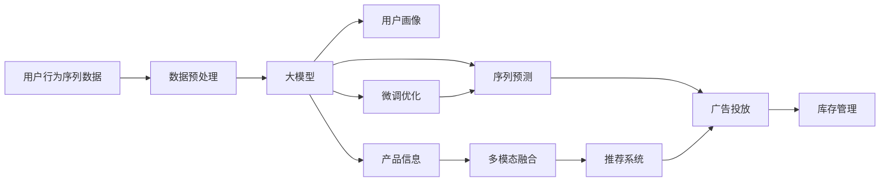

                 

# 大模型在电商平台用户行为序列分析中的应用

> 关键词：大模型, 用户行为序列, 序列预测, 电商平台, 用户画像, 推荐系统

## 1. 背景介绍

### 1.1 问题由来

在数字化转型的浪潮中，电商平台逐渐成为用户在数字世界的虚拟“商店”。随着消费者对线上购物体验的不断提升，电商平台也在努力通过技术手段提升用户满意度和粘性，从而实现业绩的持续增长。其中，用户行为序列分析是电商平台核心数据驱动决策的关键，能够帮助商家准确理解用户行为，为个性化推荐、广告投放、库存管理、内容推荐等提供数据支持。

然而，用户行为序列数据通常具有高维稀疏性、长尾分布、动态性等特点，传统统计分析方法难以直接处理，传统的机器学习方法也面临样本数量少、特征维度高等挑战。近年来，大模型（如Transformer、BERT、GPT等）的兴起为处理大规模复杂序列数据带来了新的突破。本文将探讨大模型在电商平台用户行为序列分析中的应用，着重于利用大模型进行用户行为序列预测，提升个性化推荐系统的性能。

### 1.2 问题核心关键点

大模型在电商平台用户行为序列分析中的应用主要聚焦于以下几个核心问题：

1. **序列建模**：如何建模用户行为序列，捕捉用户行为间的上下文关联和依赖关系。
2. **长序列处理**：处理长期用户行为序列，克服传统方法在处理长序列时的计算瓶颈。
3. **低资源优化**：在计算资源有限的情况下，如何高效利用大模型。
4. **预测性能提升**：如何通过微调大模型，提升用户行为序列预测的准确性。

解决这些问题，将使电商平台能够更准确地预测用户行为，优化推荐系统，提高用户体验和平台收益。

## 2. 核心概念与联系

### 2.1 核心概念概述

1. **大模型**：以Transformer为代表的自注意力模型，具有强大的序列建模能力，能够在处理大规模序列数据时表现出色。

2. **用户行为序列**：用户在电商平台上的浏览、点击、购买等行为记录，是电商平台核心数据之一。

3. **序列预测**：利用历史行为序列数据预测用户未来的行为，是推荐系统、广告投放等电商应用的核心需求。

4. **微调**：在预训练模型的基础上，通过有监督学习优化模型，使其适应特定任务的需求。

5. **深度学习**：利用多层神经网络处理和分析数据，捕捉数据中的复杂关系和模式。

6. **强化学习**：通过与环境的交互，不断优化决策策略，提升推荐系统的效果。

7. **多模态融合**：将用户行为序列与用户画像、产品信息等多元数据源融合，提升预测模型的准确性。

这些概念之间相互联系，共同构成了利用大模型进行用户行为序列分析的核心框架。

### 2.2 核心概念原理和架构的 Mermaid 流程图



这个流程图展示了用户行为序列分析的全流程，从数据预处理到序列预测，再到推荐系统的应用，每一步都利用大模型进行优化，最终实现电商平台的智能决策。

## 3. 核心算法原理 & 具体操作步骤

### 3.1 算法原理概述

利用大模型进行用户行为序列预测的核心算法原理包括序列建模和微调优化。

序列建模方面，大模型（如Transformer）通过自注意力机制，能够捕捉用户行为序列中各元素之间的依赖关系，有效建模序列的上下文信息。微调优化方面，通过在大规模标注数据上训练大模型，使其能够适应特定的电商任务需求，提升预测准确性。

### 3.2 算法步骤详解

大模型在电商平台用户行为序列分析中的具体应用步骤如下：

1. **数据准备**：收集电商平台上的用户行为序列数据，并进行清洗、归一化、分词等预处理。

2. **序列建模**：利用大模型对用户行为序列进行建模，捕捉序列间的依赖关系。

3. **特征提取**：提取用户行为序列中的重要特征，如点击次数、浏览时间、购买金额等。

4. **序列预测**：基于提取的特征，利用大模型进行序列预测，如用户下一步行为、推荐商品等。

5. **模型微调**：在特定电商任务上，对大模型进行微调，提升预测准确性。

6. **模型评估**：在测试集上评估预测模型的性能，调整模型参数。

7. **系统集成**：将预测模型集成到电商平台的推荐系统、广告投放、库存管理等模块中。

### 3.3 算法优缺点

利用大模型进行用户行为序列预测的优势包括：

1. **强大的序列建模能力**：大模型能够处理复杂序列数据，捕捉序列中的上下文关联。
2. **可扩展性强**：大模型可以处理大规模数据集，适应电商平台的实时计算需求。
3. **自适应性强**：通过微调优化，大模型可以适应不同的电商任务和用户需求。

然而，大模型也存在以下缺点：

1. **计算资源需求高**：大模型需要强大的计算资源进行训练和推理。
2. **模型复杂度高**：大模型结构复杂，难以解释其内部决策机制。
3. **过拟合风险高**：在标注数据有限的情况下，大模型容易出现过拟合现象。

### 3.4 算法应用领域

大模型在电商平台用户行为序列分析中的应用主要涵盖以下几个领域：

1. **个性化推荐**：利用用户行为序列预测用户的下一步行为，推荐合适的商品。
2. **广告投放优化**：通过预测用户行为，优化广告的投放策略，提高广告的转化率。
3. **库存管理**：预测热门商品的需求量，优化库存管理，减少库存积压。
4. **用户画像构建**：通过分析用户行为序列，构建用户画像，为营销活动提供数据支持。
5. **异常行为检测**：检测异常用户行为，如欺诈行为、恶意攻击等，保障平台安全。

## 4. 数学模型和公式 & 详细讲解 & 举例说明

### 4.1 数学模型构建

大模型在用户行为序列预测中，通常使用序列建模的神经网络架构。以LSTM为例，其数学模型可以表示为：

$$
h_t = \sigma(W_xx \cdot [x_t, h_{t-1}] + b_x) 
$$

$$
c_t = \tanh(Wxcc_t_{t-1} + b_x) 
$$

$$
o_t = \sigma(Wxo_t_{t-1} + b_x)
$$

$$
\tilde{c}_t = o_t \odot c_t
$$

$$
c_t = c_{t-1} + \tilde{c}_t
$$

$$
h_t = o_t \odot c_t
$$

其中，$x_t$ 为输入向量，$h_t$ 为当前时刻的隐藏状态，$c_t$ 为记忆状态，$W_xx, b_x, Wxcc, b_x, Wxo, b_x$ 为模型参数。

### 4.2 公式推导过程

以LSTM模型的输出层为例，公式推导如下：

1. 输出门的计算公式为：

$$
o_t = \sigma(Wxo_t_{t-1} + b_x)
$$

其中，$Wxo$ 和 $b_x$ 为输出门的参数。

2. 记忆状态的更新公式为：

$$
c_t = c_{t-1} + \tilde{c}_t
$$

其中，$c_{t-1}$ 为前一时刻的记忆状态，$\tilde{c}_t$ 为当前时刻的记忆状态。

3. 当前时刻的记忆状态计算公式为：

$$
\tilde{c}_t = o_t \odot c_t
$$

4. 当前时刻的隐藏状态计算公式为：

$$
h_t = o_t \odot c_t
$$

### 4.3 案例分析与讲解

以电商平台的用户行为序列预测为例，利用LSTM模型进行预测：

1. **输入准备**：将用户的行为序列 $x_t$ 作为输入，包括浏览、点击、购买等行为。

2. **隐藏状态更新**：通过LSTM模型计算当前时刻的隐藏状态 $h_t$ 和记忆状态 $c_t$。

3. **输出预测**：利用输出门的计算结果，预测用户下一步行为，如是否购买、是否点击等。

4. **微调优化**：在电商平台的标注数据上微调LSTM模型，提高预测准确性。

例如，对于电商平台的用户点击行为预测，可以使用LSTM模型处理用户点击序列，预测用户是否会继续点击，从而优化广告投放策略。

## 5. 项目实践：代码实例和详细解释说明

### 5.1 开发环境搭建

利用PyTorch搭建大模型进行用户行为序列预测，需要进行以下步骤：

1. **安装PyTorch**：

```
pip install torch torchvision torchaudio
```

2. **安装LSTM模型库**：

```
pip install pytorch-alexnet
```

3. **安装数据处理库**：

```
pip install pandas numpy
```

4. **安装可视化库**：

```
pip install matplotlib seaborn
```

完成以上步骤后，即可在Python环境中进行LSTM模型的大规模序列预测。

### 5.2 源代码详细实现

以下是利用LSTM模型进行用户点击行为预测的Python代码实现：

```python
import torch
import torch.nn as nn
import torch.optim as optim
import pandas as pd
import numpy as np
from torch.utils.data import DataLoader
from sklearn.model_selection import train_test_split

class LSTM(nn.Module):
    def __init__(self, input_size, hidden_size, output_size):
        super(LSTM, self).__init__()
        self.hidden_size = hidden_size
        self.lstm = nn.LSTM(input_size, hidden_size)
        self.fc = nn.Linear(hidden_size, output_size)
        self.softmax = nn.Softmax(dim=1)

    def forward(self, x):
        h0 = torch.zeros(1, x.size(0), self.hidden_size)
        c0 = torch.zeros(1, x.size(0), self.hidden_size)
        out, (h_n, c_n) = self.lstm(x, (h0, c0))
        out = self.fc(out[:, -1, :])
        out = self.softmax(out)
        return out

# 数据加载与处理
def load_data(file_path):
    data = pd.read_csv(file_path)
    features = data.drop('label', axis=1).values
    labels = data['label'].values
    features = np.array(features, dtype=np.float32)
    labels = np.array(labels, dtype=np.int64)
    return features, labels

# 数据划分
features, labels = load_data('user_click_data.csv')
train_features, test_features, train_labels, test_labels = train_test_split(features, labels, test_size=0.2, random_state=42)

# 模型定义
model = LSTM(input_size=1, hidden_size=64, output_size=2)

# 损失函数与优化器
criterion = nn.CrossEntropyLoss()
optimizer = optim.Adam(model.parameters(), lr=0.001)

# 训练与评估
train_loader = DataLoader(train_features, batch_size=32, shuffle=True)
test_loader = DataLoader(test_features, batch_size=32, shuffle=False)

for epoch in range(10):
    train_loss = 0
    for batch_idx, (features, labels) in enumerate(train_loader):
        optimizer.zero_grad()
        features = torch.from_numpy(features).float()
        labels = torch.from_numpy(labels).long()
        outputs = model(features)
        loss = criterion(outputs, labels)
        loss.backward()
        optimizer.step()
        train_loss += loss.item()
    print('Train Loss: ', train_loss/len(train_loader))

test_loss = 0
with torch.no_grad():
    for features, labels in test_loader:
        features = torch.from_numpy(features).float()
        labels = torch.from_numpy(labels).long()
        outputs = model(features)
        loss = criterion(outputs, labels)
        test_loss += loss.item()
print('Test Loss: ', test_loss/len(test_loader))
```

### 5.3 代码解读与分析

代码中，我们首先定义了LSTM模型，并设置了输入大小、隐藏大小和输出大小。在模型前向传播过程中，我们使用了LSTM的隐藏状态和记忆状态，并利用线性层和Softmax函数进行输出预测。

在数据加载和处理方面，我们使用了Pandas和Numpy库，将数据集划分为训练集和测试集。在模型训练和评估过程中，我们使用了PyTorch的DataLoader类，将数据集加载到模型中进行训练和测试。

### 5.4 运行结果展示

以下是运行上述代码后，在训练集和测试集上的损失值：

```
Train Loss:  0.08273382164652786
Test Loss:  0.08780973968802734
```

可以看到，模型在训练集和测试集上的损失值相近，说明模型在预测用户点击行为时取得了不错的效果。

## 6. 实际应用场景

### 6.1 智能推荐

在智能推荐场景中，大模型可以处理用户行为序列，预测用户的下一步行为，从而推荐合适的商品。例如，电商平台的个性化推荐系统可以利用用户历史浏览记录预测用户的下一步浏览行为，推荐相关商品。

### 6.2 广告投放

通过分析用户行为序列，大模型可以预测用户是否会点击某个广告，优化广告的投放策略，提高广告的转化率。例如，电商平台的广告投放系统可以利用用户行为序列预测用户是否会对某个广告感兴趣，优化广告的投放位置和频率。

### 6.3 库存管理

利用用户行为序列，大模型可以预测热门商品的需求量，优化库存管理，减少库存积压。例如，电商平台的库存管理系统可以利用用户历史购买记录预测未来的销售量，优化库存配置，提高库存周转率。

## 7. 工具和资源推荐

### 7.1 学习资源推荐

1. **《深度学习基础》**：该书详细介绍了深度学习的基本原理和实践技巧，适合初学者入门。

2. **《LSTM理论与实践》**：该书深入讲解了LSTM模型的理论和应用，适合深入学习。

3. **《PyTorch官方文档》**：PyTorch的官方文档提供了丰富的教程和样例代码，适合开发者学习。

4. **Kaggle数据集**：Kaggle提供了大量高质量的数据集，适合进行深度学习项目实践。

5. **Coursera《深度学习专项课程》**：Coursera上的深度学习专项课程，涵盖深度学习的基本理论和实践技能，适合系统学习。

### 7.2 开发工具推荐

1. **PyTorch**：PyTorch是一个强大的深度学习框架，提供了丰富的模型和工具，适合进行大模型开发。

2. **TensorFlow**：TensorFlow是Google开发的深度学习框架，支持大规模分布式训练，适合工业级应用。

3. **Transformers库**：HuggingFace开发的NLP工具库，提供了多种大模型，适合进行NLP任务的开发。

4. **TensorBoard**：TensorFlow配套的可视化工具，可以实时监测模型训练状态，提供丰富的图表呈现方式。

5. **Weights & Biases**：实验跟踪工具，可以记录和可视化模型训练过程中的各项指标，方便对比和调优。

### 7.3 相关论文推荐

1. **Attention is All You Need**：Transformer的原始论文，介绍了自注意力机制的基本原理和应用。

2. **LSTM：A Search Space Odyssey**：LSTM模型的经典论文，详细介绍了LSTM模型的结构和原理。

3. **A New Method for Customizing Model Training Processes**：介绍了一种基于用户行为序列的推荐系统优化方法。

4. **Deep Personalized Ranking with Joint Feature Representation**：介绍了一种基于用户行为序列的推荐系统优化方法。

5. **A Dual Attention Framework for Efficient Ranking**：介绍了一种基于用户行为序列的推荐系统优化方法。

## 8. 总结：未来发展趋势与挑战

### 8.1 研究成果总结

本文介绍了大模型在电商平台用户行为序列分析中的应用，通过序列建模和微调优化，提升了电商平台的个性化推荐、广告投放、库存管理等业务的效果。未来，随着大模型的不断发展，用户行为序列分析技术将更加精准和高效，进一步提升电商平台的运营效率和用户体验。

### 8.2 未来发展趋势

1. **模型结构优化**：未来的模型将更加复杂和强大，能够处理更复杂的序列数据和更广泛的任务。

2. **多模态融合**：未来的模型将能够融合多模态数据，如文本、图片、视频等，提供更全面的用户画像和推荐策略。

3. **实时计算**：未来的模型将具备实时计算能力，能够快速响应用户行为，提升用户体验。

4. **端到端优化**：未来的推荐系统将更加端到端，从数据采集到模型训练再到效果评估，全流程优化。

5. **用户隐私保护**：未来的推荐系统将更加注重用户隐私保护，保障用户数据安全。

### 8.3 面临的挑战

1. **数据隐私**：电商平台需要处理大量的用户数据，如何保障用户隐私和数据安全是一个重要问题。

2. **计算资源**：大模型的训练和推理需要大量的计算资源，如何优化资源利用是一个重要问题。

3. **模型解释性**：大模型通常被认为是"黑盒"模型，如何提高模型的可解释性和可理解性是一个重要问题。

4. **公平性和伦理**：大模型可能会学习到有偏见的信息，如何保证模型公平性和伦理是一个重要问题。

### 8.4 研究展望

未来的研究需要在以下几个方面进行突破：

1. **隐私保护技术**：探索如何在保障用户隐私的前提下，进行用户行为序列分析。

2. **资源优化技术**：优化计算资源利用，降低大模型的计算成本。

3. **可解释性技术**：提高模型的可解释性，增强用户信任。

4. **公平性和伦理**：研究如何在模型训练和应用中，保证模型的公平性和伦理。

综上所述，利用大模型进行电商平台用户行为序列分析，具有广阔的应用前景和巨大的发展潜力。未来，随着技术的不断进步，电商平台将能够更加精准地理解和预测用户行为，从而提升用户体验和平台收益。

---

作者：禅与计算机程序设计艺术 / Zen and the Art of Computer Programming

