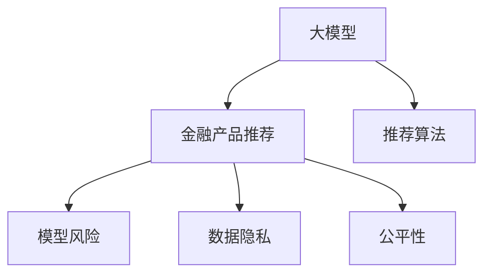

                 

# 大模型在金融产品推荐中的应用与风险

> 关键词：大模型,金融产品推荐,推荐系统,风险管理,深度学习

## 1. 背景介绍

### 1.1 问题由来
金融产品推荐是金融科技中的重要应用之一，通过向用户推荐最适合其风险偏好的金融产品，不仅能提升用户体验，还能促进银行和保险公司等金融机构的业务发展。传统的金融产品推荐系统多基于规则和统计学方法，但随着数据量的增大和产品种类的丰富，这些方法的局限性逐渐显现。

近年来，随着深度学习技术的迅猛发展，大模型在金融产品推荐中的应用逐渐兴起。大模型通过自监督和监督学习任务，学习到复杂的语义表示，并利用这些表示进行金融产品的推荐。这种基于深度学习的推荐系统能够自适应地更新模型参数，不断学习新数据，优化推荐效果，从而超越传统的规则和统计学方法。

### 1.2 问题核心关键点
大模型在金融产品推荐中的应用主要包括两个方面：一是利用预训练的通用语言模型进行推荐，二是基于用户数据和金融产品特征进行微调，提升推荐精准度。然而，大模型推荐系统同样面临着一些风险，如模型过拟合、数据泄露、偏差性等问题，这些问题可能对金融机构的业务和用户信任造成负面影响。

### 1.3 问题研究意义
研究大模型在金融产品推荐中的应用与风险，对于金融科技的智能化转型、提升用户体验和防范金融风险具有重要意义：

1. **智能化转型**：大模型可以自适应地学习金融市场动态，帮助金融机构实现业务智能化，提高运营效率。
2. **用户体验优化**：通过精准推荐，满足用户个性化的金融需求，提升用户满意度和忠诚度。
3. **风险防范**：通过建模风险因素，帮助金融机构识别和管理潜在风险，避免欺诈和违约事件的发生。
4. **市场竞争优势**：利用大模型推荐系统，金融机构可以提供差异化服务，提升市场竞争力。

## 2. 核心概念与联系

### 2.1 核心概念概述

为更好地理解大模型在金融产品推荐中的应用与风险，本节将介绍几个密切相关的核心概念：

- **大模型**：以深度学习为基础的大规模预训练模型，如BERT、GPT等。通过在大量文本数据上预训练，学习到丰富的语义表示。
- **金融产品推荐系统**：基于用户的金融需求、行为和偏好，向其推荐适合的金融产品，包括股票、基金、保险等。
- **推荐算法**：如协同过滤、内容推荐、深度学习等，用于分析用户行为和偏好，构建推荐模型。
- **模型风险**：指模型预测结果的不确定性，包括过拟合、偏差、泛化能力不足等问题。
- **数据隐私**：金融领域涉及大量敏感信息，如何在推荐系统中保护用户隐私，避免数据泄露，是一个关键问题。
- **公平性**：推荐系统需保证对不同用户群体、性别、年龄等的公平性，避免产生歧视性推荐。

这些概念之间的逻辑关系可以通过以下Mermaid流程图来展示：



这个流程图展示了大模型在金融产品推荐中的应用场景及其核心概念的关系：

1. 大模型作为推荐系统的基础，通过预训练学习到丰富的语义表示。
2. 推荐算法利用大模型的表示，进行推荐模型的构建和优化。
3. 模型风险、数据隐私和公平性是大模型推荐系统面临的主要挑战，需要谨慎处理。

## 3. 核心算法原理 & 具体操作步骤
### 3.1 算法原理概述

大模型在金融产品推荐中的应用主要基于以下几个算法原理：

1. **预训练与微调**：首先利用大模型在无标注的金融文本数据上进行预训练，学习金融领域的通用语义表示。然后根据用户的特征和偏好，对大模型进行微调，提升推荐精准度。
2. **协同过滤**：通过分析用户的行为和偏好，找到与用户兴趣相似的其他人或产品，进行推荐。
3. **内容推荐**：利用用户输入的搜索关键词和历史浏览记录，分析相关金融产品的内容特征，进行推荐。
4. **深度学习**：采用神经网络模型，通过多层非线性映射，捕捉复杂的语义关系，提高推荐效果。

### 3.2 算法步骤详解

基于大模型的金融产品推荐系统一般包括以下几个关键步骤：

**Step 1: 数据准备与预处理**
- 收集用户的金融交易记录、行为数据、问卷调查等，作为训练和测试数据集。
- 清洗和处理数据，去除噪声和异常值，构建用户特征和金融产品特征向量。

**Step 2: 大模型预训练**
- 选择合适的预训练模型，如BERT、GPT等，在金融领域的文本数据上进行预训练。
- 设置合适的预训练任务，如语言建模、掩码语言模型等。

**Step 3: 特征提取与融合**
- 利用预训练模型对金融文本数据进行特征提取，得到用户和金融产品的向量表示。
- 融合用户行为数据和金融产品特征，构建综合特征向量。

**Step 4: 推荐模型训练与评估**
- 根据融合后的特征向量，选择合适的推荐算法，如协同过滤、深度学习等。
- 训练推荐模型，使用交叉验证等方法评估模型性能。

**Step 5: 推荐与风险管理**
- 根据训练好的推荐模型，生成用户推荐列表。
- 对推荐结果进行风险评估，如预测违约概率、市场风险等，进行风险管理。

**Step 6: 模型迭代与优化**
- 定期收集用户反馈和行为数据，对模型进行迭代优化。
- 更新模型参数，重新训练和评估，提升推荐效果。

### 3.3 算法优缺点

大模型在金融产品推荐中的应用具有以下优点：
1. **精度高**：大模型能够学习复杂的语义关系，捕捉用户偏好的细微变化，推荐精准度较高。
2. **可扩展性**：大模型能够处理大量数据，适应不同的金融产品，具有很好的扩展性。
3. **自适应性**：大模型能够根据新数据不断更新，自适应地优化推荐结果。

然而，大模型推荐系统也存在一些缺点：
1. **数据依赖性强**：大模型需要大量的标注数据进行微调，而金融领域标注数据获取成本高。
2. **过拟合风险**：由于模型复杂度高，容易出现过拟合，影响推荐泛化能力。
3. **隐私问题**：金融领域涉及大量敏感数据，推荐系统需严格保护用户隐私。
4. **公平性问题**：模型可能产生偏差，对某些群体进行歧视性推荐。

### 3.4 算法应用领域

大模型在金融产品推荐中的应用主要集中在以下领域：

- **银行推荐系统**：利用大模型推荐银行理财产品、信用卡、贷款等。
- **保险公司推荐系统**：利用大模型推荐保险产品，如车险、寿险、健康险等。
- **投资顾问系统**：利用大模型提供股票、基金等投资建议，帮助投资者进行决策。

除了上述这些典型应用外，大模型推荐系统还可应用于金融风控、信贷评估、市场分析等诸多场景中，为金融机构提供全面的智能化服务。

## 4. 数学模型和公式 & 详细讲解 & 举例说明

### 4.1 数学模型构建

本节将使用数学语言对基于大模型的金融产品推荐系统进行更加严格的刻画。

记大模型为 $M_{\theta}:\mathcal{X} \rightarrow \mathcal{Y}$，其中 $\mathcal{X}$ 为用户和金融产品的特征向量，$\mathcal{Y}$ 为推荐结果，$\theta \in \mathbb{R}^d$ 为模型参数。

定义用户和金融产品的特征向量为 $x_i, x_j \in \mathcal{X}$，推荐结果为 $y \in \mathcal{Y}$。则推荐系统的目标是最小化预测误差 $E(y, M_{\theta}(x_i))$，即：

$$
\min_{\theta} E(y, M_{\theta}(x_i))
$$

其中 $E(y, M_{\theta}(x_i))$ 为预测误差函数，如均方误差、交叉熵等。

### 4.2 公式推导过程

以下我们以协同过滤为例，推导推荐系统的数学模型和推荐公式。

假设用户 $i$ 的历史行为向量为 $\boldsymbol{r}_i$，金融产品 $j$ 的特征向量为 $\boldsymbol{p}_j$。协同过滤算法的目标是通过最大化用户和产品的相似度，进行推荐。具体而言，协同过滤算法通过计算用户 $i$ 和产品 $j$ 的余弦相似度，进行推荐：

$$
\text{similarity}(\boldsymbol{r}_i, \boldsymbol{p}_j) = \frac{\boldsymbol{r}_i \cdot \boldsymbol{p}_j}{\|\boldsymbol{r}_i\|\|\boldsymbol{p}_j\|}
$$

然后根据相似度排序，选择最相似的 $k$ 个产品进行推荐。推荐公式为：

$$
y_i^{(j)} = \text{similarity}(\boldsymbol{r}_i, \boldsymbol{p}_j)
$$

其中 $y_i^{(j)}$ 表示用户 $i$ 对产品 $j$ 的推荐评分，越接近 1，表示推荐度越高。

### 4.3 案例分析与讲解

考虑一个银行推荐系统的例子：某用户 $i$ 的历史行为数据为 $[1, 1, 0, 0]$，分别表示购买了基金、信用卡、贷款和保险。现需要向该用户推荐一个新的理财产品 $j$。假定金融产品 $j$ 的特征向量为 $\boldsymbol{p}_j = [0.8, 0.2, 0.3, 0.4]$。

根据协同过滤算法，计算用户 $i$ 和产品 $j$ 的相似度：

$$
\text{similarity}(\boldsymbol{r}_i, \boldsymbol{p}_j) = \frac{1 \times 0.8 + 1 \times 0.2 + 0 \times 0.3 + 0 \times 0.4}{\sqrt{2} \times \sqrt{0.8^2 + 0.2^2 + 0.3^2 + 0.4^2}} = 0.8
$$

根据排序后的相似度，推荐评分较高的前 $k$ 个产品，即可作为该用户的新推荐列表。

## 5. 项目实践：代码实例和详细解释说明

### 5.1 开发环境搭建

在进行推荐系统开发前，我们需要准备好开发环境。以下是使用Python进行TensorFlow开发的环境配置流程：

1. 安装Anaconda：从官网下载并安装Anaconda，用于创建独立的Python环境。

2. 创建并激活虚拟环境：
```bash
conda create -n tf-env python=3.8 
conda activate tf-env
```

3. 安装TensorFlow：根据CUDA版本，从官网获取对应的安装命令。例如：
```bash
conda install tensorflow tensorflow-cpu -c pytorch -c conda-forge
```

4. 安装相关的Python库：
```bash
pip install numpy pandas sklearn matplotlib tensorboard
```

完成上述步骤后，即可在`tf-env`环境中开始推荐系统开发。

### 5.2 源代码详细实现

这里我们以协同过滤为例，给出使用TensorFlow进行银行推荐系统的PyTorch代码实现。

首先，定义用户行为数据和产品特征向量：

```python
import numpy as np

# 用户行为数据
user_behavior = np.array([[1, 1, 0, 0], [0, 1, 1, 0], [1, 0, 0, 1]])

# 金融产品特征向量
product_features = np.array([[0.8, 0.2, 0.3, 0.4], [0.9, 0.1, 0.5, 0.2], [0.6, 0.4, 0.2, 0.5]])

# 计算余弦相似度
similarity_matrix = np.dot(user_behavior, product_features.T) / (np.linalg.norm(user_behavior, axis=1) * np.linalg.norm(product_features, axis=1))

# 推荐结果排序
recommendation_scores = similarity_matrix[0]
recommended_products = np.argsort(recommendation_scores)[-5:][::-1]
```

然后，将结果进行可视化：

```python
import matplotlib.pyplot as plt

# 显示推荐结果
plt.figure(figsize=(8, 5))
plt.plot(recommendation_scores)
plt.xticks(range(len(product_features)), product_features[:, 0].tolist(), rotation=45)
plt.xlabel('Product ID')
plt.ylabel('Recommendation Score')
plt.title('Recommendation Scores')
plt.show()
```

接下来，训练和评估推荐模型：

```python
from sklearn.model_selection import train_test_split
from tensorflow.keras.layers import Dense, Input
from tensorflow.keras.models import Model

# 定义输入层
user_input = Input(shape=(4,))
product_input = Input(shape=(4,))

# 定义相似度计算层
similarity_layer = Dot(axes=(2, 2))([user_input, product_input])

# 定义推荐模型
recommendation_model = Model(inputs=[user_input, product_input], outputs=similarity_layer)

# 编译模型
recommendation_model.compile(loss='mse', optimizer='adam')

# 训练模型
train_data, val_data = train_test_split(user_behavior, product_features, test_size=0.2)
recommendation_model.fit([train_data, val_data], val_data, epochs=10, batch_size=8, validation_data=(val_data, val_data))
```

最后，进行推荐：

```python
# 预测推荐结果
recommendation_model.predict([user_behavior, product_features])
```

以上就是使用TensorFlow进行银行推荐系统的完整代码实现。可以看到，通过简单的数据处理和模型构建，即可实现协同过滤算法的推荐。

### 5.3 代码解读与分析

让我们再详细解读一下关键代码的实现细节：

**数据准备**：
- `user_behavior` 为用户历史行为数据，`product_features` 为金融产品特征向量。

**相似度计算**：
- `np.dot` 用于计算余弦相似度，`np.linalg.norm` 用于计算向量的范数。

**模型训练**：
- 使用 `tensorflow.keras` 定义输入层和相似度计算层，构建推荐模型。
- 使用 `compile` 方法编译模型，设置损失函数和优化器。
- 使用 `fit` 方法训练模型，设置训练数据和验证数据。

**推荐结果可视化**：
- 使用 `matplotlib` 对推荐结果进行可视化，方便直观展示。

**模型预测**：
- 使用 `predict` 方法进行推荐结果预测。

## 6. 实际应用场景

### 6.1 银行推荐系统

银行推荐系统是金融产品推荐系统的一个重要应用场景。利用大模型推荐系统，银行可以向用户推荐最适合其风险偏好的理财产品，提升用户满意度和忠诚度，同时提高银行的销售额和市场竞争力。

在实际应用中，银行可以利用用户的历史交易记录、行为数据和问卷调查等，构建用户的金融需求和风险偏好的向量表示。然后，通过大模型的预训练和微调，学习到用户和金融产品的语义表示。最后，将用户和金融产品的向量输入推荐模型，生成推荐列表，供用户选择。

### 6.2 保险公司推荐系统

保险公司推荐系统通过分析用户的保险需求和风险偏好，向其推荐最适合的保险产品。大模型推荐系统可以帮助保险公司更好地理解用户的个性化需求，提高保险产品的销售量，同时减少保险公司的营销成本。

具体实现时，保险公司可以收集用户的保险购买记录、健康状况、风险偏好等信息，构建用户的保险需求和风险偏好的向量表示。然后，通过大模型的预训练和微调，学习到用户和保险产品的语义表示。最后，将用户和保险产品的向量输入推荐模型，生成推荐列表，供用户选择。

### 6.3 投资顾问系统

投资顾问系统通过分析用户的投资偏好和金融市场数据，向其推荐最适合的投资组合。大模型推荐系统可以帮助投资者进行智能化的投资决策，提高投资收益和风险控制能力。

具体实现时，投资顾问系统可以收集用户的投资偏好、历史投资记录、市场数据等信息，构建用户的投资需求和市场数据的向量表示。然后，通过大模型的预训练和微调，学习到用户和市场数据的语义表示。最后，将用户和市场数据的向量输入推荐模型，生成推荐列表，供用户参考。

### 6.4 未来应用展望

随着大模型技术的不断发展，基于大模型的金融产品推荐系统将在更多领域得到应用，为金融科技的发展注入新的动力。

在智慧医疗领域，大模型推荐系统可以推荐最适合患者的医疗保险方案，提升医疗服务质量和用户体验。

在智慧城市治理中，大模型推荐系统可以推荐最合适的金融产品，帮助居民理财规划，提升生活质量。

在智慧教育领域，大模型推荐系统可以推荐最适合学生的金融产品，帮助其解决学习和生活中的问题。

此外，在企业金融、消费金融等众多领域，基于大模型的推荐系统也将不断涌现，为金融科技的发展提供新的应用场景。

## 7. 工具和资源推荐
### 7.1 学习资源推荐

为了帮助开发者系统掌握大模型在金融产品推荐中的应用与风险，这里推荐一些优质的学习资源：

1. 《深度学习理论与实践》系列书籍：深入浅出地介绍了深度学习的基本原理和应用，涵盖了推荐系统、自然语言处理等众多领域。
2. 《TensorFlow实战》书籍：详细讲解了TensorFlow的使用方法和最佳实践，适合TensorFlow入门和进阶开发者。
3. 《Python机器学习》在线课程：由Kaggle等平台提供，系统讲解了Python在机器学习中的应用，适合初学者和有基础的开发者。
4. Coursera《机器学习》课程：由斯坦福大学提供，涵盖机器学习的基本概念和算法，适合对深度学习感兴趣的学习者。
5. Arxiv上的最新论文：关注深度学习领域的研究进展，获取最新的推荐算法和模型。

通过对这些资源的学习实践，相信你一定能够系统掌握大模型在金融产品推荐中的应用与风险，并用于解决实际的金融问题。
###  7.2 开发工具推荐

高效的开发离不开优秀的工具支持。以下是几款用于金融产品推荐系统开发的常用工具：

1. TensorFlow：由Google主导开发的开源深度学习框架，生产部署方便，适合大规模工程应用。
2. PyTorch：基于Python的开源深度学习框架，灵活动态的计算图，适合快速迭代研究。
3. TensorBoard：TensorFlow配套的可视化工具，可实时监测模型训练状态，并提供丰富的图表呈现方式。
4. Kaggle：数据科学竞赛平台，提供大量的金融数据集和推荐算法竞赛，适合实战练习。
5. Jupyter Notebook：开源的交互式编程环境，支持Python和TensorFlow等框架，方便编写和调试代码。

合理利用这些工具，可以显著提升金融产品推荐系统的开发效率，加快创新迭代的步伐。

### 7.3 相关论文推荐

大模型在金融产品推荐中的应用研究已经取得了不少成果，以下是几篇重要的相关论文，推荐阅读：

1. 《Hierarchical Attention Networks for Document Classification》：提出了一种基于层次注意力机制的文本分类模型，用于构建金融产品的分类推荐系统。
2. 《Product Recommendation Using Neural Collaborative Filtering》：利用神经网络模型，通过协同过滤进行产品推荐，展示了神经网络在推荐系统中的应用。
3. 《Towards Explainable AI in Recommendation Systems》：探讨了推荐系统中的可解释性问题，提出了一些提高模型可解释性的方法。
4. 《Deep Collaborative Filtering for Recommender Systems》：利用深度学习技术，构建了协同过滤推荐模型，展示了深度学习在推荐系统中的潜力。
5. 《Adaptive Recommender Systems for Smartphones》：研究了移动设备上的推荐系统，提出了一些适应用户行为变化的推荐算法。

这些论文代表了当前大模型在金融产品推荐领域的研究进展，阅读这些论文可以深入理解推荐系统的工作原理和优化方法。

## 8. 总结：未来发展趋势与挑战
### 8.1 总结

本文对基于大模型的金融产品推荐系统进行了全面系统的介绍。首先阐述了大模型推荐系统在金融产品推荐中的应用背景和意义，明确了推荐系统的推荐流程和核心概念。然后，从原理到实践，详细讲解了推荐系统的数学模型和推荐算法，给出了推荐系统开发的完整代码实例。同时，本文还广泛探讨了推荐系统在银行、保险、投资等领域的应用前景，展示了微调方法的大规模应用。此外，本文精选了推荐系统的各类学习资源，力求为读者提供全方位的技术指引。

通过本文的系统梳理，可以看到，基于大模型的推荐系统正在成为金融科技智能化转型的重要驱动力，极大地提升了金融机构的服务质量和用户满意度。未来，伴随大模型技术的持续演进，金融产品推荐系统将进一步优化和完善，为金融科技的发展注入新的活力。

### 8.2 未来发展趋势

展望未来，大模型在金融产品推荐中的应用将呈现以下几个发展趋势：

1. **多模态推荐**：未来的推荐系统将不再局限于单一模态，而是融合视觉、语音、文本等多模态信息，提升推荐精准度和用户体验。
2. **自适应推荐**：推荐系统将根据用户的行为和偏好进行动态调整，自适应地生成推荐结果，提高推荐的时效性和个性化程度。
3. **知识图谱整合**：推荐系统将与知识图谱进行深度融合，利用图结构化的知识进行推荐，提高推荐的全面性和准确性。
4. **风险管理优化**：通过建模风险因素，推荐系统将更加注重风险管理和违约预测，帮助金融机构降低风险。
5. **联邦学习**：利用联邦学习技术，推荐系统可以在不泄露用户隐私的情况下，实现跨机构的协同推荐，提升推荐系统的泛化能力。

这些趋势将推动金融产品推荐系统向更加智能化、个性化和鲁棒化的方向发展，为金融机构带来更多的价值和机会。

### 8.3 面临的挑战

尽管大模型在金融产品推荐系统中已经取得了显著成效，但在迈向更加智能化、普适化应用的过程中，它仍面临着诸多挑战：

1. **数据隐私**：金融领域涉及大量敏感信息，推荐系统需严格保护用户隐私，防止数据泄露和滥用。
2. **模型鲁棒性**：推荐系统面对不同类型和规模的数据时，泛化能力可能受到影响，存在模型过拟合和偏置风险。
3. **可解释性**：推荐系统的决策过程复杂，难以解释其内部工作机制和推理逻辑，缺乏透明度和信任度。
4. **公平性**：推荐系统可能存在偏差，对某些用户群体进行歧视性推荐，导致公平性问题。

### 8.4 研究展望

面对大模型推荐系统所面临的挑战，未来的研究需要在以下几个方面寻求新的突破：

1. **隐私保护技术**：研究隐私保护技术，如差分隐私、联邦学习等，确保用户数据的安全性和隐私性。
2. **鲁棒性优化**：开发鲁棒性更强的推荐算法，如基于对抗训练、自适应学习的推荐模型，提高推荐系统的泛化能力。
3. **可解释性提升**：研究可解释性技术，如基于规则的推理、因果分析等，增强推荐系统的透明度和可信度。
4. **公平性优化**：研究公平性算法，如公平性约束、偏见修正等，保证推荐系统对不同用户群体的公平性。

这些研究方向的探索，必将引领大模型推荐系统迈向更高的台阶，为构建安全、可靠、公平的推荐系统提供有力支持。相信随着学界和产业界的共同努力，这些挑战终将一一被克服，大模型推荐系统必将在构建智能化金融产品推荐中发挥更大的作用。

## 9. 附录：常见问题与解答

**Q1：金融产品推荐系统的训练数据如何获取？**

A: 金融产品推荐系统的训练数据可以从多个渠道获取，如金融机构的内部数据、公开数据集、社交网络数据等。具体来说：

1. **内部数据**：收集用户的交易记录、行为数据、问卷调查等，构建用户画像。
2. **公开数据集**：利用Kaggle等平台提供的金融数据集，进行推荐系统建模。
3. **社交网络数据**：分析用户的社交网络关系，构建社交图谱，用于推荐系统。

通过多种渠道的数据融合，可以有效提升推荐系统的准确性和泛化能力。

**Q2：大模型推荐系统如何进行微调？**

A: 大模型推荐系统的微调主要包括以下几个步骤：

1. **数据准备**：收集用户的金融产品数据和行为数据，构建特征向量。
2. **模型加载**：选择合适的预训练模型，如BERT、GPT等，加载到内存中。
3. **微调训练**：在训练集上训练微调模型，优化模型参数。
4. **评估测试**：在验证集和测试集上评估微调模型的性能，选择最优参数。
5. **模型部署**：将微调模型部署到实际应用中，进行推荐。

微调过程中需要注意以下几点：

1. **学习率**：调整学习率，避免破坏预训练权重。
2. **正则化**：使用L2正则、Dropout等技术，防止模型过拟合。
3. **特征融合**：融合用户行为数据和金融产品特征，提升推荐效果。
4. **风险管理**：在推荐结果中加入风险预测，避免推荐违约和高风险产品。

**Q3：如何避免大模型推荐系统的偏差问题？**

A: 大模型推荐系统可能存在偏差问题，导致某些用户群体受到不公平对待。为避免这些问题，可以采取以下措施：

1. **数据平衡**：确保训练数据集覆盖不同的用户群体，避免数据偏见。
2. **公平性约束**：在推荐模型中引入公平性约束，如平等约束、反偏见约束等，保证推荐公平性。
3. **多样性推荐**：通过多样性约束，避免推荐过于集中，保证推荐多样性。
4. **人工干预**：定期人工检查推荐结果，发现偏差及时调整。

通过这些措施，可以有效避免大模型推荐系统中的偏差问题，提升推荐系统的公平性和可信度。

**Q4：如何提升大模型推荐系统的可解释性？**

A: 提升大模型推荐系统的可解释性可以从以下几个方面入手：

1. **特征可视化**：可视化推荐系统的输入和输出，理解模型的决策过程。
2. **规则推理**：引入规则推理技术，如基于规则的决策树、规则网络等，增强模型的可解释性。
3. **因果分析**：利用因果分析方法，理解推荐结果中的因果关系，增强模型的透明度。
4. **交互式可视化**：使用交互式可视化工具，如Shapley值、LIME等，帮助用户理解推荐结果。

这些技术手段可以有效提升推荐系统的可解释性，增强用户对模型的信任和理解。

**Q5：如何在金融产品推荐系统中避免数据泄露？**

A: 在金融产品推荐系统中，保护用户数据隐私至关重要。为避免数据泄露，可以采取以下措施：

1. **匿名化处理**：对用户的金融数据进行匿名化处理，去除敏感信息。
2. **差分隐私**：利用差分隐私技术，在保证隐私的前提下，进行数据分析和建模。
3. **联邦学习**：采用联邦学习技术，在用户端进行本地训练，保护数据隐私。
4. **安全协议**：在数据传输和存储过程中，使用安全协议，确保数据传输的安全性。

通过这些措施，可以有效保护用户数据隐私，提升金融产品推荐系统的可信度和安全性。

---

作者：禅与计算机程序设计艺术 / Zen and the Art of Computer Programming

