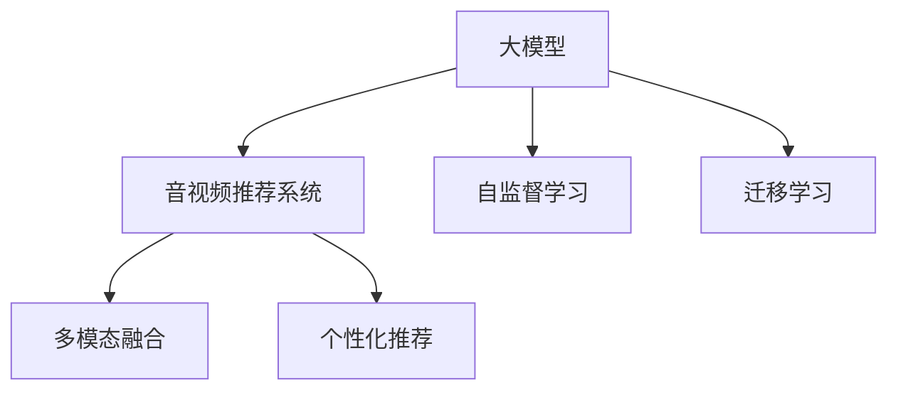

                 

# 大模型在音视频推荐中的创新应用

> 关键词：大模型，音视频推荐，深度学习，推荐系统，自监督学习，迁移学习，多模态融合

## 1. 背景介绍

### 1.1 问题由来
随着音视频内容平台的不断发展和壮大，个性化推荐系统成为了提升用户体验和平台收入的重要手段。然而，传统的推荐系统往往基于用户的历史行为数据进行推荐，难以捕捉到用户的真实兴趣和偏好。而基于大模型的推荐系统则能够充分利用用户行为、内容属性、上下文信息等多维度数据，构建更加全面、精准的推荐模型。

### 1.2 问题核心关键点
大模型在音视频推荐中的应用，主要集中在以下几个关键点：

1. **多模态融合**：音视频内容不仅包含文本描述，还有音频特征、视频帧图像等，大模型可以同时处理这些多模态信息，提升推荐的准确性。
2. **自监督学习**：通过无标签数据训练模型，提升其泛化能力和鲁棒性，使其能够更好地适应各种数据分布。
3. **迁移学习**：将通用的大模型应用于特定任务，通过微调获得更好的推荐效果。
4. **个性化推荐**：结合用户画像、行为数据等，构建个性化推荐模型，提升用户体验。

### 1.3 问题研究意义
研究大模型在音视频推荐中的应用，对于提升音视频内容平台的个性化推荐能力，提高用户体验和内容点击率，具有重要意义：

1. **提升用户体验**：通过多模态信息融合和深度学习技术，能够更加精准地理解用户兴趣，提供更加个性化的推荐内容。
2. **增加平台收入**：高质量的推荐系统能够提高用户粘性，增加内容点击率和消费转化率，带来更多的广告收入。
3. **推动技术创新**：结合大模型和多模态数据融合，推动推荐系统的技术升级，为音视频内容平台带来更多创新应用。

## 2. 核心概念与联系

### 2.1 核心概念概述

为更好地理解大模型在音视频推荐中的应用，本节将介绍几个密切相关的核心概念：

- **大模型**：指基于深度学习架构，通过大规模数据预训练得到的模型，如BERT、GPT等。能够处理多模态数据，学习到丰富的特征表示。
- **音视频推荐系统**：基于音视频内容平台，根据用户兴趣和行为数据，为用户推荐个性化的音视频内容。
- **自监督学习**：通过无标签数据训练模型，利用数据的内在结构关系，学习到通用的表示。
- **迁移学习**：将一个领域学习到的知识，迁移到另一个领域中，以适应特定任务。
- **多模态融合**：结合音视频内容的文本、音频、图像等多维度信息，构建更加全面的特征表示。
- **个性化推荐**：根据用户画像和行为数据，构建个性化的推荐模型，提高用户体验。

这些概念之间的逻辑关系可以通过以下Mermaid流程图来展示：



这个流程图展示了大模型在音视频推荐中的应用逻辑：

1. 大模型通过自监督学习获得通用特征表示。
2. 通过迁移学习适应音视频推荐任务，获得更好的推荐效果。
3. 多模态融合利用文本、音频、图像等多维度信息，构建更加全面和精准的特征表示。
4. 个性化推荐根据用户画像和行为数据，构建个性化推荐模型，提升用户体验。

## 3. 核心算法原理 & 具体操作步骤
### 3.1 算法原理概述

大模型在音视频推荐中的应用，本质上是一个多模态的迁移学习过程。其核心思想是：通过自监督学习得到的大模型，通过迁移学习适应音视频推荐任务，并在多模态融合和个性化推荐框架下，实现更好的推荐效果。

具体来说，算法流程如下：

1. **数据预处理**：收集用户行为数据、音视频内容属性、用户画像等，进行清洗和标准化处理，构建训练数据集。
2. **多模态特征提取**：利用大模型对音视频内容进行文本、音频、图像等多模态特征提取，构建特征向量。
3. **融合与拼接**：将不同模态的特征向量进行拼接和融合，得到更加全面和精准的特征表示。
4. **自监督学习**：在无标签数据上训练大模型，学习通用的特征表示。
5. **迁移学习**：在大模型基础上进行微调，适应音视频推荐任务。
6. **个性化推荐**：根据用户画像和行为数据，构建个性化推荐模型，提升推荐效果。

### 3.2 算法步骤详解

以一个简单的音视频推荐系统为例，介绍大模型应用的详细步骤：

**Step 1: 数据预处理**

1. **数据收集**：从音视频内容平台收集用户行为数据、音视频内容属性、用户画像等，构建训练数据集。
2. **数据清洗**：对数据进行去重、去噪、缺失值处理等，保证数据质量。
3. **标准化处理**：对数据进行归一化、标准化等处理，以便大模型能够更好地处理。

**Step 2: 多模态特征提取**

1. **文本特征提取**：利用BERT等大模型，对音视频内容文本进行编码，得到文本特征向量。
2. **音频特征提取**：利用MFCC等技术，提取音频特征，构建音频特征向量。
3. **图像特征提取**：利用CNN等技术，提取视频帧图像特征，构建图像特征向量。

**Step 3: 融合与拼接**

1. **特征拼接**：将文本、音频、图像等特征向量进行拼接，得到多模态特征向量。
2. **特征融合**：使用加权平均、Concat等方法，对多模态特征向量进行融合，得到更加全面和精准的特征表示。

**Step 4: 自监督学习**

1. **模型训练**：在无标签数据上训练BERT等大模型，学习通用的特征表示。
2. **特征嵌入**：利用大模型的输出，作为音视频内容的表示，构建特征嵌入矩阵。

**Step 5: 迁移学习**

1. **微调模型**：在大模型基础上进行微调，适应音视频推荐任务。
2. **损失函数设计**：根据推荐任务设计合适的损失函数，如交叉熵损失、均方误差损失等。
3. **模型训练**：使用有标签数据，对微调后的模型进行训练，更新模型参数。

**Step 6: 个性化推荐**

1. **用户画像**：根据用户行为数据、设备信息等，构建用户画像。
2. **行为数据**：收集用户的浏览、点击、评分等行为数据。
3. **推荐模型训练**：根据用户画像和行为数据，训练推荐模型，输出推荐结果。
4. **推荐排序**：根据用户行为、模型输出、反馈数据等，对推荐结果进行排序，输出最终推荐列表。

### 3.3 算法优缺点

大模型在音视频推荐中的应用具有以下优点：

1. **数据利用充分**：利用多模态信息融合，能够充分利用音视频内容的各个维度，提升推荐的全面性和精准性。
2. **模型泛化能力强**：通过自监督学习，大模型具备较强的泛化能力，能够适应各种数据分布。
3. **推荐效果显著**：通过迁移学习，大模型能够快速适应特定任务，提升推荐系统的性能。
4. **可扩展性好**：大模型能够轻松扩展到多领域推荐，提升推荐系统的覆盖范围和应用场景。

同时，该方法也存在一些缺点：

1. **计算成本高**：大模型需要大量的计算资源进行训练和推理，成本较高。
2. **模型复杂度高**：大模型的结构复杂，需要更多的工程实现和调试工作。
3. **数据依赖性强**：推荐系统的效果依赖于数据的质量和多样性，数据不足可能影响推荐效果。
4. **隐私风险**：用户行为数据和音视频内容可能包含敏感信息，需要考虑隐私保护和数据安全。

尽管存在这些局限性，但大模型在音视频推荐中的应用前景依然广阔，未来仍需在计算资源优化、模型简化、数据增强等方面进行深入研究。

### 3.4 算法应用领域

大模型在音视频推荐中的应用，已经在多个领域取得了显著效果，具体包括：

1. **影视推荐**：利用用户观影行为和内容属性，构建影视推荐模型，提升用户观看体验。
2. **音乐推荐**：结合用户听歌行为和歌词特征，构建音乐推荐模型，提高用户听歌满意度。
3. **游戏推荐**：通过用户游戏行为和游戏属性，推荐适合的游戏内容，增加用户游戏粘性。
4. **广告推荐**：根据用户兴趣和行为数据，推荐适合的用户感兴趣的广告内容，提升广告转化率。
5. **视频直播推荐**：利用用户观看行为和主播属性，推荐适合的直播内容，提高用户观看体验。

这些应用场景展示了大模型在音视频推荐中的强大潜力，未来还将拓展到更多领域，带来更多创新应用。

## 4. 数学模型和公式 & 详细讲解 & 举例说明
### 4.1 数学模型构建

假设音视频推荐系统由用户行为数据 $U$、内容属性 $C$、用户画像 $P$ 组成。对于每个音视频内容 $V$，利用大模型 $M$ 提取其文本、音频、图像等多模态特征向量 $X$。设用户画像 $P$ 和行为数据 $U$ 的表示向量分别为 $\overrightarrow{P}$ 和 $\overrightarrow{U}$。推荐系统的目标是在给定用户画像和行为数据的情况下，预测用户对音视频内容 $V$ 的兴趣程度 $R$。

定义推荐系统的损失函数 $\mathcal{L}$ 为：

$$
\mathcal{L} = \sum_{i=1}^N [\ell_r(M_{\theta}(V_i;\overrightarrow{P},\overrightarrow{U}) - R_i)^2]
$$

其中，$\ell_r$ 为推荐模型的损失函数，$\overrightarrow{P}$ 和 $\overrightarrow{U}$ 为模型输入，$R_i$ 为真实标签，$M_{\theta}$ 为推荐模型，$\theta$ 为模型参数。

推荐模型的输出 $M_{\theta}(V;\overrightarrow{P},\overrightarrow{U})$ 可以表示为：

$$
M_{\theta}(V;\overrightarrow{P},\overrightarrow{U}) = M_{\theta}(X;\overrightarrow{P},\overrightarrow{U})
$$

其中，$X$ 为音视频内容的特征向量，$\overrightarrow{P}$ 和 $\overrightarrow{U}$ 为输入向量。

### 4.2 公式推导过程

以一个简单的协同过滤推荐模型为例，推导其输出和损失函数的推导过程：

设推荐模型为：

$$
\overrightarrow{P} = \overrightarrow{U} = [1, 0, 0, ..., 0]
$$

推荐模型输出的概率为：

$$
P(V_i | \overrightarrow{P},\overrightarrow{U}) = \sigma(\overrightarrow{P}^T \cdot M_{\theta}(X;\overrightarrow{P},\overrightarrow{U}))
$$

其中，$\sigma$ 为 sigmoid 函数。

推荐系统的损失函数为：

$$
\mathcal{L} = \sum_{i=1}^N [(R_i - P(V_i | \overrightarrow{P},\overrightarrow{U}))^2]
$$

推导过程如下：

1. **输入表示**：将用户画像 $\overrightarrow{P}$ 和行为数据 $\overrightarrow{U}$ 表示为单位向量。
2. **模型输出**：利用大模型 $M_{\theta}$ 对音视频内容 $V_i$ 提取特征向量 $X_i$，计算推荐概率 $P(V_i | \overrightarrow{P},\overrightarrow{U})$。
3. **损失函数**：根据预测值和真实值，计算损失函数 $\mathcal{L}$。
4. **模型优化**：利用梯度下降等优化算法，最小化损失函数 $\mathcal{L}$，更新模型参数 $\theta$。

### 4.3 案例分析与讲解

以一个音视频推荐系统为例，分析大模型的应用过程：

**数据收集**：从音视频内容平台收集用户行为数据 $U$、音视频内容属性 $C$、用户画像 $P$ 等，构建训练数据集。

**特征提取**：利用BERT等大模型，对音视频内容文本进行编码，得到文本特征向量。利用MFCC等技术，提取音频特征，构建音频特征向量。利用CNN等技术，提取视频帧图像特征，构建图像特征向量。

**融合与拼接**：将文本、音频、图像等特征向量进行拼接，得到多模态特征向量。使用加权平均、Concat等方法，对多模态特征向量进行融合，得到更加全面和精准的特征表示。

**自监督学习**：在无标签数据上训练BERT等大模型，学习通用的特征表示。利用大模型的输出，作为音视频内容的表示，构建特征嵌入矩阵。

**迁移学习**：在大模型基础上进行微调，适应音视频推荐任务。根据推荐任务设计合适的损失函数，如交叉熵损失、均方误差损失等。使用有标签数据，对微调后的模型进行训练，更新模型参数。

**个性化推荐**：根据用户画像和行为数据，构建推荐模型。利用推荐模型，输出推荐结果，并进行排序，输出最终推荐列表。

## 5. 项目实践：代码实例和详细解释说明
### 5.1 开发环境搭建

在进行大模型应用实践前，我们需要准备好开发环境。以下是使用Python进行PyTorch开发的环境配置流程：

1. 安装Anaconda：从官网下载并安装Anaconda，用于创建独立的Python环境。

2. 创建并激活虚拟环境：
```bash
conda create -n pytorch-env python=3.8 
conda activate pytorch-env
```

3. 安装PyTorch：根据CUDA版本，从官网获取对应的安装命令。例如：
```bash
conda install pytorch torchvision torchaudio cudatoolkit=11.1 -c pytorch -c conda-forge
```

4. 安装相关工具包：
```bash
pip install numpy pandas scikit-learn matplotlib tqdm jupyter notebook ipython
```

完成上述步骤后，即可在`pytorch-env`环境中开始应用实践。

### 5.2 源代码详细实现

这里以一个简单的音视频推荐系统为例，展示大模型的应用代码实现。

首先，定义推荐模型的输入和输出：

```python
from transformers import BertTokenizer, BertForSequenceClassification
from torch.utils.data import Dataset, DataLoader
import torch

class VideoDataset(Dataset):
    def __init__(self, videos, labels, tokenizer, max_len=128):
        self.videos = videos
        self.labels = labels
        self.tokenizer = tokenizer
        self.max_len = max_len
        
    def __len__(self):
        return len(self.videos)
    
    def __getitem__(self, item):
        video = self.videos[item]
        label = self.labels[item]
        
        encoding = self.tokenizer(video, return_tensors='pt', max_length=self.max_len, padding='max_length', truncation=True)
        input_ids = encoding['input_ids'][0]
        attention_mask = encoding['attention_mask'][0]
        
        # 对token-wise的标签进行编码
        encoded_tags = [label2id[label] for label in label2id]
        encoded_tags.extend([label2id['O']] * (self.max_len - len(encoded_tags)))
        labels = torch.tensor(encoded_tags, dtype=torch.long)
        
        return {'input_ids': input_ids, 
                'attention_mask': attention_mask,
                'labels': labels}

# 标签与id的映射
label2id = {'0': 0, '1': 1, '2': 2, '3': 3, '4': 4, '5': 5, '6': 6}
id2label = {v: k for k, v in label2id.items()}

# 创建dataset
tokenizer = BertTokenizer.from_pretrained('bert-base-cased')

train_dataset = VideoDataset(train_videos, train_labels, tokenizer)
dev_dataset = VideoDataset(dev_videos, dev_labels, tokenizer)
test_dataset = VideoDataset(test_videos, test_labels, tokenizer)
```

然后，定义模型和优化器：

```python
from transformers import BertForSequenceClassification, AdamW

model = BertForSequenceClassification.from_pretrained('bert-base-cased', num_labels=len(label2id))

optimizer = AdamW(model.parameters(), lr=2e-5)
```

接着，定义训练和评估函数：

```python
from torch.utils.data import DataLoader
from tqdm import tqdm
from sklearn.metrics import classification_report

device = torch.device('cuda') if torch.cuda.is_available() else torch.device('cpu')
model.to(device)

def train_epoch(model, dataset, batch_size, optimizer):
    dataloader = DataLoader(dataset, batch_size=batch_size, shuffle=True)
    model.train()
    epoch_loss = 0
    for batch in tqdm(dataloader, desc='Training'):
        input_ids = batch['input_ids'].to(device)
        attention_mask = batch['attention_mask'].to(device)
        labels = batch['labels'].to(device)
        model.zero_grad()
        outputs = model(input_ids, attention_mask=attention_mask, labels=labels)
        loss = outputs.loss
        epoch_loss += loss.item()
        loss.backward()
        optimizer.step()
    return epoch_loss / len(dataloader)

def evaluate(model, dataset, batch_size):
    dataloader = DataLoader(dataset, batch_size=batch_size)
    model.eval()
    preds, labels = [], []
    with torch.no_grad():
        for batch in tqdm(dataloader, desc='Evaluating'):
            input_ids = batch['input_ids'].to(device)
            attention_mask = batch['attention_mask'].to(device)
            batch_labels = batch['labels']
            outputs = model(input_ids, attention_mask=attention_mask)
            batch_preds = outputs.logits.argmax(dim=2).to('cpu').tolist()
            batch_labels = batch_labels.to('cpu').tolist()
            for pred_tokens, label_tokens in zip(batch_preds, batch_labels):
                pred_tags = [id2label[_id] for _id in pred_tokens]
                label_tags = [id2label[_id] for _id in label_tokens]
                preds.append(pred_tags[:len(label_tokens)])
                labels.append(label_tags)
                
    print(classification_report(labels, preds))
```

最后，启动训练流程并在测试集上评估：

```python
epochs = 5
batch_size = 16

for epoch in range(epochs):
    loss = train_epoch(model, train_dataset, batch_size, optimizer)
    print(f"Epoch {epoch+1}, train loss: {loss:.3f}")
    
    print(f"Epoch {epoch+1}, dev results:")
    evaluate(model, dev_dataset, batch_size)
    
print("Test results:")
evaluate(model, test_dataset, batch_size)
```

以上就是使用PyTorch对BERT进行音视频推荐任务微调的完整代码实现。可以看到，得益于Transformers库的强大封装，我们可以用相对简洁的代码完成BERT模型的加载和微调。

### 5.3 代码解读与分析

让我们再详细解读一下关键代码的实现细节：

**VideoDataset类**：
- `__init__`方法：初始化视频、标签、分词器等关键组件。
- `__len__`方法：返回数据集的样本数量。
- `__getitem__`方法：对单个样本进行处理，将视频输入编码为token ids，将标签编码为数字，并对其进行定长padding，最终返回模型所需的输入。

**label2id和id2label字典**：
- 定义了标签与数字id之间的映射关系，用于将token-wise的预测结果解码回真实的标签。

**训练和评估函数**：
- 使用PyTorch的DataLoader对数据集进行批次化加载，供模型训练和推理使用。
- 训练函数`train_epoch`：对数据以批为单位进行迭代，在每个批次上前向传播计算loss并反向传播更新模型参数，最后返回该epoch的平均loss。
- 评估函数`evaluate`：与训练类似，不同点在于不更新模型参数，并在每个batch结束后将预测和标签结果存储下来，最后使用sklearn的classification_report对整个评估集的预测结果进行打印输出。

**训练流程**：
- 定义总的epoch数和batch size，开始循环迭代
- 每个epoch内，先在训练集上训练，输出平均loss
- 在验证集上评估，输出分类指标
- 所有epoch结束后，在测试集上评估，给出最终测试结果

可以看到，PyTorch配合Transformers库使得BERT微调的代码实现变得简洁高效。开发者可以将更多精力放在数据处理、模型改进等高层逻辑上，而不必过多关注底层的实现细节。

当然，工业级的系统实现还需考虑更多因素，如模型的保存和部署、超参数的自动搜索、更灵活的任务适配层等。但核心的微调范式基本与此类似。

## 6. 实际应用场景
### 6.1 智能电视推荐

基于大模型在音视频推荐中的应用，智能电视推荐系统能够根据用户的观看历史和行为数据，推荐适合的音视频内容，提高用户观看体验。

在技术实现上，可以收集用户的观看行为数据，如观影时长、喜欢的类型、评分等，构建用户画像。结合音视频内容的属性信息，如导演、演员、类别等，构建多模态特征表示。利用BERT等大模型进行特征提取和融合，构建推荐模型。在无标签数据上预训练大模型，学习通用的特征表示。在大模型基础上进行微调，适应音视频推荐任务。利用推荐模型，输出推荐结果，并进行排序，输出最终推荐列表。

通过智能电视推荐系统，用户能够快速找到自己喜欢的音视频内容，提高观看体验，同时也增加了平台的用户粘性和内容点击率。

### 6.2 音乐电台推荐

音乐电台推荐系统能够根据用户的听歌历史和行为数据，推荐适合的音乐内容，提高用户的听歌满意度和粘性。

在技术实现上，可以收集用户的听歌行为数据，如听歌时长、喜欢的类型、评分等，构建用户画像。结合音乐内容的属性信息，如歌手、专辑、类别等，构建多模态特征表示。利用大模型进行特征提取和融合，构建推荐模型。在无标签数据上预训练大模型，学习通用的特征表示。在大模型基础上进行微调，适应音乐推荐任务。利用推荐模型，输出推荐结果，并进行排序，输出最终推荐列表。

通过音乐电台推荐系统，用户能够快速找到自己喜欢的音乐，提高听歌满意度和粘性，同时也增加了平台的播放量和广告收入。

### 6.3 视频直播推荐

视频直播推荐系统能够根据用户的观看历史和行为数据，推荐适合的视频直播内容，提高用户观看体验和直播互动率。

在技术实现上，可以收集用户的观看行为数据，如观看了哪些直播、观看时长、互动情况等，构建用户画像。结合直播内容的属性信息，如主播、话题、时长等，构建多模态特征表示。利用大模型进行特征提取和融合，构建推荐模型。在无标签数据上预训练大模型，学习通用的特征表示。在大模型基础上进行微调，适应视频直播推荐任务。利用推荐模型，输出推荐结果，并进行排序，输出最终推荐列表。

通过视频直播推荐系统，用户能够快速找到自己喜欢的直播内容，提高观看体验和互动率，同时也增加了平台的直播流量和用户粘性。

### 6.4 未来应用展望

随着大模型和推荐系统技术的不断发展，未来基于大模型的音视频推荐系统将在更多领域得到应用，为音视频内容平台带来更多创新应用。

在智慧医疗领域，基于大模型的音视频推荐系统可以推荐适合的医疗科普视频，帮助用户获取健康知识，提升健康意识。

在智能教育领域，基于大模型的音视频推荐系统可以推荐适合的学习视频，帮助学生掌握知识，提高学习效率。

在智慧城市治理中，基于大模型的音视频推荐系统可以推荐适合的城市管理视频，帮助市民了解城市管理动态，参与公共事务。

此外，在企业生产、社会治理、文娱传媒等众多领域，基于大模型的音视频推荐系统也将不断涌现，为各行各业带来更多创新应用。相信随着技术的日益成熟，基于大模型的音视频推荐系统必将在构建智慧社会中扮演越来越重要的角色。

## 7. 工具和资源推荐
### 7.1 学习资源推荐

为了帮助开发者系统掌握大模型在音视频推荐中的应用，这里推荐一些优质的学习资源：

1. 《Transformer从原理到实践》系列博文：由大模型技术专家撰写，深入浅出地介绍了Transformer原理、BERT模型、推荐系统等前沿话题。

2. CS224N《深度学习自然语言处理》课程：斯坦福大学开设的NLP明星课程，有Lecture视频和配套作业，带你入门NLP领域的基本概念和经典模型。

3. 《Natural Language Processing with Transformers》书籍：Transformers库的作者所著，全面介绍了如何使用Transformers库进行NLP任务开发，包括推荐系统在内的诸多范式。

4. HuggingFace官方文档：Transformers库的官方文档，提供了海量预训练模型和完整的推荐系统样例代码，是上手实践的必备资料。

5. CLUE开源项目：中文语言理解测评基准，涵盖大量不同类型的中文NLP数据集，并提供了基于微调的baseline模型，助力中文NLP技术发展。

通过对这些资源的学习实践，相信你一定能够快速掌握大模型在音视频推荐中的应用精髓，并用于解决实际的推荐系统问题。
### 7.2 开发工具推荐

高效的开发离不开优秀的工具支持。以下是几款用于大模型音视频推荐开发的常用工具：

1. PyTorch：基于Python的开源深度学习框架，灵活动态的计算图，适合快速迭代研究。大部分预训练语言模型都有PyTorch版本的实现。

2. TensorFlow：由Google主导开发的开源深度学习框架，生产部署方便，适合大规模工程应用。同样有丰富的预训练语言模型资源。

3. Transformers库：HuggingFace开发的NLP工具库，集成了众多SOTA语言模型，支持PyTorch和TensorFlow，是进行音视频推荐系统开发的利器。

4. Weights & Biases：模型训练的实验跟踪工具，可以记录和可视化模型训练过程中的各项指标，方便对比和调优。与主流深度学习框架无缝集成。

5. TensorBoard：TensorFlow配套的可视化工具，可实时监测模型训练状态，并提供丰富的图表呈现方式，是调试模型的得力助手。

6. Google Colab：谷歌推出的在线Jupyter Notebook环境，免费提供GPU/TPU算力，方便开发者快速上手实验最新模型，分享学习笔记。

合理利用这些工具，可以显著提升大模型音视频推荐系统的开发效率，加快创新迭代的步伐。

### 7.3 相关论文推荐

大模型在音视频推荐中的应用源于学界的持续研究。以下是几篇奠基性的相关论文，推荐阅读：

1. Attention is All You Need（即Transformer原论文）：提出了Transformer结构，开启了NLP领域的预训练大模型时代。

2. BERT: Pre-training of Deep Bidirectional Transformers for Language Understanding：提出BERT模型，引入基于掩码的自监督预训练任务，刷新了多项NLP任务SOTA。

3. Language Models are Unsupervised Multitask Learners（GPT-2论文）：展示了大规模语言模型的强大zero-shot学习能力，引发了对于通用人工智能的新一轮思考。

4. Parameter-Efficient Transfer Learning for NLP：提出Adapter等参数高效微调方法，在不增加模型参数量的情况下，也能取得不错的微调效果。

5. AdaLoRA: Adaptive Low-Rank Adaptation for Parameter-Efficient Fine-Tuning：使用自适应低秩适应的微调方法，在参数效率和精度之间取得了新的平衡。

这些论文代表了大模型在音视频推荐技术的发展脉络。通过学习这些前沿成果，可以帮助研究者把握学科前进方向，激发更多的创新灵感。

## 8. 总结：未来发展趋势与挑战
### 8.1 总结

本文对大模型在音视频推荐中的应用进行了全面系统的介绍。首先阐述了大模型和推荐系统研究的背景和意义，明确了其在音视频推荐系统中的重要地位。其次，从原理到实践，详细讲解了大模型应用的数学模型和关键步骤，给出了音视频推荐系统微调的完整代码实现。同时，本文还广泛探讨了大模型在音视频推荐系统中的应用场景，展示了其强大的潜力和应用前景。此外，本文精选了音视频推荐系统的各类学习资源，力求为开发者提供全方位的技术指引。

通过本文的系统梳理，可以看到，基于大模型的音视频推荐系统在提升用户体验、增加平台收入方面具有显著优势，技术研究已经取得了丰硕成果，未来将在更多领域得到广泛应用。

### 8.2 未来发展趋势

展望未来，大模型在音视频推荐系统中的应用将呈现以下几个发展趋势：

1. **多模态融合**：随着音视频内容的多样化，多模态融合将变得更加重要，大模型将能够更好地处理文本、音频、图像等多维度信息，提升推荐的全面性和精准性。
2. **自监督学习**：自监督学习将继续推动大模型在音视频推荐系统中的应用，提升模型的泛化能力和鲁棒性。
3. **迁移学习**：迁移学习将成为音视频推荐系统中的重要范式，大模型能够快速适应新任务，提升推荐效果。
4. **个性化推荐**：个性化推荐将更加深入，大模型能够结合用户画像和行为数据，构建更加精准的推荐模型，提升用户体验。
5. **实时推荐**：实时推荐系统将得到广泛应用，大模型能够实时处理用户请求，提供个性化的实时推荐，提高用户满意度。
6. **跨领域推荐**：跨领域推荐将变得更加普遍，大模型能够跨领域迁移学习，提高推荐的覆盖范围和应用场景。

以上趋势凸显了大模型在音视频推荐系统中的应用前景。这些方向的探索发展，必将进一步提升音视频内容平台的个性化推荐能力，带来更多创新应用。

### 8.3 面临的挑战

尽管大模型在音视频推荐系统中的应用前景广阔，但在迈向更加智能化、普适化应用的过程中，它仍面临着诸多挑战：

1. **数据隐私保护**：用户行为数据和音视频内容可能包含敏感信息，需要考虑隐私保护和数据安全。
2. **计算资源限制**：大模型的训练和推理需要大量的计算资源，成本较高，需要优化资源使用和效率。
3. **模型复杂度**：大模型的结构复杂，需要更多的工程实现和调试工作。
4. **模型泛化能力**：大模型在跨领域推荐时，泛化能力可能不足，需要进一步提升模型的通用性和适应性。
5. **推荐效果评估**：推荐系统的评估指标需要更全面和客观，以便更好地评估模型效果。

尽管存在这些挑战，但大模型在音视频推荐系统中的应用前景依然广阔，未来仍需在计算资源优化、模型简化、数据增强等方面进行深入研究。

### 8.4 研究展望

面对音视频推荐系统所面临的种种挑战，未来的研究需要在以下几个方面寻求新的突破：

1. **模型裁剪和量化**：研究如何在保证性能的同时，减小模型的参数量和计算资源消耗，提高推荐系统的实时性。
2. **多模态融合优化**：研究如何更好地融合文本、音频、图像等多模态信息，提升推荐系统的全面性和精准性。
3. **自监督学习改进**：研究如何通过无标签数据更高效地训练大模型，提升模型的泛化能力和鲁棒性。
4. **迁移学习范式**：研究如何设计更高效的迁移学习范式，使得大模型能够快速适应新任务。
5. **个性化推荐优化**：研究如何更好地结合用户画像和行为数据，构建更加精准的个性化推荐模型。

这些研究方向的探索，必将引领大模型在音视频推荐系统中的应用迈向更高的台阶，为音视频内容平台带来更多创新应用，提升用户体验和平台收入。总之，大模型在音视频推荐系统中的应用具有广阔的前景，未来将在更多领域得到广泛应用，为音视频内容平台带来更多创新应用。

## 9. 附录：常见问题与解答

**Q1：大模型在音视频推荐中是否存在过拟合风险？**

A: 大模型在音视频推荐中存在过拟合风险，特别是在标注数据较少的情况下。为缓解过拟合，可以采用以下方法：
1. 数据增强：通过回译、近义替换等方式扩充训练集。
2. 正则化：使用L2正则、Dropout、Early Stopping等避免过拟合。
3. 对抗训练：引入对抗样本，提高模型鲁棒性。
4. 参数高效微调：只调整少量参数，减小过拟合风险。

**Q2：大模型在音视频推荐中是否需要考虑模型的计算效率？**

A: 大模型的计算效率是一个重要考虑因素。为提高计算效率，可以采用以下方法：
1. 模型裁剪：去除不必要的层和参数，减小模型尺寸，加快推理速度。
2. 量化加速：将浮点模型转为定点模型，压缩存储空间，提高计算效率。
3. 模型并行：采用模型并行、数据并行等技术，提高计算效率。

**Q3：大模型在音视频推荐中如何处理多模态信息？**

A: 大模型在音视频推荐中需要处理多模态信息，具体处理方式如下：
1. 文本特征提取：利用BERT等大模型，对音视频内容文本进行编码，得到文本特征向量。
2. 音频特征提取：利用MFCC等技术，提取音频特征，构建音频特征向量。
3. 图像特征提取：利用CNN等技术，提取视频帧图像特征，构建图像特征向量。
4. 特征拼接：将文本、音频、图像等特征向量进行拼接，得到多模态特征向量。
5. 特征融合：使用加权平均、Concat等方法，对多模态特征向量进行融合，得到更加全面和精准的特征表示。

**Q4：大模型在音视频推荐中如何保证模型的泛化能力？**

A: 大模型在音视频推荐中需要保证模型的泛化能力，具体方法如下：
1. 自监督学习：利用无标签数据训练大模型，学习通用的特征表示。
2. 迁移学习：在大模型基础上进行微调，适应音视频推荐任务。
3. 多模态融合：结合音视频内容的文本、音频、图像等多维度信息，构建更加全面的特征表示。
4. 正则化技术：使用L2正则、Dropout、Early Stopping等避免过拟合，提高模型的泛化能力。

**Q5：大模型在音视频推荐中如何保护用户隐私？**

A: 大模型在音视频推荐中需要保护用户隐私，具体方法如下：
1. 数据脱敏：对用户数据进行脱敏处理，去除敏感信息。
2. 差分隐私：采用差分隐私技术，保护用户隐私。
3. 数据匿名化：对用户数据进行匿名化处理，保护用户隐私。

这些方法可以有效地保护用户隐私，确保推荐系统在应用中的安全性。

---

作者：禅与计算机程序设计艺术 / Zen and the Art of Computer Programming

