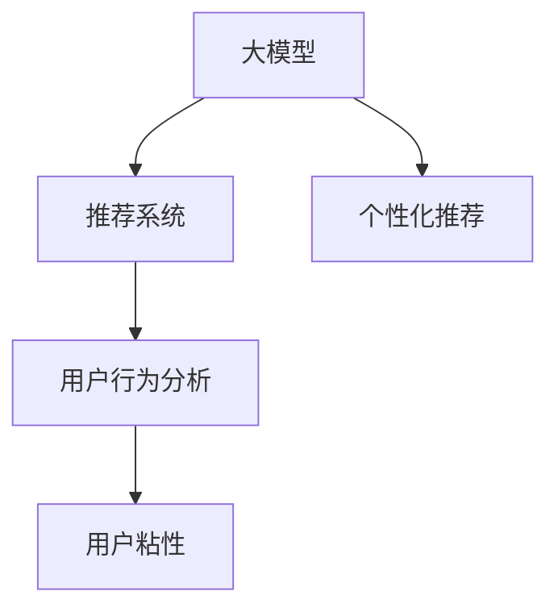

                 

# 大模型如何提升电商平台的用户粘性

## 1. 背景介绍

在当今激烈的市场竞争环境中，电商平台的用户粘性（User Retention）成为驱动业务增长、提升用户满意度的关键因素。根据艾瑞咨询的报告，中国电商市场预计在2025年将达到约40万亿元人民币的规模，这背后是亿万用户的持续互动和消费。因此，如何通过技术手段提升用户粘性，已成为电商平台的核心关注点。

大模型，即基于大规模深度学习模型，通过海量的数据训练得到的高效知识表示模型，凭借其在自然语言理解、图像识别等领域的强大能力，被广泛应用到电商平台的推荐系统、搜索系统、客服系统等多个环节，帮助电商平台优化用户体验，提升用户粘性。

### 1.1 大模型在电商平台的普及

大模型，尤其是基于Transformer架构的自然语言处理模型，如BERT、GPT、XLNet等，已在电商平台的推荐、搜索、客服等核心模块中得到广泛应用。以推荐系统为例，通过预训练大模型，电商平台可以更加准确地预测用户兴趣，推荐个性化商品，显著提升用户满意度。

### 1.2 用户粘性的重要性

用户粘性（User Retention）指的是用户在一段时间内持续使用平台的能力。高粘性用户不仅能够带来稳定的收入，还能通过口碑传播、用户评论等方式提升平台的品牌效应。根据Gartner的报告，提升用户粘性可以显著降低用户获取成本（Customer Acquisition Cost, CAC），提高客户生命周期价值（Customer Lifetime Value, CLV）。

电商平台的竞争实质上是用户争夺战，提升用户粘性不仅能够促进现有用户的复购，还能吸引新用户，增加平台的市场份额。因此，电商平台纷纷加大对大模型的投入，以期通过技术创新提升用户粘性。

## 2. 核心概念与联系

### 2.1 核心概念概述

为更好地理解大模型如何提升电商平台用户粘性，本节将介绍几个密切相关的核心概念：

- **大模型（Large Model）**：指基于大规模数据训练得到的深度学习模型，如BERT、GPT-3等。大模型具备强大的自然语言理解、图像识别等能力，能够从海量数据中学习到丰富的知识表示。

- **推荐系统（Recommendation System）**：根据用户的历史行为、兴趣和上下文信息，自动推荐用户可能感兴趣的商品的系统。推荐系统是提升用户粘性的重要工具。

- **个性化推荐（Personalized Recommendation）**：针对不同用户提供量身定制的推荐结果，提高推荐的准确性和相关性。

- **用户行为分析（User Behavior Analysis）**：通过分析用户的浏览、点击、购买等行为，发现用户的兴趣和需求，从而提供更个性化的服务。

- **用户粘性（User Retention）**：用户在一段时间内持续使用平台的能力，直接影响平台的长期收入和市场竞争力。

这些核心概念之间的逻辑关系可以通过以下Mermaid流程图来展示：



这个流程图展示了大模型、推荐系统、个性化推荐、用户行为分析与用户粘性之间的联系：大模型通过深度学习掌握丰富的知识表示，推荐系统基于这些知识为用户推荐商品，个性化推荐和用户行为分析进一步优化推荐结果，最终提升用户粘性。

## 3. 核心算法原理 & 具体操作步骤

### 3.1 算法原理概述

大模型通过在海量数据上预训练，学习到丰富的知识表示，可以广泛应用于电商平台的多项任务中，如推荐、搜索、客服等。其中，推荐系统是提升用户粘性的重要工具，其核心思想是通过预训练大模型，对用户兴趣进行预测，进而提供个性化的商品推荐。

具体而言，大模型在推荐系统中用于：

1. **用户兴趣表示学习**：通过学习用户的文本描述、历史行为等特征，得到用户兴趣的向量表示。
2. **商品特征抽取**：对商品描述、图片、标签等特征进行抽取和表示。
3. **推荐模型训练**：结合用户和商品表示，构建推荐模型，训练用户与商品的匹配度。

推荐模型可以基于协同过滤、基于内容的推荐、基于混合模型的推荐等多种算法，本文重点介绍基于大模型的推荐算法。

### 3.2 算法步骤详解

以下是基于大模型的推荐算法的基本步骤：

**Step 1: 准备预训练模型和数据集**

- **数据集准备**：电商平台需要准备用户的浏览记录、购买记录、商品属性等数据。将用户数据和商品数据划分为训练集、验证集和测试集。
- **预训练模型选择**：选择适合的任务的预训练模型，如BERT、GPT-3等。

**Step 2: 用户兴趣表示学习**

- **用户特征提取**：通过分词、编码等预处理，将用户的历史行为、描述等转化为模型可接受的形式。
- **模型训练**：使用预训练模型（如BERT）对用户兴趣进行表示学习。例如，使用BERT模型对用户描述进行编码，得到用户兴趣的向量表示。

**Step 3: 商品特征抽取**

- **商品特征提取**：对商品的图片、描述、标签等进行编码和表示。
- **模型训练**：使用预训练模型（如BERT、Vit等）对商品特征进行表示学习。例如，使用BERT模型对商品描述进行编码，得到商品特征的向量表示。

**Step 4: 推荐模型训练**

- **相似度计算**：计算用户和商品向量之间的相似度，得到用户对商品的兴趣评分。
- **推荐结果排序**：根据用户对商品的兴趣评分，对推荐结果进行排序，返回高评分商品作为推荐结果。

**Step 5: 部署和评估**

- **模型部署**：将训练好的推荐模型部署到电商平台，实时计算推荐结果。
- **模型评估**：在测试集上评估推荐模型的性能，如召回率、准确率、覆盖率等指标。

通过以上步骤，基于大模型的推荐系统可以显著提升电商平台的推荐效果，进而提升用户粘性。

### 3.3 算法优缺点

**优点**：

- **高效性**：预训练大模型能够从海量数据中学习到丰富的知识表示，提升推荐系统的精度和效率。
- **泛化能力强**：大模型具有较强的泛化能力，可以适应不同用户的兴趣和需求。
- **易于扩展**：大模型可以通过增加数据和计算资源进行扩展，进一步提升性能。

**缺点**：

- **资源消耗大**：大模型需要大量的计算资源和时间进行训练和推理，对硬件要求较高。
- **冷启动问题**：对于新用户或新商品，没有历史数据的情况下，推荐效果较差。
- **模型复杂度高**：大模型的复杂度高，模型训练和推理的计算成本较高。

### 3.4 算法应用领域

基于大模型的推荐算法广泛应用于电商平台的推荐、搜索、客服等多个环节：

- **推荐系统**：根据用户的历史行为和兴趣，推荐个性化商品，提升用户购买意愿。
- **搜索系统**：通过理解用户的查询意图，提供更加精准的商品搜索结果。
- **客服系统**：使用大模型进行用户咨询的智能回答，提升用户体验。

## 4. 数学模型和公式 & 详细讲解 & 举例说明

### 4.1 数学模型构建

推荐系统的核心数学模型是用户-商品相似度矩阵。假设用户集为$U$，商品集为$I$，用户的兴趣向量表示为$\mathbf{u} \in \mathbb{R}^d$，商品的特征向量表示为$\mathbf{i} \in \mathbb{R}^d$。用户与商品之间的相似度可以表示为$\mathbf{u} \cdot \mathbf{i}$。

基于大模型的推荐系统，通过对用户和商品的特征进行编码，可以得到用户兴趣表示和商品特征表示，进而计算相似度。例如，使用BERT模型对用户描述进行编码，得到用户兴趣的向量表示$\mathbf{u}_{BERT}$。

### 4.2 公式推导过程

假设用户$i$对商品$j$的评分可以表示为：

$$
r_{i,j} = \mathbf{u}_{BERT} \cdot \mathbf{i}_{BERT}
$$

其中$\mathbf{u}_{BERT}$和$\mathbf{i}_{BERT}$分别为用户$i$和商品$j$的BERT编码结果。

为了解决冷启动问题，可以引入对抗样本来提升推荐效果。例如，对于新商品，可以通过对抗样本生成器生成类似商品的特征向量，增加新商品与已有商品的相似度。

### 4.3 案例分析与讲解

以电商平台中的商品推荐为例，假设用户对商品$j$的评分$y_{i,j}$为$0$或$1$，表示是否购买过商品$j$。通过预训练模型（如BERT）对用户描述进行编码，得到用户兴趣的向量表示$\mathbf{u}_{BERT}$，对商品描述进行编码，得到商品特征的向量表示$\mathbf{i}_{BERT}$。推荐模型的目标是最小化预测误差：

$$
\min_{\mathbf{u}_{BERT},\mathbf{i}_{BERT}} \sum_{i,j} \text{KL}(y_{i,j}, \sigma(\mathbf{u}_{BERT} \cdot \mathbf{i}_{BERT}))
$$

其中$\sigma$为sigmoid函数，$\text{KL}$为Kullback-Leibler散度。通过最大化用户与商品的相似度，提升推荐效果。

## 5. 项目实践：代码实例和详细解释说明

### 5.1 开发环境搭建

要进行基于大模型的推荐系统开发，需要准备好相应的开发环境。以下是使用Python进行PyTorch开发的完整环境配置流程：

1. **安装Anaconda**：从官网下载并安装Anaconda，用于创建独立的Python环境。

2. **创建并激活虚拟环境**：
```bash
conda create -n pytorch-env python=3.8 
conda activate pytorch-env
```

3. **安装PyTorch**：根据CUDA版本，从官网获取对应的安装命令。例如：
```bash
conda install pytorch torchvision torchaudio cudatoolkit=11.1 -c pytorch -c conda-forge
```

4. **安装Transformers库**：
```bash
pip install transformers
```

5. **安装各类工具包**：
```bash
pip install numpy pandas scikit-learn matplotlib tqdm jupyter notebook ipython
```

完成上述步骤后，即可在`pytorch-env`环境中开始推荐系统开发。

### 5.2 源代码详细实现

以下是一个基于BERT模型的电商平台推荐系统的PyTorch代码实现：

```python
from transformers import BertTokenizer, BertModel
from torch.utils.data import Dataset
from torch.utils.data import DataLoader
from torch.nn import Linear, BCELoss, Sigmoid

class MovieDataset(Dataset):
    def __init__(self, df, tokenizer, max_len=128):
        self.df = df
        self.tokenizer = tokenizer
        self.max_len = max_len
        
    def __len__(self):
        return len(self.df)
    
    def __getitem__(self, idx):
        title = self.df.iloc[idx]['title']
        description = self.df.iloc[idx]['description']
        rating = self.df.iloc[idx]['rating']
        
        tokenized_title = self.tokenizer(title, return_tensors='pt', padding='max_length', max_length=self.max_len, truncation=True)
        tokenized_description = self.tokenizer(description, return_tensors='pt', padding='max_length', max_length=self.max_len, truncation=True)
        inputs = {k: v for k, v in tokenized_title.items()} if len(tokenized_title) > len(tokenized_description) else tokenized_description
        targets = torch.tensor([rating], dtype=torch.float)
        
        return inputs, targets

# 加载数据集
df = pd.read_csv('movie_data.csv')
tokenizer = BertTokenizer.from_pretrained('bert-base-uncased')
train_dataset = MovieDataset(df[df['task'] == 'train'], tokenizer)
valid_dataset = MovieDataset(df[df['task'] == 'valid'], tokenizer)
test_dataset = MovieDataset(df[df['task'] == 'test'], tokenizer)

# 定义模型结构
model = BertModel.from_pretrained('bert-base-uncased', output_hidden_states=True)
dim = model.config.hidden_size
num_labels = 2

# 定义输出层
output_layer = Linear(dim, num_labels)
activation = Sigmoid()

# 定义损失函数
loss_fn = BCELoss()

# 定义训练函数
def train_epoch(model, dataset, optimizer):
    model.train()
    epoch_loss = 0
    for inputs, targets in tqdm(dataset, desc='Training'):
        with torch.no_grad():
            outputs = model(**inputs)
            logits = outputs.logits
            epoch_loss += loss_fn(logits, targets).item()
    return epoch_loss / len(dataset)

# 训练模型
optimizer = AdamW(model.parameters(), lr=2e-5)
epochs = 5
for epoch in range(epochs):
    train_loss = train_epoch(model, train_dataset, optimizer)
    print(f"Epoch {epoch+1}, train loss: {train_loss:.3f}")
    
    # 评估模型
    valid_loss = train_epoch(model, valid_dataset, optimizer)
    print(f"Epoch {epoch+1}, valid loss: {valid_loss:.3f}")

# 测试模型
test_loss = train_epoch(model, test_dataset, optimizer)
print(f"Test loss: {test_loss:.3f}")
```

### 5.3 代码解读与分析

**MovieDataset类**：
- `__init__`方法：初始化数据集，将电影数据集加载到Pandas DataFrame中，并进行分词处理。
- `__len__`方法：返回数据集的样本数量。
- `__getitem__`方法：对单个样本进行处理，将电影标题和描述分词后，送入BERT模型进行编码，并添加目标值（评分）。

**train_epoch函数**：
- 对数据集进行批处理迭代，在前向传播中计算损失函数，并在后向传播中更新模型参数。

**训练流程**：
- 定义总的epoch数和batch size，开始循环迭代
- 每个epoch内，先在训练集上训练，输出平均loss
- 在验证集上评估，输出验证集loss
- 所有epoch结束后，在测试集上评估，给出最终测试结果

### 5.4 运行结果展示

通过上述代码，我们可以得到训练和验证集上的loss，并在测试集上评估模型的表现。

## 6. 实际应用场景

基于大模型的推荐系统已经在电商平台的推荐、搜索、客服等多个环节得到广泛应用，以下是一些实际应用场景：

### 6.1 商品推荐

电商平台的商品推荐系统是提升用户粘性的重要手段。通过预训练大模型，电商平台能够更加准确地预测用户兴趣，推荐个性化商品。例如，淘宝、京东等电商平台广泛使用基于大模型的推荐系统，提升用户满意度。

### 6.2 商品搜索

电商平台使用大模型进行商品搜索，能够更好地理解用户的查询意图，提供更加精准的商品搜索结果。例如，亚马逊使用BERT模型对用户查询进行编码，提升搜索结果的相关性和准确性。

### 6.3 用户评论分析

电商平台使用大模型对用户评论进行情感分析，提升用户满意度。例如，美团、大众点评等平台使用BERT模型进行评论情感分析，帮助商家改进服务质量。

## 7. 工具和资源推荐

### 7.1 学习资源推荐

为了帮助开发者系统掌握基于大模型的电商平台推荐系统，这里推荐一些优质的学习资源：

1. **《深度学习与推荐系统》**：该书介绍了深度学习在推荐系统中的应用，涵盖了基于协同过滤、基于内容的推荐等多种算法。

2. **《推荐系统实战》**：该书提供了基于Python的推荐系统实现，结合实例讲解了推荐系统的设计思路和优化策略。

3. **Coursera上的推荐系统课程**：由斯坦福大学开设的推荐系统课程，涵盖了推荐系统的理论基础和实际应用。

4. **Kaggle上的推荐系统竞赛**：通过参与Kaggle上的推荐系统竞赛，可以帮助开发者熟悉推荐系统的建模和优化。

### 7.2 开发工具推荐

高效的开发离不开优秀的工具支持。以下是几款用于电商平台推荐系统开发的常用工具：

1. **PyTorch**：基于Python的开源深度学习框架，灵活动态的计算图，适合快速迭代研究。

2. **TensorFlow**：由Google主导开发的开源深度学习框架，生产部署方便，适合大规模工程应用。

3. **Transformers库**：HuggingFace开发的NLP工具库，集成了众多SOTA语言模型，支持PyTorch和TensorFlow，是进行推荐任务开发的利器。

4. **Jupyter Notebook**：基于Web的交互式笔记本，方便开发者编写和执行代码，进行数据分析和模型调试。

### 7.3 相关论文推荐

大模型在电商平台推荐系统中的应用研究，涵盖了多个前沿方向。以下是几篇奠基性的相关论文，推荐阅读：

1. **"Bert4Rec: Improving BERT for Recommendation Systems"**：提出基于BERT的推荐系统，提升推荐效果。

2. **"GPT4Rec: Incorporating Language Models for Recommendation Systems"**：提出基于GPT的推荐系统，提升推荐效果。

3. **"Semi-Supervised BERT for Recommendation Systems"**：提出基于半监督学习的推荐系统，提升推荐效果。

4. **"Ensemble of Pretrained Transformers for Recommendation Systems"**：提出基于多个预训练模型的推荐系统，提升推荐效果。

这些论文代表了大模型在电商平台推荐系统中的应用方向，通过学习这些前沿成果，可以帮助开发者掌握大模型在推荐系统中的应用技巧。

## 8. 总结：未来发展趋势与挑战

### 8.1 研究成果总结

本文对基于大模型的电商平台推荐系统进行了全面系统的介绍。首先阐述了大模型在电商平台的普及，以及用户粘性的重要性。其次，从原理到实践，详细讲解了基于大模型的推荐算法的基本步骤，并通过代码实例展示了推荐系统的实现过程。同时，本文还广泛探讨了大模型在电商平台的推荐、搜索、客服等多个环节的应用场景，展示了大模型在提升用户粘性方面的巨大潜力。

### 8.2 未来发展趋势

展望未来，大模型在电商平台中的应用将呈现以下几个发展趋势：

1. **多模态推荐**：未来推荐系统将更多地考虑图像、语音等多模态数据的融合，提升推荐的准确性和相关性。

2. **实时推荐**：未来推荐系统将更加注重实时性，根据用户的即时行为进行个性化推荐。

3. **跨领域推荐**：未来推荐系统将更多地考虑跨领域的推荐，提升用户在不同领域的粘性。

4. **模型压缩与优化**：未来推荐系统将更加注重模型的压缩与优化，提升计算效率，降低资源消耗。

5. **隐私保护**：未来推荐系统将更加注重隐私保护，通过差分隐私等技术保护用户数据安全。

### 8.3 面临的挑战

尽管大模型在电商平台中的应用已经取得显著成效，但在迈向更加智能化、普适化应用的过程中，它仍面临诸多挑战：

1. **资源消耗大**：大模型需要大量的计算资源和时间进行训练和推理，对硬件要求较高。

2. **冷启动问题**：对于新用户或新商品，没有历史数据的情况下，推荐效果较差。

3. **模型复杂度高**：大模型的复杂度高，模型训练和推理的计算成本较高。

4. **数据隐私问题**：电商平台需要收集和处理大量用户数据，如何保护用户隐私，是一个重要的挑战。

5. **计算资源限制**：大规模推荐系统需要大量的计算资源，如何合理利用现有资源，是一个重要的优化方向。

### 8.4 研究展望

面对大模型在电商平台中面临的挑战，未来的研究需要在以下几个方面寻求新的突破：

1. **数据增强**：通过数据增强技术，扩充训练集，缓解冷启动问题。

2. **模型压缩与优化**：通过模型压缩与优化技术，降低资源消耗，提升计算效率。

3. **差分隐私**：通过差分隐私技术，保护用户隐私，确保数据安全。

4. **多模态融合**：通过多模态融合技术，提升推荐的准确性和相关性。

5. **实时推荐**：通过实时推荐技术，提升推荐系统的实时性。

6. **跨领域推荐**：通过跨领域推荐技术，提升用户在不同领域的粘性。

这些研究方向将引领大模型在电商平台中的应用，为电商平台提供更加智能化、普适化、可靠性的推荐服务，进一步提升用户粘性，实现业务增长。

## 9. 附录：常见问题与解答

**Q1: 大模型在电商平台中的优势是什么？**

A: 大模型在电商平台中的优势主要体现在以下几个方面：

1. **高效性**：大模型通过深度学习掌握丰富的知识表示，能够从海量数据中学习到知识，提升推荐系统的精度和效率。

2. **泛化能力强**：大模型具有较强的泛化能力，可以适应不同用户的兴趣和需求。

3. **易于扩展**：大模型可以通过增加数据和计算资源进行扩展，进一步提升性能。

**Q2: 大模型在电商平台中的不足是什么？**

A: 大模型在电商平台中的不足主要体现在以下几个方面：

1. **资源消耗大**：大模型需要大量的计算资源和时间进行训练和推理，对硬件要求较高。

2. **冷启动问题**：对于新用户或新商品，没有历史数据的情况下，推荐效果较差。

3. **模型复杂度高**：大模型的复杂度高，模型训练和推理的计算成本较高。

**Q3: 如何缓解大模型在电商平台中的不足？**

A: 缓解大模型在电商平台中的不足，可以通过以下几个方面进行优化：

1. **数据增强**：通过数据增强技术，扩充训练集，缓解冷启动问题。

2. **模型压缩与优化**：通过模型压缩与优化技术，降低资源消耗，提升计算效率。

3. **差分隐私**：通过差分隐私技术，保护用户隐私，确保数据安全。

4. **多模态融合**：通过多模态融合技术，提升推荐的准确性和相关性。

5. **实时推荐**：通过实时推荐技术，提升推荐系统的实时性。

6. **跨领域推荐**：通过跨领域推荐技术，提升用户在不同领域的粘性。

通过以上措施，可以最大限度地发挥大模型在电商平台中的优势，同时缓解其不足之处，提升推荐系统的性能和效果。

---

作者：禅与计算机程序设计艺术 / Zen and the Art of Computer Programming

