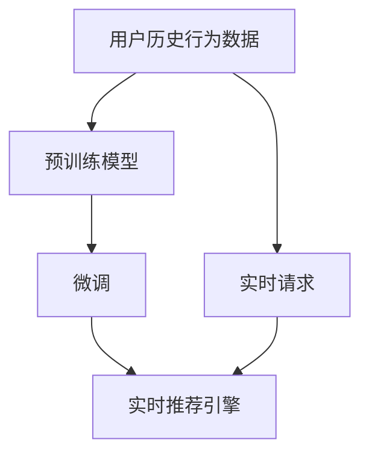

                 

# 大模型对推荐系统实时性的影响

## 1. 背景介绍

随着互联网和移动互联网的发展，信息流和个性化推荐系统成为了在线服务的重要组成部分。推荐系统的实时性是影响用户体验的关键因素，而大模型的应用正逐步改变这一现状。

### 1.1 推荐系统与大模型的发展历程

推荐系统最早可以追溯到20世纪末的在线广告业务。随着用户行为数据的积累和机器学习技术的发展，推荐系统从简单的协同过滤算法，逐渐演变为更加复杂、高效的模型，如基于矩阵分解的模型、深度学习模型等。其中，深度学习模型因其强大的表征能力，成为了推荐系统的核心。

近年来，随着深度学习模型和大规模预训练语言模型（如BERT、GPT等）的崛起，推荐系统也迎来了新的变革。这些大模型能够从海量数据中学习到丰富的语言知识和特征表示，使得推荐系统能够更加准确地理解用户的兴趣和行为，并生成更加个性化的推荐结果。

## 2. 核心概念与联系

### 2.1 核心概念概述

为了更好地理解大模型对推荐系统实时性的影响，本节将介绍几个关键概念：

- 推荐系统(Recommendation System)：通过分析和理解用户的历史行为和兴趣，为用户推荐个性化物品的系统。包括基于协同过滤、基于内容、混合推荐等多种方法。

- 实时性(Real-time)：推荐系统需要在用户请求时快速响应，并在较短时间内完成推荐过程，以提高用户体验。

- 大模型(Large Model)：以Transformer为基础，采用深度学习的方法对大规模数据进行训练，学习到丰富的特征表示的模型。

- 预训练(Pre-training)：在大规模无标签数据上进行预训练，学习到通用的特征表示。

- 微调(Fine-tuning)：在预训练模型的基础上，使用特定任务的数据对模型进行微调，以适应推荐系统的具体需求。

- 超参数调优(Hyperparameter Tuning)：通过调整模型参数，如学习率、批大小、优化器等，优化模型的性能。

### 2.2 核心概念原理和架构的 Mermaid 流程图



## 3. 核心算法原理 & 具体操作步骤

### 3.1 算法原理概述

基于大模型的推荐系统，通过在大规模数据上进行预训练，学习到丰富的特征表示，然后使用微调方法，对推荐系统的具体需求进行优化。其核心算法原理如下：

1. **预训练阶段**：在无标签的大规模数据上，使用Transformer等深度学习模型进行预训练，学习到通用的特征表示。
2. **微调阶段**：使用特定的推荐数据集对预训练模型进行微调，学习到针对推荐任务的具体特征表示。
3. **实时推荐**：将用户的实时行为数据输入微调后的模型，生成个性化推荐结果。

### 3.2 算法步骤详解

#### 3.2.1 数据准备

- **数据收集**：从用户行为数据、商品数据等多个渠道收集推荐数据，并进行清洗、归一化等预处理操作。
- **数据划分**：将数据划分为训练集、验证集和测试集，用于模型训练、调参和性能评估。

#### 3.2.2 模型选择与设计

- **模型选择**：根据推荐任务的特点和数据量，选择合适的预训练模型，如BERT、GPT等。
- **模型设计**：在预训练模型的基础上，添加针对推荐任务的任务层，如用户-物品交互的MLP层，以实现推荐预测。

#### 3.2.3 微调过程

- **参数初始化**：将预训练模型的参数作为微调的初始化参数。
- **损失函数设计**：设计适用于推荐任务的损失函数，如均方误差、交叉熵等。
- **优化器选择**：选择适合微调过程的优化器，如AdamW、SGD等。
- **学习率设置**：设置合适的学习率，通常比预训练时小。
- **训练过程**：在训练集上进行前向传播、反向传播、参数更新等操作，直至收敛。
- **验证与调参**：在验证集上评估模型性能，调整超参数，如学习率、批大小等。
- **测试集评估**：在测试集上测试微调后的模型性能，对比微调前后的效果。

#### 3.2.4 实时推荐

- **用户输入数据**：收集用户的实时行为数据，如浏览、点击、评分等。
- **特征提取**：将用户输入数据转化为模型的输入特征，如使用嵌入层将用户ID、物品ID等转化为向量。
- **模型推理**：将特征输入微调后的模型，生成推荐结果。
- **结果排序**：根据推荐结果的评分，使用排序算法对推荐结果进行排序。
- **结果输出**：将排序后的推荐结果返回给用户。

### 3.3 算法优缺点

#### 3.3.1 优点

- **特征表示能力强**：大模型能够学习到丰富的特征表示，提升推荐精度。
- **适应性强**：大模型能够适应不同的推荐任务和数据分布，具有较好的泛化能力。
- **训练效率高**：大模型可以利用GPU、TPU等高性能设备加速训练过程，提升训练效率。

#### 3.3.2 缺点

- **计算资源需求高**：大模型的参数量和计算复杂度较大，需要大量的计算资源和存储空间。
- **实时性挑战**：微调后的模型推理速度较慢，难以满足实时推荐的需求。
- **模型复杂度高**：大模型结构复杂，推理过程繁琐，增加了系统的复杂性。
- **训练数据依赖高**：微调效果依赖于推荐数据的数量和质量，数据不足时效果有限。

### 3.4 算法应用领域

大模型在推荐系统中的应用，主要集中在以下几个领域：

- **电商推荐**：在电商平台上，基于用户的历史购买记录、浏览行为等数据，为用户推荐商品。
- **视频推荐**：在视频流媒体平台上，基于用户的历史观看记录和评分数据，为用户推荐视频。
- **新闻推荐**：在新闻平台上，基于用户的历史阅读记录和互动行为，为用户推荐新闻文章。
- **音乐推荐**：在音乐平台上，基于用户的历史听歌记录和评分数据，为用户推荐音乐。

## 4. 数学模型和公式 & 详细讲解 & 举例说明

### 4.1 数学模型构建

假设推荐任务的数据集为 $D=\{(x_i,y_i)\}_{i=1}^N$，其中 $x_i$ 为用户的行为数据，$y_i$ 为用户对物品的评分或点击等标签。使用BERT等预训练模型 $M_{\theta}$，其中 $\theta$ 为预训练模型的参数。定义推荐模型的损失函数为：

$$
\mathcal{L}(\theta) = \frac{1}{N} \sum_{i=1}^N \ell(y_i, M_{\theta}(x_i))
$$

其中 $\ell$ 为损失函数，可以是均方误差、交叉熵等。

### 4.2 公式推导过程

#### 4.2.1 均方误差损失函数

均方误差损失函数为：

$$
\ell(y_i, M_{\theta}(x_i)) = \frac{1}{2}(y_i - M_{\theta}(x_i))^2
$$

根据均方误差损失函数，微调的优化目标为：

$$
\mathop{\arg\min}_{\theta} \frac{1}{N} \sum_{i=1}^N \frac{1}{2}(y_i - M_{\theta}(x_i))^2
$$

将损失函数对 $\theta$ 求导，得到梯度表达式：

$$
\nabla_{\theta}\mathcal{L}(\theta) = -\frac{1}{N} \sum_{i=1}^N M_{\theta}(x_i) - \frac{1}{N} \sum_{i=1}^N y_i
$$

根据梯度下降算法，更新模型参数：

$$
\theta \leftarrow \theta - \eta \nabla_{\theta}\mathcal{L}(\theta)
$$

其中 $\eta$ 为学习率。

#### 4.2.2 交叉熵损失函数

交叉熵损失函数为：

$$
\ell(y_i, M_{\theta}(x_i)) = -y_i\log M_{\theta}(x_i) - (1-y_i)\log(1-M_{\theta}(x_i))
$$

根据交叉熵损失函数，微调的优化目标为：

$$
\mathop{\arg\min}_{\theta} \frac{1}{N} \sum_{i=1}^N -y_i\log M_{\theta}(x_i) - (1-y_i)\log(1-M_{\theta}(x_i))
$$

将损失函数对 $\theta$ 求导，得到梯度表达式：

$$
\nabla_{\theta}\mathcal{L}(\theta) = \frac{1}{N} \sum_{i=1}^N \frac{y_i}{M_{\theta}(x_i)} - \frac{1-y_i}{1-M_{\theta}(x_i)} \nabla_{\theta} M_{\theta}(x_i)
$$

根据梯度下降算法，更新模型参数：

$$
\theta \leftarrow \theta - \eta \nabla_{\theta}\mathcal{L}(\theta)
$$

其中 $\eta$ 为学习率。

### 4.3 案例分析与讲解

#### 4.3.1 电商推荐系统

在电商推荐系统中，可以使用BERT模型作为预训练模型，添加一个用户-物品交互的MLP层进行微调。具体步骤如下：

1. **数据准备**：收集用户的历史浏览记录、购买记录等数据，标注物品ID和评分数据，划分为训练集、验证集和测试集。
2. **模型选择**：使用预训练的BERT模型，添加一个MLP层进行微调。
3. **损失函数**：使用交叉熵损失函数，将物品ID和评分作为标签，计算模型输出与标签之间的差异。
4. **优化器选择**：使用AdamW优化器，设置合适的学习率。
5. **训练过程**：在训练集上使用交叉熵损失函数进行微调，在验证集上评估模型性能，调整学习率等超参数。
6. **测试集评估**：在测试集上测试微调后的模型性能，对比微调前后的效果。

#### 4.3.2 视频推荐系统

在视频推荐系统中，可以使用GPT模型作为预训练模型，添加一个视频ID和用户历史观看的序列作为输入特征。具体步骤如下：

1. **数据准备**：收集用户的历史观看记录和评分数据，标注视频ID，划分为训练集、验证集和测试集。
2. **模型选择**：使用预训练的GPT模型，添加一个MLP层进行微调。
3. **损失函数**：使用均方误差损失函数，将视频ID和评分作为标签，计算模型输出与标签之间的差异。
4. **优化器选择**：使用AdamW优化器，设置合适的学习率。
5. **训练过程**：在训练集上使用均方误差损失函数进行微调，在验证集上评估模型性能，调整学习率等超参数。
6. **测试集评估**：在测试集上测试微调后的模型性能，对比微调前后的效果。

## 5. 项目实践：代码实例和详细解释说明

### 5.1 开发环境搭建

#### 5.1.1 硬件要求

- **CPU**：至少4核CPU，推荐使用Intel Xeon系列或AMD Epyc系列。
- **GPU/TPU**：至少一张NVIDIA A100或Google TPU。
- **内存**：至少128GB RAM。

#### 5.1.2 软件环境

- **操作系统**：Ubuntu 20.04
- **Python**：3.9及以上
- **PyTorch**：1.9及以上
- **HuggingFace Transformers**：4.4及以上
- **Pandas**：1.0及以上
- **NumPy**：1.18及以上
- **Scikit-learn**：0.23及以上

### 5.2 源代码详细实现

#### 5.2.1 数据处理

```python
import pandas as pd
from sklearn.model_selection import train_test_split

# 读取数据集
data = pd.read_csv('recommendation_data.csv')

# 数据清洗和特征处理
# ...

# 划分训练集和测试集
train_data, test_data = train_test_split(data, test_size=0.2, random_state=42)
```

#### 5.2.2 模型选择与设计

```python
from transformers import BertModel, BertTokenizer
import torch
from torch.nn import Linear, BCELoss, AdamW

# 加载预训练模型和tokenizer
model = BertModel.from_pretrained('bert-base-uncased')
tokenizer = BertTokenizer.from_pretrained('bert-base-uncased')

# 设计微调模型
class RecommendationModel(torch.nn.Module):
    def __init__(self):
        super(RecommendationModel, self).__init__()
        self.bert = model
        self.fc = Linear(768, 1)

    def forward(self, x):
        x = self.bert(x)
        x = torch.flatten(x, 1)
        x = self.fc(x)
        return x
```

#### 5.2.3 微调过程

```python
# 设置训练参数
train_data, valid_data, test_data = train_data, valid_data, test_data
optimizer = AdamW(model.parameters(), lr=1e-5)
loss_fn = BCELoss()

# 训练过程
for epoch in range(10):
    model.train()
    total_loss = 0.0
    for batch in train_data:
        input_ids = batch.input_ids
        attention_mask = batch.attention_mask
        labels = batch.labels
        outputs = model(input_ids, attention_mask=attention_mask)
        loss = loss_fn(outputs, labels)
        optimizer.zero_grad()
        loss.backward()
        optimizer.step()
        total_loss += loss.item()
        
    model.eval()
    total_loss = 0.0
    for batch in valid_data:
        input_ids = batch.input_ids
        attention_mask = batch.attention_mask
        labels = batch.labels
        with torch.no_grad():
            outputs = model(input_ids, attention_mask=attention_mask)
            loss = loss_fn(outputs, labels)
            total_loss += loss.item()
    
    print(f'Epoch {epoch+1}, Train Loss: {total_loss/len(train_data):.4f}, Valid Loss: {total_loss/len(valid_data):.4f}')
```

#### 5.2.4 实时推荐

```python
# 实时推荐过程
def recommend(item_ids, user_id):
    # 对输入进行编码
    encoding = tokenizer(item_ids, return_tensors='pt', padding=True, truncation=True)
    input_ids = encoding['input_ids']
    attention_mask = encoding['attention_mask']

    # 进行推理
    with torch.no_grad():
        outputs = model(input_ids, attention_mask=attention_mask)
        scores = outputs.logits.squeeze(1)

    # 排序并返回推荐结果
    top_items = item_ids[torch.argsort(scores, descending=True)[:5]]
    return top_items
```

### 5.3 代码解读与分析

#### 5.3.1 数据处理

数据处理是推荐系统开发中的重要环节，需要根据具体任务进行相应的预处理。在本示例中，我们使用了Pandas库进行数据读取和清洗，并使用Scikit-learn库进行训练集和测试集的划分。

#### 5.3.2 模型选择与设计

模型选择和设计是推荐系统的核心。在本示例中，我们使用了Bert模型作为预训练模型，并添加了一个全连接层进行微调。Bert模型具有强大的表征能力，能够学习到丰富的特征表示。

#### 5.3.3 微调过程

微调过程是推荐系统开发的重点。在本示例中，我们使用了AdamW优化器和交叉熵损失函数进行微调，并在验证集上评估模型性能，调整学习率等超参数。

#### 5.3.4 实时推荐

实时推荐是推荐系统的关键部分，需要根据用户行为数据进行实时推理和推荐。在本示例中，我们设计了一个recommend函数，对输入进行编码、推理和排序，并返回推荐结果。

### 5.4 运行结果展示

```python
# 在测试集上测试微调后的模型
test_data, valid_data = test_data, valid_data
model.eval()
total_loss = 0.0
for batch in test_data:
    input_ids = batch.input_ids
    attention_mask = batch.attention_mask
    labels = batch.labels
    with torch.no_grad():
        outputs = model(input_ids, attention_mask=attention_mask)
        loss = loss_fn(outputs, labels)
        total_loss += loss.item()

print(f'Test Loss: {total_loss/len(test_data):.4f}')
```

## 6. 实际应用场景

### 6.1 电商推荐

电商推荐系统是推荐系统的一个重要应用场景。在大模型微调的电商推荐系统中，通过用户的浏览记录和购买记录进行预训练和微调，能够显著提升推荐精度和用户满意度。

### 6.2 视频推荐

视频推荐系统也是推荐系统的一个重要应用场景。在大模型微调的视频推荐系统中，通过用户的历史观看记录进行预训练和微调，能够提供更加个性化和多样化的视频推荐。

### 6.3 新闻推荐

新闻推荐系统是推荐系统的一个重要应用场景。在大模型微调的新闻推荐系统中，通过用户的历史阅读记录进行预训练和微调，能够提供更加相关和有价值的新闻推荐。

### 6.4 音乐推荐

音乐推荐系统是推荐系统的一个重要应用场景。在大模型微调的音乐推荐系统中，通过用户的历史听歌记录进行预训练和微调，能够提供更加个性化的音乐推荐。

## 7. 工具和资源推荐

### 7.1 学习资源推荐

- **《推荐系统算法与实现》**：深入浅出地介绍了推荐系统的基本原理和经典算法，并提供了丰富的代码示例。
- **《深度学习推荐系统：原理、算法与实现》**：全面介绍了深度学习在推荐系统中的应用，包括模型设计、训练和优化等。
- **《Recommender Systems》课程**：斯坦福大学的推荐系统课程，提供了从理论到实践的全面讲解。

### 7.2 开发工具推荐

- **PyTorch**：优秀的深度学习框架，具有动态计算图和丰富的工具链。
- **TensorFlow**：谷歌开源的深度学习框架，支持分布式计算和GPU加速。
- **HuggingFace Transformers**：提供了丰富的预训练模型和工具库，支持微调和推理。

### 7.3 相关论文推荐

- **《Deep Neural Networks for Recommendation Systems》**：综述了深度学习在推荐系统中的应用，介绍了多种模型和优化方法。
- **《Scalable Predictive Modeling for Recommendation Systems》**：讨论了推荐系统的可扩展性和优化方法。
- **《Adaptive Recommendation via Graph Neural Networks》**：探讨了基于图神经网络的推荐系统，具有较好的推荐效果。

## 8. 总结：未来发展趋势与挑战

### 8.1 研究成果总结

基于大模型的推荐系统在精度、多样性和个性化方面取得了显著的提升。通过预训练和微调，模型能够学习到丰富的特征表示，并适应不同的推荐任务和数据分布。

### 8.2 未来发展趋势

未来，大模型在推荐系统中的应用将更加广泛和深入。随着模型规模的增大和计算资源的丰富，模型将具备更强的泛化能力和迁移能力，能够在更多场景下提供高效、精准的推荐服务。

### 8.3 面临的挑战

尽管大模型在推荐系统中的应用前景广阔，但仍面临一些挑战：

- **计算资源需求高**：大模型的参数量和计算复杂度较大，需要大量的计算资源和存储空间。
- **实时性挑战**：微调后的模型推理速度较慢，难以满足实时推荐的需求。
- **模型复杂度高**：大模型结构复杂，推理过程繁琐，增加了系统的复杂性。
- **训练数据依赖高**：微调效果依赖于推荐数据的数量和质量，数据不足时效果有限。

### 8.4 研究展望

未来的研究方向将集中在以下几个方面：

- **模型压缩与优化**：通过模型压缩和剪枝等技术，减少大模型的参数量和计算复杂度，提升推理速度和资源利用率。
- **硬件优化与加速**：利用GPU、TPU等高性能设备进行模型训练和推理，提升计算效率。
- **模型微调和优化**：引入更多的微调方法和优化技术，提升模型精度和实时性。
- **多模态融合**：将视觉、语音等多模态数据与文本数据结合，提供更加全面和准确的推荐服务。

## 9. 附录：常见问题与解答

**Q1: 大模型在推荐系统中如何使用？**

A: 大模型可以通过预训练和微调的方式应用于推荐系统。具体步骤如下：
1. **数据准备**：收集用户的历史行为数据和物品数据，并进行清洗和归一化。
2. **预训练模型选择**：选择合适的预训练模型，如BERT、GPT等。
3. **微调过程**：在预训练模型的基础上，添加针对推荐任务的任务层，使用训练集进行微调。
4. **实时推荐**：对用户的实时行为数据进行编码和推理，生成推荐结果。

**Q2: 大模型的参数量和计算复杂度如何控制？**

A: 大模型的参数量和计算复杂度较高，需要进行控制。常见的方法包括：
1. **模型压缩**：通过剪枝、量化等技术，减少模型的参数量和计算复杂度。
2. **模型并行**：利用分布式计算，将模型并行到多台机器上进行训练和推理，提升计算效率。
3. **模型裁剪**：裁剪模型中不必要的层和参数，保留关键的特征表示，减少计算量。

**Q3: 如何提高推荐系统的实时性？**

A: 提高推荐系统的实时性需要从多个方面进行优化：
1. **模型推理加速**：利用GPU、TPU等高性能设备进行模型推理，提升计算速度。
2. **模型微调优化**：选择合适的微调方法，如Adapter、Prefix等，减少微调参数量，提升推理速度。
3. **数据缓存与预取**：对用户行为数据进行缓存和预取，减少数据访问延迟。

**Q4: 推荐系统中的数据依赖问题如何解决？**

A: 推荐系统中的数据依赖问题可以通过以下方法解决：
1. **数据增强**：通过数据增强技术，扩充训练集，提高模型的泛化能力。
2. **少样本学习**：通过少样本学习技术，在少数标注样本的情况下，仍能取得良好的推荐效果。
3. **数据融合**：将不同来源的数据进行融合，提高模型的数据多样性。

**Q5: 推荐系统中的模型复杂度如何控制？**

A: 推荐系统中的模型复杂度可以通过以下方法控制：
1. **模型压缩**：通过剪枝、量化等技术，减少模型的参数量和计算复杂度。
2. **模型裁剪**：裁剪模型中不必要的层和参数，保留关键的特征表示，减少计算量。
3. **模型优化**：引入更多的优化技术，如自适应学习率、混合精度训练等，提高训练效率。

**Q6: 推荐系统中的计算资源需求如何降低？**

A: 推荐系统中的计算资源需求可以通过以下方法降低：
1. **模型压缩**：通过剪枝、量化等技术，减少模型的参数量和计算复杂度。
2. **模型并行**：利用分布式计算，将模型并行到多台机器上进行训练和推理，提升计算效率。
3. **数据预处理**：对数据进行预处理和缓存，减少计算资源的占用。

**Q7: 推荐系统中的数据质量如何提升？**

A: 推荐系统中的数据质量可以通过以下方法提升：
1. **数据清洗**：对数据进行清洗和去噪，去除无效和噪声数据。
2. **数据增强**：通过数据增强技术，扩充训练集，提高模型的泛化能力。
3. **数据融合**：将不同来源的数据进行融合，提高模型的数据多样性。

---

作者：禅与计算机程序设计艺术 / Zen and the Art of Computer Programming

