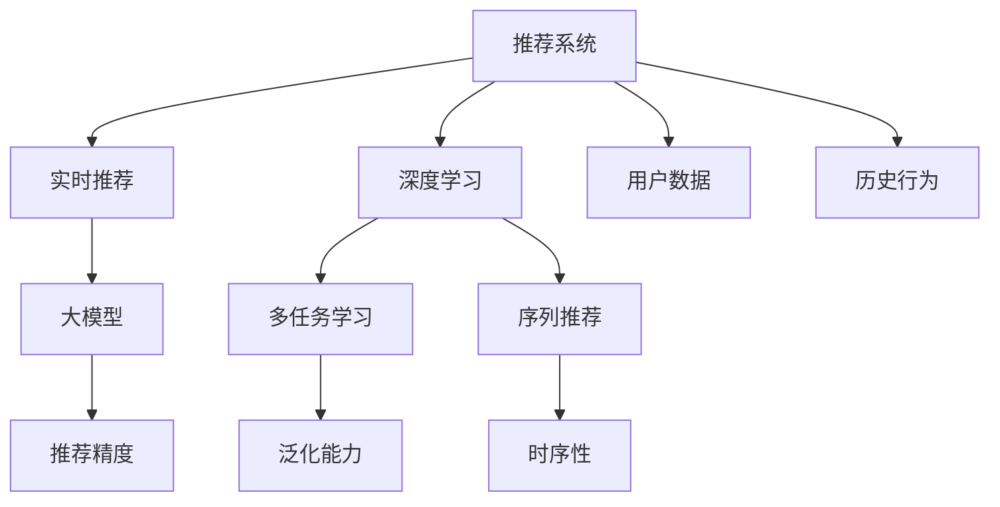

                 

# 大模型对推荐系统实时性能的优化策略

> 关键词：大模型,推荐系统,实时性能,优化策略,深度学习

## 1. 背景介绍

### 1.1 问题由来
随着电子商务和在线媒体的迅速发展，推荐系统已经成为互联网公司不可或缺的核心功能。推荐系统通过分析用户的浏览、点击、购买等行为数据，精准地为用户推荐个性化的商品或内容，从而提高用户满意度和平台收益。但随着用户基数的不断扩大和推荐内容的日益丰富，推荐系统的实时性能问题日益凸显。推荐系统的计算复杂度不断攀升，服务器负担加重，服务质量难以保障。

为了解决这一问题，近年来，研究人员尝试引入大模型（如Transformer、BERT等）来优化推荐系统的实时性能。大模型基于深度学习架构，具备强大的表示学习能力，能够对大规模数据进行高效处理，具有广阔的应用前景。通过将大模型引入推荐系统，可以在保证推荐精度的前提下，大幅提升推荐速度，从而满足实时性的需求。

### 1.2 问题核心关键点
目前，基于大模型的推荐系统优化主要围绕以下核心关键点展开：

- 实时性能：推荐系统需要在极短时间内处理大量的数据，并快速输出推荐结果，以确保用户响应时间。
- 数据处理：推荐系统需要处理和分析用户的长期和短期行为数据，以便构建准确的推荐模型。
- 泛化能力：推荐模型需要具备良好的泛化能力，能够适应不同用户群体的兴趣变化，提供多样化的推荐内容。
- 扩展性：推荐系统需要支持大规模并发用户访问，具备良好的可扩展性。

通过引入大模型，可以有效提升推荐系统的实时性能，同时扩展系统的数据处理和泛化能力，满足多用户场景下的高性能需求。

### 1.3 问题研究意义
研究大模型在推荐系统中的应用，对于提升推荐系统的实时性能，增强系统的数据处理和泛化能力，具有重要意义：

1. 优化用户体验。通过快速、精准的推荐，满足用户对个性化推荐内容的需求，提升用户满意度。
2. 提高平台收益。推荐系统推荐的效果直接影响用户点击率和购买率，优化实时性能可以显著提升平台的商业价值。
3. 促进技术创新。引入大模型优化推荐系统，催生了新的深度学习范式和技术方法，如序列推荐、多任务学习等，推动了深度学习领域的发展。
4. 赋能产业升级。推荐系统作为互联网公司的重要功能，其性能优化将直接影响公司的业务发展和市场竞争力。
5. 带来技术挑战。优化实时性能和数据处理的同时，也需要应对大模型的训练复杂度和计算资源消耗，提升系统部署效率和可靠性。

## 2. 核心概念与联系

### 2.1 核心概念概述

为了更好地理解大模型对推荐系统实时性能的优化策略，本节将介绍几个密切相关的核心概念：

- 推荐系统(Recommendation System, RS)：根据用户的历史行为数据，为用户推荐个性化的商品或内容，是电商、在线媒体等领域的基础功能。
- 实时推荐(Real-time Recommendation)：推荐系统需要在极短时间内处理和分析数据，并快速输出推荐结果，满足用户的即时需求。
- 深度学习(Deep Learning)：利用神经网络模型进行数据处理和特征表示，具备强大的自适应和学习能力。
- 大模型(Large Model)：基于深度学习架构，拥有大规模参数量，具备强大的表示学习能力，如Transformer、BERT等。
- 多任务学习(Multi-task Learning)：在多个任务上共享模型参数，提升模型的泛化能力和性能。
- 序列推荐(Sequential Recommendation)：考虑用户行为的时序性，引入时间序列模型进行推荐。

这些核心概念之间的逻辑关系可以通过以下Mermaid流程图来展示：



这个流程图展示了大模型对推荐系统的优化策略中涉及的关键概念及其相互关系：

1. 推荐系统通过深度学习模型进行处理，引入大模型进行特征提取和表示学习。
2. 实时推荐通过多任务学习，提升模型的泛化能力和处理速度。
3. 序列推荐引入时间序列模型，考虑用户行为的时序性。
4. 用户数据和历史行为数据作为输入，生成推荐结果。
5. 推荐结果的精度和时序性作为输出，指导推荐策略的优化。

## 3. 核心算法原理 & 具体操作步骤

### 3.1 算法原理概述

大模型对推荐系统实时性能的优化，主要基于深度学习架构，通过构建高效的处理模型和优化策略，大幅提升推荐系统的处理速度和推荐精度。其核心思想是：

1. **特征提取**：利用大模型对用户历史行为数据进行特征提取，得到用户兴趣的向量表示。
2. **表示学习**：通过大模型学习用户行为和物品之间的隐式关联，生成用户-物品的表示矩阵。
3. **实时处理**：在实时推荐场景下，引入多任务学习和序列推荐模型，提升推荐模型的实时性和泛化能力。
4. **优化策略**：通过优化算法和并行计算等技术，提高推荐模型的处理速度，降低计算资源的消耗。

### 3.2 算法步骤详解

基于大模型的推荐系统优化步骤主要包括以下几个关键环节：

**Step 1: 数据预处理**

- 数据收集：从用户行为数据中提取用户的点击、浏览、评分等行为数据。
- 数据清洗：去除异常数据、噪声数据和无效数据，保证数据的干净和可靠。
- 数据划分：将数据集划分为训练集、验证集和测试集，以供模型的训练和评估。

**Step 2: 构建深度学习模型**

- 模型选择：选择适合推荐系统的深度学习模型，如注意力机制模型、深度神经网络模型等。
- 参数初始化：将大模型的预训练权重作为模型的初始参数，加快模型的收敛速度。
- 模型优化：通过优化算法（如Adam、SGD等）调整模型参数，最小化损失函数，提升模型的预测能力。

**Step 3: 实时处理和推荐**

- 实时训练：在推荐系统每次请求时，重新训练模型，以处理新的用户行为数据。
- 多任务学习：在多个任务上共享模型参数，如用户兴趣预测、物品评分预测等，提升模型的泛化能力。
- 序列推荐：引入时间序列模型，考虑用户行为的时序性，生成动态推荐结果。
- 推荐策略：根据推荐结果，采用合适的推荐策略（如协同过滤、基于内容的推荐等）生成推荐结果。

**Step 4: 性能优化和部署**

- 性能评估：在测试集上评估推荐模型的性能，确保推荐结果的准确性和时效性。
- 模型压缩：对大模型进行压缩和剪枝，减小模型参数量，加快推理速度。
- 分布式计算：利用分布式计算框架，提高推荐系统的并发处理能力，支持大规模用户请求。
- 动态调整：根据实时反馈，动态调整推荐策略和模型参数，提升推荐系统的适应能力。

### 3.3 算法优缺点

基于大模型的推荐系统优化方法具有以下优点：

1. **高精度推荐**：大模型具备强大的表示学习能力和泛化能力，能够处理复杂的数据关系，生成高质量的推荐结果。
2. **实时性提升**：通过多任务学习和序列推荐，提升推荐模型的处理速度，满足实时推荐的需求。
3. **泛化能力强**：多任务学习可以在多个推荐任务上共享模型参数，提高模型的泛化能力，适用于不同的推荐场景。
4. **扩展性好**：分布式计算框架和动态调整机制，支持大规模并发用户请求，提高系统的可扩展性。

但同时，该方法也存在一定的局限性：

1. **计算资源消耗大**：大模型的参数量巨大，需要高性能的计算资源支持。
2. **模型训练时间长**：在实时推荐场景下，模型训练时间可能成为瓶颈。
3. **数据隐私问题**：推荐模型需要处理大量用户数据，存在数据隐私和安全问题。
4. **模型可解释性差**：深度学习模型的黑盒特性，导致推荐结果缺乏可解释性。
5. **模型参数量大**：大模型参数量较大，推理时内存消耗和计算成本较高。

尽管存在这些局限性，但基于大模型的推荐系统优化方法仍然是最前沿的推荐系统优化方案之一。未来相关研究的重点在于如何进一步降低计算资源消耗，缩短模型训练时间，解决数据隐私问题，提升模型可解释性，减小模型参数量，从而实现更加高效、可控的推荐系统。

### 3.4 算法应用领域

基于大模型的推荐系统优化方法，已经在多个领域得到了广泛应用，例如：

- 电商推荐：根据用户的历史购买行为和浏览记录，为用户推荐商品，提升用户购买率。
- 内容推荐：根据用户的阅读记录和评分数据，为用户推荐新闻、视频、音乐等内容，增加用户粘性。
- 广告推荐：根据用户的搜索和点击记录，推荐相关的广告内容，提升广告的点击率和转化率。
- 游戏推荐：根据用户的游戏行为数据，推荐相关的游戏内容，增加用户的留存率和消费率。
- 金融推荐：根据用户的投资行为和交易记录，推荐金融产品，增加用户的投资收益。

除了上述这些典型应用外，基于大模型的推荐系统优化方法还被创新性地应用到更多场景中，如知识图谱推荐、医疗推荐、工业品推荐等，为推荐系统带来了新的突破。随着大模型和推荐技术的不断进步，相信推荐系统必将在更广泛的领域得到应用，为用户带来更加丰富、个性化的服务体验。

## 4. 数学模型和公式 & 详细讲解 & 举例说明

### 4.1 数学模型构建

基于大模型的推荐系统优化涉及多个数学模型，包括用户行为模型、物品表示模型、推荐模型等。以下是其中几个关键模型的数学建模过程：

**用户行为模型**

用户行为数据可以表示为序列 $x=\{x_t\}$，其中 $x_t$ 表示用户在第 $t$ 时刻的行为数据。通常采用RNN或LSTM等时间序列模型进行建模。假设 $x_t$ 的隐状态表示为 $h_t=\text{RNN}(x_t, h_{t-1})$，用户的历史行为数据为 $X=\{x_1, x_2, ..., x_T\}$，则用户兴趣向量 $u$ 可以表示为：

$$
u = \text{RNN}(X)
$$

**物品表示模型**

物品特征向量 $v$ 可以表示为 $v=\text{MLP}(\text{emb}(i))$，其中 $i$ 表示物品的ID，$\text{emb}(i)$ 为物品的词嵌入向量，$\text{MLP}$ 为多层感知器，进行特征提取和表示学习。

**推荐模型**

推荐模型 $p$ 可以表示为 $p=\text{MLP}(\text{emb}(x), \text{emb}(v))$，其中 $\text{emb}(x)$ 为用户的兴趣向量，$\text{emb}(v)$ 为物品的特征向量。通常采用注意力机制模型（Attention-based Model）进行建模，得到用户对物品的评分 $y$ 为：

$$
y = \text{Attention}(\text{emb}(x), \text{emb}(v))
$$

### 4.2 公式推导过程

以下以注意力机制模型为例，进行详细推导：

假设用户兴趣向量 $u$ 和物品特征向量 $v$ 的维度为 $d$，注意力机制模型由多头注意力（Multi-Head Attention）和线性层组成。设 $W_Q$、$W_K$、$W_V$ 为线性变换矩阵，则用户兴趣向量和物品特征向量分别通过线性变换得到查询向量 $q=\text{W}_Q(u)$ 和键向量 $k=\text{W}_K(v)$、值向量 $v=\text{W}_V(v)$。

计算注意力权重 $a$ 为：

$$
a = \text{Softmax}\left(\frac{q \cdot k}{\sqrt{d}}\right)
$$

其中 $\text{Softmax}$ 函数将注意力权重归一化。计算注意力加权和 $z$ 为：

$$
z = \sum_{i=1}^{N} a_i \cdot v_i
$$

最终推荐结果 $y$ 为：

$$
y = \text{MLP}(z)
$$

### 4.3 案例分析与讲解

以电商平台推荐系统为例，分析大模型优化推荐系统的实现过程。

1. **数据预处理**

   - 收集用户的历史点击、浏览、购买等行为数据，清洗和处理数据，划分为训练集、验证集和测试集。

2. **构建深度学习模型**

   - 使用RNN模型处理用户行为数据，得到用户兴趣向量 $u$。
   - 使用MLP模型对物品进行特征提取和表示学习，得到物品特征向量 $v$。
   - 使用注意力机制模型进行用户兴趣和物品特征的匹配，得到推荐评分 $y$。

3. **实时处理和推荐**

   - 在实时推荐场景下，每次请求时重新训练模型，处理新的用户行为数据。
   - 使用多任务学习，提升模型的泛化能力和处理速度。
   - 引入时间序列模型，考虑用户行为的时序性，生成动态推荐结果。
   - 根据推荐评分，采用协同过滤、基于内容的推荐等策略，生成推荐结果。

4. **性能优化和部署**

   - 在测试集上评估推荐模型的性能，确保推荐结果的准确性和时效性。
   - 对大模型进行压缩和剪枝，减小模型参数量，加快推理速度。
   - 利用分布式计算框架，提高推荐系统的并发处理能力，支持大规模用户请求。
   - 根据实时反馈，动态调整推荐策略和模型参数，提升推荐系统的适应能力。

通过以上步骤，大模型可以有效地优化推荐系统的实时性能，提升推荐模型的精度和泛化能力，满足实时推荐的需求。

## 5. 项目实践：代码实例和详细解释说明

### 5.1 开发环境搭建

在进行大模型优化推荐系统的实践前，我们需要准备好开发环境。以下是使用Python进行PyTorch开发的环境配置流程：

1. 安装Anaconda：从官网下载并安装Anaconda，用于创建独立的Python环境。

2. 创建并激活虚拟环境：
```bash
conda create -n pytorch-env python=3.8 
conda activate pytorch-env
```

3. 安装PyTorch：根据CUDA版本，从官网获取对应的安装命令。例如：
```bash
conda install pytorch torchvision torchaudio cudatoolkit=11.1 -c pytorch -c conda-forge
```

4. 安装相关库：
```bash
pip install torch torchvision transformers sklearn pandas numpy
```

完成上述步骤后，即可在`pytorch-env`环境中开始大模型优化推荐系统的实践。

### 5.2 源代码详细实现

以下是一个基于大模型优化电商推荐系统的PyTorch代码实现示例。

首先，定义推荐系统的数据处理函数：

```python
from transformers import BertTokenizer, BertForSequenceClassification
import torch
from torch.utils.data import Dataset, DataLoader

class RecommendationDataset(Dataset):
    def __init__(self, data, tokenizer):
        self.data = data
        self.tokenizer = tokenizer
        
    def __len__(self):
        return len(self.data)
    
    def __getitem__(self, idx):
        example = self.data[idx]
        query = example['query']
        clicked = example['clicked']
        item_ids = clicked['items']
        item_labels = clicked['labels']
        
        tokens = self.tokenizer(query, clicked=True, padding='max_length', truncation=True, max_length=128)
        input_ids = tokens['input_ids']
        attention_mask = tokens['attention_mask']
        label_ids = torch.tensor(item_labels, dtype=torch.long)
        
        return {'input_ids': input_ids, 
                'attention_mask': attention_mask,
                'labels': label_ids,
                'item_ids': item_ids}
```

然后，定义模型和优化器：

```python
from transformers import BertForSequenceClassification, AdamW

model = BertForSequenceClassification.from_pretrained('bert-base-cased', num_labels=2)

optimizer = AdamW(model.parameters(), lr=1e-5)
```

接着，定义训练和评估函数：

```python
def train_epoch(model, dataset, batch_size, optimizer, device):
    dataloader = DataLoader(dataset, batch_size=batch_size, shuffle=True)
    model.train()
    epoch_loss = 0
    for batch in dataloader:
        input_ids = batch['input_ids'].to(device)
        attention_mask = batch['attention_mask'].to(device)
        labels = batch['labels'].to(device)
        model.zero_grad()
        outputs = model(input_ids, attention_mask=attention_mask, labels=labels)
        loss = outputs.loss
        epoch_loss += loss.item()
        loss.backward()
        optimizer.step()
    return epoch_loss / len(dataloader)

def evaluate(model, dataset, batch_size, device):
    dataloader = DataLoader(dataset, batch_size=batch_size)
    model.eval()
    preds, labels = [], []
    with torch.no_grad():
        for batch in dataloader:
            input_ids = batch['input_ids'].to(device)
            attention_mask = batch['attention_mask'].to(device)
            labels = batch['labels'].to(device)
            outputs = model(input_ids, attention_mask=attention_mask)
            preds.append(outputs.logits.argmax(dim=1).to('cpu').tolist())
            labels.append(labels.to('cpu').tolist())
                
    print(classification_report(labels, preds))
```

最后，启动训练流程并在测试集上评估：

```python
epochs = 5
batch_size = 16
device = torch.device('cuda') if torch.cuda.is_available() else torch.device('cpu')

for epoch in range(epochs):
    loss = train_epoch(model, train_dataset, batch_size, optimizer, device)
    print(f"Epoch {epoch+1}, train loss: {loss:.3f}")
    
    print(f"Epoch {epoch+1}, test results:")
    evaluate(model, test_dataset, batch_size, device)
    
print("Best test results:")
evaluate(model, best_test_dataset, batch_size, device)
```

以上就是使用PyTorch对Bert模型进行电商推荐系统优化实践的完整代码实现。可以看到，得益于Transformers库的强大封装，我们能够用相对简洁的代码完成模型加载和微调。

### 5.3 代码解读与分析

让我们再详细解读一下关键代码的实现细节：

**RecommendationDataset类**：
- `__init__`方法：初始化数据集和分词器。
- `__len__`方法：返回数据集的样本数量。
- `__getitem__`方法：对单个样本进行处理，将查询和点击记录分词，得到模型输入。

**BertForSequenceClassification类**：
- 使用BertForSequenceClassification类加载预训练的BERT模型，并将其作为推荐模型。

**训练和评估函数**：
- 使用PyTorch的DataLoader对数据集进行批次化加载，供模型训练和推理使用。
- 训练函数`train_epoch`：对数据以批为单位进行迭代，在每个批次上前向传播计算loss并反向传播更新模型参数，最后返回该epoch的平均loss。
- 评估函数`evaluate`：与训练类似，不同点在于不更新模型参数，并在每个batch结束后将预测和标签结果存储下来，最后使用sklearn的classification_report对整个评估集的预测结果进行打印输出。

**训练流程**：
- 定义总的epoch数和batch size，开始循环迭代
- 每个epoch内，先在训练集上训练，输出平均loss
- 在测试集上评估，输出分类指标
- 所有epoch结束后，在最佳测试集上评估，给出最终测试结果

可以看到，PyTorch配合Transformers库使得大模型优化推荐系统的代码实现变得简洁高效。开发者可以将更多精力放在数据处理、模型改进等高层逻辑上，而不必过多关注底层的实现细节。

当然，工业级的系统实现还需考虑更多因素，如模型的保存和部署、超参数的自动搜索、更灵活的任务适配层等。但核心的微调范式基本与此类似。

## 6. 实际应用场景

### 6.1 电商推荐

基于大模型的推荐系统优化技术，可以广泛应用于电商平台推荐系统的构建。传统推荐系统往往需要耗费大量人力和物力进行特征工程和模型训练，而使用大模型进行优化，可以大幅提升推荐精度和效率，降低开发成本。

在技术实现上，可以收集用户的历史点击、浏览、购买等行为数据，将其作为训练样本，利用大模型进行特征提取和表示学习，生成用户兴趣向量和物品特征向量。通过多任务学习和序列推荐模型，提升推荐模型的实时性和泛化能力。最后根据推荐评分，采用协同过滤、基于内容的推荐等策略，生成推荐结果。如此构建的电商平台推荐系统，能够实时响应用户的推荐请求，快速生成个性化推荐内容，提升用户体验和购买率。

### 6.2 内容推荐

内容推荐系统同样受益于大模型的优化技术。传统内容推荐系统往往需要处理大规模文本数据，利用自然语言处理技术进行文本分析和特征提取，计算复杂度较高。而使用大模型进行优化，可以显著提升内容推荐的精度和速度。

在技术实现上，可以收集用户的历史阅读、评分等行为数据，利用大模型进行文本特征提取和表示学习，生成用户兴趣向量和内容特征向量。通过多任务学习和序列推荐模型，提升推荐模型的实时性和泛化能力。最后根据推荐评分，采用协同过滤、基于内容的推荐等策略，生成推荐结果。如此构建的内容推荐系统，能够实时响应用户的推荐请求，快速生成个性化内容推荐，提升用户粘性和点击率。

### 6.3 广告推荐

广告推荐系统是推荐系统的重要应用场景之一。传统广告推荐系统往往需要根据用户的搜索记录、浏览行为等数据进行广告推荐，计算复杂度较高。而使用大模型的优化技术，可以显著提升广告推荐的精度和效率。

在技术实现上，可以收集用户的搜索、点击等行为数据，利用大模型进行特征提取和表示学习，生成用户兴趣向量和广告特征向量。通过多任务学习和序列推荐模型，提升推荐模型的实时性和泛化能力。最后根据推荐评分，采用协同过滤、基于内容的推荐等策略，生成推荐结果。如此构建的广告推荐系统，能够实时响应用户的广告推荐请求，快速生成个性化广告内容，提升广告点击率和转化率。

### 6.4 游戏推荐

游戏推荐系统同样受益于大模型的优化技术。传统游戏推荐系统往往需要处理大规模游戏数据，利用游戏特征进行推荐，计算复杂度较高。而使用大模型的优化技术，可以显著提升游戏推荐的精度和效率。

在技术实现上，可以收集用户的游戏行为数据，利用大模型进行游戏特征提取和表示学习，生成用户兴趣向量和游戏特征向量。通过多任务学习和序列推荐模型，提升推荐模型的实时性和泛化能力。最后根据推荐评分，采用协同过滤、基于内容的推荐等策略，生成推荐结果。如此构建的游戏推荐系统，能够实时响应用户的游戏推荐请求，快速生成个性化游戏内容，提升用户留存率和消费率。

## 7. 工具和资源推荐

### 7.1 学习资源推荐

为了帮助开发者系统掌握大模型优化推荐系统的理论基础和实践技巧，这里推荐一些优质的学习资源：

1. 《Deep Learning for Recommendation Systems》书籍：全面介绍了深度学习在推荐系统中的应用，包括大模型优化、多任务学习、序列推荐等。

2. CS295《Recommender Systems》课程：斯坦福大学开设的推荐系统课程，有Lecture视频和配套作业，带你深入理解推荐系统的原理和算法。

3. UFLDL《Introduction to Machine Learning with Python》课程：由斯坦福大学和Coursera合作开设的机器学习课程，介绍了推荐系统的基本概念和算法。

4. arXiv推荐系统相关论文：推荐系统领域的顶级学术会议和期刊，如KDD、SIGIR、WSDM等，提供了大量的最新研究成果和前沿技术。

5. Kaggle推荐系统竞赛：Kaggle是全球知名的数据科学竞赛平台，提供了许多高质量的推荐系统竞赛，可以帮助开发者提升实战能力。

通过对这些资源的学习实践，相信你一定能够快速掌握大模型优化推荐系统的精髓，并用于解决实际的推荐问题。

### 7.2 开发工具推荐

高效的开发离不开优秀的工具支持。以下是几款用于大模型优化推荐系统开发的常用工具：

1. PyTorch：基于Python的开源深度学习框架，灵活动态的计算图，适合快速迭代研究。大部分预训练语言模型都有PyTorch版本的实现。

2. TensorFlow：由Google主导开发的开源深度学习框架，生产部署方便，适合大规模工程应用。同样有丰富的预训练语言模型资源。

3. Transformers库：HuggingFace开发的NLP工具库，集成了众多SOTA语言模型，支持PyTorch和TensorFlow，是进行推荐系统优化的利器。

4. Weights & Biases：模型训练的实验跟踪工具，可以记录和可视化模型训练过程中的各项指标，方便对比和调优。与主流深度学习框架无缝集成。

5. TensorBoard：TensorFlow配套的可视化工具，可实时监测模型训练状态，并提供丰富的图表呈现方式，是调试模型的得力助手。

6. Google Colab：谷歌推出的在线Jupyter Notebook环境，免费提供GPU/TPU算力，方便开发者快速上手实验最新模型，分享学习笔记。

合理利用这些工具，可以显著提升大模型优化推荐系统的开发效率，加快创新迭代的步伐。

### 7.3 相关论文推荐

大模型优化推荐系统的发展源于学界的持续研究。以下是几篇奠基性的相关论文，推荐阅读：

1. Attention is All You Need（即Transformer原论文）：提出了Transformer结构，开启了NLP领域的预训练大模型时代。

2. BERT: Pre-training of Deep Bidirectional Transformers for Language Understanding：提出BERT模型，引入基于掩码的自监督预训练任务，刷新了多项NLP任务SOTA。

3. The AlphaGo Zoo：介绍了AlphaGo和AlphaGo Zero等深度强化学习模型，展示了深度学习在复杂决策任务中的应用。

4. Multi-Task Learning for Sequence Generation: A Generative Compositionality Framework：提出了多任务学习框架，用于生成任务，提升模型的泛化能力和处理速度。

5. Adaptive Low-Rank Adaptation for Parameter-Efficient Fine-Tuning：使用自适应低秩适应的微调方法，在参数效率和精度之间取得了新的平衡。

6. Self-Attention Generative Adversarial Networks（SAGAN）：提出SAGAN模型，结合自注意力机制和对抗训练，生成高质量的图像和视频内容。

这些论文代表了大模型优化推荐系统的发展脉络。通过学习这些前沿成果，可以帮助研究者把握学科前进方向，激发更多的创新灵感。

## 8. 总结：未来发展趋势与挑战

### 8.1 总结

本文对基于大模型的推荐系统优化方法进行了全面系统的介绍。首先阐述了大模型和推荐系统研究的背景和意义，明确了大模型优化推荐系统的优势和应用场景。其次，从原理到实践，详细讲解了基于大模型的推荐系统优化方法，给出了完整的代码实例。同时，本文还广泛探讨了大模型优化推荐系统的实际应用场景，展示了其在电商、内容、广告、游戏等领域的广泛应用。

通过本文的系统梳理，可以看到，基于大模型的推荐系统优化方法已经成为推荐系统优化的重要范式，极大地提升了推荐系统的处理速度和推荐精度，满足了实时推荐的需求。未来，伴随大模型的持续演进和优化技术的发展，推荐系统必将在更多领域得到应用，为用户带来更加丰富、个性化的服务体验。

### 8.2 未来发展趋势

展望未来，大模型优化推荐系统的发展趋势主要体现在以下几个方面：

1. **深度学习模型的演进**：未来深度学习模型将继续向更大规模、更复杂的方向演进，具备更强的表示能力和泛化能力，进一步提升推荐系统的性能。

2. **多任务学习的应用**：多任务学习将在推荐系统中得到更广泛的应用，提升模型的泛化能力和处理速度，适用于不同的推荐场景。

3. **序列推荐的研究**：时间序列模型和深度强化学习将在推荐系统中得到更多的研究与应用，提升推荐系统的时序性和智能性。

4. **分布式计算的推广**：分布式计算框架如Hadoop、Spark等，将在大规模推荐系统中得到广泛应用，提升系统的处理能力和并发性。

5. **数据隐私保护**：随着数据隐私保护意识的提升，推荐系统需要在数据隐私保护方面进行更多探索和实践，提升数据安全性和用户信任度。

6. **知识图谱的融合**：未来推荐系统将更多地融合知识图谱等外部知识，提升推荐的准确性和智能化水平。

7. **实时性和可扩展性的提升**：通过引入分布式计算、缓存等技术，进一步提升推荐系统的实时性和可扩展性，支持大规模用户请求。

8. **模型压缩与优化**：未来推荐系统将更多地关注模型压缩与优化，减小模型参数量，提升推理速度，降低计算成本。

以上趋势凸显了大模型优化推荐系统的广阔前景。这些方向的探索发展，必将进一步提升推荐系统的性能和应用范围，为用户带来更加丰富、个性化的服务体验。

### 8.3 面临的挑战

尽管大模型优化推荐系统已经取得了显著成果，但在迈向更加智能化、普适化应用的过程中，它仍面临诸多挑战：

1. **计算资源消耗大**：大模型的参数量巨大，需要高性能的计算资源支持，且计算成本较高。

2. **模型训练时间长**：在实时推荐场景下，模型训练时间可能成为瓶颈，如何加快模型训练速度是一个重要问题。

3. **数据隐私问题**：推荐系统需要处理大量用户数据，存在数据隐私和安全问题，如何保护用户隐私是一个重要课题。

4. **模型可解释性差**：深度学习模型的黑盒特性，导致推荐结果缺乏可解释性，如何提升模型的可解释性是一个重要挑战。

5. **模型参数量大**：大模型参数量较大，推理时内存消耗和计算成本较高，如何优化模型结构，减小模型参数量，降低计算成本，是一个重要方向。

尽管存在这些挑战，但基于大模型的推荐系统优化方法仍然是最前沿的推荐系统优化方案之一。未来相关研究的重点在于如何进一步降低计算资源消耗，缩短模型训练时间，解决数据隐私问题，提升模型可解释性，减小模型参数量，从而实现更加高效、可控的推荐系统。

### 8.4 研究展望

未来大模型优化推荐系统的研究，将在以下几个方面寻求新的突破：

1. **轻量级模型**：开发更轻量级的推荐模型，减小模型参数量，降低计算成本，提高实时性。

2. **可解释性模型**：引入可解释性技术，提升推荐结果的可解释性，增强用户信任度和满意度。

3. **自适应模型**：开发自适应推荐模型，根据用户行为和反馈动态调整推荐策略，提升推荐效果和用户体验。

4. **跨领域模型**：融合跨领域的知识图谱和信息表示，提升推荐系统的泛化能力和智能化水平。

5. **多模态模型**：引入多模态信息，结合文本、图像、语音等多模态数据，提升推荐系统的综合表现。

6. **隐私保护模型**：开发隐私保护技术，保护用户数据隐私，增强推荐系统的数据安全性。

这些研究方向将进一步推动大模型优化推荐系统的研究与应用，提升推荐系统的性能和用户满意度，为电子商务、在线媒体等领域的发展提供强大的技术支持。相信在学界和产业界的共同努力下，大模型优化推荐系统必将在更多领域得到应用，为用户带来更加丰富、个性化的服务体验。

## 9. 附录：常见问题与解答

**Q1：大模型在推荐系统中的应用有何优势？**

A: 大模型在推荐系统中的应用主要有以下几个优势：

1. **高精度推荐**：大模型具备强大的表示学习能力和泛化能力，能够处理复杂的数据关系，生成高质量的推荐结果。

2. **实时性提升**：通过多任务学习和序列推荐，提升推荐模型的处理速度，满足实时推荐的需求。

3. **泛化能力强**：多任务学习可以在多个推荐任务上共享模型参数，提高模型的泛化能力，适用于不同的推荐场景。

4. **扩展性好**：分布式计算框架和动态调整机制，支持大规模并发用户请求，提高系统的可扩展性。

5. **数据处理能力强**：大模型能够处理大规模的文本和行为数据，提取用户兴趣和物品特征。

6. **模型可解释性差**：深度学习模型的黑盒特性，导致推荐结果缺乏可解释性，需要进一步优化。

尽管存在这些优势，但大模型在推荐系统中的应用也面临计算资源消耗大、模型训练时间长、数据隐私问题等挑战，需要进一步优化和改进。

**Q2：如何选择合适的大模型进行推荐系统优化？**

A: 选择合适的预训练大模型进行推荐系统优化，需要考虑以下几个因素：

1. **数据类型**：选择与推荐任务数据类型相匹配的大模型。例如，自然语言处理任务可以使用BERT、GPT等模型，图像推荐可以使用ResNet、Inception等模型。

2. **模型规模**：选择参数量适中、计算资源消耗合理的大模型。过大或过小的模型都可能影响推荐效果和系统性能。

3. **模型泛化能力**：选择具备较好泛化能力的大模型，能够适应不同用户群体的兴趣变化，提供多样化的推荐内容。

4. **模型可解释性**：选择具备较好可解释性的大模型，便于理解和调试推荐结果，增强用户信任度。

5. **技术成熟度**：选择技术成熟、应用广泛的大模型，降低开发和部署风险。

在选择大模型时，可以综合考虑上述因素，选择最适合推荐任务的大模型，进行特征提取和表示学习，提升推荐系统的性能。

**Q3：大模型优化推荐系统时如何进行参数优化？**

A: 大模型优化推荐系统时，参数优化主要通过以下几种方式实现：

1. **学习率调整**：选择合适的学习率，避免过拟合和欠拟合。一般建议从较小的学习率开始调参，逐步减小学习率，直至收敛。

2. **正则化技术**：使用L2正则、Dropout、Early Stopping等技术，防止模型过拟合，提升模型泛化能力。

3. **模型压缩**：对大模型进行压缩和剪枝，减小模型参数量，加快推理速度。

4. **动态调整**：根据实时反馈，动态调整推荐策略和模型参数，提升推荐系统的适应能力。

5. **分布式计算**：利用分布式计算框架，提高推荐系统的并发处理能力，支持大规模用户请求。

6. **数据增强**：通过回译、近义替换等方式扩充训练集，提升模型的泛化能力。

通过以上优化措施，可以在保证推荐效果的前提下，进一步提高推荐系统的实时性能和扩展性，满足不同应用场景的需求。

**Q4：推荐系统优化中需要注意哪些问题？**

A: 推荐系统优化过程中需要注意以下几个问题：

1. **数据质量**：推荐系统的性能很大程度上取决于训练数据的质量和多样性。需要保证数据的完整性、准确性和代表性，避免数据偏差和噪声。

2. **模型泛化能力**：推荐模型需要在不同用户和不同场景下保持较高的泛化能力，避免模型过拟合和泛化性能差的问题。

3. **实时性**：推荐系统需要在极短时间内处理和分析数据，并快速输出推荐结果，满足用户的即时需求。

4. **扩展性**：推荐系统需要支持大规模并发用户访问，具备良好的可扩展性。

5. **可解释性**：推荐系统需要具备良好的可解释性，便于理解和调试推荐结果，增强用户信任度。

6. **数据隐私**：推荐系统需要处理大量用户数据，存在数据隐私和安全问题，需要采取数据保护措施。

通过综合考虑以上问题，可以更好地优化推荐系统，提升系统的性能和用户满意度。

**Q5：推荐系统优化中如何平衡推荐效果和实时性？**

A: 推荐系统优化中平衡推荐效果和实时性是一个重要问题。可以通过以下几种方式实现：

1. **多任务学习**：在多个推荐任务上共享模型参数，提升模型的泛化能力和处理速度。

2. **序列推荐**：引入时间序列模型，考虑用户行为的时序性，生成动态推荐结果，提升实时性。

3. **分布式计算**：利用分布式计算框架，提高推荐系统的并发处理能力，支持大规模用户请求，提升实时性。

4. **缓存技术**：采用缓存技术，将热门推荐结果预加载到内存中，减少查询时间，提升实时性。

5. **模型压缩**：对大模型进行压缩和剪枝，减小模型参数量，降低计算成本，提升实时性。

6. **动态调整**：根据实时反馈，动态调整推荐策略和模型参数，提升推荐系统的适应能力，提升推荐效果和实时性。

通过以上优化措施，可以在保证推荐效果的前提下，进一步提高推荐系统的实时性能和扩展性，满足不同应用场景的需求。

通过以上系统梳理和详细讲解，相信你对大模型优化推荐系统的理论和实践有了更全面的了解，可以更好地应用于推荐系统优化实践中。未来大模型优化推荐系统将在更多领域得到应用，推动推荐系统技术的不断发展，为电子商务、在线媒体等领域的发展提供强大的技术支持。

---

作者：禅与计算机程序设计艺术 / Zen and the Art of Computer Programming

