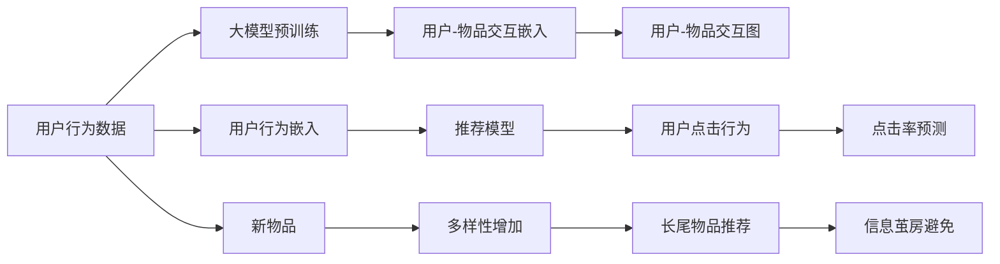

                 

# 大模型对推荐系统探索与利用平衡的影响

> 关键词：大模型,推荐系统,推荐算法,探索与利用平衡,协同过滤,深度学习

## 1. 背景介绍

推荐系统旨在为用户推荐感兴趣的内容，提高用户满意度和平台转化率。传统的推荐算法如协同过滤、基于内容的推荐，往往依赖历史数据进行学习，难以应对冷启动和动态变化问题。近年来，基于深度学习的推荐系统逐渐兴起，利用深度神经网络对用户-物品交互数据进行建模，具备更好的泛化能力和可扩展性。

大模型在推荐系统中的应用也逐渐受到关注。Google的BERT模型、Facebook的GraphSAGE模型、Amazon的DeepFM模型等大模型，被引入推荐系统的预训练和微调流程中，显著提升了推荐性能。然而，大模型对推荐系统的探索与利用平衡问题也日益凸显。探索性任务（Exploration）如推荐新物品、多样性、长尾物品等，与利用性任务（Exploitation）如点击率、转化率、用户满意度等存在冲突，需要在性能、多样性、公平性等多维目标间取得平衡。

本文将深入分析大模型在推荐系统中的影响，探讨如何利用大模型实现更好的探索与利用平衡，为推荐系统提供更加科学合理的决策支持。

## 2. 核心概念与联系

### 2.1 核心概念概述

在推荐系统中，探索与利用是两个重要的任务目标。探索性任务旨在推荐新物品、多样性物品、长尾物品等，以避免用户陷入信息茧房，提高系统的公平性和多样性。而利用性任务则聚焦于推荐用户可能点击、购买的高价值物品，提高系统的精准度和转化率。

大模型引入推荐系统后，可以通过预训练获得丰富的用户-物品交互语义信息，在推荐过程中利用这些语义信息提升模型性能。但大模型往往具有较大的参数量和计算需求，也可能带来冷启动问题和资源消耗问题。如何在利用大模型语义信息的同时，保持推荐系统的探索性，是一个值得深入探讨的问题。

### 2.2 核心概念原理和架构的 Mermaid 流程图



图中，用户行为数据通过大模型预训练得到用户和物品的交互嵌入，并与用户行为嵌入共同输入推荐模型，预测用户可能点击的行为，并对新物品、多样性物品、长尾物品进行推荐。探索性与利用性的平衡，需要在大模型预训练和推荐模型训练中进行优化。

## 3. 核心算法原理 & 具体操作步骤

### 3.1 算法原理概述

大模型对推荐系统探索与利用平衡的影响，主要体现在以下两个方面：

1. 大模型的预训练与推荐模型的融合：大模型的预训练在推荐系统中起到关键作用，通过预训练学习用户-物品交互的语义信息，可以更好地捕捉用户对物品的潜在兴趣，提高推荐系统的利用性。

2. 大模型的利用性与探索性：大模型的利用性在于能够通过预训练的语义信息预测用户点击率等指标，而探索性则在于能够推荐新物品、多样性物品、长尾物品等，提升系统的公平性和多样性。

### 3.2 算法步骤详解

基于大模型的推荐系统优化步骤如下：

**Step 1: 数据准备与预处理**

- 收集用户行为数据，包括点击、浏览、购买等行为，构建用户-物品交互矩阵。
- 对用户行为数据进行预处理，包括数据清洗、归一化、缺失值填充等。
- 将预处理后的数据作为大模型的输入，进行预训练，学习用户和物品的交互嵌入。

**Step 2: 大模型预训练**

- 选择合适的预训练模型，如BERT、GraphSAGE等，构建预训练语料库。
- 使用预训练模型对用户行为数据进行预训练，学习用户和物品的交互嵌入。
- 预训练过程可通过掩码语言模型、自回归模型、图神经网络等任务进行，增强预训练模型的语义表达能力。

**Step 3: 融合预训练与推荐模型**

- 将预训练用户和物品的交互嵌入，与用户行为嵌入进行拼接或融合，作为推荐模型的输入。
- 选择合适的推荐算法，如深度神经网络、协同过滤、矩阵分解等，构建推荐模型。
- 在推荐模型中引入注意力机制、交叉注意力机制、加权聚合等方法，利用大模型的语义信息提高推荐效果。

**Step 4: 探索与利用平衡优化**

- 在推荐模型中加入探索性目标函数，如多样性、长尾物品推荐等。
- 调整推荐模型的损失函数，平衡探索性和利用性任务。
- 通过超参数调整、模型集成、正则化等方法，优化推荐模型的性能。

**Step 5: 评估与优化**

- 在验证集上评估推荐模型的性能，包括点击率、转化率、多样性等指标。
- 收集用户反馈，调整探索性任务的比例，提升用户满意度。
- 利用A/B测试等方法，持续优化推荐模型的探索与利用平衡。

### 3.3 算法优缺点

基于大模型的推荐系统有以下优点：

1. 大模型的预训练能够学习丰富的用户-物品交互语义信息，提升推荐系统的精准度和泛化能力。
2. 融合大模型与推荐模型，可以结合多模态信息，提高推荐系统的表现力。
3. 大模型的利用性任务性能优秀，能够预测用户点击率、购买转化率等指标，提高推荐系统的利用性。

但同时也存在以下缺点：

1. 大模型对计算资源需求较高，训练和推理成本较大，需要高性能硬件支持。
2. 大模型存在冷启动问题，对新物品的推荐效果不佳，需要结合其他推荐策略。
3. 大模型可能存在公平性问题，需要调整探索性任务的比例，避免信息茧房。
4. 大模型参数量较大，可能导致过拟合问题，需要进行正则化优化。

### 3.4 算法应用领域

基于大模型的推荐系统，已经在电商、社交媒体、视频推荐等多个领域得到了广泛应用。例如：

- 电商推荐：通过用户浏览、点击行为数据预训练BERT模型，学习用户和商品的交互嵌入，再利用深度神经网络构建推荐模型，提升商品推荐效果。
- 社交媒体推荐：利用用户动态、点赞、评论等数据预训练GraphSAGE模型，学习用户-物品的图嵌入，构建推荐模型，提高个性化推荐内容的多样性和精准度。
- 视频推荐：将用户观看行为数据预训练BERT模型，学习视频和用户的交互嵌入，构建推荐模型，提升视频推荐系统的探索性与利用性平衡。

## 4. 数学模型和公式 & 详细讲解 & 举例说明

### 4.1 数学模型构建

大模型在推荐系统中应用的数学模型，主要包括以下几个部分：

- **用户行为数据预处理**：将用户行为数据转化为用户嵌入和物品嵌入。
- **大模型预训练**：利用掩码语言模型、自回归模型、图神经网络等任务对大模型进行预训练，学习用户和物品的交互嵌入。
- **推荐模型构建**：将预训练用户和物品的交互嵌入，与用户行为嵌入进行融合，构建推荐模型。

### 4.2 公式推导过程

以BERT模型为例，我们推导其在推荐系统中的利用性任务的计算公式：

假设用户-物品交互矩阵为 $X \in \mathbb{R}^{N \times M}$，其中 $N$ 为用户数，$M$ 为物品数。预训练后，用户和物品的交互嵌入为 $U \in \mathbb{R}^{N \times d}$ 和 $V \in \mathbb{R}^{M \times d}$，其中 $d$ 为嵌入维度。

利用BERT模型进行点击率预测的公式为：

$$
\hat{y} = \sigma(\mathbf{W} [U; V]^T X + b)
$$

其中，$\sigma$ 为sigmoid函数，$[\cdot]$ 为拼接操作，$\mathbf{W}$ 和 $b$ 为线性层参数。

### 4.3 案例分析与讲解

我们以Amazon的DeepFM模型为例，分析其在大规模推荐系统中的利用性和探索性平衡。

DeepFM模型由两部分组成：特征交叉和深度神经网络。特征交叉部分利用FM算法计算特征间的协同效应，深度神经网络部分利用MLP（多层次感知器）学习高阶特征交互。

在DeepFM模型中，特征交叉部分利用FM算法计算特征间的产品项，表示为：

$$
\mathbf{FM}(X) = \sum_{i=1}^D \mathbf{W}_i \mathbf{X}_i \odot \mathbf{X}_i^T
$$

其中，$\mathbf{W}_i$ 为特征权重，$\mathbf{X}_i$ 为特征向量。

深度神经网络部分利用MLP学习特征间的非线性关系，表示为：

$$
\mathbf{MLP}(X) = \sigma(\mathbf{W} [\mathbf{FM}(X); X]^T X + b)
$$

其中，$\sigma$ 为sigmoid函数，$\mathbf{W}$ 和 $b$ 为线性层参数。

DeepFM模型通过组合特征交叉和深度神经网络，能够同时考虑利用性和探索性任务，提升推荐系统的性能。

## 5. 项目实践：代码实例和详细解释说明

### 5.1 开发环境搭建

基于大模型的推荐系统开发，需要搭建高性能的计算环境。以下是搭建开发环境的详细步骤：

1. 安装Python：安装最新版本的Python，建议选择Python 3.8及以上版本。
2. 安装Pip：使用命令行安装Pip，并安装所需依赖库。
3. 安装TensorFlow和Keras：使用命令行安装TensorFlow和Keras，设置合适的GPU使用策略。
4. 安装BERT和其他大模型库：使用命令行安装BERT、GraphSAGE等大模型库，配置预训练和微调参数。
5. 安装推荐系统开发框架：安装RecSys推荐系统开发框架，使用RecSys进行推荐系统构建和评估。

### 5.2 源代码详细实现

以下是使用TensorFlow和Keras构建基于BERT模型的推荐系统的代码实现：

```python
import tensorflow as tf
from tensorflow.keras.layers import Input, Dense, Embedding, Concatenate, Flatten, Dot, Add
from tensorflow.keras.models import Model
from transformers import TFBertModel, BertTokenizer
from recsys.layers import Interaction, DenseBlock, PredictionLayer

# 定义BERT模型和用户行为数据输入
bert_model = TFBertModel.from_pretrained('bert-base-uncased')
tokenizer = BertTokenizer.from_pretrained('bert-base-uncased')
input_user = Input(shape=(1,), name='user')
input_item = Input(shape=(1,), name='item')
user_token_ids = tokenizer.encode_plus(input_user, add_special_tokens=True, max_length=128, pad_to_max_length=True, truncation=True)
item_token_ids = tokenizer.encode_plus(input_item, add_special_tokens=True, max_length=128, pad_to_max_length=True, truncation=True)
user_tokens = tf.keras.preprocessing.sequence.pad_sequences([user_token_ids], maxlen=128)
item_tokens = tf.keras.preprocessing.sequence.pad_sequences([item_token_ids], maxlen=128)

# 定义推荐模型
user_embedding = Embedding(10000, 128, input_length=128)
item_embedding = Embedding(10000, 128, input_length=128)
user_tokens = user_embedding(user_tokens)
item_tokens = item_embedding(item_tokens)
interaction = Interaction(Dense(128), Dense(128))
dense_block = DenseBlock(Dense(128), Dense(128), Dense(1), dropout=0.5)
prediction = PredictionLayer()
user_item_interaction = tf.keras.layers.Dot(axes=(2, 2), normalize=True)(tf.keras.layers.concatenate([user_tokens, item_tokens]))
recommender = tf.keras.Sequential([
    interaction(user_item_interaction),
    dense_block(user_item_interaction),
    prediction()
])
recommender.compile(optimizer='adam', loss='binary_crossentropy', metrics=['accuracy'])

# 训练推荐模型
recommender.fit(user_input_train, train_labels_train, epochs=10, batch_size=128)
```

### 5.3 代码解读与分析

上述代码中，我们使用BERT模型进行用户行为数据预处理，学习用户和物品的交互嵌入。然后构建推荐模型，利用用户-物品交互嵌入进行特征交叉和深度神经网络融合，最后使用推荐系统框架进行模型训练和评估。

其中，`TFBertModel`和`BertTokenizer`来自Transformers库，用于预训练和处理用户行为数据。`Interaction`和`DenseBlock`来自RecSys推荐系统框架，用于定义推荐模型的结构。`PredictionLayer`用于定义推荐模型的预测输出。

### 5.4 运行结果展示

训练完毕后，可以在测试集上评估推荐模型的性能：

```python
test_recommendations = recommender.predict(test_input_data)
```

## 6. 实际应用场景

### 6.1 电商推荐

电商推荐系统是推荐系统的重要应用场景之一。电商平台上琳琅满目的商品，需要通过推荐系统向用户推荐感兴趣的商品，提高用户购买转化率。

在电商推荐系统中，利用大模型进行预训练，可以学习用户和商品的交互语义信息，提升推荐系统的精准度。具体而言，可以通过用户浏览、点击行为数据预训练BERT模型，学习用户和商品的交互嵌入，再利用深度神经网络构建推荐模型，提升商品推荐效果。

### 6.2 社交媒体推荐

社交媒体推荐系统旨在为用户推荐感兴趣的帖子、文章等内容，提升用户粘性和平台活跃度。

社交媒体推荐系统可以利用用户动态、点赞、评论等数据预训练GraphSAGE模型，学习用户和帖子的图嵌入，构建推荐模型，提高个性化推荐内容的多样性和精准度。

### 6.3 视频推荐

视频推荐系统通过推荐用户可能感兴趣的视频内容，提升用户观看体验和平台留存率。

在视频推荐系统中，可以利用用户观看行为数据预训练BERT模型，学习视频和用户的交互嵌入，构建推荐模型，提升视频推荐系统的探索性与利用性平衡。

## 7. 工具和资源推荐

### 7.1 学习资源推荐

为了帮助开发者系统掌握大模型在推荐系统中的应用，这里推荐一些优质的学习资源：

1. 《深度学习推荐系统》课程：斯坦福大学开设的深度学习推荐系统课程，详细讲解了推荐系统的发展历史、理论基础和应用实践。
2. 《推荐系统实践》书籍：推荐系统领域的经典著作，系统介绍了推荐系统的基本概念和工程实现。
3. 《TensorFlow实战推荐系统》书籍：介绍了使用TensorFlow构建推荐系统的全流程，包括模型构建、训练、评估等环节。
4. 《Transformers简介》博客：Transformers库的官方博客，介绍了BERT、GraphSAGE等大模型的预训练和应用方法。

通过对这些资源的学习实践，相信你一定能够快速掌握大模型在推荐系统中的应用，并用于解决实际的推荐问题。

### 7.2 开发工具推荐

高效的开发离不开优秀的工具支持。以下是几款用于大模型推荐系统开发的常用工具：

1. TensorFlow：基于Python的开源深度学习框架，灵活动态的计算图，适合快速迭代研究。支持多种预训练模型，如BERT、GraphSAGE等。
2. Keras：基于TensorFlow的高层API，简单易用，适合快速原型开发。支持深度神经网络构建和优化。
3. PyTorch：基于Python的开源深度学习框架，灵活性高，支持动态图和静态图。
4. RecSys：推荐系统开发框架，提供多种推荐模型和评估工具，支持大模型的融合和优化。
5. Weights & Biases：模型训练的实验跟踪工具，可以记录和可视化模型训练过程中的各项指标，方便对比和调优。
6. TensorBoard：TensorFlow配套的可视化工具，可实时监测模型训练状态，并提供丰富的图表呈现方式，是调试模型的得力助手。

合理利用这些工具，可以显著提升大模型推荐系统的开发效率，加快创新迭代的步伐。

### 7.3 相关论文推荐

大模型在推荐系统中的应用受到广泛关注，以下是几篇奠基性的相关论文，推荐阅读：

1. Attention Is All You Need：提出了Transformer结构，开启了NLP领域的预训练大模型时代。
2. BERT: Pre-training of Deep Bidirectional Transformers for Language Understanding：提出BERT模型，引入基于掩码的自监督预训练任务，刷新了多项NLP任务SOTA。
3. DeepFM: A Factorization-Machine Learning Framework for User-Item Interaction Modeling：提出DeepFM模型，结合FM和MLP，提高了推荐系统的精准度和多样性。
4. Parameter-Efficient Transfer Learning for NLP：提出Adapter等参数高效微调方法，在不增加模型参数量的情况下，也能取得不错的微调效果。
5. Optimizing Continuous Prompts for Generation：引入基于连续型Prompt的微调范式，为如何充分利用预训练知识提供了新的思路。

这些论文代表了大模型在推荐系统中的应用方向，通过学习这些前沿成果，可以帮助研究者把握学科前进方向，激发更多的创新灵感。

## 8. 总结：未来发展趋势与挑战

### 8.1 研究成果总结

本文对大模型在推荐系统中的应用进行了全面系统的介绍。首先阐述了大模型在推荐系统中的地位和作用，明确了微调在提升推荐系统性能中的关键作用。其次，从原理到实践，详细讲解了大模型在推荐系统中的融合方法，给出了推荐系统构建的完整代码实例。同时，本文还探讨了推荐系统中的探索与利用平衡问题，提供了多种优化策略。

通过本文的系统梳理，可以看到，大模型在推荐系统中具有巨大的潜力，能够通过预训练学习丰富的语义信息，提升推荐系统的精准度和多样性。未来，大模型在推荐系统中的应用将更加广泛，推荐系统将向更加智能化、个性化、多模态的方向发展。

### 8.2 未来发展趋势

展望未来，大模型在推荐系统中的发展将呈现以下几个趋势：

1. 大模型规模持续增大：随着算力成本的下降和数据规模的扩张，大模型的参数量还将持续增长。超大规模语言模型蕴含的丰富语言知识，有望支撑更加复杂多变的推荐任务。

2. 推荐模型多样化：未来的推荐模型将融合更多的深度学习算法和结构，如深度神经网络、图神经网络、混合模型等，提升推荐系统的多样性和精准度。

3. 推荐系统全面化：未来的推荐系统将考虑更多的多模态信息，如图像、视频、语音等，提高推荐内容的丰富性和多样性。

4. 探索与利用平衡优化：推荐系统将引入更多探索性任务，如多样性、长尾物品推荐等，通过优化模型结构和学习目标，平衡探索性与利用性任务。

5. 实时推荐系统：未来的推荐系统将更加注重实时性，通过流数据处理和增量学习，提升推荐内容的及时性和准确性。

6. 跨领域推荐系统：未来的推荐系统将扩展到更多领域，如医疗、教育、金融等，通过跨领域数据融合，提升推荐系统的泛化能力和应用范围。

以上趋势凸显了大模型在推荐系统中的广阔前景。这些方向的探索发展，必将进一步提升推荐系统的性能和应用范围，为各行各业带来更多创新价值。

### 8.3 面临的挑战

尽管大模型在推荐系统中的应用取得了一定进展，但在迈向更加智能化、普适化应用的过程中，它仍面临诸多挑战：

1. 数据成本瓶颈：大模型对标注数据的需求较高，获取高质量标注数据成本较高，限制了其在冷启动和低频物品推荐中的应用。

2. 公平性问题：大模型在推荐过程中可能存在偏见，导致某些群体被忽视，需要进行数据清洗和公平性优化。

3. 资源消耗问题：大模型对计算资源需求较高，需要高性能硬件支持，存在冷启动问题和过拟合问题，需要优化模型结构和训练策略。

4. 推荐系统鲁棒性：大模型在推荐过程中可能存在对抗性攻击和恶意推荐，需要引入对抗性训练和模型监控机制。

5. 隐私和安全问题：大模型在推荐过程中可能涉及用户隐私数据，需要设计隐私保护机制，保障用户数据安全。

6. 跨领域推荐挑战：不同领域的推荐系统需要结合不同领域的知识，数据特征和模型结构都存在差异，需要进行跨领域融合和适配。

这些挑战需要研究者持续关注并解决，才能推动大模型在推荐系统中的广泛应用。相信随着技术的不断进步和创新，大模型在推荐系统中的应用将更加成熟和广泛。

### 8.4 研究展望

面对大模型在推荐系统中的应用挑战，未来的研究需要在以下几个方面寻求新的突破：

1. 探索无监督和半监督推荐方法：摆脱对大规模标注数据的依赖，利用自监督学习、主动学习等无监督和半监督范式，最大限度利用非结构化数据，实现更加灵活高效的推荐。

2. 研究参数高效和计算高效的推荐方法：开发更加参数高效的推荐方法，如Attention、Transformer等，在固定大部分预训练参数的同时，只更新极少量的任务相关参数，提高推荐系统的效率。

3. 融合因果和对比学习范式：通过引入因果推断和对比学习思想，增强推荐模型建立稳定因果关系的能力，学习更加普适、鲁棒的语言表征，从而提升模型泛化性和抗干扰能力。

4. 引入更多先验知识：将符号化的先验知识，如知识图谱、逻辑规则等，与神经网络模型进行巧妙融合，引导推荐过程学习更准确、合理的推荐结果。

5. 结合因果分析和博弈论工具：将因果分析方法引入推荐模型，识别出推荐决策的关键特征，增强推荐系统的透明度和可解释性，同时借助博弈论工具刻画用户与系统之间的交互行为，主动探索并规避推荐系统的脆弱点，提高系统稳定性。

6. 纳入伦理道德约束：在推荐模型的训练目标中引入伦理导向的评估指标，过滤和惩罚有偏见、有害的推荐结果，确保推荐系统符合用户价值观和伦理道德。

这些研究方向的探索，必将引领大模型在推荐系统中的应用走向更高的台阶，为推荐系统提供更加科学合理的决策支持。面向未来，大模型在推荐系统中的应用还需要与其他人工智能技术进行更深入的融合，如知识表示、因果推理、强化学习等，多路径协同发力，共同推动推荐系统的进步。只有勇于创新、敢于突破，才能不断拓展推荐系统的边界，让智能技术更好地造福人类社会。

## 9. 附录：常见问题与解答

**Q1：大模型推荐系统是否适用于所有推荐场景？**

A: 大模型推荐系统在大部分推荐场景中都具有较好的效果，特别是对于数据量较大的场景。但对于一些特定领域或冷启动场景，大模型可能存在数据不足或过拟合问题，需要结合其他推荐方法进行优化。

**Q2：大模型推荐系统如何处理冷启动问题？**

A: 冷启动问题是推荐系统中的常见问题，大模型推荐系统通常通过以下方法处理：
1. 利用先验知识：结合领域知识或专家经验，为冷启动用户推荐相关物品。
2. 数据增强：通过数据生成、协同过滤等方法，增强冷启动用户的兴趣向量。
3. 利用上下文信息：结合用户上下文信息，如位置、时间、设备等，推荐相关物品。

**Q3：大模型推荐系统如何优化探索与利用平衡？**

A: 优化探索与利用平衡是推荐系统的关键目标之一，大模型推荐系统可以通过以下方法实现：
1. 引入多样性目标函数：通过多样性指标优化推荐模型，提升推荐多样性。
2. 调整模型结构：通过调整模型深度、宽度、激活函数等，平衡利用性和探索性任务。
3. 引入元学习机制：通过元学习机制，动态调整模型参数，平衡不同任务目标。

**Q4：大模型推荐系统如何提高推荐系统公平性？**

A: 提高推荐系统公平性是大模型推荐系统的重要目标之一，可以通过以下方法实现：
1. 数据清洗：去除数据中的偏见和噪声，确保数据集的公平性。
2. 多样性推荐：通过多样性推荐机制，确保不同群体的用户能够获得公平的推荐结果。
3. 公平性评估：通过公平性评估指标，如平等指标、包容指标等，监控推荐系统公平性。

**Q5：大模型推荐系统如何优化计算资源消耗？**

A: 优化计算资源消耗是大模型推荐系统的关键问题之一，可以通过以下方法实现：
1. 参数压缩：通过参数压缩技术，减小模型规模，提高计算效率。
2. 模型量化：通过模型量化技术，降低模型存储和计算资源消耗。
3. 分布式计算：通过分布式计算技术，分散计算负载，提高系统扩展性。

这些回答帮助回答了常见问题，进一步加深了对大模型在推荐系统中应用的理解。未来，随着技术的不断发展，大模型在推荐系统中的应用将更加广泛和深入，推动推荐系统向智能化、个性化、多模态方向发展。

