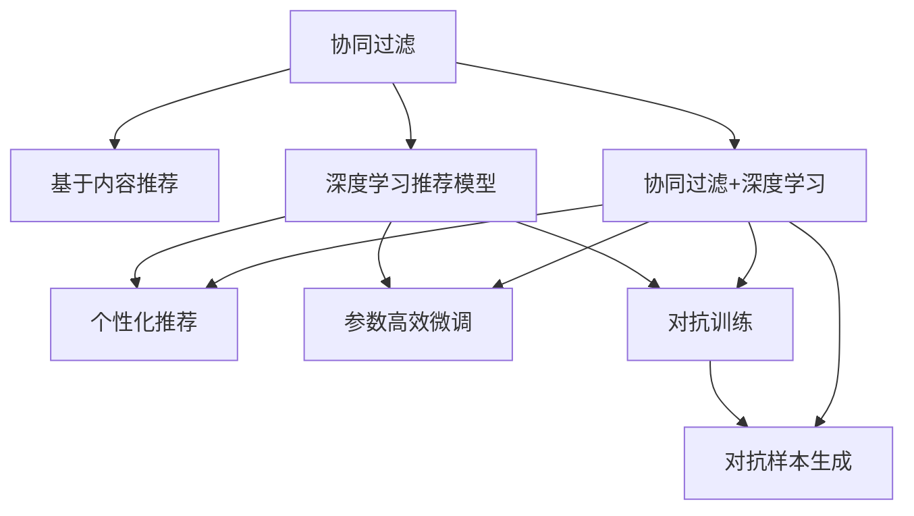

                 

# 大模型对推荐系统用户体验的提升策略

> 关键词：推荐系统,用户体验,大模型,协同过滤,基于内容推荐,深度学习,算法优化,个性化推荐

## 1. 背景介绍

### 1.1 问题由来

随着互联网技术的发展，推荐系统（Recommendation Systems）成为了众多企业提升用户粘性和活跃度的核心手段。推荐系统通过收集用户的历史行为数据，结合产品特征和实时环境，为用户推荐最感兴趣的内容，从而极大地提升了用户的满意度和转化率。然而，传统的推荐系统往往以物品为推荐单位，忽略了用户之间的个性化差异，导致推荐的精准性和多样性不足，用户体验不佳。

### 1.2 问题核心关键点

推荐系统面临的核心问题包括：
- **用户个性化需求难以捕捉**：传统的推荐系统难以识别用户的潜在兴趣和行为意图，往往陷入"冷启动"问题。
- **推荐多样性和新颖性不足**：推荐内容高度依赖用户的历史行为，难以突破用户的既有认知框架。
- **实时性不足**：推荐内容无法动态响应用户的即时需求，用户体验无法实时提升。
- **模型复杂度和计算成本高**：传统推荐算法（如协同过滤、基于内容的推荐）模型简单但效果有限，而基于深度学习的推荐算法虽然效果显著但计算成本高昂。

### 1.3 问题研究意义

研究大模型对推荐系统用户体验的提升策略，对于构建更加精准、个性化、高效、实时、安全的推荐系统具有重要意义：
- **提升推荐精准度**：大模型能够学习用户和物品间的隐式关联，捕捉用户的个性化需求，显著提升推荐精准度。
- **增加推荐多样性**：大模型可以理解更广泛的上下文信息，突破用户的既有认知，增加推荐的多样性和新颖性。
- **加速推荐响应**：大模型的推理速度快，能够实时响应用户的即时需求，提升用户体验。
- **降低计算成本**：大模型可以利用参数高效微调等技术，减少计算资源消耗，提升模型的部署效率。
- **保障推荐安全性**：大模型可以通过对抗训练等技术，增强推荐系统的鲁棒性和安全性。

## 2. 核心概念与联系

### 2.1 核心概念概述

为更好地理解大模型对推荐系统用户体验提升的策略，本节将介绍几个密切相关的核心概念：

- **推荐系统（Recommendation Systems）**：通过分析用户行为数据和物品特征，为特定用户推荐其可能感兴趣的物品的系统。
- **协同过滤（Collaborative Filtering）**：一种基于用户-物品矩阵的推荐方法，通过相似度度量捕捉用户间的潜在关联。
- **基于内容推荐（Content-based Recommendation）**：通过分析物品的特征，为具有相似特征的用户推荐物品，如基于商品描述、标签的推荐。
- **深度学习推荐模型**：通过多层神经网络，从用户行为和物品特征中学习隐式关联，提升推荐效果。
- **个性化推荐**：根据用户个性化需求和行为，动态生成推荐结果，提升用户体验。
- **参数高效微调**：在大模型微调过程中，只更新少量的模型参数，减少计算资源消耗。
- **对抗训练**：在训练过程中引入对抗样本，增强模型的鲁棒性和泛化能力。
- **对抗样本生成**：通过数据增强和对抗训练生成对抗样本，用于模型训练和测试。

这些核心概念之间的逻辑关系可以通过以下Mermaid流程图来展示：



这个流程图展示了大模型的核心概念及其之间的关系：

1. 协同过滤和基于内容推荐是传统推荐算法的基础。
2. 深度学习推荐模型利用大模型进行推荐，能够学习更深层次的隐式关联。
3. 个性化推荐结合大模型，动态生成用户满意推荐。
4. 参数高效微调和大模型结合，提升推荐效果的同时降低计算成本。
5. 对抗训练和对抗样本生成，增强大模型对对抗样本的鲁棒性。
6. 协同过滤和深度学习结合，进一步提升推荐效果。

这些概念共同构成了大模型在推荐系统中的应用框架，使得推荐系统能够更好地满足用户需求，提升用户体验。

## 3. 核心算法原理 & 具体操作步骤
### 3.1 算法原理概述

大模型对推荐系统用户体验提升的核心思想是：将大模型的强大语言和理解能力引入推荐系统，通过学习用户和物品之间的隐式关联，实现更加个性化、精准和实时的推荐。

形式化地，假设用户集为 $U$，物品集为 $I$，历史行为数据为 $D=\{(u,i,r)\}_{i=1}^N$，其中 $u$ 为用户的ID，$i$ 为物品的ID，$r$ 为用户的评分或点击等行为。大模型 $M$ 的目标是通过训练数据，学习用户 $u$ 对物品 $i$ 的评分或概率，即 $M(u,i)$，从而生成推荐结果。

### 3.2 算法步骤详解

基于大模型的推荐系统通常包括以下几个关键步骤：

**Step 1: 数据预处理**
- 收集用户行为数据，清洗缺失值和异常值，构建用户-物品矩阵。
- 将用户ID、物品ID等特征转换为模型可接受的向量形式。

**Step 2: 大模型预训练**
- 选择合适的大模型，如BERT、GPT-2等，进行预训练。预训练任务可以是自回归语言建模、掩码语言模型等。
- 使用预训练数据对大模型进行训练，使其具备强大的语言理解和生成能力。

**Step 3: 微调与融合**
- 将预训练的大模型作为初始化参数，在大模型顶层设计合适的输出层和损失函数。
- 在用户行为数据上进行有监督的微调，训练模型学习用户行为和物品特征的隐式关联。
- 结合大模型的输出和传统推荐模型的结果，生成最终的推荐结果。

**Step 4: 推荐过程**
- 收集用户实时行为，实时输入到微调后的大模型中，获取推荐结果。
- 结合实时环境和其他推荐策略，生成用户满意推荐。
- 不断更新模型参数，适应新数据分布。

### 3.3 算法优缺点

基于大模型的推荐系统具有以下优点：
1. **推荐精准度高**：大模型能够捕捉用户和物品间的隐式关联，提升推荐精准度。
2. **推荐多样化**：大模型能够理解更广泛的上下文信息，增加推荐的多样性和新颖性。
3. **实时性好**：大模型的推理速度快，能够实时响应用户的即时需求，提升用户体验。
4. **参数高效**：利用参数高效微调技术，在固定大部分预训练参数的情况下，仍能取得不错的推荐效果。
5. **鲁棒性强**：通过对抗训练等技术，增强模型的鲁棒性和泛化能力。

同时，该方法也存在一些局限性：
1. **数据需求高**：传统协同过滤和基于内容的推荐方法需要较小的数据量，而大模型的微调需要大量标注数据，数据成本较高。
2. **计算成本高**：大模型的计算复杂度高，训练和推理所需资源较多。
3. **模型解释性差**：大模型的黑盒特性使得其推荐过程难以解释，用户难以理解推荐理由。
4. **冷启动问题**：对于新用户，由于缺乏历史行为数据，推荐效果不佳。

尽管存在这些局限性，但大模型在推荐系统中的应用仍具有巨大的潜力。未来相关研究将集中在如何降低大模型的计算成本，提高推荐系统的解释性和鲁棒性，以及解决冷启动问题等方面。

### 3.4 算法应用领域

基于大模型的推荐系统已经被广泛应用于多种场景，如电商、社交媒体、内容平台等。以下是几个典型应用案例：

**电商推荐系统**：电商平台通过收集用户浏览、点击、购买等行为数据，结合商品特征，对用户进行个性化推荐，提升用户的购买率和满意度。

**社交媒体推荐系统**：社交媒体平台根据用户的历史互动数据和兴趣爱好，为用户推荐可能感兴趣的内容，如文章、视频、图片等，增加用户粘性。

**内容平台推荐系统**：视频、音乐、文章等平台通过收集用户的观看、播放、点赞等行为数据，推荐用户可能感兴趣的内容，提高平台的活跃度和留存率。

除了上述这些典型应用外，基于大模型的推荐系统还在新闻推荐、游戏推荐、广告推荐等领域发挥重要作用，成为提升用户体验的重要手段。

## 4. 数学模型和公式 & 详细讲解 & 举例说明（备注：数学公式请使用latex格式，latex嵌入文中独立段落使用 $$，段落内使用 $)
### 4.1 数学模型构建

本节将使用数学语言对基于大模型的推荐系统进行更加严格的刻画。

记用户集为 $U=\{u_1,u_2,...,u_N\}$，物品集为 $I=\{i_1,i_2,...,i_M\}$，用户行为数据为 $D=\{(u_i,i_j,r_{ij})\}_{i,j=1}^{N,M}$。定义大模型为 $M:\mathcal{X} \rightarrow \mathcal{Y}$，其中 $\mathcal{X}$ 为输入空间，$\mathcal{Y}$ 为输出空间，$\theta \in \mathbb{R}^d$ 为模型参数。

推荐系统的大模型训练目标为：
$$
\hat{M}=\mathop{\arg\min}_{\theta} \mathcal{L}(D,M_{\theta})
$$
其中 $\mathcal{L}$ 为损失函数，用于衡量模型预测结果与实际行为之间的差异。常用的损失函数包括交叉熵损失、均方误差损失等。

在大模型输出层，定义用户 $u$ 对物品 $i$ 的评分或概率为 $M_{\theta}(u,i)$，则损失函数可以表示为：
$$
\mathcal{L}(D,M_{\theta}) = \frac{1}{N}\sum_{i=1}^N \sum_{j=1}^M (r_{ij} \log M_{\theta}(u_i,i_j) + (1-r_{ij}) \log (1-M_{\theta}(u_i,i_j)))
$$

### 4.2 公式推导过程

以下我们以二分类任务为例，推导交叉熵损失函数及其梯度的计算公式。

假设大模型 $M_{\theta}$ 在用户行为数据上进行微调，得到用户 $u$ 对物品 $i$ 的评分或概率 $M_{\theta}(u,i) \in [0,1]$。真实行为 $r_{ij} \in \{0,1\}$。则二分类交叉熵损失函数定义为：
$$
\mathcal{L}(D,M_{\theta}) = -\frac{1}{N}\sum_{i=1}^N \sum_{j=1}^M [r_{ij} \log M_{\theta}(u_i,i_j) + (1-r_{ij}) \log (1-M_{\theta}(u_i,i_j))]
$$

根据链式法则，损失函数对参数 $\theta_k$ 的梯度为：
$$
\frac{\partial \mathcal{L}(D,M_{\theta})}{\partial \theta_k} = -\frac{1}{N}\sum_{i=1}^N \sum_{j=1}^M \left(\frac{r_{ij}}{M_{\theta}(u_i,i_j)}-\frac{1-r_{ij}}{1-M_{\theta}(u_i,i_j)}\right) \frac{\partial M_{\theta}(u_i,i_j)}{\partial \theta_k}
$$

其中 $\frac{\partial M_{\theta}(u_i,i_j)}{\partial \theta_k}$ 可进一步递归展开，利用自动微分技术完成计算。

在得到损失函数的梯度后，即可带入参数更新公式，完成模型的迭代优化。重复上述过程直至收敛，最终得到适应用户行为数据的最优模型参数 $\theta^*$。

## 5. 项目实践：代码实例和详细解释说明
### 5.1 开发环境搭建

在进行推荐系统开发前，我们需要准备好开发环境。以下是使用Python进行TensorFlow开发的环境配置流程：

1. 安装Anaconda：从官网下载并安装Anaconda，用于创建独立的Python环境。

2. 创建并激活虚拟环境：
```bash
conda create -n tf-env python=3.8 
conda activate tf-env
```

3. 安装TensorFlow：根据CUDA版本，从官网获取对应的安装命令。例如：
```bash
conda install tensorflow -c tf -c conda-forge
```

4. 安装Keras：用于搭建深度学习模型。
```bash
pip install keras
```

5. 安装各类工具包：
```bash
pip install numpy pandas scikit-learn matplotlib tqdm jupyter notebook ipython
```

完成上述步骤后，即可在`tf-env`环境中开始推荐系统开发。

### 5.2 源代码详细实现

下面我们以基于大模型的电商推荐系统为例，给出使用TensorFlow搭建深度学习推荐模型的代码实现。

首先，定义推荐系统的数据处理函数：

```python
import pandas as pd
from tensorflow.keras.preprocessing.text import Tokenizer
from tensorflow.keras.preprocessing.sequence import pad_sequences
import tensorflow as tf

def preprocess_data(train_data, test_data):
    train_data = pd.read_csv(train_data)
    test_data = pd.read_csv(test_data)

    # 用户行为数据
    train_behaviors = train_data[['user_id', 'item_id', 'label']]
    test_behaviors = test_data[['user_id', 'item_id', 'label']]
    
    # 物品特征数据
    train_items = train_data[['item_id', 'category']]
    test_items = test_data[['item_id', 'category']]
    
    # 用户特征数据
    train_users = train_data[['user_id', 'age', 'gender']]
    test_users = test_data[['user_id', 'age', 'gender']]
    
    # 构建训练和测试集
    train_data = pd.merge(train_behaviors, train_items, on='item_id', how='left').merge(train_users, on='user_id', how='left')
    test_data = pd.merge(test_behaviors, test_items, on='item_id', how='left').merge(test_users, on='user_id', how='left')
    
    # 填充缺失值
    train_data = train_data.fillna(0)
    test_data = test_data.fillna(0)
    
    # 划分训练集和测试集
    train_x = train_data[['user_id', 'item_id', 'category', 'age', 'gender']]
    train_y = train_data['label']
    test_x = test_data[['user_id', 'item_id', 'category', 'age', 'gender']]
    test_y = test_data['label']
    
    return train_x, train_y, test_x, test_y
```

然后，定义模型和优化器：

```python
from tensorflow.keras.layers import Input, Embedding, Dense, Flatten, LSTM
from tensorflow.keras.models import Model
from tensorflow.keras.optimizers import Adam

# 定义输入层
user_input = Input(shape=(5,), name='user_input')
item_input = Input(shape=(3,), name='item_input')
category_input = Input(shape=(1,), name='category_input')

# 定义嵌入层
user_embedding = Embedding(input_dim=1000, output_dim=100, name='user_embedding')(user_input)
item_embedding = Embedding(input_dim=1000, output_dim=100, name='item_embedding')(item_input)
category_embedding = Embedding(input_dim=10, output_dim=100, name='category_embedding')(category_input)

# 定义LSTM层
user_seq = LSTM(100)(user_embedding)
item_seq = LSTM(100)(item_embedding)
category_seq = Flatten()(category_embedding)

# 定义全连接层
user_output = Dense(64, activation='relu')(user_seq)
item_output = Dense(64, activation='relu')(item_seq)
category_output = Dense(64, activation='relu')(category_seq)

# 定义输出层
output = Dense(1, activation='sigmoid')(tf.keras.layers.concatenate([user_output, item_output, category_output]))

# 定义模型
model = Model(inputs=[user_input, item_input, category_input], outputs=output)
```

接着，定义训练和评估函数：

```python
from sklearn.metrics import accuracy_score
import numpy as np

def train_epoch(model, train_x, train_y, batch_size, optimizer):
    model.compile(optimizer=optimizer, loss='binary_crossentropy', metrics=['accuracy'])
    model.fit(train_x, train_y, batch_size=batch_size, epochs=10, verbose=1, validation_split=0.2)
    return model

def evaluate(model, test_x, test_y):
    test_pred = model.predict(test_x)
    test_pred = np.where(test_pred > 0.5, 1, 0)
    accuracy = accuracy_score(test_y, test_pred)
    print(f"Accuracy: {accuracy:.2f}")
```

最后，启动训练流程并在测试集上评估：

```python
train_x, train_y, test_x, test_y = preprocess_data('train.csv', 'test.csv')
optimizer = Adam(learning_rate=0.001)

model = train_epoch(train_x, train_y, test_x, test_y, optimizer)
evaluate(model, test_x, test_y)
```

以上就是使用TensorFlow对基于大模型的电商推荐系统进行建模的完整代码实现。可以看到，TensorFlow的Keras框架提供了强大的模型构建和训练功能，可以轻松实现深度学习推荐模型。

### 5.3 代码解读与分析

让我们再详细解读一下关键代码的实现细节：

**preprocess_data函数**：
- 对用户行为数据、物品特征数据、用户特征数据进行清洗和填充缺失值。
- 将用户行为数据和物品特征数据进行合并，构建训练和测试集。

**模型定义**：
- 定义输入层，包括用户ID、物品ID、物品类别等特征。
- 定义嵌入层，将用户ID、物品ID、物品类别等特征转换为向量形式。
- 定义LSTM层，从用户ID和物品ID的序列特征中提取隐式关联。
- 定义全连接层，将LSTM层的输出进行非线性变换。
- 定义输出层，输出用户行为预测结果。

**train_epoch函数**：
- 使用Keras的Model类构建模型。
- 定义优化器，如Adam等，设置学习率。
- 使用Keras的fit方法训练模型，设置批次大小、训练轮数等超参数。

**evaluate函数**：
- 使用Keras的Model类定义模型。
- 对测试集进行预测，并将预测结果转换为0/1形式。
- 使用sklearn的accuracy_score方法计算准确率，并输出结果。

**训练流程**：
- 使用preprocess_data函数预处理数据。
- 定义优化器。
- 调用train_epoch函数进行模型训练。
- 在测试集上调用evaluate函数评估模型效果。

可以看到，TensorFlow的Keras框架使得深度学习推荐模型的构建和训练变得简洁高效。开发者可以将更多精力放在数据处理、模型改进等高层逻辑上，而不必过多关注底层的实现细节。

当然，工业级的系统实现还需考虑更多因素，如模型的保存和部署、超参数的自动搜索、更灵活的模型架构等。但核心的推荐范式基本与此类似。

## 6. 实际应用场景
### 6.1 智能推荐系统

基于大模型的推荐系统可以广泛应用于智能推荐系统中，提高推荐精准度和用户体验。以下是几个典型应用场景：

**电商平台**：电商平台通过收集用户浏览、点击、购买等行为数据，结合商品特征，对用户进行个性化推荐，提升用户的购买率和满意度。

**视频平台**：视频平台根据用户的历史观看数据和兴趣爱好，为用户推荐可能感兴趣的视频内容，增加用户粘性。

**新闻平台**：新闻平台根据用户的历史阅读数据和兴趣爱好，为用户推荐可能感兴趣的新闻文章，提高平台的活跃度和留存率。

除了上述这些典型应用外，基于大模型的推荐系统还在音乐、游戏、广告等领域发挥重要作用，成为提升用户体验的重要手段。

### 6.2 未来应用展望

随着大模型的不断发展，基于大模型的推荐系统将在更多领域得到应用，为推荐系统带来新的突破。

**个性化推荐**：大模型能够学习用户和物品间的隐式关联，捕捉用户的个性化需求，显著提升推荐精准度。

**推荐多样化**：大模型能够理解更广泛的上下文信息，增加推荐的多样性和新颖性。

**实时推荐**：大模型的推理速度快，能够实时响应用户的即时需求，提升用户体验。

**参数高效微调**：利用参数高效微调技术，在固定大部分预训练参数的情况下，仍能取得不错的推荐效果。

**对抗训练**：通过对抗训练等技术，增强推荐系统的鲁棒性和泛化能力。

**深度学习推荐模型**：结合深度学习技术，提升推荐系统的复杂度和准确度。

**推荐策略优化**：结合用户行为和实时环境，优化推荐策略，提升推荐效果。

**多模态推荐**：结合图像、语音等多模态数据，提升推荐系统的智能化和准确度。

以上趋势凸显了大模型在推荐系统中的应用潜力，这些方向的探索发展，必将进一步提升推荐系统的性能和应用范围，为人类提供更加个性化、精准和实时的推荐服务。

## 7. 工具和资源推荐
### 7.1 学习资源推荐

为了帮助开发者系统掌握大模型对推荐系统用户体验提升的理论基础和实践技巧，这里推荐一些优质的学习资源：

1. 《深度学习推荐系统》课程：斯坦福大学开设的深度学习推荐系统课程，涵盖深度学习推荐模型的原理和应用。

2. 《Recommender Systems Specialization》课程：由Coursera提供，涵盖推荐系统的基本概念和算法，适合入门学习。

3. 《Hands-On Recommendation Systems with TensorFlow》书籍：TensorFlow官方出版，涵盖使用TensorFlow进行推荐系统开发的实践案例。

4. 《Recommender Systems in Practice》书籍：亚马逊推荐系统负责人所写，涵盖推荐系统的应用案例和挑战。

5. 《Deep Learning for Recommender Systems》论文：深度学习推荐系统的经典论文，详细介绍深度学习在推荐系统中的应用。

通过学习这些资源，相信你一定能够快速掌握大模型在推荐系统中的应用，并用于解决实际的推荐问题。
###  7.2 开发工具推荐

高效的开发离不开优秀的工具支持。以下是几款用于大模型推荐系统开发的常用工具：

1. TensorFlow：基于Google的开源深度学习框架，灵活易用，适合构建复杂推荐模型。

2. Keras：基于TensorFlow的高层API，快速搭建和训练深度学习模型。

3. PyTorch：基于Python的开源深度学习框架，适合快速迭代研究。

4. Weights & Biases：模型训练的实验跟踪工具，可以记录和可视化模型训练过程中的各项指标。

5. TensorBoard：TensorFlow配套的可视化工具，实时监测模型训练状态，提供丰富的图表呈现方式。

6. Tune：自动超参数调优工具，优化模型参数，提升推荐效果。

合理利用这些工具，可以显著提升大模型推荐系统的开发效率，加快创新迭代的步伐。

### 7.3 相关论文推荐

大模型推荐系统的发展源于学界的持续研究。以下是几篇奠基性的相关论文，推荐阅读：

1. Matrix Factorization Techniques for Recommender Systems：介绍矩阵分解等协同过滤算法，是推荐系统的经典方法。

2. Factorization Machines for Recommender Systems：提出基于矩阵分解的因子分解机算法，提高推荐系统效果。

3. Deep Learning Recommendation Systems：介绍深度学习在推荐系统中的应用，涵盖CNN、RNN等模型。

4. Attention is All You Need（即Transformer原论文）：提出Transformer结构，为深度学习推荐系统提供了新的模型思路。

5. BERT: Pre-training of Deep Bidirectional Transformers for Language Understanding：提出BERT模型，引入掩码语言模型等自监督预训练任务，提升模型效果。

6. Parameter-Efficient Transfer Learning for NLP：提出Adapter等参数高效微调方法，减少计算资源消耗，提升推荐效果。

这些论文代表了大模型在推荐系统中的应用方向。通过学习这些前沿成果，可以帮助研究者把握学科前进方向，激发更多的创新灵感。

## 8. 总结：未来发展趋势与挑战
### 8.1 总结

本文对基于大模型的推荐系统进行了全面系统的介绍。首先阐述了大模型在推荐系统中的应用背景和意义，明确了推荐系统面临的核心问题。其次，从原理到实践，详细讲解了大模型的核心算法和操作步骤，给出了推荐系统开发的完整代码实例。同时，本文还广泛探讨了大模型在电商、视频、新闻等多个领域的应用前景，展示了大模型对推荐系统用户体验提升的潜力。此外，本文精选了大模型推荐系统的学习资源、开发工具和相关论文，力求为读者提供全方位的技术指引。

通过本文的系统梳理，可以看到，基于大模型的推荐系统正在成为推荐系统的重要范式，极大地提升了推荐系统的精准度、多样性和实时性，为人类提供更加个性化、精准和实时的推荐服务。未来，伴随大模型的不断发展，基于大模型的推荐系统将进一步拓展应用范围，推动推荐系统的智能化和自动化发展。

### 8.2 未来发展趋势

展望未来，大模型在推荐系统中的应用将呈现以下几个发展趋势：

1. **推荐精准度提升**：大模型能够学习用户和物品间的隐式关联，显著提升推荐精准度。
2. **推荐多样性和新颖性增加**：大模型能够理解更广泛的上下文信息，增加推荐的多样性和新颖性。
3. **实时推荐响应加速**：大模型的推理速度快，能够实时响应用户的即时需求，提升用户体验。
4. **参数高效微调**：利用参数高效微调技术，在固定大部分预训练参数的情况下，仍能取得不错的推荐效果。
5. **对抗训练**：通过对抗训练等技术，增强推荐系统的鲁棒性和泛化能力。
6. **深度学习推荐模型**：结合深度学习技术，提升推荐系统的复杂度和准确度。
7. **推荐策略优化**：结合用户行为和实时环境，优化推荐策略，提升推荐效果。
8. **多模态推荐**：结合图像、语音等多模态数据，提升推荐系统的智能化和准确度。

以上趋势凸显了大模型在推荐系统中的应用潜力，这些方向的探索发展，必将进一步提升推荐系统的性能和应用范围，为人类提供更加个性化、精准和实时的推荐服务。

### 8.3 面临的挑战

尽管大模型在推荐系统中的应用已经取得了显著进展，但在迈向更加智能化、普适化应用的过程中，它仍面临着诸多挑战：

1. **数据需求高**：大模型的微调需要大量标注数据，数据成本较高。
2. **计算成本高**：大模型的计算复杂度高，训练和推理所需资源较多。
3. **模型解释性差**：大模型的黑盒特性使得其推荐过程难以解释，用户难以理解推荐理由。
4. **冷启动问题**：对于新用户，由于缺乏历史行为数据，推荐效果不佳。
5. **对抗样本攻击**：对抗样本攻击可能导致推荐模型鲁棒性下降，影响用户体验。
6. **模型公平性问题**：大模型可能学习到偏见，导致推荐结果不公平。

尽管存在这些挑战，但通过不断优化算法和技术，这些挑战终将被克服，大模型推荐系统必将在未来推荐系统中发挥重要作用。

### 8.4 研究展望

面对大模型推荐系统面临的挑战，未来的研究需要在以下几个方面寻求新的突破：

1. **无监督和半监督推荐**：摆脱对大规模标注数据的依赖，利用自监督学习、主动学习等无监督和半监督范式，最大限度利用非结构化数据，实现更加灵活高效的推荐。
2. **参数高效微调**：开发更加参数高效的微调方法，在固定大部分预训练参数的情况下，只更新极少量的任务相关参数，降低计算成本。
3. **对抗样本生成和对抗训练**：通过对抗样本生成和对抗训练等技术，增强推荐系统的鲁棒性和泛化能力。
4. **模型解释性增强**：引入模型可解释性技术，如LIME、SHAP等，增强推荐系统的透明度和可信度。
5. **冷启动问题解决**：通过迁移学习、多模态信息融合等技术，解决冷启动问题，提升新用户推荐效果。
6. **模型公平性保障**：在模型训练目标中引入公平性导向的评估指标，过滤和惩罚有偏见、有害的输出倾向，确保推荐结果的公平性。

这些研究方向的探索，必将引领大模型推荐系统迈向更高的台阶，为推荐系统带来新的突破。只有勇于创新、敢于突破，才能不断拓展推荐系统的边界，让智能推荐技术更好地造福人类社会。

## 9. 附录：常见问题与解答

**Q1：大模型在推荐系统中的应用有哪些优势？**

A: 大模型在推荐系统中的应用具有以下优势：
1. **推荐精准度高**：大模型能够学习用户和物品间的隐式关联，捕捉用户的个性化需求，显著提升推荐精准度。
2. **推荐多样化**：大模型能够理解更广泛的上下文信息，增加推荐的多样性和新颖性。
3. **实时性好**：大模型的推理速度快，能够实时响应用户的即时需求，提升用户体验。
4. **参数高效**：利用参数高效微调技术，在固定大部分预训练参数的情况下，仍能取得不错的推荐效果。
5. **鲁棒性强**：通过对抗训练等技术，增强推荐系统的鲁棒性和泛化能力。

**Q2：大模型在推荐系统中的推荐策略有哪些？**

A: 大模型在推荐系统中的推荐策略包括：
1. **协同过滤**：利用用户和物品之间的隐式关联，推荐相似物品。
2. **基于内容的推荐**：根据物品的特征，推荐具有相似特征的物品。
3. **深度学习推荐模型**：利用深度神经网络，从用户行为和物品特征中学习隐式关联。
4. **混合推荐策略**：结合协同过滤、基于内容的推荐和深度学习推荐模型，提升推荐效果。

**Q3：大模型推荐系统面临的主要挑战有哪些？**

A: 大模型推荐系统面临的主要挑战包括：
1. **数据需求高**：大模型的微调需要大量标注数据，数据成本较高。
2. **计算成本高**：大模型的计算复杂度高，训练和推理所需资源较多。
3. **模型解释性差**：大模型的黑盒特性使得其推荐过程难以解释，用户难以理解推荐理由。
4. **冷启动问题**：对于新用户，由于缺乏历史行为数据，推荐效果不佳。
5. **对抗样本攻击**：对抗样本攻击可能导致推荐模型鲁棒性下降，影响用户体验。
6. **模型公平性问题**：大模型可能学习到偏见，导致推荐结果不公平。

**Q4：大模型推荐系统的开发环境搭建有哪些步骤？**

A: 大模型推荐系统的开发环境搭建包括：
1. 安装Anaconda：从官网下载并安装Anaconda，用于创建独立的Python环境。
2. 创建并激活虚拟环境：`conda create -n tf-env python=3.8 conda activate tf-env`。
3. 安装TensorFlow：根据CUDA版本，从官网获取对应的安装命令。
4. 安装Keras：用于搭建深度学习模型。
5. 安装各类工具包：如numpy、pandas、scikit-learn等。

**Q5：大模型推荐系统的推荐过程包括哪些步骤？**

A: 大模型推荐系统的推荐过程包括：
1. 数据预处理：清洗和填充缺失值，构建训练和测试集。
2. 大模型预训练：使用大规模无标签数据进行预训练，学习语言和语义知识。
3. 微调与融合：在用户行为数据上进行有监督的微调，学习用户和物品间的隐式关联。
4. 推荐过程：实时输入用户行为数据到微调后的大模型中，获取推荐结果。

**Q6：大模型推荐系统的评价指标有哪些？**

A: 大模型推荐系统的评价指标包括：
1. **准确率（Accuracy）**：预测正确的比例。
2. **召回率（Recall）**：实际正样本中被预测为正样本的比例。
3. **F1值（F1 Score）**：准确率和召回率的调和平均数。
4. **平均绝对误差（MAE）**：预测值与实际值之间的平均绝对误差。
5. **均方误差（MSE）**：预测值与实际值之间的均方误差。

通过学习这些常见问题与解答，相信你一定能够更好地理解大模型在推荐系统中的应用和挑战，并为解决实际问题提供更多思路。

---

作者：禅与计算机程序设计艺术 / Zen and the Art of Computer Programming

