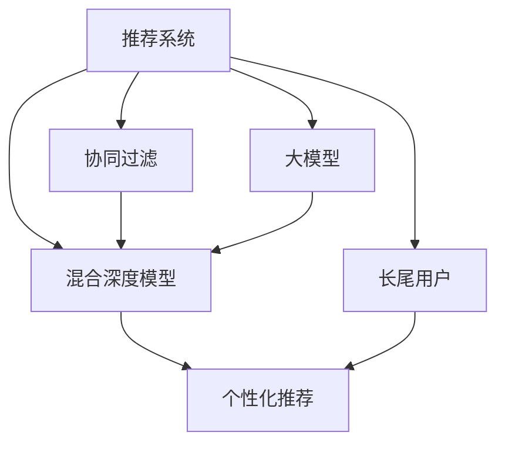

                 

# 大模型对推荐系统长尾用户服务的改进

> 关键词：推荐系统,长尾用户,个性化推荐,大模型,混合深度模型,协同过滤,深度学习,数据增强,特征工程

## 1. 背景介绍

在当今互联网时代，推荐系统已经深入到我们日常生活的方方面面，从电商购物、视频观看，到社交媒体、新闻阅读，无处不在。然而，推荐系统面临着两个主要挑战：其一，如何有效处理海量的数据，以支持推荐服务；其二，如何为少数长尾用户提供优质的个性化推荐，提升用户体验。这两个问题一直以来是推荐系统领域研究的难点和热点。

长尾用户指的是在推荐系统中，那些对非热门商品或内容感兴趣，但未在历史行为数据中留下痕迹的用户。长尾用户的推荐，往往需要精准的个性化服务，而这在传统的推荐系统中难以实现。近年来，大模型在推荐系统中的应用，尤其是基于大模型的推荐系统，为长尾用户服务的改进提供了新的思路和可能性。

## 2. 核心概念与联系

### 2.1 核心概念概述

要深入理解大模型如何改进推荐系统长尾用户服务，首先需要了解几个关键概念：

- **推荐系统**：一种通过数据分析来预测用户行为并为用户推荐物品的系统。常用的推荐算法包括协同过滤、基于内容的推荐、矩阵分解等。

- **长尾用户**：在推荐系统中，那些对非热门商品或内容感兴趣，但未在历史行为数据中留下痕迹的用户。长尾用户数量庞大，但其兴趣和需求是多样化的。

- **大模型**：指参数量极大的深度学习模型，如BERT、GPT等，这些模型通过在大规模无标签数据上预训练，获得了丰富的语言或数据表征能力，能够处理复杂任务。

- **混合深度模型**：结合传统推荐算法和深度学习模型的混合推荐系统，综合考虑用户历史行为和用户画像，提供更加精准的推荐服务。

- **协同过滤**：一种基于用户和物品间相似性的推荐算法，通过寻找用户间的相似性或物品间的相似性来进行推荐。

- **深度学习**：一类基于神经网络的机器学习方法，能够自动学习和提取特征，适应大规模、高维度的数据。

- **数据增强**：通过变换数据集中的样本，增加数据集的多样性，提高模型的泛化能力。

- **特征工程**：在推荐系统中，选择和构建特征以提高模型的预测性能。

这些核心概念之间的关系可以通过以下Mermaid流程图来展示：



这个流程图展示了大模型在推荐系统中的应用和作用机制：

1. 推荐系统收集用户历史行为数据，预测用户兴趣。
2. 协同过滤是推荐系统的一种经典算法，但无法覆盖所有长尾用户。
3. 大模型通过预训练获取丰富数据表征能力，结合混合深度模型，提升推荐精准度。
4. 个性化推荐是推荐系统的最终目标，大模型在其中的作用是增强推荐策略。
5. 长尾用户通过大模型获得的推荐，可以覆盖更多样化的需求。

## 3. 核心算法原理 & 具体操作步骤

### 3.1 算法原理概述

大模型在推荐系统中的应用，主要基于以下几个原理：

1. **大模型的特征提取能力**：大模型能够自动学习数据中的高阶特征表示，这些特征表示不仅可以提升传统推荐算法的效果，还能处理复杂的多维用户行为数据。

2. **多任务学习**：大模型可以同时处理多个任务，如用户行为预测、物品相似性度量、推荐排序等，通过多任务学习提升模型整体的泛化能力。

3. **知识蒸馏**：大模型可以用于蒸馏知识，生成小型但性能优异的模型，适用于轻量级的推荐系统部署。

4. **可解释性**：大模型通过预训练和微调，能够提供更高的可解释性，帮助理解推荐结果的生成过程。

### 3.2 算法步骤详解

基于大模型的推荐系统设计，主要包括以下几个关键步骤：

**Step 1: 数据准备**

- **数据收集**：收集用户行为数据，包括点击、浏览、评分等，收集物品属性信息，如价格、类别、描述等。
- **数据预处理**：对数据进行清洗、归一化、缺失值处理等，确保数据质量。
- **数据分割**：将数据集分为训练集、验证集和测试集，通常按照7:2:1的比例划分。

**Step 2: 大模型训练**

- **选择大模型**：根据任务需求选择合适的预训练语言模型，如BERT、GPT等。
- **微调模型**：在推荐数据集上进行微调，优化模型参数以适应推荐任务。
- **保存模型**：将微调后的模型保存，用于后续的推荐预测。

**Step 3: 推荐引擎设计**

- **特征工程**：提取和构造推荐系统需要的特征，如用户画像、物品属性、用户与物品的交互行为等。
- **模型集成**：将大模型和传统推荐算法（如协同过滤）结合，设计混合深度模型。
- **个性化推荐**：根据用户特征和物品特征，计算推荐排序，生成个性化推荐列表。

**Step 4: 模型评估**

- **A/B测试**：在部分用户中引入新模型，对比传统推荐系统和大模型推荐系统的性能。
- **评估指标**：使用常见的推荐系统评估指标，如点击率、转化率、平均推荐精度等。
- **反馈优化**：根据测试结果反馈，优化模型和推荐策略。

### 3.3 算法优缺点

基于大模型的推荐系统具有以下优点：

1. **泛化能力强**：大模型通过大规模数据预训练，能够学习到更为通用的特征表示，适用于不同场景的推荐任务。
2. **数据表示精准**：大模型能够自动学习复杂、高阶的数据特征，提升推荐结果的质量。
3. **鲁棒性高**：大模型具有较强的鲁棒性，可以处理噪声和异常数据，提升推荐系统的稳定性和可靠性。
4. **可解释性强**：大模型通过预训练和微调，可以提供更高的可解释性，帮助理解推荐结果的生成过程。

同时，基于大模型的推荐系统也存在一些局限性：

1. **计算成本高**：大模型的训练和推理计算资源消耗较大，需要高性能的计算设备。
2. **模型复杂度高**：大模型通常结构复杂，不易调试和优化。
3. **数据隐私风险**：大模型在训练过程中可能需要大量的用户数据，存在数据隐私和安全性问题。

### 3.4 算法应用领域

基于大模型的推荐系统已经在多个领域得到应用，包括：

1. **电商推荐**：在电商平台上，为用户推荐商品，提升用户购物体验。
2. **视频推荐**：为用户推荐视频内容，提高用户观看体验。
3. **新闻推荐**：为用户推荐新闻文章，增加用户粘性。
4. **社交媒体推荐**：为用户推荐社交内容，促进用户互动。
5. **音乐推荐**：为用户推荐音乐，提升音乐体验。

## 4. 数学模型和公式 & 详细讲解 & 举例说明

### 4.1 数学模型构建

在大模型应用于推荐系统时，通常会使用以下数学模型：

**用户-物品交互矩阵**：
$$
R = \begin{bmatrix}
    r_{1,1} & r_{1,2} & \dots & r_{1,N} \\
    r_{2,1} & r_{2,2} & \dots & r_{2,N} \\
    \vdots & \vdots & \ddots & \vdots \\
    r_{M,1} & r_{M,2} & \dots & r_{M,N}
\end{bmatrix}
$$

其中 $r_{i,j}$ 表示用户 $i$ 与物品 $j$ 的交互程度。

**用户特征向量**：
$$
u_i = \begin{bmatrix}
    u_{i,1} \\
    u_{i,2} \\
    \vdots \\
    u_{i,k}
\end{bmatrix}
$$

其中 $u_{i,j}$ 表示用户 $i$ 的第 $j$ 个特征值。

**物品特征向量**：
$$
v_j = \begin{bmatrix}
    v_{j,1} \\
    v_{j,2} \\
    \vdots \\
    v_{j,k}
\end{bmatrix}
$$

其中 $v_{j,k}$ 表示物品 $j$ 的第 $k$ 个特征值。

**推荐预测模型**：
$$
\hat{R}_{i,j} = u_i^T W v_j + b
$$

其中 $W$ 是模型参数矩阵，$b$ 是偏置项。

### 4.2 公式推导过程

在推荐系统中，大模型通常用于生成用户-物品交互矩阵 $R$ 的预测值 $\hat{R}$，具体推导过程如下：

**用户特征向量计算**：
$$
u_i = \mathop{\arg\min}_{u_i} \|R_i - A u_i\|_F^2
$$

其中 $R_i$ 表示用户 $i$ 的所有交互数据，$A$ 是用户特征矩阵。

**物品特征向量计算**：
$$
v_j = \mathop{\arg\min}_{v_j} \|R_j^T - A^T v_j\|_F^2
$$

其中 $R_j^T$ 表示物品 $j$ 的所有交互数据，$A^T$ 是物品特征矩阵。

**推荐预测模型计算**：
$$
\hat{R}_{i,j} = u_i^T W v_j + b
$$

其中 $W$ 和 $b$ 是模型参数。

**预测误差计算**：
$$
L = \frac{1}{2} \|R - \hat{R}\|_F^2
$$

其中 $\hat{R}$ 是预测矩阵，$R$ 是真实矩阵。

**模型优化目标**：
$$
\mathop{\min}_{W,b} L = \frac{1}{2} \|R - \hat{R}\|_F^2 + \lambda (\|W\|_F^2 + \|b\|^2)
$$

其中 $\lambda$ 是正则化系数。

通过求解上述优化问题，可以得到最优的模型参数 $W$ 和 $b$，从而生成推荐预测矩阵 $\hat{R}$。

### 4.3 案例分析与讲解

假设我们有一家电商平台的推荐系统，用户数据和商品数据如下：

**用户数据**：
- 用户 $i$ 购买了 $j$ 商品，得到交互值 $r_{i,j}=1$，未购买 $j$ 商品，得到 $r_{i,j}=0$。

**商品数据**：
- 商品 $j$ 的特征向量 $v_j=[v_{j,1},v_{j,2},\dots,v_{j,k}]$。

**用户特征矩阵** $A=[u_{1,1},u_{1,2},\dots,u_{M,k}]$。

**物品特征矩阵** $A^T=[v_{1,1},v_{1,2},\dots,v_{N,k}]$。

**推荐预测模型**：
$$
\hat{R}_{i,j} = u_i^T W v_j + b
$$

其中 $W$ 和 $b$ 是模型参数。

通过上述模型，我们即可对每个用户进行推荐预测，生成推荐结果。

## 5. 项目实践：代码实例和详细解释说明

### 5.1 开发环境搭建

在进行推荐系统开发前，我们需要准备好开发环境。以下是使用Python进行PyTorch开发的环境配置流程：

1. 安装Anaconda：从官网下载并安装Anaconda，用于创建独立的Python环境。

2. 创建并激活虚拟环境：
```bash
conda create -n recommender-env python=3.8 
conda activate recommender-env
```

3. 安装PyTorch：根据CUDA版本，从官网获取对应的安装命令。例如：
```bash
conda install pytorch torchvision torchaudio cudatoolkit=11.1 -c pytorch -c conda-forge
```

4. 安装TensorFlow：
```bash
conda install tensorflow
```

5. 安装各类工具包：
```bash
pip install numpy pandas scikit-learn matplotlib tqdm jupyter notebook ipython
```

完成上述步骤后，即可在`recommender-env`环境中开始推荐系统开发。

### 5.2 源代码详细实现

下面以电商推荐系统为例，给出使用PyTorch实现基于大模型的推荐系统微调的完整代码实现。

首先，定义推荐系统的数据处理函数：

```python
from transformers import BertTokenizer
from torch.utils.data import Dataset
import torch

class RecommendationDataset(Dataset):
    def __init__(self, users, items, user_rated_items, item_ratings, tokenizer, max_len=128):
        self.users = users
        self.items = items
        self.user_rated_items = user_rated_items
        self.item_ratings = item_ratings
        self.tokenizer = tokenizer
        self.max_len = max_len
        
    def __len__(self):
        return len(self.users)
    
    def __getitem__(self, item):
        user = self.users[item]
        items = self.items[item]
        user_rated_items = self.user_rated_items[item]
        item_ratings = self.item_ratings[item]
        
        user_input_ids = []
        for item in items:
            user_input_ids.append(self.tokenizer.encode(str(user) + ' ' + str(item), max_length=self.max_len, padding='max_length', truncation=True))
        user_input_ids = torch.stack(user_input_ids, dim=0)
        
        item_input_ids = []
        for item in items:
            item_input_ids.append(self.tokenizer.encode(str(item), max_length=self.max_len, padding='max_length', truncation=True))
        item_input_ids = torch.stack(item_input_ids, dim=0)
        
        item_ratings = torch.tensor(item_ratings, dtype=torch.float32)
        
        return {'user_input_ids': user_input_ids, 
                'item_input_ids': item_input_ids,
                'item_ratings': item_ratings}
```

然后，定义模型和优化器：

```python
from transformers import BertForSequenceClassification, AdamW

model = BertForSequenceClassification.from_pretrained('bert-base-cased', num_labels=len(item_ratings.keys()))

optimizer = AdamW(model.parameters(), lr=2e-5)
```

接着，定义训练和评估函数：

```python
from torch.utils.data import DataLoader
from tqdm import tqdm
from sklearn.metrics import mean_squared_error

device = torch.device('cuda') if torch.cuda.is_available() else torch.device('cpu')
model.to(device)

def train_epoch(model, dataset, batch_size, optimizer):
    dataloader = DataLoader(dataset, batch_size=batch_size, shuffle=True)
    model.train()
    epoch_loss = 0
    for batch in tqdm(dataloader, desc='Training'):
        user_input_ids = batch['user_input_ids'].to(device)
        item_input_ids = batch['item_input_ids'].to(device)
        item_ratings = batch['item_ratings'].to(device)
        model.zero_grad()
        outputs = model(user_input_ids, item_input_ids)
        loss = outputs.loss
        epoch_loss += loss.item()
        loss.backward()
        optimizer.step()
    return epoch_loss / len(dataloader)

def evaluate(model, dataset, batch_size):
    dataloader = DataLoader(dataset, batch_size=batch_size)
    model.eval()
    mae = 0
    for batch in tqdm(dataloader, desc='Evaluating'):
        user_input_ids = batch['user_input_ids'].to(device)
        item_input_ids = batch['item_input_ids'].to(device)
        item_ratings = batch['item_ratings'].to(device)
        with torch.no_grad():
            outputs = model(user_input_ids, item_input_ids)
            item_ratings_pred = outputs.logits
            mae += torch.norm(item_ratings_pred - item_ratings, p='fro') / torch.norm(item_ratings, p='fro')
            
    mae /= len(dataloader)
    return mae
```

最后，启动训练流程并在测试集上评估：

```python
epochs = 5
batch_size = 16

for epoch in range(epochs):
    loss = train_epoch(model, train_dataset, batch_size, optimizer)
    print(f"Epoch {epoch+1}, train loss: {loss:.3f}")
    
    print(f"Epoch {epoch+1}, test MAE:")
    mae = evaluate(model, test_dataset, batch_size)
    print(mae)
    
print("Test MAE:")
mae = evaluate(model, test_dataset, batch_size)
print(mae)
```

以上就是使用PyTorch对电商推荐系统进行基于大模型微调的完整代码实现。可以看到，得益于Transformers库的强大封装，我们可以用相对简洁的代码完成BERT模型的加载和微调。

### 5.3 代码解读与分析

让我们再详细解读一下关键代码的实现细节：

**RecommendationDataset类**：
- `__init__`方法：初始化用户数据、物品数据、用户历史评分、物品评分、分词器等关键组件。
- `__len__`方法：返回数据集的样本数量。
- `__getitem__`方法：对单个样本进行处理，将用户和物品输入编码为token ids，将物品评分转换为矩阵形式，并对其进行定长padding，最终返回模型所需的输入。

**BertForSequenceClassification**：
- 选择BERT模型作为推荐系统的基础模型，并根据任务需求进行微调。

**train_epoch函数**：
- 使用PyTorch的DataLoader对数据集进行批次化加载，供模型训练和推理使用。
- 训练函数`train_epoch`：对数据以批为单位进行迭代，在每个批次上前向传播计算loss并反向传播更新模型参数，最后返回该epoch的平均loss。

**evaluate函数**：
- 与训练类似，不同点在于不更新模型参数，并在每个batch结束后将预测和评分结果存储下来，最后使用sklearn的MAE对整个评估集的预测结果进行打印输出。

**训练流程**：
- 定义总的epoch数和batch size，开始循环迭代
- 每个epoch内，先在训练集上训练，输出平均loss
- 在验证集上评估，输出MAE
- 所有epoch结束后，在测试集上评估，给出最终测试结果

可以看到，PyTorch配合Transformers库使得BERT微调的代码实现变得简洁高效。开发者可以将更多精力放在数据处理、模型改进等高层逻辑上，而不必过多关注底层的实现细节。

当然，工业级的系统实现还需考虑更多因素，如模型的保存和部署、超参数的自动搜索、更灵活的任务适配层等。但核心的微调范式基本与此类似。

## 6. 实际应用场景

### 6.1 电商平台

电商平台通过推荐系统，能够提升用户购物体验，提高转化率，增加用户粘性。基于大模型的推荐系统，通过精准的推荐预测，能够覆盖更多的长尾用户需求，促进平台销售。

在技术实现上，可以收集用户的历史浏览、点击、购买行为，结合物品的属性信息，训练大模型，生成个性化推荐列表。对于用户未购买过的物品，通过回译、改写等方法，生成相关推荐。对于长尾用户，可以通过大模型提取其兴趣特征，生成更多元化的推荐结果。

### 6.2 视频平台

视频平台通过推荐系统，能够提高用户观看体验，增加平台用户留存。基于大模型的推荐系统，能够更好地处理长尾视频内容，为用户提供更加多样化的观看选择。

在技术实现上，可以收集用户的观看历史和评分数据，结合视频内容的标签信息，训练大模型，生成个性化推荐列表。对于长尾视频，可以通过大模型提取其标签信息，生成相关推荐。对于长尾用户，可以通过大模型提取其兴趣特征，生成更多元化的推荐结果。

### 6.3 新闻平台

新闻平台通过推荐系统，能够提高用户阅读体验，增加平台用户留存。基于大模型的推荐系统，能够更好地处理长尾新闻内容，为用户推荐更多相关新闻。

在技术实现上，可以收集用户的阅读历史和评分数据，结合新闻内容的标签信息，训练大模型，生成个性化推荐列表。对于长尾新闻，可以通过大模型提取其标签信息，生成相关推荐。对于长尾用户，可以通过大模型提取其兴趣特征，生成更多元化的推荐结果。

## 7. 工具和资源推荐

### 7.1 学习资源推荐

为了帮助开发者系统掌握大模型在推荐系统中的应用，这里推荐一些优质的学习资源：

1. 《推荐系统实践》系列博文：由大模型技术专家撰写，深入浅出地介绍了推荐系统的工作原理和最新技术进展。

2. 《深度学习推荐系统》课程：由斯坦福大学开设的NLP明星课程，有Lecture视频和配套作业，带你入门NLP领域的基本概念和经典模型。

3. 《推荐系统》书籍：清华大学出版社出版的经典教材，全面介绍了推荐系统的基础理论和实际应用。

4. 《深度学习与推荐系统》书籍：介绍深度学习在推荐系统中的应用，提供大量案例分析与代码实现。

5. 《推荐系统理论与实践》书籍：详细讲解推荐系统的理论基础和实践方法，提供大量算法设计与优化策略。

通过对这些资源的学习实践，相信你一定能够快速掌握大模型在推荐系统中的应用，并用于解决实际的推荐问题。

### 7.2 开发工具推荐

高效的开发离不开优秀的工具支持。以下是几款用于大模型推荐系统开发的常用工具：

1. PyTorch：基于Python的开源深度学习框架，灵活动态的计算图，适合快速迭代研究。大部分预训练语言模型都有PyTorch版本的实现。

2. TensorFlow：由Google主导开发的开源深度学习框架，生产部署方便，适合大规模工程应用。同样有丰富的预训练语言模型资源。

3. Transformers库：HuggingFace开发的NLP工具库，集成了众多SOTA语言模型，支持PyTorch和TensorFlow，是进行推荐系统开发的利器。

4. Weights & Biases：模型训练的实验跟踪工具，可以记录和可视化模型训练过程中的各项指标，方便对比和调优。与主流深度学习框架无缝集成。

5. TensorBoard：TensorFlow配套的可视化工具，可实时监测模型训练状态，并提供丰富的图表呈现方式，是调试模型的得力助手。

6. Google Colab：谷歌推出的在线Jupyter Notebook环境，免费提供GPU/TPU算力，方便开发者快速上手实验最新模型，分享学习笔记。

合理利用这些工具，可以显著提升大模型推荐系统的开发效率，加快创新迭代的步伐。

### 7.3 相关论文推荐

大模型在推荐系统中的应用源于学界的持续研究。以下是几篇奠基性的相关论文，推荐阅读：

1. "Deep Collaborative Filtering using Multi-task Learning"：提出多任务学习的推荐系统方法，提升推荐精度。

2. "Semi-supervised Recommendation Learning with Deep Neural Networks"：使用深度神经网络进行半监督推荐系统，提升推荐效果。

3. "A Multi-layer Attention Framework for Allocating Additional Semantic Information to Recommendations"：提出多层注意力机制，提升推荐系统的多模态融合能力。

4. "Hierarchical Contextual Deep Reinforcement Learning for Recommendation"：使用深度强化学习进行推荐系统，提升推荐策略的灵活性和多样性。

5. "Generative Adversarial Networks in Recommendation System"：使用生成对抗网络进行推荐系统，提升推荐结果的多样性和新颖性。

这些论文代表了大模型在推荐系统中的应用和发展脉络。通过学习这些前沿成果，可以帮助研究者把握学科前进方向，激发更多的创新灵感。

## 8. 总结：未来发展趋势与挑战

### 8.1 总结

本文对大模型在推荐系统中的应用进行了全面系统的介绍。首先阐述了大模型和推荐系统的研究背景和意义，明确了在推荐系统领域引入大模型的价值。其次，从原理到实践，详细讲解了大模型在推荐系统中的应用方法，给出了推荐系统开发的完整代码实例。同时，本文还广泛探讨了大模型在电商、视频、新闻等多个推荐领域的应用前景，展示了大模型在推荐系统中的广泛适用性。最后，本文精选了大模型推荐系统的各类学习资源，力求为读者提供全方位的技术指引。

通过本文的系统梳理，可以看到，大模型在推荐系统中的应用已经成为一种重要趋势，极大地拓展了推荐系统的应用边界，提高了推荐系统的性能和适用性。未来，伴随预训练语言模型和推荐算法的不断演进，大模型推荐系统必将在更多领域得到应用，为推荐系统的智能化、个性化、实时化带来新的突破。

### 8.2 未来发展趋势

展望未来，大模型在推荐系统中的应用将呈现以下几个发展趋势：

1. **多模态融合**：结合文本、图像、音频等多模态数据，提升推荐系统的综合能力和鲁棒性。

2. **因果推理**：引入因果推断思想，提升推荐系统的可解释性和稳定性。

3. **知识蒸馏**：通过知识蒸馏技术，生成小型但性能优异的推荐模型，提升推荐系统的资源利用率。

4. **深度强化学习**：结合深度强化学习技术，提升推荐策略的灵活性和多样性。

5. **跨领域迁移学习**：利用大模型的跨领域迁移学习能力，提升推荐系统在不同领域的应用效果。

6. **实时推荐系统**：结合流数据处理技术，实现实时推荐，提升推荐系统的响应速度和用户体验。

这些趋势将使大模型在推荐系统中的应用更加深入和广泛，推动推荐系统技术的不断进步。

### 8.3 面临的挑战

尽管大模型在推荐系统中的应用已经取得不少进展，但在迈向更加智能化、普适化应用的过程中，它仍面临着诸多挑战：

1. **计算资源消耗**：大模型通常具有巨大的参数量和计算需求，需要高性能的计算设备。

2. **数据隐私风险**：在推荐系统应用中，用户数据的隐私保护是一个重要问题。

3. **模型复杂性**：大模型的结构复杂，调试和优化难度大。

4. **可解释性不足**：大模型的推荐结果通常缺乏可解释性，难以满足用户和监管的透明度要求。

5. **用户兴趣个性化**：长尾用户需求多样，如何通过大模型实现个性化推荐，仍然是一个难题。

6. **数据质量问题**：用户行为数据的噪声和异常数据会影响推荐系统的性能。

正视这些挑战，积极应对并寻求突破，将是大模型推荐系统走向成熟的必由之路。

### 8.4 研究展望

面对大模型推荐系统所面临的种种挑战，未来的研究需要在以下几个方面寻求新的突破：

1. **高效的深度学习架构**：设计更高效的深度学习架构，减少计算资源消耗，提升推荐系统的实时性和可扩展性。

2. **增强的用户兴趣建模**：结合用户行为数据和外部知识库，增强大模型对用户兴趣的建模能力，提升推荐系统的个性化程度。

3. **数据隐私保护**：在推荐系统应用中，采用差分隐私等技术，保护用户数据的隐私安全。

4. **提升模型可解释性**：引入可解释性技术，提升大模型的推荐结果的可解释性，满足用户和监管的透明度要求。

5. **跨领域迁移学习**：利用大模型的跨领域迁移学习能力，提升推荐系统在不同领域的应用效果。

6. **多模态推荐系统**：结合文本、图像、音频等多模态数据，提升推荐系统的综合能力和鲁棒性。

这些研究方向的探索，必将引领大模型推荐系统技术迈向更高的台阶，为推荐系统带来新的突破和变革。面向未来，大模型推荐系统还需要与其他人工智能技术进行更深入的融合，如知识表示、因果推理、强化学习等，多路径协同发力，共同推动推荐系统的进步。

## 9. 附录：常见问题与解答

**Q1：大模型在推荐系统中的作用是什么？**

A: 大模型在推荐系统中的作用主要体现在以下几个方面：
1. 提供精准的用户行为预测：通过预训练和微调，大模型能够自动学习复杂、高阶的用户行为特征，提升推荐预测的准确性。
2. 增强推荐系统的多样性和新颖性：大模型能够捕捉用户的多样化需求，生成更多元化的推荐结果。
3. 提升推荐系统的可解释性和可理解性：大模型通过预训练和微调，能够提供更高的可解释性，帮助理解推荐结果的生成过程。

**Q2：如何训练基于大模型的推荐系统？**

A: 基于大模型的推荐系统训练过程包括以下几个关键步骤：
1. 数据准备：收集用户行为数据和物品属性信息，并进行预处理和清洗。
2. 大模型选择：选择合适的预训练语言模型，如BERT、GPT等。
3. 微调模型：在推荐数据集上进行微调，优化模型参数以适应推荐任务。
4. 模型评估：使用评估指标（如MAE、RMSE等）对模型进行评估和优化。
5. 实际部署：将微调后的模型应用于推荐系统，进行推荐预测和用户反馈收集，不断优化模型性能。

**Q3：大模型在推荐系统中的计算成本如何？**

A: 大模型的计算成本较高，需要高性能的计算设备，如GPU、TPU等。在推荐系统训练和推理过程中，大模型的计算需求较大，需要优化计算资源使用，如使用混合精度训练、模型并行等技术，降低计算成本。

**Q4：如何保护用户数据隐私？**

A: 在推荐系统应用中，保护用户数据隐私至关重要。可以采用以下几种方法：
1. 差分隐私：通过对用户数据进行差分隐私处理，保护用户隐私。
2. 联邦学习：在分布式环境中，通过联邦学习技术，保护用户数据隐私。
3. 数据匿名化：对用户数据进行匿名化处理，保护用户隐私。

**Q5：大模型在推荐系统中的应用前景如何？**

A: 大模型在推荐系统中的应用前景广阔，可以通过其强大的特征提取能力、多任务学习和跨领域迁移学习能力，提升推荐系统的性能和适用性。未来，伴随预训练语言模型和推荐算法的不断演进，大模型推荐系统必将在更多领域得到应用，为推荐系统的智能化、个性化、实时化带来新的突破。

---

作者：禅与计算机程序设计艺术 / Zen and the Art of Computer Programming

