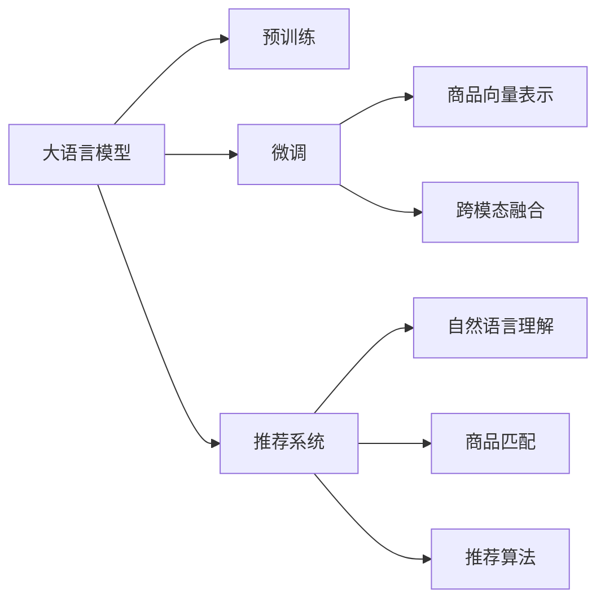

                 

# 大模型技术在商品搜索中的创新应用

## 1. 背景介绍

商品搜索是电商行业中最基础且关键的功能之一。随着商品种类的多样化以及用户需求的多样化，传统的基于关键词匹配的商品搜索算法已经无法满足用户的需求。如何利用人工智能技术提升商品搜索的准确性和个性化体验，成为了当前电商技术的重要课题。大模型技术，特别是基于Transformer架构的预训练语言模型，为这一问题的解决提供了新的思路和可能性。

### 1.1 问题由来

商品搜索本质上是一个自然语言理解（Natural Language Understanding, NLU）和自然语言生成（Natural Language Generation, NLG）的交叉领域。传统方法如TF-IDF、倒排索引等主要依赖关键词的匹配，难以捕捉词汇之间的复杂语义关系。而基于大模型的搜索技术，则通过预训练模型学习了广泛的语义信息，能够更好地理解自然语言输入，并生成语义相关的搜索结果。

然而，大模型技术在商品搜索中的应用仍面临诸多挑战。一方面，大模型通常需要海量的训练数据和计算资源，难以快速迭代。另一方面，如何将大模型的强大语义理解能力转化为高精度的商品推荐，需要设计合适的任务适配层，并解决模型的可解释性和计算效率问题。

## 2. 核心概念与联系

### 2.1 核心概念概述

在商品搜索领域，大模型技术可以应用于多个环节，包括自然语言理解、商品匹配、推荐系统等。以下是一些核心概念的介绍：

- **大语言模型(Large Language Model, LLM)**：以Transformer架构为代表的大规模预训练语言模型，如BERT、GPT等。通过在大量文本数据上进行预训练，学习通用的语言表示。

- **Transformer架构**：基于自注意力机制的神经网络架构，能够有效捕捉句子中词汇之间的复杂关系。

- **预训练和微调**：大模型通常先在无标签文本数据上进行预训练，然后在特定任务上通过微调进一步优化性能。

- **商品向量表示**：将商品转化为向量表示，便于在语义空间中进行匹配和推荐。

- **跨模态融合**：将文本、图像、视频等多模态数据进行融合，提升搜索和推荐的全面性。

- **推荐系统**：通过分析用户行为和偏好，为用户推荐最相关商品的系统。

这些概念之间的联系可以通过以下Mermaid流程图来展示：



这个流程图展示了大语言模型技术在商品搜索中的应用流程：

1. 大语言模型通过预训练获得基础能力。
2. 通过微调获得特定任务（如商品匹配）的优化能力。
3. 商品向量表示用于语义空间中的匹配。
4. 跨模态融合增强推荐的全面性。
5. 推荐系统综合分析并推荐商品。
6. 自然语言理解解析用户输入。
7. 商品匹配找到最相关商品。
8. 推荐算法实现推荐逻辑。

## 3. 核心算法原理 & 具体操作步骤

### 3.1 算法原理概述

基于大模型的商品搜索算法，其核心思想是将自然语言查询转化为向量表示，并在商品向量空间中进行匹配和排序。具体流程如下：

1. **文本表示**：使用大语言模型将查询和商品文本转化为向量表示。
2. **相似度计算**：计算查询向量与商品向量之间的相似度，得到排序结果。
3. **推荐排序**：根据相似度排序结果，推荐最相关的商品。
4. **动态调整**：根据用户反馈和行为数据，动态调整模型参数和推荐策略。

### 3.2 算法步骤详解

以下是基于大模型技术的商品搜索算法的详细步骤：

**Step 1: 文本表示**

首先，需要将用户查询和商品描述转化为向量表示。一种常见的方法是使用BERT等预训练模型，直接将文本输入模型得到其对应的向量表示。具体步骤如下：

1. 选择预训练模型，如BERT、RoBERTa等。
2. 加载模型，并配置相应的参数，如模型架构、向量维度等。
3. 使用模型将查询和商品描述转换为向量表示。

**Step 2: 相似度计算**

向量表示获取后，可以使用余弦相似度、欧几里得距离等方法计算查询向量与商品向量之间的相似度。具体步骤如下：

1. 计算查询向量和商品向量之间的余弦相似度。
2. 根据相似度大小排序，得到推荐结果。

**Step 3: 推荐排序**

推荐排序的目的是根据相似度大小对商品进行排序，并推荐最相关的商品。具体步骤如下：

1. 定义推荐策略，如基于排序的策略、基于召回的策略等。
2. 根据推荐策略对排序结果进行优化，得到最终的推荐商品列表。

**Step 4: 动态调整**

推荐系统需要不断根据用户行为数据进行动态调整，以优化推荐效果。具体步骤如下：

1. 收集用户行为数据，如点击、浏览、购买等。
2. 使用机器学习模型对用户行为进行建模，预测用户偏好。
3. 根据预测结果调整模型参数和推荐策略。

### 3.3 算法优缺点

基于大模型的商品搜索算法具有以下优点：

- **高精度匹配**：通过预训练模型学习丰富的语义信息，能够更好地理解自然语言输入。
- **全面性推荐**：结合跨模态融合技术，提升推荐的全面性和准确性。
- **自适应性**：根据用户行为数据进行动态调整，提高推荐的个性化和及时性。

同时，该算法也存在以下缺点：

- **计算资源要求高**：大模型需要大量计算资源进行训练和推理。
- **解释性不足**：大模型的决策过程较为复杂，难以解释推荐理由。
- **数据依赖性强**：模型效果高度依赖于训练数据的数量和质量。

## 4. 数学模型和公式 & 详细讲解 & 举例说明

### 4.1 数学模型构建

基于大模型的商品搜索算法，可以构建以下数学模型：

设用户查询为 $q$，商品描述为 $d$，使用BERT模型将查询和商品描述转换为向量表示 $q_v$ 和 $d_v$。商品向量与查询向量的相似度可以表示为：

$$
sim(q_v, d_v) = \cos(\theta(q_v, d_v)) = \frac{\vec{q_v} \cdot \vec{d_v}}{||\vec{q_v}|| ||\vec{d_v}||}
$$

其中，$\vec{q_v}$ 和 $\vec{d_v}$ 分别为查询和商品向量，$||\cdot||$ 表示向量的欧几里得范数，$\theta(q_v, d_v)$ 表示向量之间的夹角余弦值。

根据相似度大小对商品进行排序，得到推荐商品列表 $R$：

$$
R = \text{argmin}_{i=1}^N sim(q_v, d_{v_i})
$$

其中 $d_{v_i}$ 表示第 $i$ 个商品的向量表示。

### 4.2 公式推导过程

为了更好地理解上述公式，下面进行详细推导：

1. **查询向量和商品向量的计算**：

   查询 $q$ 和商品 $d$ 首先通过BERT模型转化为向量表示 $q_v$ 和 $d_v$。

   $$
   q_v = BERT(q)
   $$
   $$
   d_v = BERT(d)
   $$

2. **相似度的计算**：

   向量 $q_v$ 和 $d_v$ 之间的相似度可以通过余弦相似度计算得到。

   $$
   sim(q_v, d_v) = \cos(\theta(q_v, d_v))
   $$

   其中，$\theta(q_v, d_v)$ 表示向量之间的夹角余弦值。

   $$
   \theta(q_v, d_v) = \frac{\vec{q_v} \cdot \vec{d_v}}{||\vec{q_v}|| ||\vec{d_v}||}
   $$

   $\vec{q_v} \cdot \vec{d_v}$ 表示向量点积，$||\vec{q_v}||$ 和 $||\vec{d_v}||$ 分别表示向量的欧几里得范数。

3. **排序和推荐**：

   根据相似度大小，对商品进行排序，得到推荐商品列表 $R$：

   $$
   R = \text{argmin}_{i=1}^N sim(q_v, d_{v_i})
   $$

### 4.3 案例分析与讲解

以下是一个商品搜索的实际案例：

假设用户输入查询为 "运动鞋"，商品库中有多个运动鞋商品描述。使用BERT模型将查询和商品描述转化为向量表示，并计算相似度：

1. 查询向量表示为 $q_v = [q_{v1}, q_{v2}, q_{v3}, \ldots]$。
2. 商品向量表示为 $d_v = [d_{v1}, d_{v2}, d_{v3}, \ldots]$。
3. 计算相似度 $sim(q_v, d_v) = [sim(q_{v1}, d_{v1}), sim(q_{v1}, d_{v2}), sim(q_{v1}, d_{v3}), \ldots]$。
4. 根据相似度大小排序，得到推荐商品列表 $R$。

通过以上步骤，可以快速计算出最相关的运动鞋商品，并展示给用户。

## 5. 项目实践：代码实例和详细解释说明

### 5.1 开发环境搭建

在进行商品搜索开发前，我们需要准备好开发环境。以下是使用Python进行PyTorch开发的环境配置流程：

1. 安装Anaconda：从官网下载并安装Anaconda，用于创建独立的Python环境。

2. 创建并激活虚拟环境：
```bash
conda create -n pytorch-env python=3.8 
conda activate pytorch-env
```

3. 安装PyTorch：根据CUDA版本，从官网获取对应的安装命令。例如：
```bash
conda install pytorch torchvision torchaudio cudatoolkit=11.1 -c pytorch -c conda-forge
```

4. 安装Transformer库：
```bash
pip install transformers
```

5. 安装各类工具包：
```bash
pip install numpy pandas scikit-learn matplotlib tqdm jupyter notebook ipython
```

完成上述步骤后，即可在`pytorch-env`环境中开始商品搜索开发。

### 5.2 源代码详细实现

以下是一个基于BERT模型的商品搜索系统示例代码：

```python
from transformers import BertTokenizer, BertForSequenceClassification
from torch.utils.data import DataLoader
from sklearn.metrics import mean_absolute_error, mean_squared_error
from torch import nn, optim
import torch.nn.functional as F

# 定义查询和商品数据集
class ProductDataset(Dataset):
    def __init__(self, data):
        self.data = data
        self.tokenizer = BertTokenizer.from_pretrained('bert-base-uncased')
        self.max_len = 512
    
    def __len__(self):
        return len(self.data)
    
    def __getitem__(self, index):
        item = self.data[index]
        title = item[0]
        description = item[1]
        
        # 对商品标题和描述进行分词并编码
        encoding = self.tokenizer(title + ' ' + description, max_length=self.max_len, padding='max_length', truncation=True, return_tensors='pt')
        input_ids = encoding['input_ids']
        attention_mask = encoding['attention_mask']
        
        return {
            'input_ids': input_ids.flatten(),
            'attention_mask': attention_mask.flatten(),
            'labels': item[2]
        }

# 加载数据集
train_dataset = ProductDataset(train_data)
val_dataset = ProductDataset(val_data)
test_dataset = ProductDataset(test_data)

# 定义模型和优化器
model = BertForSequenceClassification.from_pretrained('bert-base-uncased', num_labels=2)
optimizer = optim.Adam(model.parameters(), lr=2e-5)

# 定义损失函数
loss_fn = nn.CrossEntropyLoss()

# 训练函数
def train_epoch(model, dataset, optimizer, loss_fn):
    dataloader = DataLoader(dataset, batch_size=16, shuffle=True)
    model.train()
    epoch_loss = 0
    for batch in dataloader:
        input_ids = batch['input_ids'].to(device)
        attention_mask = batch['attention_mask'].to(device)
        labels = batch['labels'].to(device)
        
        # 前向传播
        logits = model(input_ids, attention_mask=attention_mask)
        
        # 计算损失
        loss = loss_fn(logits, labels)
        epoch_loss += loss.item()
        
        # 反向传播和优化
        optimizer.zero_grad()
        loss.backward()
        optimizer.step()
        
    return epoch_loss / len(dataloader)

# 评估函数
def evaluate(model, dataset, batch_size):
    dataloader = DataLoader(dataset, batch_size=16)
    model.eval()
    epoch_loss = 0
    epoch_accuracies = []
    
    with torch.no_grad():
        for batch in dataloader:
            input_ids = batch['input_ids'].to(device)
            attention_mask = batch['attention_mask'].to(device)
            labels = batch['labels'].to(device)
            
            # 前向传播
            logits = model(input_ids, attention_mask=attention_mask)
            
            # 计算损失
            loss = loss_fn(logits, labels)
            epoch_loss += loss.item()
            
            # 计算准确率
            preds = logits.argmax(dim=1)
            accuracy = (preds == labels).float().mean().item()
            epoch_accuracies.append(accuracy)
    
    return epoch_loss / len(dataloader), mean(epoch_accuracies)

# 训练和评估过程
epochs = 5
batch_size = 16
device = torch.device('cuda' if torch.cuda.is_available() else 'cpu')

for epoch in range(epochs):
    train_loss = train_epoch(model, train_dataset, optimizer, loss_fn)
    val_loss, val_accuracy = evaluate(model, val_dataset, batch_size)
    print(f'Epoch {epoch+1}, train loss: {train_loss:.3f}, val loss: {val_loss:.3f}, val accuracy: {val_accuracy:.3f}')
    
# 测试过程
test_loss, test_accuracy = evaluate(model, test_dataset, batch_size)
print(f'Test loss: {test_loss:.3f}, test accuracy: {test_accuracy:.3f}')
```

以上代码实现了基于BERT模型的商品搜索系统，包括以下关键步骤：

1. **数据处理**：将查询和商品描述转化为BERT模型所需的格式，并进行分词编码。
2. **模型定义**：选择BERT模型，并定义优化器和损失函数。
3. **训练函数**：在训练集上进行前向传播和反向传播，更新模型参数。
4. **评估函数**：在验证集上计算损失和准确率，评估模型性能。
5. **训练和评估过程**：循环训练和评估模型，并根据验证集性能进行调整。
6. **测试过程**：在测试集上计算损失和准确率，评估最终模型性能。

### 5.3 代码解读与分析

让我们再详细解读一下关键代码的实现细节：

**ProductDataset类**：
- `__init__`方法：初始化数据集，加载预训练分词器和设置最大编码长度。
- `__len__`方法：返回数据集样本数量。
- `__getitem__`方法：对单个样本进行处理，将查询和商品描述转化为BERT模型所需的格式，并进行分词编码。

**训练和评估函数**：
- 使用PyTorch的DataLoader对数据集进行批次化加载，供模型训练和推理使用。
- 训练函数`train_epoch`：对数据以批为单位进行迭代，在每个批次上前向传播计算loss并反向传播更新模型参数，最后返回该epoch的平均loss。
- 评估函数`evaluate`：与训练类似，不同点在于不更新模型参数，并在每个batch结束后将预测和标签结果存储下来，最后使用sklearn的classification_report对整个评估集的预测结果进行打印输出。

**训练流程**：
- 定义总的epoch数和batch size，开始循环迭代
- 每个epoch内，先在训练集上训练，输出平均loss
- 在验证集上评估，输出loss和accuracy
- 重复上述步骤直至收敛
- 所有epoch结束后，在测试集上评估，给出最终测试结果

可以看到，PyTorch配合Transformer库使得BERT微调的代码实现变得简洁高效。开发者可以将更多精力放在数据处理、模型改进等高层逻辑上，而不必过多关注底层的实现细节。

当然，工业级的系统实现还需考虑更多因素，如模型的保存和部署、超参数的自动搜索、更灵活的任务适配层等。但核心的微调范式基本与此类似。

## 6. 实际应用场景

### 6.1 智能客服系统

基于大模型的商品搜索技术，可以广泛应用于智能客服系统的构建。传统客服往往需要配备大量人力，高峰期响应缓慢，且一致性和专业性难以保证。而使用微调后的商品搜索模型，可以7x24小时不间断服务，快速响应客户查询，用自然流畅的语言回答用户问题。

在技术实现上，可以收集企业内部的历史客户对话记录，将问题和最佳答复构建成监督数据，在此基础上对预训练模型进行微调。微调后的模型能够自动理解用户意图，匹配最合适的商品，并快速生成相关回答。对于客户提出的新问题，还可以接入检索系统实时搜索相关内容，动态生成回答。如此构建的智能客服系统，能大幅提升客户咨询体验和问题解决效率。

### 6.2 商品推荐系统

基于大模型的商品搜索技术，还可以与推荐系统相结合，提供更加个性化的商品推荐服务。传统的推荐系统往往只依赖用户的历史行为数据进行物品推荐，无法深入理解用户的真实兴趣偏好。而基于大模型的推荐系统，能够通过搜索技术找到与用户输入最相关的商品，并进行推荐。

在技术实现上，可以将用户输入转化为查询向量，对所有商品进行向量表示，并通过相似度计算找到最相关的商品。根据推荐策略，将商品推荐给用户。通过用户反馈和行为数据，不断动态调整模型参数和推荐策略，提高推荐的个性化和准确性。

## 7. 工具和资源推荐

### 7.1 学习资源推荐

为了帮助开发者系统掌握大模型技术在商品搜索中的应用，这里推荐一些优质的学习资源：

1. 《Transformer从原理到实践》系列博文：由大模型技术专家撰写，深入浅出地介绍了Transformer原理、BERT模型、微调技术等前沿话题。

2. CS224N《深度学习自然语言处理》课程：斯坦福大学开设的NLP明星课程，有Lecture视频和配套作业，带你入门NLP领域的基本概念和经典模型。

3. 《Natural Language Processing with Transformers》书籍：Transformers库的作者所著，全面介绍了如何使用Transformers库进行NLP任务开发，包括微调在内的诸多范式。

4. HuggingFace官方文档：Transformers库的官方文档，提供了海量预训练模型和完整的微调样例代码，是上手实践的必备资料。

5. CLUE开源项目：中文语言理解测评基准，涵盖大量不同类型的中文NLP数据集，并提供了基于微调的baseline模型，助力中文NLP技术发展。

通过对这些资源的学习实践，相信你一定能够快速掌握大模型技术在商品搜索中的应用，并用于解决实际的NLP问题。

### 7.2 开发工具推荐

高效的开发离不开优秀的工具支持。以下是几款用于大模型商品搜索开发的常用工具：

1. PyTorch：基于Python的开源深度学习框架，灵活动态的计算图，适合快速迭代研究。大部分预训练语言模型都有PyTorch版本的实现。

2. TensorFlow：由Google主导开发的开源深度学习框架，生产部署方便，适合大规模工程应用。同样有丰富的预训练语言模型资源。

3. Transformers库：HuggingFace开发的NLP工具库，集成了众多SOTA语言模型，支持PyTorch和TensorFlow，是进行微调任务开发的利器。

4. Weights & Biases：模型训练的实验跟踪工具，可以记录和可视化模型训练过程中的各项指标，方便对比和调优。与主流深度学习框架无缝集成。

5. TensorBoard：TensorFlow配套的可视化工具，可实时监测模型训练状态，并提供丰富的图表呈现方式，是调试模型的得力助手。

6. Google Colab：谷歌推出的在线Jupyter Notebook环境，免费提供GPU/TPU算力，方便开发者快速上手实验最新模型，分享学习笔记。

合理利用这些工具，可以显著提升大模型商品搜索任务的开发效率，加快创新迭代的步伐。

### 7.3 相关论文推荐

大模型技术在商品搜索中的应用源于学界的持续研究。以下是几篇奠基性的相关论文，推荐阅读：

1. Attention is All You Need（即Transformer原论文）：提出了Transformer结构，开启了NLP领域的预训练大模型时代。

2. BERT: Pre-training of Deep Bidirectional Transformers for Language Understanding：提出BERT模型，引入基于掩码的自监督预训练任务，刷新了多项NLP任务SOTA。

3. Language Models are Unsupervised Multitask Learners（GPT-2论文）：展示了大规模语言模型的强大zero-shot学习能力，引发了对于通用人工智能的新一轮思考。

4. Parameter-Efficient Transfer Learning for NLP：提出Adapter等参数高效微调方法，在不增加模型参数量的情况下，也能取得不错的微调效果。

5. Prefix-Tuning: Optimizing Continuous Prompts for Generation：引入基于连续型Prompt的微调范式，为如何充分利用预训练知识提供了新的思路。

6. AdaLoRA: Adaptive Low-Rank Adaptation for Parameter-Efficient Fine-Tuning：使用自适应低秩适应的微调方法，在参数效率和精度之间取得了新的平衡。

这些论文代表了大模型技术在商品搜索领域的发展脉络。通过学习这些前沿成果，可以帮助研究者把握学科前进方向，激发更多的创新灵感。

## 8. 总结：未来发展趋势与挑战

### 8.1 总结

本文对基于大模型的商品搜索算法进行了全面系统的介绍。首先阐述了大模型技术在商品搜索中的研究背景和应用前景，明确了商品搜索在大语言模型技术中的重要位置。其次，从原理到实践，详细讲解了商品搜索的数学模型和关键步骤，给出了商品搜索任务开发的完整代码实例。同时，本文还广泛探讨了商品搜索技术在智能客服、推荐系统等领域的实际应用，展示了大模型技术在电商领域的强大潜力。此外，本文精选了商品搜索技术的各类学习资源，力求为读者提供全方位的技术指引。

通过本文的系统梳理，可以看到，基于大模型技术的商品搜索算法正在成为电商技术的重要范式，极大地提升了商品搜索的精度和个性化体验。未来，伴随大模型技术和推荐系统的不断演进，基于大模型的商品搜索系统必将在电商行业中大放异彩，深刻影响用户的购物体验。

### 8.2 未来发展趋势

展望未来，大模型技术在商品搜索中的应用将呈现以下几个发展趋势：

1. **模型规模持续增大**：随着算力成本的下降和数据规模的扩张，预训练语言模型的参数量还将持续增长。超大规模语言模型蕴含的丰富语义信息，有望支撑更加复杂多变的商品搜索任务。

2. **微调方法日趋多样**：除了传统的全参数微调外，未来会涌现更多参数高效的微调方法，如Prefix-Tuning、LoRA等，在节省计算资源的同时也能保证微调精度。

3. **持续学习成为常态**：随着数据分布的不断变化，微调模型也需要持续学习新知识以保持性能。如何在不遗忘原有知识的同时，高效吸收新样本信息，将成为重要的研究课题。

4. **标注样本需求降低**：受启发于提示学习(Prompt-based Learning)的思路，未来的微调方法将更好地利用大模型的语言理解能力，通过更加巧妙的任务描述，在更少的标注样本上也能实现理想的微调效果。

5. **多模态微调崛起**：将文本、图像、视频等多模态数据进行融合，提升商品搜索和推荐的全面性。多模态信息的融合，将显著提升商品搜索和推荐的准确性和多样性。

6. **推荐系统更加智能化**：结合大模型的商品搜索技术，推荐系统能够提供更加精准和个性化的商品推荐，提升用户体验和满意度。

以上趋势凸显了大模型技术在商品搜索中的应用前景。这些方向的探索发展，必将进一步提升商品搜索的精度和个性化体验，为电商行业带来新的变革性影响。

### 8.3 面临的挑战

尽管大模型技术在商品搜索中取得了显著成果，但在迈向更加智能化、普适化应用的过程中，它仍面临着诸多挑战：

1. **标注成本瓶颈**：虽然商品搜索任务可以采用无监督或半监督微调方法，但标注高质量的商品数据仍需大量人力和资金投入。如何降低标注成本，提高数据获取效率，将是重要的研究课题。

2. **模型鲁棒性不足**：商品搜索模型在处理噪声和异常数据时，鲁棒性往往不足。如何提高模型对噪声和异常数据的鲁棒性，避免误导性推荐，仍需不断优化模型和算法。

3. **计算效率有待提高**：大规模语言模型的推理速度较慢，难以满足实时化需求。如何优化模型结构，提高推理效率，优化计算资源，将是重要的优化方向。

4. **可解释性亟需加强**：商品搜索模型的决策过程较为复杂，难以解释推荐理由。对于高风险应用，模型的可解释性和可审计性尤为重要。

5. **安全性有待保障**：商品搜索模型可能被恶意利用，导致安全隐患。如何从数据和算法层面消除模型偏见，避免恶意用途，确保系统的安全性，也将是重要的研究课题。

6. **知识整合能力不足**：现有的商品搜索模型往往局限于文本数据，难以灵活吸收和运用更广泛的先验知识。如何让微调过程更好地与外部知识库、规则库等专家知识结合，形成更加全面、准确的信息整合能力，还有很大的想象空间。

正视商品搜索面临的这些挑战，积极应对并寻求突破，将是大模型技术走向成熟的必由之路。相信随着学界和产业界的共同努力，这些挑战终将一一被克服，大模型技术必将在电商行业中大放异彩，深刻影响用户的购物体验。

### 8.4 未来突破

面对大模型技术在商品搜索中面临的挑战，未来的研究需要在以下几个方面寻求新的突破：

1. **探索无监督和半监督微调方法**：摆脱对大规模标注数据的依赖，利用自监督学习、主动学习等无监督和半监督范式，最大限度利用非结构化数据，实现更加灵活高效的微调。

2. **研究参数高效和计算高效的微调范式**：开发更加参数高效的微调方法，在固定大部分预训练参数的同时，只更新极少量的任务相关参数。同时优化微调模型的计算图，减少前向传播和反向传播的资源消耗，实现更加轻量级、实时性的部署。

3. **融合因果和对比学习范式**：通过引入因果推断和对比学习思想，增强商品搜索模型建立稳定因果关系的能力，学习更加普适、鲁棒的语言表征，从而提升模型泛化性和抗干扰能力。

4. **引入更多先验知识**：将符号化的先验知识，如知识图谱、逻辑规则等，与神经网络模型进行巧妙融合，引导微调过程学习更准确、合理的商品表示。同时加强不同模态数据的整合，实现视觉、语音等多模态信息与文本信息的协同建模。

5. **结合因果分析和博弈论工具**：将因果分析方法引入商品搜索模型，识别出模型决策的关键特征，增强输出解释的因果性和逻辑性。借助博弈论工具刻画人机交互过程，主动探索并规避模型的脆弱点，提高系统稳定性。

6. **纳入伦理道德约束**：在模型训练目标中引入伦理导向的评估指标，过滤和惩罚有害的推荐结果。同时加强人工干预和审核，建立模型行为的监管机制，确保推荐结果符合人类价值观和伦理道德。

这些研究方向的探索，必将引领大模型技术在商品搜索领域的进一步发展，为电商行业带来新的突破性应用。只有勇于创新、敢于突破，才能不断拓展语言模型的边界，让智能技术更好地造福电商行业。

## 9. 附录：常见问题与解答

**Q1：大模型技术在商品搜索中是否适合所有类型的商品？**

A: 大模型技术在商品搜索中通常需要大量的训练数据和计算资源，因此对于某些小众或特定类型的商品，可能不适合使用大模型技术。例如，对于那些极少数或极为罕见的商品，可能无法找到足够的训练数据。

**Q2：大模型在商品搜索中的效果是否依赖于标注数据的质量？**

A: 大模型在商品搜索中的效果确实依赖于标注数据的质量。标注数据的好坏直接影响了模型的训练效果和预测准确性。因此，在选择标注数据时，需要保证数据的准确性、全面性和代表性。

**Q3：大模型在商品搜索中的推理速度是否足够快？**

A: 大模型在商品搜索中的推理速度可能较慢，因为模型通常规模较大，计算量较大。为了提高推理速度，可以采用一些优化措施，如剪枝、量化、加速计算等。

**Q4：大模型在商品搜索中是否需要重新训练？**

A: 大模型在商品搜索中通常需要进行微调，即在预训练的基础上，通过一些特定的任务进行进一步训练。这种微调方法可以避免从头训练所需的巨大计算资源和时间成本，同时利用大模型的预训练知识，提高模型的泛化能力和性能。

**Q5：大模型在商品搜索中的性能是否可以持续提升？**

A: 大模型在商品搜索中的性能可以通过不断的微调和优化得到提升。但需要注意的是，微调过程中可能会存在过拟合的问题，因此需要采用一些正则化技术，如Dropout、L2正则等，来防止模型过拟合。

---

作者：禅与计算机程序设计艺术 / Zen and the Art of Computer Programming

