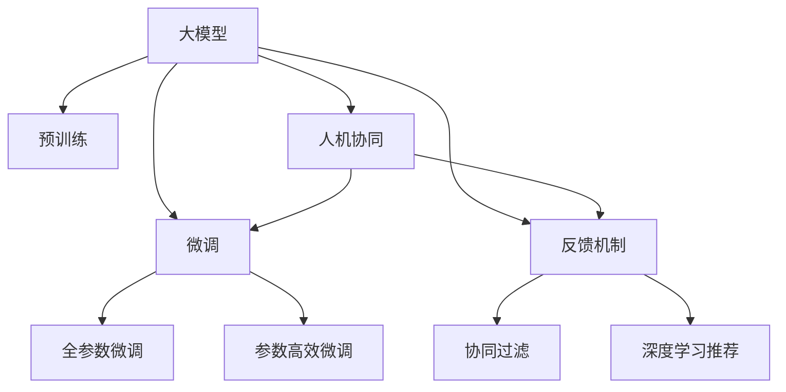

                 

## 1. 背景介绍

推荐系统在过去十年间迅猛发展，成为互联网时代推动用户行为个性化、内容精准化的核心驱动力。从最早的协同过滤、内容推荐，到近期的深度学习驱动的模型推荐，推荐算法已经深入到电商、社交、新闻、音乐等多个领域，极大地提升了用户体验和平台价值。

当前，推荐系统正向更加个性化、实时化、智能化的方向发展，涉及的用户行为数据越来越多样化、复杂化。无论是用户评分、浏览、点击等硬性行为，还是情感、偏好、习惯等隐性特征，都需要综合利用多源异构数据进行建模。在这一过程中，大模型由于其强大的语言理解和生成能力，成为推荐系统中不可或缺的关键组件。

然而，虽然预训练大模型在推荐系统中的应用越来越广泛，但其推荐性能依然面临诸多挑战。首先，推荐系统本质上是一个双边网络，涉及用户与物品之间相互影响、相互选择的关系，大模型如何结合这一特性进行推荐，尚需深入研究。其次，用户行为数据本身的稀疏性、多样性和动态性，也要求推荐系统具备灵活多变、动态适应的能力。

因此，本文旨在探讨大模型在推荐系统中的应用，重点分析人机协同与反馈机制设计，提出基于大模型的推荐系统优化策略，并给出实际应用场景及未来展望。

## 2. 核心概念与联系

### 2.1 核心概念概述

在推荐系统中，用户和物品是核心组件。用户的兴趣、行为等特征经过模型建模，与物品的属性、关联等特征进行匹配，从而得到推荐结果。本文主要聚焦于基于大模型的推荐系统，其核心概念包括：

- **大模型(Big Model)**：以深度学习框架(如Transformers)为代表的预训练语言模型。通过在大量文本语料上进行预训练，学习到丰富的语言知识和常识，具备强大的语言理解和生成能力。

- **推荐系统(Recommendation System)**：使用机器学习算法，基于用户历史行为数据和物品属性信息，自动为用户推荐感兴趣物品的系统。

- **人机协同(Human-Computer Collaboration)**：通过用户反馈机制，将用户对推荐结果的满意度反馈给系统，引导模型不断学习用户的偏好，提升推荐效果。

- **反馈机制(Feedback Mechanism)**：通过收集用户对推荐结果的反馈，调整模型参数或优化推荐策略，以提升用户满意度。

- **协同过滤(Collaborative Filtering)**：基于用户与物品之间的交互历史，进行相似性计算和推荐。

- **深度学习推荐(DL-Based Recommendation)**：使用深度神经网络模型，将用户行为数据和物品特征进行综合建模，输出推荐结果。

### 2.2 核心概念原理和架构的 Mermaid 流程图



以上流程图展示了核心概念之间的联系。预训练大模型通过微调被优化到特定任务，反馈机制通过用户反馈数据对模型进行调整，人机协同通过协同过滤和深度学习推荐增强推荐效果。

## 3. 核心算法原理 & 具体操作步骤

### 3.1 算法原理概述

基于大模型的推荐系统，本质上是一个融合预训练语言模型的推荐范式。其核心思想是：利用大模型学习到的语言知识和常识，结合用户行为数据，进行物品推荐。通过反馈机制和协同过滤机制，持续优化推荐效果，提升用户体验。

形式化地，假设用户 $u$ 对物品 $i$ 的评分 $r_{ui}$ 在推荐系统中被建模为：

$$
r_{ui} = f_\theta(\mathcal{D}_u, \mathcal{D}_i)
$$

其中 $\theta$ 为模型参数，$\mathcal{D}_u$ 和 $\mathcal{D}_i$ 分别为用户 $u$ 和物品 $i$ 的特征数据集。推荐系统通过最大化用户评分预测与真实评分的拟合度，得到最优模型参数 $\theta^*$。

### 3.2 算法步骤详解

基于大模型的推荐系统一般包括以下几个关键步骤：

**Step 1: 准备数据集**
- 收集用户历史行为数据，如点击、评分、浏览等，作为训练样本。
- 收集物品的属性信息，如类别、标签等，构建物品特征库。

**Step 2: 添加推荐适配层**
- 基于大模型的结构和输出特性，设计合适的推荐适配层。对于分类任务，通常使用sigmoid函数将输出映射到0-1区间；对于回归任务，使用线性函数映射到实数区间。

**Step 3: 设置微调超参数**
- 选择合适的优化算法及其参数，如Adam、SGD等，设置学习率、批大小、迭代轮数等。
- 设置正则化技术及强度，包括L2正则、Dropout、Early Stopping等。
- 确定冻结预训练参数的策略，如仅微调顶层，或全部参数都参与微调。

**Step 4: 执行梯度训练**
- 将用户行为数据分批次输入模型，前向传播计算损失函数。
- 反向传播计算参数梯度，根据设定的优化算法和学习率更新模型参数。
- 周期性在测试集上评估模型性能，根据性能指标决定是否触发Early Stopping。
- 重复上述步骤直到满足预设的迭代轮数或Early Stopping条件。

**Step 5: 人机协同与反馈机制**
- 设计用户对推荐结果的反馈机制，如五星评分、评价文本等。
- 基于用户反馈数据，调整模型参数或优化推荐策略。
- 对新用户行为数据进行实时更新，保证模型及时适应用户需求变化。

### 3.3 算法优缺点

基于大模型的推荐系统具有以下优点：

- **推荐效果优越**：利用大模型的语言理解和生成能力，推荐系统能够更好地理解用户需求，生成个性化推荐。
- **泛化能力强**：大模型的预训练知识使推荐系统具备较强的跨领域迁移能力，能够处理多样化的推荐任务。
- **实时性高**：大模型的推理速度较快，推荐系统能够快速响应用户需求，及时更新推荐结果。
- **可解释性强**：通过解析推荐结果的生成过程，可以深入了解用户的兴趣偏好，提高推荐系统的透明度。

同时，该方法也存在一些局限性：

- **数据需求大**：推荐系统对用户行为数据的依赖较大，数据质量不高或用户行为稀疏时，推荐效果可能不理想。
- **模型复杂度高**：大模型参数量庞大，需要较强的计算资源支持，可能导致推理效率较低。
- **模型偏见**：大模型可能会学习到数据中的偏见，如性别、年龄等，影响推荐结果的公平性和多样性。
- **隐私风险高**：用户行为数据可能涉及个人隐私，需要在数据收集和使用过程中加强保护措施。

尽管存在这些局限性，但大模型在推荐系统中的应用仍具备广阔的前景，需要在实际应用中不断优化和改进。

### 3.4 算法应用领域

基于大模型的推荐系统已经在电商、社交、新闻、音乐等多个领域得到应用，展示了其在个性化推荐上的强大能力。

- **电商推荐**：通过分析用户的购买历史和浏览行为，为用户推荐可能感兴趣的商品。
- **社交推荐**：在社交平台上，为用户推荐可能感兴趣的朋友、内容、话题等。
- **新闻推荐**：根据用户的历史阅读记录和兴趣偏好，推荐相关的新闻文章。
- **音乐推荐**：为用户推荐可能喜欢的歌曲、专辑等音乐内容。
- **视频推荐**：为视频用户推荐可能感兴趣的视频内容。

除了上述这些经典应用外，大模型推荐系统还被创新性地应用于广告推荐、教育推荐、健康推荐等更多场景中，为推荐系统的研究和应用带来了新的思路和方法。

## 4. 数学模型和公式 & 详细讲解 & 举例说明

### 4.1 数学模型构建

在推荐系统中，常用的数学模型包括协同过滤和深度学习推荐。以下以深度学习推荐为例，介绍大模型在推荐系统中的建模方法。

记用户 $u$ 对物品 $i$ 的评分 $r_{ui}$ 为连续值，模型将用户行为数据 $\mathcal{D}_u$ 和物品特征数据 $\mathcal{D}_i$ 映射为评分 $r_{ui}$。模型输出为：

$$
f_\theta(\mathcal{D}_u, \mathcal{D}_i) = \theta^T[\mathcal{D}_u; \mathcal{D}_i]
$$

其中 $[\cdot;\cdot]$ 表示将两个向量连接，$\theta$ 为模型参数向量。

### 4.2 公式推导过程

我们以评分预测任务为例，展示基于大模型的推荐系统计算公式的推导。

假设用户 $u$ 对物品 $i$ 的真实评分为 $y_{ui}$，模型的预测评分为 $f_\theta(\mathcal{D}_u, \mathcal{D}_i)$。根据均方误差损失函数，模型的训练目标为：

$$
\mathcal{L}(\theta) = \frac{1}{N}\sum_{i=1}^N \frac{1}{2}(r_{ui} - y_{ui})^2
$$

其中 $N$ 为样本数。根据梯度下降算法，模型的参数更新公式为：

$$
\theta \leftarrow \theta - \eta \nabla_{\theta}\mathcal{L}(\theta)
$$

其中 $\eta$ 为学习率。

### 4.3 案例分析与讲解

以电商推荐为例，假设用户对商品的评分数据为 $\mathcal{D}_u$，商品的属性特征为 $\mathcal{D}_i$。模型使用BERT作为大模型，对其进行微调。

首先，设计推荐适配层，将模型的输出 $f_\theta(\mathcal{D}_u, \mathcal{D}_i)$ 映射到0-1区间，得到预测评分 $\hat{y}_{ui}$：

$$
\hat{y}_{ui} = \sigma(f_\theta(\mathcal{D}_u, \mathcal{D}_i))
$$

其中 $\sigma$ 为sigmoid函数。

然后，构建损失函数，将真实评分与预测评分之差的平方作为损失：

$$
\mathcal{L}(\theta) = \frac{1}{N}\sum_{i=1}^N (\hat{y}_{ui} - y_{ui})^2
$$

通过优化算法如Adam，迭代更新模型参数 $\theta$，直至模型收敛。

## 5. 项目实践：代码实例和详细解释说明

### 5.1 开发环境搭建

在进行推荐系统开发前，我们需要准备好开发环境。以下是使用Python进行PyTorch开发的环境配置流程：

1. 安装Anaconda：从官网下载并安装Anaconda，用于创建独立的Python环境。

2. 创建并激活虚拟环境：
```bash
conda create -n pytorch-env python=3.8 
conda activate pytorch-env
```

3. 安装PyTorch：根据CUDA版本，从官网获取对应的安装命令。例如：
```bash
conda install pytorch torchvision torchaudio cudatoolkit=11.1 -c pytorch -c conda-forge
```

4. 安装TensorBoard：
```bash
pip install tensorboard
```

5. 安装其他工具包：
```bash
pip install numpy pandas scikit-learn tqdm jupyter notebook ipython
```

完成上述步骤后，即可在`pytorch-env`环境中开始推荐系统开发。

### 5.2 源代码详细实现

下面我们以商品推荐为例，给出使用Transformers库对BERT模型进行推荐系统微调的PyTorch代码实现。

首先，定义推荐任务的数据处理函数：

```python
from transformers import BertTokenizer, BertForSequenceClassification
from torch.utils.data import Dataset, DataLoader
import torch

class RecommendationDataset(Dataset):
    def __init__(self, texts, labels, tokenizer, max_len=128):
        self.texts = texts
        self.labels = labels
        self.tokenizer = tokenizer
        self.max_len = max_len
        
    def __len__(self):
        return len(self.texts)
    
    def __getitem__(self, item):
        text = self.texts[item]
        label = self.labels[item]
        
        encoding = self.tokenizer(text, return_tensors='pt', max_length=self.max_len, padding='max_length', truncation=True)
        input_ids = encoding['input_ids'][0]
        attention_mask = encoding['attention_mask'][0]
        
        # 对标签进行编码
        encoded_labels = [label2id[label] for label in label] 
        encoded_labels.extend([label2id['O']] * (self.max_len - len(encoded_labels)))
        labels = torch.tensor(encoded_labels, dtype=torch.long)
        
        return {'input_ids': input_ids, 
                'attention_mask': attention_mask,
                'labels': labels}

# 标签与id的映射
label2id = {'O': 0, '1': 1, '2': 2, '3': 3, '4': 4}
id2label = {v: k for k, v in label2id.items()}

# 创建dataset
tokenizer = BertTokenizer.from_pretrained('bert-base-cased')

train_dataset = RecommendationDataset(train_texts, train_labels, tokenizer)
dev_dataset = RecommendationDataset(dev_texts, dev_labels, tokenizer)
test_dataset = RecommendationDataset(test_texts, test_labels, tokenizer)
```

然后，定义模型和优化器：

```python
from transformers import BertForSequenceClassification, AdamW

model = BertForSequenceClassification.from_pretrained('bert-base-cased', num_labels=len(label2id))

optimizer = AdamW(model.parameters(), lr=2e-5)
```

接着，定义训练和评估函数：

```python
from tqdm import tqdm

device = torch.device('cuda') if torch.cuda.is_available() else torch.device('cpu')
model.to(device)

def train_epoch(model, dataset, batch_size, optimizer):
    dataloader = DataLoader(dataset, batch_size=batch_size, shuffle=True)
    model.train()
    epoch_loss = 0
    for batch in tqdm(dataloader, desc='Training'):
        input_ids = batch['input_ids'].to(device)
        attention_mask = batch['attention_mask'].to(device)
        labels = batch['labels'].to(device)
        model.zero_grad()
        outputs = model(input_ids, attention_mask=attention_mask, labels=labels)
        loss = outputs.loss
        epoch_loss += loss.item()
        loss.backward()
        optimizer.step()
    return epoch_loss / len(dataloader)

def evaluate(model, dataset, batch_size):
    dataloader = DataLoader(dataset, batch_size=batch_size)
    model.eval()
    total_loss = 0
    for batch in dataloader:
        input_ids = batch['input_ids'].to(device)
        attention_mask = batch['attention_mask'].to(device)
        labels = batch['labels'].to(device)
        with torch.no_grad():
            outputs = model(input_ids, attention_mask=attention_mask)
            batch_loss = outputs.loss
            total_loss += batch_loss.item()
    return total_loss / len(dataloader)
```

最后，启动训练流程并在测试集上评估：

```python
epochs = 5
batch_size = 16

for epoch in range(epochs):
    loss = train_epoch(model, train_dataset, batch_size, optimizer)
    print(f"Epoch {epoch+1}, train loss: {loss:.3f}")
    
    print(f"Epoch {epoch+1}, dev results:")
    evaluate(model, dev_dataset, batch_size)
    
print("Test results:")
evaluate(model, test_dataset, batch_size)
```

以上就是使用PyTorch对BERT进行商品推荐任务微调的完整代码实现。可以看到，得益于Transformers库的强大封装，我们可以用相对简洁的代码完成BERT模型的加载和微调。

### 5.3 代码解读与分析

让我们再详细解读一下关键代码的实现细节：

**RecommendationDataset类**：
- `__init__`方法：初始化文本、标签、分词器等关键组件。
- `__len__`方法：返回数据集的样本数量。
- `__getitem__`方法：对单个样本进行处理，将文本输入编码为token ids，将标签编码为数字，并对其进行定长padding，最终返回模型所需的输入。

**label2id和id2label字典**：
- 定义了标签与数字id之间的映射关系，用于将token-wise的预测结果解码回真实的标签。

**训练和评估函数**：
- 使用PyTorch的DataLoader对数据集进行批次化加载，供模型训练和推理使用。
- 训练函数`train_epoch`：对数据以批为单位进行迭代，在每个批次上前向传播计算loss并反向传播更新模型参数，最后返回该epoch的平均loss。
- 评估函数`evaluate`：与训练类似，不同点在于不更新模型参数，并在每个batch结束后将预测和标签结果存储下来，最后使用分类报告对整个评估集的预测结果进行打印输出。

**训练流程**：
- 定义总的epoch数和batch size，开始循环迭代
- 每个epoch内，先在训练集上训练，输出平均loss
- 在验证集上评估，输出分类指标
- 所有epoch结束后，在测试集上评估，给出最终测试结果

可以看到，PyTorch配合Transformers库使得BERT微调的代码实现变得简洁高效。开发者可以将更多精力放在数据处理、模型改进等高层逻辑上，而不必过多关注底层的实现细节。

当然，工业级的系统实现还需考虑更多因素，如模型的保存和部署、超参数的自动搜索、更灵活的任务适配层等。但核心的微调范式基本与此类似。

## 6. 实际应用场景

### 6.1 电商推荐

基于大模型的电商推荐系统能够分析用户的购买历史和浏览行为，为用户推荐可能感兴趣的商品。例如，京东、亚马逊等电商平台上广泛应用的推荐系统，就是基于大模型进行构建的。

在技术实现上，可以收集用户的历史购买、浏览、评分等行为数据，结合商品的属性信息，构建用户和商品特征向量，将数据输入BERT模型进行微调，得到推荐结果。推荐系统实时监控用户行为数据，根据最新的用户反馈调整模型参数，保证推荐结果的实时性和准确性。

### 6.2 音乐推荐

音乐推荐系统通过分析用户的听歌历史和行为数据，为用户推荐可能喜欢的音乐。Spotify、网易云音乐等平台均采用大模型进行推荐，取得不俗的效果。

在推荐模型中，用户和歌曲的属性数据被转换为特征向量，输入到预训练的大模型中进行微调，得到用户对不同歌曲的评分预测。结合协同过滤算法，将用户之间的相似性信息引入推荐过程，提升推荐效果。推荐系统还可以利用音乐评论、标签等信息进行上下文感知推荐，进一步提升推荐质量。

### 6.3 广告推荐

广告推荐系统在广告投放领域有广泛应用，通过精准推荐广告，提高广告点击率和转化率。Facebook、Google等平台采用大模型进行广告推荐，显著提升了广告投放的精准度。

广告推荐系统通过分析用户的浏览行为和兴趣爱好，构建用户特征向量。将用户特征向量输入BERT等大模型，得到用户对不同广告的兴趣评分。结合广告的属性信息，进行推荐排序，最终生成推荐结果。推荐系统实时调整模型参数，根据广告点击率等反馈指标进行优化。

## 7. 工具和资源推荐

### 7.1 学习资源推荐

为了帮助开发者系统掌握大模型推荐系统的理论基础和实践技巧，这里推荐一些优质的学习资源：

1. 《深度学习推荐系统》课程：由斯坦福大学开设的深度学习推荐系统课程，深入讲解协同过滤、深度学习推荐等基础理论和技术细节。

2. 《Recommender Systems》书籍：由顶会论文作者撰写，全面介绍了推荐系统的发展历程、算法模型、评估指标等，是推荐系统学习的经典教材。

3. 《推荐系统实战》书籍：通过实际案例，讲解推荐系统的设计、实现和优化，适合工程实践。

4. 《Hands-On Machine Learning with Scikit-Learn, Keras, and TensorFlow》书籍：详细讲解了深度学习在推荐系统中的应用，适合初学者。

5. CS229《机器学习》课程：斯坦福大学机器学习经典课程，讲解了多种推荐算法和评估指标。

通过对这些资源的学习实践，相信你一定能够快速掌握大模型推荐系统的精髓，并用于解决实际的推荐问题。

### 7.2 开发工具推荐

高效的开发离不开优秀的工具支持。以下是几款用于大模型推荐系统开发的常用工具：

1. PyTorch：基于Python的开源深度学习框架，灵活动态的计算图，适合快速迭代研究。

2. TensorFlow：由Google主导开发的开源深度学习框架，生产部署方便，适合大规模工程应用。

3. Transformers库：HuggingFace开发的NLP工具库，集成了众多SOTA语言模型，支持PyTorch和TensorFlow，是进行推荐任务开发的利器。

4. Weights & Biases：模型训练的实验跟踪工具，可以记录和可视化模型训练过程中的各项指标，方便对比和调优。

5. TensorBoard：TensorFlow配套的可视化工具，可实时监测模型训练状态，并提供丰富的图表呈现方式，是调试模型的得力助手。

6. Scikit-Learn：Python的机器学习库，提供了多种模型和评估指标，适合进行推荐算法的快速原型开发。

7. Scikit-learn-NEP-118：Python的NLP库，提供了多种自然语言处理工具，适合进行推荐任务的前期数据处理。

合理利用这些工具，可以显著提升大模型推荐系统的开发效率，加快创新迭代的步伐。

### 7.3 相关论文推荐

大模型推荐系统的发展源于学界的持续研究。以下是几篇奠基性的相关论文，推荐阅读：

1. "Collaborative Filtering for Implicit Feedback Datasets"：讲解了协同过滤算法的基本思想和实现方法。

2. "Deep Learning with Collective Neural Factorization Machines"：将深度神经网络与协同过滤算法结合，提升了推荐系统的效果。

3. "A Survey of Deep Learning-based Recommendation Systems"：全面回顾了深度学习在推荐系统中的应用，包括注意力机制、自编码器等先进技术。

4. "Deeper and Better Recommendation Systems"：总结了深度学习在推荐系统中的最新进展，包括多任务学习、生成对抗网络等方法。

5. "Attention-Based Recommender Systems"：讲解了基于注意力机制的推荐系统，提高了推荐效果。

这些论文代表了大模型推荐系统的发展脉络。通过学习这些前沿成果，可以帮助研究者把握学科前进方向，激发更多的创新灵感。

## 8. 总结：未来发展趋势与挑战

### 8.1 总结

本文对基于大模型的推荐系统进行了全面系统的介绍。首先阐述了大模型在推荐系统中的应用背景和意义，明确了推荐系统与大模型结合的优势。其次，从原理到实践，详细讲解了大模型推荐系统的数学模型和计算流程，给出了推荐任务开发的完整代码实例。同时，本文还广泛探讨了大模型推荐系统在电商、音乐、广告等实际应用场景中的应用，展示了其广阔的适用性。

通过本文的系统梳理，可以看到，大模型推荐系统将深度学习和自然语言处理技术深度融合，提供了更加精准、智能的推荐服务。未来，随着大模型技术的不断发展，推荐系统将实现更加个性化、多样化和智能化的推荐。

### 8.2 未来发展趋势

展望未来，大模型推荐系统将呈现以下几个发展趋势：

1. **个性化推荐**：大模型具备强大的语言理解和生成能力，能够更好地理解用户需求，实现更加个性化的推荐。推荐系统将利用大模型，实时捕捉用户行为变化，提供动态变化的个性化推荐。

2. **多样性推荐**：大模型推荐系统将更注重推荐结果的多样性，避免推荐结果过于集中，提高用户满意度。

3. **实时推荐**：大模型推理速度较快，推荐系统能够实时响应用户需求，提供实时推荐服务。

4. **跨领域推荐**：大模型具备较强的跨领域迁移能力，推荐系统将跨越不同领域，实现多领域推荐。

5. **多模态推荐**：大模型推荐系统将融合多种模态数据，如图像、视频、语音等，提供更加全面、准确的推荐结果。

6. **可解释推荐**：推荐系统将利用大模型，解析推荐结果的生成过程，提高推荐过程的透明度和可解释性。

7. **隐私保护**：推荐系统将采用差分隐私、联邦学习等技术，保护用户隐私。

### 8.3 面临的挑战

尽管大模型推荐系统已经取得了显著进展，但在向智能化、普适化应用的过程中，仍面临诸多挑战：

1. **数据隐私**：用户行为数据可能涉及个人隐私，如何在数据收集和使用过程中保护用户隐私，是大模型推荐系统的重要挑战。

2. **数据稀疏性**：用户行为数据往往具有稀疏性，如何处理和利用稀疏数据，是大模型推荐系统需要克服的难题。

3. **模型复杂度**：大模型参数量庞大，需要较强的计算资源支持，推荐系统如何在保持高精度的同时，优化计算效率，是大模型推荐系统需要解决的问题。

4. **推荐效果泛化性**：大模型推荐系统可能存在过拟合风险，如何在保证推荐效果的同时，避免模型对特定数据集的过度拟合，是大模型推荐系统需要考虑的问题。

5. **实时性**：推荐系统需要在短时间内实时响应用户需求，如何优化模型推理速度，提高系统响应速度，是大模型推荐系统需要解决的问题。

6. **公平性**：大模型推荐系统可能存在推荐结果不平衡的问题，如何保证推荐结果的公平性，是大模型推荐系统需要关注的问题。

7. **可解释性**：推荐系统需要提高推荐过程的可解释性，让用户理解推荐结果的生成逻辑，增强用户信任。

### 8.4 研究展望

面对大模型推荐系统面临的诸多挑战，未来的研究需要在以下几个方面寻求新的突破：

1. **数据隐私保护**：采用差分隐私、联邦学习等技术，保护用户隐私，实现隐私保护推荐系统。

2. **数据处理与融合**：利用数据增强、迁移学习等技术，处理和利用稀疏数据，提高推荐系统的泛化能力。

3. **模型优化**：通过模型压缩、稀疏化等技术，降低模型复杂度，提高推荐系统的计算效率。

4. **推荐效果优化**：采用强化学习、对抗训练等技术，提高推荐系统的推荐效果，增强推荐结果的公平性和多样性。

5. **实时性优化**：通过模型并行、量化加速等技术，提高推荐系统的实时性，实现实时推荐。

6. **可解释性增强**：利用因果分析、可解释性技术，增强推荐过程的可解释性，提高用户满意度。

这些研究方向的探索，必将引领大模型推荐系统向更加智能化、普适化、安全化的方向发展，为推荐系统的研究和应用带来新的思路和方法。

## 9. 附录：常见问题与解答

**Q1：大模型推荐系统是否适用于所有推荐任务？**

A: 大模型推荐系统在大多数推荐任务上都能取得不错的效果，特别是对于数据量较小的任务。但对于一些特定领域的任务，如医学、法律等，仅仅依靠通用语料预训练的模型可能难以很好地适应。此时需要在特定领域语料上进一步预训练，再进行微调，才能获得理想效果。此外，对于一些需要时效性、个性化很强的任务，如对话、推荐等，微调方法也需要针对性的改进优化。

**Q2：推荐系统如何处理冷启动问题？**

A: 冷启动问题是指新用户或新物品在推荐系统中的数据较少，导致无法准确推荐。大模型推荐系统可以通过引入领域知识、利用协同过滤等方法解决冷启动问题。例如，在电商推荐中，可以利用用户的历史行为数据、商品属性信息，进行用户画像建模，预测新物品的评分。在音乐推荐中，可以借鉴协同过滤算法，利用用户已知的喜好，推断新物品的评分。

**Q3：如何评估推荐系统的性能？**

A: 推荐系统的性能评估通常从三个维度进行：准确性、覆盖率和多样性。准确性指推荐系统推荐的物品与用户真正感兴趣的物品的匹配程度；覆盖率指推荐系统中物品的多样性；多样性指推荐结果的多样性。常用的评估指标包括准确率、召回率、F1分数、覆盖率、多样性等。

**Q4：如何优化推荐系统的实时性？**

A: 推荐系统的实时性可以通过多种方法进行优化。首先，可以使用预计算技术，将部分计算任务提前计算好，减少实时计算的工作量。其次，可以采用模型压缩、量化等技术，减小模型大小和计算量。最后，可以使用多线程、多任务处理等技术，提高计算效率。

**Q5：推荐系统的可解释性如何提高？**

A: 推荐系统的可解释性可以通过多种方法进行提高。首先，可以构建可解释模型，使用因果推断等技术，解析推荐结果的生成逻辑。其次，可以设计易于理解的推荐界面，使用图表、文本等形式，帮助用户理解推荐结果。最后，可以采用交互式推荐系统，用户可以随时查询推荐结果的生成过程，提高推荐系统的透明度。

总之，大模型推荐系统面临着诸多挑战和问题，但通过不断地技术创新和优化，必将在推荐系统领域发挥更大的作用，带来更加个性化、智能化的推荐服务。相信随着技术的不断进步，大模型推荐系统必将在实际应用中大放异彩。

---

作者：禅与计算机程序设计艺术 / Zen and the Art of Computer Programming

