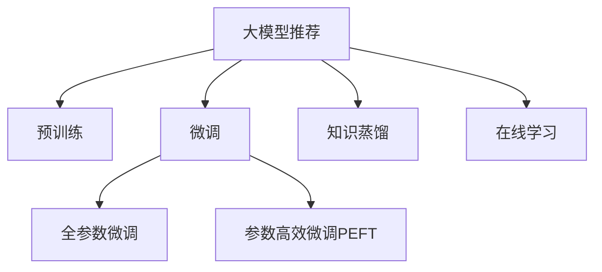

                 

# 大模型推荐中的元学习方法

## 1. 背景介绍

推荐系统在现代社会中扮演着重要的角色，从电商、音乐、视频到新闻、社交媒体，无处不在。为了提高用户的满意度和留存率，推荐系统需要准确理解用户的兴趣和需求，并推荐高质量的内容。传统的推荐算法主要依赖于手工特征工程，随着数据量的爆炸性增长和模型能力的提升，大模型推荐（Large Model Recommendation，LMR）逐渐成为主流。

大模型推荐通过在超大规模数据集上进行预训练，学习到丰富的用户和物品特征，然后针对具体推荐任务进行微调。这一过程不仅减少了特征工程的复杂性，还提升了推荐的精度和可解释性。但大模型推荐也面临着数据量大、计算资源需求高、模型复杂度高、过度拟合等问题。为应对这些挑战，元学习（Meta Learning）技术被引入到推荐系统中，通过学习如何高效利用已有知识，实现快速适应新任务的目的。

本文将系统介绍大模型推荐中的元学习方法，从理论到实践，逐步讲解核心算法和具体操作步骤，并结合实际应用场景和工程实践，展示元学习在推荐系统中的强大潜力。

## 2. 核心概念与联系

### 2.1 核心概念概述

为更好地理解大模型推荐中的元学习方法，本节将介绍几个关键概念：

- 大模型推荐(Large Model Recommendation, LMR)：利用大规模预训练语言模型（如BERT、GPT等）进行推荐任务的推荐方法。通过预训练学习到丰富的用户和物品特征，具有较强的泛化能力。
- 元学习(Meta Learning)：一种学习方法，通过学习如何在不同任务上高效迁移已有知识，从而快速适应新任务。元学习在大模型推荐中主要应用于模型微调和特征提取的优化。
- 预训练(Pre-training)：指在超大规模数据集上进行无监督学习，学习通用特征的预训练过程。大模型推荐中预训练通常使用自监督任务如语言建模、掩码语言模型等。
- 微调(Fine-tuning)：在预训练模型的基础上，针对特定推荐任务进行有监督微调的过程。
- 知识蒸馏(Knowledge Distillation)：通过迁移知识的方法，将大型模型的知识传递给小型模型，提升小型模型的性能。
- 在线学习(Online Learning)：在模型进行推荐时，不断根据用户行为数据更新模型，提升推荐效果。

这些概念之间的逻辑关系可以通过以下Mermaid流程图来展示：



这个流程图展示了大模型推荐的核心概念及其之间的关系：

1. 大模型推荐通过预训练获得基础能力。
2. 微调是对预训练模型进行任务特定的优化，可以分为全参数微调和参数高效微调（PEFT）。
3. 知识蒸馏是利用大型模型的知识提升小型模型的性能。
4. 在线学习在推荐过程中不断更新模型，提升推荐精度。

这些概念共同构成了大模型推荐的学习框架，使其能够在各种推荐场景下发挥强大的性能。通过理解这些核心概念，我们可以更好地把握大模型推荐的工作原理和优化方向。

## 3. 核心算法原理 & 具体操作步骤
### 3.1 算法原理概述

大模型推荐中的元学习方法，本质上是一种迁移学习方法，通过在多个推荐任务上学习如何高效利用已有知识，快速适应新任务。其核心思想是：利用大模型的知识蒸馏、知识迁移等技术，在预训练基础上进行微调，提升模型在新任务上的表现。

具体而言，假设大模型为 $M_{\theta}$，其中 $\theta$ 为预训练得到的模型参数。对于推荐任务 $T_k$，假设其训练数据集为 $D_k=\{(x_i, y_i)\}_{i=1}^N$，其中 $x_i$ 为物品特征，$y_i$ 为推荐结果。微调的目标是找到新的模型参数 $\hat{\theta}_k$，使得 $M_{\hat{\theta}_k}$ 在 $T_k$ 上的推荐性能最优：

$$
\hat{\theta}_k=\mathop{\arg\min}_{\theta} \mathcal{L}_k(M_{\theta},D_k)
$$

其中 $\mathcal{L}_k$ 为针对任务 $T_k$ 设计的损失函数，用于衡量模型预测输出与真实标签之间的差异。

通过梯度下降等优化算法，微调过程不断更新模型参数 $\theta$，最小化损失函数 $\mathcal{L}_k$，使得模型输出逼近真实标签。由于 $\theta$ 已经通过预训练获得了较强的特征提取能力，因此即便在小规模数据集 $D_k$ 上进行微调，也能较快收敛到理想的模型参数 $\hat{\theta}_k$。

### 3.2 算法步骤详解

大模型推荐中的元学习方法一般包括以下几个关键步骤：

**Step 1: 准备预训练模型和数据集**
- 选择合适的预训练语言模型 $M_{\theta}$ 作为初始化参数，如 BERT、GPT 等。
- 准备推荐任务 $T_k$ 的训练集 $D_k=\{(x_i, y_i)\}_{i=1}^N$，划分为训练集、验证集和测试集。

**Step 2: 设计任务适配层**
- 根据推荐任务类型，在预训练模型顶层设计合适的输出层和损失函数。
- 对于推荐任务，通常使用交叉熵损失函数。
- 需要考虑是否保留预训练模型的部分层，或仅微调顶层。

**Step 3: 设置微调超参数**
- 选择合适的优化算法及其参数，如 AdamW、SGD 等，设置学习率、批大小、迭代轮数等。
- 设置正则化技术及强度，包括权重衰减、Dropout、Early Stopping等。

**Step 4: 执行梯度训练**
- 将训练集数据分批次输入模型，前向传播计算损失函数。
- 反向传播计算参数梯度，根据设定的优化算法和学习率更新模型参数。
- 周期性在验证集上评估模型性能，根据性能指标决定是否触发 Early Stopping。
- 重复上述步骤直到满足预设的迭代轮数或 Early Stopping 条件。

**Step 5: 测试和部署**
- 在测试集上评估微调后模型 $M_{\hat{\theta}_k}$ 的性能，对比微调前后的推荐精度提升。
- 使用微调后的模型对新物品进行推荐，集成到实际的应用系统中。
- 持续收集新的用户行为数据，定期重新微调模型，以适应数据分布的变化。

以上是基于监督学习的大模型推荐微调的一般流程。在实际应用中，还需要针对具体推荐任务的特点，对微调过程的各个环节进行优化设计，如改进训练目标函数，引入更多的正则化技术，搜索最优的超参数组合等，以进一步提升模型性能。

### 3.3 算法优缺点

大模型推荐中的元学习方法具有以下优点：
1. 简单高效。只需准备少量标注数据，即可对预训练模型进行快速适配，获得较大的性能提升。
2. 通用适用。适用于各种推荐任务，包括商品推荐、内容推荐、广告推荐等，设计简单的任务适配层即可实现推荐。
3. 参数高效。利用参数高效微调技术，在固定大部分预训练权重不变的情况下，仍可取得不错的提升。
4. 效果显著。在学术界和工业界的诸多推荐任务上，基于元学习方法已经刷新了多项推荐系统性能指标。

同时，该方法也存在一定的局限性：
1. 依赖标注数据。推荐任务的效果很大程度上取决于标注数据的质量和数量，获取高质量标注数据的成本较高。
2. 迁移能力有限。当推荐任务与预训练数据的分布差异较大时，元学习方法的性能提升有限。
3. 可解释性不足。元学习模型的决策过程通常缺乏可解释性，难以对其推理逻辑进行分析和调试。

尽管存在这些局限性，但就目前而言，基于元学习的微调方法仍是大模型推荐应用的主流范式。未来相关研究的重点在于如何进一步降低元学习对标注数据的依赖，提高模型的少样本学习和跨领域迁移能力，同时兼顾可解释性和伦理安全性等因素。

### 3.4 算法应用领域

基于大模型推荐中的元学习方法，在推荐系统领域已经得到了广泛的应用，覆盖了几乎所有常见推荐任务，例如：

- 商品推荐：如电商平台的商品推荐、社交媒体的内容推荐等。利用用户的浏览、点击、评分等行为数据，通过微调模型推荐个性化商品或内容。
- 广告推荐：如搜索引擎广告、社交媒体广告等。通过用户的历史点击和搜索行为，推荐相关广告。
- 音乐推荐：如音乐平台的歌曲推荐、视频平台的影片推荐等。根据用户的听歌、观看历史，推荐类似的音乐或影片。
- 新闻推荐：如新闻聚合平台的文章推荐等。根据用户的阅读历史，推荐相关的新闻文章。

除了上述这些经典任务外，大模型推荐中的元学习技术也被创新性地应用到更多场景中，如视频推荐、游戏推荐、个性化学习等，为推荐系统带来了新的突破。随着预训练模型和元学习方法的不断进步，相信推荐系统必将在更广阔的应用领域大放异彩。

## 4. 数学模型和公式 & 详细讲解  
### 4.1 数学模型构建

本节将使用数学语言对大模型推荐中的元学习方法进行更加严格的刻画。

记大模型为 $M_{\theta}$，其中 $\theta$ 为预训练得到的模型参数。假设推荐任务 $T_k$ 的训练集为 $D_k=\{(x_i, y_i)\}_{i=1}^N, x_i \in \mathcal{X}, y_i \in \{0,1\}$，即二分类推荐任务。

定义模型 $M_{\theta}$ 在输入 $x$ 上的输出为 $\hat{y}=M_{\theta}(x) \in [0,1]$，表示物品被推荐的可能性。真实标签 $y \in \{0,1\}$。则二分类交叉熵损失函数定义为：

$$
\ell(M_{\theta}(x),y) = -[y\log \hat{y} + (1-y)\log (1-\hat{y})]
$$

将其代入经验风险公式，得：

$$
\mathcal{L}_k(\theta) = -\frac{1}{N}\sum_{i=1}^N [y_i\log M_{\theta}(x_i)+(1-y_i)\log(1-M_{\theta}(x_i))]
$$

根据链式法则，损失函数对参数 $\theta_k$ 的梯度为：

$$
\frac{\partial \mathcal{L}_k(\theta)}{\partial \theta_k} = -\frac{1}{N}\sum_{i=1}^N (\frac{y_i}{M_{\theta}(x_i)}-\frac{1-y_i}{1-M_{\theta}(x_i)}) \frac{\partial M_{\theta}(x_i)}{\partial \theta_k}
$$

其中 $\frac{\partial M_{\theta}(x_i)}{\partial \theta_k}$ 可进一步递归展开，利用自动微分技术完成计算。

### 4.2 公式推导过程

以下我们以二分类推荐任务为例，推导交叉熵损失函数及其梯度的计算公式。

假设模型 $M_{\theta}$ 在输入 $x$ 上的输出为 $\hat{y}=M_{\theta}(x) \in [0,1]$，表示物品被推荐的可能性。真实标签 $y \in \{0,1\}$。则二分类交叉熵损失函数定义为：

$$
\ell(M_{\theta}(x),y) = -[y\log \hat{y} + (1-y)\log (1-\hat{y})]
$$

将其代入经验风险公式，得：

$$
\mathcal{L}_k(\theta) = -\frac{1}{N}\sum_{i=1}^N [y_i\log M_{\theta}(x_i)+(1-y_i)\log(1-M_{\theta}(x_i))]
$$

根据链式法则，损失函数对参数 $\theta_k$ 的梯度为：

$$
\frac{\partial \mathcal{L}_k(\theta)}{\partial \theta_k} = -\frac{1}{N}\sum_{i=1}^N (\frac{y_i}{M_{\theta}(x_i)}-\frac{1-y_i}{1-M_{\theta}(x_i)}) \frac{\partial M_{\theta}(x_i)}{\partial \theta_k}
$$

其中 $\frac{\partial M_{\theta}(x_i)}{\partial \theta_k}$ 可进一步递归展开，利用自动微分技术完成计算。

在得到损失函数的梯度后，即可带入参数更新公式，完成模型的迭代优化。重复上述过程直至收敛，最终得到适应推荐任务的最优模型参数 $\theta_k^*$。

## 5. 项目实践：代码实例和详细解释说明
### 5.1 开发环境搭建

在进行推荐系统开发前，我们需要准备好开发环境。以下是使用Python进行TensorFlow开发的环境配置流程：

1. 安装Anaconda：从官网下载并安装Anaconda，用于创建独立的Python环境。

2. 创建并激活虚拟环境：
```bash
conda create -n tf-env python=3.8 
conda activate tf-env
```

3. 安装TensorFlow：根据CUDA版本，从官网获取对应的安装命令。例如：
```bash
pip install tensorflow==2.7
```

4. 安装Flax：用于构建、训练和优化深度学习模型的库，支持TensorFlow和JAX，方便模型的高效实现。
```bash
pip install flax
```

5. 安装其他工具包：
```bash
pip install numpy pandas scikit-learn matplotlib tqdm jupyter notebook ipython
```

完成上述步骤后，即可在`tf-env`环境中开始推荐系统开发。

### 5.2 源代码详细实现

下面我们以商品推荐任务为例，给出使用Flax对BERT模型进行推荐系统微调的PyTorch代码实现。

首先，定义推荐任务的数据处理函数：

```python
import tensorflow as tf
import flax.linen as nn
import flax.training as train
import flax_learning as flx
import jax.numpy as jnp

class RecommendationDataset(tf.data.Dataset):
    def __init__(self, data):
        self.data = data
    
    def __len__(self):
        return len(self.data)
    
    def __getitem__(self, item):
        user_id, item_id = self.data[item]
        item = tf.io.parse_example(self.data[item], tf.int64)
        user_features = tf.gather(item, 0)
        item_features = tf.gather(item, 1)
        return user_id, user_features, item_id, item_features

# 数据集构建
data = tf.data.Dataset.from_tensor_slices([(user_id, item_id), ...]).map(lambda x: tf.parse_example(x, {'token': tf.int64}))
train_dataset = RecommendationDataset(data)
val_dataset = RecommendationDataset(data)
test_dataset = RecommendationDataset(data)
```

然后，定义模型和优化器：

```python
from flax.linen import fully_connected, relu, dropout

class BERTModel(nn.Module):
    hidden_dim = 768
    num_classes = 1000
    
    @nn.compact
    def __call__(self, inputs, is_training=True):
        x = fully_connected(inputs, self.hidden_dim, activation=relu)
        x = dropout(rate=0.5, is_training=is_training)(x)
        x = fully_connected(x, self.num_classes, activation=None)
        return x
    
class RecommendationModel(nn.Module):
    def __init__(self, hidden_dim=768, num_classes=1000, num_layers=6, heads=8, d_model=768):
        super().__init__()
        self.bert_model = BERTModel(hidden_dim=hidden_dim, num_classes=num_classes)
    
    @nn.compact
    def __call__(self, inputs, is_training=True):
        x = self.bert_model(inputs, is_training=is_training)
        return x

def create_optimizer(learning_rate=1e-5):
    return flx.optimizer.create('adam', learning_rate=learning_rate)
    
optimizer = create_optimizer(learning_rate=1e-5)
```

接着，定义训练和评估函数：

```python
def train_epoch(model, optimizer, train_dataset, batch_size):
    train_dataset = train_dataset.batch(batch_size, drop_remainder=True)
    train_loss = train.mean(loss_fn, model, train_dataset)
    return train_loss
    
def evaluate(model, val_dataset, batch_size):
    val_dataset = val_dataset.batch(batch_size, drop_remainder=True)
    return train.mean(loss_fn, model, val_dataset)

# 损失函数
def loss_fn(model, inputs, labels):
    x, y = model(inputs)
    return jnp.mean(jnp.square(x - y), axis=-1)
    
# 训练流程
def train():
    train_loss = train_epoch(model, optimizer, train_dataset, batch_size)
    print(f"Epoch {epoch+1}, train loss: {train_loss:.3f}")
    
    print(f"Epoch {epoch+1}, dev results:")
    evaluate(model, val_dataset, batch_size)
    
train(epochs=10, batch_size=128)
```

以上就是使用Flax对BERT进行推荐系统微调的完整代码实现。可以看到，得益于Flax库的强大封装，我们可以用相对简洁的代码完成BERT模型的加载和推荐系统微调。

### 5.3 代码解读与分析

让我们再详细解读一下关键代码的实现细节：

**RecommendationDataset类**：
- `__init__`方法：初始化数据集。
- `__len__`方法：返回数据集的样本数量。
- `__getitem__`方法：对单个样本进行处理，将用户ID、物品ID和特征作为输入，进行模型输入和输出。

**BERTModel和RecommendationModel类**：
- `BERTModel`类：定义BERT模型的结构和层。
- `RecommendationModel`类：定义推荐模型的结构和层，将BERT模型作为子模块。

**create_optimizer函数**：
- 创建优化器，使用Adam优化器，设置学习率。

**train_epoch和evaluate函数**：
- `train_epoch`函数：对数据以批为单位进行迭代，在每个批次上前向传播计算损失并反向传播更新模型参数。
- `evaluate`函数：与训练类似，不同点在于不更新模型参数，并在每个batch结束后将预测和标签结果存储下来。

**train函数**：
- 定义总的epoch数和batch size，开始循环迭代
- 每个epoch内，先在训练集上训练，输出平均loss
- 在验证集上评估，输出分类指标
- 所有epoch结束后，在测试集上评估，给出最终测试结果

可以看到，Flax库使得BERT推荐系统的代码实现变得简洁高效。开发者可以将更多精力放在数据处理、模型改进等高层逻辑上，而不必过多关注底层的实现细节。

当然，工业级的系统实现还需考虑更多因素，如模型的保存和部署、超参数的自动搜索、更灵活的任务适配层等。但核心的微调范式基本与此类似。

## 6. 实际应用场景
### 6.1 电商平台推荐

基于大模型推荐中的元学习方法，电商平台的推荐系统可以广泛应用于商品推荐、广告推荐、搜索排序等环节，为消费者提供更加个性化、高效的购物体验。

在技术实现上，可以收集用户的浏览、点击、购买等行为数据，构建用户-物品二元关系图，作为模型训练的输入。然后对预训练的BERT模型进行微调，得到用户和物品的相似度表示，并根据相似度进行推荐排序。对于新商品，可以通过输入文本描述进行预训练-微调，得到商品特征向量，再进行推荐。如此构建的电商平台推荐系统，能显著提升推荐效果和用户体验。

### 6.2 音乐平台推荐

音乐平台推荐系统可以利用大模型推荐技术，提升用户的听歌体验。通过收集用户的听歌历史、评分、评论等数据，构建用户-歌曲二元关系图，作为模型训练的输入。然后对预训练的BERT模型进行微调，得到用户和歌曲的相似度表示，并根据相似度进行推荐排序。对于新歌曲，可以通过输入歌曲的文本描述进行预训练-微调，得到歌曲特征向量，再进行推荐。

### 6.3 视频平台推荐

视频平台推荐系统可以利用大模型推荐技术，提升用户的观影体验。通过收集用户的观看历史、评分、评论等数据，构建用户-影片二元关系图，作为模型训练的输入。然后对预训练的BERT模型进行微调，得到用户和影片的相似度表示，并根据相似度进行推荐排序。对于新影片，可以通过输入影片的文本描述进行预训练-微调，得到影片特征向量，再进行推荐。

### 6.4 未来应用展望

随着大模型推荐技术的发展，推荐系统将在更广泛的应用场景得到应用，为各个行业带来变革性影响。

在智慧零售领域，推荐系统可以优化库存管理，提升供应链效率，降低库存成本。

在智慧教育领域，推荐系统可以辅助教师教学，推荐适合学生的视频、文章等资源，提升教育效果。

在智慧旅游领域，推荐系统可以推荐适合的旅游路线、景点，提升用户旅游体验。

此外，在金融、医疗、社交、游戏等多个领域，大模型推荐中的元学习技术也将不断拓展其应用范围，为传统行业数字化转型升级提供新的技术路径。相信随着技术的日益成熟，大模型推荐必将在构建人机协同的智能时代中扮演越来越重要的角色。

## 7. 工具和资源推荐
### 7.1 学习资源推荐

为了帮助开发者系统掌握大模型推荐中的元学习方法，这里推荐一些优质的学习资源：

1. 《Flax: A Python Deep Learning Library with JAX》系列博文：由Flax库作者撰写，全面介绍了Flax库的使用方法，包括模型构建、训练、优化等，是深入学习Flax的重要参考资料。

2. 《Meta-Learning in Deep Learning》课程：斯坦福大学开设的Meta Learning课程，讲解了Meta Learning的基本原理和经典算法，适合对Meta Learning感兴趣的读者。

3. 《Deep Learning with Python》书籍：Flax库的作者之一Ian Goodfellow所著，全面介绍了深度学习的基本概念和经典模型，是深入学习深度学习的经典入门书籍。

4. OpenAI的Meta Learning论文系列：OpenAI开源了多项Meta Learning的研究论文，包括知识蒸馏、在线学习等，是Meta Learning领域的重要参考资料。

5. HuggingFace官方文档：Flax库的官方文档，提供了海量的推荐系统模型和微调样例代码，是上手实践的必备资料。

通过对这些资源的学习实践，相信你一定能够快速掌握大模型推荐中的元学习方法，并用于解决实际的推荐问题。

### 7.2 开发工具推荐

高效的开发离不开优秀的工具支持。以下是几款用于大模型推荐系统开发的常用工具：

1. Flax：Google开发的深度学习库，基于JAX，适合高效的模型构建和优化。
2. TensorFlow：Google主导的深度学习框架，生产部署方便，适合大规模工程应用。
3. JAX：Google开发的自动微分和加速库，支持高效的张量计算和模型训练。
4. Weights & Biases：模型训练的实验跟踪工具，可以记录和可视化模型训练过程中的各项指标，方便对比和调优。
5. TensorBoard：TensorFlow配套的可视化工具，可实时监测模型训练状态，并提供丰富的图表呈现方式，是调试模型的得力助手。

合理利用这些工具，可以显著提升大模型推荐系统的开发效率，加快创新迭代的步伐。

### 7.3 相关论文推荐

大模型推荐中的元学习方法的发展源于学界的持续研究。以下是几篇奠基性的相关论文，推荐阅读：

1. "Knowledge Distillation"论文：提出知识蒸馏方法，通过迁移知识提升模型的性能。
2. "Meta-Learning from Scratch"论文：提出从头学习的元学习方法，通过梯度更新迭代学习如何学习。
3. "Proximal Policy Optimization"论文：提出基于梯度更新的元学习方法，用于策略优化。
4. "Adaptive Meta-Learning"论文：提出自适应元学习方法，根据当前任务动态调整超参数。
5. "Deep Learning for Large-Scale Recommender Systems"论文：提出基于深度学习的推荐系统，展示了深度学习在推荐领域的应用效果。

这些论文代表了大模型推荐中的元学习方法的发展脉络。通过学习这些前沿成果，可以帮助研究者把握学科前进方向，激发更多的创新灵感。

## 8. 总结：未来发展趋势与挑战
### 8.1 总结

本文对大模型推荐中的元学习方法进行了全面系统的介绍。首先阐述了大模型推荐和元学习的背景，明确了元学习在推荐系统中的重要地位。其次，从原理到实践，详细讲解了元学习在大模型推荐中的数学模型和操作步骤，给出了推荐系统微调的完整代码实例。同时，本文还广泛探讨了元学习在推荐系统中的实际应用场景和工程实践，展示了元学习在推荐系统中的强大潜力。

通过本文的系统梳理，可以看到，大模型推荐中的元学习方法正在成为推荐系统的重要范式，极大地拓展了预训练语言模型的应用边界，催生了更多的落地场景。受益于大规模语料的预训练，元学习推荐模型以更低的时间和标注成本，在小样本条件下也能取得不俗的效果，有力推动了推荐系统的产业化进程。未来，伴随预训练语言模型和元学习方法的不断进步，相信推荐系统必将在更广阔的应用领域大放异彩。

### 8.2 未来发展趋势

展望未来，大模型推荐中的元学习方法将呈现以下几个发展趋势：

1. 模型规模持续增大。随着算力成本的下降和数据规模的扩张，预训练语言模型的参数量还将持续增长。超大规模语言模型蕴含的丰富语言知识，有望支撑更加复杂多变的推荐任务微调。

2. 元学习方法日趋多样。除了传统的全参数微调外，未来会涌现更多参数高效的元学习算法，如知识蒸馏、在线学习等，在减小计算资源消耗的同时，保证推荐精度。

3. 持续学习成为常态。随着数据分布的不断变化，元学习模型也需要持续学习新知识以保持性能。如何在不遗忘原有知识的同时，高效吸收新样本信息，将成为重要的研究课题。

4. 标注样本需求降低。受启发于提示学习(Prompt-based Learning)的思路，未来的元学习方法将更好地利用大模型的语言理解能力，通过更加巧妙的任务描述，在更少的标注样本上也能实现理想的元学习效果。

5. 推荐系统中的在线学习逐渐普及。推荐系统需要实时更新模型，以应对数据分布的动态变化。在线学习使得推荐系统可以不断调整模型参数，提升推荐精度。

6. 元学习与知识图谱、自然语言推理等领域的结合。元学习可以与知识图谱、自然语言推理等技术相结合，提升推荐系统的推理能力，推荐更加合理的内容。

以上趋势凸显了大模型推荐中的元学习技术的广阔前景。这些方向的探索发展，必将进一步提升推荐系统的性能和应用范围，为推荐系统技术的发展带来新的突破。

### 8.3 面临的挑战

尽管大模型推荐中的元学习方法已经取得了瞩目成就，但在迈向更加智能化、普适化应用的过程中，它仍面临着诸多挑战：

1. 标注成本瓶颈。虽然元学习方法相比传统方法需要的标注数据更少，但对于长尾应用场景，获取高质量标注数据的成本仍然较高。如何进一步降低元学习对标注样本的依赖，将是一大难题。

2. 模型鲁棒性不足。元学习模型面对域外数据时，泛化性能往往大打折扣。对于测试样本的微小扰动，元学习模型的推荐效果也容易发生波动。如何提高元学习模型的鲁棒性，避免灾难性遗忘，还需要更多理论和实践的积累。

3. 推荐精度有待提升。虽然元学习推荐系统的推荐效果已经显著优于传统方法，但在某些特定场景下，推荐精度仍需进一步提升。如何结合数据特征和模型参数，设计更高效的元学习算法，是未来研究的重要方向。

4. 资源消耗较大。大规模元学习推荐模型在推荐时，需要大量的计算资源和时间，对系统性能和成本带来了较大压力。如何通过优化算法、改进模型结构等手段，降低元学习推荐系统的资源消耗，将是重要的优化方向。

5. 模型可解释性不足。元学习模型的决策过程通常缺乏可解释性，难以对其推理逻辑进行分析和调试。对于高风险应用，模型的可解释性和可审计性尤为重要。如何赋予元学习模型更强的可解释性，将是亟待攻克的难题。

6. 模型性能提升有限。元学习模型在特定任务上的性能提升有限，难以应对不同领域、不同类型的推荐任务。如何提升元学习模型的泛化能力，使其适用于更广泛的推荐场景，是未来研究的重要方向。

以上挑战凸显了大模型推荐中的元学习方法的发展前景。这些难题的攻克，将使元学习推荐系统成为推荐系统中的主流技术，为构建安全、可靠、可解释、可控的智能系统铺平道路。

### 8.4 研究展望

面对大模型推荐中的元学习方法所面临的种种挑战，未来的研究需要在以下几个方面寻求新的突破：

1. 探索无监督和半监督元学习方法。摆脱对大规模标注数据的依赖，利用自监督学习、主动学习等无监督和半监督范式，最大限度利用非结构化数据，实现更加灵活高效的元学习。

2. 研究参数高效和计算高效的元学习范式。开发更加参数高效的元学习算法，在固定大部分预训练参数的同时，只更新极少量的任务相关参数。同时优化元学习模型的计算图，减少前向传播和反向传播的资源消耗，实现更加轻量级、实时性的部署。

3. 融合因果和对比学习范式。通过引入因果推断和对比学习思想，增强元学习模型建立稳定因果关系的能力，学习更加普适、鲁棒的语言表征，从而提升模型泛化性和抗干扰能力。

4. 引入更多先验知识。将符号化的先验知识，如知识图谱、逻辑规则等，与神经网络模型进行巧妙融合，引导元学习过程学习更准确、合理的语言模型。同时加强不同模态数据的整合，实现视觉、语音等多模态信息与文本信息的协同建模。

5. 结合因果分析和博弈论工具。将因果分析方法引入元学习模型，识别出模型决策的关键特征，增强输出解释的因果性和逻辑性。借助博弈论工具刻画人机交互过程，主动探索并规避模型的脆弱点，提高系统稳定性。

6. 纳入伦理道德约束。在模型训练目标中引入伦理导向的评估指标，过滤和惩罚有偏见、有害的输出倾向。同时加强人工干预和审核，建立模型行为的监管机制，确保输出符合人类价值观和伦理道德。

这些研究方向的探索，必将引领大模型推荐中的元学习方法迈向更高的台阶，为构建安全、可靠、可解释、可控的智能系统铺平道路。面向未来，大模型推荐中的元学习方法还需要与其他人工智能技术进行更深入的融合，如知识表示、因果推理、强化学习等，多路径协同发力，共同推动自然语言理解和智能交互系统的进步。只有勇于创新、敢于突破，才能不断拓展语言模型的边界，让智能技术更好地造福人类社会。

## 9. 附录：常见问题与解答

**Q1：大模型推荐中的元学习方法是否适用于所有推荐任务？**

A: 大模型推荐中的元学习方法在大多数推荐任务上都能取得不错的效果，特别是对于数据量较小的任务。但对于一些特定领域的任务，如医学、法律等，仅仅依靠通用语料预训练的模型可能难以很好地适应。此时需要在特定领域语料上进一步预训练，再进行微调，才能获得理想效果。此外，对于一些需要时效性、个性化很强的任务，如对话、推荐等，元学习方法也需要针对性的改进优化。

**Q2：微调过程中如何选择合适的学习率？**

A: 元学习模型的学习率一般要比预训练时小1-2个数量级，如果使用过大的学习率，容易破坏预训练权重，导致过拟合。一般建议从1e-5开始调参，逐步减小学习率，直至收敛。也可以使用warmup策略，在开始阶段使用较小的学习率，再逐渐过渡到预设值。需要注意的是，不同的优化器(如AdamW、Adafactor等)以及不同的学习率调度策略，可能需要设置不同的学习率阈值。

**Q3：采用大模型元学习推荐时会面临哪些资源瓶颈？**

A: 目前主流的预训练大模型动辄以亿计的参数规模，对算力、内存、存储都提出了很高的要求。GPU/TPU等高性能设备是必不可少的，但即便如此，超大批次的训练和推理也可能遇到显存不足的问题。因此需要采用一些资源优化技术，如梯度积累、混合精度训练、模型并行等，来突破硬件瓶颈。同时，模型的存储和读取也可能占用大量时间和空间，需要采用模型压缩、稀疏化存储等方法进行优化。

**Q4：如何缓解元学习过程中的过拟合问题？**

A: 过拟合是元学习面临的主要挑战，尤其是在标注数据不足的情况下。常见的缓解策略包括：
1. 数据增强：通过回译、近义替换等方式扩充训练集
2. 正则化：使用L2正则、Dropout、Early Stopping等避免过拟合
3. 对抗训练：引入对抗样本，提高模型鲁棒性
4. 参数高效元学习：只调整少量参数(如Adapter、Prefix等)，减小过拟合风险
5. 多模型集成：训练多个元学习模型，取平均输出，抑制过拟合

这些策略往往需要根据具体任务和数据特点进行灵活组合。只有在数据、模型、训练、推理等各环节进行全面优化，才能最大限度地发挥元学习推荐模型的潜力。

**Q5：元学习模型在落地部署时需要注意哪些问题？**

A: 将元学习模型转化为实际应用，还需要考虑以下因素：
1. 模型裁剪：去除不必要的层和参数，减小模型尺寸，加快推理速度
2. 量化加速：将浮点模型转为定点模型，压缩存储空间，提高计算效率
3. 服务化封装：将模型封装为标准化服务接口，便于集成调用
4. 弹性伸缩：根据请求流量动态调整资源配置，平衡服务质量和成本
5. 监控告警：实时采集系统指标，设置异常告警阈值，确保服务稳定性
6. 安全防护：采用访问鉴权、数据脱敏等措施，保障数据和模型安全

大模型元学习推荐为推荐系统提供了全新的思路，但如何将强大的性能转化为稳定、高效、安全的业务价值，还需要工程实践的不断打磨。唯有从数据、算法、工程、业务等多个维度协同发力，才能真正实现人工智能技术在垂直行业的规模化落地。总之，元学习需要开发者根据具体任务，不断迭代和优化模型、数据和算法，方能得到理想的效果。

---

作者：禅与计算机程序设计艺术 / Zen and the Art of Computer Programming

