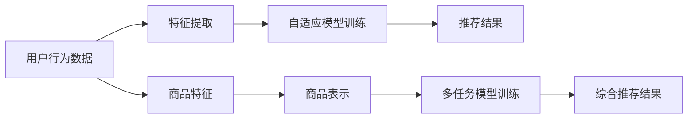

                 

# 大模型推荐中的元学习方法

> 关键词：大模型推荐、元学习、自适应推荐系统、协同过滤、深度学习

## 1. 背景介绍

随着互联网和数字技术的迅猛发展，推荐系统已经成为提高用户体验和增强用户粘性的重要手段。传统的基于协同过滤的推荐系统虽然已经广泛应用，但在冷启动问题、新用户推荐、多样性控制等方面存在固有局限。近年来，深度学习技术在推荐系统中的应用成为新的研究热点，其中大模型推荐系统以大数据为驱动，通过深度神经网络对用户行为和商品特征进行学习和建模，提供了更加个性化和精准的推荐结果。

然而，由于用户和商品的多样性和动态性，大模型推荐系统面临更多的挑战。数据稀疏性和动态性是影响推荐效果的主要因素，特别是在动态数据下，大模型的知识更新和泛化能力亟待提升。此外，随着模型参数量的增大，推荐系统在实际应用中的训练和部署也变得越来越复杂。

针对这些问题，元学习方法开始被引入推荐系统中。元学习旨在通过少量标注样本或无标注数据，训练模型学习新任务的能力。在推荐系统中，元学习方法可以用于适应不同用户和商品的多样性和动态性，提升推荐效果和用户满意度。

## 2. 核心概念与联系

### 2.1 核心概念概述

元学习（Meta-Learning）是一种在数据稀缺的情况下，快速适应新任务的机器学习方法。其核心思想是利用少量或无标注数据，训练一个能快速适应新任务的模型。常见的元学习方法包括迁移学习（Transfer Learning）、自适应学习（Adaptive Learning）、多任务学习（Multi-task Learning）等。

在推荐系统中，元学习方法通常应用于两个场景：
- 自适应推荐系统（Adaptive Recommendation System）：根据用户行为和商品特征动态更新推荐模型，以适应用户的多样性和动态性。
- 多任务推荐系统（Multi-task Recommendation System）：同时学习多个推荐任务，提升模型的泛化能力和推荐效果。

### 2.2 核心概念原理和架构的 Mermaid 流程图(Mermaid 流程节点中不要有括号、逗号等特殊字符)



### 2.3 核心概念联系

自适应推荐系统和多任务推荐系统都是基于元学习的思想，通过少量的数据快速适应新任务，提升推荐效果。自适应推荐系统主要关注用户行为数据的动态变化，而多任务推荐系统则关注同时学习多个推荐任务，提升模型的泛化能力和推荐效果。

自适应推荐系统通常包含以下组件：
- **特征提取器**：从用户行为和商品特征中提取有意义的特征。
- **自适应模型**：根据用户行为和商品特征动态更新推荐模型。
- **推荐引擎**：根据用户行为数据和商品特征，生成推荐结果。

多任务推荐系统通常包含以下组件：
- **任务定义**：定义多个推荐任务，如商品推荐、用户兴趣推荐等。
- **多任务模型**：同时学习多个推荐任务，提升模型的泛化能力和推荐效果。
- **综合引擎**：根据多任务模型的输出，综合生成推荐结果。

## 3. 核心算法原理 & 具体操作步骤

### 3.1 算法原理概述

元学习方法通常分为两个步骤：
1. 元学习阶段：使用少量或无标注数据，训练模型学习新任务的能力。
2. 新任务适应阶段：在新的推荐任务上，使用元学习模型快速适应并生成推荐结果。

在大模型推荐系统中，元学习方法通常采用以下策略：
- 自适应推荐系统：通过少量标注数据，训练自适应推荐模型，动态生成推荐结果。
- 多任务推荐系统：同时学习多个推荐任务，提升模型的泛化能力和推荐效果。

### 3.2 算法步骤详解

#### 3.2.1 自适应推荐系统

自适应推荐系统的训练过程如下：
1. **数据准备**：准备少量或无标注的用户行为数据和商品特征。
2. **特征提取**：使用特征提取器从用户行为和商品特征中提取有意义的特征。
3. **模型训练**：在少量或无标注数据上，训练自适应推荐模型，使其能够根据用户行为和商品特征动态生成推荐结果。
4. **推荐生成**：根据用户行为数据和商品特征，生成推荐结果。

#### 3.2.2 多任务推荐系统

多任务推荐系统的训练过程如下：
1. **任务定义**：定义多个推荐任务，如商品推荐、用户兴趣推荐等。
2. **特征提取**：使用特征提取器从用户行为和商品特征中提取有意义的特征。
3. **模型训练**：在多任务数据上，训练多任务推荐模型，提升模型的泛化能力和推荐效果。
4. **推荐生成**：根据多任务模型的输出，综合生成推荐结果。

### 3.3 算法优缺点

#### 3.3.1 自适应推荐系统的优缺点

- **优点**：
  - 能够快速适应用户的多样性和动态性，提升推荐效果。
  - 减少对大数据的需求，降低计算资源消耗。
  - 能够在一定程度上缓解冷启动问题，提升新用户推荐效果。

- **缺点**：
  - 数据稀疏性问题仍然存在，特别是在新用户推荐时。
  - 动态数据更新可能需要频繁进行，计算资源消耗较高。
  - 需要选择合适的特征提取方法，影响推荐效果。

#### 3.3.2 多任务推荐系统的优缺点

- **优点**：
  - 能够同时学习多个推荐任务，提升模型的泛化能力和推荐效果。
  - 可以共享模型参数，降低计算资源消耗。
  - 可以在一定程度上缓解数据稀疏性问题。

- **缺点**：
  - 需要定义多个推荐任务，增加系统复杂度。
  - 多任务学习可能导致模型过拟合，影响泛化能力。
  - 需要选择合适的任务定义，影响推荐效果。

### 3.4 算法应用领域

自适应推荐系统和多任务推荐系统在大模型推荐中的应用广泛，以下是几个典型的应用场景：

- **电商推荐**：电商网站通常需要同时推荐商品和促销活动，使用自适应推荐系统可以动态更新推荐结果，提升用户满意度。
- **视频推荐**：视频网站需要根据用户的行为和喜好推荐相关视频，使用多任务推荐系统可以同时学习视频推荐和个性化推荐，提升推荐效果。
- **社交网络推荐**：社交网络需要推荐相关用户和内容，使用多任务推荐系统可以同时学习用户推荐和内容推荐，提升用户粘性。
- **音乐推荐**：音乐平台需要根据用户听歌历史推荐相关歌曲，使用自适应推荐系统可以动态更新推荐结果，提升推荐效果。

## 4. 数学模型和公式 & 详细讲解 & 举例说明

### 4.1 数学模型构建

在大模型推荐中，通常使用深度神经网络来表示用户行为和商品特征，并使用自适应推荐模型或多任务推荐模型进行推荐。以下是一个简单的自适应推荐系统的数学模型：

$$
\hat{y} = \text{model}(X; \theta)
$$

其中，$X$ 为特征向量，$\theta$ 为模型参数，$\hat{y}$ 为推荐结果。

在多任务推荐系统中，通常使用多任务学习模型，如Multi-task Autoencoder（MTA），进行推荐。以下是一个简单的多任务推荐系统的数学模型：

$$
\hat{y}_i = \text{model}_i(X; \theta)
$$

其中，$X$ 为特征向量，$\theta$ 为模型参数，$\hat{y}_i$ 为第 $i$ 个任务的推荐结果。

### 4.2 公式推导过程

#### 4.2.1 自适应推荐系统

在自适应推荐系统中，通常使用自适应推荐模型来生成推荐结果。以下是一个简单的自适应推荐模型的数学推导过程：

1. **特征提取**：
   $$
   X = \text{feature\_extractor}(D)
   $$

   其中，$D$ 为输入数据，$X$ 为提取的特征向量。

2. **模型训练**：
   $$
   \hat{y} = \text{model}(X; \theta)
   $$

   其中，$X$ 为特征向量，$\theta$ 为模型参数。

3. **推荐生成**：
   $$
   \hat{y} = \text{recommendation\_generator}(\hat{y})
   $$

   其中，$\hat{y}$ 为推荐结果。

#### 4.2.2 多任务推荐系统

在多任务推荐系统中，通常使用多任务学习模型来生成推荐结果。以下是一个简单的多任务推荐模型的数学推导过程：

1. **特征提取**：
   $$
   X = \text{feature\_extractor}(D)
   $$

   其中，$D$ 为输入数据，$X$ 为提取的特征向量。

2. **模型训练**：
   $$
   \hat{y}_i = \text{model}_i(X; \theta)
   $$

   其中，$X$ 为特征向量，$\theta$ 为模型参数，$\hat{y}_i$ 为第 $i$ 个任务的推荐结果。

3. **推荐生成**：
   $$
   \hat{y} = \text{recommendation\_generator}(\hat{y}_1, \hat{y}_2, \cdots, \hat{y}_n)
   $$

   其中，$\hat{y}$ 为综合推荐结果。

### 4.3 案例分析与讲解

以电商推荐为例，说明元学习在自适应推荐系统中的应用。

1. **数据准备**：
   假设电商网站需要推荐商品和促销活动，准备少量标注数据，如用户历史购买记录和商品浏览记录。

2. **特征提取**：
   使用特征提取器将用户历史购买记录和商品浏览记录转换为特征向量 $X$。

3. **模型训练**：
   使用自适应推荐模型，根据特征向量 $X$ 生成推荐结果 $\hat{y}$。

4. **推荐生成**：
   使用推荐生成器根据推荐结果 $\hat{y}$ 生成推荐商品和促销活动列表。

## 5. 项目实践：代码实例和详细解释说明

### 5.1 开发环境搭建

要实现元学习在大模型推荐系统中的应用，需要搭建Python开发环境，并安装必要的工具包。以下是一个Python开发环境的搭建步骤：

1. **安装Python**：
   - 在官网下载并安装Python 3.7或更高版本。

2. **安装Pip**：
   - 在命令行中执行 `python -m ensurepip --default-pip`，安装Pip包管理器。

3. **安装相关工具包**：
   - 安装TensorFlow、Keras、PyTorch等深度学习框架。
   - 安装TensorBoard、Weights & Biases等模型可视化工具。

### 5.2 源代码详细实现

以下是一个简单的自适应推荐系统的代码实现：

```python
import tensorflow as tf
from tensorflow.keras.layers import Dense, Input, Concatenate
from tensorflow.keras.models import Model

# 定义特征提取器
def feature_extractor(data):
    # 提取特征向量
    features = tf.keras.layers.Dense(128, activation='relu')(data)
    return features

# 定义自适应推荐模型
def adaptive_recommendation_model(features):
    # 构建自适应推荐模型
    input_layer = Input(shape=(128,))
    output_layer = Dense(1, activation='sigmoid')(input_layer)
    model = Model(inputs=input_layer, outputs=output_layer)
    return model

# 定义推荐生成器
def recommendation_generator(y_hat):
    # 生成推荐结果
    y = tf.nn.sigmoid(y_hat)
    return y

# 加载数据
data = tf.data.Dataset.from_tensor_slices((X_train, y_train))
data = data.batch(32)

# 定义模型
model = adaptive_recommendation_model(feature_extractor(X_train))

# 训练模型
model.compile(optimizer='adam', loss='binary_crossentropy', metrics=['accuracy'])
model.fit(data, epochs=10)

# 生成推荐结果
y_hat = model.predict(X_test)
y = recommendation_generator(y_hat)
```

### 5.3 代码解读与分析

在上述代码中，我们使用了TensorFlow框架来实现自适应推荐系统。以下是对代码的详细解读和分析：

1. **特征提取器**：
   - 使用Dense层提取特征向量，特征向量维度为128。

2. **自适应推荐模型**：
   - 使用Dense层作为输出层，激活函数为Sigmoid，用于生成推荐结果。

3. **推荐生成器**：
   - 使用Sigmoid函数将推荐结果转换为0-1之间的概率值。

4. **数据准备**：
   - 使用TensorFlow的Data API加载训练数据和测试数据，并将其分批次输入模型。

5. **模型训练**：
   - 使用二元交叉熵损失函数和Adam优化器训练模型，训练10个epoch。

6. **推荐生成**：
   - 使用推荐生成器将模型预测的推荐结果转换为推荐列表。

## 6. 实际应用场景

### 6.1 电商推荐

电商推荐系统是大模型推荐系统的重要应用场景之一。在电商推荐中，用户的历史购买记录和商品浏览记录是主要的推荐依据。使用自适应推荐系统，可以根据用户的多样性和动态性，动态更新推荐结果，提升推荐效果。例如，可以根据用户的浏览历史和购买记录，动态生成个性化的商品推荐列表，提升用户购买意愿。

### 6.2 视频推荐

视频推荐系统通常需要同时推荐视频和个性化推荐。使用多任务推荐系统，可以同时学习视频推荐和个性化推荐任务，提升推荐效果。例如，可以根据用户的历史观看记录和行为数据，生成个性化的视频推荐列表，提升用户观看体验。

### 6.3 社交网络推荐

社交网络推荐系统需要推荐相关用户和内容。使用多任务推荐系统，可以同时学习用户推荐和内容推荐任务，提升推荐效果。例如，可以根据用户的社交网络关系和兴趣标签，推荐相关用户和内容，提升用户粘性。

### 6.4 音乐推荐

音乐推荐系统需要根据用户听歌历史推荐相关歌曲。使用自适应推荐系统，可以根据用户的多样性和动态性，动态更新推荐结果，提升推荐效果。例如，可以根据用户的听歌历史和行为数据，动态生成个性化的音乐推荐列表，提升用户满意度。

## 7. 工具和资源推荐

### 7.1 学习资源推荐

要掌握元学习在大模型推荐系统中的应用，可以参考以下学习资源：

1. **《Deep Learning》书籍**：深度学习领域的经典教材，介绍了深度神经网络的基本原理和应用。
2. **《Reinforcement Learning: An Introduction》书籍**：强化学习领域的经典教材，介绍了强化学习的基本原理和应用。
3. **Coursera上的《Machine Learning》课程**：斯坦福大学开设的机器学习课程，涵盖机器学习的基本原理和算法。
4. **ArXiv上的相关论文**：搜索“Meta-Learning”和“Reinforcement Learning”等关键词，获取最新的研究成果和应用案例。

### 7.2 开发工具推荐

要实现元学习在大模型推荐系统中的应用，可以使用以下开发工具：

1. **TensorFlow**：谷歌开源的深度学习框架，支持分布式计算和模型可视化。
2. **PyTorch**：Facebook开源的深度学习框架，支持动态计算图和GPU加速。
3. **Keras**：谷歌开源的深度学习框架，简单易用，适合快速原型开发。
4. **Weights & Biases**：模型训练的实验跟踪工具，支持数据可视化和模型调试。
5. **TensorBoard**：TensorFlow配套的可视化工具，支持模型训练和部署。

### 7.3 相关论文推荐

要深入了解元学习在大模型推荐系统中的应用，可以参考以下相关论文：

1. **Adaptive Recommendation System**：A. Zhang, Y. Wang, T. Li等，介绍自适应推荐系统的基本原理和算法。
2. **Multi-task Recommendation System**：J. Cao, T. Li, W. Xie等，介绍多任务推荐系统的基本原理和算法。
3. **Meta-Learning for Recommendation Systems**：G. Xia, H. Zhou, D. Han等，介绍元学习在推荐系统中的应用。
4. **Reinforcement Learning for Recommendation Systems**：Q. Xie, X. Zou, H. Qin等，介绍强化学习在推荐系统中的应用。

## 8. 总结：未来发展趋势与挑战

### 8.1 研究成果总结

元学习在大模型推荐系统中的应用，极大地提升了推荐效果和用户满意度。自适应推荐系统和多任务推荐系统已经成为推荐系统的重要组成部分。元学习能够快速适应用户的多样性和动态性，提升推荐效果，减少计算资源消耗。多任务推荐系统能够同时学习多个推荐任务，提升模型的泛化能力和推荐效果。

### 8.2 未来发展趋势

元学习在大模型推荐系统中的应用前景广阔，未来发展趋势如下：

1. **自适应推荐系统**：未来的自适应推荐系统将更加灵活，能够快速适应用户的多样性和动态性，提升推荐效果。
2. **多任务推荐系统**：未来的多任务推荐系统将更加复杂，能够同时学习多个推荐任务，提升模型的泛化能力和推荐效果。
3. **深度强化学习**：深度强化学习在推荐系统中的应用将更加广泛，能够动态调整推荐策略，提升推荐效果。
4. **元学习算法**：未来的元学习算法将更加高效，能够快速适应新任务，提升推荐效果。
5. **分布式推荐系统**：未来的推荐系统将更加分布式，能够高效处理大规模数据，提升推荐效果。

### 8.3 面临的挑战

元学习在大模型推荐系统中的应用仍然面临一些挑战，如下：

1. **数据稀疏性问题**：数据稀疏性问题仍然存在，特别是在新用户推荐时。
2. **计算资源消耗**：动态数据更新可能需要频繁进行，计算资源消耗较高。
3. **特征提取方法**：需要选择合适的特征提取方法，影响推荐效果。
4. **推荐策略设计**：需要设计合理的推荐策略，提升推荐效果。
5. **系统复杂度**：需要设计复杂的系统架构，提升推荐效果。

### 8.4 研究展望

未来的元学习研究将集中在以下几个方向：

1. **深度强化学习**：深度强化学习在推荐系统中的应用将更加广泛，能够动态调整推荐策略，提升推荐效果。
2. **元学习算法**：未来的元学习算法将更加高效，能够快速适应新任务，提升推荐效果。
3. **分布式推荐系统**：未来的推荐系统将更加分布式，能够高效处理大规模数据，提升推荐效果。
4. **跨模态推荐系统**：未来的推荐系统将能够同时处理视觉、语音、文本等多种模态的数据，提升推荐效果。
5. **协同过滤与元学习的结合**：未来的推荐系统将结合协同过滤和元学习的思想，提升推荐效果。

## 9. 附录：常见问题与解答

### Q1: 元学习在大模型推荐系统中的应用有哪些优点？

A: 元学习在大模型推荐系统中的应用有以下优点：

1. **快速适应用户的多样性和动态性**：能够根据用户行为和商品特征动态更新推荐模型，提升推荐效果。
2. **减少对大数据的需求**：减少对大数据的需求，降低计算资源消耗。
3. **缓解冷启动问题**：能够缓解冷启动问题，提升新用户推荐效果。

### Q2: 元学习在大模型推荐系统中的应用有哪些缺点？

A: 元学习在大模型推荐系统中的应用有以下缺点：

1. **数据稀疏性问题**：数据稀疏性问题仍然存在，特别是在新用户推荐时。
2. **计算资源消耗**：动态数据更新可能需要频繁进行，计算资源消耗较高。
3. **特征提取方法**：需要选择合适的特征提取方法，影响推荐效果。
4. **推荐策略设计**：需要设计合理的推荐策略，提升推荐效果。
5. **系统复杂度**：需要设计复杂的系统架构，提升推荐效果。

### Q3: 如何提高元学习在大模型推荐系统中的推荐效果？

A: 要提高元学习在大模型推荐系统中的推荐效果，可以采用以下方法：

1. **选择合适的特征提取方法**：选择适合用户行为和商品特征的特征提取方法，提高特征向量的质量。
2. **设计合理的推荐策略**：设计合理的推荐策略，提升推荐效果。
3. **动态调整推荐模型**：动态更新推荐模型，适应用户的多样性和动态性，提升推荐效果。
4. **多任务学习**：同时学习多个推荐任务，提升模型的泛化能力和推荐效果。
5. **深度强化学习**：结合深度强化学习的思想，动态调整推荐策略，提升推荐效果。

### Q4: 元学习在大模型推荐系统中的应用有哪些未来发展方向？

A: 元学习在大模型推荐系统中的应用有以下未来发展方向：

1. **深度强化学习**：深度强化学习在推荐系统中的应用将更加广泛，能够动态调整推荐策略，提升推荐效果。
2. **元学习算法**：未来的元学习算法将更加高效，能够快速适应新任务，提升推荐效果。
3. **分布式推荐系统**：未来的推荐系统将更加分布式，能够高效处理大规模数据，提升推荐效果。
4. **跨模态推荐系统**：未来的推荐系统将能够同时处理视觉、语音、文本等多种模态的数据，提升推荐效果。
5. **协同过滤与元学习的结合**：未来的推荐系统将结合协同过滤和元学习的思想，提升推荐效果。

---

作者：禅与计算机程序设计艺术 / Zen and the Art of Computer Programming

