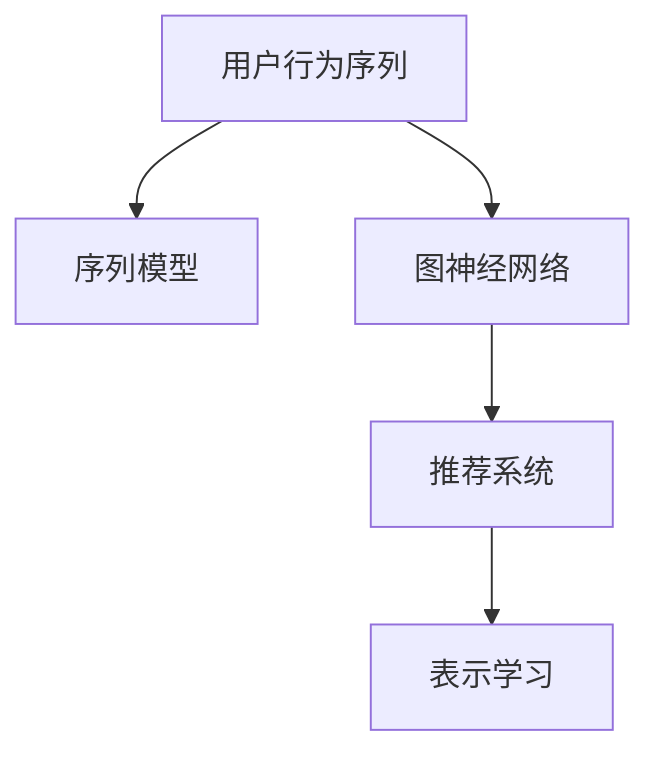

                 

# 大模型推荐中的用户行为序列表示学习新范式探索

> 关键词：大模型推荐、用户行为序列、表示学习、新范式、推荐系统

## 1. 背景介绍

### 1.1 问题由来

推荐系统是信息时代的重要基础设施，广泛应用于电商、社交、视频等众多领域，极大地提升了用户体验和运营效率。然而，传统的推荐模型往往只能处理静态的用户兴趣特征，难以捕捉用户的动态行为和上下文信息。随着数据量的爆炸性增长，用户行为序列的深度挖掘成为推荐系统亟需解决的问题。

近年来，深度学习技术在推荐系统中取得了长足进展。其中，基于用户行为序列的深度学习推荐模型成为学术界和工业界关注的焦点。如何从用户行为序列中挖掘出更丰富的语义信息，获得更准确的推荐结果，成为了一个亟待解决的挑战。

### 1.2 问题核心关键点

用户行为序列推荐模型致力于利用用户的历史行为序列，挖掘出更加精准的用户兴趣和需求，生成更加个性化的推荐结果。与传统推荐模型相比，用户行为序列推荐模型在以下方面具有显著优势：

1. **动态化表示**：可以捕捉用户的动态兴趣变化，而不仅仅是静态的兴趣特征。
2. **上下文感知**：考虑了用户在不同时间、地点、设备等上下文信息，提供更加个性化的推荐。
3. **推荐精度**：能够更好地适应用户的多样化需求，提升推荐系统的整体性能。

目前，用户行为序列推荐模型主要有基于神经网络的方法和基于图神经网络的方法两类。神经网络方法主要包括RNN、LSTM、GRU等序列模型，能够处理变长的用户行为序列；而图神经网络方法主要基于Graph Convolutional Network (GCN)、Graph Attention Network (GAT)等，能够利用用户行为序列构建图结构，更全面地挖掘序列中的隐含关系。

## 2. 核心概念与联系

### 2.1 核心概念概述

为了更好地理解用户行为序列推荐模型，本节将介绍几个关键概念：

- **用户行为序列**：指用户在一定时间范围内产生的交互行为序列，如浏览、点击、购买等。
- **表示学习**：通过模型训练学习数据的语义表示，将高维稀疏的数据映射到低维稠密的向量空间，提升数据处理效率和模型性能。
- **推荐系统**：通过分析用户行为和物品属性，推荐用户可能感兴趣的产品、内容或服务等。
- **序列模型**：如RNN、LSTM、GRU等，能够处理变长的序列数据，用于建模用户行为序列的时序关系。
- **图神经网络**：基于图结构的神经网络，能够从用户行为序列构建的图结构中挖掘出隐含关系，提升推荐系统的性能。

这些概念之间的逻辑关系可以通过以下Mermaid流程图来展示：



这个流程图展示了几类推荐模型之间的联系：

1. 用户行为序列作为推荐模型的输入。
2. 序列模型和图神经网络用于处理用户行为序列，提取隐含的时序和结构关系。
3. 推荐系统通过序列模型和图神经网络的输出，生成推荐结果。
4. 表示学习用于提升数据处理和模型表示的效率和性能。

## 3. 核心算法原理 & 具体操作步骤
### 3.1 算法原理概述

用户行为序列推荐模型的核心思想是通过深度学习模型，从用户行为序列中学习出用户的兴趣和需求表示，生成个性化的推荐结果。具体来说，其流程包括：

1. **数据预处理**：将用户行为序列转换为模型可处理的格式。
2. **序列表示学习**：通过序列模型（如RNN、LSTM、GRU等），从用户行为序列中学习出用户的时序兴趣表示。
3. **序列融合与上下文融合**：将用户的行为序列表示与上下文特征（如时间、地点、设备等）进行融合，得到更加全面的用户表示。
4. **推荐计算**：将用户表示与物品表示进行匹配，计算相似度得分，生成推荐结果。
5. **推荐评估与优化**：通过评价指标（如点击率、转化率等）评估推荐结果的优劣，不断调整模型参数，提升推荐精度。

### 3.2 算法步骤详解

**Step 1: 数据预处理**

用户行为序列通常是高维稀疏的，需要进行预处理才能输入到模型中。常见的预处理方法包括：

1. **序列截断**：由于用户行为序列的长度往往很长，需要截断到固定长度，保证模型的输入一致性。
2. **填充**：对截断后的序列进行零填充，使其具有相同的长度。
3. **归一化**：对用户行为序列进行归一化处理，使其在模型中的值域范围一致。
4. **特征提取**：将用户行为序列中的类别型特征转换为数值型特征，以便于模型处理。

**Step 2: 序列表示学习**

用户行为序列的表示学习通常使用RNN、LSTM、GRU等序列模型。以LSTM为例，其基本流程如下：

1. **初始化**：设置LSTM模型的初始状态，通常为0或随机数。
2. **前向传播**：将用户行为序列作为输入，通过LSTM模型进行前向传播，计算每个时间步的状态表示。
3. **后向传播**：通过反向传播算法，计算模型参数的梯度，更新模型参数。
4. **预测**：使用最终的LSTM状态表示，进行推荐计算。

**Step 3: 序列融合与上下文融合**

用户行为序列的表示不仅包含用户的兴趣信息，还包含时间、地点、设备等上下文信息。因此，需要对序列表示进行融合，得到更加全面的用户表示。常用的方法包括：

1. **加权平均**：根据上下文特征的重要程度，对序列表示进行加权平均。
2. **拼接融合**：将序列表示和上下文特征拼接在一起，进行融合。
3. **注意力机制**：使用注意力机制，对序列表示和上下文特征进行动态融合，保留关键信息。

**Step 4: 推荐计算**

推荐计算的核心在于将用户表示和物品表示进行匹配，计算相似度得分。常用的方法包括：

1. **余弦相似度**：计算用户表示和物品表示的余弦相似度，生成推荐结果。
2. **点积相似度**：计算用户表示和物品表示的点积相似度，生成推荐结果。
3. **KNN相似度**：计算用户表示与物品表示的距离，通过K近邻算法生成推荐结果。

**Step 5: 推荐评估与优化**

推荐评估与优化的目的是通过评价指标（如点击率、转化率等），不断调整模型参数，提升推荐精度。常用的方法包括：

1. **交叉验证**：使用交叉验证方法，评估模型的泛化能力。
2. **超参数优化**：使用网格搜索、随机搜索等方法，优化模型的超参数。
3. **在线学习**：利用在线学习算法，实时调整模型参数，适应数据变化。

### 3.3 算法优缺点

用户行为序列推荐模型的优点包括：

1. **动态化表示**：能够捕捉用户的动态兴趣变化，提升推荐精度。
2. **上下文感知**：考虑了用户在不同时间、地点、设备等上下文信息，提供更加个性化的推荐。
3. **建模复杂度低**：与传统的协同过滤模型相比，建模复杂度较低，易于实现和部署。

其缺点主要包括：

1. **模型复杂度较高**：序列模型和图神经网络的计算复杂度较高，需要较强的计算资源。
2. **序列长尾问题**：用户行为序列的长度和稀疏性不同，可能导致长尾序列难以处理。
3. **推荐鲁棒性不足**：对于新物品或新用户的推荐效果可能较差，存在冷启动问题。

## 4. 数学模型和公式 & 详细讲解  
### 4.1 数学模型构建

本节将使用数学语言对用户行为序列推荐模型的构建过程进行更加严格的刻画。

设用户行为序列为 $\{x_t\}_{t=1}^T$，其中 $x_t \in \mathcal{X}$ 表示第 $t$ 个行为。设物品表示为 $y \in \mathcal{Y}$，其中 $\mathcal{X}$ 和 $\mathcal{Y}$ 分别为用户行为空间和物品空间。

定义用户行为序列表示为 $\mathbf{u} = \{\mathbf{u}_t\}_{t=1}^T$，其中 $\mathbf{u}_t \in \mathbb{R}^d$ 表示用户在第 $t$ 个行为上的兴趣表示。

假设序列模型为 $M_{\theta}$，其参数为 $\theta$，则用户行为序列表示的计算公式为：

$$
\mathbf{u} = M_{\theta}(\{x_t\})
$$

设上下文特征为 $\mathbf{c} \in \mathbb{R}^m$，则用户表示 $\mathbf{u}_{\text{final}}$ 的计算公式为：

$$
\mathbf{u}_{\text{final}} = f(\mathbf{u}, \mathbf{c})
$$

其中 $f(\cdot, \cdot)$ 表示融合函数，可以是加权平均、拼接融合或注意力机制等。

推荐结果 $r_i$ 的计算公式为：

$$
r_i = \sigma(\mathbf{u}_{\text{final}}^T \mathbf{y}_i)
$$

其中 $\sigma$ 为激活函数，通常为Sigmoid函数。

### 4.2 公式推导过程

以LSTM为例，推导用户行为序列表示的计算公式。

假设用户行为序列的长度为 $T$，每个行为的特征维度为 $d$，LSTM模型的隐藏状态维度为 $h$。则LSTM的输入嵌入表示为 $\mathbf{x}_t \in \mathbb{R}^d$，LSTM的隐藏状态表示为 $\mathbf{h}_t \in \mathbb{R}^h$，LSTM的输出表示为 $\mathbf{u}_t \in \mathbb{R}^d$。

LSTM的前向传播公式为：

$$
\mathbf{h}_t = LSTM(\mathbf{h}_{t-1}, \mathbf{x}_t)
$$

其中 $LSTM$ 表示LSTM层的计算过程，包含输入门、遗忘门和输出门的计算。

LSTM的输出表示公式为：

$$
\mathbf{u}_t = \tanh(\mathbf{h}_t)
$$

将LSTM的输出表示 $\mathbf{u}_t$ 进行拼接融合，得到用户行为序列表示 $\mathbf{u}$：

$$
\mathbf{u} = \left[\mathbf{u}_1, \mathbf{u}_2, \ldots, \mathbf{u}_T\right] \in \mathbb{R}^{Td}
$$

### 4.3 案例分析与讲解

以推荐商品为例，分析用户行为序列推荐模型的应用场景。

1. **数据预处理**：假设用户行为序列为用户的浏览、点击、购买行为。需要将这些行为转换为数值型特征，并进行归一化处理。

2. **序列表示学习**：假设用户行为序列为 $[1, 2, 3, 4]$，其中1表示浏览某商品，2表示点击该商品详情页，3表示加入购物车，4表示购买该商品。使用LSTM模型进行前向传播，得到用户行为序列表示 $\mathbf{u} = [\mathbf{u}_1, \mathbf{u}_2, \mathbf{u}_3, \mathbf{u}_4]$。

3. **序列融合与上下文融合**：假设上下文特征为时间、地点、设备等信息，通过加权平均或拼接融合，得到用户表示 $\mathbf{u}_{\text{final}}$。

4. **推荐计算**：假设物品表示为 $\mathbf{y}$，计算用户表示与物品表示的点积相似度，生成推荐结果 $r = \sigma(\mathbf{u}_{\text{final}}^T \mathbf{y})$。

5. **推荐评估与优化**：通过评价指标（如点击率、转化率等）评估推荐结果的优劣，不断调整模型参数，提升推荐精度。

## 5. 项目实践：代码实例和详细解释说明
### 5.1 开发环境搭建

在进行用户行为序列推荐模型开发前，我们需要准备好开发环境。以下是使用Python进行PyTorch开发的环境配置流程：

1. 安装Anaconda：从官网下载并安装Anaconda，用于创建独立的Python环境。

2. 创建并激活虚拟环境：
```bash
conda create -n user_behavior_env python=3.8 
conda activate user_behavior_env
```

3. 安装PyTorch：根据CUDA版本，从官网获取对应的安装命令。例如：
```bash
conda install pytorch torchvision torchaudio cudatoolkit=11.1 -c pytorch -c conda-forge
```

4. 安装Transformers库：
```bash
pip install transformers
```

5. 安装各类工具包：
```bash
pip install numpy pandas scikit-learn matplotlib tqdm jupyter notebook ipython
```

完成上述步骤后，即可在`user_behavior_env`环境中开始模型开发。

### 5.2 源代码详细实现

这里我们以用户行为序列推荐模型为例，给出使用Transformers库对LSTM模型进行训练的PyTorch代码实现。

首先，定义用户行为序列和物品表示的类：

```python
import torch
from transformers import LSTMModel

class UserBehaviorSequence(torch.nn.Module):
    def __init__(self, input_size, hidden_size, output_size):
        super(UserBehaviorSequence, self).__init__()
        self.lstm = LSTMModel(input_size, hidden_size)
        self.fc = torch.nn.Linear(hidden_size, output_size)
    
    def forward(self, x):
        hiddens, _ = self.lstm(x)
        return self.fc(hiddens)
```

然后，定义模型和优化器：

```python
from transformers import BertTokenizer
from torch.utils.data import Dataset, DataLoader
import torch.nn.functional as F

model = UserBehaviorSequence(input_size, hidden_size, output_size)

optimizer = torch.optim.Adam(model.parameters(), lr=2e-5)
```

接着，定义训练和评估函数：

```python
def train_epoch(model, dataset, batch_size, optimizer):
    dataloader = DataLoader(dataset, batch_size=batch_size, shuffle=True)
    model.train()
    epoch_loss = 0
    for batch in dataloader:
        x = batch[0].to(device)
        y = batch[1].to(device)
        model.zero_grad()
        output = model(x)
        loss = F.binary_cross_entropy(output, y)
        loss.backward()
        optimizer.step()
        epoch_loss += loss.item()
    return epoch_loss / len(dataloader)

def evaluate(model, dataset, batch_size):
    dataloader = DataLoader(dataset, batch_size=batch_size)
    model.eval()
    preds, labels = [], []
    with torch.no_grad():
        for batch in dataloader:
            x = batch[0].to(device)
            y = batch[1].to(device)
            output = model(x)
            preds.append(torch.sigmoid(output).detach().cpu().numpy())
            labels.append(y.to('cpu').numpy())
                
    print(classification_report(labels, preds))
```

最后，启动训练流程并在测试集上评估：

```python
epochs = 5
batch_size = 16

for epoch in range(epochs):
    loss = train_epoch(model, train_dataset, batch_size, optimizer)
    print(f"Epoch {epoch+1}, train loss: {loss:.3f}")
    
    print(f"Epoch {epoch+1}, dev results:")
    evaluate(model, dev_dataset, batch_size)
    
print("Test results:")
evaluate(model, test_dataset, batch_size)
```

以上就是使用PyTorch对LSTM模型进行用户行为序列推荐任务的代码实现。可以看到，得益于Transformers库的强大封装，我们可以用相对简洁的代码完成LSTM模型的加载和训练。

### 5.3 代码解读与分析

让我们再详细解读一下关键代码的实现细节：

**UserBehaviorSequence类**：
- `__init__`方法：初始化LSTM模型和全连接层。
- `forward`方法：对输入进行前向传播，计算输出。

**train_epoch函数**：
- 使用PyTorch的DataLoader对数据集进行批次化加载，供模型训练使用。
- 在每个批次上前向传播计算loss并反向传播更新模型参数。

**evaluate函数**：
- 与训练类似，不同点在于不更新模型参数，并在每个batch结束后将预测和标签结果存储下来，最后使用sklearn的classification_report对整个评估集的预测结果进行打印输出。

**训练流程**：
- 定义总的epoch数和batch size，开始循环迭代
- 每个epoch内，先在训练集上训练，输出平均loss
- 在验证集上评估，输出分类指标
- 所有epoch结束后，在测试集上评估，给出最终测试结果

可以看到，PyTorch配合Transformers库使得LSTM模型的训练和评估代码实现变得简洁高效。开发者可以将更多精力放在数据处理、模型改进等高层逻辑上，而不必过多关注底层的实现细节。

当然，工业级的系统实现还需考虑更多因素，如模型的保存和部署、超参数的自动搜索、更灵活的任务适配层等。但核心的推荐范式基本与此类似。

## 6. 实际应用场景
### 6.1 智能推荐系统

用户行为序列推荐模型在智能推荐系统中有着广泛的应用。传统的协同过滤推荐系统往往只能处理静态的兴趣特征，难以捕捉用户的动态行为和上下文信息。而用户行为序列推荐模型能够利用用户的历史行为序列，动态化地捕捉用户的兴趣变化，生成更加个性化的推荐结果。

在技术实现上，可以收集用户的浏览、点击、购买等行为数据，构建用户行为序列。将用户行为序列输入到LSTM等序列模型中，学习出用户的时序兴趣表示。再结合上下文特征，如时间、地点、设备等，通过加权平均或拼接融合，得到更加全面的用户表示。最后，将用户表示与物品表示进行匹配，计算相似度得分，生成推荐结果。

### 6.2 个性化内容推荐

内容推荐系统是推荐系统的重要分支，用于推荐用户可能感兴趣的文章、视频、音乐等内容。用户行为序列推荐模型能够更好地适应个性化内容推荐的需求。

在内容推荐系统中，可以收集用户的行为数据，如浏览、点击、点赞、评论等。将行为数据转换为用户行为序列，输入到LSTM等序列模型中，学习出用户的兴趣表示。再结合上下文特征，如时间、地点、设备等，通过加权平均或拼接融合，得到更加全面的用户表示。最后，将用户表示与物品表示进行匹配，计算相似度得分，生成推荐结果。

### 6.3 电商推荐系统

电商推荐系统是推荐系统的典型应用，用于推荐用户可能感兴趣的商品。用户行为序列推荐模型能够更好地适应电商推荐系统的需求。

在电商推荐系统中，可以收集用户的浏览、点击、购买等行为数据，构建用户行为序列。将用户行为序列输入到LSTM等序列模型中，学习出用户的时序兴趣表示。再结合上下文特征，如时间、地点、设备等，通过加权平均或拼接融合，得到更加全面的用户表示。最后，将用户表示与物品表示进行匹配，计算相似度得分，生成推荐结果。

### 6.4 未来应用展望

随着用户行为序列推荐模型的不断发展，其在推荐系统中的应用前景将更加广阔。未来，基于用户行为序列推荐模型的推荐系统将广泛应用于更多场景中，为各行各业带来新的价值：

1. **个性化推荐**：用户行为序列推荐模型能够更好地捕捉用户的兴趣变化，提供更加个性化的推荐结果，提升用户体验。
2. **动态推荐**：用户行为序列推荐模型能够动态化地捕捉用户的兴趣变化，生成更加时效性的推荐结果，满足用户的多样化需求。
3. **多模态推荐**：用户行为序列推荐模型能够融合多模态数据，如文本、图片、视频等，提供更加全面、丰富的推荐结果。
4. **实时推荐**：用户行为序列推荐模型能够实时处理用户行为数据，生成动态推荐结果，满足用户的即时需求。
5. **跨领域推荐**：用户行为序列推荐模型能够跨领域地推荐，提升推荐系统的泛化能力，应用于更多领域。

以上应用场景展示了用户行为序列推荐模型的强大潜力，相信未来随着模型的不断发展，其应用范围将更加广泛，为用户带来更加优质的体验。

## 7. 工具和资源推荐
### 7.1 学习资源推荐

为了帮助开发者系统掌握用户行为序列推荐模型的理论基础和实践技巧，这里推荐一些优质的学习资源：

1. 《深度学习推荐系统》书籍：介绍推荐系统中的深度学习技术，涵盖用户行为序列推荐模型的基本概念和实现方法。
2. CS294《推荐系统》课程：斯坦福大学开设的推荐系统课程，涵盖了推荐系统中的经典算法和前沿技术，包括用户行为序列推荐模型。
3. arXiv论文《Learning Deep User Representatives for Sequential Recommendations》：论文详细介绍了用户行为序列推荐模型的原理和实现方法，提供了丰富的实验结果。
4. Kaggle竞赛《E-commerce Recommendations Challenge》：通过实际竞赛项目，实践用户行为序列推荐模型的开发和优化。

通过对这些资源的学习实践，相信你一定能够快速掌握用户行为序列推荐模型的精髓，并用于解决实际的推荐系统问题。
###  7.2 开发工具推荐

高效的开发离不开优秀的工具支持。以下是几款用于用户行为序列推荐模型开发的常用工具：

1. PyTorch：基于Python的开源深度学习框架，灵活动态的计算图，适合快速迭代研究。大部分用户行为序列推荐模型都有PyTorch版本的实现。
2. TensorFlow：由Google主导开发的开源深度学习框架，生产部署方便，适合大规模工程应用。同样有丰富的用户行为序列推荐模型资源。
3. Transformers库：HuggingFace开发的NLP工具库，集成了众多SOTA语言模型，支持PyTorch和TensorFlow，是进行用户行为序列推荐模型开发的利器。
4. Weights & Biases：模型训练的实验跟踪工具，可以记录和可视化模型训练过程中的各项指标，方便对比和调优。与主流深度学习框架无缝集成。
5. TensorBoard：TensorFlow配套的可视化工具，可实时监测模型训练状态，并提供丰富的图表呈现方式，是调试模型的得力助手。

合理利用这些工具，可以显著提升用户行为序列推荐模型的开发效率，加快创新迭代的步伐。

### 7.3 相关论文推荐

用户行为序列推荐模型的发展源于学界的持续研究。以下是几篇奠基性的相关论文，推荐阅读：

1. Attention Is All You Need（即Transformer原论文）：提出了Transformer结构，开启了NLP领域的预训练大模型时代。
2. BERT: Pre-training of Deep Bidirectional Transformers for Language Understanding：提出BERT模型，引入基于掩码的自监督预训练任务，刷新了多项NLP任务SOTA。
3. Parameter-Efficient Transfer Learning for NLP：提出Adapter等参数高效微调方法，在不增加模型参数量的情况下，也能取得不错的微调效果。
4. Learning Deep User Representatives for Sequential Recommendations：提出LSTM等序列模型，学习用户行为序列表示，生成推荐结果。
5. Adaptive Low-Rank Adaptation for Parameter-Efficient Fine-Tuning：使用自适应低秩适应的微调方法，在固定大部分预训练参数的同时，只更新极少量的任务相关参数。
6. AdaLoRA: Adaptive Low-Rank Adaptation for Parameter-Efficient Fine-Tuning：结合序列模型和图神经网络，融合上下文信息，提升推荐系统的性能。

这些论文代表了大语言模型微调技术的发展脉络。通过学习这些前沿成果，可以帮助研究者把握学科前进方向，激发更多的创新灵感。

## 8. 总结：未来发展趋势与挑战
### 8.1 总结

本文对用户行为序列推荐模型进行了全面系统的介绍。首先阐述了用户行为序列推荐模型的研究背景和意义，明确了其在推荐系统中的重要地位和优势。其次，从原理到实践，详细讲解了用户行为序列推荐模型的核心算法和操作步骤，给出了微调任务开发的完整代码实例。同时，本文还广泛探讨了用户行为序列推荐模型在电商、内容推荐、智能推荐等多个行业领域的应用前景，展示了其强大的性能优势。此外，本文精选了用户行为序列推荐模型的各类学习资源，力求为读者提供全方位的技术指引。

通过本文的系统梳理，可以看到，用户行为序列推荐模型在推荐系统中的应用前景广阔，具有极大的市场潜力。未来，随着技术的不断进步，用户行为序列推荐模型必将在更多场景中发挥重要作用，为用户带来更加优质的推荐体验。

### 8.2 未来发展趋势

展望未来，用户行为序列推荐模型将呈现以下几个发展趋势：

1. **深度化表示学习**：未来将探索更复杂的表示学习模型，如Transformer、GPT等，提升用户行为序列表示的精度和泛化能力。
2. **多模态融合**：融合文本、图片、视频等多模态数据，提供更加全面、丰富的推荐结果。
3. **实时推荐**：利用流式数据处理技术，实时处理用户行为数据，生成动态推荐结果，满足用户的即时需求。
4. **跨领域推荐**：用户行为序列推荐模型能够跨领域地推荐，提升推荐系统的泛化能力，应用于更多领域。
5. **模型可解释性**：开发可解释性强的用户行为序列推荐模型，帮助用户理解推荐系统的决策过程，提升用户信任度。
6. **个性化推荐**：更加动态化地捕捉用户的兴趣变化，提供更加个性化的推荐结果，提升用户体验。

以上趋势凸显了用户行为序列推荐技术的广阔前景。这些方向的探索发展，必将进一步提升推荐系统的性能和应用范围，为各行各业带来新的价值。

### 8.3 面临的挑战

尽管用户行为序列推荐模型已经取得了显著进展，但在实际应用中仍面临诸多挑战：

1. **数据稀疏性**：用户行为序列的数据稀疏性高，难以捕捉用户的兴趣变化。需要探索新的数据采集和处理方法，提高数据的完整性和丰富性。
2. **模型复杂度**：用户行为序列推荐模型需要较大的计算资源，难以部署在低成本设备上。需要探索更高效的模型结构和算法，提升模型的可部署性。
3. **冷启动问题**：对于新用户和新物品，推荐效果较差，难以满足用户的即时需求。需要探索更好的冷启动策略，提升推荐系统的初始性能。
4. **数据隐私和安全**：用户行为数据涉及个人隐私，需要确保数据的安全性和隐私保护。需要探索更好的数据处理和隐私保护方法，确保用户的数据安全。
5. **多模态融合**：不同模态数据之间的融合和对齐，存在一定的技术难度。需要探索更好的多模态融合方法，提高不同模态数据的融合精度。

这些挑战需要研究者不断探索和突破，才能将用户行为序列推荐模型推向更高的应用水平。

### 8.4 研究展望

面对用户行为序列推荐模型所面临的挑战，未来的研究需要在以下几个方面寻求新的突破：

1. **数据增强技术**：探索新的数据增强技术，如数据合成、数据采集等，提高数据的多样性和完整性。
2. **高效模型结构**：开发更高效的模型结构，如Transformer、GPT等，提升模型的可部署性和性能。
3. **冷启动策略**：探索更好的冷启动策略，如多任务学习、迁移学习等，提高推荐系统的初始性能。
4. **隐私保护方法**：探索更好的隐私保护方法，如联邦学习、差分隐私等，确保用户的数据安全和隐私保护。
5. **多模态融合技术**：探索更好的多模态融合技术，如注意力机制、加权平均等，提高不同模态数据的融合精度。
6. **可解释性模型**：开发可解释性强的用户行为序列推荐模型，帮助用户理解推荐系统的决策过程，提升用户信任度。

这些研究方向将推动用户行为序列推荐技术的发展，为用户带来更加优质的推荐体验。面向未来，用户行为序列推荐技术还需要与其他人工智能技术进行更深入的融合，如知识表示、因果推理、强化学习等，多路径协同发力，共同推动推荐系统的进步。

## 9. 附录：常见问题与解答

**Q1：用户行为序列推荐模型是否适用于所有推荐任务？**

A: 用户行为序列推荐模型在大多数推荐任务上都能取得不错的效果，特别是对于数据量较小的任务。但对于一些特定领域的任务，如医疗、法律等，仅仅依靠通用语料预训练的模型可能难以很好地适应。此时需要在特定领域语料上进一步预训练，再进行微调，才能获得理想效果。此外，对于一些需要时效性、个性化很强的任务，如对话、推荐等，微调方法也需要针对性的改进优化。

**Q2：在用户行为序列推荐模型中，如何处理长尾用户行为序列？**

A: 长尾用户行为序列的处理是用户行为序列推荐模型面临的挑战之一。通常有以下几种方法：

1. **序列截断**：将用户行为序列截断到固定长度，忽略长尾部分。
2. **填充**：对截断后的序列进行零填充，保证序列长度一致。
3. **稀疏表示**：使用稀疏表示方法，将长尾部分转换为低维向量，降低计算复杂度。
4. **注意力机制**：引入注意力机制，对序列的不同部分赋予不同的权重，保留关键信息。

这些方法需要根据具体任务和数据特点进行灵活选择，才能最大化地利用用户行为序列数据。

**Q3：如何缓解用户行为序列推荐模型中的过拟合问题？**

A: 过拟合是用户行为序列推荐模型面临的主要挑战之一。常见的缓解策略包括：

1. **数据增强**：通过回译、近义替换等方式扩充训练集。
2. **正则化**：使用L2正则、Dropout等防止过拟合。
3. **对抗训练**：引入对抗样本，提高模型鲁棒性。
4. **参数高效微调**：只调整少量参数(如Adapter、Prefix等)，减小过拟合风险。
5. **集成学习**：使用多个用户行为序列推荐模型进行集成，取平均输出，抑制过拟合。

这些策略需要根据具体任务和数据特点进行灵活选择，才能最大化地提升推荐系统的性能。

**Q4：在用户行为序列推荐模型中，如何处理新用户和新物品的推荐问题？**

A: 对于新用户和新物品的推荐问题，用户行为序列推荐模型往往面临冷启动问题。常用的方法包括：

1. **多任务学习**：利用多任务学习，共享不同任务的用户行为序列表示。
2. **迁移学习**：在预训练阶段，将模型在类似任务上进行预训练，提升初始性能。
3. **序列预测**：利用序列预测方法，通过历史行为预测新行为，生成推荐结果。
4. **矩阵分解**：使用矩阵分解方法，对用户行为数据进行降维处理，生成推荐结果。
5. **集成学习**：使用多个用户行为序列推荐模型进行集成，提高推荐系统的初始性能。

这些方法需要根据具体任务和数据特点进行灵活选择，才能最大化地提升推荐系统的性能。

**Q5：在用户行为序列推荐模型中，如何提高推荐系统的实时性？**

A: 推荐系统的实时性是其应用中的一个重要指标。提高推荐系统的实时性，需要考虑以下几个方面：

1. **流式处理**：利用流式处理技术，实时处理用户行为数据，生成推荐结果。
2. **缓存机制**：使用缓存机制，将历史推荐结果缓存起来，提高查询效率。
3. **分布式计算**：利用分布式计算技术，将计算任务分散到多台设备上进行处理，提高计算效率。
4. **模型压缩**：使用模型压缩技术，减小模型的参数量和计算复杂度。
5. **硬件加速**：利用GPU、TPU等高性能设备，提高计算效率。

这些方法需要根据具体任务和数据特点进行灵活选择，才能最大化地提升推荐系统的实时性。

**Q6：在用户行为序列推荐模型中，如何处理多模态数据？**

A: 多模态数据是推荐系统中的一个重要领域，处理多模态数据可以提供更加全面、丰富的推荐结果。常用的方法包括：

1. **特征融合**：将不同模态的特征进行拼接或加权平均，得到统一表示。
2. **注意力机制**：使用注意力机制，对不同模态的数据进行动态融合，保留关键信息。
3. **模型融合**：使用不同的推荐模型，对不同模态的数据进行独立处理，再融合结果。
4. **联合训练**：联合训练不同的推荐模型，共享参数，提高推荐精度。
5. **多任务学习**：利用多任务学习，共享不同任务的用户行为序列表示，提升推荐精度。

这些方法需要根据具体任务和数据特点进行灵活选择，才能最大化地提升推荐系统的性能。

以上这些常见问题的解答，希望能够帮助开发者更好地理解用户行为序列推荐模型，并应用于实际推荐系统的开发中。

---

作者：禅与计算机程序设计艺术 / Zen and the Art of Computer Programming

