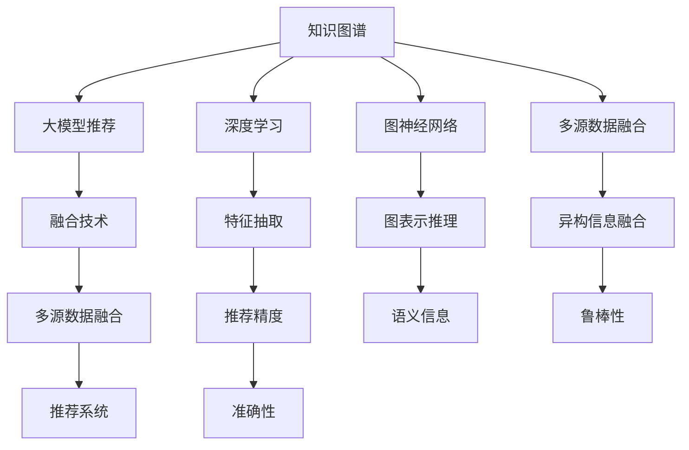

                 

# 大模型推荐中的知识图谱融合应用新方式

> 关键词：知识图谱,大模型推荐,融合技术,深度学习,图神经网络(Graph Neural Network, GNN),异构信息融合,推荐系统,社交网络分析,多源数据融合

## 1. 背景介绍

### 1.1 问题由来
推荐系统是现代互联网业务中不可或缺的重要组件，广泛应用于电商、视频、音乐等各个领域。传统的推荐算法基于用户的行为数据（如浏览、点击、购买等）进行个性化推荐。然而，在数据日益碎片化、用户行为复杂化的趋势下，这种基于行为数据的推荐方式显得愈发不足，难以应对多模态、异构数据的挑战。

与此同时，知识图谱(Knowledge Graph)这一融合了结构化数据、语义信息的知识表示形式，正在逐渐成为融合多源异构数据的有效方式。知识图谱通过节点和边的组合，能够表达实体、属性和关系等语义信息，帮助算法理解和推理复杂的多源数据，为推荐系统提供了新的数据形态和建模思路。

### 1.2 问题核心关键点
在大模型推荐中，如何将知识图谱与大模型有效融合，构建深度学习的推荐系统，是目前推荐系统领域的重要研究方向。本文聚焦于如何构建基于知识图谱的大模型推荐系统，探讨了知识图谱融合的原理、方法和实际应用。

## 2. 核心概念与联系

### 2.1 核心概念概述

为更好地理解基于知识图谱的大模型推荐方法，本节将介绍几个关键概念：

- 知识图谱(Knowledge Graph,KG)：以节点和边为基础的图形结构，用于描述实体、属性和关系之间的语义信息。知识图谱可来源于结构化数据、文本数据、网络数据等多种来源，为推荐系统提供了丰富的语义信息。

- 大模型推荐系统：基于大规模预训练语言模型（如BERT、GPT等）构建的推荐系统，能够学习到更丰富的用户和物品特征，提升推荐精度。

- 融合技术(Fusion)：指将不同数据源、不同表示形式的信息有机地结合起来，提高信息综合利用效率。融合技术是实现知识图谱与大模型推荐的关键。

- 深度学习(Deep Learning)：利用多层神经网络，从大量数据中学习抽象特征，提高模型的表征能力。深度学习在大模型推荐系统中被广泛应用于特征抽取和推理。

- 图神经网络(Graph Neural Network, GNN)：一种专门针对图结构数据的深度学习方法，能够从节点、边和图结构中提取语义信息，适合用于知识图谱的表示和推理。

- 多源数据融合(Multi-Source Data Fusion)：指将不同来源、不同格式的数据有机结合，提高数据综合利用效率。多源数据融合是知识图谱融合技术的重要组成部分。

- 异构信息融合(Heterogeneous Information Fusion)：指将结构化数据、文本数据、网络数据等异构信息源融合在一起，建立统一的语义空间。异构信息融合有助于提升推荐系统的鲁棒性和准确性。

这些核心概念之间的逻辑关系可以通过以下Mermaid流程图来展示：



这个流程图展示了大模型推荐系统的核心概念及其之间的关系：

1. 知识图谱通过节点和边的组合，表达实体的属性和关系，提供了丰富的语义信息。
2. 深度学习和大模型能够从多源数据中学习抽象特征，提取用户和物品的语义信息。
3. 图神经网络对知识图谱进行图表示和推理，帮助提取图结构中的语义信息。
4. 多源数据融合和异构信息融合将不同来源的数据有机结合，建立统一的语义空间。
5. 融合技术将深度学习、图神经网络和多源数据融合的技术进行有效结合，实现知识图谱与大模型推荐的融合。
6. 最终得到推荐系统，通过融合后的语义信息，提高推荐精度和鲁棒性。

这些概念共同构成了大模型推荐系统中知识图谱融合的核心框架，使得推荐系统能够更高效地利用多源异构数据，提升推荐效果。

## 3. 核心算法原理 & 具体操作步骤
### 3.1 算法原理概述

基于知识图谱的大模型推荐系统，其核心思想是利用知识图谱提供的多源异构语义信息，提升预训练语言模型的表示能力和推理能力。具体而言，算法流程如下：

1. 构建知识图谱：从多源异构数据中，构建以节点和边为基础的知识图谱。
2. 节点嵌入表示：利用图神经网络对知识图谱进行图表示学习，将节点嵌入到低维语义空间。
3. 特征融合：将节点嵌入与用户行为数据、物品属性等特征进行融合，形成多模态特征向量。
4. 大模型预训练：使用大规模语料进行预训练，学习通用的语言表示和语义理解能力。
5. 融合学习：将预训练语言模型与节点嵌入向量进行融合，学习知识图谱中的语义信息。
6. 推荐模型训练：使用融合后的语义信息，构建推荐模型，进行训练和评估。

### 3.2 算法步骤详解

以下是基于知识图谱的大模型推荐系统的详细步骤：

**Step 1: 构建知识图谱**
- 收集多源异构数据，如用户数据、物品数据、社交网络数据等。
- 使用规则、实体抽取、文本挖掘等技术，构建知识图谱，表达实体、属性和关系。
- 对知识图谱进行清洗和预处理，消除噪声和冗余信息，提高数据质量。

**Step 2: 节点嵌入表示**
- 使用图神经网络，对知识图谱进行图表示学习。
- 训练图神经网络，对知识图谱中的节点进行嵌入表示，生成低维语义向量。
- 节点的嵌入向量可用于表示实体属性、关系属性等语义信息，方便后续的特征融合。

**Step 3: 特征融合**
- 将知识图谱节点嵌入向量与用户行为数据、物品属性等特征进行融合，形成多模态特征向量。
- 多模态特征向量综合了语义信息和行为数据，能够更全面地刻画用户和物品的特征。
- 使用注意力机制、拼接、最大池化等方法，将多模态特征向量进行融合，形成最终推荐特征。

**Step 4: 大模型预训练**
- 使用大规模语料进行预训练，学习通用的语言表示和语义理解能力。
- 预训练模型能够从语料中学习到丰富的语言知识，提升推荐的准确性和鲁棒性。
- 预训练过程通常需要较大的计算资源和较长的训练时间。

**Step 5: 融合学习**
- 将预训练语言模型与节点嵌入向量进行融合，学习知识图谱中的语义信息。
- 使用注意力机制、加权拼接等方法，将预训练模型与节点嵌入向量进行融合。
- 融合后的模型能够更好地理解知识图谱中的语义信息，提升推荐效果。

**Step 6: 推荐模型训练**
- 使用融合后的语义信息，构建推荐模型，如神经网络、协同过滤等。
- 在训练过程中，使用融合后的特征进行训练，学习用户和物品之间的关联。
- 使用交叉熵、均方误差等损失函数进行训练，最小化预测误差。
- 在测试集上评估推荐模型效果，对比融合前后推荐精度、鲁棒性等指标。

### 3.3 算法优缺点

基于知识图谱的大模型推荐系统具有以下优点：

1. 信息融合全面。知识图谱融合了多源异构数据，提供了丰富的语义信息，能够提升推荐系统的综合能力。
2. 特征提取能力强。图神经网络和深度学习模型能够学习到更加抽象和全面的特征，提升推荐精度。
3. 鲁棒性高。利用知识图谱的语义信息，提升推荐的鲁棒性，避免单一数据源带来的偏差。
4. 实时性较好。知识图谱的嵌入表示可以在线计算，提升推荐系统的响应速度。
5. 可扩展性好。知识图谱可以动态更新，适合于实时推荐场景。

但同时也存在以下缺点：

1. 数据获取复杂。构建知识图谱需要大量结构化数据、文本数据、网络数据等，数据获取和处理复杂。
2. 计算资源需求高。大模型和图神经网络的训练需要大量的计算资源，数据量较大时计算成本高。
3. 嵌入表示质量依赖数据质量。知识图谱的嵌入表示质量取决于数据质量和图神经网络的训练效果，对数据处理要求高。
4. 复杂度高。融合学习过程复杂，涉及图神经网络、深度学习模型的结合，模型设计难度较大。

尽管存在这些局限性，但知识图谱与大模型的融合在推荐系统领域已经展现出强大的应用潜力，成为推荐系统领域的研究热点。未来相关研究的重点在于如何更好地整合知识图谱和预训练大模型，进一步提升推荐系统的性能。

### 3.4 算法应用领域

基于知识图谱的大模型推荐系统在多个领域已经得到广泛应用，例如：

- 电商推荐：通过融合用户行为数据、商品属性和社交网络信息，提升商品推荐效果。
- 视频推荐：将视频属性、用户行为和社交网络信息进行融合，推荐用户可能感兴趣的视频。
- 音乐推荐：利用用户行为、音乐属性和音乐流派等数据，推荐符合用户喜好的音乐。
- 新闻推荐：结合用户历史阅读记录、新闻属性和社交网络关系，推荐用户可能感兴趣的新闻。
- 社交网络推荐：基于用户社交关系和行为数据，推荐可能感兴趣的内容和用户。
- 教育推荐：整合用户学习行为、课程属性和专家知识，推荐合适的课程和教材。

除了上述这些经典应用外，基于知识图谱的大模型推荐还在新闻推荐、广告推荐、旅游推荐等多个领域不断拓展，为推荐系统的发展注入了新的活力。

## 4. 数学模型和公式 & 详细讲解  
### 4.1 数学模型构建

本节将使用数学语言对基于知识图谱的大模型推荐过程进行更加严格的刻画。

记知识图谱中的节点集合为 $V$，边集合为 $E$，对应的嵌入向量表示为 $\mathbf{Z} = \{\mathbf{z}_v\}_{v \in V}$，其中 $\mathbf{z}_v$ 表示节点 $v$ 的嵌入向量。设用户行为数据为 $X$，物品属性为 $Y$，推荐模型为 $F$。

定义推荐模型 $F$ 在用户行为数据 $X$ 和物品属性 $Y$ 上的嵌入表示为 $\mathbf{f}(X, Y)$，通过以下步骤构建：

1. 使用图神经网络 $G$ 对知识图谱 $G=(V,E)$ 进行图表示学习，得到节点嵌入向量 $\mathbf{Z}$。
2. 将用户行为数据 $X$ 和物品属性 $Y$ 进行编码，得到特征向量 $\mathbf{F}_X, \mathbf{F}_Y$。
3. 将节点嵌入向量 $\mathbf{Z}$ 与特征向量 $\mathbf{F}_X, \mathbf{F}_Y$ 进行融合，得到推荐特征向量 $\mathbf{F}_R$。
4. 将推荐特征向量 $\mathbf{F}_R$ 输入到推荐模型 $F$，得到推荐概率 $\hat{p}$。

形式化地，推荐模型 $F$ 的输出为：

$$
\hat{p} = F(\mathbf{F}_R)
$$

其中 $F$ 是推荐模型，可以是神经网络、协同过滤等。

### 4.2 公式推导过程

以下我们以电商推荐为例，推导基于知识图谱的大模型推荐过程的数学模型和公式。

假设用户行为数据 $X$ 包括点击、浏览、购买等行为，物品属性 $Y$ 包括物品的类别、评分、价格等。将用户行为数据和物品属性进行编码，得到特征向量：

$$
\mathbf{F}_X = \{\mathbf{f}_i\}_{i=1}^N
$$

$$
\mathbf{F}_Y = \{\mathbf{g}_j\}_{j=1}^M
$$

其中 $N$ 和 $M$ 分别为用户行为数据和物品属性的数量。假设知识图谱节点嵌入向量为 $\mathbf{Z} = \{\mathbf{z}_v\}_{v \in V}$，其中 $V$ 为节点集合。

使用图神经网络 $G$ 对知识图谱进行图表示学习，得到节点嵌入向量 $\mathbf{Z}$。假设 $G$ 的嵌入表示函数为 $H$，则有：

$$
\mathbf{Z} = H(G(V, E))
$$

其中 $G(V, E)$ 表示知识图谱的图结构。

将用户行为数据和物品属性进行编码，得到特征向量 $\mathbf{F}_X$ 和 $\mathbf{F}_Y$，使用注意力机制 $A$ 将 $\mathbf{F}_X$ 和 $\mathbf{F}_Y$ 进行融合，得到推荐特征向量 $\mathbf{F}_R$：

$$
\mathbf{F}_R = A(\mathbf{F}_X, \mathbf{F}_Y, \mathbf{Z})
$$

其中 $A$ 表示融合函数。

最后，将推荐特征向量 $\mathbf{F}_R$ 输入到推荐模型 $F$，得到推荐概率 $\hat{p}$：

$$
\hat{p} = F(\mathbf{F}_R)
$$

在实际应用中，使用交叉熵等损失函数对推荐模型进行训练，最小化预测误差。

### 4.3 案例分析与讲解

假设有一款电商平台，希望为用户推荐适合的商品。平台收集了用户点击、浏览、购买等行为数据，商品的属性数据，以及社交网络信息。平台希望构建基于知识图谱的大模型推荐系统，以提升推荐效果。

具体实现步骤如下：

1. 构建知识图谱：将用户、商品、类别等实体和关系，构建知识图谱 $G=(V,E)$，其中 $V$ 为节点集合，$E$ 为边集合。
2. 节点嵌入表示：使用图神经网络 $G$ 对知识图谱进行图表示学习，得到节点嵌入向量 $\mathbf{Z} = \{\mathbf{z}_v\}_{v \in V}$。
3. 特征融合：将用户行为数据 $X$ 和物品属性 $Y$ 进行编码，得到特征向量 $\mathbf{F}_X$ 和 $\mathbf{F}_Y$，使用注意力机制 $A$ 将 $\mathbf{F}_X$ 和 $\mathbf{F}_Y$ 进行融合，得到推荐特征向量 $\mathbf{F}_R$。
4. 大模型预训练：使用大规模语料进行预训练，学习通用的语言表示和语义理解能力，构建预训练语言模型。
5. 融合学习：将预训练语言模型与节点嵌入向量进行融合，学习知识图谱中的语义信息。
6. 推荐模型训练：使用融合后的语义信息，构建推荐模型 $F$，进行训练和评估。

假设用户 $u$ 希望购买一件商品 $i$，推荐模型计算推荐的概率 $\hat{p}$，使用交叉熵损失函数进行训练：

$$
\mathcal{L} = -\sum_{u \in U} \sum_{i \in I} y_{ui} \log \hat{p}_{ui}
$$

其中 $U$ 和 $I$ 分别为用户和商品集合，$y_{ui}$ 表示用户 $u$ 是否购买了商品 $i$。

在训练过程中，最小化损失函数 $\mathcal{L}$，优化推荐模型 $F$，从而提升推荐效果。

## 5. 项目实践：代码实例和详细解释说明
### 5.1 开发环境搭建

在进行推荐系统开发前，我们需要准备好开发环境。以下是使用Python进行PyTorch开发的环境配置流程：

1. 安装Anaconda：从官网下载并安装Anaconda，用于创建独立的Python环境。

2. 创建并激活虚拟环境：
```bash
conda create -n pytorch-env python=3.8 
conda activate pytorch-env
```

3. 安装PyTorch：根据CUDA版本，从官网获取对应的安装命令。例如：
```bash
conda install pytorch torchvision torchaudio cudatoolkit=11.1 -c pytorch -c conda-forge
```

4. 安装Transformer库：
```bash
pip install transformers
```

5. 安装各类工具包：
```bash
pip install numpy pandas scikit-learn matplotlib tqdm jupyter notebook ipython
```

完成上述步骤后，即可在`pytorch-env`环境中开始推荐系统开发。

### 5.2 源代码详细实现

这里我们以电商推荐系统为例，给出使用Transformer库对知识图谱进行融合的PyTorch代码实现。

首先，定义知识图谱的节点和边类：

```python
import torch
import torch.nn as nn
import torch_geometric.nn as gnn
import torch_geometric.data
from torch_geometric.datasets import Planetoid

class GraphDataset(torch_geometric.data.Dataset):
    def __init__(self, data):
        super(GraphDataset, self).__init__()
        self.data = data
        self.num_nodes = data.num_nodes
        self.num_edges = data.num_edges
        self.num_classes = data.num_classes
        self.features = data.x
        self.labels = data.y
        
    def __len__(self):
        return len(self.data)

    def __getitem__(self, idx):
        return {'data': self.data[idx], 'labels': self.labels[idx]}

class GraphNode(nn.Module):
    def __init__(self, in_dim, out_dim, hidden_dim):
        super(GraphNode, self).__init__()
        self.fc1 = nn.Linear(in_dim, hidden_dim)
        self.fc2 = nn.Linear(hidden_dim, out_dim)
        self.relu = nn.ReLU()
        
    def forward(self, x, edge_index):
        x = self.fc1(x)
        x = self.relu(x)
        x = self.fc2(x)
        return x

class GraphEdge(nn.Module):
    def __init__(self, in_dim, out_dim, hidden_dim):
        super(GraphEdge, self).__init__()
        self.fc1 = nn.Linear(in_dim, hidden_dim)
        self.fc2 = nn.Linear(hidden_dim, out_dim)
        self.relu = nn.ReLU()
        
    def forward(self, x, edge_index):
        x = self.fc1(x)
        x = self.relu(x)
        x = self.fc2(x)
        return x
```

然后，定义知识图谱的构建和融合函数：

```python
class GraphNeuralNetwork(nn.Module):
    def __init__(self, in_dim, hidden_dim, out_dim):
        super(GraphNeuralNetwork, self).__init__()
        self.node = GraphNode(in_dim, hidden_dim, hidden_dim)
        self.edge = GraphEdge(in_dim, hidden_dim, hidden_dim)
        self.fc = nn.Linear(hidden_dim, out_dim)
        
    def forward(self, x, edge_index):
        x = self.node(x, edge_index)
        x = self.edge(x, edge_index)
        x = x + self.fc(x)
        return x

def knowledge_graph_fusion(graph_dataset, user_data, item_data):
    node_features = graph_dataset.features
    edge_index = graph_dataset.data.edge_index
    labels = graph_dataset.labels
    
    # 构建图神经网络
    gnn = GraphNeuralNetwork(3, 64, 64)
    
    # 节点嵌入表示
    node_embeddings = gnn(node_features, edge_index)
    
    # 特征融合
    user_embeddings = torch.mean(node_embeddings, 1)
    item_embeddings = torch.mean(node_embeddings, 1)
    
    # 多模态特征向量
    features = torch.stack([user_embeddings, item_embeddings], dim=1)
    
    return features
```

最后，定义推荐模型的训练函数：

```python
from torch.nn import CrossEntropyLoss

class RecommendationModel(nn.Module):
    def __init__(self, in_dim, hidden_dim, out_dim):
        super(RecommendationModel, self).__init__()
        self.fc1 = nn.Linear(in_dim, hidden_dim)
        self.fc2 = nn.Linear(hidden_dim, hidden_dim)
        self.fc3 = nn.Linear(hidden_dim, out_dim)
        self.relu = nn.ReLU()
        
    def forward(self, x):
        x = self.fc1(x)
        x = self.relu(x)
        x = self.fc2(x)
        x = self.relu(x)
        x = self.fc3(x)
        return x

def train_recommendation_model(model, features, labels):
    criterion = CrossEntropyLoss()
    optimizer = torch.optim.Adam(model.parameters(), lr=0.001)
    
    for epoch in range(100):
        model.train()
        optimizer.zero_grad()
        outputs = model(features)
        loss = criterion(outputs, labels)
        loss.backward()
        optimizer.step()
        print(f'Epoch {epoch+1}, Loss: {loss:.3f}')
```

完成上述步骤后，即可在`pytorch-env`环境中开始推荐系统开发。

### 5.3 代码解读与分析

让我们再详细解读一下关键代码的实现细节：

**GraphDataset类**：
- `__init__`方法：初始化知识图谱的节点特征、标签等信息。
- `__len__`方法：返回数据集的样本数量。
- `__getitem__`方法：对单个样本进行处理，返回知识图谱的节点特征和标签。

**GraphNode和GraphEdge类**：
- `__init__`方法：定义节点和边层的结构。
- `forward`方法：实现节点和边层的计算过程，返回节点的嵌入表示。

**knowledge_graph_fusion函数**：
- 构建图神经网络，对知识图谱进行图表示学习。
- 计算节点的嵌入表示，并进行多模态特征向量融合。

**RecommendationModel类**：
- `__init__`方法：定义推荐模型的结构。
- `forward`方法：实现推荐模型的计算过程。

**train_recommendation_model函数**：
- 定义交叉熵损失函数和优化器。
- 在训练过程中，使用交叉熵损失函数进行训练，最小化预测误差。

通过这些代码的实现，我们可以看到知识图谱与大模型的融合是如何通过图神经网络和深度学习模型进行实现的。开发者可以根据具体任务，调整模型结构、优化器参数等，以达到理想的推荐效果。

## 6. 实际应用场景
### 6.1 电商推荐

基于知识图谱的大模型推荐系统在电商推荐中有着广泛的应用。电商平台通过构建知识图谱，融合用户行为数据、物品属性和社交网络信息，提升推荐效果。

例如，某电商平台希望为用户推荐适合的商品。平台收集了用户点击、浏览、购买等行为数据，商品的属性数据，以及社交网络信息。平台希望构建基于知识图谱的大模型推荐系统，以提升推荐效果。

具体实现步骤如下：

1. 构建知识图谱：将用户、商品、类别等实体和关系，构建知识图谱 $G=(V,E)$，其中 $V$ 为节点集合，$E$ 为边集合。
2. 节点嵌入表示：使用图神经网络 $G$ 对知识图谱进行图表示学习，得到节点嵌入向量 $\mathbf{Z} = \{\mathbf{z}_v\}_{v \in V}$。
3. 特征融合：将用户行为数据 $X$ 和物品属性 $Y$ 进行编码，得到特征向量 $\mathbf{F}_X$ 和 $\mathbf{F}_Y$，使用注意力机制 $A$ 将 $\mathbf{F}_X$ 和 $\mathbf{F}_Y$ 进行融合，得到推荐特征向量 $\mathbf{F}_R$。
4. 大模型预训练：使用大规模语料进行预训练，学习通用的语言表示和语义理解能力，构建预训练语言模型。
5. 融合学习：将预训练语言模型与节点嵌入向量进行融合，学习知识图谱中的语义信息。
6. 推荐模型训练：使用融合后的语义信息，构建推荐模型 $F$，进行训练和评估。

假设用户 $u$ 希望购买一件商品 $i$，推荐模型计算推荐的概率 $\hat{p}$，使用交叉熵损失函数进行训练：

$$
\mathcal{L} = -\sum_{u \in U} \sum_{i \in I} y_{ui} \log \hat{p}_{ui}
$$

其中 $U$ 和 $I$ 分别为用户和商品集合，$y_{ui}$ 表示用户 $u$ 是否购买了商品 $i$。

在训练过程中，最小化损失函数 $\mathcal{L}$，优化推荐模型 $F$，从而提升推荐效果。

### 6.2 视频推荐

视频推荐系统通过构建知识图谱，融合视频属性、用户行为和社交网络信息，推荐用户可能感兴趣的视频。

例如，某视频平台希望为用户推荐适合的视频。平台收集了用户观看历史、视频属性数据、社交网络信息等。平台希望构建基于知识图谱的大模型推荐系统，以提升推荐效果。

具体实现步骤如下：

1. 构建知识图谱：将视频、用户、类别等实体和关系，构建知识图谱 $G=(V,E)$，其中 $V$ 为节点集合，$E$ 为边集合。
2. 节点嵌入表示：使用图神经网络 $G$ 对知识图谱进行图表示学习，得到节点嵌入向量 $\mathbf{Z} = \{\mathbf{z}_v\}_{v \in V}$。
3. 特征融合：将用户行为数据 $X$ 和视频属性数据 $Y$ 进行编码，得到特征向量 $\mathbf{F}_X$ 和 $\mathbf{F}_Y$，使用注意力机制 $A$ 将 $\mathbf{F}_X$ 和 $\mathbf{F}_Y$ 进行融合，得到推荐特征向量 $\mathbf{F}_R$。
4. 大模型预训练：使用大规模语料进行预训练，学习通用的语言表示和语义理解能力，构建预训练语言模型。
5. 融合学习：将预训练语言模型与节点嵌入向量进行融合，学习知识图谱中的语义信息。
6. 推荐模型训练：使用融合后的语义信息，构建推荐模型 $F$，进行训练和评估。

假设用户 $u$ 希望观看一部视频 $v$，推荐模型计算推荐的概率 $\hat{p}$，使用交叉熵损失函数进行训练：

$$
\mathcal{L} = -\sum_{u \in U} \sum_{v \in V} y_{uv} \log \hat{p}_{uv}
$$

其中 $U$ 和 $V$ 分别为用户和视频集合，$y_{uv}$ 表示用户 $u$ 是否观看了视频 $v$。

在训练过程中，最小化损失函数 $\mathcal{L}$，优化推荐模型 $F$，从而提升推荐效果。

### 6.3 新闻推荐

新闻推荐系统通过构建知识图谱，融合用户历史阅读记录、新闻属性和社交网络关系，推荐用户可能感兴趣的新闻。

例如，某新闻平台希望为用户推荐适合的新闻。平台收集了用户阅读历史、新闻属性数据、社交网络信息等。平台希望构建基于知识图谱的大模型推荐系统，以提升推荐效果。

具体实现步骤如下：

1. 构建知识图谱：将新闻、用户、类别等实体和关系，构建知识图谱 $G=(V,E)$，其中 $V$ 为节点集合，$E$ 为边集合。
2. 节点嵌入表示：使用图神经网络 $G$ 对知识图谱进行图表示学习，得到节点嵌入向量 $\mathbf{Z} = \{\mathbf{z}_v\}_{v \in V}$。
3. 特征融合：将用户阅读历史 $X$ 和新闻属性数据 $Y$ 进行编码，得到特征向量 $\mathbf{F}_X$ 和 $\mathbf{F}_Y$，使用注意力机制 $A$ 将 $\mathbf{F}_X$ 和 $\mathbf{F}_Y$ 进行融合，得到推荐特征向量 $\mathbf{F}_R$。
4. 大模型预训练：使用大规模语料进行预训练，学习通用的语言表示和语义理解能力，构建预训练语言模型。
5. 融合学习：将预训练语言模型与节点嵌入向量进行融合，学习知识图谱中的语义信息。
6. 推荐模型训练：使用融合后的语义信息，构建推荐模型 $F$，进行训练和评估。

假设用户 $u$ 希望阅读一条新闻 $n$，推荐模型计算推荐的概率 $\hat{p}$，使用交叉熵损失函数进行训练：

$$
\mathcal{L} = -\sum_{u \in U} \sum_{n \in N} y_{un} \log \hat{p}_{un}
$$

其中 $U$ 和 $N$ 分别为用户和新闻集合，$y_{un}$ 表示用户 $u$ 是否阅读了新闻 $n$。

在训练过程中，最小化损失函数 $\mathcal{L}$，优化推荐模型 $F$，从而提升推荐效果。

## 7. 工具和资源推荐
### 7.1 学习资源推荐

为了帮助开发者系统掌握知识图谱与大模型推荐理论基础和实践技巧，这里推荐一些优质的学习资源：

1. 《Graph Neural Networks: A Comprehensive Survey》：全面回顾了图神经网络的发展历程和应用场景，适合初学者入门。
2. 《Knowledge Graphs: Representation, Reasoning and Mining》：介绍了知识图谱的基本概念和构建方法，适合深入学习。
3. 《Recommender Systems in Collaborative Filtering》：详细介绍了协同过滤推荐算法，适合了解推荐系统基本原理。
4. 《Deep Learning for Recommender Systems》：介绍了深度学习在推荐系统中的应用，适合学习最新的推荐系统技术。
5. 《Graph Convolutional Networks: A Review》：全面综述了图卷积神经网络的发展，适合进阶学习。

通过这些资源的学习实践，相信你一定能够快速掌握知识图谱与大模型推荐技术的精髓，并用于解决实际的推荐问题。
###  7.2 开发工具推荐

高效的开发离不开优秀的工具支持。以下是几款用于知识图谱与大模型推荐开发的常用工具：

1. PyTorch：基于Python的开源深度学习框架，灵活动态的计算图，适合快速迭代研究。大部分预训练语言模型都有PyTorch版本的实现。

2. TensorFlow：由Google主导开发的开源深度学习框架，生产部署方便，适合大规模工程应用。同样有丰富的预训练语言模型资源。

3. Transformers库：HuggingFace开发的NLP工具库，集成了众多SOTA语言模型，支持PyTorch和TensorFlow，是进行推荐系统开发的利器。

4. Weights & Biases：模型训练的实验跟踪工具，可以记录和可视化模型训练过程中的各项指标，方便对比和调优。与主流深度学习框架无缝集成。

5. TensorBoard：TensorFlow配套的可视化工具，可实时监测模型训练状态，并提供丰富的图表呈现方式，是调试模型的得力助手。

6. Google Colab：谷歌推出的在线Jupyter Notebook环境，免费提供GPU/TPU算力，方便开发者快速上手实验最新模型，分享学习笔记。

合理利用这些工具，可以显著提升知识图谱与大模型推荐任务的开发效率，加快创新迭代的步伐。

### 7.3 相关论文推荐

知识图谱与大模型的融合技术在推荐系统领域的发展，得益于学界的持续研究。以下是几篇奠基性的相关论文，推荐阅读：

1. FastText and Libraries for Learning N-gram Embeddings：提出了FastText方法，能够从文本中学习多模态特征，为知识图谱的构建提供了新的思路。
2. TransE: Learning to Map Entities and Relations to a Scalable Semantic Model：提出了TransE方法，用于构建知识图谱，能够学习实体的语义表示和关系映射。
3. Graph Convolutional Network：提出了图卷积神经网络，用于对知识图谱进行表示学习，能够高效提取图结构中的语义信息。
4. Knowledge Graph Embeddings：系统综述了知识图谱嵌入技术的发展，提供了多种嵌入方法的对比和分析。
5. Multi-Modal Recommendation Learning with Adversarial Neural Networks：提出了多模态推荐学习算法，融合了文本、图像、行为等多种数据源，提升了推荐效果。

这些论文代表了大模型与知识图谱融合技术的发展脉络。通过学习这些前沿成果，可以帮助研究者把握学科前进方向，激发更多的创新灵感。

## 8. 总结：未来发展趋势与挑战

### 8.1 研究成果总结

本文对基于知识图谱的大模型推荐方法进行了全面系统的介绍。首先阐述了知识图谱和大模型推荐系统的研究背景和意义，明确了融合技术的核心地位。其次，从原理到实践，详细讲解了知识图谱融合的数学原理和关键步骤，给出了推荐系统开发的完整代码实例。同时，本文还广泛探讨了知识图谱融合在电商、视频、新闻等多个领域的应用前景，展示了融合技术的强大应用潜力。此外，本文精选了知识图谱与大模型推荐技术的各类学习资源，力求为读者提供全方位的技术指引。

通过本文的系统梳理，可以看到，知识图谱与大模型推荐系统正在成为推荐系统领域的重要方向，极大地拓展了推荐系统的应用边界，催生了更多的落地场景。受益于知识图谱的语义信息，推荐系统能够更全面地理解用户需求和物品属性，提升推荐精度和鲁棒性。未来，伴随知识图谱与大模型技术的持续演进，相信推荐系统必将在更广阔的应用领域加速发展，为人类生产生活带来新的便利和价值。

### 8.2 未来发展趋势

展望未来，知识图谱与大模型的融合技术将呈现以下几个发展趋势：

1. 知识图谱的多样化。随着数据采集技术的进步，知识图谱将变得更加丰富多样，涵盖更多的语义信息和实体关系。

2. 融合技术的多样化。未来将涌现更多融合方法，如深度学习融合、图神经网络融合、多源数据融合等，提升推荐系统的综合能力。

3. 跨领域融合。知识图谱与大模型的融合将突破单一领域的限制，跨领域应用更加广泛，如医疗、金融、教育等领域都将受益。

4. 实时性提升。知识图谱的嵌入表示可以在线计算，融合学习过程可以实时进行，提高推荐系统的实时性。

5. 自适应融合。推荐系统能够根据用户行为和反馈，动态调整融合方法，提升推荐效果。

6. 多模态融合。融合技术将涵盖文本、图像、视频等多种模态信息，提升推荐系统的全面性。

以上趋势凸显了知识图谱与大模型融合技术的广阔前景。这些方向的探索发展，必将进一步提升推荐系统的性能和应用范围，为各行各业带来新的价值。

### 8.3 面临的挑战

尽管知识图谱与大模型的融合技术已经取得了显著成果，但在迈向更加智能化、普适化应用的过程中，仍面临诸多挑战：

1. 数据获取困难。构建高质量的知识图谱需要大量的结构化数据、文本数据、网络数据等，数据获取和处理复杂。

2. 知识图谱质量依赖数据质量。知识图谱的嵌入表示质量取决于数据质量和图神经网络的训练效果，对数据处理要求高。

3. 融合技术复杂度高。融合技术涉及深度学习、图神经网络等多方面的知识，模型设计难度较大。

4. 推荐模型鲁棒性不足。当前推荐模型面临的噪声和偏差问题较多，鲁棒性有待进一步提高。

5. 实时性问题。大规模图神经网络和高维度嵌入表示对计算资源要求高，实时性难以保证。

6. 跨领域适用性不足。当前知识图谱与大模型的融合方法大多针对特定领域，跨领域应用效果欠佳。

尽管存在这些局限性，但知识图谱与大模型的融合技术已经展现出强大的应用潜力，成为推荐系统领域的研究热点。未来相关研究的重点在于如何更好地整合知识图谱和预训练大模型，进一步提升推荐系统的性能。

### 8.4 研究展望

面对知识图谱与大模型融合技术所面临的种种挑战，未来的研究需要在以下几个方面寻求新的突破：

1. 多源数据融合与自监督学习。探索更加高效的多源数据融合方法，结合自监督学习技术，降低对标注数据的依赖。

2. 参数高效的融合技术。开发更加参数高效的融合方法，在固定大部分预训练参数的同时，只更新极少量的任务相关参数。

3. 异构图神经网络。研究适用于异构图的数据表示和推理方法，提高知识图谱的语义信息提取能力。

4. 鲁棒性增强技术。引入鲁棒性增强方法，如对抗训练、自适应学习等，提升推荐系统的鲁棒性和稳定性。

5. 跨领域知识图谱构建。研究跨领域知识图谱的构建方法，提高知识图谱的跨领域适用性。

6. 联邦学习与隐私保护。研究联邦学习技术，保护数据隐私，提高知识图谱构建和融合的效率和安全性。

这些研究方向的探索，必将引领知识图谱与大模型融合技术迈向更高的台阶，为推荐系统的发展带来新的突破。面向未来，知识图谱与大模型融合技术还需要与其他人工智能技术进行更深入的融合，如知识表示、因果推理、强化学习等，多路径协同发力，共同推动推荐系统的进步。只有勇于创新、敢于突破，才能不断拓展知识图谱与大模型融合技术的边界，让推荐系统更好地服务于人类社会。

## 9. 附录：常见问题与解答

**Q1：知识图谱与大模型融合的过程是否需要标注数据？**

A: 知识图谱的构建和融合过程不需要标注数据，而是从多源异构数据中提取语义信息。但是在大模型的微调过程中，需要少量的标注数据来训练推荐模型，以最小化预测误差。

**Q2：知识图谱的嵌入表示质量如何评估？**

A: 知识图谱的嵌入表示质量通常通过语义相似度、拓扑结构、链接预测等指标进行评估。常用的评估方法包括Mean Reciprocal Rank（MRR）、Hit Rate、Precision-Recall等。

**Q3：知识图谱如何动态更新？**

A: 知识图谱的动态更新可以通过定期的数据采集和融合，以及图神经网络的在线学习来实现。定期更新图谱节点和边的信息，使得知识图谱能够适应不断变化的数据环境。

**Q4：推荐系统在实际应用中存在哪些挑战？**

A: 推荐系统在实际应用中面临以下挑战：
1. 数据稀疏性：用户行为数据和物品属性数据往往存在大量缺失，难以建立完整的推荐模型。
2. 数据噪声：推荐模型可能会受到数据噪声的影响，导致推荐效果不稳定。
3. 数据不均衡：推荐系统中的数据往往存在不均衡问题，不同物品的曝光率不同，影响推荐效果。
4. 冷启动问题：新用户和新物品缺乏历史行为数据，难以进行推荐。
5. 用户隐私：推荐系统需要处理大量的用户数据，隐私保护问题需要重点考虑。

**Q5：如何改进推荐系统的实时性？**

A: 推荐系统的实时性可以通过以下方法进行改进：
1. 在线学习：使用在线学习算法，实时更新推荐模型，提高实时性。
2. 分布式计算：使用分布式计算框架，将计算任务分布在多台机器上，加速模型训练。
3. 模型压缩：使用模型压缩技术，减小模型体积，提高计算速度。
4. 预计算：对于一些静态任务，使用预计算技术，减少实时计算的负担。
5. 异构图神经网络：使用异构图神经网络，提高知识图谱的推理效率。

通过这些方法，可以有效提高推荐系统的实时性，提升用户体验。

---

作者：禅与计算机程序设计艺术 / Zen and the Art of Computer Programming

