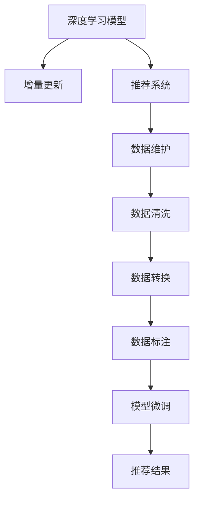

                 

# 大模型推荐场景中的数据增量更新与维护策略

## 1. 背景介绍

### 1.1 问题由来
随着推荐系统技术的不断发展，大规模深度学习模型的应用越来越广泛。例如，搜索引擎、电商网站、视频平台、社交媒体等都在采用深度学习模型，以提升个性化推荐效果。这些模型通常基于大规模的训练数据集进行预训练，并在用户行为数据上进行调整微调，以适应用户的个性化需求。然而，用户行为数据是动态变化的，推荐系统需要持续地接收新数据并更新模型以保持最新状态。这就涉及到模型的增量更新与维护问题。

### 1.2 问题核心关键点
对于大规模深度学习模型，增量更新与维护是一项复杂且关键的挑战。主要包括以下几个方面：

- **数据多样性**：推荐系统需要处理多种类型的数据，包括文本、图像、视频、位置等，这增加了数据处理和存储的难度。
- **数据分布变化**：用户行为数据随着时间的推移，其分布特性可能会发生变化，模型需要适应这些变化以保持准确性。
- **模型规模**：随着深度学习模型复杂度的增加，模型的参数量和计算成本也在不断增加，导致增量更新变得困难且耗时。
- **实时性要求**：用户行为数据通常是实时产生的，推荐系统需要能够快速响应用户请求，及时更新模型以提供最新推荐结果。

这些关键点使得在大规模推荐场景中，增量更新与维护变得尤为重要。

### 1.3 问题研究意义
对推荐模型进行增量更新与维护，不仅能够保持模型的最新状态，还能减少计算资源消耗，提升用户体验和推荐效果。具体意义如下：

1. **提高用户体验**：用户期望在每次请求时都能获得最新的个性化推荐，增量更新能够实时响应用户行为变化，提供最准确的推荐。
2. **减少计算成本**：传统的大规模重新训练方法会消耗大量计算资源和时间，而增量更新则可以在新数据到来时进行小规模的调整，降低计算成本。
3. **增强系统鲁棒性**：增量更新使得推荐系统能够更好地适应数据分布变化，提高系统的鲁棒性和泛化能力。
4. **支持动态扩展**：增量更新机制可以支持推荐系统的动态扩展，根据流量需求动态调整模型更新频率和规模。

总之，增量更新与维护是大规模推荐系统提升效果、降低成本、增强用户满意度的关键技术。

## 2. 核心概念与联系

### 2.1 核心概念概述

为了更好地理解增量更新与维护的原理和实践，我们需要首先梳理相关的核心概念：

- **深度学习模型**：使用神经网络结构对数据进行学习和预测的模型，如BERT、GPT等。
- **推荐系统**：根据用户的历史行为和兴趣，推荐符合用户偏好的物品的系统，包括电商、媒体等应用场景。
- **增量更新**：在不重新训练整个模型的前提下，根据新数据对模型进行小规模调整的过程。
- **数据维护**：包括数据清洗、数据转换、数据标注等，确保推荐系统的数据质量。

这些概念之间的逻辑关系可以通过以下Mermaid流程图来展示：



这个流程图展示了大模型推荐系统中的核心概念及其之间的关系：

1. 深度学习模型提供推荐的基础能力。
2. 增量更新在用户行为数据变化时进行模型调整，保持最新状态。
3. 数据维护确保数据质量和推荐系统的可靠性。

## 3. 核心算法原理 & 具体操作步骤
### 3.1 算法原理概述

基于深度学习的推荐系统，其增量更新与维护的算法原理主要基于模型参数的在线更新。即在新数据到来时，通过小批量地更新模型参数，使得模型能够持续适应用户行为的变化。

增量更新的关键在于选择合适的更新策略，以确保模型在每次更新后能够保持较好的性能。常用的更新策略包括：

- **在线梯度下降(Online Gradient Descent, OGD)**：在新数据到来时，利用一小批数据的梯度信息对模型参数进行更新。
- **小批量梯度下降(Mini-batch Gradient Descent)**：与OGD类似，但每次更新时使用更多数据，提升模型更新效率。
- **自适应学习率算法(Adaptive Learning Rate)**：如AdamW、Adafactor等，根据梯度大小自适应调整学习率，提升模型更新效果。
- **增量式参数更新(Incremental Parameter Update)**：如Gradient Descent with Momentum等，利用历史梯度信息加速模型更新。

这些策略通过在每次更新时采用不同的参数更新方式，能够有效应对推荐系统中的增量更新需求。

### 3.2 算法步骤详解

基于增量更新与维护的推荐系统，其基本步骤包括：

**Step 1: 准备模型与数据集**
- 选择合适的深度学习模型，如BERT、GPT等，作为推荐系统的基础。
- 收集推荐系统所需的数据集，包括用户行为数据、物品属性数据等。

**Step 2: 增量更新训练流程**
- 设计小批量梯度下降算法，如AdamW等。
- 对新数据进行采样，构成小批量数据集。
- 对小批量数据集进行前向传播和反向传播，计算梯度并更新模型参数。
- 迭代进行上述步骤，直到新数据集处理完毕。

**Step 3: 数据维护与模型评估**
- 对收集到的数据进行清洗、转换和标注，确保数据质量。
- 在验证集和测试集上评估模型的推荐效果，调整超参数和更新策略。
- 对模型进行在线优化，如动态学习率调整等，保持最佳状态。

**Step 4: 部署与监控**
- 将微调后的模型部署到实际推荐系统中，提供实时推荐服务。
- 实时监控模型的性能和用户反馈，根据监控结果调整更新策略。

### 3.3 算法优缺点

增量更新与维护的推荐系统具有以下优点：

1. **高效性**：增量更新可以在新数据到来时快速响应，减少重新训练整个模型的计算资源消耗。
2. **实时性**：模型能够实时更新，提供最新的推荐结果，提升用户体验。
3. **灵活性**：适用于各种推荐场景，可以根据数据分布和用户需求灵活调整更新策略。

同时，增量更新与维护也存在一些缺点：

1. **计算复杂性**：增量更新需要不断进行小批量更新，计算复杂度较高。
2. **模型更新风险**：每次更新模型时，可能由于数据分布变化导致性能下降。
3. **模型收敛速度**：增量更新可能导致模型收敛速度较慢，需要更长的更新周期。

### 3.4 算法应用领域

增量更新与维护技术在推荐系统中有着广泛的应用，以下是几个典型场景：

- **电商推荐**：电商平台根据用户浏览、购买行为进行实时推荐，需要在每次新订单生成时更新推荐模型。
- **新闻推荐**：新闻平台根据用户阅读、点赞行为推荐新闻文章，需要在每次用户交互时更新模型。
- **视频推荐**：视频平台根据用户观看行为推荐视频内容，需要在每次视频播放时更新模型。
- **音乐推荐**：音乐平台根据用户听歌行为推荐新歌，需要在每次播放记录更新时更新模型。

除了上述这些经典应用外，增量更新与维护技术也被应用到更多场景中，如社交媒体推荐、广告投放优化等，为推荐系统的智能化发展提供了新的思路。

## 4. 数学模型和公式 & 详细讲解 & 举例说明

### 4.1 数学模型构建

假设推荐系统中的用户行为数据为 $(x_i, y_i)$，其中 $x_i$ 为特征向量，$y_i$ 为推荐结果标签。设推荐模型为 $M_{\theta}$，其中 $\theta$ 为模型参数。模型的损失函数为交叉熵损失，表示为：

$$
\mathcal{L}(\theta) = -\frac{1}{N}\sum_{i=1}^N y_i \log M_{\theta}(x_i)
$$

### 4.2 公式推导过程

增量更新的关键在于利用小批量数据集进行模型参数的在线更新。假设每次使用大小为 $m$ 的小批量数据集，则更新步骤为：

1. 对每个小批量数据集 $D_t$ 进行前向传播和反向传播，计算梯度：
$$
g_t = \frac{1}{m}\sum_{(x,y)\in D_t} \nabla_{\theta} \mathcal{L}(x,y)
$$

2. 利用历史梯度信息进行增量更新：
$$
\theta_{t+1} = \theta_t - \eta g_t
$$

其中，$\eta$ 为学习率，可以根据梯度大小自适应调整。

### 4.3 案例分析与讲解

以电商推荐为例，假设电商平台收集了用户每次浏览、购买行为数据 $(x_i, y_i)$，其中 $x_i$ 为商品特征向量，$y_i$ 为是否购买的二元标签。使用小批量梯度下降算法，每次更新时使用 $m=1000$ 条数据，学习率为 $\eta=0.001$。假设模型为 BERT，每次更新时，对新到来的 $1000$ 条数据进行前向传播和反向传播，计算梯度，并将梯度累加到历史梯度中。接着利用历史梯度信息进行模型参数的更新。

## 5. 项目实践：代码实例和详细解释说明

### 5.1 开发环境搭建

为了实现增量更新与维护的推荐系统，首先需要搭建相关的开发环境。以下是使用PyTorch和Transformers库的Python开发环境配置流程：

1. 安装Anaconda：从官网下载并安装Anaconda，用于创建独立的Python环境。

2. 创建并激活虚拟环境：
```bash
conda create -n recommendation-env python=3.8 
conda activate recommendation-env
```

3. 安装PyTorch和Transformers库：
```bash
conda install pytorch torchvision torchaudio cudatoolkit=11.1 -c pytorch -c conda-forge
pip install transformers
```

4. 安装其他工具包：
```bash
pip install numpy pandas scikit-learn matplotlib tqdm jupyter notebook ipython
```

完成上述步骤后，即可在`recommendation-env`环境中开始推荐系统的开发实践。

### 5.2 源代码详细实现

下面以电商推荐系统为例，给出使用Transformers库进行增量更新的PyTorch代码实现。

首先，定义推荐系统所需的数据处理函数：

```python
from transformers import BertTokenizer
from torch.utils.data import Dataset
import torch

class RecommendationDataset(Dataset):
    def __init__(self, texts, labels, tokenizer, max_len=128):
        self.texts = texts
        self.labels = labels
        self.tokenizer = tokenizer
        self.max_len = max_len
        
    def __len__(self):
        return len(self.texts)
    
    def __getitem__(self, item):
        text = self.texts[item]
        label = self.labels[item]
        
        encoding = self.tokenizer(text, return_tensors='pt', max_length=self.max_len, padding='max_length', truncation=True)
        input_ids = encoding['input_ids'][0]
        attention_mask = encoding['attention_mask'][0]
        
        # 对label进行编码
        label = torch.tensor(label, dtype=torch.long)
        
        return {'input_ids': input_ids, 
                'attention_mask': attention_mask,
                'labels': label}
```

然后，定义模型和优化器：

```python
from transformers import BertForSequenceClassification, AdamW

model = BertForSequenceClassification.from_pretrained('bert-base-cased', num_labels=2)

optimizer = AdamW(model.parameters(), lr=2e-5)
```

接着，定义训练和评估函数：

```python
from torch.utils.data import DataLoader
from tqdm import tqdm

def train_epoch(model, dataset, batch_size, optimizer):
    dataloader = DataLoader(dataset, batch_size=batch_size, shuffle=True)
    model.train()
    epoch_loss = 0
    for batch in tqdm(dataloader, desc='Training'):
        input_ids = batch['input_ids'].to(device)
        attention_mask = batch['attention_mask'].to(device)
        labels = batch['labels'].to(device)
        model.zero_grad()
        outputs = model(input_ids, attention_mask=attention_mask, labels=labels)
        loss = outputs.loss
        epoch_loss += loss.item()
        loss.backward()
        optimizer.step()
    return epoch_loss / len(dataloader)

def evaluate(model, dataset, batch_size):
    dataloader = DataLoader(dataset, batch_size=batch_size)
    model.eval()
    preds, labels = [], []
    with torch.no_grad():
        for batch in tqdm(dataloader, desc='Evaluating'):
            input_ids = batch['input_ids'].to(device)
            attention_mask = batch['attention_mask'].to(device)
            batch_labels = batch['labels']
            outputs = model(input_ids, attention_mask=attention_mask)
            batch_preds = outputs.logits.argmax(dim=2).to('cpu').tolist()
            batch_labels = batch_labels.to('cpu').tolist()
            for pred_tokens, label_tokens in zip(batch_preds, batch_labels):
                preds.append(pred_tokens[:len(label_tokens)])
                labels.append(label_tokens)
                
    print(classification_report(labels, preds))
```

最后，启动训练流程并在测试集上评估：

```python
epochs = 5
batch_size = 16

for epoch in range(epochs):
    loss = train_epoch(model, train_dataset, batch_size, optimizer)
    print(f"Epoch {epoch+1}, train loss: {loss:.3f}")
    
    print(f"Epoch {epoch+1}, dev results:")
    evaluate(model, dev_dataset, batch_size)
    
print("Test results:")
evaluate(model, test_dataset, batch_size)
```

以上就是使用PyTorch和Transformers库进行增量更新的电商推荐系统的完整代码实现。可以看到，在PyTorch和Transformers库的帮助下，增量更新的过程变得简洁高效。

### 5.3 代码解读与分析

让我们再详细解读一下关键代码的实现细节：

**RecommendationDataset类**：
- `__init__`方法：初始化特征向量、标签、分词器等组件。
- `__len__`方法：返回数据集的样本数量。
- `__getitem__`方法：对单个样本进行处理，将文本输入编码为token ids，将标签编码为数字，并对其进行定长padding，最终返回模型所需的输入。

**模型和优化器**：
- 使用BertForSequenceClassification模型，并设定学习率为0.001。

**训练和评估函数**：
- 使用PyTorch的DataLoader对数据集进行批次化加载，供模型训练和推理使用。
- 训练函数`train_epoch`：对数据以批为单位进行迭代，在每个批次上前向传播计算损失函数并反向传播更新模型参数。
- 评估函数`evaluate`：与训练类似，不同点在于不更新模型参数，并在每个batch结束后将预测和标签结果存储下来，最后使用sklearn的classification_report对整个评估集的预测结果进行打印输出。

**训练流程**：
- 定义总的epoch数和batch size，开始循环迭代。
- 每个epoch内，先在训练集上训练，输出平均loss。
- 在验证集上评估，输出分类指标。
- 所有epoch结束后，在测试集上评估，给出最终测试结果。

可以看到，PyTorch和Transformers库使得增量更新的过程变得简单易懂，开发者可以将更多精力放在数据处理、模型改进等高层逻辑上，而不必过多关注底层的实现细节。

当然，工业级的系统实现还需考虑更多因素，如模型的保存和部署、超参数的自动搜索、更灵活的任务适配层等。但核心的增量更新范式基本与此类似。

## 6. 实际应用场景
### 6.1 智能推荐引擎

基于增量更新与维护的推荐系统已经在多个电商、视频、音乐等平台的智能推荐引擎中得到应用。例如，亚马逊的推荐系统就是通过实时接收用户行为数据，动态更新推荐模型，以适应用户的变化需求。

在技术实现上，可以收集用户浏览、点击、购买等行为数据，构建推荐系统所需的数据集，并对数据进行清洗、转换和标注。使用深度学习模型进行预训练，然后对新到来的用户行为数据进行增量更新，调整模型参数，以保持最佳推荐效果。

### 6.2 广告投放优化

广告投放平台也常常采用增量更新的方式优化广告投放策略，以提升广告的点击率和转化率。例如，Google的Google Ads广告投放系统就采用了增量更新策略，根据用户的点击行为实时调整广告投放策略。

在实践中，可以收集用户的点击数据，构建推荐系统所需的数据集，并对其进行增量更新。每次新数据到来时，对模型进行微调，优化广告投放策略，以获得更高的投资回报率。

### 6.3 内容推荐系统

内容推荐系统如Netflix、YouTube等，也常常采用增量更新与维护策略，以提升用户的内容体验。例如，Netflix会根据用户的观看记录进行实时推荐，每次新数据到来时，对推荐模型进行微调，以提供更符合用户兴趣的推荐内容。

在实现上，可以收集用户观看记录，构建推荐系统所需的数据集，并对其进行增量更新。每次新数据到来时，对模型进行微调，优化推荐策略，以获得更高的用户满意度和留存率。

### 6.4 未来应用展望

随着增量更新与维护技术的不断进步，未来将有更多应用场景引入该技术。以下是几个可能的方向：

1. **个性化医疗**：医疗平台根据用户的健康记录和行为数据，实时推荐健康建议和治疗方案，帮助用户更好地管理健康。

2. **智能家居**：智能家居系统根据用户的使用习惯和环境变化，实时推荐最优的家居设备使用方案，提升用户体验。

3. **智能交通**：交通系统根据用户的出行记录和实时路况，推荐最优的路线和交通工具，缓解交通拥堵问题。

4. **智能物流**：物流平台根据用户的订单历史和物流状态，实时推荐最优的配送方案和物流服务，提高配送效率。

5. **智能客服**：客服系统根据用户的对话记录和行为数据，实时推荐最优的客服方案和回答，提升客户满意度。

以上这些应用场景都需要实时收集和处理大量的用户数据，增量更新与维护技术能够帮助系统快速响应数据变化，提供最优质的服务。

## 7. 工具和资源推荐
### 7.1 学习资源推荐

为了帮助开发者系统掌握增量更新与维护的理论基础和实践技巧，这里推荐一些优质的学习资源：

1. 《深度学习与推荐系统》系列博文：深入浅出地介绍了推荐系统的基本概念和前沿算法，涵盖了增量更新、深度学习等重要主题。

2. 《推荐系统实战》书籍：详细讲解了推荐系统的原理和实现，包括增量更新、离线在线混合等技术细节。

3. 《推荐系统理论与算法》课程：由上海交通大学开设的NLP课程，系统介绍了推荐系统的理论基础和实际应用。

4. HuggingFace官方文档：推荐系统的优秀实践，提供了丰富的增量更新样例代码和详细文档。

5. Apache Spark MLlib：开源的机器学习库，提供了高效的增量更新算法和实现，适合大规模数据处理场景。

通过对这些资源的学习实践，相信你一定能够快速掌握增量更新与维护的精髓，并用于解决实际的推荐系统问题。

### 7.2 开发工具推荐

高效的开发离不开优秀的工具支持。以下是几款用于增量更新与维护开发的常用工具：

1. PyTorch：基于Python的开源深度学习框架，灵活动态的计算图，适合快速迭代研究。

2. TensorFlow：由Google主导开发的开源深度学习框架，生产部署方便，适合大规模工程应用。

3. Transformers库：HuggingFace开发的NLP工具库，集成了众多SOTA模型，支持PyTorch和TensorFlow，是进行增量更新任务开发的利器。

4. Weights & Biases：模型训练的实验跟踪工具，可以记录和可视化模型训练过程中的各项指标，方便对比和调优。

5. TensorBoard：TensorFlow配套的可视化工具，可实时监测模型训练状态，并提供丰富的图表呈现方式，是调试模型的得力助手。

6. Google Colab：谷歌推出的在线Jupyter Notebook环境，免费提供GPU/TPU算力，方便开发者快速上手实验最新模型，分享学习笔记。

合理利用这些工具，可以显著提升增量更新与维护任务的开发效率，加快创新迭代的步伐。

### 7.3 相关论文推荐

增量更新与维护技术的发展源于学界的持续研究。以下是几篇奠基性的相关论文，推荐阅读：

1. Online Learning for Recommendation Systems（ICML 2010）：提出在线梯度下降算法，为推荐系统的增量更新提供了理论基础。

2. Incremental Online Learning for Ranking（NIPS 2008）：提出增量式在线学习算法，解决大规模推荐系统中的计算瓶颈问题。

3. Incremental Online Learning in Deep Structured Models（NIPS 2011）：提出增量式在线学习算法，应用于深度神经网络模型中。

4. Continuous Learning and Online Learning in Recommendation Systems（JMLR 2019）：综述了增量更新与维护技术在推荐系统中的应用和进展。

这些论文代表了大规模推荐系统增量更新技术的发展脉络。通过学习这些前沿成果，可以帮助研究者把握学科前进方向，激发更多的创新灵感。

## 8. 总结：未来发展趋势与挑战

### 8.1 总结

本文对基于深度学习的推荐系统增量更新与维护方法进行了全面系统的介绍。首先阐述了增量更新与维护的重要性，明确了其在推荐系统中的独特价值。其次，从原理到实践，详细讲解了增量更新的数学原理和关键步骤，给出了推荐系统开发的完整代码实例。同时，本文还广泛探讨了增量更新方法在多个行业领域的应用前景，展示了其广阔的发展空间。此外，本文精选了增量更新技术的各类学习资源，力求为读者提供全方位的技术指引。

通过本文的系统梳理，可以看到，基于增量更新与维护的推荐系统在大规模推荐系统中具有重要的实际意义。其高效性、实时性和灵活性，使其成为推荐系统技术发展的重要推动力。未来，伴随推荐系统应用场景的不断扩展，增量更新与维护技术必将在更多领域发挥作用，为人工智能技术的应用创新提供新的动力。

### 8.2 未来发展趋势

展望未来，增量更新与维护技术将呈现以下几个发展趋势：

1. **高效计算**：增量更新需要处理大量的数据，高效的计算框架和算法将进一步提升系统的计算效率。

2. **实时化**：增量更新技术的实时性要求越来越高，未来的推荐系统将更加注重数据的实时处理和反馈机制。

3. **跨模态融合**：增量更新技术将逐步拓展到跨模态数据融合，如文本、图像、视频等多模态数据的协同推荐。

4. **联邦学习**：联邦学习技术将与增量更新结合，实现数据分布式处理和本地模型更新，提升系统安全性和隐私保护。

5. **自适应学习**：未来的增量更新将具备更高的自适应能力，能够根据用户行为的变化自适应调整模型参数。

6. **动态优化**：增量更新技术将与动态优化算法结合，实时调整模型超参数，保持最佳性能。

以上趋势凸显了增量更新与维护技术的广阔前景。这些方向的探索发展，将进一步提升推荐系统的智能化水平，为构建人机协同的智能系统提供新思路。

### 8.3 面临的挑战

尽管增量更新与维护技术已经取得了显著成果，但在向大规模推荐系统扩展的过程中，仍面临诸多挑战：

1. **数据稀疏性**：用户行为数据通常具有稀疏性，推荐系统需要处理大量缺失值，增量更新技术需要考虑如何有效利用稀疏数据。

2. **异构数据处理**：推荐系统中涉及多种类型的数据，如文本、图像、视频等，数据异构性对增量更新技术提出了更高要求。

3. **实时性要求**：推荐系统需要实时响应用户行为变化，增量更新技术需要在毫秒级别完成数据处理和模型更新。

4. **计算资源限制**：增量更新需要处理大量的数据，计算资源限制是一个重要挑战，需要高效优化算法和计算框架。

5. **模型鲁棒性**：推荐系统需要处理大量的数据，模型的鲁棒性问题尤为重要，增量更新技术需要考虑如何应对数据分布变化。

6. **隐私保护**：推荐系统需要保护用户隐私，增量更新技术需要考虑如何保护用户数据的安全和隐私。

这些挑战需要研究者不断创新，优化算法和系统架构，才能推动增量更新与维护技术在实际应用中的广泛应用。

### 8.4 研究展望

面对增量更新与维护技术所面临的种种挑战，未来的研究需要在以下几个方面寻求新的突破：

1. **多模态推荐**：将文本、图像、视频等多模态数据进行联合推荐，提升推荐系统的表现力。

2. **联邦学习**：将数据分布式处理和本地模型更新相结合，提升推荐系统的安全性和隐私保护。

3. **自适应推荐**：根据用户行为的变化自适应调整推荐策略，提升推荐系统的实时性和用户满意度。

4. **增量式模型压缩**：优化模型结构，减少计算资源消耗，提升推荐系统的效率。

5. **多目标优化**：将推荐系统的多目标优化问题分解为子问题，提升推荐系统的效果和性能。

6. **动态超参数调整**：实时调整推荐系统的超参数，提升推荐系统的稳定性和适应性。

这些研究方向的探索，将引领增量更新与维护技术迈向更高的台阶，为构建智能推荐系统提供新的思路和解决方案。

## 9. 附录：常见问题与解答

**Q1：增量更新与维护和传统重新训练方法有什么区别？**

A: 增量更新与维护不需要重新训练整个模型，而是利用新数据对模型参数进行小规模更新，从而保持模型最新状态。而传统重新训练方法需要重新训练整个模型，时间成本和计算资源消耗较大。

**Q2：增量更新过程中如何处理数据稀疏性？**

A: 数据稀疏性是推荐系统中的一个常见问题，增量更新需要考虑如何有效利用稀疏数据。一种常见的方法是对稀疏数据进行填充或补充，如使用均值填充或插值法。此外，也可以使用基于矩阵分解的推荐算法，如SVD等，处理稀疏数据。

**Q3：增量更新中的参数更新策略有哪些？**

A: 增量更新中的参数更新策略包括在线梯度下降、小批量梯度下降、自适应学习率算法、增量式参数更新等。每种策略都有其优缺点，需要根据具体场景进行选择。

**Q4：增量更新中的数据清洗和预处理需要注意哪些问题？**

A: 数据清洗和预处理是增量更新的重要环节，需要注意以下几点：
1. 数据去重：去除重复数据，防止模型训练时引入噪声。
2. 数据归一化：对数据进行归一化处理，防止梯度爆炸或消失。
3. 数据转换：将不同来源的数据进行格式转换，使其一致。
4. 数据标注：对数据进行标注，提供模型训练所需的标签信息。

这些步骤的合理处理，将有效提升增量更新的效果和模型的鲁棒性。

**Q5：增量更新中的模型压缩有哪些方法？**

A: 增量更新中的模型压缩方法包括参数剪枝、低秩分解、知识蒸馏等。这些方法能够有效减少模型的计算资源消耗，提升增量更新的效率。

通过对这些问题的深入理解，相信你一定能够更好地掌握增量更新与维护的原理和实践技巧，并在推荐系统开发中取得更好的效果。

