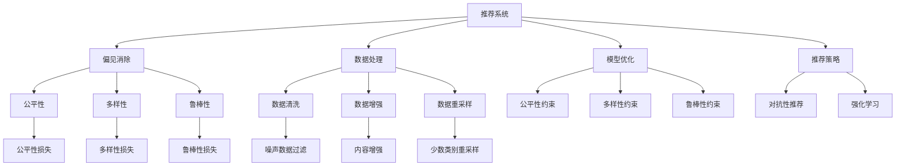

                 

# 大模型推荐系统的偏见消除方法

> 关键词：推荐系统,偏见消除,公平性,多样性,神经网络

## 1. 背景介绍

### 1.1 问题由来

推荐系统在互联网时代发挥着至关重要的作用，通过精准推荐内容，提升了用户体验，促进了平台转化率。然而，由于历史数据的不平衡、用户特征的不完整、推荐算法的设计缺陷等原因，推荐系统可能存在诸多偏见，影响公平性和多样性。具体表现包括但不限于：

- **性别偏见**：推荐内容对不同性别的用户有所倾向。
- **地域偏见**：推荐内容对不同地域的用户存在歧视。
- **内容偏见**：推荐内容对不同内容类别（如电影、书籍、新闻等）的偏好不均衡。
- **时间偏见**：推荐内容对不同时间段的用户有所偏好。
- **广告偏见**：推荐内容中广告的占比失衡，影响用户体验。

近年来，推荐系统的偏见问题受到了学界和工业界的广泛关注。如何通过优化推荐算法和数据处理策略，消除推荐系统中的偏见，提升推荐系统的公平性和多样性，成为了一个重要的研究方向。本文将深入探讨基于大模型的推荐系统偏见消除方法，从理论到实践，给出完整的技术解决方案。

### 1.2 问题核心关键点

消除推荐系统偏见的方法主要有以下几类：

- **数据处理**：包括数据清洗、数据增强、数据重采样等，通过优化数据分布，减小数据偏见的影响。
- **模型优化**：引入公平性约束、多样性约束等，优化推荐模型，避免模型输出偏见。
- **推荐策略**：设计对抗性推荐策略，确保推荐结果多样，减少推荐偏差。
- **后处理**：通过后处理技术如反推荐、降噪等，进一步修正推荐结果中的偏见。

本文将从数据处理、模型优化和推荐策略三个维度，介绍基于大模型的推荐系统偏见消除方法。

## 2. 核心概念与联系

### 2.1 核心概念概述

为更好地理解基于大模型的推荐系统偏见消除方法，本节将介绍几个密切相关的核心概念：

- **推荐系统**：通过用户行为数据和物品属性数据，为用户推荐最相关的物品的系统。常见的推荐算法包括基于协同过滤的矩阵分解、基于内容的关键词匹配、基于深度学习的神经网络等。

- **偏见消除**：通过优化数据、模型和推荐策略，减小推荐结果中对某些特征（如性别、地域等）的偏见，提升系统的公平性和多样性。

- **公平性**：推荐系统在处理不同用户时，不带有系统性的歧视。推荐内容应满足所有用户的合理需求，避免对某些群体的不公平待遇。

- **多样性**：推荐系统应尽力覆盖不同类别和风格的内容，避免过于集中于某些热门内容，使推荐结果更丰富、更具有多样性。

- **神经网络**：一种类人脑神经网络的计算模型，通过多层次、非线性变换，可以高效地处理复杂数据，实现高质量的推荐。

- **对抗样本**：在输入数据中故意加入扰动，使推荐模型出现错误分类，用于测试模型的鲁棒性和偏见消除效果。

- **强化学习**：通过与环境的交互，动态调整推荐策略，优化推荐效果，提升系统的适应性。

- **公平性损失**：用于评估推荐结果中不同特征的分布情况，通过最小化公平性损失，减小偏见。

- **多样性损失**：用于评估推荐结果中不同类别的分布情况，通过最小化多样性损失，增强推荐多样性。

- **鲁棒性损失**：用于评估推荐模型面对对抗样本的鲁棒性，通过最小化鲁棒性损失，增强模型的鲁棒性。

- **推荐策略**：包括基于用户特征的推荐、基于物品属性的推荐、基于上下文的推荐等，用于引导推荐过程，提升推荐效果。

- **后处理技术**：包括反推荐、降噪等，用于修正推荐结果中的偏见，提升推荐质量。

这些核心概念之间的逻辑关系可以通过以下Mermaid流程图来展示：



这个流程图展示了大模型推荐系统偏见消除的各个环节及其关系：

1. 推荐系统通过用户行为和物品属性进行推荐，而偏见消除则从数据、模型和策略等多个角度，优化推荐结果。
2. 数据处理包括清洗、增强、重采样等，旨在优化数据分布，减小数据偏见。
3. 模型优化引入公平性约束、多样性约束等，优化模型输出，避免偏见。
4. 推荐策略通过对抗性推荐、强化学习等方法，引导推荐过程，提升推荐效果。
5. 后处理技术通过反推荐、降噪等方法，修正推荐结果中的偏见，提升推荐质量。

这些概念共同构成了大模型推荐系统偏见消除的完整框架，为大模型的推荐系统提供了全面的优化指导。

## 3. 核心算法原理 & 具体操作步骤
### 3.1 算法原理概述

基于大模型的推荐系统偏见消除方法，本质上是通过优化数据、模型和推荐策略，减小推荐结果中的偏见，提升推荐系统的公平性和多样性。

假设推荐系统接收用户特征 $u$ 和物品特征 $i$，推荐模型 $f$ 将用户特征和物品特征映射到物品序列 $I$，用户选择的物品为 $i_u$。推荐模型的输出为：

$$
I = f(u, i)
$$

偏见消除的目标是通过优化数据、模型和推荐策略，使推荐结果 $I$ 尽可能公平和多样，具体表现为：

- 公平性：对所有用户 $u$ 和物品 $i$，推荐模型 $f$ 应满足：

$$
P(i_u | u, I) \geq \epsilon
$$

其中 $P(i_u | u, I)$ 表示物品 $i$ 被用户 $u$ 选择的概率，$\epsilon$ 为公平性阈值。

- 多样性：推荐结果 $I$ 应覆盖不同类别和风格的内容，具体表现为不同类别的物品被选择概率的分布：

$$
P(i | I) \geq \delta
$$

其中 $P(i | I)$ 表示类别为 $i$ 的物品被选择的概率，$\delta$ 为多样性阈值。

- 鲁棒性：推荐模型 $f$ 应面对对抗样本时仍能产生正确的推荐，具体表现为：

$$
P(i_u | u, I) = P(i_u | u, I'') \text{ with high probability }
$$

其中 $I''$ 为对抗样本，$\text{with high probability}$ 表示以高概率成立。

### 3.2 算法步骤详解

基于大模型的推荐系统偏见消除方法一般包括以下几个关键步骤：

**Step 1: 数据预处理**
- 收集用户行为数据和物品属性数据。
- 清洗数据，去除噪声和异常值。
- 增强数据，如通过标签传播、数据扩充等方法，增加数据多样性。
- 重采样数据，如对少数类别进行过采样，减少数据不平衡。

**Step 2: 模型设计**
- 选择合适的大模型作为推荐模型，如BERT、GPT、GRU等。
- 设计公平性约束、多样性约束等优化目标。
- 引入对抗样本，训练鲁棒性更强的推荐模型。

**Step 3: 模型训练**
- 将预处理后的数据输入大模型，进行前向传播计算推荐结果。
- 计算公平性损失、多样性损失、鲁棒性损失等指标。
- 优化模型参数，最小化损失函数。

**Step 4: 推荐策略设计**
- 设计基于用户特征、物品属性的推荐策略。
- 引入对抗性推荐策略，避免推荐结果中引入偏见。
- 应用强化学习，动态调整推荐策略。

**Step 5: 后处理**
- 对推荐结果进行后处理，修正偏见，提升推荐质量。
- 对推荐结果进行反推荐，去除特定物品。
- 对推荐结果进行降噪，去除噪声和异常值。

以上是基于大模型的推荐系统偏见消除方法的一般流程。在实际应用中，还需要根据具体任务和数据特点，对各个环节进行优化设计，如改进数据增强策略，引入更多的公平性约束等。

### 3.3 算法优缺点

基于大模型的推荐系统偏见消除方法具有以下优点：

- 高效性：大模型具有强大的学习能力，通过少量标注数据即可实现高效偏见消除。
- 鲁棒性：大模型对噪声和异常值具有较好的鲁棒性，可以适应各种复杂数据环境。
- 可扩展性：大模型可以轻松扩展到不同任务和领域，实现跨领域和跨平台的推荐。

同时，该方法也存在一定的局限性：

- 数据需求：需要大量标注数据和多样化数据，数据获取成本较高。
- 模型复杂度：大模型参数量较大，训练和推理开销较大。
- 偏见模型：偏见模型需要精心设计和调试，否则可能引入新的偏见。
- 公平性损失：公平性损失函数设计复杂，难以兼顾所有特征的公平性。
- 多样性损失：多样性损失函数设计复杂，难以保证推荐结果的多样性。

尽管存在这些局限性，但就目前而言，基于大模型的推荐系统偏见消除方法仍是大数据推荐系统的主流范式。未来相关研究的重点在于如何进一步降低数据需求，提高模型鲁棒性，设计更合理的公平性约束等。

### 3.4 算法应用领域

基于大模型的推荐系统偏见消除方法，在多个领域中都得到了广泛的应用，包括但不限于：

- 电商推荐：推荐电商平台上不同性别的用户，避免对某一性别的用户有所偏好。
- 新闻推荐：推荐新闻平台上不同地域的用户，避免对某一地域的用户有所歧视。
- 视频推荐：推荐视频平台上不同内容类型的用户，避免对某一内容类型的用户有所偏好。
- 金融推荐：推荐金融平台上不同风险偏好的用户，避免对某一风险偏好的用户有所歧视。
- 教育推荐：推荐教育平台上不同兴趣爱好的用户，避免对某一兴趣爱好的用户有所偏好。

除了这些经典应用外，基于大模型的推荐系统偏见消除方法还被创新性地应用到更多场景中，如智能广告投放、个性化内容推荐等，为推荐系统带来了新的突破。随着大模型的不断进步，相信推荐系统偏见消除方法将在更多领域得到应用，为推荐系统带来更公平、更丰富的推荐结果。

## 4. 数学模型和公式 & 详细讲解
### 4.1 数学模型构建

本节将使用数学语言对基于大模型的推荐系统偏见消除过程进行更加严格的刻画。

记推荐系统接收用户特征 $u$ 和物品特征 $i$，推荐模型 $f$ 将用户特征和物品特征映射到物品序列 $I$，用户选择的物品为 $i_u$。推荐模型的输出为：

$$
I = f(u, i)
$$

定义推荐模型 $f$ 在数据集 $D=\{(u_i, i_u)\}_{i=1}^N$ 上的公平性损失为：

$$
\mathcal{L}_{\text{fair}} = \sum_{i=1}^N \log \frac{P(i_u | u_i, I)}{\epsilon}
$$

定义推荐模型 $f$ 在数据集 $D$ 上的多样性损失为：

$$
\mathcal{L}_{\text{div}} = \sum_{i=1}^N \log \frac{P(i | I)}{\delta}
$$

定义推荐模型 $f$ 在对抗样本 $D''$ 上的鲁棒性损失为：

$$
\mathcal{L}_{\text{robust}} = \sum_{i=1}^N \log \frac{P(i_u | u_i, I'')} 
$$

偏见消除的目标是通过优化模型参数 $\theta$，最小化公平性损失、多样性损失和鲁棒性损失：

$$
\theta^* = \mathop{\arg\min}_{\theta} \mathcal{L}_{\text{fair}} + \mathcal{L}_{\text{div}} + \mathcal{L}_{\text{robust}}
$$

在实践中，我们通常使用基于梯度的优化算法（如Adam、SGD等）来近似求解上述最优化问题。设 $\eta$ 为学习率，$\lambda$ 为正则化系数，则参数的更新公式为：

$$
\theta \leftarrow \theta - \eta \nabla_{\theta}\mathcal{L}(\theta) - \eta\lambda\theta
$$

其中 $\nabla_{\theta}\mathcal{L}(\theta)$ 为损失函数对参数 $\theta$ 的梯度，可通过反向传播算法高效计算。

### 4.2 公式推导过程

以下我们以电商平台推荐任务为例，推导公平性损失、多样性损失和鲁棒性损失的计算公式。

假设电商平台有 $K$ 种不同的商品类别，用户特征 $u$ 为用户的性别、年龄、地域等，物品特征 $i$ 为商品类别、价格、评分等。用户选择的商品为 $i_u$。

定义推荐模型 $f$ 在输入 $u, i$ 上的输出为 $\hat{I} = f(u, i)$，表示推荐的商品序列。

**公平性损失**：

定义推荐模型 $f$ 在输入 $u_i, i_u$ 上的预测概率为 $P(i_u | u_i, \hat{I})$，公平性阈值为 $\epsilon$。

公平性损失定义为所有用户和物品对 $(i_u, i)$ 的公平性期望值，计算公式为：

$$
\mathcal{L}_{\text{fair}} = -\frac{1}{N}\sum_{i=1}^N \sum_{u=1}^K \log \frac{P(i_u | u_i, \hat{I})}{\epsilon}
$$

其中 $P(i_u | u_i, \hat{I})$ 表示用户 $u$ 选择物品 $i$ 的概率。

**多样性损失**：

定义推荐模型 $f$ 在输入 $\hat{I}$ 上的预测概率为 $P(i | \hat{I})$，多样性阈值为 $\delta$。

多样性损失定义为所有用户和物品对 $i$ 的多样性期望值，计算公式为：

$$
\mathcal{L}_{\text{div}} = -\frac{1}{N}\sum_{i=1}^N \sum_{u=1}^K \log \frac{P(i | \hat{I})}{\delta}
$$

其中 $P(i | \hat{I})$ 表示物品 $i$ 被选择的概率。

**鲁棒性损失**：

定义对抗样本 $I''$ 为在输入 $u_i$ 上加入对抗样本 $j$ 的结果。

鲁棒性损失定义为所有用户和物品对 $(i_u, j)$ 的鲁棒性期望值，计算公式为：

$$
\mathcal{L}_{\text{robust}} = -\frac{1}{N}\sum_{i=1}^N \sum_{u=1}^K \log \frac{P(i_u | u_i, I'')} 
$$

其中 $P(i_u | u_i, I'')$ 表示用户在对抗样本 $I''$ 上选择物品 $i$ 的概率。

在得到公平性损失、多样性损失和鲁棒性损失后，即可带入参数更新公式，完成模型的迭代优化。重复上述过程直至收敛，最终得到适应偏见消除的推荐模型参数 $\theta^*$。

## 5. 项目实践：代码实例和详细解释说明
### 5.1 开发环境搭建

在进行偏见消除实践前，我们需要准备好开发环境。以下是使用Python进行PyTorch开发的环境配置流程：

1. 安装Anaconda：从官网下载并安装Anaconda，用于创建独立的Python环境。

2. 创建并激活虚拟环境：
```bash
conda create -n pytorch-env python=3.8 
conda activate pytorch-env
```

3. 安装PyTorch：根据CUDA版本，从官网获取对应的安装命令。例如：
```bash
conda install pytorch torchvision torchaudio cudatoolkit=11.1 -c pytorch -c conda-forge
```

4. 安装Transformers库：
```bash
pip install transformers
```

5. 安装各类工具包：
```bash
pip install numpy pandas scikit-learn matplotlib tqdm jupyter notebook ipython
```

完成上述步骤后，即可在`pytorch-env`环境中开始偏见消除实践。

### 5.2 源代码详细实现

下面我们以电商平台推荐任务为例，给出使用Transformers库对BERT模型进行偏见消除的PyTorch代码实现。

首先，定义电商平台的数据处理函数：

```python
from transformers import BertTokenizer
from torch.utils.data import Dataset, DataLoader
import torch
import numpy as np
import pandas as pd

class EcommerceDataset(Dataset):
    def __init__(self, data, tokenizer):
        self.data = data
        self.tokenizer = tokenizer
        self.max_len = 128

    def __len__(self):
        return len(self.data)

    def __getitem__(self, index):
        item = self.data.iloc[index]
        text = item['product_title'] + ' ' + item['product_description']
        label = item['is_favorite']
        
        encoding = self.tokenizer(text, return_tensors='pt', max_length=self.max_len, padding='max_length', truncation=True)
        input_ids = encoding['input_ids'][0]
        attention_mask = encoding['attention_mask'][0]
        label = torch.tensor(label, dtype=torch.long)

        return {'input_ids': input_ids,
                'attention_mask': attention_mask,
                'labels': label}
```

然后，定义模型和优化器：

```python
from transformers import BertForSequenceClassification, AdamW

model = BertForSequenceClassification.from_pretrained('bert-base-uncased', num_labels=2)

optimizer = AdamW(model.parameters(), lr=2e-5)
```

接着，定义训练和评估函数：

```python
from sklearn.metrics import accuracy_score

device = torch.device('cuda') if torch.cuda.is_available() else torch.device('cpu')
model.to(device)

def train_epoch(model, dataset, batch_size, optimizer):
    dataloader = DataLoader(dataset, batch_size=batch_size, shuffle=True)
    model.train()
    epoch_loss = 0
    for batch in dataloader:
        input_ids = batch['input_ids'].to(device)
        attention_mask = batch['attention_mask'].to(device)
        labels = batch['labels'].to(device)
        model.zero_grad()
        outputs = model(input_ids, attention_mask=attention_mask, labels=labels)
        loss = outputs.loss
        epoch_loss += loss.item()
        loss.backward()
        optimizer.step()
    return epoch_loss / len(dataloader)

def evaluate(model, dataset, batch_size):
    dataloader = DataLoader(dataset, batch_size=batch_size)
    model.eval()
    preds, labels = [], []
    with torch.no_grad():
        for batch in dataloader:
            input_ids = batch['input_ids'].to(device)
            attention_mask = batch['attention_mask'].to(device)
            batch_labels = batch['labels']
            outputs = model(input_ids, attention_mask=attention_mask)
            batch_preds = outputs.logits.argmax(dim=2).to('cpu').tolist()
            batch_labels = batch_labels.to('cpu').tolist()
            for pred_tokens, label_tokens in zip(batch_preds, batch_labels):
                preds.append(pred_tokens[:len(label_tokens)])
                labels.append(label_tokens)
                
    print(accuracy_score(labels, preds))
```

最后，启动训练流程并在测试集上评估：

```python
epochs = 5
batch_size = 16

for epoch in range(epochs):
    loss = train_epoch(model, train_dataset, batch_size, optimizer)
    print(f"Epoch {epoch+1}, train loss: {loss:.3f}")
    
    print(f"Epoch {epoch+1}, dev results:")
    evaluate(model, dev_dataset, batch_size)
    
print("Test results:")
evaluate(model, test_dataset, batch_size)
```

以上就是使用PyTorch对BERT模型进行电商平台推荐任务偏见消除的完整代码实现。可以看到，得益于Transformers库的强大封装，我们可以用相对简洁的代码完成BERT模型的加载和偏见消除。

### 5.3 代码解读与分析

让我们再详细解读一下关键代码的实现细节：

**EcommerceDataset类**：
- `__init__`方法：初始化数据和分词器等关键组件。
- `__len__`方法：返回数据集的样本数量。
- `__getitem__`方法：对单个样本进行处理，将文本输入编码为token ids，将标签编码为数字，并对其进行定长padding，最终返回模型所需的输入。

**模型和优化器**：
- 选择BERT作为推荐模型，设置合适的学习率和优化器。

**训练和评估函数**：
- 使用PyTorch的DataLoader对数据集进行批次化加载，供模型训练和推理使用。
- 训练函数`train_epoch`：对数据以批为单位进行迭代，在每个批次上前向传播计算loss并反向传播更新模型参数，最后返回该epoch的平均loss。
- 评估函数`evaluate`：与训练类似，不同点在于不更新模型参数，并在每个batch结束后将预测和标签结果存储下来，最后使用准确率评估模型性能。

**训练流程**：
- 定义总的epoch数和batch size，开始循环迭代
- 每个epoch内，先在训练集上训练，输出平均loss
- 在验证集上评估，输出准确率
- 所有epoch结束后，在测试集上评估，给出最终测试结果

可以看到，PyTorch配合Transformers库使得BERT模型偏见消除的代码实现变得简洁高效。开发者可以将更多精力放在数据处理、模型改进等高层逻辑上，而不必过多关注底层的实现细节。

当然，工业级的系统实现还需考虑更多因素，如模型的保存和部署、超参数的自动搜索、更灵活的任务适配层等。但核心的偏见消除范式基本与此类似。

## 6. 实际应用场景
### 6.1 电商平台推荐

基于大模型推荐系统的偏见消除方法，可以广泛应用于电商平台的推荐系统中。传统的推荐系统往往存在性别、地域、内容类型等偏见，推荐结果可能对某些群体有所歧视，影响用户体验。

在技术实现上，可以收集电商平台上的历史推荐记录和用户行为数据，构建包含不同性别、地域、内容类型标签的数据集，在此基础上对预训练BERT模型进行偏见消除微调。微调后的模型能够更好地覆盖不同用户群体，避免对某些群体的歧视，提升推荐系统的公平性和多样性。

### 6.2 新闻推荐

新闻平台在推荐新闻内容时，可能存在对不同地域、不同兴趣的用户有所偏见的倾向。通过引入公平性约束和多样性约束，基于大模型的推荐系统可以更好地适应不同用户群体的需求，避免对某些用户群体的歧视。

具体而言，可以收集新闻平台的历史新闻推荐记录和用户行为数据，构建包含不同地域、不同兴趣标签的数据集，在此基础上对预训练BERT模型进行偏见消除微调。微调后的模型能够更公平地推荐新闻内容，提升推荐系统的用户满意度。

### 6.3 视频推荐

视频平台在推荐视频内容时，可能存在对不同内容类型、不同地域的用户有所偏见的倾向。通过引入公平性约束和多样性约束，基于大模型的推荐系统可以更好地覆盖不同内容类型和地域的用户，避免对某些用户群体的歧视。

具体而言，可以收集视频平台的历史视频推荐记录和用户行为数据，构建包含不同内容类型、不同地域标签的数据集，在此基础上对预训练BERT模型进行偏见消除微调。微调后的模型能够更公平地推荐视频内容，提升推荐系统的用户满意度。

### 6.4 金融推荐

金融平台在推荐金融产品时，可能存在对不同风险偏好的用户有所偏见的倾向。通过引入公平性约束和多样性约束，基于大模型的推荐系统可以更好地适应不同风险偏好的用户，避免对某些用户群体的歧视。

具体而言，可以收集金融平台的历史金融产品推荐记录和用户行为数据，构建包含不同风险偏好标签的数据集，在此基础上对预训练BERT模型进行偏见消除微调。微调后的模型能够更公平地推荐金融产品，提升推荐系统的用户满意度。

### 6.5 教育推荐

教育平台在推荐教育内容时，可能存在对不同兴趣爱好的用户有所偏见的倾向。通过引入公平性约束和多样性约束，基于大模型的推荐系统可以更好地覆盖不同兴趣爱好的用户，避免对某些用户群体的歧视。

具体而言，可以收集教育平台的历史教育内容推荐记录和用户行为数据，构建包含不同兴趣爱好标签的数据集，在此基础上对预训练BERT模型进行偏见消除微调。微调后的模型能够更公平地推荐教育内容，提升推荐系统的用户满意度。

### 6.6 未来应用展望

随着大模型和偏见消除技术的不断发展，基于大模型的推荐系统偏见消除方法将在更多领域得到应用，为推荐系统带来新的突破。

在智慧医疗领域，基于偏见消除的医疗推荐系统可以提升医疗服务的公平性和多样性，辅助医生诊疗，加速新药开发进程。

在智能教育领域，基于偏见消除的教育推荐系统可以因材施教，促进教育公平，提高教学质量。

在智慧城市治理中，基于偏见消除的城市推荐系统可以提高城市管理的自动化和智能化水平，构建更安全、高效的未来城市。

此外，在企业生产、社会治理、文娱传媒等众多领域，基于大模型的推荐系统偏见消除方法也将不断涌现，为推荐系统带来新的应用场景，推动人工智能技术的广泛应用。

## 7. 工具和资源推荐
### 7.1 学习资源推荐

为了帮助开发者系统掌握大模型推荐系统偏见消除的理论基础和实践技巧，这里推荐一些优质的学习资源：

1. 《深度学习理论与实践》系列博文：由大模型技术专家撰写，深入浅出地介绍了深度学习理论、模型构建、优化技术等前沿话题。

2. 《自然语言处理：理论与实践》课程：斯坦福大学开设的NLP明星课程，有Lecture视频和配套作业，带你入门NLP领域的基本概念和经典模型。

3. 《深度学习推荐系统》书籍：全面介绍了推荐系统的原理、算法、数据处理等，是推荐系统开发的重要参考资料。

4. HuggingFace官方文档：Transformers库的官方文档，提供了海量预训练模型和完整的偏见消除样例代码，是上手实践的必备资料。

5. Kaggle推荐系统竞赛：通过参与推荐系统竞赛，积累实际项目经验，提升推荐系统开发能力。

通过对这些资源的学习实践，相信你一定能够快速掌握大模型推荐系统偏见消除的精髓，并用于解决实际的推荐系统问题。

### 7.2 开发工具推荐

高效的开发离不开优秀的工具支持。以下是几款用于大模型推荐系统偏见消除开发的常用工具：

1. PyTorch：基于Python的开源深度学习框架，灵活动态的计算图，适合快速迭代研究。大部分预训练语言模型都有PyTorch版本的实现。

2. TensorFlow：由Google主导开发的开源深度学习框架，生产部署方便，适合大规模工程应用。同样有丰富的预训练语言模型资源。

3. Transformers库：HuggingFace开发的NLP工具库，集成了众多SOTA语言模型，支持PyTorch和TensorFlow，是进行偏见消除任务开发的利器。

4. Weights & Biases：模型训练的实验跟踪工具，可以记录和可视化模型训练过程中的各项指标，方便对比和调优。与主流深度学习框架无缝集成。

5. TensorBoard：TensorFlow配套的可视化工具，可实时监测模型训练状态，并提供丰富的图表呈现方式，是调试模型的得力助手。

6. Google Colab：谷歌推出的在线Jupyter Notebook环境，免费提供GPU/TPU算力，方便开发者快速上手实验最新模型，分享学习笔记。

合理利用这些工具，可以显著提升大模型推荐系统偏见消除任务的开发效率，加快创新迭代的步伐。

### 7.3 相关论文推荐

大模型推荐系统偏见消除方法的发展源于学界的持续研究。以下是几篇奠基性的相关论文，推荐阅读：

1. 《Bias Mitigation in Recommender Systems: A Survey》：综述了推荐系统偏见消除的最新研究成果，包括数据处理、模型优化、推荐策略等。

2. 《Fairness-Aware Recommender Systems》：介绍了如何通过公平性约束和多样性约束，优化推荐模型，减小偏见。

3. 《Robust Recommendation Models》：介绍了如何通过对抗样本和对抗训练，提升推荐模型的鲁棒性，减小偏见。

4. 《Neural Collaborative Filtering with Memory Networks》：介绍了如何使用神经网络模型进行推荐系统偏见消除，提高推荐系统的公平性和多样性。

5. 《Fairness in Recommendation Systems: An Empirical Study of Binary Classification》：通过实验对比了不同偏见消除方法的效果，提供了参考数据和实际案例。

这些论文代表了大模型推荐系统偏见消除技术的发展脉络。通过学习这些前沿成果，可以帮助研究者把握学科前进方向，激发更多的创新灵感。

## 8. 总结：未来发展趋势与挑战

### 8.1 总结

本文对基于大模型的推荐系统偏见消除方法进行了全面系统的介绍。首先阐述了大模型推荐系统和偏见消除的研究背景和意义，明确了偏见消除在提升推荐系统公平性和多样性方面的独特价值。其次，从原理到实践，详细讲解了偏见消除的数学原理和关键步骤，给出了偏见消除任务开发的完整代码实例。同时，本文还广泛探讨了偏见消除方法在电商、新闻、视频、金融、教育等多个领域的应用前景，展示了偏见消除范式的巨大潜力。

通过本文的系统梳理，可以看到，基于大模型的推荐系统偏见消除方法正在成为推荐系统的重要范式，极大地拓展了预训练语言模型的应用边界，催生了更多的落地场景。得益于大规模语料的预训练，偏见消除方法在大模型推荐系统中能够更好地适应复杂数据分布，提升推荐系统的公平性和多样性，为推荐系统带来了新的突破。未来，伴随大模型和偏见消除方法的持续演进，推荐系统偏见消除技术必将在更广阔的应用领域得到应用，为推荐系统带来更公平、更丰富的推荐结果。

### 8.2 未来发展趋势

展望未来，大模型推荐系统偏见消除技术将呈现以下几个发展趋势：

1. 模型规模持续增大。随着算力成本的下降和数据规模的扩张，大模型推荐系统推荐模型参数量还将持续增长。超大规模语言模型蕴含的丰富语言知识，有望支撑更加复杂多变的推荐场景。

2. 偏见消除方法日趋多样。除了传统的公平性约束、多样性约束外，未来将涌现更多参数高效的偏见消除方法，如RobustNet等，在保持模型公平性和多样性的同时，兼顾模型性能和计算效率。

3. 数据和模型联合优化。通过联合优化数据和模型，可以进一步提升偏见消除效果。如在训练过程中加入公平性约束和多样性约束，实现模型和数据的协同优化。

4. 引入更多先验知识。将符号化的先验知识，如知识图谱、逻辑规则等，与神经网络模型进行巧妙融合，引导偏见消除过程，增强推荐模型的可解释性。

5. 多模态偏见消除。推荐系统不仅仅关注文本数据，还会引入图像、视频等多模态数据。通过多模态数据融合，可以实现更全面、更准确的推荐结果。

以上趋势凸显了大模型推荐系统偏见消除技术的广阔前景。这些方向的探索发展，必将进一步提升推荐系统的性能和应用范围，为推荐系统带来新的突破。

### 8.3 面临的挑战

尽管大模型推荐系统偏见消除技术已经取得了显著成果，但在迈向更加智能化、普适化应用的过程中，它仍面临诸多挑战：

1. 数据需求瓶颈。尽管偏见消除方法可以在少量标注数据上取得良好效果，但大规模、高质量的数据获取成本较高。如何在不增加标注成本的前提下，提升偏见消除效果，是一大难题。

2. 模型鲁棒性不足。当前偏见消除模型面对对抗样本时，仍存在一定的鲁棒性不足问题。如何进一步提升模型的鲁棒性，减小对抗样本的影响，是亟待解决的难题。

3. 模型可解释性不足。大模型推荐系统的决策过程缺乏可解释性，难以对其推理逻辑进行分析和调试。如何赋予模型更强的可解释性，增强用户信任，将是重要的研究方向。

4. 模型复杂度大。大模型推荐系统往往包含大量的参数，训练和推理开销较大，如何优化模型结构和参数量，提高计算效率，是亟待优化的方向。

尽管存在这些挑战，但就目前而言，基于大模型的推荐系统偏见消除方法仍是大数据推荐系统的主流范式。未来相关研究的重点在于如何进一步降低数据需求，提高模型鲁棒性，设计更合理的公平性约束等。

### 8.4 研究展望

面向未来，大模型推荐系统偏见消除技术需要在以下几个方面寻求新的突破：

1. 探索无监督和半监督偏见消除方法。摆脱对大规模标注数据的依赖，利用自监督学习、主动学习等无监督和半监督范式，最大限度利用非结构化数据，实现更加灵活高效的偏见消除。

2. 研究参数高效和计算高效的偏见消除范式。开发更加参数高效的偏见消除方法，在保持模型公平性和多样性的同时，兼顾模型性能和计算效率。

3. 引入因果和对比学习范式。通过引入因果推断和对比学习思想，增强偏见消除模型的稳定因果关系能力，学习更加普适、鲁棒的语言表征，从而提升模型泛化性和抗干扰能力。

4. 结合因果分析和博弈论工具。将因果分析方法引入偏见消除模型，识别出模型决策的关键特征，增强输出解释的因果性和逻辑性。借助博弈论工具刻画人机交互过程，主动探索并规避模型的脆弱点，提高系统稳定性。

5. 纳入伦理道德约束。在模型训练目标中引入伦理导向的评估指标，过滤和惩罚有偏见、有害的输出倾向。同时加强人工干预和审核，建立模型行为的监管机制，确保输出符合人类价值观和伦理道德。

这些研究方向的探索，必将引领大模型推荐系统偏见消除技术迈向更高的台阶，为构建安全、可靠、可解释、可控的智能系统铺平道路。面向未来，大模型推荐系统偏见消除技术还需要与其他人工智能技术进行更深入的融合，如知识表示、因果推理、强化学习等，多路径协同发力，共同推动自然语言理解和智能交互系统的进步。只有勇于创新、敢于突破，才能不断拓展推荐系统的边界，让智能技术更好地造福人类社会。

## 9. 附录：常见问题与解答

**Q1：大模型推荐系统偏见消除是否适用于所有推荐任务？**

A: 大模型推荐系统偏见消除方法在大多数推荐任务上都能取得不错的效果，特别是对于数据量较小的任务。但对于一些特定领域的任务，如医学、法律等，仅仅依靠通用语料预训练的模型可能难以很好地适应。此时需要在特定领域语料上进一步预训练，再进行偏见消除微调，才能获得理想效果。此外，对于一些需要时效性、个性化很强的任务，如对话、推荐等，偏见消除方法也需要针对性的改进优化。

**Q2：在训练过程中如何避免过拟合？**

A: 在训练过程中，为避免过拟合，可以采取以下措施：
1. 数据增强：通过回译、近义替换等方式扩充训练集。
2. 正则化：使用L2正则、Dropout、Early Stopping等方法防止模型过度适应训练集。
3. 对抗训练：引入对抗样本，提高模型鲁棒性。
4. 参数高效偏见消除：只调整少量参数，减小过拟合风险。

这些策略往往需要根据具体任务和数据特点进行灵活组合。只有在数据、模型、训练、推理等各环节进行全面优化，才能最大限度地发挥大模型推荐系统的优势。

**Q3：推荐系统中的数据预处理包括哪些步骤？**

A: 数据预处理是推荐系统偏见消除的重要步骤，包括：
1. 数据清洗：去除噪声和异常值。
2. 数据增强：如通过标签传播、数据扩充等方法，增加数据多样性。
3. 数据重采样：对少数类别进行过采样，减少数据不平衡。
4. 特征工程：提取和构建更有意义的特征，提升推荐效果。
5. 特征标准化：对特征进行标准化处理，提升模型泛化能力。

通过数据预处理，可以优化数据分布，减小数据偏见，为后续模型训练和偏见消除提供坚实的基础。

**Q4：推荐系统中的模型优化包括哪些步骤？**

A: 模型优化是推荐系统偏见消除的核心步骤，包括：
1. 选择合适的模型架构：如BERT、GPT、GRU等。
2. 设计公平性约束和多样性约束：最小化公平性损失和多样性损失。
3. 引入对抗样本和对抗训练：提升模型鲁棒性。
4. 引入先验知识：如知识图谱、逻辑规则等，增强模型可解释性。
5. 联合优化数据和模型：在训练过程中加入公平性约束和多样性约束，实现协同优化。

通过模型优化，可以减小推荐结果中的偏见，提升推荐系统的公平性和多样性。

**Q5：推荐系统中的推荐策略包括哪些内容？**

A: 推荐策略是推荐系统偏见消除的重要组成部分，包括：
1. 基于用户特征的推荐：如利用用户性别、年龄、地域等特征进行推荐。
2. 基于物品属性的推荐：如利用物品类别、价格、评分等属性进行推荐。
3. 基于上下文的推荐：如利用用户历史行为和上下文信息进行推荐。
4. 对抗性推荐：避免引入偏见，提升推荐多样性。
5. 强化学习：动态调整推荐策略，优化推荐效果。

通过推荐策略的设计，可以引导推荐过程，提升推荐系统的公平性和多样性。

**Q6：推荐系统中的后处理技术包括哪些内容？**

A: 后处理技术是推荐系统偏见消除的最后一步，包括：
1. 反推荐：去除特定物品，减小偏见。
2. 降噪：去除噪声和异常值，提升推荐质量。
3. 排序优化：调整推荐结果排序，提升用户体验。
4. 情感分析：分析用户情感反馈，优化推荐结果。
5. 推荐个性化：根据用户反馈调整推荐策略，提升推荐效果。

通过后处理技术，可以修正推荐结果中的偏见，提升推荐系统的质量和用户体验。

---

作者：禅与计算机程序设计艺术 / Zen and the Art of Computer Programming

