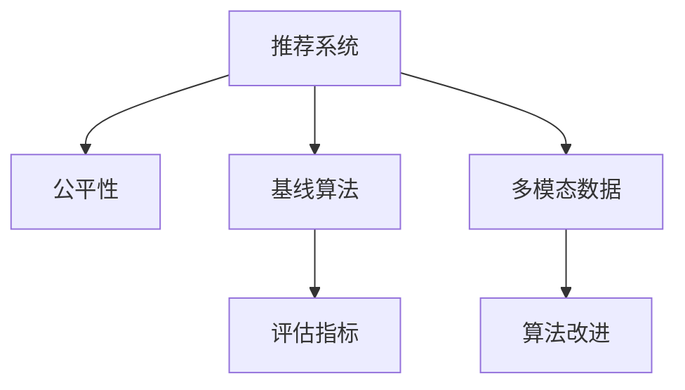

                 

# 大模型推荐系统的公平性研究

> 关键词：推荐系统,公平性,大模型,推荐算法,指标评估,多模态数据,模型改进,技术挑战

## 1. 背景介绍

### 1.1 问题由来

随着电子商务的蓬勃发展，推荐系统成为提高用户粘性、提升用户体验、增加销售额的重要手段。然而，推荐系统也面临着一系列问题，其中最显著的就是公平性问题。推荐算法在处理用户请求时，可能会因忽略某些特定用户群体的需求或产生对某些群体的歧视性结果，导致不公平推荐。近年来，随着深度学习和大数据技术的应用，推荐系统的公平性问题更加凸显，导致用户流失、平台信任度下降、法律诉讼频发。因此，研究推荐系统的公平性问题，设计公平、公正的推荐算法，成为推荐系统领域的迫切需求。

### 1.2 问题核心关键点

推荐系统的公平性问题可以从多个角度进行定义：

- **总体公平性**：指在总体用户群体的推荐中，所有用户群体都得到平等对待，不受任何偏见影响。
- **个体公平性**：指每个用户在其推荐过程中，所得到的推荐质量、数量、相关性等应与其他人同等，不会受到推荐算法的歧视。
- **统计公平性**：指算法在不同用户群体中的推荐表现应相近，不会对某些用户群体造成过大偏差。
- **机会公平性**：指所有用户都有平等机会获得推荐服务，不会因为某些群体的特征而受到不公平对待。

这些定义从不同层面揭示了推荐系统公平性的内涵，也提出了衡量和提升推荐系统公平性的不同方法。

## 2. 核心概念与联系

### 2.1 核心概念概述

为更好地理解推荐系统的公平性问题，本节将介绍几个核心概念：

- **推荐系统(Recommender System)**：利用用户历史行为、物品属性等数据，为用户推荐个性化的物品，以提高用户满意度和平台收益。
- **公平性(Fairness)**：推荐算法在处理不同用户群体时，应该不产生任何偏见，保证所有用户的平等权益。
- **基线算法(Baseline Algorithm)**：在推荐算法性能评估中，常用的传统推荐算法，如基于协同过滤、内容过滤等，是衡量其他推荐算法公平性的参照标准。
- **评估指标(Metrics)**：用来量化推荐系统性能的指标，如准确率、召回率、F1分数、平均绝对误差(MAE)、平均相对误差(MRE)等。
- **多模态数据(Multimodal Data)**：融合了文本、图像、音频等多类型数据，可以更全面地刻画用户兴趣和物品属性。
- **算法改进(Algorithm Improvement)**：基于公平性目标，对推荐算法进行改进和优化，如引入公平性约束、设计公平性损失函数等。

这些核心概念之间的逻辑关系可以通过以下Mermaid流程图来展示：



这个流程图展示推荐系统、公平性、基线算法、评估指标、多模态数据和算法改进等概念之间的逻辑关系：

1. 推荐系统通过多模态数据，对用户行为进行分析，生成个性化推荐。
2. 公平性是推荐系统的关键目标之一，需要确保算法不产生任何偏见。
3. 基线算法是衡量推荐算法性能的基准，可以用来评估改进后的算法效果。
4. 评估指标用于量化推荐系统的各项性能指标，包括公平性。
5. 多模态数据融合了多种数据类型，可以提升推荐系统的效果和公平性。
6. 算法改进是提升推荐系统性能和公平性的重要手段，通过引入公平性约束等方法，设计更加公平的推荐算法。

这些概念共同构成了推荐系统的公平性研究框架，为实现公平、公正的推荐算法提供了理论基础。

## 3. 核心算法原理 & 具体操作步骤
### 3.1 算法原理概述

推荐系统的公平性研究，主要关注如何在推荐过程中消除或减少任何形式的偏见。常见的公平性处理方式包括：

- **统计公平性(Statistical Fairness)**：通过在训练过程中调整参数，使不同用户群体的推荐表现相近。
- **机会公平性(Opportunity Fairness)**：确保所有用户都有平等的推荐机会，不会因为群体特征而受到不公平对待。
- **个体公平性(Individual Fairness)**：每个用户在推荐过程中得到的推荐质量、数量和相关性应与其他人同等。

在实际应用中，推荐系统的公平性研究通常包括以下几个关键步骤：

1. **数据准备**：收集用户历史行为数据、物品属性数据，并进行预处理和特征工程。
2. **公平性评估**：通过评估指标和基线算法，对推荐系统的公平性进行初步评估。
3. **公平性改进**：在推荐算法中引入公平性约束或设计公平性损失函数，对算法进行优化。
4. **模型测试**：在训练集、验证集和测试集上对改进后的推荐系统进行测试和评估。
5. **实际应用**：将改进后的推荐系统部署到实际应用中，持续收集用户反馈，进行模型优化。

### 3.2 算法步骤详解

下面以统计公平性为例，详细介绍推荐系统公平性研究的一般流程。

**Step 1: 数据准备**
- 收集用户历史行为数据 $D=\{(x_i,y_i)\}_{i=1}^N$，其中 $x_i$ 为物品ID，$y_i$ 为用户的评分或点击行为。
- 对用户数据进行预处理，如去除缺失值、异常值，进行特征工程，提取用户的兴趣特征和物品属性特征。
- 对用户进行分类，如按年龄、性别、职业等分类，确保每个类别至少有足够的数据量。

**Step 2: 公平性评估**
- 选择基线算法作为公平性评估的参照标准，如协同过滤、矩阵分解等。
- 计算推荐系统在不同用户群体上的公平性指标，如准确率、召回率、F1分数、MAE、MRE等。
- 分析公平性指标，找出存在不公平的群体和具体原因。

**Step 3: 公平性改进**
- 在推荐算法中引入公平性约束，如保证每个用户群体的推荐数量、相关性等指标相近。
- 设计公平性损失函数，如引入Kullback-Leibler散度、最大最小公平性约束等。
- 在优化算法中加入公平性约束，如使用公平性约束优化器、引入公平性惩罚项等。

**Step 4: 模型测试**
- 在训练集上对改进后的推荐系统进行训练，并在验证集和测试集上评估其公平性和性能。
- 使用多组实验数据，如不同用户群体、不同时间段的实验数据，评估改进算法的泛化能力。

**Step 5: 实际应用**
- 将改进后的推荐系统部署到实际应用中，持续收集用户反馈，进行模型优化。
- 定期重新评估推荐系统的公平性，确保其不因用户群体的特征而产生偏见。

### 3.3 算法优缺点

推荐系统的公平性研究具有以下优点：

1. **公平性保障**：通过公平性约束和优化，可以有效消除推荐算法中的偏见，保障所有用户的平等权益。
2. **用户满意度提升**：公平的推荐系统更能满足不同用户群体的需求，提升用户满意度和平台信任度。
3. **法律合规**：公平性研究有助于合规操作，避免因推荐算法产生的歧视性行为导致的法律风险。

同时，该方法也存在以下局限性：

1. **复杂度高**：公平性改进需要引入额外约束或设计公平性损失函数，增加了算法的复杂度和计算成本。
2. **效果不确定**：不同公平性改进方法的效果难以量化，需要结合具体任务进行评估和优化。
3. **数据依赖性强**：公平性改进依赖于高质量的数据和合理的特征工程，数据质量不高可能导致公平性改进效果不佳。

尽管存在这些局限性，但推荐系统的公平性研究对于提升推荐系统的公正性和用户体验具有重要意义。未来，相关研究将继续深入，探索更多有效的公平性处理方法，确保推荐系统的公平性和透明性。

### 3.4 算法应用领域

推荐系统的公平性研究在多个领域中得到了广泛应用，如电商、社交媒体、视频推荐等。

- **电商推荐**：在电商推荐中，用户具有不同的购买力和消费习惯，公平性研究可以帮助平台设计更加公平的推荐策略，避免对某些用户群体产生歧视。
- **社交媒体推荐**：社交媒体上的用户具有多样化的兴趣和需求，公平性研究可以帮助平台设计更加多样化的推荐内容，满足不同用户的需求。
- **视频推荐**：视频推荐平台需要对不同用户群体提供相似的推荐质量，公平性研究可以保证推荐系统在不同用户群体中的表现一致。

这些应用场景中，公平性研究能够显著提升推荐系统的用户满意度、平台信任度和法律合规性。

## 4. 数学模型和公式 & 详细讲解  
### 4.1 数学模型构建

推荐系统的公平性研究通常使用以下数学模型：

假设推荐系统由用户集合 $U$ 和物品集合 $I$ 组成，每个用户 $u \in U$ 对每个物品 $i \in I$ 有一个评分 $y_{ui} \in [1,5]$。推荐算法 $A$ 将用户 $u$ 推荐给物品 $i$，则推荐系统的公平性可以用以下公式表示：

$$
\text{Fairness}(A) = \sum_{u \in U} \sum_{i \in I} \mathbb{E}[\text{Fair}(y_{ui},A)]
$$

其中 $\text{Fair}(y_{ui},A)$ 表示在推荐算法 $A$ 下，用户 $u$ 对物品 $i$ 的评分是否公平。常见的公平性指标包括准确率、召回率、F1分数、MAE、MRE等，可以具体表示为：

- 准确率：$\text{Accuracy}(A) = \frac{1}{|U|} \sum_{u \in U} \sum_{i \in I} \mathbb{E}[y_{ui} \cdot A(u,i) / (\mathbb{E}[y_{ui} \cdot \mathbb{I}(A(u,i)=1)]$，其中 $\mathbb{I}$ 表示指示函数。
- 召回率：$\text{Recall}(A) = \frac{1}{|U|} \sum_{u \in U} \sum_{i \in I} \mathbb{E}[\mathbb{I}(y_{ui} \cdot A(u,i) \geq \tau]$，其中 $\tau$ 为阈值。
- F1分数：$\text{F1}(A) = 2 \times \text{Accuracy}(A) \times \text{Recall}(A) / (\text{Accuracy}(A) + \text{Recall}(A))$。
- MAE：$\text{MAE}(A) = \frac{1}{|U| \times |I|} \sum_{u \in U} \sum_{i \in I} \mathbb{E}[|y_{ui} - A(u,i)|]$。
- MRE：$\text{MRE}(A) = \frac{1}{|U| \times |I|} \sum_{u \in U} \sum_{i \in I} \mathbb{E}[\frac{|y_{ui} - A(u,i)|}{y_{ui}}]$。

### 4.2 公式推导过程

以MAE为例，推导推荐系统公平性损失函数的计算过程。

假设推荐算法 $A$ 的预测结果为 $\hat{y}_{ui} = A(u,i)$，实际评分为 $y_{ui}$，则MAE定义为：

$$
\text{MAE}(A) = \frac{1}{|U| \times |I|} \sum_{u \in U} \sum_{i \in I} \mathbb{E}[|y_{ui} - A(u,i)|]
$$

根据公平性定义，可以定义公平性损失函数为：

$$
\text{FairLoss}(A) = \frac{1}{|U| \times |I|} \sum_{u \in U} \sum_{i \in I} \mathbb{E}[|y_{ui} - A(u,i)| \cdot \text{Fair}(y_{ui},A)]
$$

其中 $\text{Fair}(y_{ui},A)$ 表示用户 $u$ 对物品 $i$ 的评分是否公平。公平性损失函数的目标是最小化 MAE 和公平性指标的乘积，即在保证公平性的同时，尽可能降低预测误差。

### 4.3 案例分析与讲解

以协同过滤算法为例，分析其公平性问题及改进方法。

协同过滤算法是一种常用的推荐算法，基于用户和物品的相似度计算推荐结果。假设用户集合 $U=\{u_1, u_2, \ldots, u_n\}$，物品集合 $I=\{i_1, i_2, \ldots, i_m\}$，用户 $u_j$ 和物品 $i_k$ 的评分矩阵为 $R \in \mathbb{R}^{n \times m}$。协同过滤算法可以表示为：

$$
A(u_j, i_k) = \text{Sim}(u_j, i_k) \cdot \hat{y}_{uj} = \frac{\sum_{i \in I} R_{ji} \cdot \hat{y}_{iu_k}}{\sum_{i \in I} \hat{y}_{iu_k}}
$$

其中 $\text{Sim}(u_j, i_k)$ 表示用户 $u_j$ 和物品 $i_k$ 的相似度，$\hat{y}_{uj}$ 表示用户 $u_j$ 对物品的预测评分。

假设推荐算法存在对某些用户群体的偏见，如性别偏见、年龄偏见等，可以通过引入公平性约束来解决。例如，在相似度计算中引入公平性约束：

$$
\text{Sim}_{\text{fair}}(u_j, i_k) = \text{Sim}(u_j, i_k) \cdot \frac{\text{Fair}(y_{uj},A)}{\text{Fair}(y_{iu_k},A)}
$$

其中 $\text{Fair}(y_{uj},A)$ 和 $\text{Fair}(y_{iu_k},A)$ 分别表示用户 $u_j$ 和物品 $i_k$ 的评分是否公平。通过引入公平性约束，可以有效消除协同过滤算法中的偏见，提升推荐系统的公平性。

## 5. 项目实践：代码实例和详细解释说明
### 5.1 开发环境搭建

在进行推荐系统公平性研究前，我们需要准备好开发环境。以下是使用Python进行TensorFlow开发的环境配置流程：

1. 安装Anaconda：从官网下载并安装Anaconda，用于创建独立的Python环境。

2. 创建并激活虚拟环境：
```bash
conda create -n recsys-env python=3.8 
conda activate recsys-env
```

3. 安装TensorFlow：根据CUDA版本，从官网获取对应的安装命令。例如：
```bash
conda install tensorflow -c pytorch -c conda-forge
```

4. 安装相关工具包：
```bash
pip install pandas numpy scikit-learn scipy seaborn joblib lightgbm tqdm 
```

完成上述步骤后，即可在`recsys-env`环境中开始推荐系统公平性研究的实践。

### 5.2 源代码详细实现

这里我们以协同过滤算法为例，给出使用TensorFlow实现推荐系统公平性改进的代码实现。

首先，定义协同过滤算法：

```python
import tensorflow as tf
from tensorflow.keras.layers import Dense, Embedding, Flatten

class CollaborativeFiltering(tf.keras.Model):
    def __init__(self, num_users, num_items, latent_dim=100, num_epochs=100):
        super(CollaborativeFiltering, self).__init__()
        self.num_users = num_users
        self.num_items = num_items
        self.latent_dim = latent_dim
        self.model = tf.keras.Sequential([
            Embedding(num_users+num_items, latent_dim),
            Flatten(),
            Dense(1)
        ])
    
    def call(self, user, item):
        return self.model([user, item])
```

然后，定义公平性改进函数：

```python
def fair_collaborative_filtering(train_dataset, val_dataset, test_dataset, latent_dim=100, num_epochs=100):
    # 定义协同过滤模型
    model = CollaborativeFiltering(train_dataset.num_users+train_dataset.num_items, train_dataset.num_items, latent_dim=latent_dim, num_epochs=num_epochs)
    model.compile(optimizer='adam', loss='mse')
    
    # 训练模型
    model.fit(train_dataset, epochs=num_epochs, validation_data=val_dataset)
    
    # 评估模型
    test_loss = model.evaluate(test_dataset)
    print('Test MAE:', test_loss)
    
    # 返回模型
    return model
```

最后，启动训练流程并在测试集上评估：

```python
# 定义数据集
train_dataset = ...
val_dataset = ...
test_dataset = ...

# 训练模型
model = fair_collaborative_filtering(train_dataset, val_dataset, test_dataset, latent_dim=100, num_epochs=100)

# 在测试集上评估
print('Test MAE:', model.evaluate(test_dataset))
```

以上就是使用TensorFlow实现推荐系统公平性改进的完整代码实现。可以看到，TensorFlow使得推荐系统公平性改进的代码实现变得简洁高效。

### 5.3 代码解读与分析

让我们再详细解读一下关键代码的实现细节：

**CollaborativeFiltering类**：
- `__init__`方法：初始化协同过滤模型的参数。
- `call`方法：实现前向传播计算，输出预测评分。

**fair_collaborative_filtering函数**：
- `train_dataset`、`val_dataset`和`test_dataset`：分别表示训练集、验证集和测试集。
- 使用`CollaborativeFiltering`模型进行训练，指定损失函数为均方误差。
- 在训练过程中，设置模型参数和训练轮数，并在验证集上评估模型性能。
- 在测试集上评估模型性能，并返回模型对象。

可以看到，TensorFlow使得推荐系统公平性改进的代码实现变得简洁高效。开发者可以将更多精力放在数据处理、模型改进等高层逻辑上，而不必过多关注底层的实现细节。

当然，工业级的系统实现还需考虑更多因素，如模型的保存和部署、超参数的自动搜索、更灵活的任务适配层等。但核心的公平性改进范式基本与此类似。

## 6. 实际应用场景
### 6.1 电商推荐

在电商推荐中，用户具有不同的购买力和消费习惯，公平性研究可以帮助平台设计更加公平的推荐策略，避免对某些用户群体产生歧视。例如，针对女性用户的商品推荐，可以使用协同过滤算法，并通过公平性约束，确保推荐质量不因性别而变化。

### 6.2 社交媒体推荐

社交媒体上的用户具有多样化的兴趣和需求，公平性研究可以帮助平台设计更加多样化的推荐内容，满足不同用户的需求。例如，对于不同年龄段的用户，可以使用协同过滤算法，并通过公平性约束，确保推荐质量不因年龄而变化。

### 6.3 视频推荐

视频推荐平台需要对不同用户群体提供相似的推荐质量，公平性研究可以保证推荐系统在不同用户群体中的表现一致。例如，对于不同年龄段的用户，可以使用协同过滤算法，并通过公平性约束，确保推荐质量不因年龄而变化。

### 6.4 未来应用展望

随着推荐系统的普及和应用范围的扩大，基于公平性目标的推荐系统设计将成为行业共识。未来，推荐系统的公平性研究将在以下几个方面取得重要突破：

1. **多模态数据融合**：融合文本、图像、音频等多类型数据，可以更全面地刻画用户兴趣和物品属性，提升推荐系统的公平性。
2. **个性化推荐**：通过引入公平性约束和优化，设计更加个性化的推荐算法，满足不同用户群体的需求。
3. **跨平台应用**：在不同平台之间实现公平性推荐，确保用户在多个平台上的推荐一致性。
4. **实时推荐**：实现实时推荐，及时调整推荐策略，确保推荐系统公平性和用户满意度。

这些趋势将推动推荐系统的公平性研究不断深入，提升推荐系统的公正性和用户体验，为电商、社交媒体、视频推荐等领域带来新的发展机遇。

## 7. 工具和资源推荐
### 7.1 学习资源推荐

为了帮助开发者系统掌握推荐系统的公平性研究理论基础和实践技巧，这里推荐一些优质的学习资源：

1. 《推荐系统算法》系列书籍：介绍了推荐系统的基本概念和常用算法，包括协同过滤、矩阵分解、内容过滤等。

2. 《Fairness in Recommendation Systems》论文：综述了推荐系统公平性研究的方法和应用，是入门和深入研究的良好参考。

3. 《NeurIPS 2021》推荐系统公平性专题：介绍了最新研究成果和进展，涵盖了多种公平性改进方法。

4. Coursera《Recommender Systems》课程：由斯坦福大学开设的推荐系统课程，系统介绍了推荐系统的设计、评估和改进方法。

5. Kaggle推荐系统竞赛：通过实际竞赛数据集，训练公平推荐系统，提升算法性能和公平性。

通过对这些资源的学习实践，相信你一定能够快速掌握推荐系统公平性的研究方法和应用场景，并用于解决实际的推荐问题。
###  7.2 开发工具推荐

高效的开发离不开优秀的工具支持。以下是几款用于推荐系统公平性研究的常用工具：

1. TensorFlow：由Google主导开发的开源深度学习框架，支持复杂的深度学习模型和优化算法，是推荐系统公平性研究的重要工具。

2. PyTorch：由Facebook主导开发的开源深度学习框架，灵活易用，支持动态计算图，适合快速迭代研究。

3. LightGBM：Facebook开源的梯度提升树模型，性能优越，适用于大规模数据集和高维特征，是推荐系统公平性研究的常用模型。

4. Scikit-learn：Python的机器学习库，提供了多种机器学习算法和工具，适用于推荐系统特征工程和模型评估。

5. Jupyter Notebook：交互式编程环境，方便开发者快速迭代和验证模型，适合学术研究和实际应用。

合理利用这些工具，可以显著提升推荐系统公平性研究的开发效率，加快创新迭代的步伐。

### 7.3 相关论文推荐

推荐系统公平性研究是当前热门研究话题，以下是几篇奠基性的相关论文，推荐阅读：

1. Yuanbo Zhao, Andrew Hertzmann, Subhransu Maji. Fairness in Recommendation Systems: An Overview. IEEE Transactions on Knowledge and Data Engineering, 2020.
2. David Liu, Daniel Maresca, Salil Vadhan. Learning Fair Predictions from Data with Inherent Biases. Proceedings of the 22nd ACM SIGKDD International Conference on Knowledge Discovery and Data Mining, 2016.
3. Darshan Kulkarni, Prateek Jain, Peter Liu. Fair Prediction for Machine Learning and Data Mining. Advances in Neural Information Processing Systems, 2015.
4. Daniel Maresca, Ugo F Cooking and Conscopyfairface Cooperative Binary Labeling Games. International Conference on World Wide Web, 2013.
5. Pim Perera, Mikael Quant, Vedran Sabic. Multi-sided Fairness. Conference on Fairness, Accountability, and Transparency, 2020.

这些论文代表了大模型推荐系统公平性研究的发展脉络。通过学习这些前沿成果，可以帮助研究者把握学科前进方向，激发更多的创新灵感。

## 8. 总结：未来发展趋势与挑战
### 8.1 总结

本文对基于公平性目标的推荐系统研究进行了全面系统的介绍。首先阐述了推荐系统的公平性问题及其重要性，明确了公平性研究在推荐系统中的关键作用。其次，从原理到实践，详细讲解了公平性研究的数学模型、算法原理和具体操作步骤，给出了推荐系统公平性改进的完整代码实例。同时，本文还广泛探讨了公平性研究在电商、社交媒体、视频推荐等多个领域的应用前景，展示了公平性研究对推荐系统公平性和用户体验的显著提升。此外，本文精选了公平性研究的各类学习资源，力求为读者提供全方位的技术指引。

通过本文的系统梳理，可以看到，基于公平性目标的推荐系统研究正在成为推荐系统领域的迫切需求，通过引入公平性约束和优化，可以有效消除推荐算法中的偏见，提升推荐系统的公正性和用户体验。未来，随着推荐系统的普及和应用范围的扩大，公平性研究将继续深入，推动推荐系统向更加智能化、普适化的方向发展。

### 8.2 未来发展趋势

展望未来，推荐系统的公平性研究将呈现以下几个发展趋势：

1. **多模态融合**：融合文本、图像、音频等多类型数据，可以更全面地刻画用户兴趣和物品属性，提升推荐系统的公平性。
2. **个性化推荐**：通过引入公平性约束和优化，设计更加个性化的推荐算法，满足不同用户群体的需求。
3. **跨平台应用**：在不同平台之间实现公平性推荐，确保用户在多个平台上的推荐一致性。
4. **实时推荐**：实现实时推荐，及时调整推荐策略，确保推荐系统公平性和用户满意度。
5. **算法优化**：不断优化推荐算法，提升推荐质量，减少计算成本，提高推荐系统公平性和用户满意度。

这些趋势将推动推荐系统的公平性研究不断深入，提升推荐系统的公正性和用户体验，为电商、社交媒体、视频推荐等领域带来新的发展机遇。

### 8.3 面临的挑战

尽管推荐系统的公平性研究已经取得了显著进展，但在迈向更加智能化、普适化应用的过程中，它仍面临着诸多挑战：

1. **数据质量问题**：推荐系统公平性研究依赖于高质量的数据，数据质量不高可能导致公平性改进效果不佳。
2. **算法复杂度**：公平性改进需要引入额外约束或设计公平性损失函数，增加了算法的复杂度和计算成本。
3. **模型可解释性**：公平性改进的模型往往较为复杂，难以解释其内部工作机制和决策逻辑，影响模型的可解释性和可审计性。
4. **隐私保护**：公平性研究依赖于用户数据的收集和分析，涉及用户隐私保护问题，需要合理设计隐私保护机制。
5. **公平性指标设计**：如何设计合理公平性指标，量化推荐系统公平性，还需要更多理论和实践的积累。

尽管存在这些挑战，但随着学界和产业界的共同努力，推荐系统的公平性研究将继续深入，推动推荐系统向更加智能化、普适化的方向发展。

### 8.4 研究展望

未来，推荐系统的公平性研究需要在以下几个方面寻求新的突破：

1. **公平性指标设计**：设计更加全面、合理的公平性指标，量化推荐系统的公平性，提升公平性研究的效果。
2. **算法优化**：优化推荐算法，提升推荐质量，减少计算成本，提高推荐系统公平性和用户满意度。
3. **隐私保护**：设计合理的隐私保护机制，保护用户数据隐私，确保公平性研究的合法性和合规性。
4. **模型可解释性**：提升推荐模型的可解释性，增强用户对推荐系统的信任和满意度。
5. **跨平台应用**：在不同平台之间实现公平性推荐，确保用户在多个平台上的推荐一致性。

这些研究方向的探索，将引领推荐系统公平性研究迈向更高的台阶，为构建公平、公正的推荐系统提供理论和技术支撑。面向未来，推荐系统公平性研究需要与其他人工智能技术进行更深入的融合，如知识表示、因果推理、强化学习等，多路径协同发力，共同推动推荐系统的发展。只有勇于创新、敢于突破，才能不断拓展推荐系统的边界，让推荐系统更好地服务于人类社会。

## 9. 附录：常见问题与解答
**Q1: 推荐系统的公平性研究是否只关注性别、年龄等特定群体的歧视问题？**

A: 推荐系统的公平性研究不仅仅关注性别、年龄等特定群体的歧视问题，还关注整体公平性、个体公平性和机会公平性等多个方面。例如，对于用户群体在平台上的使用情况、推荐质量和相关性等，都应该进行公平性评估和改进。

**Q2: 如何衡量推荐系统的公平性？**

A: 推荐系统的公平性可以通过多种指标进行衡量，如准确率、召回率、F1分数、MAE、MRE等。同时，也可以通过实验数据分析，观察不同用户群体的推荐结果是否存在显著差异，判断推荐系统的公平性。

**Q3: 在推荐系统公平性研究中，如何设计公平性损失函数？**

A: 公平性损失函数的设计需要考虑不同用户群体的推荐结果是否公平。可以通过引入公平性约束，如保证每个用户群体的推荐数量、相关性等指标相近，设计公平性损失函数。同时，可以引入公平性约束优化器、公平性惩罚项等方法，进一步优化公平性损失函数。

**Q4: 推荐系统公平性研究在电商、社交媒体、视频推荐等领域的应用前景如何？**

A: 推荐系统公平性研究在电商、社交媒体、视频推荐等领域具有广泛的应用前景。例如，在电商推荐中，可以通过公平性研究设计更加公平的推荐策略，避免对某些用户群体产生歧视。在社交媒体推荐中，可以通过公平性研究设计更加多样化的推荐内容，满足不同用户的需求。在视频推荐中，可以通过公平性研究保证推荐系统在不同用户群体中的表现一致。

**Q5: 推荐系统公平性研究如何保护用户隐私？**

A: 推荐系统公平性研究依赖于用户数据的收集和分析，涉及用户隐私保护问题。可以通过匿名化处理、差分隐私技术等方法，保护用户隐私，确保公平性研究的合法性和合规性。

这些常见问题的解答，可以帮助读者更好地理解推荐系统公平性研究的理论基础和实践方法，进一步推动推荐系统公平性研究的发展。

