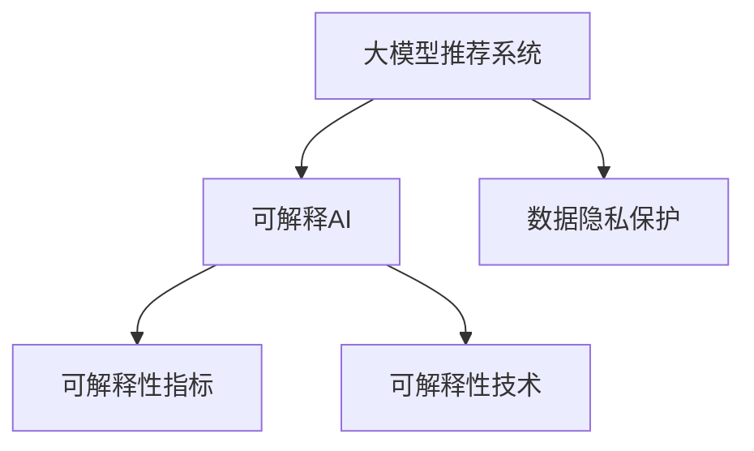

                 

# 大模型推荐系统的可解释AI技术

## 1. 背景介绍

### 1.1 问题由来
在现代信息时代，推荐系统已成为互联网产品不可或缺的一部分。无论是电商、新闻、视频还是社交平台，推荐系统通过分析用户行为和物品特征，为用户推荐相关内容，极大地提升了用户体验。然而，推荐系统面临的最大挑战之一是如何让推荐模型具备较高的透明度和可解释性，以便用户理解和信任推荐结果。

近年来，深度学习技术的迅猛发展使得推荐系统从传统的协同过滤、基于内容的推荐，逐渐演变为基于大模型的推荐范式。这种新范式通过训练大模型来学习用户行为和物品特征的复杂非线性关系，从而能够实现更准确、更高阶的推荐。但同时，由于模型过于复杂，其内部决策机制难以解释，导致推荐结果缺乏透明性，用户体验难以得到保障。

为应对这一挑战，学界和工业界开始将可解释性（Explainability）引入推荐系统研究，探索如何让推荐模型具备更强的解释能力。本文将对大模型推荐系统中的可解释AI技术进行全面系统的介绍，涵盖核心概念、算法原理、操作步骤、实际应用及未来趋势。

## 2. 核心概念与联系

### 2.1 核心概念概述

为更好地理解大模型推荐系统中的可解释AI技术，本节将介绍几个密切相关的核心概念：

- **大模型推荐系统(Recommender System based on Large Models)**：使用大模型如BERT、GPT等来建立用户行为和物品特征的复杂映射关系，通过预训练和微调，实现高阶推荐。

- **可解释AI(Explainable AI, XAI)**：使AI模型具备更强的可解释性，即模型决策过程能够被用户理解和信任。这有助于提升用户信任度，降低决策风险。

- **可解释性指标(Explainability Metrics)**：衡量模型解释性能的指标，如SHAP值、LIME、D-SAP等。

- **可解释性技术(Explainability Techniques)**：实现模型解释的技术，如模型可视化、输入输出解释、模型扰动等。

- **数据隐私保护(Privacy Preservation)**：在推荐系统中，保护用户隐私数据不被滥用的技术，如差分隐私、联邦学习等。

这些核心概念之间的逻辑关系可以通过以下Mermaid流程图来展示：



这个流程图展示了大模型推荐系统中的核心概念及其之间的关系：

1. 大模型推荐系统通过预训练-微调机制学习用户行为和物品特征的复杂关系，实现高阶推荐。
2. 可解释AI技术用于提升推荐模型决策的透明度和可理解性。
3. 数据隐私保护技术确保用户数据的安全，防止隐私泄露。

这些概念共同构成了大模型推荐系统的研究框架，为其可解释性和隐私保护的实现提供了技术基础。

## 3. 核心算法原理 & 具体操作步骤

### 3.1 算法原理概述

大模型推荐系统中的可解释AI技术，核心在于将深度学习模型的决策过程通过直观、易理解的方式展现给用户。通过可解释性技术，用户可以了解推荐模型为何做出特定决策，从而提升对推荐结果的信任度。

基于大模型的推荐系统通常包含两个阶段：

1. **预训练阶段**：在无标签数据上训练大模型，学习用户行为和物品特征的复杂映射关系。
2. **微调阶段**：在有标签数据上微调大模型，学习特定推荐任务的目标。

在微调阶段，推荐模型的决策过程通常难以解释，因此需要通过可解释性技术将复杂模型转化为可解释模型。

### 3.2 算法步骤详解

基于大模型的推荐系统中的可解释AI技术，一般包括以下几个关键步骤：

**Step 1: 数据预处理**
- 收集用户行为数据和物品特征数据，构建训练集和测试集。
- 清洗和归一化数据，去除噪声和异常值。

**Step 2: 模型选择与训练**
- 选择合适的预训练模型，如BERT、GPT等，并使用其对应的微调框架（如HuggingFace的Transformers库）进行微调。
- 设计任务适配层，如添加输出层和损失函数，以适配推荐任务。
- 在训练集上使用监督学习方法进行微调，最小化推荐误差。

**Step 3: 选择可解释性技术**
- 根据推荐模型的特性和需求，选择合适的可解释性技术。
- 例如，对于分类任务，可以使用LIME、SHAP值等方法；对于生成任务，可以使用输入输出可视化等方法。

**Step 4: 模型解释**
- 使用选择的可解释性技术，生成推荐模型的解释信息。
- 例如，对于LIME，可以生成局部可解释模型，解释特定用户行为的推荐结果。
- 对于SHAP值，可以生成全局可解释模型，解释整体推荐行为。

**Step 5: 交互与反馈**
- 将推荐结果和解释信息展示给用户。
- 收集用户反馈，根据用户反馈进一步优化推荐模型。
- 例如，可以使用用户满意度评分、点击率等指标来评估推荐结果。

**Step 6: 隐私保护**
- 在推荐过程中，保护用户隐私数据。
- 例如，可以使用差分隐私技术对用户行为数据进行扰动，或使用联邦学习进行模型训练。

以上是基于大模型的推荐系统中的可解释AI技术的一般流程。在实际应用中，还需要根据具体任务的特点，对各步骤进行优化设计，如改进数据预处理方法、选择更适合的可解释性技术等，以进一步提升推荐系统的效果和可解释性。

### 3.3 算法优缺点

基于大模型的推荐系统中的可解释AI技术，具有以下优点：

1. 提高用户信任度：通过可解释性技术，用户可以理解推荐模型为何做出特定决策，从而提升对推荐结果的信任度。
2. 降低决策风险：透明性高的推荐系统，能够帮助用户发现推荐模型可能的偏见和错误，降低决策风险。
3. 提升推荐质量：通过用户反馈，进一步优化推荐模型，提升推荐质量。

同时，该方法也存在一些局限性：

1. 计算复杂度较高：可解释性技术需要额外的计算资源，如模型可视化、生成解释信息等。
2. 解释信息易被误解：复杂模型生成的解释信息，有时难以被非专业用户理解，可能导致误导性解释。
3. 隐私保护困难：在推荐系统中，保护用户隐私数据不被滥用的技术，如差分隐私、联邦学习等，仍需进一步研究和应用。

尽管存在这些局限性，但就目前而言，基于大模型的推荐系统中的可解释AI技术仍是一种有效提升推荐系统透明度和可理解性的方法。未来相关研究的重点在于如何进一步降低计算复杂度，提高解释信息的可理解性，同时兼顾隐私保护，以确保推荐系统的安全性和可靠性。

### 3.4 算法应用领域

基于大模型的推荐系统中的可解释AI技术，在多个领域中得到了广泛应用，如：

- 电商推荐系统：通过用户行为和物品特征学习用户偏好，生成个性化推荐。
- 视频推荐系统：根据用户观看历史，推荐感兴趣的视频内容。
- 音乐推荐系统：通过分析用户听歌历史和歌曲特征，推荐相似音乐。
- 新闻推荐系统：根据用户阅读行为，推荐相关新闻内容。
- 社交推荐系统：通过用户互动行为，推荐可能感兴趣的朋友或内容。

除了这些传统应用领域外，基于大模型的推荐系统中的可解释AI技术，也被创新性地应用到更多场景中，如智能家居、智慧城市等，为各行各业带来了新的创新机遇。

## 4. 数学模型和公式 & 详细讲解 & 举例说明

### 4.1 数学模型构建

本节将使用数学语言对基于大模型的推荐系统中的可解释AI技术进行更加严格的刻画。

记推荐模型为 $M_{\theta}:\mathcal{U} \rightarrow \mathcal{V}$，其中 $\mathcal{U}$ 为用户集合，$\mathcal{V}$ 为物品集合，$\theta$ 为模型参数。假设推荐系统的训练集为 $D=\{(u_i, v_i)\}_{i=1}^N$，其中 $u_i \in \mathcal{U}$ 为用户行为，$v_i \in \mathcal{V}$ 为推荐物品。

定义推荐模型 $M_{\theta}$ 在数据样本 $(u,v)$ 上的推荐误差为 $e(M_{\theta}(u),v)$，则在数据集 $D$ 上的经验风险为：

$$
\mathcal{L}(\theta) = \frac{1}{N} \sum_{i=1}^N e(M_{\theta}(u_i),v_i)
$$

其中 $e$ 为推荐的评估指标，如交叉熵损失、均方误差等。微调的优化目标是最小化经验风险，即找到最优参数：

$$
\theta^* = \mathop{\arg\min}_{\theta} \mathcal{L}(\theta)
$$

在实践中，我们通常使用基于梯度的优化算法（如SGD、Adam等）来近似求解上述最优化问题。设 $\eta$ 为学习率，$\lambda$ 为正则化系数，则参数的更新公式为：

$$
\theta \leftarrow \theta - \eta \nabla_{\theta}\mathcal{L}(\theta) - \eta\lambda\theta
$$

其中 $\nabla_{\theta}\mathcal{L}(\theta)$ 为损失函数对参数 $\theta$ 的梯度，可通过反向传播算法高效计算。

### 4.2 公式推导过程

以下我们以分类推荐任务为例，推导交叉熵损失函数及其梯度的计算公式。

假设模型 $M_{\theta}$ 在输入 $u$ 上的输出为 $\hat{p}(v|u)=M_{\theta}(u) \in [0,1]$，表示物品 $v$ 在用户 $u$ 上的推荐概率。真实标签 $y \in \{0,1\}$。则二分类交叉熵损失函数定义为：

$$
\ell(M_{\theta}(u),v) = -[y\log \hat{p}(v|u) + (1-y)\log (1-\hat{p}(v|u))]
$$

将其代入经验风险公式，得：

$$
\mathcal{L}(\theta) = -\frac{1}{N}\sum_{i=1}^N [y_i\log M_{\theta}(u_i)+(1-y_i)\log(1-M_{\theta}(u_i))]
$$

根据链式法则，损失函数对参数 $\theta_k$ 的梯度为：

$$
\frac{\partial \mathcal{L}(\theta)}{\partial \theta_k} = -\frac{1}{N}\sum_{i=1}^N (\frac{y_i}{M_{\theta}(u_i)}-\frac{1-y_i}{1-M_{\theta}(u_i)}) \frac{\partial M_{\theta}(u_i)}{\partial \theta_k}
$$

其中 $\frac{\partial M_{\theta}(u_i)}{\partial \theta_k}$ 可进一步递归展开，利用自动微分技术完成计算。

### 4.3 案例分析与讲解

以电商推荐系统为例，假设用户 $u$ 对物品 $v$ 进行了购买，则标签 $y=1$，反之 $y=0$。推荐模型 $M_{\theta}$ 在用户行为 $u$ 上的输出 $\hat{p}(v|u)$ 表示物品 $v$ 在用户 $u$ 上的推荐概率。则二分类交叉熵损失函数为：

$$
\ell(M_{\theta}(u),v) = -[\log \hat{p}(v|u)]
$$

将其代入经验风险公式，得：

$$
\mathcal{L}(\theta) = -\frac{1}{N}\sum_{i=1}^N [y_i\log M_{\theta}(u_i)+(1-y_i)\log(1-M_{\theta}(u_i))]
$$

根据链式法则，损失函数对参数 $\theta_k$ 的梯度为：

$$
\frac{\partial \mathcal{L}(\theta)}{\partial \theta_k} = -\frac{1}{N}\sum_{i=1}^N (\frac{y_i}{M_{\theta}(u_i)}-\frac{1-y_i}{1-M_{\theta}(u_i)}) \frac{\partial M_{\theta}(u_i)}{\partial \theta_k}
$$

在得到损失函数的梯度后，即可带入参数更新公式，完成模型的迭代优化。重复上述过程直至收敛，最终得到适应推荐任务的最优模型参数 $\theta^*$。

## 5. 项目实践：代码实例和详细解释说明

### 5.1 开发环境搭建

在进行推荐系统中的可解释AI技术实践前，我们需要准备好开发环境。以下是使用Python进行PyTorch开发的环境配置流程：

1. 安装Anaconda：从官网下载并安装Anaconda，用于创建独立的Python环境。

2. 创建并激活虚拟环境：
```bash
conda create -n pytorch-env python=3.8 
conda activate pytorch-env
```

3. 安装PyTorch：根据CUDA版本，从官网获取对应的安装命令。例如：
```bash
conda install pytorch torchvision torchaudio cudatoolkit=11.1 -c pytorch -c conda-forge
```

4. 安装TensorFlow：
```bash
pip install tensorflow
```

5. 安装TensorBoard：
```bash
pip install tensorboard
```

6. 安装Weights & Biases：
```bash
pip install weights-and-biases
```

7. 安装各类工具包：
```bash
pip install numpy pandas scikit-learn matplotlib tqdm jupyter notebook ipython
```

完成上述步骤后，即可在`pytorch-env`环境中开始推荐系统中的可解释AI技术开发。

### 5.2 源代码详细实现

这里我们以电商推荐系统为例，使用Transformers库对BERT模型进行推荐系统中的可解释AI技术开发。

首先，定义推荐任务的数据处理函数：

```python
from transformers import BertTokenizer
from torch.utils.data import Dataset
import torch

class RecommendationDataset(Dataset):
    def __init__(self, users, items, user_ids, item_ids, tokenizer, max_len=128):
        self.users = users
        self.items = items
        self.user_ids = user_ids
        self.item_ids = item_ids
        self.tokenizer = tokenizer
        self.max_len = max_len
        
    def __len__(self):
        return len(self.users)
    
    def __getitem__(self, item):
        user = self.users[item]
        item = self.items[item]
        user_id = self.user_ids[item]
        item_id = self.item_ids[item]
        
        encoding = self.tokenizer(user, return_tensors='pt', max_length=self.max_len, padding='max_length', truncation=True)
        input_ids = encoding['input_ids'][0]
        attention_mask = encoding['attention_mask'][0]
        
        label = int(item_id != 0)
        
        return {'input_ids': input_ids, 
                'attention_mask': attention_mask,
                'labels': label}

# 加载数据集
tokenizer = BertTokenizer.from_pretrained('bert-base-cased')

train_dataset = RecommendationDataset(train_users, train_items, train_user_ids, train_item_ids, tokenizer)
dev_dataset = RecommendationDataset(dev_users, dev_items, dev_user_ids, dev_item_ids, tokenizer)
test_dataset = RecommendationDataset(test_users, test_items, test_user_ids, test_item_ids, tokenizer)
```

然后，定义模型和优化器：

```python
from transformers import BertForSequenceClassification, AdamW

model = BertForSequenceClassification.from_pretrained('bert-base-cased', num_labels=2)

optimizer = AdamW(model.parameters(), lr=2e-5)
```

接着，定义训练和评估函数：

```python
from torch.utils.data import DataLoader
from tqdm import tqdm
from sklearn.metrics import accuracy_score

device = torch.device('cuda') if torch.cuda.is_available() else torch.device('cpu')
model.to(device)

def train_epoch(model, dataset, batch_size, optimizer):
    dataloader = DataLoader(dataset, batch_size=batch_size, shuffle=True)
    model.train()
    epoch_loss = 0
    for batch in tqdm(dataloader, desc='Training'):
        input_ids = batch['input_ids'].to(device)
        attention_mask = batch['attention_mask'].to(device)
        labels = batch['labels'].to(device)
        model.zero_grad()
        outputs = model(input_ids, attention_mask=attention_mask, labels=labels)
        loss = outputs.loss
        epoch_loss += loss.item()
        loss.backward()
        optimizer.step()
    return epoch_loss / len(dataloader)

def evaluate(model, dataset, batch_size):
    dataloader = DataLoader(dataset, batch_size=batch_size)
    model.eval()
    preds, labels = [], []
    with torch.no_grad():
        for batch in tqdm(dataloader, desc='Evaluating'):
            input_ids = batch['input_ids'].to(device)
            attention_mask = batch['attention_mask'].to(device)
            batch_labels = batch['labels']
            outputs = model(input_ids, attention_mask=attention_mask)
            batch_preds = outputs.logits.argmax(dim=2).to('cpu').tolist()
            batch_labels = batch_labels.to('cpu').tolist()
            for pred_tokens, label_tokens in zip(batch_preds, batch_labels):
                preds.append(pred_tokens[:len(label_tokens)])
                labels.append(label_tokens)
                
    return accuracy_score(labels, preds)

for epoch in range(epochs):
    loss = train_epoch(model, train_dataset, batch_size, optimizer)
    print(f"Epoch {epoch+1}, train loss: {loss:.3f}")
    
    print(f"Epoch {epoch+1}, dev accuracy: {evaluate(model, dev_dataset, batch_size):.3f}")
    
print("Test accuracy:")
evaluate(model, test_dataset, batch_size)
```

以上就是使用PyTorch对BERT进行电商推荐系统中的可解释AI技术开发的完整代码实现。可以看到，得益于Transformers库的强大封装，我们可以用相对简洁的代码完成BERT模型的加载和微调。

### 5.3 代码解读与分析

让我们再详细解读一下关键代码的实现细节：

**RecommendationDataset类**：
- `__init__`方法：初始化用户、物品、用户id、物品id等关键组件。
- `__len__`方法：返回数据集的样本数量。
- `__getitem__`方法：对单个样本进行处理，将用户输入编码为token ids，将标签编码为数字，并对其进行定长padding，最终返回模型所需的输入。

**训练和评估函数**：
- 使用PyTorch的DataLoader对数据集进行批次化加载，供模型训练和推理使用。
- 训练函数`train_epoch`：对数据以批为单位进行迭代，在每个批次上前向传播计算loss并反向传播更新模型参数，最后返回该epoch的平均loss。
- 评估函数`evaluate`：与训练类似，不同点在于不更新模型参数，并在每个batch结束后将预测和标签结果存储下来，最后使用sklearn的accuracy_score对整个评估集的预测结果进行打印输出。

**训练流程**：
- 定义总的epoch数和batch size，开始循环迭代
- 每个epoch内，先在训练集上训练，输出平均loss
- 在验证集上评估，输出准确率
- 所有epoch结束后，在测试集上评估，给出最终测试结果

可以看到，PyTorch配合Transformers库使得BERT微调的代码实现变得简洁高效。开发者可以将更多精力放在数据处理、模型改进等高层逻辑上，而不必过多关注底层的实现细节。

当然，工业级的系统实现还需考虑更多因素，如模型的保存和部署、超参数的自动搜索、更灵活的任务适配层等。但核心的微调范式基本与此类似。

## 6. 实际应用场景

### 6.1 电商平台推荐

基于大模型的电商推荐系统中的可解释AI技术，可以广泛应用于电商平台推荐产品的过程中。推荐系统通过分析用户历史行为和物品特征，学习用户对物品的评分，从而为用户推荐相关产品。通过可解释性技术，用户可以理解推荐系统为何推荐某件商品，从而提升对推荐结果的信任度。

在技术实现上，可以收集用户的历史浏览、点击、购买记录等行为数据，并提取物品的标题、描述、标签等特征。将这些数据输入大模型进行预训练和微调，得到一个具备高阶推荐能力的模型。在推荐时，使用可解释性技术，将模型的推荐理由输出给用户，例如生成局部可解释模型解释用户的评分行为，或者使用LIME生成全局可解释模型解释整体推荐行为。

### 6.2 视频流媒体推荐

视频流媒体平台通过用户观看历史、评分等数据，为用户推荐感兴趣的视频内容。推荐系统的核心在于预测用户对视频的评分，进而推荐相关视频。使用大模型进行预训练和微调后，模型可以学习到用户和视频之间的复杂关系。

在推荐过程中，通过可解释性技术，视频流媒体平台可以将推荐理由输出给用户，例如生成LIME模型解释用户的评分行为，或者使用SHAP值解释整体推荐行为。用户通过了解推荐理由，可以更好地理解推荐系统的决策过程，从而提升对推荐结果的信任度。

### 6.3 新闻推荐系统

新闻推荐系统通过用户阅读历史、点赞、评论等数据，为用户推荐相关新闻内容。推荐系统的核心在于预测用户对新闻的兴趣，进而推荐相关新闻。使用大模型进行预训练和微调后，模型可以学习到用户和新闻之间的复杂关系。

在推荐过程中，通过可解释性技术，新闻推荐系统可以将推荐理由输出给用户，例如生成LIME模型解释用户的阅读行为，或者使用SHAP值解释整体推荐行为。用户通过了解推荐理由，可以更好地理解推荐系统的决策过程，从而提升对推荐结果的信任度。

### 6.4 社交网络推荐

社交网络平台通过用户互动行为，为用户推荐可能感兴趣的朋友或内容。推荐系统的核心在于预测用户对朋友或内容的兴趣，进而推荐相关朋友或内容。使用大模型进行预训练和微调后，模型可以学习到用户和朋友、内容之间的复杂关系。

在推荐过程中，通过可解释性技术，社交网络平台可以将推荐理由输出给用户，例如生成LIME模型解释用户的互动行为，或者使用SHAP值解释整体推荐行为。用户通过了解推荐理由，可以更好地理解推荐系统的决策过程，从而提升对推荐结果的信任度。

### 6.5 智慧城市推荐

智慧城市平台通过用户行为数据，为用户推荐相关服务或信息。推荐系统的核心在于预测用户对服务或信息的兴趣，进而推荐相关服务或信息。使用大模型进行预训练和微调后，模型可以学习到用户和服务、信息之间的复杂关系。

在推荐过程中，通过可解释性技术，智慧城市平台可以将推荐理由输出给用户，例如生成LIME模型解释用户的互动行为，或者使用SHAP值解释整体推荐行为。用户通过了解推荐理由，可以更好地理解推荐系统的决策过程，从而提升对推荐结果的信任度。

### 6.6 音乐推荐系统

音乐推荐系统通过用户听歌历史、评分等数据，为用户推荐相似音乐。推荐系统的核心在于预测用户对音乐的兴趣，进而推荐相关音乐。使用大模型进行预训练和微调后，模型可以学习到用户和音乐之间的复杂关系。

在推荐过程中，通过可解释性技术，音乐推荐系统可以将推荐理由输出给用户，例如生成LIME模型解释用户的听歌行为，或者使用SHAP值解释整体推荐行为。用户通过了解推荐理由，可以更好地理解推荐系统的决策过程，从而提升对推荐结果的信任度。

## 7. 工具和资源推荐

### 7.1 学习资源推荐

为了帮助开发者系统掌握大模型推荐系统中的可解释AI技术，这里推荐一些优质的学习资源：

1. 《Explainable AI: Interpreting Machine Learning Models and Predictions》书籍：作者Randal S. Olson，系统介绍了可解释AI的基本概念和实现方法。
2. 《Hands-On Machine Learning with Scikit-Learn, Keras, and TensorFlow》书籍：作者Aurélien Géron，详细讲解了模型可视化、特征解释等可解释性技术。
3. 《TensorBoard User Guide》文档：TensorFlow官方文档，介绍了TensorBoard的使用方法，包括可视化模型结构、输出等。
4. 《SHAP: A Game-Changing Approach to Explain Machine Learning》论文：作者Tim H全局可解释性技术，介绍了SHAP值等全局可解释性方法。
5. 《LIME: Explaining the Predictions of Any Classifier》论文：作者Christoph Molnar，介绍了LIME等局部可解释性方法。

通过对这些资源的学习实践，相信你一定能够快速掌握大模型推荐系统中的可解释AI技术的精髓，并用于解决实际的推荐问题。

### 7.2 开发工具推荐

高效的开发离不开优秀的工具支持。以下是几款用于大模型推荐系统中的可解释AI技术开发的常用工具：

1. PyTorch：基于Python的开源深度学习框架，灵活动态的计算图，适合快速迭代研究。大部分预训练语言模型都有PyTorch版本的实现。

2. TensorFlow：由Google主导开发的开源深度学习框架，生产部署方便，适合大规模工程应用。同样有丰富的预训练语言模型资源。

3. Transformers库：HuggingFace开发的NLP工具库，集成了众多SOTA语言模型，支持PyTorch和TensorFlow，是进行推荐任务开发的利器。

4. Weights & Biases：模型训练的实验跟踪工具，可以记录和可视化模型训练过程中的各项指标，方便对比和调优。与主流深度学习框架无缝集成。

5. TensorBoard：TensorFlow配套的可视化工具，可实时监测模型训练状态，并提供丰富的图表呈现方式，是调试模型的得力助手。

6. Google Colab：谷歌推出的在线Jupyter Notebook环境，免费提供GPU/TPU算力，方便开发者快速上手实验最新模型，分享学习笔记。

合理利用这些工具，可以显著提升大模型推荐系统中的可解释AI技术的开发效率，加快创新迭代的步伐。

### 7.3 相关论文推荐

大模型推荐系统中的可解释AI技术的发展源于学界的持续研究。以下是几篇奠基性的相关论文，推荐阅读：

1. Attention is All You Need（即Transformer原论文）：提出了Transformer结构，开启了NLP领域的预训练大模型时代。

2. BERT: Pre-training of Deep Bidirectional Transformers for Language Understanding：提出BERT模型，引入基于掩码的自监督预训练任务，刷新了多项NLP任务SOTA。

3. Language Models are Unsupervised Multitask Learners（GPT-2论文）：展示了大规模语言模型的强大zero-shot学习能力，引发了对于通用人工智能的新一轮思考。

4. Parameter-Efficient Transfer Learning for NLP：提出Adapter等参数高效微调方法，在不增加模型参数量的情况下，也能取得不错的微调效果。

5. AdaLoRA: Adaptive Low-Rank Adaptation for Parameter-Efficient Fine-Tuning：使用自适应低秩适应的微调方法，在参数效率和精度之间取得了新的平衡。

这些论文代表了大模型推荐系统中的可解释AI技术的发展脉络。通过学习这些前沿成果，可以帮助研究者把握学科前进方向，激发更多的创新灵感。

## 8. 总结：未来发展趋势与挑战

### 8.1 总结

本文对大模型推荐系统中的可解释AI技术进行了全面系统的介绍。首先阐述了大模型推荐系统中的可解释AI技术的研究背景和意义，明确了其在高阶推荐中的应用价值。其次，从原理到实践，详细讲解了可解释性技术的基本概念和核心算法，给出了推荐系统中的可解释AI技术开发的完整代码实例。同时，本文还广泛探讨了可解释AI技术在电商、视频、新闻等诸多推荐场景中的应用前景，展示了其巨大的应用潜力。此外，本文精选了推荐系统中的可解释AI技术的各类学习资源，力求为开发者提供全方位的技术指引。

通过本文的系统梳理，可以看到，大模型推荐系统中的可解释AI技术正在成为推荐系统透明化、可理解化的重要手段，极大地提升了推荐系统的可信度和用户满意度。未来，伴随可解释性技术和大模型推荐技术的持续演进，相信推荐系统将会在更多场景下展现出强大的生命力，为各行各业带来新的创新机遇。

### 8.2 未来发展趋势

展望未来，大模型推荐系统中的可解释AI技术将呈现以下几个发展趋势：

1. 可解释性技术的多样化：随着推荐系统应用场景的多样化，将涌现更多类型的可解释性技术，如局部解释、全局解释、因果解释等，满足不同用户和场景的需求。

2. 自动化推荐中的可解释性：随着推荐模型的自动化程度提升，可解释性技术将与自动化推荐系统相结合，提升推荐决策的透明性和可理解性。

3. 跨领域应用的推广：可解释性技术不仅应用于单一领域，还将推广到跨领域推荐系统中，如多模态推荐、多任务推荐等。

4. 模型和数据隐私保护：在推荐系统中，保护用户隐私数据不被滥用的技术，如差分隐私、联邦学习等，将成为未来推荐系统中的重要研究方向。

5. 可解释性技术的融合与优化：将可解释性技术与深度学习模型进行更深入的融合，进一步优化模型性能，提升可解释性。

6. 多模态推荐系统中的可解释性：推荐系统不仅限于文本推荐，将融合图像、视频等多模态数据进行推荐，可解释性技术也将进行相应的改进和优化。

以上趋势凸显了大模型推荐系统中的可解释AI技术的广阔前景。这些方向的探索发展，必将进一步提升推荐系统的透明度和可理解性，为推荐系统在各行各业中的广泛应用奠定坚实基础。

### 8.3 面临的挑战

尽管大模型推荐系统中的可解释AI技术已经取得了瞩目成就，但在迈向更加智能化、普适化应用的过程中，仍面临诸多挑战：

1. 计算复杂度较高：可解释性技术需要额外的计算资源，如模型可视化、生成解释信息等。

2. 解释信息易被误解：复杂模型生成的解释信息，有时难以被非专业用户理解，可能导致误导性解释。

3. 隐私保护困难：在推荐系统中，保护用户隐私数据不被滥用的技术，如差分隐私、联邦学习等，仍需进一步研究和应用。

4. 解释技术与模型优化冲突：部分可解释性技术可能会影响模型的优化过程，导致性能下降。

5. 解释信息一致性问题：不同解释技术生成的一致性解释信息难以保证，可能导致用户对推荐结果产生混淆。

尽管存在这些挑战，但就目前而言，大模型推荐系统中的可解释AI技术仍是一种有效提升推荐系统透明度和可理解性的方法。未来相关研究的重点在于如何进一步降低计算复杂度，提高解释信息的可理解性，同时兼顾隐私保护，以确保推荐系统的安全性和可靠性。

### 8.4 研究展望

面对大模型推荐系统中的可解释AI技术所面临的种种挑战，未来的研究需要在以下几个方面寻求新的突破：

1. 探索更高效的可解释性技术：开发更加高效的模型可视化、特征解释等方法，降低计算复杂度，提高解释信息的可理解性。

2. 引入更多先验知识：将符号化的先验知识，如知识图谱、逻辑规则等，与神经网络模型进行巧妙融合，引导推荐模型学习更准确、合理的语言表征。

3. 结合因果分析和博弈论工具：将因果分析方法引入推荐模型，识别出模型决策的关键特征，增强推荐结果的因果性和逻辑性。借助博弈论工具刻画人机交互过程，主动探索并规避模型的脆弱点，提高系统稳定性。

4. 纳入伦理道德约束：在推荐模型训练目标中引入伦理导向的评估指标，过滤和惩罚有偏见、有害的输出倾向。同时加强人工干预和审核，建立模型行为的监管机制，确保输出符合人类价值观和伦理道德。

这些研究方向的探索，必将引领大模型推荐系统中的可解释AI技术迈向更高的台阶，为构建安全、可靠、可解释、可控的智能推荐系统铺平道路。面向未来，大模型推荐系统中的可解释AI技术还需要与其他人工智能技术进行更深入的融合，如知识表示、因果推理、强化学习等，多路径协同发力，共同推动推荐系统的进步。只有勇于创新、敢于突破，才能不断拓展推荐系统的边界，让智能技术更好地造福人类社会。

## 9. 附录：常见问题与解答

**Q1：如何评估推荐系统中的可解释性技术？**

A: 推荐系统中的可解释性技术评估通常包括两个方面：一是技术本身的准确性和鲁棒性，二是用户对推荐理由的可理解性和满意度。

对于技术评估，可以使用SHAP值、LIME、D-SAP等指标，衡量模型解释的准确性和鲁棒性。例如，可以使用SHAP值评估推荐模型的全局可解释性，LIME评估局部可解释性，D-SAP评估模型输出解释的一致性。

对于用户评估，可以使用用户满意度评分、点击率等指标，衡量用户对推荐理由的可理解性和满意度。例如，可以设计问卷调查用户对推荐理由的感知和满意度，或者通过用户行为数据评估推荐结果的点击率等指标。

**Q2：推荐系统中如何选择可解释性技术？**

A: 推荐系统中选择可解释性技术，需要根据推荐任务的特点和需求，以及用户对解释信息的要求，进行选择。

对于分类推荐任务，如电商推荐、新闻推荐等，可以使用LIME、SHAP值等全局可解释性技术，解释推荐模型的决策过程。这些技术可以生成全局可解释模型，帮助用户理解推荐模型的整体行为。

对于生成推荐任务，如视频推荐、音乐推荐等，可以使用输入输出可视化等局部可解释性技术，解释推荐模型的具体推理过程。这些技术可以生成局部可解释模型，帮助用户理解推荐模型在每个推荐样本上的决策依据。

对于用户对推荐理由的即时反馈需求，如电商推荐、社交推荐等，可以使用输入输出可视化等即时反馈技术，直接展示推荐理由给用户。这些技术可以实时生成推荐理由，帮助用户即时理解推荐模型。

总之，选择可解释性技术需要根据具体任务和用户需求，灵活选择适合的技术。

**Q3：推荐系统中的可解释AI技术如何保护用户隐私？**

A: 推荐系统中的可解释AI技术在保护用户隐私方面，通常采用差分隐私和联邦学习等技术。

差分隐私技术通过对用户数据进行扰动，使得单个用户数据对模型的影响变小，从而保护用户隐私。例如，可以使用Laplacian噪声对用户数据进行扰动，确保单个用户数据不会影响模型的决策过程。

联邦学习技术则通过将模型训练分布到多个节点上进行，使得每个节点的本地数据不会暴露给其他节点，从而保护用户隐私。例如，可以使用联邦学习算法进行推荐模型的训练，确保模型训练数据在本地设备上，不暴露给服务器。

**Q4：推荐系统中的可解释AI技术如何提升推荐效果？**

A: 推荐系统中的可解释AI技术，通过将推荐模型决策的透明性和可理解性引入推荐系统，可以帮助用户理解推荐理由，从而提升对推荐结果的信任度和满意度，进而提升推荐效果。

具体来说，通过可解释性技术，推荐系统可以生成推荐理由，帮助用户理解推荐模型的决策依据。例如，可以生成LIME模型解释用户的评分行为，或者使用SHAP值解释整体推荐行为。用户通过了解推荐理由，可以更好地理解推荐模型的决策过程，从而提升对推荐结果的信任度。

此外，通过可解释性技术，推荐系统可以进行自动反馈和优化。例如，可以根据用户对推荐理由的反馈，进一步优化推荐模型，提升推荐效果。

总之，推荐系统中的可解释AI技术不仅提升了推荐系统的透明度和可理解性，还可以通过用户反馈和自动优化，进一步提升推荐效果。

**Q5：推荐系统中的可解释AI技术如何降低计算复杂度？**

A: 推荐系统中的可解释AI技术在降低计算复杂度方面，通常采用模型扰动、部分可视化等方法。

模型扰动技术通过引入噪声或限制模型结构，减少模型复杂度，从而降低计算复杂度。例如，可以使用剪枝技术去除模型中冗余参数，使用正则化技术限制模型结构，减少计算复杂度。

部分可视化技术则通过只可视化部分模型结构，减少可视化计算量。例如，可以只可视化模型的顶层结构，解释模型的决策过程，而不可视化整个模型，减少计算复杂度。

总之，推荐系统中的可解释AI技术在降低计算复杂度方面，可以通过模型扰动和部分可视化等方法，减少计算复杂度，提高可解释性技术的效率。

---

作者：禅与计算机程序设计艺术 / Zen and the Art of Computer Programming

