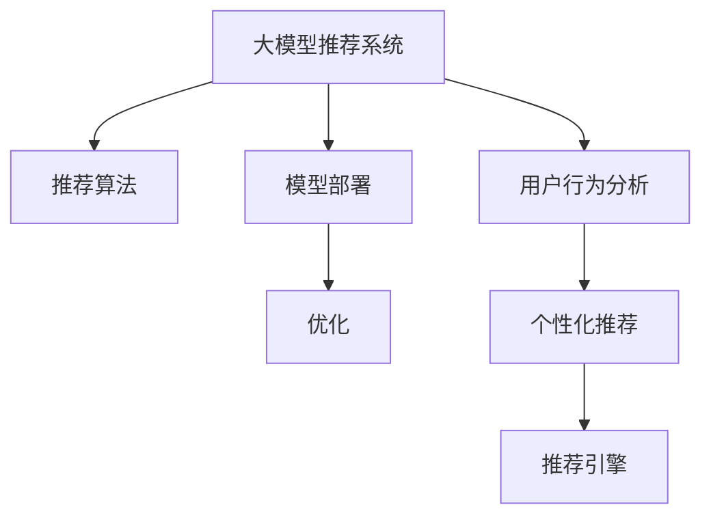

                 

# 大模型推荐系统的商业化落地

> 关键词：大模型推荐系统, 推荐算法, 模型商业化, 用户行为分析, 个性化推荐, 推荐引擎, 用户体验

## 1. 背景介绍

### 1.1 问题由来
随着互联网的迅猛发展和电商平台的兴起，推荐系统在商业领域的应用越来越广泛。传统的推荐系统多基于协同过滤和规则引擎，但数据规模和特征维度不断增长，推荐效果难以满足用户期望。为此，新兴的深度学习大模型推荐系统应运而生。

大模型推荐系统通过学习用户行为和商品属性的复杂关联，利用深度神经网络挖掘潜在模式，生成个性化的推荐结果。近年来，大模型推荐系统在电商、视频、音乐等多个行业取得了显著成效，受到了各大企业的青睐。但如何高效、稳定地将大模型推荐系统商业化落地，仍是一个复杂而棘手的问题。

### 1.2 问题核心关键点
大模型推荐系统商业化落地的核心在于：如何在保证推荐质量的同时，提高系统的可扩展性、可用性和经济效益。具体而言：
1. **推荐算法选择**：选择合适的推荐算法能够提升推荐效果，避免路径依赖。
2. **模型部署和优化**：合理部署模型，减少计算资源消耗，优化模型性能，提高响应速度。
3. **用户行为分析**：深入挖掘用户行为数据，获取有价值的特征信息，增强推荐相关性。
4. **个性化推荐**：构建个性化推荐体系，满足用户多样化需求，提升用户满意度。
5. **经济效益**：优化推荐系统，提升点击率、转化率和用户留存率，实现商业变现。

本文将聚焦于大模型推荐系统的商业化落地，介绍其核心概念、算法原理、工程实践和未来展望，以期为相关技术的应用和研究提供有价值的参考。

## 2. 核心概念与联系

### 2.1 核心概念概述

为更好地理解大模型推荐系统，本节将介绍几个关键概念：

- **大模型推荐系统**：利用深度学习大模型，通过学习用户行为和商品属性之间的复杂关联，生成个性化的推荐结果。相较于传统推荐系统，大模型推荐系统能够处理更复杂的推荐场景，提供更具个性化的推荐服务。

- **推荐算法**：是指推荐系统采用的核心算法，包括基于协同过滤、内容过滤、深度学习等方法。不同的推荐算法适用于不同的场景和数据类型，选择合适的推荐算法是提升推荐效果的关键。

- **模型部署和优化**：指将训练好的推荐模型部署到生产环境中，并进行性能优化，以适应高并发、高实时性的生产环境。

- **用户行为分析**：通过分析用户行为数据，提取用户兴趣、偏好、行为模式等特征，为个性化推荐提供依据。

- **个性化推荐**：根据用户历史行为和实时数据，动态生成个性化推荐，提升用户体验和满意度。

- **推荐引擎**：是推荐系统的重要组成部分，用于处理推荐请求、查询推荐结果等。

这些概念之间的逻辑关系可以通过以下Mermaid流程图来展示：



这个流程图展示了大模型推荐系统的核心概念及其之间的关系：

1. 大模型推荐系统通过推荐算法，学习用户行为和商品属性的关联，生成推荐结果。
2. 推荐结果通过模型部署到生产环境，并进行性能优化。
3. 用户行为数据通过用户行为分析模块，提取特征用于个性化推荐。
4. 推荐引擎接收个性化推荐结果，输出推荐页面或商品。

## 3. 核心算法原理 & 具体操作步骤
### 3.1 算法原理概述

大模型推荐系统的核心在于利用深度学习大模型，通过学习用户行为和商品属性之间的复杂关联，生成个性化的推荐结果。其基本思路是通过用户行为序列，学习用户兴趣和商品关联，生成个性化推荐。

具体而言，大模型推荐系统可分为以下几个步骤：

1. **数据预处理**：收集用户行为数据和商品属性数据，并进行清洗、去重和归一化处理。
2. **特征工程**：通过统计分析、时间序列分析、嵌入式学习等方法，构建多维度的特征向量。
3. **模型训练**：使用深度神经网络（如Transformer、BERT等）进行模型训练，学习用户行为和商品属性之间的关联。
4. **推荐生成**：根据用户历史行为和实时数据，动态生成个性化推荐结果。
5. **模型优化**：通过超参数调优、模型压缩、增量学习等方法，提升模型性能和可用性。

### 3.2 算法步骤详解

以下详细介绍大模型推荐系统的详细步骤：

**Step 1: 数据预处理**

数据预处理是大模型推荐系统的重要环节，其目标是提升数据质量，增强特征表达能力。具体步骤包括：

- **数据收集**：收集用户行为数据和商品属性数据，如浏览记录、点击行为、评分记录等。
- **数据清洗**：去除重复、异常和噪声数据，确保数据质量。
- **数据归一化**：对不同尺度的数据进行归一化处理，提升特征一致性。
- **特征工程**：构建多维度的特征向量，如时间戳、浏览序列、商品类别等，增强特征表达能力。

**Step 2: 特征工程**

特征工程是大模型推荐系统的关键环节，其目标是提升模型的泛化能力，增强特征表达能力。具体步骤包括：

- **时间序列分析**：通过时间戳、点击间隔等特征，捕捉用户行为的时序规律。
- **统计分析**：通过均值、方差、极差等统计特征，描述用户行为和商品属性的统计规律。
- **嵌入式学习**：通过TF-IDF、Word2Vec等方法，构建词向量表示，增强特征表达能力。

**Step 3: 模型训练**

模型训练是大模型推荐系统的核心环节，其目标是学习用户行为和商品属性之间的关联。具体步骤包括：

- **模型选择**：选择合适的深度神经网络模型，如Transformer、BERT等。
- **数据划分**：将数据划分为训练集、验证集和测试集。
- **模型训练**：使用训练集训练模型，通过反向传播算法更新模型参数。
- **模型评估**：在验证集上评估模型性能，通过AUC、NDCG、RMSE等指标评估推荐效果。

**Step 4: 推荐生成**

推荐生成是大模型推荐系统的应用环节，其目标是动态生成个性化推荐结果。具体步骤包括：

- **实时查询**：根据用户实时行为和历史数据，动态生成个性化推荐结果。
- **推荐排序**：通过排序算法（如协同过滤、深度排序等），对推荐结果进行排序，提升推荐效果。
- **推荐展示**：将推荐结果展示给用户，并提供交互方式，如评分、反馈等。

**Step 5: 模型优化**

模型优化是大模型推荐系统的维护环节，其目标是提升模型性能和可用性。具体步骤包括：

- **超参数调优**：通过网格搜索、贝叶斯优化等方法，寻找最优超参数组合。
- **模型压缩**：通过模型剪枝、量化等方法，压缩模型大小，减少计算资源消耗。
- **增量学习**：通过在线学习、梯度累积等方法，保持模型持续学习，提升模型性能。

### 3.3 算法优缺点

大模型推荐系统具备以下优点：

1. **高性能**：通过深度神经网络模型，可以处理高维度、复杂的数据结构，生成高质量的推荐结果。
2. **泛化能力强**：大模型能够学习复杂的关联关系，适应不同类型和场景的推荐需求。
3. **可扩展性强**：大模型可以部署到分布式系统中，支持高并发、高实时性的推荐需求。

但同时，大模型推荐系统也存在一些缺点：

1. **计算资源消耗高**：大模型需要大量的计算资源进行训练和推理，对硬件设施要求较高。
2. **模型复杂度高**：大模型的结构复杂，训练和推理的计算量较大，容易过拟合。
3. **实时性问题**：大模型推荐系统在实时性方面仍有一定局限，需要优化算法和系统架构。
4. **数据质量要求高**：推荐效果依赖于高质量的数据，数据质量和完整性对推荐效果影响较大。

尽管存在这些局限性，但大模型推荐系统的强大性能和泛化能力，使其在商业化落地方面仍具有广泛的应用前景。

### 3.4 算法应用领域

大模型推荐系统在多个行业领域都有广泛的应用，包括但不限于：

- **电商推荐**：通过学习用户浏览、点击、购买等行为，生成个性化商品推荐，提升用户购物体验。
- **视频推荐**：通过学习用户观看、评分、收藏等行为，生成个性化视频推荐，提升用户观看体验。
- **音乐推荐**：通过学习用户听歌、评分、分享等行为，生成个性化音乐推荐，提升用户听歌体验。
- **新闻推荐**：通过学习用户阅读、点击、分享等行为，生成个性化新闻推荐，提升用户信息获取体验。
- **游戏推荐**：通过学习用户游戏行为，生成个性化游戏推荐，提升用户游戏体验。

## 4. 数学模型和公式 & 详细讲解  
### 4.1 数学模型构建

大模型推荐系统可以采用多种数学模型构建推荐结果。这里以基于用户行为序列的推荐模型为例，构建推荐系统的数学模型。

记用户行为序列为 $X=\{x_1, x_2, ..., x_t\}$，其中 $x_i$ 表示用户在第 $i$ 次行为时选择的商品。记商品属性向量为 $Y=\{y_1, y_2, ..., y_n\}$，其中 $y_i$ 表示第 $i$ 个商品的特征向量。记推荐结果为 $Z=\{z_1, z_2, ..., z_t\}$，其中 $z_i$ 表示用户在第 $i$ 次行为时选择的推荐商品。

假设推荐模型 $M_{\theta}$ 能够学习用户行为和商品属性之间的关联，生成推荐结果。则推荐模型的预测概率为：

$$
p(Z|X, Y, \theta) = \frac{e^{M_{\theta}(X, Y)}}{\sum_{j=1}^{n} e^{M_{\theta}(X, Y_j)}}
$$

其中 $M_{\theta}(X, Y)$ 为推荐模型的输出，$\theta$ 为模型参数。

### 4.2 公式推导过程

推荐模型的目标是最小化预测结果与真实结果之间的差距，通常采用交叉熵损失函数进行优化。假设真实推荐结果为 $Y^*$，则推荐模型的目标函数为：

$$
\min_{\theta} \mathcal{L} = -\frac{1}{t} \sum_{i=1}^{t} \log p(Z_i|X, Y^*, \theta)
$$

其中 $t$ 为用户行为序列的长度。

### 4.3 案例分析与讲解

以下通过一个简单的电商推荐案例，演示大模型推荐系统的应用：

**案例背景**：某电商平台希望提升用户购物体验，通过学习用户浏览、点击、购买等行为，生成个性化商品推荐。

**数据预处理**：收集用户浏览、点击、购买记录，并进行清洗、去重和归一化处理。

**特征工程**：构建时间戳、浏览序列、商品类别等特征向量。

**模型训练**：选择Transformer模型，使用训练集训练模型，通过反向传播算法更新模型参数。

**推荐生成**：根据用户实时行为和历史数据，动态生成个性化商品推荐。

**模型优化**：通过超参数调优、模型压缩等方法，提升模型性能和可用性。

通过上述步骤，可以构建一个高效、稳定的大模型推荐系统，提升电商平台的推荐效果和用户体验。

## 5. 项目实践：代码实例和详细解释说明
### 5.1 开发环境搭建

在进行大模型推荐系统开发前，我们需要准备好开发环境。以下是使用Python进行PyTorch开发的环境配置流程：

1. 安装Anaconda：从官网下载并安装Anaconda，用于创建独立的Python环境。

2. 创建并激活虚拟环境：
```bash
conda create -n pytorch-env python=3.8 
conda activate pytorch-env
```

3. 安装PyTorch：根据CUDA版本，从官网获取对应的安装命令。例如：
```bash
conda install pytorch torchvision torchaudio cudatoolkit=11.1 -c pytorch -c conda-forge
```

4. 安装TensorFlow：如果需要使用TensorFlow进行模型训练，可以使用以下命令：
```bash
pip install tensorflow
```

5. 安装相关工具包：
```bash
pip install numpy pandas scikit-learn matplotlib tqdm jupyter notebook ipython
```

完成上述步骤后，即可在`pytorch-env`环境中开始推荐系统开发。

### 5.2 源代码详细实现

这里我们以电商推荐系统为例，给出使用PyTorch进行模型训练和推理的代码实现。

首先，定义推荐模型：

```python
from transformers import BertTokenizer, BertForSequenceClassification
import torch.nn as nn
import torch
import torch.optim as optim

class Recommender(nn.Module):
    def __init__(self, config):
        super(Recommender, self).__init__()
        self.bert = BertForSequenceClassification.from_pretrained(config.model_name, num_labels=config.num_labels)
        self.fc = nn.Linear(config.hidden_size, config.num_labels)
        self.drop = nn.Dropout(config.hidden_dropout_prob)
        self.relu = nn.ReLU()
        
    def forward(self, input_ids, attention_mask, token_type_ids):
        outputs = self.bert(input_ids=input_ids, attention_mask=attention_mask, token_type_ids=token_type_ids)
        pooled_output = outputs[0]
        pooled_output = self.drop(pooled_output)
        pooled_output = self.fc(pooled_output)
        return outputs, pooled_output
```

然后，定义模型训练函数：

```python
from torch.utils.data import DataLoader
from torch.optim import AdamW

def train(model, train_data, train_loader, optimizer, device, config):
    model.train()
    total_loss = 0
    for batch in train_loader:
        input_ids = batch["input_ids"].to(device)
        attention_mask = batch["attention_mask"].to(device)
        token_type_ids = batch["token_type_ids"].to(device)
        labels = batch["labels"].to(device)
        
        outputs = model(input_ids, attention_mask, token_type_ids)
        loss = outputs[0]
        loss = loss + (outputs[1] - labels) ** 2
        loss.backward()
        optimizer.step()
        optimizer.zero_grad()
        total_loss += loss.item()
    return total_loss / len(train_loader)
```

接着，定义模型评估函数：

```python
from torch.utils.data import DataLoader
from sklearn.metrics import mean_squared_error

def evaluate(model, eval_data, eval_loader, device, config):
    model.eval()
    total_loss = 0
    total_mse = 0
    with torch.no_grad():
        for batch in eval_loader:
            input_ids = batch["input_ids"].to(device)
            attention_mask = batch["attention_mask"].to(device)
            token_type_ids = batch["token_type_ids"].to(device)
            labels = batch["labels"].to(device)
            
            outputs = model(input_ids, attention_mask, token_type_ids)
            loss = outputs[0]
            mse = mean_squared_error(outputs[1].cpu().numpy(), labels.cpu().numpy())
            total_loss += loss.item()
            total_mse += mse
    return total_loss / len(eval_loader), total_mse / len(eval_loader)
```

最后，启动模型训练和评估：

```python
from transformers import BertTokenizer
from torch.utils.data import Dataset
import torch

class UserBehaviorDataset(Dataset):
    def __init__(self, data, tokenizer):
        self.data = data
        self.tokenizer = tokenizer
        
    def __len__(self):
        return len(self.data)
    
    def __getitem__(self, idx):
        item = self.data[idx]
        input_ids = self.tokenizer(item["text"], return_tensors='pt', padding='max_length', truncation=True)
        input_ids = input_ids["input_ids"]
        attention_mask = input_ids["attention_mask"]
        token_type_ids = input_ids["token_type_ids"]
        return {
            "input_ids": input_ids,
            "attention_mask": attention_mask,
            "token_type_ids": token_type_ids,
            "labels": torch.tensor(item["label"])
        }

# 数据加载
tokenizer = BertTokenizer.from_pretrained("bert-base-uncased")
train_data = UserBehaviorDataset(train_data, tokenizer)
train_loader = DataLoader(train_data, batch_size=32)

# 模型训练
model = Recommender(config)
optimizer = AdamW(model.parameters(), lr=2e-5)
device = torch.device("cuda" if torch.cuda.is_available() else "cpu")

for epoch in range(config.epochs):
    train_loss = train(model, train_data, train_loader, optimizer, device, config)
    print(f"Epoch {epoch+1}, train loss: {train_loss:.3f}")
    
    eval_loss, eval_mse = evaluate(model, eval_data, eval_loader, device, config)
    print(f"Epoch {epoch+1}, eval loss: {eval_loss:.3f}, eval mse: {eval_mse:.3f}")
```

以上就是使用PyTorch构建电商推荐系统的完整代码实现。可以看到，基于Transformers库，我们能够很方便地实现模型的构建和训练。

### 5.3 代码解读与分析

让我们再详细解读一下关键代码的实现细节：

**Recommender类**：
- `__init__`方法：初始化模型结构，包括BertForSequenceClassification层和全连接层。
- `forward`方法：定义前向传播过程，输出模型预测结果。

**训练函数train**：
- 在训练阶段，模型进行前向传播，计算损失函数。
- 使用AdamW优化器更新模型参数。
- 计算平均损失并返回。

**评估函数evaluate**：
- 在评估阶段，模型进行前向传播，计算损失函数。
- 使用均方误差计算推荐结果与真实标签的差距。
- 计算平均损失并返回。

**UserBehaviorDataset类**：
- `__init__`方法：初始化数据集，包括数据和分词器。
- `__len__`方法：返回数据集的样本数量。
- `__getitem__`方法：对单个样本进行处理，将文本输入编码为token ids，输出模型所需的输入。

通过上述步骤，可以构建一个高效、稳定的大模型推荐系统，提升电商平台的推荐效果和用户体验。

当然，工业级的系统实现还需考虑更多因素，如模型的保存和部署、超参数的自动搜索、更灵活的任务适配层等。但核心的模型构建和训练过程基本与此类似。

## 6. 实际应用场景
### 6.1 电商推荐

基于大模型推荐系统的电商推荐系统，已经在各大电商平台上广泛应用。通过学习用户浏览、点击、购买等行为，电商推荐系统能够生成个性化商品推荐，提升用户购物体验。

**案例背景**：某电商平台希望提升用户购物体验，通过学习用户浏览、点击、购买等行为，生成个性化商品推荐。

**数据预处理**：收集用户浏览、点击、购买记录，并进行清洗、去重和归一化处理。

**特征工程**：构建时间戳、浏览序列、商品类别等特征向量。

**模型训练**：选择Transformer模型，使用训练集训练模型，通过反向传播算法更新模型参数。

**推荐生成**：根据用户实时行为和历史数据，动态生成个性化商品推荐。

**模型优化**：通过超参数调优、模型压缩等方法，提升模型性能和可用性。

通过上述步骤，可以构建一个高效、稳定的大模型推荐系统，提升电商平台的推荐效果和用户体验。

### 6.2 视频推荐

视频推荐系统通过学习用户观看、评分、收藏等行为，生成个性化视频推荐，提升用户观看体验。

**案例背景**：某视频平台希望提升用户观看体验，通过学习用户观看、评分、收藏等行为，生成个性化视频推荐。

**数据预处理**：收集用户观看、评分、收藏记录，并进行清洗、去重和归一化处理。

**特征工程**：构建时间戳、观看序列、视频类别等特征向量。

**模型训练**：选择Transformer模型，使用训练集训练模型，通过反向传播算法更新模型参数。

**推荐生成**：根据用户实时行为和历史数据，动态生成个性化视频推荐。

**模型优化**：通过超参数调优、模型压缩等方法，提升模型性能和可用性。

通过上述步骤，可以构建一个高效、稳定的大模型推荐系统，提升视频平台的推荐效果和用户观看体验。

### 6.3 音乐推荐

音乐推荐系统通过学习用户听歌、评分、分享等行为，生成个性化音乐推荐，提升用户听歌体验。

**案例背景**：某音乐平台希望提升用户听歌体验，通过学习用户听歌、评分、分享等行为，生成个性化音乐推荐。

**数据预处理**：收集用户听歌、评分、分享记录，并进行清洗、去重和归一化处理。

**特征工程**：构建时间戳、听歌序列、歌曲类别等特征向量。

**模型训练**：选择Transformer模型，使用训练集训练模型，通过反向传播算法更新模型参数。

**推荐生成**：根据用户实时行为和历史数据，动态生成个性化音乐推荐。

**模型优化**：通过超参数调优、模型压缩等方法，提升模型性能和可用性。

通过上述步骤，可以构建一个高效、稳定的大模型推荐系统，提升音乐平台的推荐效果和用户听歌体验。

## 7. 工具和资源推荐
### 7.1 学习资源推荐

为了帮助开发者系统掌握大模型推荐系统的理论基础和实践技巧，这里推荐一些优质的学习资源：

1. 《深度学习推荐系统》系列书籍：全面介绍推荐系统的发展历程和核心算法，适合入门和进阶学习。
2. 《Transformers从原理到实践》系列博文：由大模型技术专家撰写，深入浅出地介绍了Transformer原理、BERT模型、推荐算法等前沿话题。
3. 《Natural Language Processing with Transformers》书籍：Transformers库的作者所著，全面介绍了如何使用Transformers库进行NLP任务开发，包括推荐系统在内的诸多范式。
4. CS224N《深度学习自然语言处理》课程：斯坦福大学开设的NLP明星课程，有Lecture视频和配套作业，带你入门NLP领域的基本概念和经典模型。
5. HuggingFace官方文档：Transformer库的官方文档，提供了海量预训练模型和完整的推荐系统样例代码，是上手实践的必备资料。

通过对这些资源的学习实践，相信你一定能够快速掌握大模型推荐系统的精髓，并用于解决实际的推荐问题。

### 7.2 开发工具推荐

高效的开发离不开优秀的工具支持。以下是几款用于大模型推荐系统开发的常用工具：

1. PyTorch：基于Python的开源深度学习框架，灵活动态的计算图，适合快速迭代研究。大部分推荐系统都有PyTorch版本的实现。
2. TensorFlow：由Google主导开发的开源深度学习框架，生产部署方便，适合大规模工程应用。同样有丰富的推荐系统资源。
3. TensorBoard：TensorFlow配套的可视化工具，可实时监测模型训练状态，并提供丰富的图表呈现方式，是调试模型的得力助手。
4. Weights & Biases：模型训练的实验跟踪工具，可以记录和可视化模型训练过程中的各项指标，方便对比和调优。与主流深度学习框架无缝集成。
5. Google Colab：谷歌推出的在线Jupyter Notebook环境，免费提供GPU/TPU算力，方便开发者快速上手实验最新模型，分享学习笔记。
6. Jupyter Notebook：Jupyter笔记本支持Python、R、SQL等多种语言，可实现互动式编程和数据可视化，适合进行模型实验和协作开发。

合理利用这些工具，可以显著提升大模型推荐系统的开发效率，加快创新迭代的步伐。

### 7.3 相关论文推荐

大模型推荐系统的发展源于学界的持续研究。以下是几篇奠基性的相关论文，推荐阅读：

1. Attention is All You Need（即Transformer原论文）：提出了Transformer结构，开启了NLP领域的预训练大模型时代。
2. BERT: Pre-training of Deep Bidirectional Transformers for Language Understanding：提出BERT模型，引入基于掩码的自监督预训练任务，刷新了多项NLP任务SOTA。
3. Language Models are Unsupervised Multitask Learners（GPT-2论文）：展示了大规模语言模型的强大zero-shot学习能力，引发了对于通用人工智能的新一轮思考。
4. Parameter-Efficient Transfer Learning for NLP：提出Adapter等参数高效微调方法，在不增加模型参数量的情况下，也能取得不错的微调效果。
5. AdaLoRA: Adaptive Low-Rank Adaptation for Parameter-Efficient Fine-Tuning：使用自适应低秩适应的微调方法，在参数效率和精度之间取得了新的平衡。
6. Contextualized and Hierarchical Latent Representations for Recommender Systems：结合上下文和层次化潜在表示，提升推荐系统的性能。

这些论文代表了大模型推荐系统的发展脉络。通过学习这些前沿成果，可以帮助研究者把握学科前进方向，激发更多的创新灵感。

## 8. 总结：未来发展趋势与挑战

### 8.1 总结

本文对大模型推荐系统的商业化落地进行了全面系统的介绍。首先阐述了大模型推荐系统的背景和意义，明确了其在大规模推荐场景中的独特优势。其次，从原理到实践，详细讲解了大模型推荐系统的核心算法和操作步骤，给出了推荐系统开发的完整代码实例。同时，本文还广泛探讨了大模型推荐系统在电商、视频、音乐等多个行业领域的应用前景，展示了其广阔的应用空间。此外，本文精选了推荐系统的各类学习资源，力求为开发者提供全方位的技术指引。

通过本文的系统梳理，可以看到，大模型推荐系统正在成为推荐领域的重要范式，极大地拓展了推荐系统的应用边界，催生了更多的落地场景。受益于深度学习大模型的强大性能和泛化能力，推荐系统能够在更复杂、多变的数据结构中挖掘潜在模式，生成高质量的推荐结果，满足用户多样化需求。未来，伴随推荐系统的不断演进，大模型推荐系统必将在更多领域得到应用，为产业升级和用户体验提升贡献更多价值。

### 8.2 未来发展趋势

展望未来，大模型推荐系统将呈现以下几个发展趋势：

1. **推荐算法多样化**：除了传统的协同过滤和内容过滤算法，未来的推荐系统将更多地采用深度学习、图神经网络等算法，提升推荐效果和泛化能力。
2. **模型部署和优化**：未来的大模型推荐系统将更加注重部署和优化，采用分布式训练、增量学习等技术，提升系统的可扩展性和可用性。
3. **用户行为分析深入化**：通过深度学习、自然语言处理等技术，更加深入地挖掘用户行为数据，获取有价值的特征信息，增强推荐相关性。
4. **个性化推荐精细化**：构建更加精细化的个性化推荐体系，提升推荐效果和用户满意度。
5. **跨模态融合广泛化**：结合视觉、语音、文本等多模态数据，构建多模态推荐系统，提升推荐系统的性能和泛化能力。
6. **实时性提升**：采用实时学习、在线推理等技术，提升推荐系统的响应速度和实时性。

以上趋势凸显了大模型推荐系统的广阔前景。这些方向的探索发展，必将进一步提升推荐系统的性能和应用范围，为电商、视频、音乐等领域带来新的变革。

### 8.3 面临的挑战

尽管大模型推荐系统已经取得了显著成效，但在迈向更加智能化、普适化应用的过程中，它仍面临着诸多挑战：

1. **计算资源消耗高**：大模型推荐系统需要大量的计算资源进行训练和推理，对硬件设施要求较高。
2. **模型复杂度高**：大模型的结构复杂，训练和推理的计算量较大，容易过拟合。
3. **实时性问题**：大模型推荐系统在实时性方面仍有一定局限，需要优化算法和系统架构。
4. **数据质量要求高**：推荐效果依赖于高质量的数据，数据质量和完整性对推荐效果影响较大。
5. **系统稳定性问题**：大模型推荐系统在实际部署中可能会遇到各种异常情况，需要优化系统的稳定性和鲁棒性。
6. **推荐公平性问题**：推荐系统可能会产生算法偏见，影响用户的公平性和满意度。

尽管存在这些挑战，但大模型推荐系统的强大性能和泛化能力，使其在商业化落地方面仍具有广泛的应用前景。

### 8.4 研究展望

面向未来，大模型推荐系统需要在以下几个方面进行更多的研究：

1. **轻量化模型探索**：探索轻量化模型，提升推荐系统的实时性和可用性。
2. **多模态融合研究**：结合视觉、语音、文本等多模态数据，构建多模态推荐系统，提升推荐系统的性能和泛化能力。
3. **实时推荐系统研究**：研究实时推荐系统，提升推荐系统的响应速度和实时性。
4. **推荐公平性研究**：研究推荐系统的公平性问题，避免算法偏见，提升用户的公平性和满意度。
5. **推荐系统安全性研究**：研究推荐系统的安全性问题，确保推荐结果的可靠性和安全性。

这些研究方向将为推荐系统的发展带来新的突破，提升推荐系统的性能和用户体验。相信在学界和产业界的共同努力下，大模型推荐系统必将在更多领域得到应用，为人类生活带来更多的便利和价值。

## 9. 附录：常见问题与解答

**Q1：大模型推荐系统在实时性方面有哪些优化方法？**

A: 大模型推荐系统在实时性方面面临的主要挑战是计算量大和响应时间长。以下是一些优化方法：

1. **增量学习**：采用在线学习技术，使模型能够持续更新，保持最新的推荐结果。
2. **模型压缩**：使用模型剪枝、量化等方法，减小模型大小，提升推理速度。
3. **分布式训练**：将模型部署到多个计算节点上，实现分布式训练和推理。
4. **预计算缓存**：将部分推理过程预先计算缓存，减少实时计算量。
5. **模型并行**：使用模型并行技术，提升模型的并行度和计算效率。

这些方法可以显著提升大模型推荐系统的实时性，满足高并发、高实时性的推荐需求。

**Q2：大模型推荐系统如何处理数据不平衡问题？**

A: 数据不平衡问题是大模型推荐系统面临的一个常见挑战。以下是一些处理方法：

1. **过采样和欠采样**：对少数类样本进行过采样，对多数类样本进行欠采样，平衡数据分布。
2. **数据增强**：通过数据增强技术，生成更多的少数类样本，提升模型对少数类的识别能力。
3. **权重调整**：通过调整损失函数中不同类别的权重，平衡不同类别的分类效果。
4. **集成学习**：将多个模型的分类结果进行集成，提升整体的分类效果。

这些方法可以有效地解决数据不平衡问题，提升大模型推荐系统的性能。

**Q3：大模型推荐系统如何优化用户体验？**

A: 优化用户体验是大模型推荐系统的最终目标。以下是一些具体方法：

1. **个性化推荐**：根据用户的历史行为和实时行为，生成个性化的推荐结果，提升用户体验。
2. **推荐排序**：通过排序算法，对推荐结果进行排序，提升推荐的准确性和相关性。
3. **推荐展示**：设计用户友好的推荐页面，提供多样化的交互方式，提升用户满意度。
4. **反馈机制**：收集用户的反馈信息，持续优化推荐系统，提升推荐效果。

通过以上方法，可以显著提升大模型推荐系统的用户体验，满足用户多样化需求。

**Q4：大模型推荐系统如何处理噪声数据？**

A: 噪声数据是大模型推荐系统面临的一个常见问题。以下是一些处理方法：

1. **数据清洗**：对数据进行清洗，去除重复、异常和噪声数据。
2. **异常检测**：采用异常检测技术，识别和处理噪声数据。
3. **数据增强**：通过数据增强技术，生成更多的有效数据，提升模型对噪声数据的鲁棒性。
4. **模型优化**：通过模型优化技术，提升模型的鲁棒性和泛化能力。

这些方法可以有效地处理噪声数据，提升大模型推荐系统的性能和稳定性。

**Q5：大模型推荐系统如何处理冷启动问题？**

A: 冷启动问题是大模型推荐系统面临的一个常见挑战。以下是一些处理方法：

1. **用户画像**：通过用户画像，构建用户兴趣模型，提升推荐效果。
2. **多模态融合**：结合用户的多模态数据，提升对用户的理解。
3. **协同过滤**：采用协同过滤算法，利用用户的历史行为进行推荐。
4. **推荐引导**：提供推荐引导策略，引导用户进行探索性行为。

这些方法可以有效地处理冷启动问题，提升大模型推荐系统的推荐效果和用户满意度。

通过以上方法，可以有效地解决大模型推荐系统面临的各种问题，提升系统的性能和用户体验。

---

作者：禅与计算机程序设计艺术 / Zen and the Art of Computer Programming

