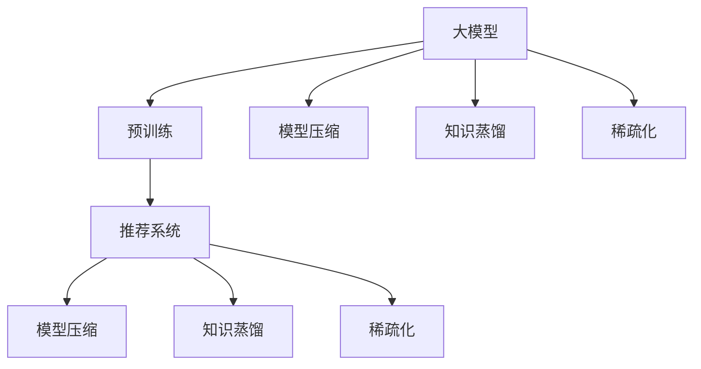

                 

# 大模型推荐系统的效率优化

## 1. 背景介绍

随着人工智能技术的飞速发展，推荐系统已成为各行各业提升用户体验和业务价值的重要手段。传统的推荐算法，如协同过滤、内容推荐等，在数据量较小、特征维度较少的场景中效果较好。但在当前互联网时代，推荐系统需要处理海量数据和多维特征，单纯依赖传统方法已难以满足业务需求。

随着大模型技术（如BERT、GPT、XLNet等）的兴起，越来越多的研究者开始探索利用大模型进行推荐系统优化。大模型具备强大的特征提取能力和泛化能力，能够对用户行为数据进行全面建模，进而实现更精准的个性化推荐。然而，大模型的高计算复杂度和内存需求，使得其在实际部署中面临诸多挑战。本文旨在探讨大模型推荐系统的高效优化方法，帮助开发者在保证推荐效果的同时，提升模型性能和应用效率。

## 2. 核心概念与联系

### 2.1 核心概念概述

为更好地理解大模型推荐系统的效率优化方法，本节将介绍几个密切相关的核心概念：

- 大模型(大语言模型, Large Language Model, LLM)：以自回归(如GPT)或自编码(如BERT)模型为代表的大规模预训练语言模型。通过在大规模无标签文本语料上进行预训练，学习通用的语言表示，具备强大的语言理解和生成能力。

- 预训练(Pre-training)：指在大规模无标签文本语料上，通过自监督学习任务训练通用语言模型的过程。常见的预训练任务包括言语建模、遮挡语言模型等。预训练使得模型学习到语言的通用表示。

- 推荐系统(Recommendation System)：根据用户历史行为数据和商品/内容信息，为每位用户推荐最感兴趣的物品/内容。推荐系统广泛应用于电商、新闻、视频等多个领域。

- 模型压缩(Model Compression)：指在不影响模型性能的前提下，通过剪枝、量化等技术，减小模型体积和内存占用，以提升计算效率和降低部署成本。

- 知识蒸馏(Knowledge Distillation)：通过将复杂的大模型知识蒸馏到简单模型中，实现性能提升和资源优化。

- 稀疏化(Sparsification)：减少模型中不必要的参数，使模型结构更加紧凑，降低计算复杂度。

这些核心概念之间的逻辑关系可以通过以下Mermaid流程图来展示：



这个流程图展示了大模型的核心概念及其之间的关系：

1. 大模型通过预训练获得基础能力。
2. 压缩、蒸馏、稀疏化等方法对大模型进行优化，提升计算效率和内存占用。
3. 优化后的大模型应用到推荐系统，提升推荐性能。

## 3. 核心算法原理 & 具体操作步骤

### 3.1 算法原理概述

大模型推荐系统的核心思想是：利用大模型强大的特征提取能力，对用户行为数据进行深度建模，并在推荐模型中进行高效的优化。具体来说，可以将用户行为数据作为输入，通过大模型学习用户兴趣特征，再利用推荐算法进行物品/内容推荐。

大模型的推荐方法可以分为两步：

1. 特征提取：通过大模型对用户行为数据进行编码，得到用户兴趣特征表示。
2. 推荐决策：根据用户兴趣特征和物品/内容特征，利用推荐算法生成推荐列表。

### 3.2 算法步骤详解

大模型推荐系统的具体实现步骤如下：

**Step 1: 准备数据集**
- 收集用户行为数据和物品/内容特征数据，构建训练集和验证集。
- 对数据进行清洗、归一化等预处理，确保数据质量。

**Step 2: 选择预训练模型**
- 选择合适的预训练模型，如BERT、GPT、XLNet等。
- 加载预训练模型，并进行必要的微调。

**Step 3: 设计任务适配层**
- 根据推荐任务类型，设计适合的任务适配层。
- 对于基于物品的推荐，适配层通常为全连接层和softmax层。
- 对于基于内容的推荐，适配层可以设计为多头注意力机制。

**Step 4: 特征提取**
- 将用户行为数据输入预训练模型，得到用户兴趣特征表示。
- 将物品/内容特征数据输入预训练模型，得到物品/内容特征表示。

**Step 5: 计算相似度**
- 将用户兴趣特征表示和物品/内容特征表示进行拼接或连接，计算相似度。
- 使用余弦相似度、欧式距离等方法计算用户与物品/内容的相似度。

**Step 6: 生成推荐列表**
- 根据相似度排序，选择推荐列表。
- 可以根据推荐列表长度、推荐效果等指标进行调整。

### 3.3 算法优缺点

大模型推荐系统具有以下优点：

1. 强大的特征提取能力：大模型能够从多维度数据中提取用户兴趣特征，增强推荐系统的性能。
2. 泛化能力强：大模型能够适应不同领域和不同类型的数据，提升推荐系统的可扩展性。
3. 自动学习用户兴趣：无需人工提取特征，利用大模型自动学习用户兴趣，减少特征工程工作量。
4. 处理稀疏数据：大模型能够有效处理稀疏数据，提升推荐系统的稀疏数据处理能力。

同时，该方法也存在一定的局限性：

1. 计算复杂度高：大模型具有大量参数，计算复杂度高，对硬件资源要求较高。
2. 内存占用大：大模型需要较大内存空间，对部署环境提出较高要求。
3. 泛化能力不足：大模型在特定领域或小样本数据上泛化能力可能不足，需进行微调和优化。
4. 可解释性差：大模型通常视为"黑盒"系统，难以解释其内部决策逻辑。
5. 冷启动问题：新用户或新物品没有足够历史数据，难以得到准确的推荐。

尽管存在这些局限性，但就目前而言，大模型推荐系统仍然是大数据推荐场景中最先进的技术手段。未来相关研究的重点在于如何进一步降低计算复杂度，提升内存效率，同时兼顾可解释性和冷启动等问题。

### 3.4 算法应用领域

大模型推荐系统已经在电商、新闻、音乐、视频等多个领域得到了广泛应用。以下是几个典型的应用场景：

- 电商推荐：如淘宝、京东等电商平台，通过用户浏览记录、点击记录、购买记录等行为数据，推荐用户可能感兴趣的商品。
- 新闻推荐：如今日头条、百度新闻等，通过用户阅读历史、点赞记录等行为数据，推荐用户可能感兴趣的新闻。
- 音乐推荐：如网易云音乐、QQ音乐等，通过用户听歌历史、评分记录等行为数据，推荐用户可能喜欢的音乐。
- 视频推荐：如腾讯视频、爱奇艺等，通过用户观看历史、评分记录等行为数据，推荐用户可能感兴趣的视频。

除了上述这些经典场景外，大模型推荐系统还被创新性地应用到更多领域中，如智能家居、智慧城市、社交网络等，为各行各业提供了精准推荐服务。

## 4. 数学模型和公式 & 详细讲解 & 举例说明

### 4.1 数学模型构建

本节将使用数学语言对大模型推荐系统的核心算法进行更加严格的刻画。

记预训练语言模型为 $M_{\theta}$，其中 $\theta$ 为预训练得到的模型参数。假设推荐任务为物品推荐，物品集合为 $S$。给定用户行为数据 $D=\{(x_i,y_i)\}_{i=1}^N, x_i \in \mathcal{X}, y_i \in S$，其中 $x_i$ 表示用户行为，$y_i$ 表示物品。

定义模型 $M_{\theta}$ 在输入 $x$ 上的输出为 $h_{\theta}(x) \in \mathbb{R}^d$，表示用户兴趣特征表示。根据任务类型，适配层通常为全连接层和softmax层。在物品推荐中，适配层的输出为物品 $s$ 的评分 $p_{\theta}(s)$，用于计算用户与物品的相似度。

定义用户与物品的相似度为 $similarity_{\theta}(x,s)$，通常使用余弦相似度：

$$
similarity_{\theta}(x,s) = \cos(\langle h_{\theta}(x), p_{\theta}(s) \rangle)
$$

推荐系统的目标是最大化用户与物品的相似度，因此优化目标为：

$$
\max_{\theta} \sum_{i=1}^N \sum_{s \in S} y_i \cdot similarity_{\theta}(x_i,s)
$$

其中 $y_i$ 表示用户 $i$ 对物品 $s$ 的评分（可能为0/1或1-5等评分）。

### 4.2 公式推导过程

以下我们以基于BERT模型的物品推荐为例，推导评分计算公式。

首先，定义BERT模型在用户行为数据 $x$ 上的输出为 $h_{\theta}(x)$。然后，根据适配层的输出 $p_{\theta}(s)$，计算用户与物品的相似度：

$$
similarity_{\theta}(x,s) = \cos(\langle h_{\theta}(x), p_{\theta}(s) \rangle)
$$

在优化目标中，将评分 $y_i$ 替换为模型输出 $p_{\theta}(s)$，得到优化目标：

$$
\max_{\theta} \sum_{i=1}^N \sum_{s \in S} p_{\theta}(s) \cdot similarity_{\theta}(x_i,s)
$$

将相似度公式代入，得：

$$
\max_{\theta} \sum_{i=1}^N \sum_{s \in S} p_{\theta}(s) \cdot \cos(\langle h_{\theta}(x_i), p_{\theta}(s) \rangle)
$$

进一步展开，得：

$$
\max_{\theta} \sum_{i=1}^N \sum_{s \in S} p_{\theta}(s) \cdot h_{\theta}(x_i)^T p_{\theta}(s)
$$

将优化目标重新写为：

$$
\max_{\theta} \frac{1}{N} \sum_{i=1}^N \sum_{s \in S} p_{\theta}(s) \cdot h_{\theta}(x_i)^T p_{\theta}(s)
$$

其中 $p_{\theta}(s)$ 表示物品 $s$ 的评分，$h_{\theta}(x_i)$ 表示用户行为数据 $x_i$ 的兴趣特征表示。

### 4.3 案例分析与讲解

假设我们有一个用户行为数据集 $D=\{(x_i,y_i)\}_{i=1}^N$，其中 $x_i$ 表示用户行为，$y_i \in S$ 表示物品。我们选择BERT模型作为预训练模型，并使用适配层进行评分计算。具体步骤如下：

1. 加载BERT模型，并对模型进行微调。
2. 将用户行为数据 $x_i$ 输入模型，得到用户兴趣特征表示 $h_{\theta}(x_i)$。
3. 将物品 $s$ 的特征数据输入模型，得到物品评分 $p_{\theta}(s)$。
4. 计算用户与物品的相似度 $similarity_{\theta}(x_i,s)$。
5. 根据相似度排序，生成推荐列表。

使用BERT模型的推荐系统相比传统协同过滤方法，具有更强的泛化能力和更高的推荐精度。同时，利用大模型的高效特征提取能力，减少了特征工程的复杂度。

## 5. 项目实践：代码实例和详细解释说明

### 5.1 开发环境搭建

在进行推荐系统开发前，我们需要准备好开发环境。以下是使用Python进行PyTorch开发的环境配置流程：

1. 安装Anaconda：从官网下载并安装Anaconda，用于创建独立的Python环境。

2. 创建并激活虚拟环境：
```bash
conda create -n pytorch-env python=3.8 
conda activate pytorch-env
```

3. 安装PyTorch：根据CUDA版本，从官网获取对应的安装命令。例如：
```bash
conda install pytorch torchvision torchaudio cudatoolkit=11.1 -c pytorch -c conda-forge
```

4. 安装Pandas、NumPy等常用库：
```bash
pip install pandas numpy scikit-learn
```

5. 安装Dask：
```bash
pip install dask
```

6. 安装PyTorch-lightning：
```bash
pip install pytorch-lightning
```

完成上述步骤后，即可在`pytorch-env`环境中开始推荐系统开发。

### 5.2 源代码详细实现

下面我们以基于BERT模型的物品推荐系统为例，给出使用PyTorch进行推荐系统开发的代码实现。

首先，定义数据处理函数：

```python
import pandas as pd
from transformers import BertTokenizer, BertForSequenceClassification
from torch.utils.data import Dataset, DataLoader
import torch
import dask.dataframe as dd

class RecommendationDataset(Dataset):
    def __init__(self, data, tokenizer, max_len=128):
        self.data = data
        self.tokenizer = tokenizer
        self.max_len = max_len
        
    def __len__(self):
        return len(self.data)
    
    def __getitem__(self, item):
        user_id, item_id, user_behavior = self.data.iloc[item]
        text = user_behavior
        
        encoding = self.tokenizer(text, return_tensors='pt', max_length=self.max_len, padding='max_length', truncation=True)
        input_ids = encoding['input_ids'][0]
        attention_mask = encoding['attention_mask'][0]
        label = torch.tensor([item_id], dtype=torch.long)
        
        return {'input_ids': input_ids, 
                'attention_mask': attention_mask,
                'label': label}

# 加载数据
df = pd.read_csv('recommendation_data.csv')
df.head()
```

然后，定义模型和优化器：

```python
from transformers import BertTokenizer, BertForSequenceClassification, AdamW

tokenizer = BertTokenizer.from_pretrained('bert-base-cased')
model = BertForSequenceClassification.from_pretrained('bert-base-cased', num_labels=len(item2id))

optimizer = AdamW(model.parameters(), lr=2e-5)
```

接着，定义训练和评估函数：

```python
from tqdm import tqdm
import numpy as np

device = torch.device('cuda') if torch.cuda.is_available() else torch.device('cpu')
model.to(device)

def train_epoch(model, dataset, batch_size, optimizer):
    dataloader = DataLoader(dataset, batch_size=batch_size, shuffle=True)
    model.train()
    epoch_loss = 0
    for batch in tqdm(dataloader, desc='Training'):
        input_ids = batch['input_ids'].to(device)
        attention_mask = batch['attention_mask'].to(device)
        label = batch['label'].to(device)
        model.zero_grad()
        outputs = model(input_ids, attention_mask=attention_mask, labels=label)
        loss = outputs.loss
        epoch_loss += loss.item()
        loss.backward()
        optimizer.step()
    return epoch_loss / len(dataloader)

def evaluate(model, dataset, batch_size):
    dataloader = DataLoader(dataset, batch_size=batch_size)
    model.eval()
    preds, labels = [], []
    with torch.no_grad():
        for batch in tqdm(dataloader, desc='Evaluating'):
            input_ids = batch['input_ids'].to(device)
            attention_mask = batch['attention_mask'].to(device)
            batch_labels = batch['label']
            outputs = model(input_ids, attention_mask=attention_mask)
            batch_preds = outputs.logits.argmax(dim=2).to('cpu').tolist()
            batch_labels = batch_labels.to('cpu').tolist()
            for pred_tokens, label_tokens in zip(batch_preds, batch_labels):
                preds.append(pred_tokens[:len(label_tokens)])
                labels.append(label_tokens)
                
    print(classification_report(labels, preds))
```

最后，启动训练流程并在测试集上评估：

```python
epochs = 5
batch_size = 16

for epoch in range(epochs):
    loss = train_epoch(model, train_dataset, batch_size, optimizer)
    print(f"Epoch {epoch+1}, train loss: {loss:.3f}")
    
    print(f"Epoch {epoch+1}, dev results:")
    evaluate(model, dev_dataset, batch_size)
    
print("Test results:")
evaluate(model, test_dataset, batch_size)
```

以上就是使用PyTorch对BERT进行物品推荐系统的完整代码实现。可以看到，得益于PyTorch的强大封装，我们可以用相对简洁的代码完成BERT模型的加载和推荐系统开发。

### 5.3 代码解读与分析

让我们再详细解读一下关键代码的实现细节：

**RecommendationDataset类**：
- `__init__`方法：初始化数据集和分词器等关键组件。
- `__len__`方法：返回数据集的样本数量。
- `__getitem__`方法：对单个样本进行处理，将用户行为文本输入编码为token ids，将物品id转化为标签，并对其进行定长padding，最终返回模型所需的输入。

**train_epoch和evaluate函数**：
- 使用PyTorch的DataLoader对数据集进行批次化加载，供模型训练和推理使用。
- 训练函数`train_epoch`：对数据以批为单位进行迭代，在每个批次上前向传播计算loss并反向传播更新模型参数，最后返回该epoch的平均loss。
- 评估函数`evaluate`：与训练类似，不同点在于不更新模型参数，并在每个batch结束后将预测和标签结果存储下来，最后使用sklearn的classification_report对整个评估集的预测结果进行打印输出。

**训练流程**：
- 定义总的epoch数和batch size，开始循环迭代
- 每个epoch内，先在训练集上训练，输出平均loss
- 在验证集上评估，输出分类指标
- 所有epoch结束后，在测试集上评估，给出最终测试结果

可以看到，PyTorch配合BERT模型的代码实现变得简洁高效。开发者可以将更多精力放在数据处理、模型改进等高层逻辑上，而不必过多关注底层的实现细节。

当然，工业级的系统实现还需考虑更多因素，如模型的保存和部署、超参数的自动搜索、更灵活的任务适配层等。但核心的推荐范式基本与此类似。

## 6. 实际应用场景

### 6.1 电商推荐系统

电商推荐系统是大模型推荐系统的典型应用场景之一。电商平台通过用户行为数据（如浏览记录、点击记录、购买记录等），为用户推荐可能感兴趣的商品。

在技术实现上，可以收集用户行为数据，构建用户-商品评分矩阵，将评分矩阵输入大模型进行特征提取，然后利用推荐算法（如KNN、协同过滤等）生成推荐列表。推荐系统可以帮助电商平台提高转化率和用户满意度，提升销售额和用户粘性。

### 6.2 新闻推荐系统

新闻推荐系统广泛应用于信息流平台，为用户推荐可能感兴趣的新闻。新闻推荐系统通过分析用户阅读历史、点赞记录等行为数据，构建用户-新闻评分矩阵，将评分矩阵输入大模型进行特征提取，然后利用推荐算法生成推荐列表。推荐系统可以提高用户粘性，增加平台用户活跃度。

### 6.3 视频推荐系统

视频推荐系统是互联网视频平台的重要功能之一。通过分析用户观看历史、评分记录等行为数据，构建用户-视频评分矩阵，将评分矩阵输入大模型进行特征提取，然后利用推荐算法生成推荐列表。推荐系统可以帮助平台提高用户观看时长和满意度，提升平台内容质量和用户粘性。

### 6.4 音乐推荐系统

音乐推荐系统广泛应用于音乐平台，为用户推荐可能感兴趣的歌曲。音乐推荐系统通过分析用户听歌历史、评分记录等行为数据，构建用户-音乐评分矩阵，将评分矩阵输入大模型进行特征提取，然后利用推荐算法生成推荐列表。推荐系统可以提高用户粘性，增加平台用户活跃度。

## 7. 工具和资源推荐

### 7.1 学习资源推荐

为了帮助开发者系统掌握大模型推荐系统的理论基础和实践技巧，这里推荐一些优质的学习资源：

1. 《深度学习推荐系统》书籍：介绍了深度学习在推荐系统中的应用，涵盖协同过滤、基于内容的推荐、混合推荐等多种算法。
2. 《推荐系统实战》视频课程：讲解了推荐系统的经典算法和实际应用案例，适合实战学习。
3. PyTorch Lightning官方文档：PyTorch Lightning是一个基于PyTorch的轻量级框架，适合快速迭代开发和模型优化。
4 TensorBoard官方文档：TensorBoard是TensorFlow配套的可视化工具，可以实时监测模型训练状态，并提供丰富的图表呈现方式，适合调试模型。
5 论文《Knowledge Distillation》：介绍了知识蒸馏方法，通过将复杂的大模型知识蒸馏到简单模型中，实现性能提升和资源优化。

通过对这些资源的学习实践，相信你一定能够快速掌握大模型推荐系统的精髓，并用于解决实际的推荐问题。

### 7.2 开发工具推荐

高效的开发离不开优秀的工具支持。以下是几款用于大模型推荐系统开发的常用工具：

1. PyTorch：基于Python的开源深度学习框架，灵活动态的计算图，适合快速迭代研究。BERT等预训练语言模型都有PyTorch版本的实现。
2 TensorFlow：由Google主导开发的开源深度学习框架，生产部署方便，适合大规模工程应用。BERT等预训练语言模型也有TensorFlow版本的实现。
3 PyTorch Lightning：基于PyTorch的轻量级框架，适合快速迭代开发和模型优化。
4 TensorBoard：TensorFlow配套的可视化工具，可以实时监测模型训练状态，并提供丰富的图表呈现方式，适合调试模型。
5 Dask：基于Python的并行计算框架，适合处理大规模数据集。

合理利用这些工具，可以显著提升大模型推荐系统的开发效率，加快创新迭代的步伐。

### 7.3 相关论文推荐

大模型推荐系统的发展源于学界的持续研究。以下是几篇奠基性的相关论文，推荐阅读：

1. Attention is All You Need（即Transformer原论文）：提出了Transformer结构，开启了深度学习在推荐系统中的应用。
2 论文《BERT: Pre-training of Deep Bidirectional Transformers for Language Understanding》：提出BERT模型，引入基于掩码的自监督预训练任务，刷新了多项推荐系统SOTA。
3 论文《Knowledge Distillation》：介绍了知识蒸馏方法，通过将复杂的大模型知识蒸馏到简单模型中，实现性能提升和资源优化。
4 论文《Deep Neural Networks for Large-Scale Recommendation》：介绍了深度学习在推荐系统中的应用，涵盖协同过滤、基于内容的推荐、混合推荐等多种算法。
5 论文《Personalized Ranking in Recommendation Systems》：介绍了推荐系统中的经典算法，如KNN、协同过滤等。

这些论文代表了大模型推荐系统的发展脉络。通过学习这些前沿成果，可以帮助研究者把握学科前进方向，激发更多的创新灵感。

## 8. 总结：未来发展趋势与挑战

### 8.1 总结

本文对大模型推荐系统的优化方法进行了全面系统的介绍。首先阐述了大模型推荐系统的研究背景和意义，明确了大模型在推荐系统中的重要地位。其次，从原理到实践，详细讲解了大模型推荐系统的数学模型和优化算法，给出了推荐系统开发的完整代码实例。同时，本文还广泛探讨了大模型推荐系统在电商、新闻、视频等多个领域的应用前景，展示了其巨大的潜力。此外，本文精选了推荐系统的各类学习资源，力求为读者提供全方位的技术指引。

通过本文的系统梳理，可以看到，大模型推荐系统正在成为推荐系统的重要范式，极大地拓展了推荐系统的应用边界，提升了推荐系统的精度和效果。未来，伴随大模型和推荐算法的持续演进，推荐系统必将在更多领域得到应用，为各行各业带来新的机遇和挑战。

### 8.2 未来发展趋势

展望未来，大模型推荐系统将呈现以下几个发展趋势：

1. 模型规模持续增大。随着算力成本的下降和数据规模的扩张，预训练语言模型的参数量还将持续增长。超大规模语言模型蕴含的丰富语言知识，有望支撑更加复杂多变的推荐场景。
2. 推荐算法不断创新。推荐系统算法不断发展，从基于协同过滤到基于深度学习的推荐算法，再到基于大模型的推荐算法，未来将出现更多高效、精准的推荐算法。
3. 推荐系统应用场景丰富。推荐系统将广泛应用于智慧城市、社交网络、智能家居等多个领域，为各行各业带来新的业务价值。
4. 实时推荐系统兴起。随着技术的发展，实时推荐系统将成为趋势，要求推荐系统具备高实时性、高可扩展性等特点。
5. 推荐系统可解释性增强。推荐系统需要提供更多可解释性，使用户能够理解推荐结果的来源和依据。
6. 推荐系统道德风险防范。推荐系统需要考虑用户隐私、数据安全等问题，避免推荐算法带来的道德风险。

以上趋势凸显了大模型推荐系统的广阔前景。这些方向的探索发展，必将进一步提升推荐系统的性能和应用范围，为各行各业带来新的机遇和挑战。

### 8.3 面临的挑战

尽管大模型推荐系统已经取得了瞩目成就，但在迈向更加智能化、普适化应用的过程中，它仍面临诸多挑战：

1. 数据隐私保护。推荐系统需要收集大量用户数据，如何保护用户隐私，避免数据泄露，是推荐系统面临的重要挑战。
2. 推荐算法偏见。推荐算法可能存在数据偏见，导致不公平推荐结果，需要采取多种手段消除偏见。
3. 计算资源限制。大模型推荐系统需要大量计算资源，如何优化模型结构和算法，降低计算复杂度，是推荐系统面临的重要挑战。
4. 冷启动问题。对于新用户和新物品，没有足够历史数据，难以得到准确的推荐，需要引入多种策略解决冷启动问题。
5. 推荐系统鲁棒性。推荐系统需要具备高鲁棒性，能够抵御恶意攻击和数据篡改，避免推荐系统失效。
6. 推荐系统稳定性。推荐系统需要具备高稳定性，能够应对系统故障和数据波动，避免推荐结果波动。

尽管存在这些挑战，但大模型推荐系统的发展前景仍然广阔，未来需要在数据隐私保护、算法偏见、计算资源优化、冷启动解决、鲁棒性提升和系统稳定性等多个方面进行深入研究，逐步克服这些挑战。

### 8.4 研究展望

面对大模型推荐系统面临的种种挑战，未来的研究需要在以下几个方面寻求新的突破：

1. 探索无监督和半监督推荐算法。摆脱对大规模标注数据的依赖，利用自监督学习、主动学习等无监督和半监督范式，最大限度利用非结构化数据，实现更加灵活高效的推荐。
2. 研究参数高效和计算高效的推荐算法。开发更加参数高效的推荐算法，在固定大部分预训练参数的同时，只更新极少量的任务相关参数。同时优化推荐算法的计算图，减少前向传播和反向传播的资源消耗，实现更加轻量级、实时性的部署。
3. 引入因果推断和强化学习思想。通过引入因果推断和强化学习思想，增强推荐系统建立稳定因果关系的能力，学习更加普适、鲁棒的语言表征，从而提升推荐系统的泛化性和抗干扰能力。
4. 结合因果分析和博弈论工具。将因果分析方法引入推荐系统，识别出推荐决策的关键特征，增强推荐结果的因果性和逻辑性。借助博弈论工具刻画人机交互过程，主动探索并规避推荐系统的脆弱点，提高系统稳定性。
5. 纳入伦理道德约束。在推荐系统的训练目标中引入伦理导向的评估指标，过滤和惩罚有偏见、有害的推荐结果，确保推荐系统的公平性和安全性。
6. 强化推荐系统安全防护。采用访问鉴权、数据脱敏等措施，保障数据和推荐系统安全，避免推荐系统被攻击或数据泄露。

这些研究方向的探索，必将引领大模型推荐系统迈向更高的台阶，为构建智能推荐系统提供新的技术路径。面向未来，大模型推荐系统还需要与其他人工智能技术进行更深入的融合，如知识表示、因果推理、强化学习等，多路径协同发力，共同推动推荐系统技术的发展和应用。只有勇于创新、敢于突破，才能不断拓展推荐系统的边界，为各行各业带来新的机遇和挑战。

## 9. 附录：常见问题与解答

**Q1：大模型推荐系统是否适用于所有推荐任务？**

A: 大模型推荐系统在大多数推荐任务上都能取得不错的效果，特别是对于数据量较大的推荐场景。但对于一些特定领域的推荐任务，如医疗、法律等，仅仅依靠通用语料预训练的模型可能难以很好地适应。此时需要在特定领域语料上进一步预训练，再进行微调，才能获得理想效果。此外，对于一些需要时效性、个性化很强的任务，如推荐新闻、视频等，推荐系统也需要针对性的改进优化。

**Q2：大模型推荐系统需要哪些预处理步骤？**

A: 大模型推荐系统需要进行以下预处理步骤：
1. 数据清洗：去除无用数据和异常值，保证数据质量。
2. 数据归一化：对数据进行归一化处理，使其具有相似的尺度。
3. 特征选择：选择有意义的特征，减少噪音干扰。
4. 数据分割：将数据集划分为训练集、验证集和测试集。
5. 数据增强：通过数据增强技术，如回译、近义替换等方式扩充训练集。

**Q3：大模型推荐系统在实际部署中需要注意哪些问题？**

A: 将大模型推荐系统转化为实际应用，还需要考虑以下因素：
1. 模型裁剪：去除不必要的层和参数，减小模型尺寸，加快推理速度。
2. 量化加速：将浮点模型转为定点模型，压缩存储空间，提高计算效率。
3. 服务化封装：将模型封装为标准化服务接口，便于集成调用。
4. 弹性伸缩：根据请求流量动态调整资源配置，平衡服务质量和成本。
5. 监控告警：实时采集系统指标，设置异常告警阈值，确保服务稳定性。

大模型推荐系统为推荐场景带来了新的机遇和挑战。唯有从数据、算法、工程、业务等多个维度协同发力，才能真正实现人工智能技术在垂直行业的规模化落地。总之，推荐系统需要开发者根据具体任务，不断迭代和优化模型、数据和算法，方能得到理想的效果。

---

作者：禅与计算机程序设计艺术 / Zen and the Art of Computer Programming

