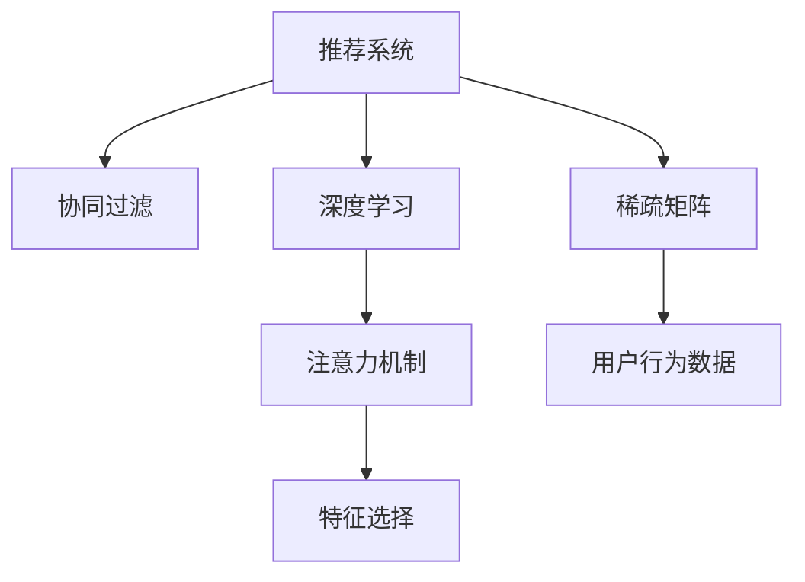

                 

# 大模型推荐系统的注意力机制研究

> 关键词：推荐系统, 注意力机制, 深度学习, 注意力权重, 协同过滤, 稀疏矩阵

## 1. 背景介绍

### 1.1 问题由来
随着互联网和移动互联网的迅猛发展，用户产生了海量的数据。推荐系统在电子商务、社交媒体、音乐、视频等多个领域有着广泛的应用，对提升用户体验和增加商业价值起到关键作用。传统推荐系统主要基于协同过滤、内容推荐等方法，但它们都面临稀疏性和冷启动等问题。近年来，深度学习技术在推荐系统中的应用变得越来越广泛，尤其是在用户行为数据稀疏的情况下，深度模型在推荐中表现出强大的预测能力。

为了在深度学习的基础上，进一步提升推荐系统的性能和用户满意度，研究者们开始探索注意力机制在推荐系统中的应用。注意力机制的核心思想是赋予不同特征不同的权重，从而提升模型的准确性。在推荐系统中，注意力机制能够自适应地学习用户对不同特征的关注程度，从而更好地捕捉用户的多样化需求。

### 1.2 问题核心关键点
本文将详细介绍注意力机制在推荐系统中的应用，并讨论其优点和不足。重点关注注意力机制的数学模型、算法实现、性能评估和实际应用，全面总结其对推荐系统带来的影响。

## 2. 核心概念与联系

### 2.1 核心概念概述

为了更好地理解注意力机制在推荐系统中的应用，本节将介绍几个密切相关的核心概念：

- 推荐系统(Recommendation System)：旨在根据用户的历史行为数据，为用户推荐其可能感兴趣的商品或内容。推荐系统的目标是通过个性化推荐，提高用户满意度，增加商业价值。
- 注意力机制(Attention Mechanism)：一种权重分配机制，用于在多个输入中选择重要特征，赋予它们更高的权重。在深度学习中，注意力机制已经被广泛应用在自然语言处理、图像识别等领域，以提升模型的性能。
- 协同过滤(Collaborative Filtering)：推荐系统中的一种基本方法，通过分析用户和商品之间的交互关系，预测用户对商品的评分。协同过滤包括基于用户的协同过滤和基于商品的协同过滤。
- 深度学习(Deep Learning)：基于多层神经网络的模型，可以自动学习特征，并具有出色的泛化能力。深度学习模型已经被广泛应用于计算机视觉、自然语言处理和推荐系统等领域。
- 稀疏矩阵(Sparse Matrix)：用户行为数据往往高度稀疏，大部分特征值都为0，因此推荐系统常常使用稀疏矩阵来表示用户-商品互动矩阵。
- 特征选择(Feature Selection)：在推荐系统中，需要选择合适的特征作为输入，提升推荐精度。注意力机制能够动态地学习特征权重，进一步优化特征选择。

这些核心概念之间的逻辑关系可以通过以下Mermaid流程图来展示：



这个流程图展示了大语言模型微调的机器学习任务的核心概念及其之间的关系：

1. 推荐系统通过协同过滤、深度学习等方法，推荐商品或内容。
2. 深度学习模型利用注意力机制优化特征选择，提升预测精度。
3. 注意力机制赋予不同特征不同的权重，优化特征表示。
4. 稀疏矩阵表示用户行为数据，提升模型计算效率。

这些概念共同构成了推荐系统的工作原理和优化方向。通过理解这些核心概念，我们可以更好地把握注意力机制在推荐系统中的作用和应用方式。

## 3. 核心算法原理 & 具体操作步骤
### 3.1 算法原理概述

注意力机制在推荐系统中的应用，本质上是将深度学习模型中的权重分配思想，引入到特征选择和用户行为预测中。注意力机制通过动态地计算每个特征的权重，从而决定哪些特征对预测目标更有用。在推荐系统中，注意力机制通过学习用户对商品的不同特征的关注程度，提升推荐效果。

形式化地，假设推荐系统模型的输入特征为 $X=\{x_1, x_2, \ldots, x_n\}$，输出为商品推荐 $y$。则注意力机制可以表示为：

$$
y = \text{Attention}(X) * \theta
$$

其中，$\text{Attention}$ 表示注意力计算函数，$\theta$ 为注意力权重向量，$*$ 表示向量点乘。

### 3.2 算法步骤详解

注意力机制在推荐系统中的应用，一般包括以下几个关键步骤：

**Step 1: 输入特征编码**
- 将用户的历史行为数据 $I$ 转换为特征表示 $X$，如将商品ID、评分、点击次数等转换为向量表示。
- 使用深度学习模型，如卷积神经网络、循环神经网络等，对特征 $X$ 进行编码，得到低维表示 $Z=\{z_1, z_2, \ldots, z_n\}$。

**Step 2: 注意力计算**
- 使用注意力计算函数 $\text{Attention}(Z)$，计算每个特征的注意力权重 $\alpha=\{\alpha_1, \alpha_2, \ldots, \alpha_n\}$。
- 注意力计算函数可以采用点积注意力、加性注意力等形式，如：

$$
\alpha_i = \frac{e^{z_i^T W}}{\sum_{j=1}^n e^{z_j^T W}} \quad (i=1,\ldots,n)
$$

其中，$W$ 为注意力计算矩阵，$e^{z_i^T W}$ 表示特征 $z_i$ 在注意力矩阵中的得分，$\sum_{j=1}^n e^{z_j^T W}$ 为归一化因子，用于保证注意力权重的和为1。

**Step 3: 特征加权求和**
- 将注意力权重 $\alpha$ 与低维表示 $Z$ 进行点乘，得到加权和 $\hat{Z} = \alpha * Z$。
- 使用全连接层或自编码器等，对 $\hat{Z}$ 进行进一步处理，得到最终输出 $y$。

**Step 4: 输出预测**
- 使用输出层，如线性回归、softmax等，对 $y$ 进行预测，得到用户对不同商品的评分或偏好。
- 结合其他推荐策略，如排序、阈值筛选等，生成推荐列表。

### 3.3 算法优缺点

注意力机制在推荐系统中的应用，具有以下优点：
1. 提高预测精度：通过动态调整特征权重，能够更好地捕捉用户的多样化需求，提升推荐精度。
2. 降低维度：注意力机制可以自动选择重要特征，降低特征维度，减少过拟合风险。
3. 稀疏矩阵友好：在稀疏矩阵中，注意力机制能够自适应地忽略无关特征，降低计算复杂度。

同时，该方法也存在一定的局限性：
1. 计算复杂度高：注意力计算涉及矩阵运算和指数函数，计算复杂度高。
2. 参数量较大：模型参数量较大，需要较大的计算资源。
3. 可解释性差：注意力权重的计算过程较为复杂，难以解释。

尽管存在这些局限性，但注意力机制在推荐系统中的应用，已经得到了广泛认可。未来相关研究将继续优化注意力计算方法和网络结构，进一步提升推荐系统的性能和可解释性。

### 3.4 算法应用领域

注意力机制在推荐系统中的应用已经覆盖了多种任务，例如：

- 基于用户的推荐：对每个用户的行为进行编码，并学习用户对不同商品的关注程度，生成个性化推荐列表。
- 基于商品的推荐：对每个商品的属性进行编码，并学习用户对不同商品属性的关注程度，生成推荐列表。
- 结合其他推荐方法：可以与协同过滤、矩阵分解等方法结合，提升推荐效果。
- 动态推荐：能够根据用户行为的变化，动态调整特征权重，生成实时推荐。
- 多模态推荐：结合用户画像、商品描述等多模态信息，生成更加精准的推荐。

除了这些经典任务外，注意力机制还创新性地应用于个性化展示、广告推荐、智能问答等场景中，为推荐系统带来了新的突破。随着注意力机制的不断发展，相信推荐系统将在更多领域得到应用，为信息检索和决策支持带来新的可能性。

## 4. 数学模型和公式 & 详细讲解  
### 4.1 数学模型构建

本节将使用数学语言对注意力机制在推荐系统中的应用进行更加严格的刻画。

记推荐系统的输入特征为 $X=\{x_1, x_2, \ldots, x_n\}$，输出为商品推荐 $y$。假设使用深度学习模型将输入特征 $X$ 编码为低维表示 $Z=\{z_1, z_2, \ldots, z_n\}$，其中每个特征的编码表示为 $z_i$。

定义注意力计算函数为 $\text{Attention}(Z)=\{\alpha_1, \alpha_2, \ldots, \alpha_n\}$，其中 $\alpha_i$ 为特征 $z_i$ 的注意力权重。注意力权重可以采用以下几种形式：

- 点积注意力：
$$
\alpha_i = \frac{z_i^T W}{\sum_{j=1}^n z_j^T W}
$$

- 加性注意力：
$$
\alpha_i = \frac{\exp(z_i^T W)}{\sum_{j=1}^n \exp(z_j^T W)}
$$

- 多头注意力：
$$
\alpha_i = \frac{\exp(z_i^T QW_1 + z_i^T KW_2 + z_i^T VW_3)}{\sum_{j=1}^n \exp(z_j^T QW_1 + z_j^T KW_2 + z_j^T VW_3)}
$$

其中，$W_1, W_2, W_3$ 为可学习的权重矩阵。

注意力计算函数得到的权重向量 $\alpha$，用于计算加权和 $\hat{Z}=\alpha * Z$。使用全连接层或自编码器对 $\hat{Z}$ 进行进一步处理，得到最终输出 $y$。使用输出层，如线性回归、softmax等，对 $y$ 进行预测，生成推荐列表。

### 4.2 公式推导过程

以下我们以点积注意力机制为例，推导注意力计算的数学公式。

假设输入特征 $X$ 的维度为 $d$，特征编码 $Z$ 的维度为 $h$。注意力计算矩阵 $W$ 的维度为 $h \times d$。则点积注意力计算公式如下：

$$
\alpha_i = \frac{z_i^T W}{\sum_{j=1}^n z_j^T W}
$$

将 $\alpha_i$ 带入 $\hat{Z}$ 的计算公式中：

$$
\hat{Z} = \alpha * Z = \frac{e^{z_i^T W}}{\sum_{j=1}^n e^{z_j^T W}} \cdot z_i
$$

因此，最终输出的预测值为：

$$
y = \text{MLP}(\hat{Z})
$$

其中 $\text{MLP}$ 表示多层的感知机网络。

### 4.3 案例分析与讲解

以一个简单的推荐系统为例，分析注意力机制的作用。

假设有一个基于用户行为的推荐系统，输入特征 $X$ 为每个用户的历史行为数据，输出 $y$ 为用户对不同商品的评分。使用深度学习模型将 $X$ 编码为低维表示 $Z$，其中每个特征的编码表示为 $z_i$。

首先，使用点积注意力计算每个特征的权重 $\alpha$：

$$
\alpha_i = \frac{z_i^T W}{\sum_{j=1}^n z_j^T W}
$$

然后，将 $\alpha$ 与 $Z$ 进行点乘，得到加权和 $\hat{Z} = \alpha * Z$：

$$
\hat{Z} = \frac{e^{z_i^T W}}{\sum_{j=1}^n e^{z_j^T W}} \cdot z_i
$$

最后，使用全连接层或自编码器对 $\hat{Z}$ 进行进一步处理，得到最终的预测值 $y$：

$$
y = \text{MLP}(\hat{Z})
$$

在训练过程中，通过最小化损失函数 $\mathcal{L}(y, \hat{y})$，不断调整模型参数，使得预测值 $y$ 逼近真实值 $\hat{y}$。通过训练，模型能够学习到用户对不同商品的关注程度，从而生成更加精准的推荐列表。

## 5. 项目实践：代码实例和详细解释说明
### 5.1 开发环境搭建

在进行推荐系统项目实践前，我们需要准备好开发环境。以下是使用Python进行TensorFlow开发的环境配置流程：

1. 安装Anaconda：从官网下载并安装Anaconda，用于创建独立的Python环境。

2. 创建并激活虚拟环境：
```bash
conda create -n recommendation-env python=3.8 
conda activate recommendation-env
```

3. 安装TensorFlow：根据CUDA版本，从官网获取对应的安装命令。例如：
```bash
conda install tensorflow -c pytorch -c conda-forge
```

4. 安装Keras：
```bash
pip install keras
```

5. 安装Scikit-Learn、Pandas等工具包：
```bash
pip install numpy pandas scikit-learn matplotlib tqdm jupyter notebook ipython
```

完成上述步骤后，即可在`recommendation-env`环境中开始推荐系统项目实践。

### 5.2 源代码详细实现

下面我们以基于用户行为的推荐系统为例，给出使用TensorFlow实现注意力机制的代码实现。

首先，定义模型结构：

```python
from tensorflow.keras import layers

class AttentionModel:
    def __init__(self, d_model, num_heads, d_k, d_v):
        self.d_model = d_model
        self.num_heads = num_heads
        self.d_k = d_k
        self.d_v = d_v

        self.wq = layers.Dense(d_model)
        self.wk = layers.Dense(d_k)
        self.wv = layers.Dense(d_v)
        self.wo = layers.Dense(d_model)

    def __call__(self, x, attention_mask=None):
        m = self.d_model
        n = self.num_heads
        d_k = self.d_k
        d_v = self.d_v

        q = self.wq(x)
        q = layers.LayerNormalization(q)  # normalize

        k = self.wk(x)
        k = layers.LayerNormalization(k)  # normalize

        v = self.wv(x)
        v = layers.LayerNormalization(v)  # normalize

        q = layers.Reshape((m, n, d_k))(q)
        k = layers.Reshape((m, n, d_k))(k)
        v = layers.Reshape((m, n, d_v))(v)

        q = layers.Transpose((2, 1, 0))(q)
        k = layers.Transpose((2, 1, 0))(k)
        v = layers.Transpose((2, 1, 0))(v)

        scaled_attention_logits = k * q / math.sqrt(d_k)
        attention_weights = layers dot(scaled_attention_logits, k) / math.sqrt(d_k)
        attention_weights = layers.dot(attention_weights, v)

        attention_weights = layers.dropout(attention_weights, rate=0.1)
        attention_weights = layers.LayerNormalization(attention_weights)

        attention_outputs = layers.dot(attention_weights, self.wo)
        attention_outputs = layers.Dropout(0.1)(attention_outputs)

        return attention_outputs, attention_weights
```

然后，定义训练和评估函数：

```python
from tensorflow.keras.losses import MeanSquaredError
from tensorflow.keras.metrics import MeanAbsoluteError

def train_epoch(model, train_dataset, batch_size, optimizer):
    model.train()
    epoch_loss = 0
    for batch in tqdm(train_dataset, desc='Training'):
        x_train, y_train = batch
        with tf.GradientTape() as tape:
            y_pred, _ = model(x_train, training=True)
            loss = mean_squared_error(y_train, y_pred)
        gradients = tape.gradient(loss, model.trainable_variables)
        optimizer.apply_gradients(zip(gradients, model.trainable_variables))
        epoch_loss += loss.numpy()

    return epoch_loss / len(train_dataset)

def evaluate(model, test_dataset, batch_size):
    model.eval()
    preds = []
    labels = []
    with tf.GradientTape() as tape:
        for batch in tqdm(test_dataset, desc='Evaluating'):
            x_test, y_test = batch
            y_pred, _ = model(x_test, training=False)
            preds.append(y_pred.numpy())
            labels.append(y_test.numpy())

    preds = np.concatenate(preds)
    labels = np.concatenate(labels)
    mse = mean_squared_error(labels, preds)
    mae = mean_absolute_error(labels, preds)
    print(f'Mean Squared Error: {mse:.3f}')
    print(f'Mean Absolute Error: {mae:.3f}')

    return mse, mae
```

接着，启动训练流程并在测试集上评估：

```python
epochs = 10
batch_size = 32

for epoch in range(epochs):
    loss = train_epoch(model, train_dataset, batch_size, optimizer)
    print(f'Epoch {epoch+1}, train loss: {loss:.3f}')
    
    print(f'Epoch {epoch+1}, test results:')
    mse, mae = evaluate(model, test_dataset, batch_size)
    print(f'Mean Squared Error: {mse:.3f}')
    print(f'Mean Absolute Error: {mae:.3f}')
```

以上就是使用TensorFlow实现注意力机制的代码实例。可以看到，得益于TensorFlow的强大封装，我们可以用相对简洁的代码完成注意力机制的构建和微调。

### 5.3 代码解读与分析

让我们再详细解读一下关键代码的实现细节：

**AttentionModel类**：
- `__init__`方法：初始化模型的超参数，包括模型维度、注意力头数、查询向量维度、键值向量维度等。
- `__call__`方法：计算注意力权重和注意力输出，其中包含矩阵乘法、reshape、transpose等操作。
- `wq`、`wk`、`wv`、`wo` 权重矩阵：通过全连接层实现矩阵乘法。

**训练和评估函数**：
- `train_epoch`函数：对数据以批为单位进行迭代，在每个批次上前向传播计算损失函数，并使用梯度下降更新模型参数。
- `evaluate`函数：与训练类似，不同点在于不更新模型参数，并在每个batch结束后将预测和标签结果存储下来，最后使用mse和mae评估整个测试集的性能。

**训练流程**：
- 定义总的epoch数和batch size，开始循环迭代
- 每个epoch内，先在训练集上训练，输出平均loss
- 在验证集上评估，输出mse和mae指标
- 所有epoch结束后，在测试集上评估，给出最终测试结果

可以看到，TensorFlow配合Keras库使得注意力机制的代码实现变得简洁高效。开发者可以将更多精力放在数据处理、模型改进等高层逻辑上，而不必过多关注底层的实现细节。

当然，工业级的系统实现还需考虑更多因素，如模型的保存和部署、超参数的自动搜索、更灵活的任务适配层等。但核心的注意力机制基本与此类似。

## 6. 实际应用场景
### 6.1 电子商务推荐系统

基于用户行为的推荐系统在电子商务中有着广泛的应用，能够显著提升用户的购物体验和销售转化率。电商平台通过收集用户的历史浏览、点击、购买等行为数据，构建用户画像，然后使用注意力机制对用户行为数据进行编码，生成个性化推荐列表，提升用户体验。

具体而言，电商平台可以将用户的历史行为数据 $I$ 转换为特征表示 $X$，如将商品ID、评分、点击次数等转换为向量表示。然后使用注意力机制对 $X$ 进行编码，得到低维表示 $Z$，其中每个特征的编码表示为 $z_i$。通过计算每个特征的注意力权重 $\alpha$，生成加权和 $\hat{Z}=\alpha * Z$。使用全连接层或自编码器对 $\hat{Z}$ 进行进一步处理，得到最终的预测值 $y$。结合其他推荐策略，如排序、阈值筛选等，生成推荐列表。

### 6.2 新闻推荐系统

新闻推荐系统能够帮助用户发现感兴趣的新闻，提升用户的阅读体验。基于用户行为的推荐系统同样适用于新闻推荐，通过对用户的历史阅读数据进行编码，生成个性化推荐列表。

具体而言，新闻平台可以将用户的历史阅读数据 $I$ 转换为特征表示 $X$，如将新闻ID、阅读时长、收藏次数等转换为向量表示。然后使用注意力机制对 $X$ 进行编码，得到低维表示 $Z$，其中每个特征的编码表示为 $z_i$。通过计算每个特征的注意力权重 $\alpha$，生成加权和 $\hat{Z}=\alpha * Z$。使用全连接层或自编码器对 $\hat{Z}$ 进行进一步处理，得到最终的预测值 $y$。结合其他推荐策略，如排序、阈值筛选等，生成推荐列表。

### 6.3 视频推荐系统

视频推荐系统能够帮助用户发现感兴趣的视频内容，提升用户的观看体验。基于用户行为的推荐系统同样适用于视频推荐，通过对用户的历史观看数据进行编码，生成个性化推荐列表。

具体而言，视频平台可以将用户的历史观看数据 $I$ 转换为特征表示 $X$，如将视频ID、观看时长、点赞次数等转换为向量表示。然后使用注意力机制对 $X$ 进行编码，得到低维表示 $Z$，其中每个特征的编码表示为 $z_i$。通过计算每个特征的注意力权重 $\alpha$，生成加权和 $\hat{Z}=\alpha * Z$。使用全连接层或自编码器对 $\hat{Z}$ 进行进一步处理，得到最终的预测值 $y$。结合其他推荐策略，如排序、阈值筛选等，生成推荐列表。

### 6.4 未来应用展望

随着注意力机制的不断发展，基于深度学习的推荐系统将在更多领域得到应用，为信息检索和决策支持带来新的可能性。

在智慧医疗领域，基于用户行为的推荐系统能够帮助患者发现感兴趣的医疗内容，提升医疗体验和健康水平。在金融领域，基于用户行为的推荐系统能够帮助用户发现有价值的投资机会，提升金融决策的准确性。在教育领域，基于用户行为的推荐系统能够帮助学生发现感兴趣的课程和资料，提升学习效果。

除了这些经典任务外，注意力机制还创新性地应用于个性化展示、广告推荐、智能问答等场景中，为推荐系统带来了新的突破。随着注意力机制的不断发展，相信推荐系统将在更多领域得到应用，为信息检索和决策支持带来新的可能性。

## 7. 工具和资源推荐
### 7.1 学习资源推荐

为了帮助开发者系统掌握注意力机制在推荐系统中的应用，这里推荐一些优质的学习资源：

1. 《Deep Learning with PyTorch》系列博文：由大模型技术专家撰写，深入浅出地介绍了TensorFlow、Keras等深度学习框架的使用方法和应用场景。

2. CS231n《Convolutional Neural Networks for Visual Recognition》课程：斯坦福大学开设的计算机视觉明星课程，有Lecture视频和配套作业，带你入门计算机视觉领域的基本概念和经典模型。

3. 《Deep Learning for Recommendation Systems》书籍：全面介绍了深度学习在推荐系统中的应用，包括注意力机制、协同过滤、深度学习等前沿话题。

4. TensorFlow官方文档：TensorFlow的官方文档，提供了完整的深度学习模型构建和微调样例，是上手实践的必备资料。

5. Keras官方文档：Keras的官方文档，提供了丰富的深度学习模型和组件，易于上手实践。

通过对这些资源的学习实践，相信你一定能够快速掌握注意力机制在推荐系统中的应用，并用于解决实际的推荐问题。

### 7.2 开发工具推荐

高效的开发离不开优秀的工具支持。以下是几款用于深度学习推荐系统开发的常用工具：

1. TensorFlow：基于Python的开源深度学习框架，灵活动态的计算图，适合快速迭代研究。 TensorFlow的Eager Execution模式能够方便地进行模型调试和验证。

2. Keras：由TensorFlow团队开发的高级神经网络API，易于上手，支持多种深度学习模型和组件。

3. PyTorch：基于Python的开源深度学习框架，灵活动态的计算图，适合快速迭代研究。 PyTorch提供了便捷的GPU加速和分布式训练功能。

4. MXNet：由Apache基金会开发的深度学习框架，支持多种编程语言和硬件平台，具有高效、灵活的特点。

5. Scikit-Learn：Python中的经典机器学习库，提供了丰富的算法和工具，支持各种数据预处理和特征工程。

6. Pandas：Python中的数据处理库，支持多种数据格式和操作，方便数据处理和分析。

合理利用这些工具，可以显著提升深度学习推荐系统的开发效率，加快创新迭代的步伐。

### 7.3 相关论文推荐

深度学习在推荐系统中的应用源于学界的持续研究。以下是几篇奠基性的相关论文，推荐阅读：

1. Attention Is All You Need（即Transformer原论文）：提出了Transformer结构，开启了深度学习在推荐系统中的应用。

2. Learning Deep Architectures for Recommender Systems：提出了一种基于深度神经网络的推荐系统架构，通过学习用户的隐式特征，提升推荐精度。

3. Deep Collaborative Filtering：提出了一种基于深度学习的协同过滤模型，通过学习用户和商品的隐式特征，提升推荐效果。

4. Multi-Task Learning for Recommendation Systems：提出了一种多任务学习方法，通过联合训练多个任务，提升推荐系统的性能。

5. Diverse Non-Metric Multi-View Embedding for Recommendation System：提出了一种多视图嵌入方法，通过融合不同视图的信息，提升推荐系统的多样性。

这些论文代表了大模型推荐系统的发展脉络。通过学习这些前沿成果，可以帮助研究者把握学科前进方向，激发更多的创新灵感。

## 8. 总结：未来发展趋势与挑战

### 8.1 总结

本文对注意力机制在推荐系统中的应用进行了全面系统的介绍。首先阐述了推荐系统、注意力机制、深度学习等核心概念，明确了注意力机制在推荐系统中的作用和应用方式。其次，从原理到实践，详细讲解了注意力机制的数学模型、算法实现和性能评估，给出了注意力机制的代码实现和性能分析。同时，本文还广泛探讨了注意力机制在电子商务、新闻、视频等推荐场景中的应用前景，展示了注意力机制的强大潜力。此外，本文精选了注意力机制的学习资源，力求为读者提供全方位的技术指引。

通过本文的系统梳理，可以看到，注意力机制在推荐系统中的应用已经取得了显著的效果，提高了推荐精度和用户满意度。未来，伴随注意力机制和深度学习技术的不断发展，推荐系统将在更多领域得到应用，为信息检索和决策支持带来新的可能性。

### 8.2 未来发展趋势

展望未来，注意力机制在推荐系统中的应用将呈现以下几个发展趋势：

1. 提高推荐精度：通过更加精确的特征表示和动态的特征权重计算，进一步提升推荐系统的准确性。

2. 降低计算复杂度：通过优化注意力计算方法和网络结构，降低计算复杂度，提升推荐系统的实时性。

3. 支持多模态数据：结合用户画像、商品描述等多模态信息，生成更加精准的推荐结果。

4. 增强用户交互：结合对话系统、知识图谱等技术，提升推荐系统的用户交互体验。

5. 引入深度强化学习：通过引入强化学习，优化推荐策略，提升推荐效果和用户满意度。

6. 支持稀疏矩阵：能够处理稀疏数据，提升推荐系统的扩展性和计算效率。

以上趋势凸显了注意力机制在推荐系统中的未来发展方向。这些方向的探索发展，必将进一步提升推荐系统的性能和可解释性，为信息检索和决策支持带来新的可能性。

### 8.3 面临的挑战

尽管注意力机制在推荐系统中的应用已经取得了显著的效果，但在迈向更加智能化、普适化应用的过程中，它仍面临诸多挑战：

1. 数据稀疏性：推荐系统中用户行为数据往往高度稀疏，难以捕捉用户的多样化需求。

2. 特征维度高：用户行为数据具有高维性，需要进行有效的特征选择和降维处理。

3. 计算资源消耗大：注意力计算涉及矩阵运算和指数函数，计算复杂度高，需要较大的计算资源。

4. 可解释性差：注意力权重的计算过程较为复杂，难以解释，影响系统的可信度和安全性。

5. 适应性差：注意力机制在应对数据分布变化和推荐场景变化时，可能需要重新训练，增加了模型的复杂度。

6. 模型过拟合：注意力机制的训练复杂度高，容易过拟合，影响推荐系统的泛化能力。

尽管存在这些挑战，但通过不断优化注意力机制的设计和应用，可以在一定程度上克服这些困难，提升推荐系统的性能和用户满意度。

### 8.4 研究展望

面对注意力机制在推荐系统中的应用所面临的挑战，未来的研究需要在以下几个方面寻求新的突破：

1. 优化注意力计算方法：通过改进注意力计算方法，提升计算效率，降低计算复杂度。

2. 设计高效的特征表示：通过设计高效的特征表示方法，降低特征维度，提升特征选择效果。

3. 引入多模态数据：结合用户画像、商品描述等多模态信息，提升推荐系统的多样性和准确性。

4. 结合深度强化学习：通过引入深度强化学习，优化推荐策略，提升推荐效果和用户满意度。

5. 增强模型可解释性：通过引入可解释性方法，提升模型的可信度和安全性。

6. 提升模型的适应性：通过设计可适应性强的模型，提升模型对数据分布变化和推荐场景变化的应对能力。

这些研究方向的探索，必将引领注意力机制在推荐系统中的应用走向更高的台阶，为信息检索和决策支持带来新的可能性。总之，注意力机制在推荐系统中的应用需要不断创新，才能适应不断变化的市场需求和技术趋势，为推荐系统带来新的突破。

## 9. 附录：常见问题与解答

**Q1：注意力机制是否适用于所有推荐任务？**

A: 注意力机制在推荐系统中的应用具有一定的局限性。对于某些特定的推荐任务，如长尾商品推荐、新用户推荐等，注意力机制的效果可能不如协同过滤或矩阵分解等传统方法。因此，在选择推荐算法时，需要根据具体任务和数据特点进行选择。

**Q2：注意力机制如何处理稀疏数据？**

A: 注意力机制能够自动忽略无关特征，因此在处理稀疏数据时具有一定的优势。在使用稀疏矩阵时，可以通过调整注意力计算矩阵的维度，降低计算复杂度。此外，还可以使用一些稀疏矩阵计算库，如Scipy、TensorFlow sparse等，提升计算效率。

**Q3：注意力机制是否需要大量的标注数据？**

A: 注意力机制通常不需要大量的标注数据，因为它主要通过学习用户行为数据中的特征权重来提升推荐效果。当然，如果需要进一步优化推荐效果，可以考虑在特定任务上收集标注数据，进行微调。

**Q4：注意力机制的训练复杂度如何？**

A: 注意力机制的训练复杂度较高，涉及矩阵运算和指数函数。可以通过优化注意力计算方法和网络结构，降低计算复杂度，提升训练效率。

**Q5：注意力机制的计算效率如何？**

A: 注意力机制的计算效率受到多种因素的影响，包括特征维度、注意力头数、注意力计算矩阵等。可以通过优化注意力计算方法、使用GPU加速等手段，提升计算效率。

这些问题的解答，可以帮助读者更好地理解注意力机制在推荐系统中的应用，并选择适合的推荐算法和优化策略。总之，注意力机制在推荐系统中的应用，具有巨大的潜力，需要在实践中不断优化和探索。

---

作者：禅与计算机程序设计艺术 / Zen and the Art of Computer Programming

