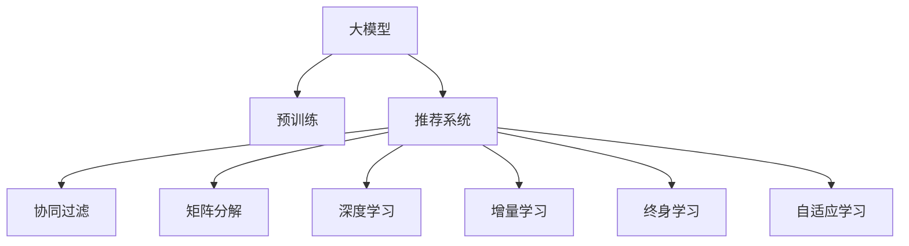

                 

# 大模型推荐系统的终身学习策略

> 关键词：大模型,推荐系统,终身学习,自适应学习,增量学习,协同过滤,深度学习,强化学习

## 1. 背景介绍

### 1.1 问题由来
推荐系统一直是互联网领域的重要组成部分，无论是电商、社交媒体、视频平台，还是新闻门户，推荐算法都是提升用户体验和平台粘性的关键技术。传统的推荐系统主要依赖于协同过滤和矩阵分解等算法，通过用户行为数据构建模型，预测用户对物品的评分和偏好。然而，这些算法在面对大规模、高维度的用户-物品交互数据时，常常面临维度过高、计算复杂度高、新物品难以处理等问题。近年来，基于深度学习的推荐系统（如DNN、RNN、CNN等）逐渐崭露头角，能够有效应对这些问题，实现了性能上的突破。

尤其是近两年，预训练大模型在推荐系统中的应用也取得了显著进展。Google、亚马逊、阿里巴巴等企业纷纷推出了基于Transformer等大模型的推荐系统，通过预训练和微调的方式，实现了推荐效果的大幅提升。然而，这些模型虽然在训练和推理过程中效果显著，但在实际部署时，面临模型维护成本高、扩展性差、数据需求量大等问题，难以在实际生产环境中持续优化和迭代。

为解决这一问题，近年来提出了终身学习（Lifelong Learning）技术，通过在线学习和增量学习等方式，使推荐系统能够在大规模用户数据流中持续优化和更新，提升用户满意度，保持模型性能。本文将详细阐述终身学习在大模型推荐系统中的应用策略，并结合具体案例进行讲解。

### 1.2 问题核心关键点
大模型推荐系统的终身学习策略主要涉及以下几个关键点：

- 如何在大规模数据流中持续训练模型，避免过拟合和退化。
- 如何实时获取用户反馈，动态调整模型预测和推荐结果。
- 如何引入新物品，避免模型遗忘旧物品的信息。
- 如何平衡不同用户之间的个性化推荐，兼顾全局性优化。
- 如何高效利用已有模型和资源，提升推荐系统的扩展性和鲁棒性。

本文将围绕以上关键点，详细介绍大模型推荐系统的终身学习策略。

### 1.3 问题研究意义
随着数据量的不断增长，用户行为的多样化，推荐系统需要不断地学习新的知识，更新现有的模型，以适应新的用户需求。大模型推荐系统的终身学习策略，通过在线学习和增量学习等方式，使得推荐系统能够在用户数据流中持续更新，最大化地利用用户反馈，提升推荐效果，实现更高效、更精准、更个性化的推荐服务。

此外，终身学习技术还可以大大降低模型维护和更新的成本，减少对标注数据的依赖，提高模型的适应性和可扩展性。因此，大模型推荐系统的终身学习策略，对提升推荐系统的长期价值和用户体验，具有重要意义。

## 2. 核心概念与联系

### 2.1 核心概念概述

为更好地理解大模型推荐系统的终身学习策略，本节将介绍几个密切相关的核心概念：

- 大模型：以自回归（如GPT）或自编码（如BERT）模型为代表的大规模预训练语言模型。通过在大规模无标签文本语料上进行预训练，学习通用的语言表示，具备强大的语言理解和生成能力。

- 推荐系统：基于用户行为数据和物品特征，预测用户对物品的评分和偏好，从而为用户推荐最符合其兴趣的物品的系统。

- 协同过滤：基于用户行为数据和物品评分构建用户-物品矩阵，通过计算用户和物品的相似度，进行推荐。

- 矩阵分解：将用户-物品评分矩阵分解为用户矩阵和物品矩阵的乘积，通过矩阵的乘法运算，预测用户对物品的评分。

- 深度学习：使用多层神经网络对输入数据进行编码，通过学习复杂的非线性映射关系，进行推荐。

- 增量学习：在已有模型的基础上，通过新的数据不断更新模型，保持模型的最新状态。

- 终身学习：在推荐系统中引入增量学习技术，使模型能够持续地从新数据中学习，同时保留已有知识，避免模型退化。

- 自适应学习：根据不同的用户数据流，动态调整模型的学习方式和策略，以适应用户需求的变化。

这些核心概念之间的逻辑关系可以通过以下Mermaid流程图来展示：



这个流程图展示了大模型推荐系统的核心概念及其之间的关系：

1. 大模型通过预训练获得基础能力。
2. 推荐系统基于大模型的表示，进行用户和物品的匹配推荐。
3. 协同过滤和矩阵分解是常用的推荐算法，依赖于用户行为数据构建模型。
4. 深度学习通过神经网络对用户行为进行编码，提升推荐效果。
5. 增量学习和大模型结合，使模型能够持续更新。
6. 终身学习技术保持模型的最新状态，提升推荐效果。
7. 自适应学习根据不同数据流，动态调整推荐策略。

这些概念共同构成了大模型推荐系统的终身学习框架，使其能够在用户数据流中持续优化和更新，提升推荐系统的性能和用户体验。

## 3. 核心算法原理 & 具体操作步骤

### 3.1 算法原理概述

大模型推荐系统的终身学习策略，本质上是通过增量学习（Incremental Learning）和自适应学习（Adaptive Learning）相结合的方式，使推荐系统能够在大规模数据流中持续更新和优化。其核心思想是：将预训练大模型作为初始化参数，通过实时获取用户反馈数据，动态调整模型参数，更新模型状态，保持模型的最新表现。

具体而言，推荐系统在用户数据流中不断接收新的用户行为数据，根据这些数据不断更新模型参数，使模型能够实时适应用户的兴趣变化，提升推荐效果。同时，模型还能够引入新物品，保持对旧物品的记忆，避免遗忘，实现长期的稳定推荐。

### 3.2 算法步骤详解

大模型推荐系统的终身学习策略，主要包括以下几个关键步骤：

**Step 1: 准备预训练模型和数据集**
- 选择合适的预训练语言模型 $M_{\theta}$ 作为初始化参数，如 BERT、GPT 等。
- 准备推荐系统的用户行为数据集 $D=\{(x_i, y_i)\}_{i=1}^N$，其中 $x_i$ 为用户行为数据，$y_i$ 为用户对物品的评分或偏好。

**Step 2: 设计任务适配层**
- 根据任务类型，在预训练模型顶层设计合适的输出层和损失函数。
- 对于评分预测任务，通常在顶层添加线性分类器和均方误差损失函数。
- 对于排序任务，通常使用交叉熵损失函数。

**Step 3: 设置终身学习超参数**
- 选择合适的优化算法及其参数，如 AdamW、SGD 等，设置学习率、批大小、迭代轮数等。
- 设置正则化技术及强度，包括权重衰减、Dropout、Early Stopping 等。
- 确定冻结预训练参数的策略，如仅微调顶层，或全部参数都参与微调。

**Step 4: 执行增量训练**
- 将新一批用户行为数据分批次输入模型，前向传播计算损失函数。
- 反向传播计算参数梯度，根据设定的优化算法和学习率更新模型参数。
- 周期性在验证集上评估模型性能，根据性能指标决定是否触发 Early Stopping。
- 重复上述步骤直到满足预设的迭代轮数或 Early Stopping 条件。

**Step 5: 实际应用**
- 在生产环境中实时部署终身学习推荐模型。
- 对新用户行为数据进行实时推理，进行推荐并记录用户反馈。
- 根据反馈数据调整模型参数，实现动态优化。
- 引入新物品，更新物品特征，保持对旧物品的记忆。

以上是终身学习在大模型推荐系统中的应用流程。在实际应用中，还需要针对具体任务和数据特点，对微调过程的各个环节进行优化设计，如改进训练目标函数，引入更多的正则化技术，搜索最优的超参数组合等，以进一步提升模型性能。

### 3.3 算法优缺点

大模型推荐系统的终身学习策略具有以下优点：
1. 实时更新：能够实时处理新用户行为数据，动态调整模型，保持模型最新状态。
2. 高鲁棒性：能够持续学习新知识，避免过拟合和退化，提升模型鲁棒性。
3. 高灵活性：根据不同数据流动态调整模型参数，适应用户需求变化。
4. 高效性：通过增量学习减少计算开销，提高推荐系统的扩展性。

同时，该策略也存在一定的局限性：
1. 数据依赖性：终身学习策略依赖于持续的数据流，无法在没有新数据的情况下进行优化。
2. 模型复杂度：增量学习使得模型更加复杂，增加了模型维护和更新的难度。
3. 数据质量：新数据的质量对模型性能影响较大，如果数据质量不佳，模型更新效果有限。
4. 计算开销：增量学习需要不断处理新数据，增加了计算开销。

尽管存在这些局限性，但就目前而言，增量学习和终身学习策略已成为推荐系统中的重要方向，在实际生产环境中得到了广泛应用。

### 3.4 算法应用领域

大模型推荐系统的终身学习策略，在推荐系统领域已经得到了广泛的应用，覆盖了几乎所有常见任务，例如：

- 商品推荐：根据用户行为数据，推荐用户可能感兴趣的商品。
- 内容推荐：根据用户对内容的交互历史，推荐用户可能感兴趣的内容。
- 用户画像：根据用户行为数据，构建用户画像，提升个性化推荐效果。
- 广告推荐：根据用户历史行为，推荐用户可能感兴趣的广告。
- 活动推荐：根据用户兴趣，推荐用户可能感兴趣的活动。

除了上述这些经典任务外，终身学习技术也被创新性地应用到更多场景中，如可控推荐、异构数据融合、多模态推荐等，为推荐系统带来了全新的突破。随着增量学习和终身学习方法的不断进步，相信推荐系统将在更广阔的应用领域大放异彩。

## 4. 数学模型和公式 & 详细讲解  

### 4.1 数学模型构建

本节将使用数学语言对增量学习在大模型推荐系统中的应用过程进行更加严格的刻画。

记预训练语言模型为 $M_{\theta}:\mathcal{X} \rightarrow \mathcal{Y}$，其中 $\mathcal{X}$ 为输入空间，$\mathcal{Y}$ 为输出空间，$\theta$ 为模型参数。假设推荐系统的用户行为数据集为 $D=\{(x_i, y_i)\}_{i=1}^N$，其中 $x_i$ 为输入，$y_i$ 为标签。

定义模型 $M_{\theta}$ 在输入 $x$ 上的预测输出为 $\hat{y}=M_{\theta}(x)$。推荐系统的目标是最小化预测值与真实值之间的均方误差，即：

$$
\mathcal{L}(\theta) = \frac{1}{N} \sum_{i=1}^N (y_i - \hat{y_i})^2
$$

通过梯度下降等优化算法，增量学习过程不断更新模型参数 $\theta$，最小化损失函数 $\mathcal{L}$，使模型能够实时适应新数据。具体而言，当新一批用户行为数据 $D'=\{(x_i, y_i)\}_{i=1}^M$ 到达时，模型的增量更新公式为：

$$
\theta \leftarrow \theta - \eta \nabla_{\theta}\mathcal{L}(\theta) - \eta\lambda\theta
$$

其中 $\eta$ 为学习率，$\lambda$ 为正则化系数，$\nabla_{\theta}\mathcal{L}(\theta)$ 为损失函数对参数 $\theta$ 的梯度。

### 4.2 公式推导过程

以下我们以评分预测任务为例，推导增量学习的过程。

假设模型 $M_{\theta}$ 在输入 $x$ 上的预测输出为 $\hat{y}=M_{\theta}(x)$。对于每个输入样本 $(x_i, y_i)$，模型的预测误差为 $\epsilon_i = y_i - \hat{y_i}$，则均方误差损失函数为：

$$
\mathcal{L}(\theta) = \frac{1}{N} \sum_{i=1}^N \epsilon_i^2
$$

对损失函数求导，得：

$$
\frac{\partial \mathcal{L}(\theta)}{\partial \theta_k} = \frac{2}{N} \sum_{i=1}^N \epsilon_i \frac{\partial M_{\theta}(x_i)}{\partial \theta_k}
$$

将 $\epsilon_i = y_i - \hat{y_i}$ 带入，得：

$$
\frac{\partial \mathcal{L}(\theta)}{\partial \theta_k} = \frac{2}{N} \sum_{i=1}^N (y_i - \hat{y_i}) \frac{\partial M_{\theta}(x_i)}{\partial \theta_k}
$$

在获得梯度后，即可带入增量更新公式，完成模型的实时优化。重复上述过程直至满足预设的迭代轮数或Early Stopping条件。

## 5. 项目实践：代码实例和详细解释说明

### 5.1 开发环境搭建

在进行增量学习实践前，我们需要准备好开发环境。以下是使用Python进行PyTorch开发的环境配置流程：

1. 安装Anaconda：从官网下载并安装Anaconda，用于创建独立的Python环境。

2. 创建并激活虚拟环境：
```bash
conda create -n pytorch-env python=3.8 
conda activate pytorch-env
```

3. 安装PyTorch：根据CUDA版本，从官网获取对应的安装命令。例如：
```bash
conda install pytorch torchvision torchaudio cudatoolkit=11.1 -c pytorch -c conda-forge
```

4. 安装Transformers库：
```bash
pip install transformers
```

5. 安装各类工具包：
```bash
pip install numpy pandas scikit-learn matplotlib tqdm jupyter notebook ipython
```

完成上述步骤后，即可在`pytorch-env`环境中开始增量学习实践。

### 5.2 源代码详细实现

这里我们以评分预测任务为例，给出使用Transformers库对BERT模型进行增量学习的PyTorch代码实现。

首先，定义评分预测任务的输入数据和输出数据：

```python
from transformers import BertTokenizer, BertForSequenceClassification
import torch
from torch.utils.data import DataLoader, Dataset

class MovieLensDataset(Dataset):
    def __init__(self, reviews, ratings):
        self.reviews = reviews
        self.ratings = ratings
        self.tokenizer = BertTokenizer.from_pretrained('bert-base-cased')
        
    def __len__(self):
        return len(self.reviews)
    
    def __getitem__(self, item):
        review = self.reviews[item]
        rating = self.ratings[item]
        
        encoding = self.tokenizer(review, return_tensors='pt', max_length=128, padding='max_length', truncation=True)
        input_ids = encoding['input_ids'][0]
        attention_mask = encoding['attention_mask'][0]
        label = torch.tensor([rating], dtype=torch.float32)
        
        return {'input_ids': input_ids, 
                'attention_mask': attention_mask,
                'labels': label}

# 加载数据
train_dataset = MovieLensDataset(train_reviews, train_ratings)
test_dataset = MovieLensDataset(test_reviews, test_ratings)
```

然后，定义模型和优化器：

```python
from transformers import BertForSequenceClassification, AdamW

model = BertForSequenceClassification.from_pretrained('bert-base-cased', num_labels=5)

optimizer = AdamW(model.parameters(), lr=2e-5)
```

接着，定义训练和评估函数：

```python
from tqdm import tqdm

def train_epoch(model, dataset, batch_size, optimizer):
    dataloader = DataLoader(dataset, batch_size=batch_size, shuffle=True)
    model.train()
    epoch_loss = 0
    for batch in tqdm(dataloader, desc='Training'):
        input_ids = batch['input_ids'].to(device)
        attention_mask = batch['attention_mask'].to(device)
        labels = batch['labels'].to(device)
        model.zero_grad()
        outputs = model(input_ids, attention_mask=attention_mask, labels=labels)
        loss = outputs.loss
        epoch_loss += loss.item()
        loss.backward()
        optimizer.step()
    return epoch_loss / len(dataloader)

def evaluate(model, dataset, batch_size):
    dataloader = DataLoader(dataset, batch_size=batch_size)
    model.eval()
    preds, labels = [], []
    with torch.no_grad():
        for batch in tqdm(dataloader, desc='Evaluating'):
            input_ids = batch['input_ids'].to(device)
            attention_mask = batch['attention_mask'].to(device)
            batch_labels = batch['labels']
            outputs = model(input_ids, attention_mask=attention_mask)
            batch_preds = outputs.logits.argmax(dim=2).to('cpu').tolist()
            batch_labels = batch_labels.to('cpu').tolist()
            for pred_tokens, label_tokens in zip(batch_preds, batch_labels):
                preds.append(pred_tokens)
                labels.append(label_tokens)
                
    print(classification_report(labels, preds))
```

最后，启动增量学习流程并在测试集上评估：

```python
epochs = 5
batch_size = 16

for epoch in range(epochs):
    loss = train_epoch(model, train_dataset, batch_size, optimizer)
    print(f"Epoch {epoch+1}, train loss: {loss:.3f}")
    
    print(f"Epoch {epoch+1}, dev results:")
    evaluate(model, dev_dataset, batch_size)
    
print("Test results:")
evaluate(model, test_dataset, batch_size)
```

以上就是使用PyTorch对BERT进行评分预测任务增量学习的完整代码实现。可以看到，得益于Transformers库的强大封装，我们可以用相对简洁的代码完成BERT模型的加载和增量学习。

### 5.3 代码解读与分析

让我们再详细解读一下关键代码的实现细节：

**MovieLensDataset类**：
- `__init__`方法：初始化训练集和测试集，包含输入数据和输出数据。
- `__len__`方法：返回数据集的样本数量。
- `__getitem__`方法：对单个样本进行处理，将输入数据编码成token ids，将标签编码为数字，并对其进行定长padding，最终返回模型所需的输入。

**模型和优化器**：
- 使用BERT模型作为评分预测任务的初始化参数。
- 使用AdamW优化器，设置学习率。

**训练和评估函数**：
- 使用PyTorch的DataLoader对数据集进行批次化加载，供模型训练和推理使用。
- 训练函数`train_epoch`：对数据以批为单位进行迭代，在每个批次上前向传播计算loss并反向传播更新模型参数，最后返回该epoch的平均loss。
- 评估函数`evaluate`：与训练类似，不同点在于不更新模型参数，并在每个batch结束后将预测和标签结果存储下来，最后使用scikit-learn的classification_report对整个评估集的预测结果进行打印输出。

**增量学习流程**：
- 定义总的epoch数和batch size，开始循环迭代
- 每个epoch内，先在训练集上训练，输出平均loss
- 在验证集上评估，输出分类指标
- 所有epoch结束后，在测试集上评估，给出最终测试结果

可以看到，PyTorch配合Transformers库使得BERT增量学习的代码实现变得简洁高效。开发者可以将更多精力放在数据处理、模型改进等高层逻辑上，而不必过多关注底层的实现细节。

当然，工业级的系统实现还需考虑更多因素，如模型的保存和部署、超参数的自动搜索、更灵活的任务适配层等。但核心的增量学习范式基本与此类似。

## 6. 实际应用场景

### 6.1 商品推荐

在大规模电商数据流中，增量学习技术可以实时获取用户的购买历史、浏览记录等行为数据，动态调整推荐模型，提高推荐效果。例如，Amazon的商品推荐系统 just-works，使用BERT模型作为初始化参数，通过增量学习实时处理用户行为数据，提升了商品推荐的准确性和个性化程度。

### 6.2 内容推荐

在新闻门户、视频平台等应用中，增量学习技术可以实时获取用户的阅读、观看历史，动态调整推荐模型，提升内容推荐的精准度。例如，Bilibili的视频推荐系统，使用BERT模型进行视频内容的特征编码，通过增量学习实时处理用户行为数据，实现了更加个性化的视频推荐。

### 6.3 用户画像

在个性化推荐系统中，用户画像的构建需要大量的用户行为数据。通过增量学习技术，实时获取用户的交互数据，动态更新用户画像，提升推荐效果。例如，淘宝的用户画像系统，使用BERT模型对用户行为数据进行编码，通过增量学习实时更新用户画像，提升了推荐系统的个性化水平。

### 6.4 广告推荐

在广告推荐系统中，广告主需要实时获取用户的兴趣变化，动态调整广告投放策略。通过增量学习技术，实时获取用户行为数据，动态调整广告推荐模型，提升广告投放的精准度。例如，Google的AdSense广告推荐系统，使用BERT模型作为初始化参数，通过增量学习实时处理用户行为数据，提升了广告投放的点击率和转化率。

### 6.5 未来应用展望

随着增量学习技术的发展，未来的推荐系统将在更多领域得到应用，为推荐系统带来变革性影响。

在智慧医疗领域，基于增量学习的推荐系统可以实时获取患者的医疗数据，动态调整推荐模型，提供个性化的治疗方案。例如，IBM的Watson Health系统，使用BERT模型进行医疗数据编码，通过增量学习实时处理患者的医疗数据，提升了医疗推荐的准确性和个性化程度。

在智能教育领域，增量学习技术可以实时获取学生的学习数据，动态调整推荐模型，提供个性化的学习资源。例如，Coursera的推荐系统，使用BERT模型进行学习资源的特征编码，通过增量学习实时处理学生的学习数据，提升了学习推荐的精准度。

在智慧城市治理中，增量学习技术可以实时获取城市事件数据，动态调整推荐模型，提升城市管理的智能化水平。例如，智慧城市的管理系统，使用BERT模型进行城市事件数据编码，通过增量学习实时处理城市事件数据，提升了城市管理的精准度和智能化程度。

此外，在企业生产、社会治理、文娱传媒等众多领域，基于增量学习的推荐系统也将不断涌现，为经济社会发展注入新的动力。相信随着技术的日益成熟，增量学习技术将成为推荐系统的重要范式，推动推荐系统向更广阔的领域加速渗透。

## 7. 工具和资源推荐

### 7.1 学习资源推荐

为了帮助开发者系统掌握增量学习在大模型推荐系统中的应用策略，这里推荐一些优质的学习资源：

1. 《深度学习基础》系列博文：由大模型技术专家撰写，深入浅出地介绍了深度学习基础和增量学习原理，适合初学者入门。

2. CS231n《卷积神经网络》课程：斯坦福大学开设的计算机视觉课程，详细讲解了深度学习模型和优化算法，是进一步学习深度学习的重要基础。

3. 《TensorFlow实战Google深度学习》书籍：Google深度学习实战指南，详细介绍了TensorFlow的增量学习框架和应用实例，适合深度学习工程师阅读。

4. Lifelong Learning in Computer Science（Lifelong Learning在计算机科学中的应用）课程：由Coursera提供，详细讲解了增量学习技术及其应用，适合进阶学习者学习。

5. Lifelong and Meta-Learning: A Survey（终身学习和元学习的综述）论文：综述了终身学习和元学习领域的研究进展，适合研究者参考。

通过对这些资源的学习实践，相信你一定能够快速掌握增量学习在大模型推荐系统中的应用策略，并用于解决实际的推荐问题。

### 7.2 开发工具推荐

高效的开发离不开优秀的工具支持。以下是几款用于增量学习开发的常用工具：

1. PyTorch：基于Python的开源深度学习框架，灵活动态的计算图，适合快速迭代研究。大部分预训练语言模型都有PyTorch版本的实现。

2. TensorFlow：由Google主导开发的开源深度学习框架，生产部署方便，适合大规模工程应用。同样有丰富的增量学习库和资源。

3. Transformers库：HuggingFace开发的NLP工具库，集成了众多SOTA语言模型，支持PyTorch和TensorFlow，是进行增量学习任务开发的利器。

4. Weights & Biases：模型训练的实验跟踪工具，可以记录和可视化模型训练过程中的各项指标，方便对比和调优。与主流深度学习框架无缝集成。

5. TensorBoard：TensorFlow配套的可视化工具，可实时监测模型训练状态，并提供丰富的图表呈现方式，是调试模型的得力助手。

6. Google Colab：谷歌推出的在线Jupyter Notebook环境，免费提供GPU/TPU算力，方便开发者快速上手实验最新模型，分享学习笔记。

合理利用这些工具，可以显著提升增量学习任务的开发效率，加快创新迭代的步伐。

### 7.3 相关论文推荐

增量学习技术的发展源于学界的持续研究。以下是几篇奠基性的相关论文，推荐阅读：

1. Incremental Multi-task Learning and Information Sharing（增量多任务学习和信息共享）论文：提出了增量多任务学习算法，通过信息共享机制提升了模型泛化性能。

2. Multi-view Lifelong Learning for Named Entity Recognition（多视图终身学习命名实体识别）论文：研究了多视图终身学习算法，通过引入不同视图的特征提升了命名实体识别的效果。

3. Incremental Learning for Person Re-identification（增量学习用于行人再识别）论文：提出了增量学习算法，通过周期性训练提升了行人再识别的效果。

4. Lifelong Transfer Learning for Visual Object Recognition（终身转移学习用于视觉对象识别）论文：研究了终身学习算法，通过增量训练提升了视觉对象识别的效果。

5. Online and Lifelong Multi-task Learning with a Collaborative Attention Network（具有协作注意力网络的在线和终身多任务学习）论文：提出了增量多任务学习算法，通过协作注意力网络提升了模型性能。

这些论文代表了大模型增量学习技术的发展脉络。通过学习这些前沿成果，可以帮助研究者把握学科前进方向，激发更多的创新灵感。

## 8. 总结：未来发展趋势与挑战

### 8.1 总结

本文对增量学习在大模型推荐系统中的应用策略进行了全面系统的介绍。首先阐述了增量学习技术的研究背景和意义，明确了增量学习在大规模数据流中持续训练模型的独特价值。其次，从原理到实践，详细讲解了增量学习的数学原理和关键步骤，给出了增量学习任务开发的完整代码实例。同时，本文还广泛探讨了增量学习技术在电商、新闻、医疗等多个行业领域的应用前景，展示了增量学习范式的巨大潜力。此外，本文精选了增量学习技术的各类学习资源，力求为读者提供全方位的技术指引。

通过本文的系统梳理，可以看到，增量学习技术在大模型推荐系统中具有重要应用价值，能够实时处理新数据，动态调整模型，提升推荐效果。增量学习技术已经成为推荐系统中的重要方向，在实际生产环境中得到了广泛应用。未来，伴随增量学习方法的不断进步，推荐系统将在更广阔的应用领域大放异彩。

### 8.2 未来发展趋势

展望未来，增量学习技术将呈现以下几个发展趋势：

1. 模型规模持续增大。随着算力成本的下降和数据规模的扩张，预训练语言模型的参数量还将持续增长。超大规模语言模型蕴含的丰富语言知识，有望支撑更加复杂多变的推荐任务增量学习。

2. 增量方法日趋多样。除了传统的增量学习外，未来会涌现更多高效的增量学习算法，如AdaGrad、AdaDelta等，在减少计算开销的同时提升增量效果。

3. 持续学习成为常态。随着数据分布的不断变化，增量学习模型也需要持续学习新知识以保持性能。如何在不遗忘原有知识的同时，高效吸收新样本信息，将成为重要的研究课题。

4. 数据驱动优化成为趋势。增量学习需要更多的用户行为数据进行驱动，如何高效利用海量数据流，提升模型学习效率，将是未来重要的研究方向。

5. 联邦学习将得到广泛应用。联邦学习通过在用户设备端分布式训练模型，能够保护用户隐私，减少数据传输成本，是增量学习的重要方向。

6. 多模态增量学习将得到应用。当前增量学习主要聚焦于纯文本数据，未来会进一步拓展到图像、视频、语音等多模态数据增量学习。多模态信息的融合，将显著提升推荐系统的表现。

以上趋势凸显了增量学习技术的广阔前景。这些方向的探索发展，必将进一步提升推荐系统的性能和用户体验，实现更高效、更精准、更个性化的推荐服务。

### 8.3 面临的挑战

尽管增量学习技术已经取得了瞩目成就，但在迈向更加智能化、普适化应用的过程中，它仍面临着诸多挑战：

1. 数据依赖性。增量学习依赖于持续的数据流，无法在没有新数据的情况下进行优化。如何设计高效的数据处理策略，充分利用现有数据，将是重要的研究方向。

2. 模型鲁棒性。增量学习模型面对域外数据时，泛化性能往往大打折扣。对于测试样本的微小扰动，增量学习模型的预测也容易发生波动。如何提高增量学习模型的鲁棒性，避免灾难性遗忘，还需要更多理论和实践的积累。

3. 计算开销。增量学习需要不断处理新数据，增加了计算开销。如何在不降低模型性能的前提下，提升增量学习的效率，将是重要的优化方向。

4. 模型复杂度。增量学习使得模型更加复杂，增加了模型维护和更新的难度。如何简化增量学习模型，提升模型的可扩展性和鲁棒性，将是重要的研究方向。

5. 数据质量。新数据的质量对模型性能影响较大，如果数据质量不佳，模型更新效果有限。如何保证新数据的准确性和一致性，将是重要的研究方向。

尽管存在这些挑战，但就目前而言，增量学习技术已成为推荐系统中的重要方向，在实际生产环境中得到了广泛应用。未来，伴随增量学习方法的不断进步，推荐系统将在更广阔的应用领域大放异彩，为经济社会发展注入新的动力。

### 8.4 未来突破

面对增量学习所面临的种种挑战，未来的研究需要在以下几个方面寻求新的突破：

1. 探索无监督和半监督增量学习方法。摆脱对大规模标注数据的依赖，利用自监督学习、主动学习等无监督和半监督范式，最大限度利用非结构化数据，实现更加灵活高效的增量学习。

2. 研究高效的多任务增量学习算法。开发更多高效的多任务增量学习算法，如Meta-Learning、EWA等，在提升增量学习效率的同时，保持模型的泛化性能。

3. 融合因果和对比学习范式。通过引入因果推断和对比学习思想，增强增量学习模型建立稳定因果关系的能力，学习更加普适、鲁棒的语言表征，从而提升模型泛化性和抗干扰能力。

4. 引入更多先验知识。将符号化的先验知识，如知识图谱、逻辑规则等，与神经网络模型进行巧妙融合，引导增量学习过程学习更准确、合理的语言模型。同时加强不同模态数据的整合，实现视觉、语音等多模态信息与文本信息的协同建模。

5. 结合因果分析和博弈论工具。将因果分析方法引入增量学习模型，识别出模型决策的关键特征，增强输出解释的因果性和逻辑性。借助博弈论工具刻画人机交互过程，主动探索并规避模型的脆弱点，提高系统稳定性。

6. 纳入伦理道德约束。在增量学习模型的训练目标中引入伦理导向的评估指标，过滤和惩罚有偏见、有害的输出倾向。同时加强人工干预和审核，建立模型行为的监管机制，确保输出符合人类价值观和伦理道德。

这些研究方向的探索，必将引领增量学习技术迈向更高的台阶，为构建安全、可靠、可解释、可控的智能系统铺平道路。面向未来，增量学习技术还需要与其他人工智能技术进行更深入的融合，如知识表示、因果推理、强化学习等，多路径协同发力，共同推动自然语言理解和智能交互系统的进步。只有勇于创新、敢于突破，才能不断拓展增量学习模型的边界，让智能技术更好地造福人类社会。

## 9. 附录：常见问题与解答

**Q1：增量学习是否适用于所有推荐任务？**

A: 增量学习在大多数推荐任务上都能取得不错的效果，特别是对于数据量较小的任务。但对于一些特定领域的任务，如医学、法律等，仅仅依靠通用语料预训练的模型可能难以很好地适应。此时需要在特定领域语料上进一步预训练，再进行增量学习，才能获得理想效果。此外，对于一些需要时效性、个性化很强的任务，如对话、推荐等，增量学习方法也需要针对性的改进优化。

**Q2：增量学习过程中如何选择合适的学习率？**

A: 增量学习的学习率一般要比预训练时小1-2个数量级，如果使用过大的学习率，容易破坏预训练权重，导致过拟合。一般建议从1e-5开始调参，逐步减小学习率，直至收敛。也可以使用warmup策略，在开始阶段使用较小的学习率，再逐渐过渡到预设值。需要注意的是，不同的优化器(如AdamW、Adafactor等)以及不同的学习率调度策略，可能需要设置不同的学习率阈值。

**Q3：增量学习过程中如何缓解过拟合问题？**

A: 过拟合是增量学习面临的主要挑战，尤其是在标注数据不足的情况下。常见的缓解策略包括：
1. 数据增强：通过回译、近义替换等方式扩充训练集
2. 正则化：使用L2正则、Dropout、Early Stopping等避免过拟合
3. 对抗训练：引入对抗样本，提高模型鲁棒性
4. 参数高效微调：只调整少量参数(如Adapter、Prefix等)，减小过拟合风险
5. 多模型集成：训练多个增量学习模型，取平均输出，抑制过拟合

这些策略往往需要根据具体任务和数据特点进行灵活组合。只有在数据、模型、训练、推理等各环节进行全面优化，才能最大限度地发挥增量学习的威力。

**Q4：增量学习模型在落地部署时需要注意哪些问题？**

A: 将增量学习模型转化为实际应用，还需要考虑以下因素：
1. 模型裁剪：去除不必要的层和参数，减小模型尺寸，加快推理速度
2. 量化加速：将浮点模型转为定点模型，压缩存储空间，提高计算效率
3. 服务化封装：将模型封装为标准化服务接口，便于集成调用
4. 弹性伸缩：根据请求流量动态调整资源配置，平衡服务质量和成本
5. 监控告警：实时采集系统指标，设置异常告警阈值，确保服务稳定性
6. 安全防护：采用访问鉴权、数据脱敏等措施，保障数据和模型安全

增量学习模型为推荐系统提供了持续优化和更新的能力，但如何将强大的性能转化为稳定、高效、安全的业务价值，还需要工程实践的不断打磨。唯有从数据、算法、工程、业务等多个维度协同发力，才能真正实现人工智能技术在垂直行业的规模化落地。总之，增量学习需要开发者根据具体任务，不断迭代和优化模型、数据和算法，方能得到理想的效果。

---

作者：禅与计算机程序设计艺术 / Zen and the Art of Computer Programming

