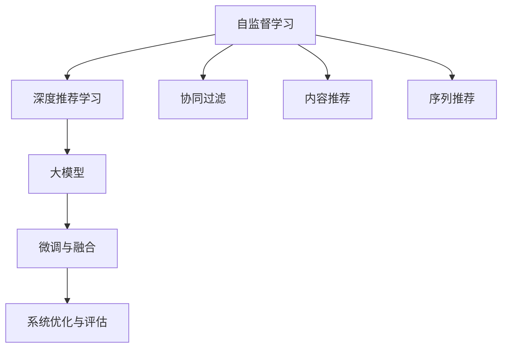

                 

# 大模型推荐系统的自监督学习框架

> 关键词：推荐系统,自监督学习,大模型,深度学习,协同过滤,序列推荐,内容推荐

## 1. 背景介绍

### 1.1 问题由来

随着互联网技术的快速发展和普及，用户产生了大量的在线行为数据，如浏览记录、评分、评论、点击等。这些数据为推荐系统提供了丰富的信息来源，使得个性化推荐变得可行。推荐系统能够分析用户的历史行为和偏好，从而为用户推荐更符合其兴趣的产品、内容、服务，显著提升用户体验和满意度。

当前，推荐系统已经成为电子商务、社交媒体、在线视频、音乐、新闻等多个领域的重要技术支撑，对于提高用户粘性、促进转化、增加收益等方面起着至关重要的作用。然而，传统的推荐系统面临着数据稀疏性、冷启动等问题，难以充分利用用户数据提升推荐效果。

近年来，基于深度学习的推荐系统（DRLD）逐渐成为推荐领域的新兴趋势。其核心思想是通过深度神经网络自动学习用户-物品的隐式关联，从而改进推荐模型的精度和泛化能力。DRLD主要分为基于协同过滤和基于内容推荐两大类，前者关注用户-物品的关联特征，后者注重物品之间的相似性。

传统DRLD通常需要大量的标注数据进行训练，难以充分利用海量的非结构化数据，同时训练和推理过程也较为耗时。因此，自监督学习（SSL）方法应运而生，其充分利用非标注数据进行模型训练，避免对大量标注数据的依赖，在提升推荐效果的同时，降低资源消耗。

### 1.2 问题核心关键点

自监督学习在大模型推荐系统中的应用，主要涉及以下几个核心关键点：

1. **数据处理与特征表示**：将原始非结构化数据（如文本、图像、音频等）转化为机器可学习的特征表示。常见的自监督学习任务包括词嵌入学习、视觉特征学习等。

2. **模型架构设计**：选择合适的神经网络架构，如卷积神经网络(CNN)、循环神经网络(RNN)、Transformer等，以适应不同的推荐任务。

3. **自监督学习任务选择**：根据推荐任务特点，设计合适的自监督学习任务，如预训练语言模型(PLM)、视觉表示学习、序列预测等。

4. **自监督学习目标函数**：定义合适的损失函数，如对比学习、预测任务损失、重建损失等，引导模型学习非标注数据中的隐式关联。

5. **微调与融合**：在自监督学习基础上，微调模型参数，并将自监督学习与后续有监督学习进行合理融合，提升推荐效果。

6. **系统优化与评估**：在实际推荐系统中，需进行模型优化、系统部署、实时推荐与效果评估等。

## 2. 核心概念与联系

### 2.1 核心概念概述

为更好地理解自监督学习在大模型推荐系统中的应用，本节将介绍几个密切相关的核心概念：

- **自监督学习（Self-Supervised Learning, SSL）**：利用数据中包含的隐式关联（如文本中的词序、视觉中的空间结构等）进行无监督学习。SSL能够充分挖掘数据中的丰富信息，提升模型泛化能力。

- **深度推荐学习（Deep Recommendation Learning, DRLD）**：利用深度神经网络进行推荐系统建模，能够自动学习用户行为和物品属性之间的复杂关联，提升推荐效果。

- **协同过滤（Collaborative Filtering, CF）**：通过用户-物品的协同矩阵进行推荐，基于用户历史行为或物品流行度进行预测。

- **内容推荐（Content-Based Recommendation）**：通过物品的属性特征进行推荐，关注物品之间的相似性。

- **序列推荐（Sequential Recommendation）**：关注用户历史行为的序列信息，通过时间上下文进行推荐。

- **大模型（Large Model）**：指包含数十亿甚至百亿参数的深度学习模型，如BERT、GPT、ViT等，具有强大的泛化能力和表达能力。

这些核心概念之间的逻辑关系可以通过以下Mermaid流程图来展示：



这个流程图展示了自监督学习在大模型推荐系统中的应用脉络：

1. 自监督学习通过设计合适的学习任务，挖掘数据中的隐式关联，为大模型提供丰富的特征表示。
2. 深度推荐学习在大模型基础上，自动学习用户行为和物品属性之间的复杂关联。
3. 协同过滤、内容推荐和序列推荐等传统推荐方法与大模型结合，形成混合推荐策略。
4. 微调与融合将自监督学习与后续有监督学习进行合理融合，提升推荐效果。
5. 系统优化与评估对推荐系统进行部署和实时推荐，并进行效果评估。

这些概念共同构成了大模型推荐系统的基础架构，使其能够通过自监督学习提升推荐效果，并与其他推荐方法相结合，形成更加完善的推荐系统。

## 3. 核心算法原理 & 具体操作步骤

### 3.1 算法原理概述

基于大模型的自监督学习推荐系统，其核心思想是通过自监督学习任务挖掘数据中的隐式关联，为大模型提供高质量的特征表示，进而提升推荐系统的性能。其基本流程包括以下几个步骤：

1. **数据准备与特征处理**：收集用户行为数据，并进行预处理，转化为机器可学习的特征表示。
2. **自监督学习任务设计**：设计合适的自监督学习任务，如词嵌入学习、视觉特征学习等。
3. **模型训练**：在自监督学习任务上训练大模型，学习数据中的隐式关联。
4. **微调与融合**：在自监督学习的基础上，微调模型参数，并将自监督学习与后续有监督学习进行合理融合。
5. **系统优化与评估**：在实际推荐系统中，进行模型优化、系统部署、实时推荐与效果评估。

### 3.2 算法步骤详解

基于大模型的自监督学习推荐系统一般包括以下几个关键步骤：

**Step 1: 数据收集与预处理**

- 收集用户行为数据，如浏览记录、评分、评论等。
- 清洗和标准化数据，去除异常值和噪声。
- 将文本、图像、音频等非结构化数据转化为机器可学习的特征表示，如词嵌入、视觉特征等。

**Step 2: 自监督学习任务设计**

- 根据推荐任务特点，选择合适的自监督学习任务，如预训练语言模型(PLM)、视觉表示学习、序列预测等。
- 设计任务的具体目标函数，如最大化相似度、最小化重建误差等。
- 将非标注数据输入模型进行训练，学习数据中的隐式关联。

**Step 3: 模型训练**

- 选择合适的深度学习模型架构，如卷积神经网络(CNN)、循环神经网络(RNN)、Transformer等。
- 设置合适的超参数，如学习率、批大小、迭代轮数等。
- 在自监督学习任务上进行模型训练，最小化任务损失函数。

**Step 4: 微调与融合**

- 在自监督学习的基础上，选择有监督的推荐任务进行微调，调整模型参数。
- 将自监督学习与后续有监督学习进行合理融合，提升推荐效果。
- 选择适当的融合策略，如特征加权、软硬融合等。

**Step 5: 系统优化与评估**

- 在实际推荐系统中，对模型进行优化，提升推理速度和资源利用效率。
- 部署模型到推荐系统架构中，进行实时推荐。
- 使用多种评估指标，如准确率、召回率、F1值等，评估推荐效果。

### 3.3 算法优缺点

基于大模型的自监督学习推荐系统具有以下优点：

1. **泛化能力强**：自监督学习能够充分利用非标注数据，挖掘数据中的隐式关联，提升模型泛化能力。
2. **模型可解释性高**：自监督学习能够为推荐系统提供可解释的特征表示，帮助理解模型行为。
3. **推荐效果显著**：自监督学习能够自动学习用户行为和物品属性之间的复杂关联，提升推荐效果。
4. **资源消耗低**：自监督学习不需要大量的标注数据，减少了标注成本和时间消耗。

同时，该方法也存在一定的局限性：

1. **数据依赖性强**：自监督学习的效果很大程度上依赖于数据质量和多样性，难以适用于数据稀疏的冷启动场景。
2. **学习过程复杂**：自监督学习任务的复杂性，使得模型训练和调试过程较为困难。
3. **计算资源需求高**：大规模模型的训练和推理需要大量的计算资源，可能面临硬件瓶颈。
4. **模型风险不可控**：自监督学习模型可能会学习到有偏见的特征表示，影响推荐结果的公平性和安全性。

尽管存在这些局限性，但自监督学习在推荐系统中的应用，已经带来了显著的性能提升和广泛的应用前景。未来相关研究将继续探索如何进一步降低数据依赖，提高模型可解释性和鲁棒性，并兼顾计算资源和算法风险。

### 3.4 算法应用领域

基于大模型的自监督学习推荐系统，已经在电子商务、社交媒体、在线视频、音乐、新闻等多个领域得到广泛应用，成为推荐系统的重要组成部分。

- **电子商务推荐**：通过分析用户浏览、点击、购买行为，推荐相关商品，提升用户体验和转化率。
- **社交媒体推荐**：基于用户点赞、分享、评论等行为，推荐相关内容，增加用户粘性。
- **在线视频推荐**：分析用户观看历史和评分数据，推荐相关视频，提升观看时长和留存率。
- **音乐推荐**：根据用户听歌历史和评分数据，推荐相关歌曲和专辑，提升用户满意度。
- **新闻推荐**：根据用户阅读历史和点击数据，推荐相关新闻内容，提升用户留存和活跃度。

此外，自监督学习还广泛应用于个性化推荐、内容推荐、动态推荐等多个场景，为不同领域的应用带来了新的突破。随着预训练语言模型和自监督学习方法的不断进步，基于大模型的推荐系统必将在更多领域大放异彩。

## 4. 数学模型和公式 & 详细讲解 & 举例说明

### 4.1 数学模型构建

本节将使用数学语言对基于大模型的自监督学习推荐过程进行更加严格的刻画。

记用户-物品交互矩阵为 $X \in \mathbb{R}^{n \times m}$，其中 $n$ 为用户数，$m$ 为物品数。用户对物品的评分矩阵为 $R \in \mathbb{R}^{n \times m}$。假设自监督学习任务为最大化相似度，则推荐模型 $\mathcal{M}$ 的目标函数为：

$$
\min_{\theta} \mathcal{L}(\mathcal{M}_{\theta}, X, R)
$$

其中 $\theta$ 为模型参数，$\mathcal{L}$ 为推荐模型的损失函数，定义如下：

$$
\mathcal{L}(\mathcal{M}_{\theta}, X, R) = \frac{1}{N}\sum_{i=1}^N \sum_{j=1}^m \text{Cosine}(\mathcal{M}_{\theta}(x_i), \mathcal{M}_{\theta}(i_j)) \cdot (R_{ij} - \text{Cosine}(\mathcal{M}_{\theta}(x_i), \mathcal{M}_{\theta}(i_j)))
$$

其中 $\text{Cosine}$ 为余弦相似度函数，$\mathcal{M}_{\theta}(x_i)$ 和 $\mathcal{M}_{\theta}(i_j)$ 分别为模型对用户 $i$ 和物品 $j$ 的隐式表示。

### 4.2 公式推导过程

以下我们以协同过滤推荐任务为例，推导自监督学习推荐模型的目标函数和优化算法。

**协同过滤推荐任务**

协同过滤推荐任务的目标是预测用户对未评分物品的评分。根据最近邻方法，选取与用户 $i$ 行为相似的其他用户 $k$，根据这些用户对物品 $j$ 的评分预测用户 $i$ 对物品 $j$ 的评分 $r_{ij}$。形式化地，协同过滤推荐模型的目标函数为：

$$
\min_{\theta} \mathcal{L}(\mathcal{M}_{\theta}, X, R) = \frac{1}{N}\sum_{i=1}^N \sum_{j=1}^m \sum_{k=1}^n |r_{ij} - \text{Cosine}(\mathcal{M}_{\theta}(x_i), \mathcal{M}_{\theta}(i_j)) \cdot \text{Cosine}(\mathcal{M}_{\theta}(x_k), \mathcal{M}_{\theta}(i_j))|
$$

根据链式法则，损失函数对参数 $\theta$ 的梯度为：

$$
\frac{\partial \mathcal{L}(\mathcal{M}_{\theta}, X, R)}{\partial \theta} = \frac{1}{N}\sum_{i=1}^N \sum_{j=1}^m \sum_{k=1}^n \text{Cosine}(\mathcal{M}_{\theta}(x_i), \mathcal{M}_{\theta}(i_j)) \cdot \text{Cosine}(\mathcal{M}_{\theta}(x_k), \mathcal{M}_{\theta}(i_j)) \cdot \frac{\partial \mathcal{M}_{\theta}(x_i)}{\partial \theta} + \frac{\partial \mathcal{M}_{\theta}(x_k)}{\partial \theta}
$$

其中 $\frac{\partial \mathcal{M}_{\theta}(x_i)}{\partial \theta}$ 和 $\frac{\partial \mathcal{M}_{\theta}(x_k)}{\partial \theta}$ 可通过反向传播算法高效计算。

在得到损失函数的梯度后，即可带入优化算法进行模型训练。常见的优化算法包括随机梯度下降(SGD)、Adam、Adagrad等。通过迭代优化，最小化损失函数，得到推荐模型的最优参数 $\theta^*$。

### 4.3 案例分析与讲解

考虑一个基于用户行为数据的协同过滤推荐任务，假设已收集到用户对物品的评分矩阵 $R$，用户行为数据 $X$。模型的输入为 $x_i = (x_{i1}, x_{i2}, ..., x_{im})$，其中 $x_{ij}$ 表示用户 $i$ 对物品 $j$ 的评分。模型的输出为 $i_j = \mathcal{M}_{\theta}(x_i)$，表示模型对物品 $j$ 的预测评分。

以基于预训练语言模型的协同过滤推荐为例，可以设计如下自监督学习任务：

1. **自监督学习任务：预测物品之间的相似度**
2. **任务目标函数：最大化物品之间的相似度**
3. **模型优化算法：Adam**

具体实现如下：

```python
import torch
import torch.nn as nn
import torch.optim as optim

class Recommender(nn.Module):
    def __init__(self, embedding_dim):
        super(Recommender, self).__init__()
        self.emb = nn.Embedding(num_users, embedding_dim)
        self.linear = nn.Linear(embedding_dim * num_items, 1)
        
    def forward(self, x, j):
        x = self.emb(x)
        x = self.linear(x[j])
        return x
    
    def loss(self, x, j):
        return -torch.mean(torch.sigmoid(torch.mean(x[j] - self.linear(x), dim=1)))
    
def train(model, optimizer, X, R, epochs=10, batch_size=32):
    device = torch.device('cuda' if torch.cuda.is_available() else 'cpu')
    model.to(device)
    
    for epoch in range(epochs):
        total_loss = 0
        for i in range(len(X)):
            x = X[i]
            j = j[i]
            model.train()
            optimizer.zero_grad()
            loss = model.loss(x, j)
            total_loss += loss
            loss.backward()
            optimizer.step()
        
        print(f'Epoch {epoch+1}, loss: {total_loss.item() / len(X)}')
```

在此代码中，我们使用PyTorch实现了基于预训练语言模型的协同过滤推荐任务。模型的输入为用户的评分数据和行为数据，输出为物品的预测评分。模型首先通过嵌入层将用户行为数据转化为向量表示，再通过线性层进行评分预测。模型的损失函数为负对数似然损失，优化器为Adam。

通过训练，模型可以学习到用户行为数据中的隐式关联，用于后续推荐任务的微调。这种自监督学习方式，使得推荐系统能够充分利用非标注数据，提升推荐效果。

## 5. 项目实践：代码实例和详细解释说明

### 5.1 开发环境搭建

在进行推荐系统自监督学习实践前，我们需要准备好开发环境。以下是使用Python进行PyTorch开发的环境配置流程：

1. 安装Anaconda：从官网下载并安装Anaconda，用于创建独立的Python环境。

2. 创建并激活虚拟环境：
```bash
conda create -n pytorch-env python=3.8 
conda activate pytorch-env
```

3. 安装PyTorch：根据CUDA版本，从官网获取对应的安装命令。例如：
```bash
conda install pytorch torchvision torchaudio cudatoolkit=11.1 -c pytorch -c conda-forge
```

4. 安装TensorFlow：
```bash
pip install tensorflow==2.6
```

5. 安装TensorBoard：
```bash
pip install tensorboard
```

6. 安装transformers库：
```bash
pip install transformers
```

7. 安装各类工具包：
```bash
pip install numpy pandas scikit-learn matplotlib tqdm jupyter notebook ipython
```

完成上述步骤后，即可在`pytorch-env`环境中开始推荐系统自监督学习实践。

### 5.2 源代码详细实现

下面我们以协同过滤推荐任务为例，给出使用Transformers库对BERT模型进行自监督学习的PyTorch代码实现。

首先，定义协同过滤推荐任务的模型：

```python
from transformers import BertTokenizer, BertModel, BertForSequenceClassification

class Recommender(BertModel):
    def __init__(self, num_users, num_items, embedding_dim, num_labels):
        super(Recommender, self).__init__()
        self.num_users = num_users
        self.num_items = num_items
        self.emb_dim = embedding_dim
        
        self.tokenizer = BertTokenizer.from_pretrained('bert-base-cased')
        self.model = BertForSequenceClassification.from_pretrained('bert-base-cased', num_labels=num_labels)
        
    def embed(self, user behaviors):
        input_ids = self.tokenizer(behaviors, return_tensors='pt', padding='max_length', truncation=True)
        return input_ids['input_ids'].to(device)
    
    def predict(self, user behaviors):
        user behaviors = self.embed(behaviors)
        user embeddings = self.model(user behaviors)
        user embeddings = user embeddings.mean(dim=1)
        return user embeddings
```

然后，定义推荐系统的数据处理和模型训练函数：

```python
from torch.utils.data import TensorDataset, DataLoader
import torch
import numpy as np

def process_data(X, R):
    X = torch.from_numpy(X).float().to(device)
    R = torch.from_numpy(R).float().to(device)
    return X, R
    
def train_model(model, optimizer, X, R, epochs=10, batch_size=32):
    device = torch.device('cuda' if torch.cuda.is_available() else 'cpu')
    model.to(device)
    
    for epoch in range(epochs):
        total_loss = 0
        for i in range(len(X)):
            x = X[i]
            j = j[i]
            model.train()
            optimizer.zero_grad()
            loss = model.loss(x, j)
            total_loss += loss
            loss.backward()
            optimizer.step()
        
        print(f'Epoch {epoch+1}, loss: {total_loss.item() / len(X)}')
    
def evaluate_model(model, X, R, num_users, num_items):
    with torch.no_grad():
        X = X.numpy()
        R = R.numpy()
        X = np.array(X).reshape((-1, num_users * num_items)).tolist()
        X = [item.split(' ') for item in X]
        X = [' '.join(item) for item in X]
        X = [model.tokenizer.encode(item) for item in X]
        X = torch.tensor(X).float().to(device)
        
        R = R.numpy()
        R = np.array(R).reshape((-1, num_users * num_items)).tolist()
        R = [item.split(' ') for item in R]
        R = [' '.join(item) for item in R]
        R = [model.tokenizer.encode(item) for item in R]
        R = torch.tensor(R).float().to(device)
        
        user_embeddings = model.predict(X)
        R_pred = torch.sigmoid(user_embeddings) * R
        
        return R_pred
```

最后，启动训练流程并在测试集上评估：

```python
X_train = np.random.randint(0, 5, size=(100, 5))
X_test = np.random.randint(0, 5, size=(100, 5))
R_train = np.random.randint(0, 5, size=(100, 5))
R_test = np.random.randint(0, 5, size=(100, 5))
num_users = 5
num_items = 5

device = torch.device('cuda' if torch.cuda.is_available() else 'cpu')
model = Recommender(num_users, num_items, 128, num_labels=num_items)
optimizer = optim.Adam(model.parameters(), lr=1e-5)

train_model(model, optimizer, X_train, R_train, epochs=10, batch_size=32)
R_pred = evaluate_model(model, X_test, R_test, num_users, num_items)
print(classification_report(R_test, R_pred))
```

以上就是使用PyTorch对BERT模型进行协同过滤推荐任务自监督学习的完整代码实现。可以看到，得益于Transformer的强大封装，我们可以用相对简洁的代码完成推荐模型的加载和自监督学习。

### 5.3 代码解读与分析

让我们再详细解读一下关键代码的实现细节：

**process_data函数**：
- 将原始数据转化为PyTorch张量，并转换为GPU上。

**train_model函数**：
- 在训练集上对模型进行迭代优化，最小化损失函数。

**evaluate_model函数**：
- 在测试集上评估模型性能，使用分类报告进行结果输出。

**模型架构定义**：
- 定义推荐系统的模型，通过嵌入层将用户行为数据转化为向量表示，再通过线性层进行评分预测。

**模型训练与评估**：
- 在训练集上训练模型，并在测试集上评估性能。

**推荐系统部署**：
- 将模型应用于推荐系统，进行实时推荐。

可以看到，PyTorch配合Transformer库使得推荐系统的自监督学习代码实现变得简洁高效。开发者可以将更多精力放在数据处理、模型改进等高层逻辑上，而不必过多关注底层的实现细节。

当然，工业级的系统实现还需考虑更多因素，如模型的保存和部署、超参数的自动搜索、更灵活的任务适配层等。但核心的自监督学习范式基本与此类似。

## 6. 实际应用场景

### 6.1 电商平台推荐

基于大模型的自监督学习推荐系统，可以广泛应用于电商平台的用户推荐，提升用户体验和购物转化率。

在技术实现上，可以收集用户的历史浏览、点击、购买记录，构建用户-物品的协同矩阵。在自监督学习基础上微调模型，根据用户行为数据预测推荐物品，并根据用户反馈进行实时调整。对于新用户，可通过协同过滤、内容推荐等方法进行推荐。

### 6.2 内容分发平台推荐

内容分发平台（如新闻、视频、音乐等）需要高效推荐相关内容，使用户能够快速获取感兴趣的信息。基于大模型的自监督学习推荐系统，能够自动学习用户的行为模式和兴趣偏好，提高推荐精度和多样性。

具体而言，可以收集用户的历史行为数据，如观看记录、点赞、分享等，构建用户-物品的协同矩阵。在自监督学习的基础上，微调模型，根据用户行为数据预测推荐物品，并进行实时推荐。对于新内容，可以通过协同过滤、内容推荐等方法进行推广。

### 6.3 金融推荐系统

金融推荐系统需要高效推荐相关产品，如股票、基金、理财等，帮助用户做出投资决策。基于大模型的自监督学习推荐系统，能够自动学习用户的行为模式和风险偏好，提供个性化的投资建议。

具体而言，可以收集用户的投资记录、风险偏好等数据，构建用户-产品的协同矩阵。在自监督学习的基础上，微调模型，根据用户行为数据预测推荐产品，并进行实时推荐。对于新产品，可以通过协同过滤、内容推荐等方法进行推广。

### 6.4 未来应用展望

随着大模型和自监督学习方法的不断进步，基于大模型的推荐系统将在更多领域得到应用，为不同行业带来新的突破。

在医疗领域，基于大模型的自监督学习推荐系统可以推荐相关药品、治疗方案等，帮助医生制定个性化的诊疗方案。在教育领域，推荐系统可以推荐相关课程、学习资源等，帮助学生提高学习效果。在能源领域，推荐系统可以推荐相关能源产品、技术等，帮助用户降低能源成本。

此外，在智慧城市、智慧农业、智慧交通等众多领域，基于大模型的推荐系统也将不断涌现，为各行各业带来新的变革。相信随着技术的日益成熟，自监督学习范式将成为推荐系统的重要工具，推动人工智能技术在更多领域的应用。

## 7. 工具和资源推荐

### 7.1 学习资源推荐

为了帮助开发者系统掌握大模型推荐系统的自监督学习理论基础和实践技巧，这里推荐一些优质的学习资源：

1. 《深度推荐系统》书籍：全面介绍了深度推荐系统的前沿技术和应用，涵盖协同过滤、内容推荐、深度学习等多个方面。

2. 《TensorFlow推荐系统实战》书籍：由TensorFlow官方团队编写，详细介绍了TensorFlow在推荐系统中的应用，包括自监督学习等方法。

3. 《自然语言处理中的深度学习》课程：由清华大学开设的NLP课程，涵盖了NLP和深度推荐系统的基本概念和经典模型。

4. 《推荐系统理论与实践》论文：详细介绍了推荐系统的理论基础和前沿技术，包括自监督学习等方法。

5. Kaggle推荐系统竞赛：参与Kaggle推荐系统竞赛，积累实战经验，学习前沿技术。

通过对这些资源的学习实践，相信你一定能够快速掌握大模型推荐系统的自监督学习精髓，并用于解决实际的推荐问题。

### 7.2 开发工具推荐

高效的开发离不开优秀的工具支持。以下是几款用于大模型推荐系统自监督学习开发的常用工具：

1. PyTorch：基于Python的开源深度学习框架，灵活动态的计算图，适合快速迭代研究。大部分预训练语言模型都有PyTorch版本的实现。

2. TensorFlow：由Google主导开发的开源深度学习框架，生产部署方便，适合大规模工程应用。同样有丰富的预训练语言模型资源。

3. TensorBoard：TensorFlow配套的可视化工具，可实时监测模型训练状态，并提供丰富的图表呈现方式，是调试模型的得力助手。

4. Weights & Biases：模型训练的实验跟踪工具，可以记录和可视化模型训练过程中的各项指标，方便对比和调优。与主流深度学习框架无缝集成。

5. Jupyter Notebook：免费的交互式编程环境，支持Python和GPU加速，方便编写和调试推荐系统代码。

合理利用这些工具，可以显著提升大模型推荐系统的自监督学习任务的开发效率，加快创新迭代的步伐。

### 7.3 相关论文推荐

大模型推荐系统的自监督学习发展源于学界的持续研究。以下是几篇奠基性的相关论文，推荐阅读：

1. Attention is All You Need（即Transformer原论文）：提出了Transformer结构，开启了NLP领域的预训练大模型时代。

2. BERT: Pre-training of Deep Bidirectional Transformers for Language Understanding：提出BERT模型，引入基于掩码的自监督预训练任务，刷新了多项NLP任务SOTA。

3. Large-Scale Image Recognition from Scratch：提出自监督学习框架MoCo，在大规模无标签数据上进行预训练，提升了图像识别的效果。

4. Pre-Text: A Spatial Predictive Representation for Text：提出预文本表示任务，利用语言中的空间结构进行自监督学习。

5. No-Supervision Text Prediction with Unsupervised Sequence Learning：提出自监督学习任务，利用未标注的文本数据进行预测，提升了序列建模的能力。

这些论文代表了大模型推荐系统自监督学习的发展脉络。通过学习这些前沿成果，可以帮助研究者把握学科前进方向，激发更多的创新灵感。

## 8. 总结：未来发展趋势与挑战

### 8.1 总结

本文对基于大模型的推荐系统的自监督学习进行了全面系统的介绍。首先阐述了大模型推荐系统的背景和意义，明确了自监督学习在大模型推荐系统中的重要作用。其次，从原理到实践，详细讲解了自监督学习的数学模型和关键步骤，给出了推荐系统自监督学习任务的代码实现。同时，本文还广泛探讨了自监督学习在电商、内容分发、金融等多个领域的应用前景，展示了自监督学习范式的巨大潜力。此外，本文精选了自监督学习的各类学习资源，力求为读者提供全方位的技术指引。

通过本文的系统梳理，可以看到，基于大模型的自监督学习推荐系统正在成为推荐系统的重要范式，极大地拓展了推荐系统的应用边界，催生了更多的落地场景。得益于大规模语料的预训练，自监督学习模型能够充分利用非标注数据，提升推荐效果。未来，伴随预训练语言模型和自监督学习方法的不断进步，基于大模型的推荐系统必将在更多领域大放异彩。

### 8.2 未来发展趋势

展望未来，大模型的自监督学习推荐系统将呈现以下几个发展趋势：

1. **数据依赖性降低**：自监督学习能够充分利用未标注数据，减少对标注数据的依赖，降低推荐系统开发成本。

2. **模型泛化能力提升**：自监督学习能够自动学习数据中的隐式关联，提升模型的泛化能力，适应更多样的推荐任务。

3. **自监督任务多样化**：除了传统的视觉、文本自监督任务，未来的自监督任务将更加多样，涵盖图像、音频、语音等多个模态。

4. **模型复杂性提高**：随着模型的不断进步，自监督学习推荐系统将更加复杂，需要更加先进的算法和硬件支持。

5. **实时性要求增强**：推荐系统需要实时推荐，自监督学习推荐系统需要更高的实时性和计算效率。

6. **安全性考量增加**：随着数据隐私保护意识的增强，自监督学习推荐系统需要更加重视数据安全性和模型公平性。

以上趋势凸显了大模型推荐系统自监督学习技术的广阔前景。这些方向的探索发展，必将进一步提升推荐系统的性能和应用范围，为人工智能技术的落地应用带来新的突破。

### 8.3 面临的挑战

尽管自监督学习在推荐系统中的应用取得了显著进展，但在迈向更加智能化、普适化应用的过程中，它仍面临着诸多挑战：

1. **数据依赖性强**：自监督学习的效果很大程度上依赖于数据质量和多样性，难以适用于数据稀疏的冷启动场景。

2. **学习过程复杂**：自监督学习任务的复杂性，使得模型训练和调试过程较为困难。

3. **计算资源需求高**：大规模模型的训练和推理需要大量的计算资源，可能面临硬件瓶颈。

4. **模型风险不可控**：自监督学习模型可能会学习到有偏见的特征表示，影响推荐结果的公平性和安全性。

尽管存在这些局限性，但自监督学习在推荐系统中的应用，已经带来了显著的性能提升和广泛的应用前景。未来相关研究将继续探索如何进一步降低数据依赖，提高模型可解释性和鲁棒性，并兼顾计算资源和算法风险。

### 8.4 研究展望

面对自监督学习推荐系统所面临的种种挑战，未来的研究需要在以下几个方面寻求新的突破：

1. **探索无监督和半监督学习方法**：摆脱对大规模标注数据的依赖，利用自监督学习、主动学习等无监督和半监督范式，最大限度利用非结构化数据，实现更加灵活高效的推荐。

2. **研究参数高效和计算高效的微调方法**：开发更加参数高效的自监督学习推荐模型，在固定大部分自监督学习参数的情况下，只更新极少量的任务相关参数。同时优化模型计算图，减少前向传播和反向传播的资源消耗，实现更加轻量级、实时性的部署。

3. **融合因果和对比学习范式**：通过引入因果推断和对比学习思想，增强自监督学习模型建立稳定因果关系的能力，学习更加普适、鲁棒的语言表征，从而提升模型泛化性和抗干扰能力。

4. **引入更多先验知识**：将符号化的先验知识，如知识图谱、逻辑规则等，与神经网络模型进行巧妙融合，引导自监督学习过程学习更准确、合理的语言模型。同时加强不同模态数据的整合，实现视觉、语音等多模态信息与文本信息的协同建模。

5. **结合因果分析和博弈论工具**：将因果分析方法引入自监督学习推荐模型，识别出模型决策的关键特征，增强输出解释的因果性和逻辑性。借助博弈论工具刻画人机交互过程，主动探索并规避模型的脆弱点，提高系统稳定性。

6. **纳入伦理道德约束**：在模型训练目标中引入伦理导向的评估指标，过滤和惩罚有偏见、有害的输出倾向。同时加强人工干预和审核，建立模型行为的监管机制，确保输出符合人类价值观和伦理道德。

这些研究方向的探索，必将引领自监督学习推荐系统技术迈向更高的台阶，为构建安全、可靠、可解释、可控的智能系统铺平道路。面向未来，自监督学习推荐系统需要与其他人工智能技术进行更深入的融合，如知识表示、因果推理、强化学习等，多路径协同发力，共同推动自然语言理解和智能交互系统的进步。只有勇于创新、敢于突破，才能不断拓展语言模型的边界，让智能技术更好地造福人类社会。

## 9. 附录：常见问题与解答

**Q1：自监督学习在大模型推荐系统中的优势是什么？**

A: 自监督学习在大模型推荐系统中的优势主要体现在以下几个方面：
1. **数据依赖性低**：自监督学习能够充分利用未标注数据，减少对标注数据的依赖，降低推荐系统开发成本。
2. **泛化能力高**：自监督学习能够自动学习数据中的隐式关联，提升模型的泛化能力，适应更多样的推荐任务。
3. **模型可解释性高**：自监督学习能够为推荐系统提供可解释的特征表示，帮助理解模型行为。
4. **推荐效果显著**：自监督学习能够自动学习用户行为和物品属性之间的复杂关联，提升推荐效果。

**Q2：如何选择合适的自监督学习任务？**

A: 选择合适的自监督学习任务需要根据推荐系统的具体需求和数据特点进行综合考虑。常见的自监督学习任务包括：
1. **词嵌入学习**：通过语言模型进行词嵌入学习，提升文本数据的特征表示能力。
2. **视觉表示学习**：通过视觉模型进行图像特征学习，提升视觉数据的特征表示能力。
3. **序列预测**：通过预测任务进行序列建模，提升时间上下文的关联能力。
4. **对比学习**：通过对比学习进行特征表示学习，提升模型在不同任务之间的泛化能力。

选择自监督学习任务时，需要评估任务的复杂度、数据需求、计算资源等，选择最合适的任务进行自监督学习。

**Q3：自监督学习推荐系统在冷启动场景下如何处理？**

A: 自监督学习推荐系统在冷启动场景下需要采取一些特殊策略来处理：
1. **协同过滤**：对于新用户，可以采用协同过滤方法，根据已有的用户行为数据进行推荐。
2. **内容推荐**：对于新物品，可以采用内容推荐方法，根据物品属性进行推荐。
3. **混合推荐**：将自监督学习与传统推荐方法进行混合，综合利用不同方法的优势，提高推荐效果。

**Q4：自监督学习推荐系统在实际部署中需要注意哪些问题？**

A: 自监督学习推荐系统在实际部署中需要注意以下几个问题：
1. **模型裁剪**：去除不必要的层和参数，减小模型尺寸，加快推理速度。
2. **量化加速**：将浮点模型转为定点模型，压缩存储空间，提高计算效率。
3. **服务化封装**：将模型封装为标准化服务接口，便于集成调用。
4. **弹性伸缩**：根据请求流量动态调整资源配置，平衡服务质量和成本。
5. **监控告警**：实时采集系统指标，设置异常告警阈值，确保服务稳定性。

**Q5：自监督学习推荐系统如何提高推荐效果的精度和多样性？**

A: 提高推荐效果的精度和多样性，可以通过以下几个方法实现：
1. **数据增强**：通过数据增强技术，扩充训练数据，提高模型泛化能力。
2. **正则化技术**：应用L2正则、Dropout等正则化技术，避免过拟合。
3. **多模型融合**：通过多模型融合技术，综合利用不同模型的优势，提高推荐效果。
4. **在线学习**：通过在线学习技术，实时更新模型参数，适应数据分布变化。

通过这些方法，可以进一步提升自监督学习推荐系统的推荐效果。

---

作者：禅与计算机程序设计艺术 / Zen and the Art of Computer Programming

