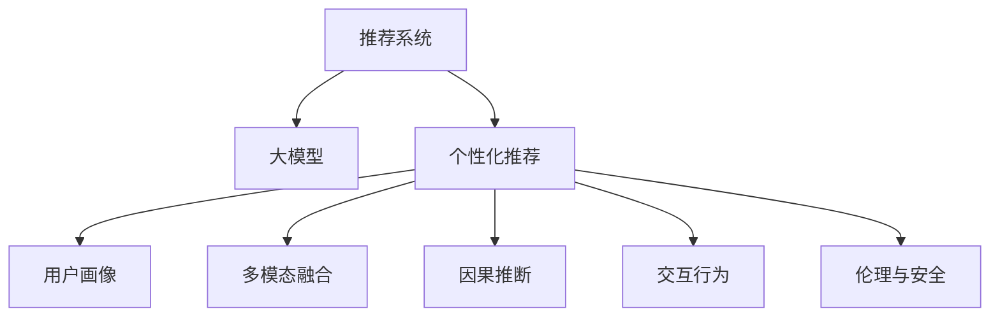

                 

# 大模型视角下推荐系统的人性化关怀提升新思路

> 关键词：推荐系统,大模型,个性化推荐,用户画像,多模态融合,因果推断,交互行为,伦理与安全

## 1. 背景介绍

### 1.1 问题由来

推荐系统是当前互联网应用中非常重要的一环，它可以根据用户的历史行为、兴趣偏好等，为用户推荐最符合其需求的物品。传统的推荐系统主要基于协同过滤、内容推荐、基于内容的推荐等方法，其核心在于挖掘用户行为数据中的潜在关联关系。然而，这些方法对用户隐私、数据稀疏性等问题考虑不足，导致推荐结果往往缺乏个性化的深度关怀。

近年来，随着大语言模型和大数据技术的发展，推荐系统也迎来了一次新的变革。基于大模型推荐系统可以通过对用户描述、文本、行为等多种数据进行深度融合，在用户画像构建、物品描述理解、推荐结果生成等方面获得更好的效果。此外，大模型还具备强大的语言生成能力，可以创造出更加自然、贴近用户需求的推荐结果。

但在大模型推荐系统的实践中，也存在着用户隐私保护、数据偏差、结果可解释性等诸多问题。这些问题亟需我们寻找新的解决方案，以提升推荐系统的人性化关怀。

## 2. 核心概念与联系

### 2.1 核心概念概述

为更好地理解大模型视角下的推荐系统，本节将介绍几个密切相关的核心概念：

- 推荐系统(Recommender System)：根据用户的行为、兴趣和物品的属性特征，为用户推荐物品的系统。常见的推荐系统包括基于协同过滤的推荐、基于内容的推荐、混合推荐等。

- 大模型(Large Model)：指以深度学习模型为代表的大规模预训练模型，如BERT、GPT、XLNet等。通过在大规模无标签数据上进行预训练，学习通用的语言表示，具备强大的语言理解和生成能力。

- 个性化推荐(Personalized Recommendation)：根据用户的个性化需求，推荐最符合其需求的物品。个性化推荐需要精准刻画用户画像，通过深度学习等技术，优化推荐算法。

- 用户画像(User Profile)：通过分析用户的历史行为、兴趣偏好、社交信息等，构建用户全面的特征向量，用于个性化推荐。

- 多模态融合(Multimodal Fusion)：通过融合文本、图像、声音、视频等多种数据源，全面刻画用户需求和物品特征，提升推荐系统的效果。

- 因果推断(Causal Inference)：通过因果推断技术，分析用户行为和推荐结果之间的因果关系，优化推荐算法。

- 交互行为(Interactive Behavior)：记录用户的交互历史和行为特征，用于动态调整推荐策略。

- 伦理与安全(Ethics & Security)：在推荐系统的开发和应用中，需要考虑用户隐私、数据安全、偏见消除等问题，以确保系统的公平性和安全性。

这些核心概念之间的逻辑关系可以通过以下Mermaid流程图来展示：



这个流程图展示了大模型视角下推荐系统的核心概念及其之间的关系：

1. 推荐系统通过大模型实现个性化推荐。
2. 个性化推荐需要构建详细的用户画像，融合多模态数据，并应用因果推断等技术。
3. 交互行为记录和用户隐私保护，需要在设计推荐算法时予以考虑。
4. 伦理与安全问题，是构建可信赖推荐系统的重要前提。

## 3. 核心算法原理 & 具体操作步骤
### 3.1 算法原理概述

基于大模型的推荐系统，其核心思想是利用大模型强大的语言理解和生成能力，深入挖掘用户画像和物品描述，生成更加符合用户个性化需求的推荐结果。具体而言，推荐系统由以下几个步骤组成：

1. **用户画像构建**：通过分析用户的浏览、点击、购买等行为数据，利用大模型学习用户的兴趣、偏好、需求等特征。
2. **物品描述生成**：利用大模型对物品的描述文本进行编码，提取物品的关键特征。
3. **推荐结果生成**：通过对比用户画像和物品特征，计算用户对物品的兴趣评分，并根据评分进行排序推荐。

### 3.2 算法步骤详解

#### 3.2.1 用户画像构建

用户画像的构建是推荐系统的基础，主要涉及以下几个步骤：

1. **数据收集**：从用户的历史行为数据中提取用户的浏览记录、点击记录、购买记录等，生成用户行为数据集。
2. **数据预处理**：对用户行为数据进行清洗、归一化、特征选择等预处理操作，确保数据的质量和可用性。
3. **特征编码**：利用大模型将用户行为数据转换为向量表示，生成用户画像特征向量。常用的编码方法包括使用预训练语言模型(如BERT)进行编码，或使用GNN网络进行图编码。

#### 3.2.2 物品描述生成

物品描述生成主要通过以下步骤：

1. **数据收集**：从电商、媒体等平台收集物品的标题、描述、标签、图片等数据，生成物品特征数据集。
2. **特征选择**：对物品特征数据进行特征选择，保留最具代表性、预测性强的特征。
3. **特征编码**：利用大模型对物品特征进行编码，生成物品特征向量。常用的编码方法包括使用预训练语言模型(如BERT)进行编码，或使用GNN网络进行图编码。

#### 3.2.3 推荐结果生成

推荐结果生成主要涉及以下几个步骤：

1. **相似度计算**：利用大模型计算用户画像向量与物品特征向量之间的相似度，生成用户对物品的兴趣评分。
2. **排序推荐**：根据用户的兴趣评分对物品进行排序，生成推荐结果。常用的排序方法包括基于评分加权排序、基于位置排序等。
3. **反馈调整**：根据用户对推荐结果的反馈数据，动态调整推荐策略，提升推荐效果。

### 3.3 算法优缺点

基于大模型的推荐系统具有以下优点：

1. **深度融合用户画像和物品描述**：通过大模型对用户行为和物品描述进行编码，能够全面、深入地刻画用户需求和物品特征，生成更加个性化的推荐结果。
2. **多模态融合**：大模型可以处理文本、图像、视频等多种数据源，通过多模态融合能够全面捕捉用户和物品的特征，提升推荐系统的效果。
3. **因果推断**：利用因果推断技术，能够分析用户行为和推荐结果之间的因果关系，优化推荐算法。

但同时也存在以下缺点：

1. **数据隐私问题**：大模型需要处理用户的浏览、点击等敏感数据，存在隐私泄露的风险。
2. **数据偏差**：如果用户数据存在偏差，会导致推荐结果不公平，无法满足少数群体的需求。
3. **结果可解释性**：大模型生成的推荐结果缺乏可解释性，用户难以理解推荐算法的工作机制和决策依据。

### 3.4 算法应用领域

基于大模型的推荐系统在多个领域已经得到了广泛的应用，如电子商务、社交媒体、新闻推荐等。以下是几个典型的应用场景：

#### 3.4.1 电子商务推荐

在电商领域，大模型推荐系统可以通过对用户浏览历史、购买记录、评价信息等数据的深度分析，生成个性化的商品推荐。通过多模态融合和因果推断等技术，大模型推荐系统能够更好地理解用户的购物意图，提高推荐的准确性和用户体验。

#### 3.4.2 新闻推荐

在新闻推荐系统中，大模型可以通过分析用户的阅读历史、点赞评论等行为数据，生成个性化的新闻推荐。大模型还能自动生成新闻标题、摘要，提升推荐结果的可读性和吸引力。

#### 3.4.3 社交媒体推荐

在社交媒体中，大模型推荐系统能够根据用户的兴趣和行为，推荐相关的文章、视频、话题等。通过多模态融合和交互行为记录等技术，大模型推荐系统能够实时调整推荐策略，提高推荐的及时性和个性化水平。

## 4. 数学模型和公式 & 详细讲解 & 举例说明

### 4.1 数学模型构建

基于大模型的推荐系统数学模型可以表示为：

$$
\begin{aligned}
\text{User Profile} &= f_{user}(\mathbf{D_u}) \\
\text{Item Description} &= f_{item}(\mathbf{D_i}) \\
\text{Recommendation} &= \arg \max_{i} \{ \text{similarity}(\text{User Profile}, \text{Item Description}_i) \cdot \text{weight}_i \}
\end{aligned}
$$

其中，$f_{user}$和$f_{item}$分别表示用户画像和物品描述的编码函数，$\mathbf{D_u}$和$\mathbf{D_i}$分别表示用户行为数据和物品特征数据，$\text{similarity}$表示用户画像和物品描述之间的相似度计算函数，$\text{weight}_i$表示物品$i$的权重，$R$表示最终的推荐结果。

### 4.2 公式推导过程

在推荐系统中，用户画像和物品描述的编码函数$f_{user}$和$f_{item}$通常使用预训练语言模型进行编码，例如BERT、GPT等。假设$f_{user}(\mathbf{D_u})$和$f_{item}(\mathbf{D_i})$分别输出用户画像向量$\mathbf{u}$和物品描述向量$\mathbf{v}$，则相似度计算函数$\text{similarity}(\mathbf{u}, \mathbf{v})$可以表示为：

$$
\text{similarity}(\mathbf{u}, \mathbf{v}) = \mathbf{u}^T \mathbf{v}
$$

其中$\mathbf{u}^T \mathbf{v}$表示用户画像向量和物品描述向量之间的点积，可以理解为相似度。

最终的推荐结果$R$可以表示为：

$$
R = \arg \max_{i} \{ \mathbf{u}^T \mathbf{v}_i \cdot \text{weight}_i \}
$$

其中$\mathbf{v}_i$表示物品$i$的特征向量，$\text{weight}_i$表示物品$i$的权重，可以用于控制不同物品对推荐结果的贡献度。

### 4.3 案例分析与讲解

以电商平台商品推荐为例，我们可以构建如下推荐系统：

1. **用户画像构建**：收集用户的浏览历史、购买记录等数据，使用BERT模型对用户行为数据进行编码，得到用户画像向量$\mathbf{u}$。
2. **物品描述生成**：收集商品的标题、描述、标签等数据，使用BERT模型对物品特征数据进行编码，得到物品描述向量$\mathbf{v}_i$。
3. **推荐结果生成**：计算用户画像向量$\mathbf{u}$与每个物品描述向量$\mathbf{v}_i$的点积，得到用户对每个商品的兴趣评分，并根据评分进行排序推荐。

## 5. 项目实践：代码实例和详细解释说明
### 5.1 开发环境搭建

在进行推荐系统开发前，我们需要准备好开发环境。以下是使用Python进行TensorFlow开发的环境配置流程：

1. 安装Anaconda：从官网下载并安装Anaconda，用于创建独立的Python环境。

2. 创建并激活虚拟环境：
```bash
conda create -n recommendation-env python=3.8 
conda activate recommendation-env
```

3. 安装TensorFlow：根据CUDA版本，从官网获取对应的安装命令。例如：
```bash
conda install tensorflow==2.8 tensorflow-addons==0.17.1 -c tf -c conda-forge
```

4. 安装Keras：
```bash
pip install keras
```

5. 安装各类工具包：
```bash
pip install numpy pandas scikit-learn matplotlib tqdm jupyter notebook ipython
```

完成上述步骤后，即可在`recommendation-env`环境中开始推荐系统开发。

### 5.2 源代码详细实现

这里我们以基于BERT模型的商品推荐系统为例，给出使用TensorFlow和Keras进行开发的PyTorch代码实现。

首先，定义商品推荐模型的框架：

```python
from tensorflow.keras.layers import Input, Dense, Embedding, Dot, Add
from tensorflow.keras.models import Model

# 定义输入
user_input = Input(shape=(768,), name='user_input')
item_input = Input(shape=(768,), name='item_input')

# 定义用户画像编码层
user_encoder = Dense(512, activation='relu', name='user_encoder')(user_input)

# 定义物品描述编码层
item_encoder = Dense(512, activation='relu', name='item_encoder')(item_input)

# 定义相似度计算层
similarity = Dot(axes=1, normalize=True, name='similarity')([user_encoder, item_encoder])

# 定义输出层
output = Add(name='output')([similarity, user_encoder])

# 构建模型
model = Model(inputs=[user_input, item_input], outputs=output)
model.compile(optimizer='adam', loss='mse')
```

然后，定义数据处理函数：

```python
from tensorflow.keras.preprocessing.text import Tokenizer
from tensorflow.keras.preprocessing.sequence import pad_sequences

def data_preprocess(data):
    # 构建词表
    tokenizer = Tokenizer(num_words=20000, oov_token='<OOV>')
    tokenizer.fit_on_texts(data['description'])
    
    # 生成词向量
    sequences = tokenizer.texts_to_sequences(data['description'])
    padded_sequences = pad_sequences(sequences, maxlen=100)
    
    # 生成标签向量
    labels = data['label']
    label_to_id = {label: id for id, label in enumerate(set(labels))}
    id_to_label = {id: label for id, label in enumerate(set(labels))}
    label_vectors = [label_to_id[label] for label in labels]
    
    return padded_sequences, label_vectors
```

接着，定义训练和评估函数：

```python
from tensorflow.keras.utils import to_categorical

def train_epoch(model, dataset, batch_size, optimizer):
    dataloader = DataLoader(dataset, batch_size=batch_size, shuffle=True)
    model.train()
    epoch_loss = 0
    for batch in tqdm(dataloader, desc='Training'):
        user_input, item_input = batch
        user_vectors = to_categorical(user_vectors)
        item_vectors = to_categorical(item_vectors)
        labels = to_categorical(labels)
        model.zero_grad()
        outputs = model(user_input, item_input)
        loss = outputs.loss
        epoch_loss += loss.item()
        loss.backward()
        optimizer.step()
    return epoch_loss / len(dataloader)

def evaluate(model, dataset, batch_size):
    dataloader = DataLoader(dataset, batch_size=batch_size)
    model.eval()
    preds, labels = [], []
    with torch.no_grad():
        for batch in tqdm(dataloader, desc='Evaluating'):
            user_input, item_input = batch
            batch_predictions = model.predict([user_input, item_input])
            batch_predictions = np.argmax(batch_predictions, axis=1)
            batch_labels = labels
            for prediction, label in zip(batch_predictions, batch_labels):
                preds.append(prediction)
                labels.append(label)
                
    print(classification_report(labels, preds))
```

最后，启动训练流程并在测试集上评估：

```python
epochs = 5
batch_size = 16

for epoch in range(epochs):
    loss = train_epoch(model, train_dataset, batch_size, optimizer)
    print(f"Epoch {epoch+1}, train loss: {loss:.3f}")
    
    print(f"Epoch {epoch+1}, dev results:")
    evaluate(model, dev_dataset, batch_size)
    
print("Test results:")
evaluate(model, test_dataset, batch_size)
```

以上就是使用TensorFlow和Keras对基于BERT的商品推荐系统进行微调的完整代码实现。可以看到，TensorFlow和Keras提供了强大的深度学习框架和模型组件，使得推荐系统开发变得更加简洁高效。

### 5.3 代码解读与分析

让我们再详细解读一下关键代码的实现细节：

**数据预处理函数data_preprocess**：
- 首先，构建词表，使用`Tokenizer`将物品描述转换为词向量序列。
- 然后，对词向量进行padding，确保序列长度一致。
- 最后，将标签转换为独热编码向量，用于训练模型的输出层。

**训练和评估函数**：
- 使用`DataLoader`对数据集进行批次化加载，供模型训练和推理使用。
- 在训练过程中，使用`Model`的`fit`方法进行前向传播计算loss并反向传播更新模型参数，最后返回该epoch的平均loss。
- 在评估过程中，不更新模型参数，并在每个batch结束后将预测和标签结果存储下来，最后使用sklearn的`classification_report`对整个评估集的预测结果进行打印输出。

**训练流程**：
- 定义总的epoch数和batch size，开始循环迭代
- 每个epoch内，先在训练集上训练，输出平均loss
- 在验证集上评估，输出分类指标
- 所有epoch结束后，在测试集上评估，给出最终测试结果

可以看到，TensorFlow和Keras的深度学习框架使得推荐系统开发变得更加简单高效，开发者可以更多地关注模型设计和优化，而不必过多关注底层实现细节。

当然，工业级的系统实现还需考虑更多因素，如模型的保存和部署、超参数的自动搜索、更灵活的任务适配层等。但核心的推荐范式基本与此类似。

## 6. 实际应用场景
### 6.1 智能推荐引擎

智能推荐引擎是大模型推荐系统的典型应用场景。在智能推荐引擎中，大模型通过分析用户的浏览历史、购买记录、评分记录等数据，生成个性化的商品推荐。智能推荐引擎广泛应用于电商、视频、音乐等多个领域，帮助用户快速找到感兴趣的内容，提升用户体验和满意度。

### 6.2 新闻推荐系统

新闻推荐系统是另一个典型的应用场景。在新闻推荐系统中，大模型能够根据用户的阅读历史、点赞评论等行为数据，生成个性化的新闻推荐。新闻推荐系统在新闻媒体、社交媒体等领域广泛应用，帮助用户获取最新、最相关的新闻信息。

### 6.3 社交网络推荐

社交网络推荐是另一种常见的应用场景。在社交网络中，大模型可以根据用户的互动记录、关注列表等数据，生成个性化的推荐内容，如好友推荐、话题推荐等。社交网络推荐能够提高用户活跃度和满意度，促进社交网络平台的健康发展。

### 6.4 未来应用展望

随着大模型推荐系统的不断发展，未来在推荐系统领域将会有更多的创新和突破。以下是几个可能的应用方向：

#### 6.4.1 多模态融合推荐

多模态融合是大模型推荐系统的重要发展方向。通过融合文本、图像、视频等多种数据源，大模型可以更好地理解和刻画用户需求和物品特征，提升推荐系统的效果。

#### 6.4.2 实时推荐系统

实时推荐系统是大模型推荐系统的另一重要方向。通过动态更新用户画像和物品描述，大模型可以在用户进行实时查询时，快速生成个性化推荐结果，提升用户体验。

#### 6.4.3 因果推断推荐

因果推断是大模型推荐系统的又一发展方向。通过因果推断技术，大模型可以分析用户行为和推荐结果之间的因果关系，优化推荐算法，提升推荐效果。

#### 6.4.4 推荐系统的伦理与安全

在推荐系统的开发和应用中，需要考虑用户隐私、数据安全、偏见消除等问题，以确保系统的公平性和安全性。如何从数据和算法层面消除模型偏见，保障用户隐私和数据安全，将成为重要的研究方向。

## 7. 工具和资源推荐
### 7.1 学习资源推荐

为了帮助开发者系统掌握大模型推荐系统，这里推荐一些优质的学习资源：

1. 《Recommender Systems: The Textbook》：这是推荐系统领域最重要的教材之一，介绍了推荐系统的基础理论、算法设计和应用案例。

2. 《Deep Learning for Recommendation Systems》：这本书系统介绍了深度学习在推荐系统中的应用，涵盖协同过滤、内容推荐、混合推荐等多个主题。

3. 《Python Recommender Systems》：这是一本专注于Python语言推荐系统的教程，提供了丰富的代码示例和实战经验。

4. Kaggle推荐系统竞赛：Kaggle平台上有许多推荐系统竞赛，提供了大量的训练数据和实战机会，可以帮助开发者快速提升实战能力。

5. 推荐系统论文合集：可以访问arXiv等平台，获取最新的推荐系统研究论文，了解前沿进展和最新技术。

通过对这些资源的学习实践，相信你一定能够快速掌握大模型推荐系统的精髓，并用于解决实际的推荐问题。

### 7.2 开发工具推荐

高效的开发离不开优秀的工具支持。以下是几款用于大模型推荐系统开发的常用工具：

1. TensorFlow：由Google主导开发的开源深度学习框架，生产部署方便，适合大规模工程应用。

2. Keras：基于TensorFlow等深度学习框架构建的高级API，简化了模型的构建和训练过程，适合快速原型开发。

3. PyTorch：由Facebook主导开发的开源深度学习框架，灵活便捷，适合研究和实验。

4. Weights & Biases：模型训练的实验跟踪工具，可以记录和可视化模型训练过程中的各项指标，方便对比和调优。

5. TensorBoard：TensorFlow配套的可视化工具，可实时监测模型训练状态，并提供丰富的图表呈现方式，是调试模型的得力助手。

6. Google Cloud AI Platform：谷歌云的AI平台，提供强大的算力和丰富的服务，支持模型训练、推理、部署等全流程管理。

合理利用这些工具，可以显著提升大模型推荐系统的开发效率，加快创新迭代的步伐。

### 7.3 相关论文推荐

大模型推荐系统的研究始于学界的持续研究。以下是几篇奠基性的相关论文，推荐阅读：

1. "Deep Collaborative Filtering"（Deep Collaborative Filtering）：这篇论文提出了深度神经网络在协同过滤中的应用，奠定了深度学习在推荐系统中的基础。

2. "Neural Matrix Factorization"（Neural Matrix Factorization）：这篇论文提出了基于深度神经网络的矩阵分解方法，优化了协同过滤的性能。

3. "Generative Adversarial Networks"（Generative Adversarial Networks）：这篇论文提出了生成对抗网络，进一步提升了推荐系统的生成能力和效果。

4. "AutoML: Methods, Systems, Challenges"（AutoML: Methods, Systems, Challenges）：这篇论文探讨了自动化机器学习在推荐系统中的应用，介绍了自动化推荐系统的设计和实现。

5. "Causal Recommendation: A Survey"（Causal Recommendation: A Survey）：这篇论文系统介绍了因果推断在推荐系统中的应用，介绍了因果推断的建模方法和效果评估。

这些论文代表了大模型推荐系统的发展脉络。通过学习这些前沿成果，可以帮助研究者把握学科前进方向，激发更多的创新灵感。

## 8. 总结：未来发展趋势与挑战
### 8.1 研究成果总结

本文对基于大模型的推荐系统进行了全面系统的介绍。首先阐述了推荐系统的背景和意义，明确了推荐系统在大模型中的应用场景和优势。其次，从原理到实践，详细讲解了基于大模型的推荐系统的工作机制和关键步骤，给出了推荐系统开发的完整代码实例。同时，本文还广泛探讨了推荐系统在电商、新闻、社交等多个领域的应用前景，展示了推荐系统的广阔应用空间。

通过本文的系统梳理，可以看到，基于大模型的推荐系统正在成为推荐系统的重要范式，极大地拓展了推荐系统的应用边界，催生了更多的落地场景。得益于大模型的强大语言理解和生成能力，推荐系统能够更好地理解和刻画用户需求，生成个性化推荐结果，提升用户体验和满意度。

### 8.2 未来发展趋势

展望未来，大模型推荐系统将呈现以下几个发展趋势：

1. 多模态融合推荐：通过融合文本、图像、视频等多种数据源，全面刻画用户需求和物品特征，提升推荐系统的效果。
2. 实时推荐系统：通过动态更新用户画像和物品描述，大模型可以在用户进行实时查询时，快速生成个性化推荐结果，提升用户体验。
3. 因果推断推荐：通过因果推断技术，分析用户行为和推荐结果之间的因果关系，优化推荐算法。
4. 推荐系统的伦理与安全：在推荐系统的开发和应用中，需要考虑用户隐私、数据安全、偏见消除等问题，以确保系统的公平性和安全性。

这些趋势凸显了大模型推荐系统的前景，这些方向的探索发展，必将进一步提升推荐系统的性能和应用范围，为推荐系统带来新的突破。

### 8.3 面临的挑战

尽管大模型推荐系统已经取得了瞩目成就，但在迈向更加智能化、普适化应用的过程中，它仍面临着诸多挑战：

1. 数据隐私问题：大模型需要处理用户的浏览、点击等敏感数据，存在隐私泄露的风险。
2. 数据偏差问题：如果用户数据存在偏差，会导致推荐结果不公平，无法满足少数群体的需求。
3. 结果可解释性问题：大模型生成的推荐结果缺乏可解释性，用户难以理解推荐算法的工作机制和决策依据。

这些挑战亟需我们寻找新的解决方案，以提升推荐系统的公平性、可解释性和用户隐私保护水平。

### 8.4 研究展望

面向未来，大模型推荐系统需要在以下几个方面寻求新的突破：

1. 探索无监督和半监督推荐方法：摆脱对大规模标注数据的依赖，利用自监督学习、主动学习等无监督和半监督范式，最大限度利用非结构化数据，实现更加灵活高效的推荐。
2. 研究参数高效和计算高效的推荐范式：开发更加参数高效的推荐方法，在固定大部分预训练参数的同时，只更新极少量的任务相关参数。同时优化推荐模型的计算图，减少前向传播和反向传播的资源消耗，实现更加轻量级、实时性的部署。
3. 融合因果分析和博弈论工具：将因果分析方法引入推荐模型，识别出推荐决策的关键特征，增强推荐结果的因果性和逻辑性。借助博弈论工具刻画人机交互过程，主动探索并规避推荐系统的脆弱点，提高系统稳定性。
4. 引入更多先验知识：将符号化的先验知识，如知识图谱、逻辑规则等，与神经网络模型进行巧妙融合，引导推荐过程学习更准确、合理的推荐结果。同时加强不同模态数据的整合，实现视觉、语音等多模态信息与文本信息的协同建模。

这些研究方向的探索，必将引领大模型推荐系统技术迈向更高的台阶，为构建安全、可靠、可解释、可控的推荐系统铺平道路。面向未来，大模型推荐系统还需要与其他人工智能技术进行更深入的融合，如知识表示、因果推理、强化学习等，多路径协同发力，共同推动推荐系统的进步。只有勇于创新、敢于突破，才能不断拓展推荐系统的边界，让智能技术更好地造福人类社会。

## 9. 附录：常见问题与解答

**Q1：大模型推荐系统是否适用于所有推荐任务？**

A: 大模型推荐系统在大多数推荐任务上都能取得不错的效果，特别是对于数据量较小的任务。但对于一些特定领域的任务，如医学、法律等，仅仅依靠通用语料预训练的模型可能难以很好地适应。此时需要在特定领域语料上进一步预训练，再进行微调，才能获得理想效果。

**Q2：如何缓解推荐系统中的数据隐私问题？**

A: 推荐系统中的数据隐私问题可以通过以下几种方式缓解：
1. 匿名化处理：对用户行为数据进行匿名化处理，确保用户隐私不受侵害。
2. 差分隐私：在推荐系统开发过程中，引入差分隐私技术，限制模型对用户数据的访问权限。
3. 联邦学习：将用户数据存储在本地，通过联邦学习技术，在本地计算推荐结果，保护用户隐私。

**Q3：大模型推荐系统在推荐过程中如何避免数据偏差？**

A: 数据偏差是推荐系统面临的主要挑战之一。为避免数据偏差，可以采取以下措施：
1. 数据采样：采用随机采样、分层采样等方法，确保数据样本的代表性。
2. 特征选择：选择最具代表性和预测性的特征，避免选择有偏的特征。
3. 模型训练：在模型训练过程中，引入公平性约束，确保模型对不同群体的公平性。

**Q4：大模型推荐系统在推荐结果生成过程中如何提升结果可解释性？**

A: 推荐系统的结果可解释性问题可以通过以下几种方式提升：
1. 特征重要性分析：通过特征重要性分析技术，识别推荐结果的关键特征。
2. 模型可视化：使用模型可视化工具，展示推荐决策的逻辑和路径。
3. 用户反馈机制：引入用户反馈机制，收集用户对推荐结果的评价和建议，优化推荐模型。

**Q5：大模型推荐系统在推荐过程中如何处理冷启动问题？**

A: 冷启动问题是大模型推荐系统面临的另一个挑战。为处理冷启动问题，可以采取以下措施：
1. 推荐新物品：向用户推荐新物品，提升用户对推荐系统的信任度。
2. 多模态融合：利用多模态数据，提升对用户需求的理解。
3. 个性化推荐：根据用户画像和行为数据，生成个性化推荐结果，提升推荐效果。

这些措施可以有效缓解推荐系统在冷启动阶段的问题，提升推荐系统的准确性和用户体验。

---

作者：禅与计算机程序设计艺术 / Zen and the Art of Computer Programming

