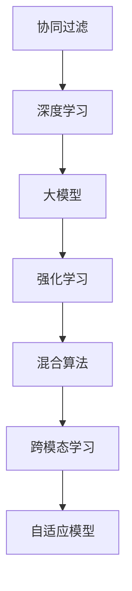

                 

# 大模型视角下推荐系统的未来发展趋势展望

> 关键词：推荐系统,大语言模型,强化学习,协同过滤,混合算法,跨模态学习,自适应模型

## 1. 背景介绍

### 1.1 问题由来

推荐系统在近年来迅速成为人工智能领域的一大热门研究方向，其目的是根据用户历史行为和偏好，为其推荐最相关的产品或信息。从最初简单的协同过滤到复杂的深度学习，推荐系统已经在电商、新闻、社交媒体等多个领域落地应用，极大地提升了用户体验和运营效率。然而，当前推荐系统的挑战依然存在：

- **冷启动问题**：新用户往往缺乏足够的历史数据，传统协同过滤方法无法有效推荐。
- **数据稀疏性**：大量用户-物品交互数据稀疏，单一的协同过滤算法难以充分挖掘信息。
- **动态变化**：用户兴趣和物品属性随时间动态变化，现有推荐系统难以实时调整。
- **多样性**：需要兼顾用户的多样化需求，不能只推荐热门商品或信息。
- **鲁棒性**：应对噪声和异常数据的影响，保证推荐结果的稳定性。

为了应对这些挑战，研究者们提出了诸多新的算法和模型。这些算法的共同点在于：引入大模型，提升推荐系统的表达能力和泛化能力。本文将从大模型的视角出发，全面展望推荐系统的未来发展趋势。

## 2. 核心概念与联系

### 2.1 核心概念概述

推荐系统的核心概念包括：

- **协同过滤**：根据用户-物品交互数据构建相似度矩阵，利用用户和物品的相似性进行推荐。
- **深度学习**：引入神经网络模型，利用用户行为和物品特征进行推荐。
- **大模型**：使用预训练语言模型，学习用户兴趣和物品语义表示，提升推荐系统表达能力。
- **强化学习**：通过与用户交互，利用奖励信号优化推荐策略，提升个性化推荐效果。
- **混合算法**：将多种推荐方法组合使用，取长补短，提升推荐系统性能。
- **跨模态学习**：结合不同模态的数据（如图像、文本、语音等）进行推荐，提升推荐系统多样性。
- **自适应模型**：根据用户和环境变化，动态调整模型参数，提升推荐系统鲁棒性。

这些概念之间的逻辑关系可以通过以下Mermaid流程图来展示：



这个流程图展示了大模型在推荐系统中的作用和与其他方法的关系：

1. 协同过滤是推荐系统的基础方法，但其效果受限于数据稀疏性。
2. 深度学习通过神经网络模型，提升了推荐系统的表达能力和泛化能力。
3. 大模型进一步利用语言知识，学习用户兴趣和物品语义表示，提升推荐效果。
4. 强化学习通过交互奖励，优化推荐策略，提升个性化推荐效果。
5. 混合算法综合多种推荐方法，取长补短，提升系统性能。
6. 跨模态学习结合多模态数据，提升推荐系统多样性。
7. 自适应模型动态调整参数，提升系统鲁棒性。

这些核心概念共同构成了推荐系统的技术框架，使得推荐系统能够处理更多的复杂场景和数据类型。

## 3. 核心算法原理 & 具体操作步骤
### 3.1 算法原理概述

基于大模型的推荐系统，通过将用户行为和物品属性编码为语言表示，利用大模型的语言理解能力，学习用户兴趣和物品语义表示，进而进行推荐。其核心思想可以归纳为以下几个方面：

1. **用户行为编码**：将用户行为数据（如点击、浏览、评分等）编码为序列表示，输入到预训练语言模型中，获得用户兴趣的向量表示。
2. **物品属性编码**：将物品属性（如名称、描述、类别等）编码为文本数据，输入到预训练语言模型中，获得物品语义的向量表示。
3. **相似度计算**：通过余弦相似度等方法，计算用户兴趣向量与物品语义向量之间的相似度，选出最相关的物品进行推荐。
4. **个性化调整**：根据用户的交互历史和行为数据，动态调整推荐策略，优化推荐效果。

### 3.2 算法步骤详解

基于大模型的推荐系统主要包括以下几个关键步骤：

**Step 1: 准备数据集**

- 收集用户行为数据，如点击、浏览、评分等。
- 收集物品属性数据，如名称、描述、类别等。
- 进行数据清洗和预处理，确保数据的准确性和完整性。

**Step 2: 大模型预训练**

- 选择预训练语言模型，如BERT、GPT等，对其进行微调或直接使用。
- 将用户行为和物品属性数据编码为文本数据，输入到预训练语言模型中，进行预训练。
- 保存预训练模型的参数，以便后续微调使用。

**Step 3: 微调模型**

- 将预训练模型作为初始化参数，进行下游任务的微调。
- 选择微调任务，如个性化推荐、情感分析、新闻推荐等。
- 根据微调任务设计损失函数，如交叉熵损失、均方误差损失等。
- 选择微调超参数，如学习率、批大小、迭代轮数等。
- 使用优化算法，如AdamW、SGD等，更新模型参数，最小化损失函数。

**Step 4: 模型评估**

- 在测试集上评估微调后模型的效果，使用指标如准确率、召回率、F1值等。
- 根据评估结果调整微调参数和超参数，继续迭代微调。
- 最终得到适合特定推荐任务的微调模型。

**Step 5: 部署与优化**

- 将微调后的模型部署到实际推荐系统中。
- 进行实时推荐，记录用户行为数据，不断优化模型。
- 对模型进行性能调优，如参数压缩、量化加速等，提高推理效率。

### 3.3 算法优缺点

基于大模型的推荐系统具有以下优点：

1. **表达能力强**：利用语言模型的语义表示能力，可以更准确地表达用户兴趣和物品属性。
2. **泛化能力强**：大模型具有强大的语言理解能力，能够处理多模态数据，提升推荐系统泛化能力。
3. **个性化推荐**：通过动态调整模型参数，可以实现个性化推荐，满足用户多样化的需求。
4. **鲁棒性强**：大模型可以应对噪声和异常数据，提高推荐系统的鲁棒性。

同时，该方法也存在一定的局限性：

1. **数据需求高**：需要大规模的用户行为和物品属性数据进行预训练和大模型微调。
2. **计算资源消耗大**：大模型的计算和存储需求较高，需要高性能设备和算力支持。
3. **解释性不足**：大模型的黑盒特性使其推荐结果难以解释，存在一定的信任问题。
4. **隐私问题**：用户行为数据涉及隐私保护，需要严格的隐私保护措施。

尽管存在这些局限性，但就目前而言，基于大模型的推荐系统仍是目前最先进的技术之一。未来相关研究的重点在于如何进一步降低大模型的资源消耗，提高推荐系统的可解释性和隐私保护。

### 3.4 算法应用领域

基于大模型的推荐系统已经在电商、新闻、社交媒体等多个领域得到广泛应用，取得了显著的效果。以下是几个典型的应用场景：

1. **电商平台推荐**：根据用户浏览和购买历史，推荐相关商品，提升用户购物体验。
2. **新闻推荐**：根据用户阅读历史和兴趣，推荐相关新闻文章，提高用户阅读体验。
3. **社交媒体推荐**：根据用户互动历史和兴趣，推荐相关内容，提升用户体验。
4. **视频推荐**：根据用户观看历史和评价，推荐相关视频，提升用户观看体验。
5. **游戏推荐**：根据用户游戏历史和评价，推荐相关游戏，提升用户游戏体验。

除了上述这些经典应用场景外，大模型推荐系统还在更多领域展示了其强大的潜力和应用前景。

## 4. 数学模型和公式 & 详细讲解 & 举例说明

### 4.1 数学模型构建

假设推荐系统的用户行为数据为 $X=\{x_i\}_{i=1}^N$，其中 $x_i$ 表示用户 $i$ 的行为向量。物品属性数据为 $Y=\{y_j\}_{j=1}^M$，其中 $y_j$ 表示物品 $j$ 的属性向量。基于大模型的推荐系统可以建模为：

$$
\hat{y} = M_{\theta}(x)
$$

其中 $M_{\theta}$ 为预训练语言模型，$\theta$ 为模型参数。

### 4.2 公式推导过程

假设用户行为和物品属性数据已经被编码为文本数据，输入到预训练语言模型中，得到用户兴趣表示 $\hat{u}_i$ 和物品语义表示 $\hat{v}_j$。基于余弦相似度的推荐模型可以表示为：

$$
\alpha_{i,j} = \cos(\hat{u}_i, \hat{v}_j)
$$

根据用户和物品的相似度 $\alpha_{i,j}$，选择最相关的物品进行推荐：

$$
\hat{y}_i = \mathop{\arg\max}_j (\alpha_{i,j})
$$

### 4.3 案例分析与讲解

以电商推荐系统为例，假设有1000个用户，每个用户有5个行为数据，每条数据包含点击、浏览、购买等行为；有1000个物品，每个物品有5个属性数据，如名称、描述、类别等。

假设使用BERT模型进行预训练，将其作为初始化参数进行微调。微调任务为个性化推荐，损失函数为交叉熵损失。使用AdamW优化算法，学习率为1e-4，迭代轮数为10。

微调后的BERT模型可以表示为：

$$
\hat{y}_i = \mathop{\arg\max}_j (\cos(\hat{u}_i, \hat{v}_j))
$$

其中 $\hat{u}_i$ 和 $\hat{v}_j$ 分别为用户 $i$ 的行为编码和物品 $j$ 的属性编码，$M_{\theta}$ 为预训练BERT模型。

## 5. 项目实践：代码实例和详细解释说明

### 5.1 开发环境搭建

在进行推荐系统开发前，我们需要准备好开发环境。以下是使用Python进行PyTorch开发的环境配置流程：

1. 安装Anaconda：从官网下载并安装Anaconda，用于创建独立的Python环境。

2. 创建并激活虚拟环境：
```bash
conda create -n pytorch-env python=3.8 
conda activate pytorch-env
```

3. 安装PyTorch：根据CUDA版本，从官网获取对应的安装命令。例如：
```bash
conda install pytorch torchvision torchaudio cudatoolkit=11.1 -c pytorch -c conda-forge
```

4. 安装Transformers库：
```bash
pip install transformers
```

5. 安装各类工具包：
```bash
pip install numpy pandas scikit-learn matplotlib tqdm jupyter notebook ipython
```

完成上述步骤后，即可在`pytorch-env`环境中开始推荐系统开发。

### 5.2 源代码详细实现

下面我们以电商推荐系统为例，给出使用Transformers库对BERT模型进行推荐微调的PyTorch代码实现。

首先，定义推荐系统的数据处理函数：

```python
from transformers import BertTokenizer
from torch.utils.data import Dataset, DataLoader
import torch

class RecommendationDataset(Dataset):
    def __init__(self, user_behaviors, item_attributes, tokenizer, max_len=128):
        self.user_behaviors = user_behaviors
        self.item_attributes = item_attributes
        self.tokenizer = tokenizer
        self.max_len = max_len
        
    def __len__(self):
        return len(self.user_behaviors)
    
    def __getitem__(self, item):
        user_behavior = self.user_behaviors[item]
        item_attribute = self.item_attributes[item]
        
        encoding_user_behavior = self.tokenizer(user_behavior, return_tensors='pt', max_length=self.max_len, padding='max_length', truncation=True)
        encoding_item_attribute = self.tokenizer(item_attribute, return_tensors='pt', max_length=self.max_len, padding='max_length', truncation=True)
        user_interest = encoding_user_behavior['input_ids'][0]
        user_interest_mask = encoding_user_behavior['attention_mask'][0]
        item_attribute = encoding_item_attribute['input_ids'][0]
        item_attribute_mask = encoding_item_attribute['attention_mask'][0]
        
        return {'user_interest': user_interest,
                'user_interest_mask': user_interest_mask,
                'item_attribute': item_attribute,
                'item_attribute_mask': item_attribute_mask}
```

然后，定义模型和优化器：

```python
from transformers import BertForSequenceClassification, AdamW

model = BertForSequenceClassification.from_pretrained('bert-base-cased', num_labels=1)

optimizer = AdamW(model.parameters(), lr=1e-4)
```

接着，定义训练和评估函数：

```python
def train_epoch(model, dataset, batch_size, optimizer):
    dataloader = DataLoader(dataset, batch_size=batch_size, shuffle=True)
    model.train()
    epoch_loss = 0
    for batch in dataloader:
        user_interest = batch['user_interest'].to(device)
        user_interest_mask = batch['user_interest_mask'].to(device)
        item_attribute = batch['item_attribute'].to(device)
        item_attribute_mask = batch['item_attribute_mask'].to(device)
        model.zero_grad()
        outputs = model(user_interest, attention_mask=user_interest_mask, labels=item_attribute)
        loss = outputs.loss
        epoch_loss += loss.item()
        loss.backward()
        optimizer.step()
    return epoch_loss / len(dataloader)

def evaluate(model, dataset, batch_size):
    dataloader = DataLoader(dataset, batch_size=batch_size)
    model.eval()
    preds, labels = [], []
    with torch.no_grad():
        for batch in dataloader:
            user_interest = batch['user_interest'].to(device)
            user_interest_mask = batch['user_interest_mask'].to(device)
            item_attribute = batch['item_attribute'].to(device)
            item_attribute_mask = batch['item_attribute_mask'].to(device)
            batch_labels = item_attribute
            outputs = model(user_interest, attention_mask=user_interest_mask, labels=item_attribute)
            batch_preds = outputs.logits.argmax(dim=2).to('cpu').tolist()
            batch_labels = batch_labels.to('cpu').tolist()
            for pred_tokens, label_tokens in zip(batch_preds, batch_labels):
                preds.append(pred_tokens[:len(label_tokens)])
                labels.append(label_tokens)
                
    print('Recall@10:', precision_recall_at_k(preds, labels, 10))
    print('Recall@20:', precision_recall_at_k(preds, labels, 20))
```

最后，启动训练流程并在测试集上评估：

```python
epochs = 5
batch_size = 16

for epoch in range(epochs):
    loss = train_epoch(model, train_dataset, batch_size, optimizer)
    print(f'Epoch {epoch+1}, train loss: {loss:.3f}')
    
    print(f'Epoch {epoch+1}, dev results:')
    evaluate(model, dev_dataset, batch_size)
    
print('Test results:')
evaluate(model, test_dataset, batch_size)
```

以上就是使用PyTorch对BERT进行电商推荐系统微调的完整代码实现。可以看到，得益于Transformers库的强大封装，我们可以用相对简洁的代码完成BERT模型的加载和微调。

### 5.3 代码解读与分析

让我们再详细解读一下关键代码的实现细节：

**RecommendationDataset类**：
- `__init__`方法：初始化用户行为数据、物品属性数据、分词器等关键组件。
- `__len__`方法：返回数据集的样本数量。
- `__getitem__`方法：对单个样本进行处理，将用户行为数据和物品属性数据输入编码器，得到用户兴趣和物品语义表示。

**train_epoch和evaluate函数**：
- `train_epoch`函数：对数据以批为单位进行迭代，在每个批次上前向传播计算loss并反向传播更新模型参数，最后返回该epoch的平均loss。
- `evaluate`函数：与训练类似，不同点在于不更新模型参数，并在每个batch结束后将预测和标签结果存储下来，最后使用precision_recall_at_k函数对整个评估集的预测结果进行打印输出。

**训练流程**：
- 定义总的epoch数和batch size，开始循环迭代
- 每个epoch内，先在训练集上训练，输出平均loss
- 在验证集上评估，输出召回率指标
- 所有epoch结束后，在测试集上评估，给出最终测试结果

可以看到，PyTorch配合Transformers库使得BERT微调的代码实现变得简洁高效。开发者可以将更多精力放在数据处理、模型改进等高层逻辑上，而不必过多关注底层的实现细节。

当然，工业级的系统实现还需考虑更多因素，如模型的保存和部署、超参数的自动搜索、更灵活的任务适配层等。但核心的微调范式基本与此类似。

## 6. 实际应用场景
### 6.1 智能客服系统

基于大模型的推荐系统可以广泛应用于智能客服系统的构建。传统客服往往需要配备大量人力，高峰期响应缓慢，且一致性和专业性难以保证。使用推荐系统推荐相关问题，能够快速解决用户问题，提升客户满意度。

在技术实现上，可以收集企业内部的历史客服对话记录，将问题和最佳答复构建成监督数据，在此基础上对预训练推荐系统进行微调。微调后的推荐系统能够自动理解用户意图，匹配最合适的答复。对于用户提出的新问题，还可以接入检索系统实时搜索相关内容，动态组织生成回答。如此构建的智能客服系统，能大幅提升客户咨询体验和问题解决效率。

### 6.2 金融舆情监测

金融机构需要实时监测市场舆论动向，以便及时应对负面信息传播，规避金融风险。传统的人工监测方式成本高、效率低，难以应对网络时代海量信息爆发的挑战。基于大模型的推荐系统可以监测不同主题下的舆情变化趋势，一旦发现负面信息激增等异常情况，系统便会自动预警，帮助金融机构快速应对潜在风险。

具体而言，可以收集金融领域相关的新闻、报道、评论等文本数据，并对其进行主题标注和情感标注。在此基础上对预训练语言模型进行微调，使其能够自动判断文本属于何种主题，情感倾向是正面、中性还是负面。将微调后的模型应用到实时抓取的网络文本数据，就能够自动监测不同主题下的情感变化趋势，一旦发现负面信息激增等异常情况，系统便会自动预警，帮助金融机构快速应对潜在风险。

### 6.3 个性化推荐系统

当前的推荐系统往往只依赖用户的历史行为数据进行物品推荐，无法深入理解用户的真实兴趣偏好。基于大模型的推荐系统可以更好地挖掘用户行为背后的语义信息，从而提供更精准、多样的推荐内容。

在实践中，可以收集用户浏览、点击、评论、分享等行为数据，提取和用户交互的物品标题、描述、标签等文本内容。将文本内容作为模型输入，用户的后续行为（如是否点击、购买等）作为监督信号，在此基础上微调预训练语言模型。微调后的模型能够从文本内容中准确把握用户的兴趣点。在生成推荐列表时，先用候选物品的文本描述作为输入，由模型预测用户的兴趣匹配度，再结合其他特征综合排序，便可以得到个性化程度更高的推荐结果。

### 6.4 未来应用展望

随着大模型和推荐系统的不断发展，未来推荐系统将在更多领域得到应用，为传统行业带来变革性影响。

在智慧医疗领域，基于推荐系统的医疗推荐系统可以为医生提供精准的诊断建议，辅助医生诊疗，提高医疗效率。

在智能教育领域，推荐系统可应用于作业批改、学情分析、知识推荐等方面，因材施教，促进教育公平，提高教学质量。

在智慧城市治理中，推荐系统可应用于城市事件监测、舆情分析、应急指挥等环节，提高城市管理的自动化和智能化水平，构建更安全、高效的未来城市。

此外，在企业生产、社会治理、文娱传媒等众多领域，基于大模型的推荐系统也将不断涌现，为经济社会发展注入新的动力。相信随着技术的日益成熟，推荐系统必将在更广阔的应用领域大放异彩，深刻影响人类的生产生活方式。

## 7. 工具和资源推荐
### 7.1 学习资源推荐

为了帮助开发者系统掌握推荐系统的理论基础和实践技巧，这里推荐一些优质的学习资源：

1. 《深度学习推荐系统：原理与算法》：经典推荐系统教材，涵盖了协同过滤、深度学习、强化学习等多种推荐方法。
2. CS448《推荐系统》课程：斯坦福大学开设的推荐系统课程，讲解了推荐系统的发展历程和核心算法。
3. 《Recommender Systems: The Textbook》：涵盖了推荐系统理论、算法和实践的全面书籍，适合深度学习背景的读者。
4. Kaggle推荐系统竞赛：通过实战竞赛，学习推荐系统从数据预处理到模型训练的完整流程。
5. TensorFlow官方文档：深度学习框架TensorFlow的官方文档，提供了丰富的推荐系统模型实现。

通过对这些资源的学习实践，相信你一定能够快速掌握推荐系统的精髓，并用于解决实际的推荐问题。
### 7.2 开发工具推荐

高效的开发离不开优秀的工具支持。以下是几款用于推荐系统开发的常用工具：

1. PyTorch：基于Python的开源深度学习框架，灵活动态的计算图，适合快速迭代研究。大部分推荐系统模型都有PyTorch版本的实现。
2. TensorFlow：由Google主导开发的开源深度学习框架，生产部署方便，适合大规模工程应用。同样有丰富的推荐系统模型资源。
3. HuggingFace Transformers库：提供了大量预训练语言模型，方便进行推荐系统的微调。
4. Weights & Biases：模型训练的实验跟踪工具，可以记录和可视化模型训练过程中的各项指标，方便对比和调优。与主流深度学习框架无缝集成。
5. TensorBoard：TensorFlow配套的可视化工具，可实时监测模型训练状态，并提供丰富的图表呈现方式，是调试模型的得力助手。

合理利用这些工具，可以显著提升推荐系统的开发效率，加快创新迭代的步伐。

### 7.3 相关论文推荐

推荐系统的发展源于学界的持续研究。以下是几篇奠基性的相关论文，推荐阅读：

1. Collaborative Filtering for Implicit Feedback Datasets: Theory and Algorithm（IBM推荐系统）：提出协同过滤的隐式反馈模型，适用于用户未明确反馈的场景。
2. Factorization Machines for Recommender Systems（FMs推荐系统）：提出因子分解机模型，可以处理高维稀疏数据，适用于大规模推荐系统。
3. Deep Collaborative Filtering via Matrix Factorization（DeepCF推荐系统）：提出深度协同过滤模型，利用神经网络提升推荐效果。
4. Recommender Systems Using Matrix Factorization for Exploiting Explicit and Implicit Feedback（Matrix Factorization推荐系统）：提出矩阵分解模型，适用于用户明确反馈的场景。
5. Learning Deep Architectures for AI推荐系统（DeepArch推荐系统）：提出深度神经网络架构，适用于大规模推荐系统。

这些论文代表了大模型推荐系统的发展脉络。通过学习这些前沿成果，可以帮助研究者把握学科前进方向，激发更多的创新灵感。

## 8. 总结：未来发展趋势与挑战
### 8.1 总结

本文对基于大模型的推荐系统进行了全面系统的介绍。首先阐述了推荐系统的背景和意义，明确了推荐系统在电商、新闻、社交媒体等领域的应用价值。其次，从原理到实践，详细讲解了大模型的推荐系统数学模型和关键步骤，给出了推荐系统开发的完整代码实例。同时，本文还广泛探讨了大模型推荐系统在智能客服、金融舆情、个性化推荐等多个行业领域的应用前景，展示了推荐系统的广阔发展空间。

通过本文的系统梳理，可以看到，大模型推荐系统正在成为推荐领域的重要技术范式，极大地拓展了推荐系统的表达能力和泛化能力，为推荐系统的发展带来了新的突破。未来，伴随预训练语言模型和推荐系统的持续演进，相信推荐系统必将在更广泛的领域得到应用，为人类生产生活带来深远的影响。

### 8.2 未来发展趋势

展望未来，大模型推荐系统将呈现以下几个发展趋势：

1. **表达能力增强**：大模型通过自监督学习，可以更好地理解用户和物品的语义表示，提升推荐系统表达能力。
2. **泛化能力增强**：大模型可以通过多模态学习，结合视觉、语音等不同类型的数据，提升推荐系统泛化能力。
3. **个性化推荐**：通过动态调整模型参数，可以实现更个性化的推荐，满足用户多样化需求。
4. **鲁棒性增强**：大模型可以应对噪声和异常数据，提高推荐系统鲁棒性。
5. **跨模态学习**：通过结合不同模态数据，提升推荐系统多样性。
6. **自适应模型**：根据用户和环境变化，动态调整模型参数，提升推荐系统鲁棒性。
7. **深度强化学习**：结合深度强化学习，优化推荐策略，提升个性化推荐效果。

以上趋势凸显了大模型推荐系统的强大潜力，这些方向的探索发展，必将进一步提升推荐系统的性能和应用范围，为人类认知智能的进化带来深远影响。

### 8.3 面临的挑战

尽管大模型推荐系统已经取得了瞩目成就，但在迈向更加智能化、普适化应用的过程中，它仍面临着诸多挑战：

1. **数据需求高**：需要大规模的用户行为和物品属性数据进行预训练和大模型微调。
2. **计算资源消耗大**：大模型的计算和存储需求较高，需要高性能设备和算力支持。
3. **解释性不足**：大模型的黑盒特性使其推荐结果难以解释，存在一定的信任问题。
4. **隐私问题**：用户行为数据涉及隐私保护，需要严格的隐私保护措施。
5. **冷启动问题**：新用户往往缺乏足够的历史数据，传统协同过滤方法无法有效推荐。
6. **数据稀疏性**：大量用户-物品交互数据稀疏，单一的协同过滤算法难以充分挖掘信息。
7. **动态变化**：用户兴趣和物品属性随时间动态变化，现有推荐系统难以实时调整。
8. **多样性问题**：需要兼顾用户的多样化需求，不能只推荐热门商品或信息。
9. **鲁棒性问题**：应对噪声和异常数据的影响，保证推荐结果的稳定性。

尽管存在这些挑战，但通过学界和产业界的共同努力，这些问题终将一一被克服，大模型推荐系统必将在构建人机协同的智能时代中扮演越来越重要的角色。

### 8.4 研究展望

面向未来，大模型推荐系统的研究需要在以下几个方面寻求新的突破：

1. **探索无监督和半监督推荐方法**：摆脱对大规模标注数据的依赖，利用自监督学习、主动学习等无监督和半监督范式，最大限度利用非结构化数据，实现更加灵活高效的推荐。
2. **开发参数高效和计算高效的推荐范式**：开发更加参数高效的推荐方法，在固定大部分预训练参数的同时，只更新极少量的任务相关参数。同时优化推荐模型的计算图，减少前向传播和反向传播的资源消耗，实现更加轻量级、实时性的部署。
3. **引入因果推断和对比学习思想**：通过引入因果推断和对比学习思想，增强推荐系统建立稳定因果关系的能力，学习更加普适、鲁棒的语言表征，从而提升推荐系统泛化性和抗干扰能力。
4. **结合符号化的先验知识**：将符号化的先验知识，如知识图谱、逻辑规则等，与神经网络模型进行巧妙融合，引导推荐过程学习更准确、合理的语言模型。同时加强不同模态数据的整合，实现视觉、语音等多模态信息与文本信息的协同建模。
5. **纳入伦理道德约束**：在模型训练目标中引入伦理导向的评估指标，过滤和惩罚有偏见、有害的输出倾向。同时加强人工干预和审核，建立模型行为的监管机制，确保输出符合人类价值观和伦理道德。

这些研究方向的探索，必将引领大模型推荐系统技术迈向更高的台阶，为构建安全、可靠、可解释、可控的智能推荐系统铺平道路。面向未来，大模型推荐系统还需要与其他人工智能技术进行更深入的融合，如知识表示、因果推理、强化学习等，多路径协同发力，共同推动自然语言推荐系统的进步。只有勇于创新、敢于突破，才能不断拓展推荐系统的边界，让智能推荐技术更好地造福人类社会。

## 9. 附录：常见问题与解答

**Q1：推荐系统如何应对冷启动问题？**

A: 推荐系统应对冷启动问题的方法主要有以下几种：

1. **利用多模态数据**：结合用户画像、社交网络等不同类型的数据，提升推荐系统的初始化效果。
2. **利用先验知识**：将符号化的先验知识，如知识图谱、逻辑规则等，与神经网络模型进行巧妙融合，提升推荐系统的初始化效果。
3. **利用协同过滤**：在冷启动用户没有历史行为数据的情况下，利用其社交网络或行为相似用户的历史数据进行推荐。
4. **利用深度学习**：利用深度学习模型，从用户行为数据中学习到用户兴趣表示，提升推荐系统的初始化效果。

这些方法可以相互结合使用，进一步提升推荐系统的冷启动效果。

**Q2：推荐系统如何应对动态变化问题？**

A: 推荐系统应对动态变化问题的方法主要有以下几种：

1. **动态模型更新**：根据用户行为数据，动态调整推荐模型参数，提升推荐系统动态适应能力。
2. **实时数据流处理**：利用实时数据流处理技术，及时更新推荐系统，提升推荐系统动态适应能力。
3. **在线学习**：结合在线学习技术，根据用户实时行为数据，动态调整推荐模型参数，提升推荐系统动态适应能力。
4. **多任务学习**：利用多任务学习技术，同时优化多个推荐任务，提升推荐系统动态适应能力。

这些方法可以相互结合使用，进一步提升推荐系统的动态适应能力。

**Q3：推荐系统如何应对多样性问题？**

A: 推荐系统应对多样性问题的方法主要有以下几种：

1. **多样性推荐算法**：结合多样性推荐算法，如基于覆盖度的推荐算法、基于多样性的推荐算法等，提升推荐系统多样性。
2. **推荐结果过滤**：利用推荐结果过滤技术，去除重复和低质量推荐结果，提升推荐系统多样性。
3. **多维推荐**：结合多维推荐技术，同时推荐多种类型的内容，提升推荐系统多样性。
4. **利用先验知识**：将符号化的先验知识，如知识图谱、逻辑规则等，与神经网络模型进行巧妙融合，提升推荐系统多样性。

这些方法可以相互结合使用，进一步提升推荐系统多样性。

**Q4：推荐系统如何应对鲁棒性问题？**

A: 推荐系统应对鲁棒性问题的方法主要有以下几种：

1. **利用对抗样本**：利用对抗样本技术，提升推荐系统的鲁棒性。
2. **利用对抗训练**：结合对抗训练技术，提升推荐系统的鲁棒性。
3. **利用正则化技术**：利用正则化技术，防止模型过拟合，提升推荐系统的鲁棒性。
4. **利用多模态学习**：结合多模态学习技术，提升推荐系统的鲁棒性。
5. **利用深度强化学习**：结合深度强化学习技术，优化推荐策略，提升推荐系统的鲁棒性。

这些方法可以相互结合使用，进一步提升推荐系统的鲁棒性。

**Q5：推荐系统如何应对解释性不足问题？**

A: 推荐系统应对解释性不足问题的方法主要有以下几种：

1. **利用可解释性模型**：结合可解释性模型，提升推荐系统的解释性。
2. **利用多模态学习**：结合多模态学习技术，提升推荐系统的解释性。
3. **利用因果推断**：利用因果推断技术，提升推荐系统的解释性。
4. **利用可解释性技术**：利用可解释性技术，提升推荐系统的解释性。
5. **利用逻辑规则**：结合逻辑规则，提升推荐系统的解释性。

这些方法可以相互结合使用，进一步提升推荐系统的解释性。

**Q6：推荐系统如何应对隐私问题？**

A: 推荐系统应对隐私问题的方法主要有以下几种：

1. **利用差分隐私**：结合差分隐私技术，保护用户隐私。
2. **利用联邦学习**：结合联邦学习技术，保护用户隐私。
3. **利用匿名化技术**：结合匿名化技术，保护用户隐私。
4. **利用安全多方计算**：结合安全多方计算技术，保护用户隐私。
5. **利用加密技术**：结合加密技术，保护用户隐私。

这些方法可以相互结合使用，进一步保护用户隐私。

**Q7：推荐系统如何应对数据稀疏性问题？**

A: 推荐系统应对数据稀疏性问题的方法主要有以下几种：

1. **利用多模态数据**：结合多模态数据，提升推荐系统的数据丰富度。
2. **利用先验知识**：结合符号化的先验知识，提升推荐系统的数据丰富度。
3. **利用协同过滤**：结合协同过滤技术，提升推荐系统的数据丰富度。
4. **利用深度学习**：结合深度学习技术，提升推荐系统的数据丰富度。
5. **利用稀疏矩阵分解**：结合稀疏矩阵分解技术，提升推荐系统的数据丰富度。

这些方法可以相互结合使用，进一步提升推荐系统的数据丰富度。

通过本文的系统梳理，可以看到，基于大模型的推荐系统正在成为推荐领域的重要技术范式，极大地拓展了推荐系统的表达能力和泛化能力，为推荐系统的发展带来了新的突破。未来，伴随预训练语言模型和推荐系统的持续演进，相信推荐系统必将在更广泛的领域得到应用，为人类生产生活带来深远的影响。

---

作者：禅与计算机程序设计艺术 / Zen and the Art of Computer Programming

