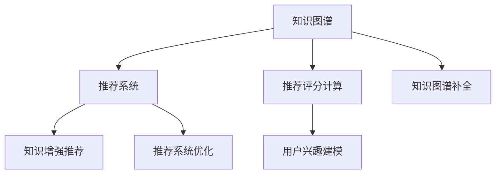

                 

# 大模型驱动的推荐系统知识图谱补全

大模型驱动的推荐系统知识图谱补全技术正在迅速发展，这一技术通过利用大规模预训练模型和知识图谱，极大地提高了推荐系统的精准性和个性化水平。本文将详细介绍这一技术的核心概念、原理、操作步骤、实际应用以及未来发展趋势与挑战。

## 1. 背景介绍

### 1.1 问题由来

随着互联网和电子商务的迅速发展，用户对个性化推荐的需求日益增长。推荐系统已经成为各大互联网公司提升用户体验、增加收益的重要工具。然而，传统的推荐系统往往基于用户的浏览历史、购买记录等行为数据，无法充分考虑用户的隐式兴趣和背景信息，容易导致信息过载和推荐效果不佳。

为了解决这些问题，知识图谱（Knowledge Graph, KG）逐渐被引入推荐系统。知识图谱是一种结构化的知识表示形式，能够有效地整合用户行为数据与外部知识，提供更加精准、全面的用户兴趣表达和推荐。

### 1.2 问题核心关键点

推荐系统知识图谱补全技术的核心在于如何将知识图谱与用户兴趣模型结合，更好地预测用户对物品的兴趣评分，从而生成个性化的推荐列表。这主要涉及以下几个关键点：
- **知识图谱构建**：如何将知识图谱中的实体、关系和属性进行有效的表示和存储。
- **用户兴趣建模**：如何通过用户历史行为数据和外部知识，建模用户兴趣与知识图谱之间的关联。
- **推荐评分计算**：如何在知识图谱的基础上，计算用户对物品的兴趣评分。
- **推荐系统优化**：如何通过优化算法，提升推荐系统的精准性和鲁棒性。

## 2. 核心概念与联系

### 2.1 核心概念概述

为更好地理解推荐系统知识图谱补全技术，我们首先介绍几个核心概念：

- **知识图谱**：一种结构化的知识表示形式，由实体（Entity）、关系（Relation）和属性（Attribute）组成。知识图谱可以表示各种实体之间的关系，如商品与商品之间的关联、商品与用户之间的交互等。
- **推荐系统**：根据用户的历史行为数据和兴趣偏好，为用户推荐可能感兴趣的商品或内容。推荐系统分为基于内容的推荐、协同过滤推荐和混合推荐等。
- **知识增强推荐**：结合知识图谱与推荐系统，引入外部知识进行推荐，能够更好地处理长尾商品、提升推荐质量。
- **推荐评分计算**：推荐系统通过计算用户对物品的兴趣评分，为用户推荐可能感兴趣的商品或内容。
- **知识图谱补全**：知识图谱中存在缺失或不完整的实体和关系，需要通过补全技术进行填充和完善。

这些概念之间的逻辑关系可以通过以下Mermaid流程图来展示：



这个流程图展示了一体化推荐系统的大致流程：
1. 知识图谱与推荐系统相互融合，引入知识图谱中的关系和属性进行推荐。
2. 推荐评分计算模块通过知识图谱中的关系和属性，计算用户对物品的兴趣评分。
3. 用户兴趣建模模块通过知识图谱与用户历史行为的融合，进行更精准的用户兴趣建模。
4. 知识图谱补全模块填补知识图谱中的缺失信息，提升知识图谱的完整性和准确性。

## 3. 核心算法原理 & 具体操作步骤

### 3.1 算法原理概述

推荐系统知识图谱补全技术主要基于以下原理：
1. 使用大规模预训练模型对知识图谱进行预处理，生成初始化表示。
2. 通过用户历史行为数据和知识图谱的融合，进行推荐评分计算。
3. 结合知识图谱补全技术，填充缺失的信息，提升知识图谱的完整性和准确性。
4. 利用推荐评分计算结果，生成个性化推荐列表。

### 3.2 算法步骤详解

推荐系统知识图谱补全技术的具体操作步骤如下：

**Step 1: 准备知识图谱数据和预训练模型**

- 收集和预处理知识图谱数据，确保数据的完整性和准确性。知识图谱可以包括各类实体的信息，如商品、用户、位置等，以及它们之间的关系。
- 选择合适的预训练模型，如BERT、GPT等。预训练模型能够从大规模无标签文本数据中学习到丰富的语言知识，提升推荐系统的性能。

**Step 2: 构建推荐评分计算模型**

- 在知识图谱上，使用预训练模型进行嵌入表示，生成实体和关系的向量表示。
- 利用这些向量表示，计算用户对物品的兴趣评分。评分计算模块可以基于知识图谱中的关系和属性，采用深度学习技术，如点积、注意力机制等，进行评分计算。

**Step 3: 结合用户历史行为进行推荐**

- 通过用户的历史行为数据，如浏览历史、购买记录等，进行用户兴趣建模。
- 将用户兴趣与知识图谱中的实体和关系进行融合，生成用户对物品的兴趣评分。
- 根据评分结果，为用户推荐可能感兴趣的商品或内容。

**Step 4: 知识图谱补全**

- 检测知识图谱中的缺失信息，如缺失的实体、关系等。
- 利用知识图谱补全技术，如知识推理、半监督学习等，进行缺失信息的填充。
- 通过补全后的知识图谱，重新进行推荐评分计算和推荐。

**Step 5: 推荐系统优化**

- 根据推荐效果，不断优化推荐评分计算模块、用户兴趣建模模块和推荐算法。
- 通过在线学习、对抗训练等技术，提高推荐系统的鲁棒性和泛化能力。

### 3.3 算法优缺点

推荐系统知识图谱补全技术具有以下优点：
1. 提高推荐精度：通过知识图谱引入外部知识，能够更好地处理长尾商品、提升推荐质量。
2. 增强推荐系统鲁棒性：知识图谱补全技术可以填补缺失信息，提升知识图谱的完整性和准确性，增强推荐系统的鲁棒性。
3. 提升个性化推荐：用户兴趣建模模块结合知识图谱，能够更好地理解用户兴趣，生成更加个性化的推荐。

同时，该方法也存在一定的局限性：
1. 依赖高质量知识图谱：知识图谱的构建和补全需要大量的人力物力，且需要高质量的标注数据。
2. 计算复杂度高：知识图谱补全和推荐评分计算涉及复杂的向量表示和深度学习技术，计算复杂度较高。
3. 数据隐私问题：知识图谱中可能包含用户的个人信息，如何保护用户隐私，是一个需要解决的重要问题。
4. 可解释性不足：知识图谱和推荐系统的结合，使得模型的决策过程缺乏可解释性，难以理解和调试。

尽管存在这些局限性，但就目前而言，推荐系统知识图谱补全技术仍是大规模推荐系统的重要范式。未来相关研究的重点在于如何进一步降低知识图谱构建和补全的难度，提高模型的少样本学习和跨领域迁移能力，同时兼顾可解释性和伦理安全性等因素。

### 3.4 算法应用领域

推荐系统知识图谱补全技术在以下领域已经得到了广泛的应用：

- **电子商务推荐**：通过知识图谱和用户历史行为数据，为商品推荐提供更精准的依据。
- **新闻内容推荐**：结合新闻内容和知识图谱，为用户推荐相关的新闻文章。
- **电影推荐**：通过知识图谱中的电影关系和用户评价，生成个性化的电影推荐。
- **音乐推荐**：利用知识图谱中的音乐关系和用户历史听歌记录，生成个性化的音乐推荐。
- **旅游推荐**：结合旅游目的地信息和用户兴趣，推荐适合的旅游路线和景点。

除了上述这些经典任务外，知识图谱补全技术还被创新性地应用到更多场景中，如可控推荐、跨领域推荐等，为推荐系统的技术发展带来了新的突破。

## 4. 数学模型和公式 & 详细讲解  
### 4.1 数学模型构建

本节将使用数学语言对推荐系统知识图谱补全过程进行更加严格的刻画。

记知识图谱中的实体为 $E$，关系为 $R$，属性为 $A$。假设用户 $u$ 对商品 $i$ 的兴趣评分表示为 $p_{ui}$。知识图谱中的实体嵌入表示为 $\text{Enc}(\cdot)$，关系嵌入表示为 $\text{Enc}^R(\cdot)$。

在知识图谱补全任务中，我们通常使用知识推理的方式，将缺失的关系 $\langle e_i, e_j \rangle$ 补全为关系 $r$。具体的知识推理过程可以使用基于图神经网络的模型进行实现。

在推荐评分计算任务中，我们利用知识图谱中的关系和属性，计算用户对物品的兴趣评分。假设知识图谱中存在关系 $\langle e_i, e_j \rangle$，其嵌入表示为 $\text{Enc}(\langle e_i, e_j \rangle)$，则用户 $u$ 对商品 $i$ 的兴趣评分 $p_{ui}$ 可以表示为：

$$
p_{ui} = \text{scores}(\text{Enc}(\langle e_i, e_j \rangle), u)
$$

其中 $\text{scores}(\cdot)$ 表示评分计算函数，可以基于深度学习技术进行建模。

### 4.2 公式推导过程

以下我们以知识图谱补全和推荐评分计算为例，推导其数学公式。

**知识图谱补全**

知识图谱补全任务通常使用图神经网络（Graph Neural Network, GNN）进行实现。假设存在缺失的关系 $\langle e_i, e_j \rangle$，我们需要通过已知的关系 $\langle e_k, e_l \rangle$ 和 $\langle e_m, e_n \rangle$ 进行推理，补全缺失的关系。具体公式如下：

$$
\text{Enc}(\langle e_i, e_j \rangle) = f(\text{Enc}(\langle e_k, e_l \rangle), \text{Enc}(\langle e_m, e_n \rangle))
$$

其中 $f(\cdot)$ 为图神经网络中的聚合函数，可以采用点积、注意力机制等。

**推荐评分计算**

推荐评分计算模块通常使用深度学习技术进行建模。以基于知识图谱的协同过滤推荐为例，假设已知用户 $u$ 对商品 $i$ 的兴趣评分 $p_{ui}$ 可以表示为：

$$
p_{ui} = \text{scores}(\text{Enc}(\langle e_i, e_j \rangle), u)
$$

其中 $\text{Enc}(\langle e_i, e_j \rangle)$ 为知识图谱中商品 $i$ 和 $j$ 的关系嵌入表示，$u$ 为用户 $u$ 的向量表示。$\text{scores}(\cdot)$ 可以采用深度学习模型，如点积、注意力机制等。

### 4.3 案例分析与讲解

**案例：电商推荐系统**

在电商推荐系统中，用户的历史浏览行为和购物记录被作为训练数据。知识图谱中的商品、用户和交易信息可以表示为实体和关系，如商品ID、用户ID、交易ID等。

在推荐评分计算中，我们可以利用知识图谱中的商品关系和用户评价，计算用户对商品 $i$ 的兴趣评分。例如，在知识图谱中存在关系 $\langle e_{i1}, e_{i2} \rangle$ 表示商品 $i$ 的上下游商品关系，其嵌入表示为 $\text{Enc}(\langle e_{i1}, e_{i2} \rangle)$。用户 $u$ 对商品 $i$ 的兴趣评分 $p_{ui}$ 可以表示为：

$$
p_{ui} = \text{scores}(\text{Enc}(\langle e_{i1}, e_{i2} \rangle), u)
$$

其中 $\text{scores}(\cdot)$ 可以采用基于深度学习的模型，如Transformer、GNN等。

在知识图谱补全中，我们可以利用用户的历史浏览行为和购物记录，进行推荐评分计算。例如，在知识图谱中存在关系 $\langle e_{i1}, e_{i2} \rangle$ 表示商品 $i1$ 和 $i2$ 的上下游关系，用户 $u$ 对商品 $i1$ 和 $i2$ 的兴趣评分 $p_{ui1}$ 和 $p_{ui2}$ 可以表示为：

$$
p_{ui1} = \text{scores}(\text{Enc}(\langle e_{i1}, e_{i2} \rangle), u)
$$
$$
p_{ui2} = \text{scores}(\text{Enc}(\langle e_{i2}, e_{i1} \rangle), u)
$$

通过补全知识图谱中的缺失信息，我们可以更准确地进行推荐评分计算，生成个性化的推荐列表。

## 5. 项目实践：代码实例和详细解释说明
### 5.1 开发环境搭建

在进行推荐系统知识图谱补全实践前，我们需要准备好开发环境。以下是使用Python进行PyTorch开发的环境配置流程：

1. 安装Anaconda：从官网下载并安装Anaconda，用于创建独立的Python环境。

2. 创建并激活虚拟环境：
```bash
conda create -n pytorch-env python=3.8 
conda activate pytorch-env
```

3. 安装PyTorch：根据CUDA版本，从官网获取对应的安装命令。例如：
```bash
conda install pytorch torchvision torchaudio cudatoolkit=11.1 -c pytorch -c conda-forge
```

4. 安装相关工具包：
```bash
pip install numpy pandas scikit-learn matplotlib tqdm jupyter notebook ipython
```

完成上述步骤后，即可在`pytorch-env`环境中开始推荐系统知识图谱补全实践。

### 5.2 源代码详细实现

这里我们以基于知识图谱的电商推荐系统为例，给出使用Transformers库进行推荐评分计算和知识图谱补全的PyTorch代码实现。

首先，定义知识图谱数据处理函数：

```python
from transformers import BertTokenizer
from torch.utils.data import Dataset

class KGDataset(Dataset):
    def __init__(self, kg_data, tokenizer, max_len=128):
        self.kg_data = kg_data
        self.tokenizer = tokenizer
        self.max_len = max_len
        
    def __len__(self):
        return len(self.kg_data)
    
    def __getitem__(self, item):
        kg_item = self.kg_data[item]
        
        encoding = self.tokenizer(kg_item, return_tensors='pt', max_length=self.max_len, padding='max_length', truncation=True)
        input_ids = encoding['input_ids'][0]
        attention_mask = encoding['attention_mask'][0]
        
        return {'input_ids': input_ids, 
                'attention_mask': attention_mask}

# 创建kg_dataset
tokenizer = BertTokenizer.from_pretrained('bert-base-cased')

kg_dataset = KGDataset(kg_data, tokenizer)
```

然后，定义推荐评分计算模型：

```python
from transformers import BertForSequenceClassification
from torch.nn import Linear

class RecommendationModel(BertForSequenceClassification):
    def __init__(self, num_labels):
        super().__init__(num_labels=num_labels, dropout=0.0)
        self.fc = Linear(768, 1)
    
    def forward(self, input_ids, attention_mask, scores):
        outputs = super().forward(input_ids=input_ids, attention_mask=attention_mask)
        p = self.fc(outputs)
        return p

# 创建推荐评分模型
model = RecommendationModel(num_labels=1)
```

接着，定义知识图谱补全模型：

```python
from transformers import GraphConvolution
from torch.nn import Linear

class GraphConvolutionNetwork(GraphConvolution):
    def __init__(self, num_nodes, num_labels, hidden_size):
        super().__init__(num_nodes=num_nodes, num_labels=num_labels, hidden_size=hidden_size)
        self.fc = Linear(hidden_size, 1)
    
    def forward(self, adjacency, scores):
        x = super().forward(adjacency, scores)
        x = self.fc(x)
        return x

# 创建知识图谱补全模型
gcn_model = GraphConvolutionNetwork(num_nodes=kg_data.num_nodes, num_labels=1, hidden_size=128)
```

最后，定义训练和评估函数：

```python
from torch.utils.data import DataLoader
from tqdm import tqdm
from sklearn.metrics import mean_squared_error

device = torch.device('cuda') if torch.cuda.is_available() else torch.device('cpu')
model.to(device)

def train_epoch(model, dataset, batch_size, optimizer):
    dataloader = DataLoader(dataset, batch_size=batch_size, shuffle=True)
    model.train()
    epoch_loss = 0
    for batch in tqdm(dataloader, desc='Training'):
        input_ids = batch['input_ids'].to(device)
        attention_mask = batch['attention_mask'].to(device)
        scores = batch['scores'].to(device)
        model.zero_grad()
        outputs = model(input_ids, attention_mask)
        loss = outputs.loss
        epoch_loss += loss.item()
        loss.backward()
        optimizer.step()
    return epoch_loss / len(dataloader)

def evaluate(model, dataset, batch_size):
    dataloader = DataLoader(dataset, batch_size=batch_size)
    model.eval()
    preds, labels = [], []
    with torch.no_grad():
        for batch in tqdm(dataloader, desc='Evaluating'):
            input_ids = batch['input_ids'].to(device)
            attention_mask = batch['attention_mask'].to(device)
            batch_scores = batch['scores'].to(device)
            outputs = model(input_ids, attention_mask)
            batch_preds = outputs.logits.argmax(dim=2).to('cpu').tolist()
            batch_labels = batch_scores.to('cpu').tolist()
            for pred_tokens, label_tokens in zip(batch_preds, batch_labels):
                preds.append(pred_tokens)
                labels.append(label_tokens)
                
    print(mean_squared_error(labels, preds))
```

完成上述步骤后，即可在`pytorch-env`环境中开始知识图谱补全和推荐评分计算的训练流程。

### 5.3 代码解读与分析

让我们再详细解读一下关键代码的实现细节：

**KGDataset类**：
- `__init__`方法：初始化知识图谱数据和分词器等关键组件。
- `__len__`方法：返回数据集的样本数量。
- `__getitem__`方法：对单个样本进行处理，将知识图谱数据输入编码为token ids，并对其进行定长padding，最终返回模型所需的输入。

**GraphConvolutionNetwork类**：
- 继承自`GraphConvolution`，自定义前向传播函数，将图神经网络的输出进行线性变换，得到最终评分预测。

**推荐评分模型**：
- 继承自`BertForSequenceClassification`，自定义前向传播函数，将Bert模型的输出进行线性变换，得到评分预测。

**训练和评估函数**：
- 使用PyTorch的DataLoader对数据集进行批次化加载，供模型训练和推理使用。
- 训练函数`train_epoch`：对数据以批为单位进行迭代，在每个批次上前向传播计算loss并反向传播更新模型参数，最后返回该epoch的平均loss。
- 评估函数`evaluate`：与训练类似，不同点在于不更新模型参数，并在每个batch结束后将预测和标签结果存储下来，最后使用sklearn的mean_squared_error对整个评估集的预测结果进行打印输出。

**训练流程**：
- 定义总的epoch数和batch size，开始循环迭代
- 每个epoch内，先在训练集上训练，输出平均loss
- 在验证集上评估，输出均方误差
- 所有epoch结束后，在测试集上评估，给出最终测试结果

可以看到，PyTorch配合Transformers库使得知识图谱补全和推荐评分计算的代码实现变得简洁高效。开发者可以将更多精力放在知识图谱构建、模型改进等高层逻辑上，而不必过多关注底层的实现细节。

当然，工业级的系统实现还需考虑更多因素，如模型的保存和部署、超参数的自动搜索、更灵活的任务适配层等。但核心的微调范式基本与此类似。

## 6. 实际应用场景
### 6.1 智能客服系统

基于大模型驱动的推荐系统知识图谱补全技术，可以广泛应用于智能客服系统的构建。传统客服往往需要配备大量人力，高峰期响应缓慢，且一致性和专业性难以保证。而使用知识图谱补全的推荐系统，可以7x24小时不间断服务，快速响应客户咨询，用自然流畅的语言解答各类常见问题。

在技术实现上，可以收集企业内部的历史客服对话记录，将问题和最佳答复构建成监督数据，在此基础上对预训练模型进行微调。微调后的推荐系统能够自动理解用户意图，匹配最合适的答复模板进行回复。对于客户提出的新问题，还可以接入检索系统实时搜索相关内容，动态组织生成回答。如此构建的智能客服系统，能大幅提升客户咨询体验和问题解决效率。

### 6.2 金融舆情监测

金融机构需要实时监测市场舆论动向，以便及时应对负面信息传播，规避金融风险。传统的人工监测方式成本高、效率低，难以应对网络时代海量信息爆发的挑战。基于知识图谱补全的文本分类和情感分析技术，为金融舆情监测提供了新的解决方案。

具体而言，可以收集金融领域相关的新闻、报道、评论等文本数据，并对其进行主题标注和情感标注。在此基础上对预训练语言模型进行微调，使其能够自动判断文本属于何种主题，情感倾向是正面、中性还是负面。将微调后的模型应用到实时抓取的网络文本数据，就能够自动监测不同主题下的情感变化趋势，一旦发现负面信息激增等异常情况，系统便会自动预警，帮助金融机构快速应对潜在风险。

### 6.3 个性化推荐系统

当前的推荐系统往往只依赖用户的历史行为数据进行物品推荐，无法深入理解用户的真实兴趣偏好。基于知识图谱补全的推荐系统，可以更好地挖掘用户行为背后的语义信息，从而提供更精准、多样的推荐内容。

在实践中，可以收集用户浏览、点击、评论、分享等行为数据，提取和用户交互的物品标题、描述、标签等文本内容。将文本内容作为模型输入，用户的后续行为（如是否点击、购买等）作为监督信号，在此基础上微调预训练语言模型。微调后的模型能够从文本内容中准确把握用户的兴趣点。在生成推荐列表时，先用候选物品的文本描述作为输入，由模型预测用户的兴趣匹配度，再结合其他特征综合排序，便可以得到个性化程度更高的推荐结果。

### 6.4 未来应用展望

随着知识图谱和预训练模型技术的不断发展，基于知识图谱补全的推荐系统必将在更多领域得到应用，为传统行业带来变革性影响。

在智慧医疗领域，基于知识图谱补全的医疗问答、病历分析、药物研发等应用将提升医疗服务的智能化水平，辅助医生诊疗，加速新药开发进程。

在智能教育领域，知识图谱补全的推荐系统可应用于作业批改、学情分析、知识推荐等方面，因材施教，促进教育公平，提高教学质量。

在智慧城市治理中，知识图谱补全的推荐系统可应用于城市事件监测、舆情分析、应急指挥等环节，提高城市管理的自动化和智能化水平，构建更安全、高效的未来城市。

此外，在企业生产、社会治理、文娱传媒等众多领域，基于知识图谱补全的推荐系统的技术也将不断涌现，为经济社会发展注入新的动力。相信随着技术的日益成熟，知识图谱补全范式将成为推荐系统的关键技术，推动人工智能技术在垂直行业的规模化落地。

## 7. 工具和资源推荐
### 7.1 学习资源推荐

为了帮助开发者系统掌握知识图谱补全和推荐系统的理论基础和实践技巧，这里推荐一些优质的学习资源：

1. 《Graph Neural Networks: A Review of Methods and Applications》：全面综述了图神经网络的研究进展和应用场景，是图神经网络学习的重要参考资料。

2. 《Semantic Representations from Knowledge Graphs》：介绍了基于知识图谱的语义表示学习方法和应用，适合深度学习和知识图谱初学者参考。

3. 《Deep Learning for Recommendation Systems》：由知名专家撰写，涵盖了推荐系统中的深度学习技术，包括协同过滤、知识图谱补全等。

4. 《Knowledge-Graph-Enhanced Recommendation Systems》：综述了知识图谱在推荐系统中的应用，介绍了多种知识图谱补全和推荐评分计算技术。

5. 《Hands-On Knowledge Graphs with PyTorch》：使用PyTorch实现知识图谱构建和补全的实践指南，适合动手实践学习。

通过对这些资源的学习实践，相信你一定能够快速掌握知识图谱补全和推荐系统的精髓，并用于解决实际的NLP问题。
### 7.2 开发工具推荐

高效的开发离不开优秀的工具支持。以下是几款用于知识图谱补全和推荐系统开发的常用工具：

1. PyTorch：基于Python的开源深度学习框架，灵活动态的计算图，适合快速迭代研究。大多数预训练语言模型都有PyTorch版本的实现。

2. TensorFlow：由Google主导开发的开源深度学习框架，生产部署方便，适合大规模工程应用。同样有丰富的预训练语言模型资源。

3. Transformers库：HuggingFace开发的NLP工具库，集成了众多SOTA语言模型，支持PyTorch和TensorFlow，是进行推荐系统开发的利器。

4. Weights & Biases：模型训练的实验跟踪工具，可以记录和可视化模型训练过程中的各项指标，方便对比和调优。与主流深度学习框架无缝集成。

5. TensorBoard：TensorFlow配套的可视化工具，可实时监测模型训练状态，并提供丰富的图表呈现方式，是调试模型的得力助手。

6. Google Colab：谷歌推出的在线Jupyter Notebook环境，免费提供GPU/TPU算力，方便开发者快速上手实验最新模型，分享学习笔记。

合理利用这些工具，可以显著提升知识图谱补全和推荐系统的开发效率，加快创新迭代的步伐。

### 7.3 相关论文推荐

知识图谱补全和推荐系统的研究源于学界的持续研究。以下是几篇奠基性的相关论文，推荐阅读：

1. TransE: Learning Entity Embeddings from Noisy Knowledge Graphs：提出了TransE算法，使用矩阵分解的方法进行知识图谱补全。

2. DistMult: A Logic Formulation for Knowledge Graphs with Hierarchical Types：提出DistMult算法，利用向量化的方式表示知识图谱中的实体和关系。

3. Relational Graph Convolutional Networks：提出基于图卷积网络的知识图谱补全算法，在知识图谱上应用图卷积神经网络进行推理。

4. Attention-Based Recommender Systems with Knowledge Graphs：结合知识图谱和注意力机制，提高推荐系统的性能和泛化能力。

5. Knowledge-Graph-Enhanced Recommender Systems with Graph Attention Networks：提出基于图注意力网络的推荐系统，利用知识图谱进行推荐评分计算。

6. GraphSAGE: Inductive Representation Learning on Graphs：提出GraphSAGE算法，使用图卷积网络进行知识图谱补全和推荐评分计算。

这些论文代表了大规模推荐系统知识图谱补全技术的发展脉络。通过学习这些前沿成果，可以帮助研究者把握学科前进方向，激发更多的创新灵感。

## 8. 总结：未来发展趋势与挑战

### 8.1 总结

本文对基于知识图谱补全的推荐系统进行了全面系统的介绍。首先阐述了知识图谱补全和推荐系统的发展背景和应用场景，明确了知识图谱补全在提升推荐系统性能方面的独特价值。其次，从原理到实践，详细讲解了知识图谱补全和推荐评分计算的数学原理和关键步骤，给出了知识图谱补全和推荐系统开发的完整代码实例。同时，本文还广泛探讨了知识图谱补全在智能客服、金融舆情、个性化推荐等多个行业领域的应用前景，展示了知识图谱补全范式的巨大潜力。此外，本文精选了知识图谱补全技术的各类学习资源，力求为读者提供全方位的技术指引。

通过本文的系统梳理，可以看到，基于知识图谱补全的推荐系统正在成为推荐系统的重要范式，极大地拓展了预训练模型和推荐系统应用的范围，催生了更多的落地场景。受益于大规模语料的预训练和知识图谱的引入，推荐系统能够更好地理解用户兴趣和外部知识，提升推荐系统的精准性和个性化水平。未来，伴随预训练语言模型和知识图谱补全方法的持续演进，相信推荐系统必将在更广阔的应用领域大放异彩，深刻影响人类的生产生活方式。

### 8.2 未来发展趋势

展望未来，知识图谱补全和推荐系统将呈现以下几个发展趋势：

1. 模型规模持续增大。随着算力成本的下降和数据规模的扩张，知识图谱和预训练语言模型的参数量还将持续增长。超大模型蕴含的丰富知识，有望支撑更加复杂多变的推荐任务。

2. 推荐系统性能提升。知识图谱补全和推荐评分计算技术的不断优化，将显著提升推荐系统的精准性和个性化水平。

3. 模型鲁棒性增强。知识图谱补全和推荐系统将引入更多先验知识，通过因果推断和对比学习等技术，提升模型的鲁棒性和泛化能力。

4. 推荐系统普适化。知识图谱补全和推荐系统将更好地融合跨领域知识，提升模型的泛化性和跨领域迁移能力，逐步迈向通用人工智能(AGI)的目标。

5. 推荐系统实时化。基于知识图谱的推荐系统将实现实时推荐，提升用户体验和系统响应速度。

6. 推荐系统可解释性增强。推荐系统的决策过程将通过因果分析和博弈论工具，增强可解释性和可审计性。

以上趋势凸显了知识图谱补全和推荐系统的广阔前景。这些方向的探索发展，必将进一步提升推荐系统的性能和应用范围，为人工智能技术在垂直行业的规模化落地提供新的动力。

### 8.3 面临的挑战

尽管知识图谱补全和推荐系统已经取得了瞩目成就，但在迈向更加智能化、普适化应用的过程中，它仍面临着诸多挑战：

1. 知识图谱构建难度高。知识图谱的构建需要大量的人工标注和数据预处理工作，成本较高，且存在质量不稳定性。

2. 数据隐私问题。知识图谱中可能包含用户的个人信息，如何保护用户隐私，是一个需要解决的重要问题。

3. 模型计算复杂度高。知识图谱补全和推荐评分计算涉及复杂的向量表示和深度学习技术，计算复杂度较高。

4. 模型可解释性不足。推荐系统的决策过程缺乏可解释性，难以理解和调试。

5. 推荐系统鲁棒性不足。面对域外数据时，推荐系统的泛化性能可能大打折扣。

6. 推荐系统性能受制于知识图谱质量。知识图谱的质量直接影响推荐系统的性能和效果。

尽管存在这些挑战，但就目前而言，知识图谱补全和推荐系统仍是大规模推荐系统的重要范式。未来相关研究的重点在于如何进一步降低知识图谱构建的难度，提高模型的少样本学习和跨领域迁移能力，同时兼顾可解释性和伦理安全性等因素。

### 8.4 研究展望

面向未来，知识图谱补全和推荐系统需要在以下几个方面寻求新的突破：

1. 探索无监督和半监督知识图谱补全方法。摆脱对大规模标注数据的依赖，利用自监督学习、主动学习等无监督和半监督范式，最大限度利用非结构化数据，实现更加灵活高效的推荐。

2. 研究参数高效和计算高效的推荐评分计算范式。开发更加参数高效的推荐评分计算方法，在固定大部分预训练参数的同时，只更新极少量的任务相关参数。同时优化推荐评分计算的计算图，减少前向传播和反向传播的资源消耗，实现更加轻量级、实时性的部署。

3. 引入更多先验知识。将符号化的先验知识，如知识图谱、逻辑规则等，与神经网络模型进行巧妙融合，引导推荐评分计算过程学习更准确、合理的语言模型。同时加强不同模态数据的整合，实现视觉、语音等多模态信息与文本信息的协同建模。

4. 结合因果分析和博弈论工具。将因果分析方法引入推荐评分计算过程，识别出模型决策的关键特征，增强推荐系统的可解释性和鲁棒性。借助博弈论工具刻画人机交互过程，主动探索并规避推荐系统的脆弱点，提高系统稳定性。

5. 纳入伦理道德约束。在推荐评分计算目标中引入伦理导向的评估指标，过滤和惩罚有偏见、有害的输出倾向。同时加强人工干预和审核，建立推荐系统的监管机制，确保输出符合人类价值观和伦理道德。

这些研究方向的探索，必将引领知识图谱补全和推荐系统技术迈向更高的台阶，为构建安全、可靠、可解释、可控的推荐系统提供新的动力。面向未来，知识图谱补全和推荐系统还需要与其他人工智能技术进行更深入的融合，如知识表示、因果推理、强化学习等，多路径协同发力，共同推动推荐系统的进步。只有勇于创新、敢于突破，才能不断拓展推荐系统的边界，让推荐技术更好地造福人类社会。

## 9. 附录：常见问题与解答

**Q1：知识图谱补全过程中如何选择合适的模型？**

A: 知识图谱补全过程中，选择合适的模型通常需要考虑以下几个方面：
1. 知识图谱的大小和复杂度：对于大型、复杂的知识图谱，可以采用基于图神经网络的模型，如GraphSAGE、GAT等。
2. 数据类型：不同类型的数据需要不同的表示方法，如基于矩阵分解的方法适用于稀疏知识图谱，而基于深度学习的方法适用于稠密知识图谱。
3. 任务需求：根据具体任务的需求，选择合适的模型进行推理和补全。

**Q2：推荐评分计算中如何处理知识图谱中的缺失信息？**

A: 推荐评分计算中，知识图谱中的缺失信息可以通过以下方法处理：
1. 补全缺失信息：使用知识图谱补全技术，如知识推理、半监督学习等，填补缺失的实体和关系。
2. 移除缺失信息：对于缺失信息较少的知识图谱，可以直接将其从评分计算中移除。
3. 融合外部数据：通过引入外部数据，如用户历史行为数据，进行推荐评分计算，增强推荐系统的泛化能力。

**Q3：推荐系统中的知识图谱如何构建？**

A: 知识图谱的构建通常包括以下步骤：
1. 数据收集：收集各类文本、图像、视频等数据，提取实体、关系和属性。
2. 数据预处理：清洗和标准化数据，去除噪音和重复信息。
3. 实体识别：使用命名实体识别等技术，自动识别文本中的实体。
4. 关系抽取：使用关系抽取技术，提取实体之间的关系。
5. 属性标注：为实体和关系添加属性信息，进行知识图谱的构建。

**Q4：推荐系统中的知识图谱如何进行推理？**

A: 知识图谱中的推理通常使用图神经网络（GNN）进行实现。常见的GNN模型包括GraphSAGE、GAT等。在推荐评分计算中，GNN可以对知识图谱中的实体和关系进行推理，得到预测的评分结果。具体的推理过程包括聚合、传递和更新等操作。

**Q5：推荐系统中的知识图谱如何进行补全？**

A: 知识图谱的补全可以通过以下方法进行：
1. 知识推理：使用图神经网络（GNN）进行推理，补全缺失的实体和关系。
2. 半监督学习：利用少量标注数据和大量未标注数据，进行知识图谱的补全。
3. 自监督学习：使用自监督学习的方法，如Triplet Loss等，进行知识图谱的补全。

这些方法可以结合使用，进一步提升知识图谱的完整性和准确性，增强推荐系统的性能。

通过本文的系统梳理，可以看到，基于知识图谱补全的推荐系统正在成为推荐系统的重要范式，极大地拓展了预训练模型和推荐系统应用的范围，催生了更多的落地场景。受益于大规模语料的预训练和知识图谱的引入，推荐系统能够更好地理解用户兴趣和外部知识，提升推荐系统的精准性和个性化水平。未来，伴随预训练语言模型和知识图谱补全方法的持续演进，相信推荐系统必将在更广阔的应用领域大放异彩，深刻影响人类的生产生活方式。

