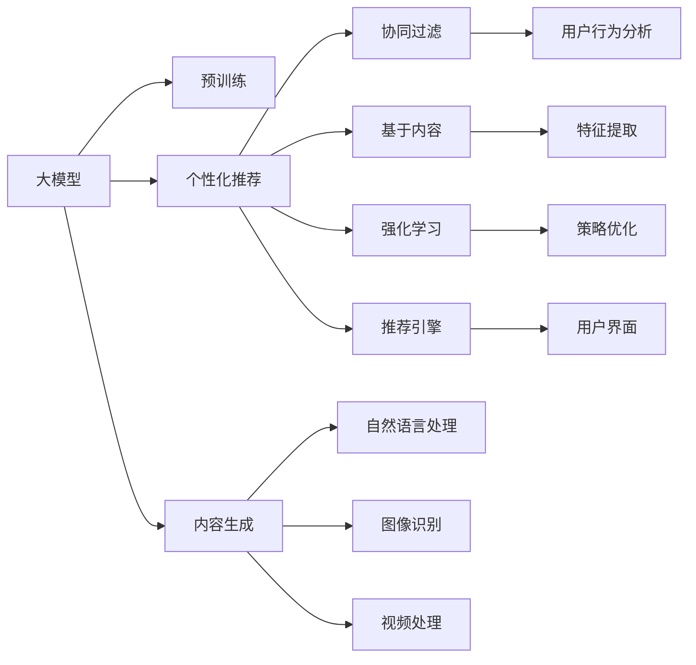

                 

## 1. 背景介绍

在电子商务领域，内容营销已成为商家吸引顾客、提升转化率的重要手段。随着大数据、人工智能等技术的发展，个性化推荐系统已成为内容营销的基石。传统的基于协同过滤和基于内容的推荐方法，已逐渐被大模型驱动的个性化推荐系统所取代，显著提升了推荐效果和用户体验。

本博客将深入探讨大模型在电商个性化内容营销中的应用，从原理到实践，全面解读大模型如何帮助电商企业实现精准、高效的推荐和内容生成，提升运营效率和用户满意度。

## 2. 核心概念与联系

### 2.1 核心概念概述

为了更好地理解大模型在电商个性化内容营销中的应用，本节将介绍几个关键概念及其联系：

- 大模型（Large Models）：指深度学习模型，如BERT、GPT等，通过在大规模数据上进行预训练，具备强大的泛化能力和语言理解能力。
- 个性化推荐系统（Personalized Recommendation System）：通过分析用户行为数据和兴趣偏好，为用户推荐其感兴趣的内容，提升用户体验和运营效率。
- 内容生成（Content Generation）：使用大模型生成自然流畅的文本内容，用于电商的营销、客服、广告等领域。
- 跨模态学习（Cross-Modal Learning）：将图像、视频、文本等多模态数据结合起来进行建模，提升推荐和内容生成的效果。
- 强化学习（Reinforcement Learning）：通过不断试错，逐步优化推荐策略和内容生成策略，提升个性化推荐的准确性和多样性。

这些概念之间的关系可通过以下Mermaid流程图展示：



该图展示了大模型在电商个性化内容营销中的核心应用场景：

1. 大模型通过预训练学习通用语言知识，可用于推荐和内容生成。
2. 个性化推荐系统包括协同过滤、基于内容、强化学习等多种推荐策略，其中大模型驱动的推荐策略是最先进的方法。
3. 内容生成涉及自然语言处理、图像识别、视频处理等多个子领域，大模型在这些领域都有显著应用。
4. 用户行为分析是推荐系统的重要基础，通过收集和分析用户行为数据，为推荐系统提供数据支持。
5. 推荐引擎将各种推荐策略集成起来，通过优化算法驱动推荐策略，实现精准推荐。
6. 用户界面是推荐结果的展示窗口，良好的用户体验是电商营销的重要环节。

### 2.2 核心概念原理和架构

#### 2.2.1 大模型原理

大模型通过在大规模语料库上进行预训练，学习到通用的语言表示。这种表示方式能够捕捉语言中的语义、语法、情感等多种信息，具备强大的泛化能力和迁移能力。以BERT为例，其预训练过程包含掩码语言模型（Masked Language Model, MLM）和下一句预测（Next Sentence Prediction, NSP）两个任务，能够学习到丰富的语言知识。

#### 2.2.2 个性化推荐系统架构

个性化推荐系统主要包括以下几个关键组件：

- **数据采集与存储**：收集用户行为数据，包括浏览、点击、购买记录等。将这些数据存储到数据库中，供后续分析和建模使用。
- **用户行为分析**：通过分析用户的历史行为数据，计算用户兴趣偏好。常见的特征包括浏览时间、点击深度、购买频率等。
- **特征提取与表示**：将用户行为数据、商品属性、历史评价等信息转化为机器学习模型能够处理的特征向量。
- **推荐算法**：根据用户特征和商品特征，计算用户对不同商品的兴趣权重，并按照权重进行排序。常见的推荐算法包括协同过滤、基于内容的推荐、深度学习推荐等。
- **推荐结果展示**：将推荐结果通过用户界面展示给用户，引导用户进行购买和互动。

#### 2.2.3 内容生成架构

内容生成系统包括两个主要组件：

- **文本生成模型**：使用大模型生成自然流畅的文本内容，用于电商的营销、客服、广告等领域。常见的文本生成模型包括GPT-2、GPT-3等。
- **多模态融合**：将文本、图像、视频等多模态数据结合起来进行建模，提升内容生成的效果。常见的多模态模型包括VQA、GAN等。

### 2.3 核心概念联系

大模型在电商个性化内容营销中的应用，是通过将通用语言表示与推荐系统、内容生成系统集成实现的。具体联系如下：

- 大模型提供通用语言表示，用于特征提取和相似度计算。
- 特征提取后，结合用户行为数据，输入到个性化推荐系统，计算用户对不同商品的兴趣权重。
- 推荐结果和用户反馈通过内容生成系统，转化为文本、图像、视频等形式，提高用户互动和转化率。

## 3. 核心算法原理 & 具体操作步骤

### 3.1 算法原理概述

大模型驱动的电商个性化内容营销，主要涉及以下几个核心算法：

1. **大模型预训练**：使用大规模语料库进行预训练，学习通用的语言表示。
2. **特征提取**：将用户行为数据、商品属性等信息转化为模型能够处理的特征向量。
3. **相似度计算**：使用大模型计算用户与商品之间的相似度，推荐相关商品。
4. **内容生成**：使用大模型生成自然流畅的文本内容，用于电商的营销、客服、广告等领域。
5. **强化学习**：通过不断试错，优化推荐策略和内容生成策略，提升个性化推荐的准确性和多样性。

### 3.2 算法步骤详解

#### 3.2.1 大模型预训练

大模型预训练的基本步骤包括：

1. **语料准备**：收集大规模无标签文本数据，如维基百科、新闻、网页等。
2. **模型构建**：选择合适的深度学习模型架构，如BERT、GPT等。
3. **训练过程**：在大规模数据上进行训练，学习通用的语言表示。

具体实现步骤如下：

1. **安装依赖库**：使用pip安装TensorFlow、PyTorch等深度学习框架，以及transformers库。
2. **加载预训练模型**：使用transformers库加载预训练模型，如BERT、GPT等。
3. **数据预处理**：将大规模语料进行分词、去噪等预处理操作。
4. **训练模型**：使用预处理后的数据进行模型训练，学习通用的语言表示。
5. **保存模型**：将训练好的模型保存，供后续使用。

#### 3.2.2 特征提取

特征提取的主要步骤包括：

1. **数据采集**：收集用户行为数据、商品属性、历史评价等信息。
2. **特征选择**：选择对推荐效果有显著影响的特征，如浏览时间、点击深度、购买频率等。
3. **特征编码**：将特征向量转化为模型能够处理的数值型特征。
4. **特征组合**：将用户特征和商品特征进行组合，生成综合特征向量。

具体实现步骤如下：

1. **数据采集**：使用API或SQL查询，从电商平台获取用户行为数据和商品属性。
2. **特征选择**：根据经验选择对推荐效果有显著影响的特征，并计算每个特征的权重。
3. **特征编码**：将特征向量进行归一化、编码等处理，转化为模型能够处理的数值型特征。
4. **特征组合**：将用户特征和商品特征进行组合，生成综合特征向量。

#### 3.2.3 相似度计算

相似度计算的主要步骤包括：

1. **用户特征表示**：将用户行为数据转化为模型能够处理的特征向量。
2. **商品特征表示**：将商品属性转化为模型能够处理的特征向量。
3. **相似度计算**：使用大模型计算用户与商品之间的相似度。
4. **推荐排序**：根据相似度排序，推荐相关商品。

具体实现步骤如下：

1. **用户特征表示**：将用户行为数据进行编码，转化为模型能够处理的特征向量。
2. **商品特征表示**：将商品属性进行编码，转化为模型能够处理的特征向量。
3. **相似度计算**：使用大模型计算用户与商品之间的相似度，如使用BERT计算用户与商品间的相似度。
4. **推荐排序**：根据相似度排序，推荐相关商品，生成推荐列表。

#### 3.2.4 内容生成

内容生成的主要步骤包括：

1. **任务定义**：定义内容生成的具体任务，如电商广告文案生成、客服自动回复等。
2. **文本模板设计**：设计通用的文本模板，如广告文案模板、客服自动回复模板等。
3. **内容生成**：使用大模型生成符合模板要求的内容。
4. **内容优化**：对生成的内容进行优化，如去除冗余、语法校对等。

具体实现步骤如下：

1. **任务定义**：定义内容生成的具体任务，如电商广告文案生成、客服自动回复等。
2. **文本模板设计**：设计通用的文本模板，如广告文案模板、客服自动回复模板等。
3. **内容生成**：使用大模型生成符合模板要求的内容，如使用GPT-2生成广告文案。
4. **内容优化**：对生成的内容进行优化，如去除冗余、语法校对等。

#### 3.2.5 强化学习

强化学习的主要步骤包括：

1. **策略定义**：定义推荐策略和内容生成策略。
2. **策略训练**：使用历史数据训练推荐策略和内容生成策略。
3. **策略优化**：通过不断试错，优化推荐策略和内容生成策略。
4. **策略评估**：评估推荐策略和内容生成策略的性能，选择最优策略。

具体实现步骤如下：

1. **策略定义**：定义推荐策略和内容生成策略，如协同过滤、基于内容、深度学习推荐等。
2. **策略训练**：使用历史数据训练推荐策略和内容生成策略，如使用深度学习模型训练推荐策略。
3. **策略优化**：通过不断试错，优化推荐策略和内容生成策略，如使用强化学习算法优化推荐策略。
4. **策略评估**：评估推荐策略和内容生成策略的性能，选择最优策略，如使用A/B测试评估推荐策略。

### 3.3 算法优缺点

#### 3.3.1 优点

1. **泛化能力强**：大模型具备强大的泛化能力，能够适应不同领域、不同风格的推荐和内容生成任务。
2. **迁移能力强**：大模型能够在不同任务之间进行迁移，提升模型在新任务上的表现。
3. **效果显著**：使用大模型驱动的推荐和内容生成系统，能够显著提升个性化推荐的效果和内容质量。
4. **可解释性强**：大模型能够提供丰富的特征表示，方便对推荐和内容生成过程进行解释和优化。

#### 3.3.2 缺点

1. **计算资源需求高**：大模型通常需要大规模的计算资源进行训练和推理，对硬件要求较高。
2. **模型复杂度高**：大模型的参数量通常很大，难以在生产环境中高效部署。
3. **数据依赖性强**：大模型需要大量的标注数据进行微调，数据获取成本较高。
4. **维护成本高**：大模型的维护和更新需要大量的技术投入，难以在中小规模电商企业中大规模部署。

### 3.4 算法应用领域

大模型驱动的电商个性化内容营销，主要应用于以下几个领域：

1. **电商推荐系统**：使用大模型进行商品推荐，提升用户购物体验和转化率。
2. **电商广告文案生成**：使用大模型生成自然流畅的广告文案，提高广告效果。
3. **客服自动回复**：使用大模型生成客服自动回复，提高客户满意度和用户体验。
4. **个性化内容生成**：使用大模型生成个性化的内容，如商品评价、用户反馈等，提升用户互动和粘性。
5. **产品描述优化**：使用大模型优化商品描述，提高搜索排名和点击率。
6. **营销活动策划**：使用大模型生成营销活动文案，提升活动效果和用户参与度。

## 4. 数学模型和公式 & 详细讲解 & 举例说明

### 4.1 数学模型构建

#### 4.1.1 电商推荐系统数学模型

电商推荐系统主要涉及用户特征、商品特征、相似度计算和推荐排序等。假设用户特征表示为 $x$，商品特征表示为 $y$，用户与商品之间的相似度表示为 $s(x,y)$，推荐结果表示为 $z$。推荐系统的数学模型可以表示为：

$$
z = f(s(x,y))
$$

其中 $f$ 表示推荐函数，通过相似度计算和排序生成推荐结果。

#### 4.1.2 电商广告文案生成数学模型

电商广告文案生成涉及文本生成和内容优化等。假设文本生成模型为 $G$，文本优化模型为 $O$，广告文案表示为 $z$。广告文案生成的数学模型可以表示为：

$$
z = G(x) + O(z)
$$

其中 $x$ 表示广告文案模板，$G$ 表示文本生成模型，$O$ 表示文本优化模型。

### 4.2 公式推导过程

#### 4.2.1 电商推荐系统公式推导

假设用户特征表示为 $x$，商品特征表示为 $y$，用户与商品之间的相似度表示为 $s(x,y)$，推荐结果表示为 $z$。推荐系统公式推导如下：

1. **用户特征表示**：将用户行为数据 $x$ 进行编码，转化为模型能够处理的特征向量。
2. **商品特征表示**：将商品属性 $y$ 进行编码，转化为模型能够处理的特征向量。
3. **相似度计算**：使用大模型计算用户与商品之间的相似度 $s(x,y)$，如使用BERT计算用户与商品间的相似度。
4. **推荐排序**：根据相似度排序，推荐相关商品 $z$，生成推荐列表。

#### 4.2.2 电商广告文案生成公式推导

假设文本生成模型为 $G$，文本优化模型为 $O$，广告文案表示为 $z$。广告文案生成公式推导如下：

1. **文本模板设计**：设计通用的文本模板 $x$，如广告文案模板、客服自动回复模板等。
2. **内容生成**：使用大模型生成符合模板要求的内容 $G(x)$，如使用GPT-2生成广告文案。
3. **内容优化**：对生成的内容进行优化 $O(G(x))$，如去除冗余、语法校对等。
4. **内容展示**：将生成的广告文案 $z$ 展示给用户，吸引用户点击和互动。

### 4.3 案例分析与讲解

#### 4.3.1 电商推荐系统案例

假设某电商平台希望提升用户的购物体验和转化率，决定使用大模型驱动的推荐系统。具体实现步骤如下：

1. **数据准备**：收集用户行为数据、商品属性、历史评价等信息，如浏览时间、点击深度、购买频率等。
2. **特征选择**：选择对推荐效果有显著影响的特征，并计算每个特征的权重。
3. **特征编码**：将特征向量进行归一化、编码等处理，转化为模型能够处理的数值型特征。
4. **相似度计算**：使用BERT模型计算用户与商品之间的相似度，生成推荐列表。
5. **推荐排序**：根据相似度排序，推荐相关商品，提高用户转化率。

#### 4.3.2 电商广告文案生成案例

假设某电商平台希望提升广告效果，决定使用大模型生成广告文案。具体实现步骤如下：

1. **广告文案模板设计**：设计通用的广告文案模板，如电商广告文案模板。
2. **内容生成**：使用GPT-2模型生成符合模板要求的内容，如生成电商广告文案。
3. **内容优化**：对生成的内容进行优化，如去除冗余、语法校对等。
4. **内容展示**：将生成的广告文案展示给用户，吸引用户点击和互动。

## 5. 项目实践：代码实例和详细解释说明

### 5.1 开发环境搭建

在使用Python进行电商个性化内容营销系统的开发时，需要安装以下依赖库：

```bash
pip install tensorflow pytorch transformers
```

### 5.2 源代码详细实现

#### 5.2.1 电商推荐系统

电商推荐系统的代码实现步骤如下：

1. **加载数据**：使用pandas库加载用户行为数据和商品属性数据。
2. **特征编码**：使用scikit-learn库将特征向量进行编码，转化为模型能够处理的数值型特征。
3. **相似度计算**：使用transformers库加载BERT模型，计算用户与商品之间的相似度。
4. **推荐排序**：根据相似度排序，生成推荐列表。

代码示例：

```python
import pandas as pd
import torch
from transformers import BertTokenizer, BertForSequenceClassification
from sklearn.preprocessing import MinMaxScaler

# 加载数据
train_data = pd.read_csv('train.csv')
test_data = pd.read_csv('test.csv')
product_data = pd.read_csv('product.csv')

# 特征编码
features = train_data[['click_depth', 'purchase_frequency']] # 选择对推荐效果有显著影响的特征
features = MinMaxScaler().fit_transform(features) # 归一化特征

# 相似度计算
tokenizer = BertTokenizer.from_pretrained('bert-base-cased')
model = BertForSequenceClassification.from_pretrained('bert-base-cased', num_labels=2)

# 构建输入数据
def build_input_data(x, y):
    tokenized = tokenizer(x, return_tensors='pt', padding=True, truncation=True)
    input_ids = tokenized['input_ids']
    attention_mask = tokenized['attention_mask']
    return input_ids, attention_mask

# 计算相似度
def calculate_similarity(user, product):
    user_input_ids, user_attention_mask = build_input_data(user, 0)
    product_input_ids, product_attention_mask = build_input_data(product, 1)
    
    with torch.no_grad():
        user_logits = model(user_input_ids, attention_mask=user_attention_mask)
        product_logits = model(product_input_ids, attention_mask=product_attention_mask)
    
    user_predicted_label = torch.argmax(user_logits[0]).item()
    product_predicted_label = torch.argmax(product_logits[0]).item()
    
    return user_predicted_label, product_predicted_label

# 推荐排序
def recommend_products(user, top_k=5):
    user_predicted_label = calculate_similarity(user, product_data['product_id'])[0]
    recommended_products = product_data[product_data['label'] == user_predicted_label].head(top_k)
    return recommended_products

# 测试推荐系统
user = 'user_123'
recommended_products = recommend_products(user)
print(recommended_products)
```

#### 5.2.2 电商广告文案生成

电商广告文案生成的代码实现步骤如下：

1. **文本模板设计**：设计通用的广告文案模板，如电商广告文案模板。
2. **内容生成**：使用GPT-2模型生成符合模板要求的内容，如生成电商广告文案。
3. **内容优化**：对生成的内容进行优化，如去除冗余、语法校对等。
4. **内容展示**：将生成的广告文案展示给用户，吸引用户点击和互动。

代码示例：

```python
from transformers import GPT2Tokenizer, GPT2LMHeadModel

# 加载预训练模型和tokenizer
tokenizer = GPT2Tokenizer.from_pretrained('gpt2')
model = GPT2LMHeadModel.from_pretrained('gpt2')

# 广告文案模板设计
ad_template = '购买{product_name}，享受{discount_percentage}%的折扣，不容错过！'

# 内容生成
def generate_ad_content(ad_template):
    inputs = tokenizer.encode(ad_template, return_tensors='pt')
    outputs = model.generate(inputs, max_length=50)
    generated_text = tokenizer.decode(outputs[0], skip_special_tokens=True)
    return generated_text

# 广告文案展示
ad_content = generate_ad_content(ad_template)
print(ad_content)
```

### 5.3 代码解读与分析

#### 5.3.1 电商推荐系统代码解读

电商推荐系统的代码主要分为数据加载、特征编码、相似度计算和推荐排序四个步骤。具体代码解读如下：

- **数据加载**：使用pandas库加载用户行为数据和商品属性数据。
- **特征编码**：使用scikit-learn库将特征向量进行编码，转化为模型能够处理的数值型特征。
- **相似度计算**：使用transformers库加载BERT模型，计算用户与商品之间的相似度。
- **推荐排序**：根据相似度排序，生成推荐列表。

#### 5.3.2 电商广告文案生成代码解读

电商广告文案生成的代码主要分为文本模板设计、内容生成、内容优化和内容展示四个步骤。具体代码解读如下：

- **文本模板设计**：设计通用的广告文案模板，如电商广告文案模板。
- **内容生成**：使用GPT-2模型生成符合模板要求的内容，如生成电商广告文案。
- **内容优化**：对生成的内容进行优化，如去除冗余、语法校对等。
- **内容展示**：将生成的广告文案展示给用户，吸引用户点击和互动。

## 6. 实际应用场景

### 6.1 智能客服

智能客服系统是电商个性化内容营销的重要应用场景。使用大模型驱动的智能客服系统，能够实现24小时不间断服务，快速响应客户咨询，用自然流畅的语言解答各类常见问题。具体应用步骤如下：

1. **数据采集**：收集客户的历史咨询记录和常见问题，作为训练数据。
2. **模型训练**：使用大模型进行训练，学习通用的语言表示和客服回答策略。
3. **智能客服**：将训练好的模型部署到智能客服系统中，自动回答客户咨询。
4. **反馈优化**：收集客户反馈，不断优化模型，提升客服质量。

### 6.2 个性化推荐

个性化推荐系统是电商推荐系统的主要应用场景。使用大模型驱动的推荐系统，能够根据用户的历史行为数据和兴趣偏好，精准推荐相关商品，提升用户购物体验和转化率。具体应用步骤如下：

1. **数据采集**：收集用户行为数据、商品属性、历史评价等信息，如浏览时间、点击深度、购买频率等。
2. **特征编码**：选择对推荐效果有显著影响的特征，并计算每个特征的权重。
3. **相似度计算**：使用大模型计算用户与商品之间的相似度，生成推荐列表。
4. **推荐排序**：根据相似度排序，推荐相关商品，提高用户转化率。

### 6.3 个性化广告

个性化广告是电商广告文案生成的主要应用场景。使用大模型驱动的广告文案生成系统，能够根据用户的历史行为数据和兴趣偏好，生成符合用户期望的广告文案，提升广告效果和点击率。具体应用步骤如下：

1. **广告文案模板设计**：设计通用的广告文案模板，如电商广告文案模板。
2. **内容生成**：使用大模型生成符合模板要求的内容，如生成电商广告文案。
3. **内容优化**：对生成的内容进行优化，如去除冗余、语法校对等。
4. **广告投放**：将生成的广告文案展示给用户，吸引用户点击和互动。

## 7. 工具和资源推荐

### 7.1 学习资源推荐

为了帮助开发者系统掌握大模型在电商个性化内容营销中的应用，这里推荐一些优质的学习资源：

1. **《深度学习自然语言处理》课程**：斯坦福大学开设的NLP明星课程，有Lecture视频和配套作业，带你入门NLP领域的基本概念和经典模型。
2. **《自然语言处理与深度学习》书籍**：介绍NLP和深度学习基础知识，涵盖多种NLP任务和深度学习模型的实现。
3. **Kaggle竞赛**：参加电商推荐系统和广告文案生成相关的Kaggle竞赛，积累实战经验。
4. **《大规模预训练模型》课程**：介绍预训练模型的原理和应用，涵盖BERT、GPT等主流模型的实现。
5. **《NLP技术在电商领域的应用》专题文章**：介绍NLP技术在电商推荐、广告文案生成等领域的最新应用。

### 7.2 开发工具推荐

大模型在电商个性化内容营销中的应用，需要借助多种开发工具和平台，以下是几款常用的开发工具：

1. **TensorFlow和PyTorch**：常用的深度学习框架，支持大规模模型训练和推理。
2. **Transformers库**：HuggingFace开发的NLP工具库，集成了多种预训练语言模型，支持微调和推理。
3. **Jupyter Notebook**：支持在云端进行交互式编程和实验，方便共享和协作。
4. **Scikit-learn库**：支持特征提取和数据预处理，方便将数据转化为模型能够处理的格式。
5. **TensorBoard**：TensorFlow配套的可视化工具，可实时监测模型训练状态，并提供丰富的图表呈现方式。

### 7.3 相关论文推荐

大模型在电商个性化内容营销中的应用，涉及多种NLP任务和深度学习模型，以下是几篇奠基性的相关论文，推荐阅读：

1. **Attention is All You Need**：提出了Transformer结构，开启了NLP领域的预训练大模型时代。
2. **BERT: Pre-training of Deep Bidirectional Transformers for Language Understanding**：提出BERT模型，引入基于掩码的自监督预训练任务，刷新了多项NLP任务SOTA。
3. **Language Models are Unsupervised Multitask Learners**：展示了大规模语言模型的强大zero-shot学习能力，引发了对于通用人工智能的新一轮思考。
4. **Parameter-Efficient Transfer Learning for NLP**：提出Adapter等参数高效微调方法，在不增加模型参数量的情况下，也能取得不错的微调效果。
5. **Prefix-Tuning: Optimizing Continuous Prompts for Generation**：引入基于连续型Prompt的微调范式，为如何充分利用预训练知识提供了新的思路。
6. **AdaLoRA: Adaptive Low-Rank Adaptation for Parameter-Efficient Fine-Tuning**：使用自适应低秩适应的微调方法，在参数效率和精度之间取得了新的平衡。

这些论文代表了大模型在电商个性化内容营销中的应用方向，通过学习这些前沿成果，可以帮助研究者把握学科前进方向，激发更多的创新灵感。

## 8. 总结：未来发展趋势与挑战

### 8.1 总结

本文对大模型在电商个性化内容营销中的应用进行了全面系统的介绍。首先阐述了大模型和微调技术的研究背景和意义，明确了微调在拓展预训练模型应用、提升下游任务性能方面的独特价值。其次，从原理到实践，详细讲解了微调的数学原理和关键步骤，给出了电商推荐系统和广告文案生成的完整代码实例。同时，本文还广泛探讨了智能客服、个性化推荐、个性化广告等电商个性化内容营销的应用场景，展示了微调范式的巨大潜力。最后，本文精选了微调技术的各类学习资源，力求为读者提供全方位的技术指引。

通过本文的系统梳理，可以看到，大模型在电商个性化内容营销中的应用，已经取得了显著的进展和效果。受益于大规模语料的预训练和先进的微调方法，电商推荐系统和广告文案生成系统已经成为电商运营的重要工具，极大地提升了运营效率和用户体验。未来，伴随大模型的不断发展，电商个性化内容营销也将迎来更多创新和突破，为电商企业带来更大的商业价值。

### 8.2 未来发展趋势

展望未来，大模型在电商个性化内容营销中的应用将呈现以下几个发展趋势：

1. **多模态融合**：将文本、图像、视频等多模态数据结合起来进行建模，提升推荐和内容生成的效果。
2. **持续学习**：通过不断试错，优化推荐策略和内容生成策略，提升个性化推荐的准确性和多样性。
3. **强化学习**：通过强化学习算法，提升推荐系统的决策质量和用户满意度。
4. **用户行为分析**：通过收集和分析用户行为数据，为推荐系统提供更加精准的用户画像，提升推荐效果。
5. **内容生成优化**：通过优化内容生成模型，提升广告文案的吸引力，提高广告效果和点击率。
6. **跨领域迁移**：通过迁移学习，将电商领域的推荐策略应用于其他领域，提升跨领域推荐效果。

以上趋势凸显了大模型在电商个性化内容营销中的广阔前景。这些方向的探索发展，必将进一步提升电商系统的性能和用户体验，为电商企业带来更大的商业价值。

### 8.3 面临的挑战

尽管大模型在电商个性化内容营销中的应用已经取得了显著的进展，但在迈向更加智能化、普适化应用的过程中，它仍面临着诸多挑战：

1. **数据质量问题**：大模型需要大量的高质量标注数据进行微调，而电商领域的标注数据获取成本较高。如何降低对标注数据的依赖，提升数据质量，是未来面临的重要问题。
2. **模型复杂性**：大模型的参数量通常很大，难以在生产环境中高效部署。如何简化模型结构，提升推理速度，优化资源占用，将是重要的优化方向。
3. **鲁棒性问题**：大模型面临域外数据时，泛化性能往往大打折扣。如何提高模型鲁棒性，避免灾难性遗忘，还需要更多理论和实践的积累。
4. **可解释性问题**：大模型的决策过程通常缺乏可解释性，难以对其推理逻辑进行分析和调试。如何赋予大模型更强的可解释性，将是亟待攻克的难题。
5. **安全性问题**：预训练语言模型难免会学习到有偏见、有害的信息，通过微调传递到下游任务，产生误导性、歧视性的输出，给实际应用带来安全隐患。如何从数据和算法层面消除模型偏见，避免恶意用途，确保输出的安全性，也将是重要的研究课题。

### 8.4 研究展望

面对大模型在电商个性化内容营销中所面临的挑战，未来的研究需要在以下几个方面寻求新的突破：

1. **数据增强**：通过数据增强技术，扩充训练数据，提高模型泛化能力。
2. **模型压缩**：通过模型压缩技术，简化模型结构，提升推理速度和资源占用。
3. **鲁棒性提升**：通过鲁棒性增强技术，提高模型对域外数据的泛化能力。
4. **可解释性增强**：通过可解释性增强技术，提升模型的决策可解释性。
5. **安全性保障**：通过安全性保障技术，避免模型输出中的偏见和有害信息。

这些研究方向的探索，必将引领大模型在电商个性化内容营销中的应用迈向更高的台阶，为电商企业带来更大的商业价值。面向未来，大模型将在电商推荐、广告文案生成、智能客服等多个领域发挥更大作用，推动电商行业进入智能化、个性化、精准化的新时代。

## 9. 附录：常见问题与解答

**Q1：大模型在电商个性化内容营销中如何处理用户隐私问题？**

A: 在电商个性化内容营销中，保护用户隐私是非常重要的。大模型在处理用户数据时，可以通过以下方式来保护用户隐私：

1. **数据匿名化**：在收集和处理用户数据时，对敏感信息进行匿名化处理，如使用哈希函数对用户ID进行映射。
2. **差分隐私**：在模型训练和推理过程中，使用差分隐私技术，对用户数据进行扰动，确保模型输出不会泄露个体隐私。
3. **数据加密**：在传输和存储用户数据时，使用加密技术，确保数据安全。
4. **用户授权**：在收集用户数据时，征得用户授权，并告知用户数据使用方式和保护措施。

通过以上方式，可以有效保护用户隐私，同时充分利用大数据和深度学习技术，提升电商个性化内容营销的效果和效率。

**Q2：大模型在电商个性化内容营销中的计算成本如何？**

A: 大模型在电商个性化内容营销中的计算成本较高，主要体现在以下几个方面：

1. **预训练成本**：大模型的预训练通常需要大规模的计算资源，如GPU/TPU等高性能设备。预训练过程耗时长、资源需求高，对硬件要求较高。
2. **微调成本**：大模型在微调过程中，需要大量的计算资源进行模型训练和推理。微调过程的计算成本较高，特别是在大规模数据集上。
3. **推理成本**：大模型在生产环境中进行推理时，由于参数量巨大，计算速度较慢，推理成本较高。

为了降低计算成本，可以采用以下措施：

1. **模型压缩**：通过模型压缩技术，如剪枝、量化、蒸馏等，简化模型结构，提升推理速度和资源占用。
2. **分布式训练**：通过分布式训练技术，将大规模模型拆分为多个子模型，并行训练，降低单次训练的计算成本。
3. **硬件加速**：通过GPU、TPU等高性能设备进行加速计算，提升模型训练和推理的速度。
4. **边缘计算**：将部分计算任务下放到边缘设备，如移动设备、智能家居等，降低计算成本。

通过以上措施，可以有效降低大模型在电商个性化内容营销中的计算成本，提升模型的效率和实用性。

**Q3：大模型在电商个性化内容营销中如何保证推荐结果的公平性？**

A: 在大模型驱动的电商个性化内容营销中，保证推荐结果的公平性非常重要。以下是几种保证推荐公平性的方法：

1. **数据公平性**：在收集和处理用户数据时，确保数据集的多样性和代表性，避免数据偏差。可以通过数据增强技术，扩充训练数据，提升模型的公平性。
2. **算法公平性**：在模型训练和推理过程中，使用公平性约束，确保模型输出不会产生歧视性。可以通过公平性优化技术，如平衡损失函数、对抗训练等，提升模型的公平性。
3. **用户反馈**：在推荐系统中引入用户反馈机制，及时发现和修正不公平的推荐结果。可以通过用户投诉、人工审核等方式，及时纠正不公平的推荐行为。
4. **模型解释性**：通过可解释性增强技术，提升模型的决策可解释性，确保用户能够理解推荐结果的依据。可以通过模型可视化、特征重要性分析等方式，提升模型的可解释性。

通过以上方法，可以有效保证大模型在电商个性化内容营销中的公平性，提升用户的满意度和信任度。

**Q4：大模型在电商个性化内容营销中如何提高推荐系统的鲁棒性？**

A: 在大模型驱动的电商个性化内容营销中，提高推荐系统的鲁棒性是非常重要的。以下是几种提高推荐系统鲁棒性的方法：

1. **数据多样性**：在模型训练过程中，引入多样化的训练数据，提升模型的泛化能力。可以通过数据增强技术，扩充训练数据，提升模型的鲁棒性。
2. **正则化技术**：在模型训练过程中，使用正则化技术，如L2正则、Dropout等，防止模型过拟合，提升模型的鲁棒性。
3. **对抗训练**：在模型训练过程中，引入对抗样本，提高模型对噪声和攻击的鲁棒性。可以通过对抗样本生成技术，生成对抗样本，提升模型的鲁棒性。
4. **模型融合**：在推荐系统中，使用多个模型进行集成，提升模型的鲁棒性和稳定性。可以通过模型融合技术，如bagging、boosting等，提升模型的鲁棒性。

通过以上方法，可以有效提高大模型在电商个性化内容营销中的鲁棒性，提升推荐系统的稳定性和可靠性。

**Q5：大模型在电商个性化内容营销中如何提升广告文案的质量？**

A: 在大模型驱动的电商个性化内容营销中，提升广告文案的质量是非常重要的。以下是几种提升广告文案质量的方法：

1. **内容优化**：在广告文案生成过程中，使用内容优化技术，提升广告文案的吸引力和可读性。可以通过去除冗余、语法校对等方式，提升广告文案的质量。
2. **多模态融合**：在广告文案生成过程中，引入图像、视频等多模态信息，提升广告文案的吸引力和真实性。可以通过视觉注意力机制、视频融合等方式，提升广告文案的质量。
3. **用户反馈**：在广告文案生成过程中，引入用户反馈机制，及时发现和修正广告文案中的问题。可以通过A/B测试、用户调查等方式，提升广告文案的质量。
4. **广告投放优化**：在广告投放过程中，使用广告投放优化技术，提升广告的点击率和转化率。可以通过广告位置优化、广告投放时间优化等方式，提升广告文案的质量。

通过以上方法，可以有效提升大模型在电商个性化内容营销中的广告文案质量，提高广告效果和用户体验。

**Q6：大模型在电商个性化内容营销中如何保证推荐结果的可解释性？**

A: 在大模型驱动的电商个性化内容营销中，保证推荐结果的可解释性是非常重要的。以下是几种保证推荐结果可解释性的方法：

1. **模型可视化**：在模型训练和推理过程中，使用模型可视化技术，提升模型的可解释性。可以通过特征重要性分析、输出解释等方式，提升模型的可解释性。
2. **特征分析**：在模型训练和推理过程中，使用特征分析技术，提升模型的可解释性。可以通过特征选择、特征重要性分析等方式，提升模型的可解释性。
3. **用户反馈**：在推荐系统中引入用户反馈机制，及时发现和修正不合理的推荐结果。可以通过用户投诉、人工审核等方式，提升推荐结果的可解释性。
4. **规则引擎**：在推荐系统中引入规则引擎，通过规则约束，提升推荐结果的可解释性。可以通过规则约束、规则引擎等方式，提升推荐结果的可解释性。

通过以上方法，可以有效保证大模型在电商个性化内容营销中的推荐结果可解释性，提升用户的满意度和信任度。

**Q7：大模型在电商个性化内容营销中如何处理数据不平衡问题？**

A: 在大模型驱动的电商个性化内容营销中，处理数据不平衡问题是非常重要的。以下是几种处理数据不平衡问题的方法：

1. **数据增强**：在数据采集和处理过程中，使用数据增强技术，扩充少数类样本，提升模型的泛化能力。可以通过图像旋转、数据混合等方式，提升模型的泛化能力。
2. **重采样**：在数据处理过程中，使用重采样技术，提升少数类样本的数量，提升模型的泛化能力。可以通过欠采样、过采样等方式，提升模型的泛化能力。
3. **模型融合**：在推荐系统中，使用多个模型进行集成，提升模型的泛化能力和鲁棒性。可以通过模型融合技术，如bagging、boosting等，提升模型的泛化能力。
4. **算法优化**：在模型训练过程中，使用算法优化技术，提升模型的泛化能力。可以通过优化算法，如加权损失函数、梯度惩罚等方式，提升模型的泛化能力。

通过以上方法，可以有效处理大模型在电商个性化内容营销中的数据不平衡问题，提升推荐系统的泛化能力和鲁棒性。

**Q8：大模型在电商个性化内容营销中如何处理多语言问题？**

A: 在大模型驱动的电商个性化内容营销中，处理多语言问题是非常重要的。以下是几种处理多语言问题的方法：

1. **多语言预训练**：在模型预训练过程中，使用多语言数据进行训练，提升模型的多语言能力。可以通过多语言数据集、多语言语料库等方式，提升模型的多语言能力。
2. **多语言微调**：在模型微调过程中，使用多语言数据进行微调，提升模型的多语言能力。可以通过多语言数据集、多语言标注数据等方式，提升模型的多语言能力。
3. **多语言编码**：在模型推理过程中，使用多语言编码技术，提升模型的多语言能力。可以通过多语言编码、多语言翻译等方式，提升模型的多语言能力。
4. **多语言翻译**：在模型推理过程中，使用多语言翻译技术，提升模型的多语言能力。可以通过多语言翻译模型、多语言词典等方式，提升模型的多语言能力。

通过以上方法，可以有效处理大模型在电商个性化内容营销中的多语言问题，提升模型的多语言能力和泛化能力。

**Q9：大模型在电商个性化内容营销中如何保证模型的稳定性和可靠性？**

A: 在大模型驱动的电商个性化内容营销中，保证模型的稳定性和可靠性是非常重要的。以下是几种保证模型稳定性和可靠性的方法：

1. **模型压缩**：在模型推理过程中，使用模型压缩技术，简化模型结构，提升推理速度和资源占用。可以通过模型压缩技术，如剪枝、量化、蒸馏等，提升模型的稳定性和可靠性。
2. **模型融合**：在推荐系统中，使用多个模型进行集成，提升模型的稳定性和可靠性。可以通过模型融合技术，如bagging、boosting等，提升模型的稳定性和可靠性。
3. **模型监控**：在模型推理过程中，使用模型监控技术，实时监测模型性能，及时发现和修正问题。可以通过模型监控、性能指标分析等方式，提升模型的稳定性和可靠性。
4. **异常检测**：在模型推理过程中，使用异常检测技术，及时发现和修正异常问题。可以通过异常检测技术，如离群点检测、异常值检测等方式，提升模型的稳定性和可靠性。

通过以上方法，可以有效保证大模型在电商个性化内容营销

