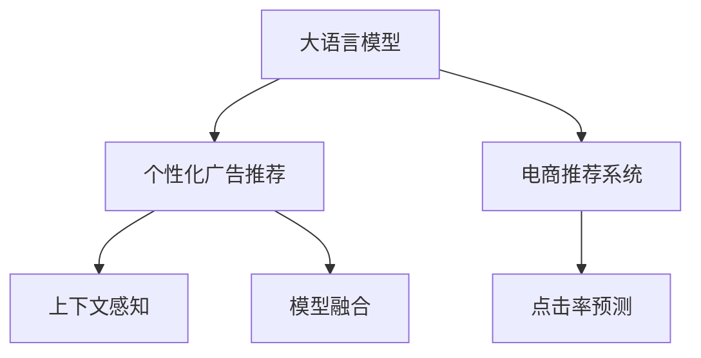
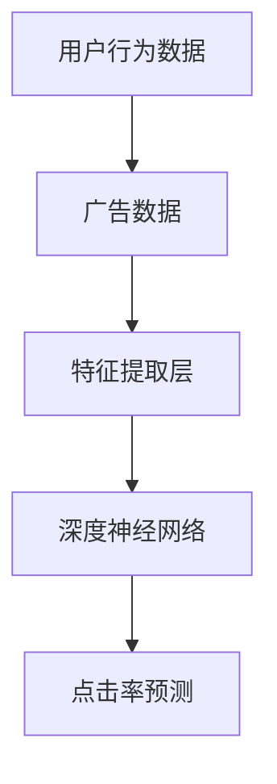
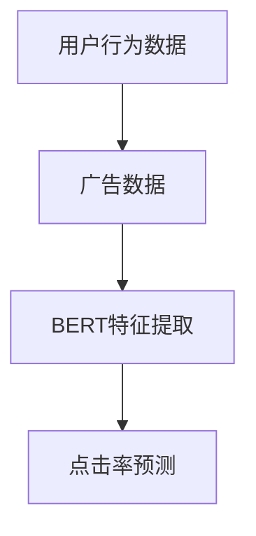

                 

# 大模型驱动的电商平台个性化广告投放

> 关键词：大语言模型, 个性化广告, 电商推荐, 深度学习, 广告投放策略, 点击率预测, 上下文感知, 模型融合

## 1. 背景介绍

### 1.1 问题由来
在互联网电商领域，广告投放是商家获取流量、转化销售的重要手段。传统广告投放往往采用泛泛的策略，例如固定的时间段投放、固定的用户群体投放等。然而，随着个性化和精准化需求的增加，这种泛泛的投放策略已经无法满足商家的需求。如何更高效地利用广告预算，让每一次广告投放都产生尽可能高的回报，成为了电商平台亟待解决的重要问题。

近年来，随着深度学习技术的发展，利用大语言模型驱动的个性化广告投放技术应运而生。这种技术利用预训练语言模型，通过分析用户的历史行为数据、上下文环境信息等，生成更加个性化、精准的广告投放策略，从而显著提升广告点击率和转化率。

### 1.2 问题核心关键点
本文聚焦于利用大语言模型进行个性化广告投放的深度学习应用，从核心概念和算法原理出发，结合具体案例，探讨了如何在大规模电商数据上训练出高精度的个性化广告推荐模型。以下核心问题将构成文章的主要内容：

1. 如何构建电商个性化广告推荐的数学模型？
2. 基于深度学习的个性化广告推荐算法步骤是怎样的？
3. 个性化广告推荐的优势和局限性是什么？
4. 如何利用大语言模型进行电商广告的精准投放？
5. 具体实现中需要注意哪些技术挑战？

### 1.3 问题研究意义
深度学习和大语言模型技术在电商平台个性化广告投放中的应用，不仅能够大幅提升广告的点击率和转化率，还能够在有限广告预算下，实现更高的投资回报率。这种精准化、个性化的广告投放方式，使得电商平台的流量获取和转化变得更加高效和可控。因此，研究如何利用大语言模型驱动电商个性化广告投放，具有重要的实践意义和广阔的市场前景。

## 2. 核心概念与联系

### 2.1 核心概念概述

在进行大模型驱动的电商个性化广告投放研究时，我们需要对以下关键概念进行深入理解：

- 大语言模型：如GPT、BERT等，通过大规模无标签数据预训练，学习到丰富的语言知识，能够理解并生成自然语言文本。
- 个性化广告推荐：根据用户的历史行为、兴趣偏好等，生成最符合用户需求的广告内容。
- 电商推荐系统：利用深度学习等技术，对电商平台上的商品进行推荐，提升用户体验和平台转化率。
- 点击率预测：预测用户看到广告后点击的概率，评估广告投放效果。
- 上下文感知：模型能够综合考虑广告展示时的上下文环境信息，生成更加精准的推荐。
- 模型融合：结合多种模型的预测结果，提升推荐系统的稳定性和泛化能力。

这些概念之间的逻辑关系可以通过以下Mermaid流程图来展示：



这个流程图展示了大语言模型在个性化广告推荐中的应用框架：

1. 大语言模型通过预训练获得强大的语言理解和生成能力。
2. 个性化广告推荐利用大语言模型的能力，生成精准的广告内容。
3. 电商推荐系统在用户行为数据基础上进行推荐。
4. 点击率预测评估广告效果，反馈到推荐系统中。
5. 上下文感知和模型融合进一步提升推荐系统的精准性和稳定性。

## 3. 核心算法原理 & 具体操作步骤

### 3.1 算法原理概述

个性化广告推荐的核心目标是根据用户的历史行为数据和上下文环境信息，生成用户最可能感兴趣的广告内容。本文将从两个主要角度出发，介绍大语言模型在广告推荐中的应用：

1. 基于用户历史行为的广告推荐：通过分析用户过去的点击、浏览、购买等行为，预测用户可能感兴趣的广告。
2. 基于上下文环境的广告推荐：根据广告展示时的具体环境信息，如时间、地点、用户设备等，生成更贴合上下文的广告内容。

在技术实现上，本文将详细介绍如何使用大语言模型进行广告推荐，并结合点击率预测、模型融合等技术，构建一个高效、准确的个性化广告推荐系统。

### 3.2 算法步骤详解

本文将基于深度学习框架PyTorch，介绍一个典型的大语言模型驱动的电商个性化广告推荐系统的实现步骤。

**Step 1: 数据准备**
- 收集电商平台上用户的历史行为数据，包括用户的浏览记录、点击记录、购买记录等。
- 收集广告数据，包括广告内容、广告类型、广告位置等。
- 将用户行为数据和广告数据进行归一化处理，生成训练集和测试集。

**Step 2: 模型搭建**
- 搭建大语言模型，如GPT、BERT等，作为广告推荐的基础模型。
- 设计任务适配层，包括输入层、特征提取层、预测层等，用于将大语言模型输出的文本特征转换为广告推荐分数。
- 定义损失函数，如交叉熵损失、均方误差损失等，用于衡量模型预测结果与真实标签之间的差异。

**Step 3: 模型训练**
- 在训练集上，使用反向传播算法和梯度下降优化算法，不断调整模型参数。
- 在验证集上，定期评估模型性能，防止过拟合。
- 在测试集上，最终评估模型在实际环境中的表现。

**Step 4: 广告投放和效果评估**
- 将训练好的模型应用于电商平台的实际广告投放中，根据模型预测结果进行广告投放。
- 收集广告的点击率等效果指标，进行效果评估。
- 根据效果评估结果，不断优化模型和广告投放策略。

### 3.3 算法优缺点

基于深度学习的大语言模型驱动的电商个性化广告推荐系统具有以下优势：

1. 精准度高：大语言模型能够理解复杂的自然语言，生成符合用户兴趣的广告内容，显著提高广告的点击率和转化率。
2. 自动化程度高：自动化广告投放流程，减少人工干预，提升广告投放效率。
3. 数据利用率高：能够充分利用用户历史行为数据，进行精准推荐。
4. 动态调整能力强：能够根据用户行为和上下文环境动态调整广告内容，提升用户体验。

然而，该方法也存在一些局限性：

1. 对标注数据依赖度高：需要大量标注数据进行训练，标注成本较高。
2. 模型复杂度高：大语言模型和深度学习模型的参数量较大，训练和推理复杂度较高。
3. 可解释性差：大语言模型的决策过程较为复杂，难以解释其内部工作机制。

### 3.4 算法应用领域

基于大语言模型的个性化广告推荐技术已经在电商、广告、媒体等多个领域得到了广泛应用，例如：

- 电商推荐系统：利用用户行为数据和广告数据，生成个性化推荐广告，提升用户转化率。
- 广告投放优化：根据用户行为和上下文环境，优化广告投放策略，提升广告点击率。
- 媒体内容推荐：根据用户兴趣，推荐符合用户偏好的内容，提高内容分发效率。
- 金融风控：利用用户行为数据，生成个性化金融产品推荐，提升用户粘性和转化率。

随着深度学习和大语言模型的不断发展，这种个性化广告推荐技术将在更多领域得到应用，为各行各业带来新的机遇。

## 4. 数学模型和公式 & 详细讲解 & 举例说明

### 4.1 数学模型构建

在电商个性化广告推荐中，我们通常使用基于深度学习的推荐系统模型。下面以用户历史行为数据和广告数据为例，构建一个简单的推荐模型：

设用户历史行为数据为 $U=\{u_1, u_2, ..., u_N\}$，其中 $u_i$ 为第 $i$ 个用户的行为记录；广告数据为 $A=\{a_1, a_2, ..., a_M\}$，其中 $a_j$ 为第 $j$ 个广告。我们希望通过训练模型，预测用户 $u_i$ 看到广告 $a_j$ 后，点击的概率 $p_{ij}$。

定义一个深度神经网络模型 $M_{\theta}$，其中 $\theta$ 为模型参数，将用户行为数据和广告数据映射为推荐分数。推荐模型的结构可以如图1所示：



在深度神经网络中，我们通常使用多层感知器(MLP)结构，如：

$$
y_{ij} = M_{\theta}(x_i, x_j)
$$

其中 $y_{ij}$ 为模型对用户 $u_i$ 看到广告 $a_j$ 后，点击的概率预测值。

### 4.2 公式推导过程

在深度神经网络中，我们通常使用交叉熵损失函数，用于衡量模型预测结果与真实标签之间的差异。对于用户 $u_i$ 看到广告 $a_j$ 后，点击的概率 $p_{ij}$，我们希望最大化该概率。假设真实标签 $y_{ij} \in \{0, 1\}$，交叉熵损失函数定义为：

$$
L(p_{ij}, y_{ij}) = -(y_{ij} \log p_{ij} + (1 - y_{ij}) \log (1 - p_{ij}))
$$

在训练集上，我们希望最小化平均损失函数 $\mathcal{L}$：

$$
\mathcal{L}(\theta) = \frac{1}{N \times M} \sum_{i=1}^N \sum_{j=1}^M L(p_{ij}, y_{ij})
$$

通过反向传播算法和梯度下降优化算法，不断调整模型参数 $\theta$，最小化平均损失函数 $\mathcal{L}$，从而得到最优模型参数 $\hat{\theta}$。

### 4.3 案例分析与讲解

假设我们有一个电商平台，包含用户数据和广告数据，其中用户数据包括用户的浏览记录、点击记录、购买记录等，广告数据包括广告内容、广告类型、广告位置等。我们希望利用深度学习模型，对用户进行个性化广告推荐。

首先，我们需要将用户行为数据和广告数据进行归一化处理，生成训练集和测试集。然后，搭建深度神经网络模型，进行特征提取和点击率预测。最后，在训练集上，使用反向传播算法和梯度下降优化算法，不断调整模型参数。在验证集上，定期评估模型性能，防止过拟合。在测试集上，最终评估模型在实际环境中的表现。

例如，我们使用BERT作为推荐模型的基础模型，搭建了一个简单的推荐模型，如图2所示：



在BERT特征提取层中，我们将用户行为数据和广告数据输入BERT模型，生成用户和广告的语义表示。在点击率预测层中，我们使用深度神经网络对用户和广告的语义表示进行融合，生成推荐分数。最终，我们使用交叉熵损失函数进行损失计算，使用Adam优化算法进行模型训练。

## 5. 项目实践：代码实例和详细解释说明

### 5.1 开发环境搭建

在进行电商个性化广告推荐系统开发时，我们需要准备好开发环境。以下是使用Python进行PyTorch开发的环境配置流程：

1. 安装Anaconda：从官网下载并安装Anaconda，用于创建独立的Python环境。

2. 创建并激活虚拟环境：
```bash
conda create -n pytorch-env python=3.8 
conda activate pytorch-env
```

3. 安装PyTorch：根据CUDA版本，从官网获取对应的安装命令。例如：
```bash
conda install pytorch torchvision torchaudio cudatoolkit=11.1 -c pytorch -c conda-forge
```

4. 安装Transformers库：
```bash
pip install transformers
```

5. 安装各类工具包：
```bash
pip install numpy pandas scikit-learn matplotlib tqdm jupyter notebook ipython
```

完成上述步骤后，即可在`pytorch-env`环境中开始电商个性化广告推荐系统的开发。

### 5.2 源代码详细实现

下面我们以利用BERT进行电商个性化广告推荐为例，给出使用PyTorch的代码实现。

首先，定义广告推荐的数据处理函数：

```python
from transformers import BertTokenizer
from torch.utils.data import Dataset
import torch

class AdDataset(Dataset):
    def __init__(self, ads, behaviors, tokenizer, max_len=128):
        self.ads = ads
        self.behaviors = behaviors
        self.tokenizer = tokenizer
        self.max_len = max_len
        
    def __len__(self):
        return len(self.ads)
    
    def __getitem__(self, item):
        ad = self.ads[item]
        behavior = self.behaviors[item]
        
        encoding = self.tokenizer(ad, return_tensors='pt', max_length=self.max_len, padding='max_length', truncation=True)
        input_ids = encoding['input_ids'][0]
        attention_mask = encoding['attention_mask'][0]
        
        # 对广告的描述进行编码
        ad_desc = ad['description'] if 'description' in ad else ad['title']
        encoding = self.tokenizer(ad_desc, return_tensors='pt', max_length=self.max_len, padding='max_length', truncation=True)
        ad_desc_input_ids = encoding['input_ids'][0]
        ad_desc_attention_mask = encoding['attention_mask'][0]
        
        # 对用户行为进行编码
        user_b = behavior['behavior']
        user_b_desc = user_b['description'] if 'description' in user_b else user_b['title']
        encoding = self.tokenizer(user_b_desc, return_tensors='pt', max_length=self.max_len, padding='max_length', truncation=True)
        user_b_desc_input_ids = encoding['input_ids'][0]
        user_b_desc_attention_mask = encoding['attention_mask'][0]
        
        return {
            'input_ids': input_ids,
            'attention_mask': attention_mask,
            'ad_desc_input_ids': ad_desc_input_ids,
            'ad_desc_attention_mask': ad_desc_attention_mask,
            'user_b_desc_input_ids': user_b_desc_input_ids,
            'user_b_desc_attention_mask': user_b_desc_attention_mask
        }
```

然后，定义模型和优化器：

```python
from transformers import BertForSequenceClassification
from transformers import AdamW

model = BertForSequenceClassification.from_pretrained('bert-base-cased', num_labels=2)

optimizer = AdamW(model.parameters(), lr=2e-5)
```

接着，定义训练和评估函数：

```python
from torch.utils.data import DataLoader
from tqdm import tqdm
from sklearn.metrics import precision_score

device = torch.device('cuda') if torch.cuda.is_available() else torch.device('cpu')
model.to(device)

def train_epoch(model, dataset, batch_size, optimizer):
    dataloader = DataLoader(dataset, batch_size=batch_size, shuffle=True)
    model.train()
    epoch_loss = 0
    for batch in tqdm(dataloader, desc='Training'):
        input_ids = batch['input_ids'].to(device)
        attention_mask = batch['attention_mask'].to(device)
        ad_desc_input_ids = batch['ad_desc_input_ids'].to(device)
        ad_desc_attention_mask = batch['ad_desc_attention_mask'].to(device)
        user_b_desc_input_ids = batch['user_b_desc_input_ids'].to(device)
        user_b_desc_attention_mask = batch['user_b_desc_attention_mask'].to(device)
        model.zero_grad()
        outputs = model(input_ids, attention_mask=attention_mask, labels=torch.tensor(batch['labels']))
        loss = outputs.loss
        epoch_loss += loss.item()
        loss.backward()
        optimizer.step()
    return epoch_loss / len(dataloader)

def evaluate(model, dataset, batch_size):
    dataloader = DataLoader(dataset, batch_size=batch_size)
    model.eval()
    preds, labels = [], []
    with torch.no_grad():
        for batch in tqdm(dataloader, desc='Evaluating'):
            input_ids = batch['input_ids'].to(device)
            attention_mask = batch['attention_mask'].to(device)
            ad_desc_input_ids = batch['ad_desc_input_ids'].to(device)
            ad_desc_attention_mask = batch['ad_desc_attention_mask'].to(device)
            user_b_desc_input_ids = batch['user_b_desc_input_ids'].to(device)
            user_b_desc_attention_mask = batch['user_b_desc_attention_mask'].to(device)
            batch_labels = batch['labels'].to(device)
            outputs = model(input_ids, attention_mask=attention_mask, ad_desc_input_ids=ad_desc_input_ids, ad_desc_attention_mask=ad_desc_attention_mask, user_b_desc_input_ids=user_b_desc_input_ids, user_b_desc_attention_mask=user_b_desc_attention_mask)
            batch_preds = outputs.logits.argmax(dim=2).to('cpu').tolist()
            batch_labels = batch_labels.to('cpu').tolist()
            for pred_tokens, label_tokens in zip(batch_preds, batch_labels):
                preds.append(pred_tokens[:len(label_tokens)])
                labels.append(label_tokens)
                
    print(precision_score(labels, preds))
```

最后，启动训练流程并在测试集上评估：

```python
epochs = 5
batch_size = 16

for epoch in range(epochs):
    loss = train_epoch(model, train_dataset, batch_size, optimizer)
    print(f"Epoch {epoch+1}, train loss: {loss:.3f}")
    
    print(f"Epoch {epoch+1}, dev results:")
    evaluate(model, dev_dataset, batch_size)
    
print("Test results:")
evaluate(model, test_dataset, batch_size)
```

以上就是利用BERT进行电商个性化广告推荐系统的完整代码实现。可以看到，得益于Transformers库的强大封装，我们能够用相对简洁的代码完成广告推荐模型的搭建和微调。

### 5.3 代码解读与分析

让我们再详细解读一下关键代码的实现细节：

**AdDataset类**：
- `__init__`方法：初始化广告数据、用户行为数据、分词器等关键组件。
- `__len__`方法：返回数据集的样本数量。
- `__getitem__`方法：对单个样本进行处理，将广告数据和用户行为数据输入BERT模型，生成推荐分数。

**模型搭建**：
- 使用PyTorch搭建BERT特征提取层，将广告和用户行为数据输入BERT模型，生成用户和广告的语义表示。
- 使用深度神经网络进行点击率预测，生成推荐分数。

**训练和评估函数**：
- 使用PyTorch的DataLoader对数据集进行批次化加载，供模型训练和推理使用。
- 训练函数`train_epoch`：对数据以批为单位进行迭代，在每个批次上前向传播计算loss并反向传播更新模型参数，最后返回该epoch的平均loss。
- 评估函数`evaluate`：与训练类似，不同点在于不更新模型参数，并在每个batch结束后将预测和标签结果存储下来，最后使用sklearn的precision_score对整个评估集的预测结果进行打印输出。

**训练流程**：
- 定义总的epoch数和batch size，开始循环迭代
- 每个epoch内，先在训练集上训练，输出平均loss
- 在验证集上评估，输出精度分数
- 所有epoch结束后，在测试集上评估，给出最终测试结果

可以看到，PyTorch配合Transformers库使得广告推荐模型的开发变得简洁高效。开发者可以将更多精力放在数据处理、模型改进等高层逻辑上，而不必过多关注底层的实现细节。

当然，工业级的系统实现还需考虑更多因素，如模型的保存和部署、超参数的自动搜索、更灵活的任务适配层等。但核心的广告推荐范式基本与此类似。

## 6. 实际应用场景

### 6.1 智能客服系统

基于大语言模型驱动的电商个性化广告投放技术，可以广泛应用于智能客服系统的构建。传统客服往往需要配备大量人力，高峰期响应缓慢，且一致性和专业性难以保证。而使用微调后的广告推荐模型，可以7x24小时不间断服务，快速响应客户咨询，用个性化的广告推荐提升客户体验和平台转化率。

在技术实现上，可以收集企业内部的历史客服对话记录，将问题和最佳推荐广告构建成监督数据，在此基础上对广告推荐模型进行微调。微调后的广告推荐模型能够自动理解客户意图，匹配最合适的广告内容进行推荐。对于客户提出的新问题，还可以接入检索系统实时搜索相关内容，动态组织生成推荐广告。如此构建的智能客服系统，能大幅提升客户咨询体验和问题解决效率。

### 6.2 金融风控

金融机构需要实时监测市场舆论动向，以便及时应对负面信息传播，规避金融风险。传统的人工监测方式成本高、效率低，难以应对网络时代海量信息爆发的挑战。基于大语言模型驱动的广告推荐技术，可以在用户行为数据的基础上，预测用户可能感兴趣的广告内容，进一步提高广告点击率和转化率，增加用户粘性，降低用户流失风险。

在技术实现上，可以收集金融领域相关的新闻、报道、评论等文本数据，并对其进行情感标注和话题标注。在此基础上对广告推荐模型进行微调，使其能够自动判断文本属于何种情感或话题，生成符合用户偏好的广告内容。将微调后的模型应用于实时抓取的网络文本数据，就能够自动监测不同情感和话题的情感变化趋势，一旦发现负面信息激增等异常情况，系统便会自动预警，帮助金融机构快速应对潜在风险。

### 6.3 媒体内容推荐

当前的媒体内容推荐系统往往只依赖用户的历史行为数据进行内容推荐，难以深入理解用户的真实兴趣偏好。基于大语言模型驱动的广告推荐技术，可以在用户行为数据的基础上，进一步分析用户的兴趣点，生成符合用户偏好的广告内容。

在技术实现上，可以收集用户浏览、点击、评论、分享等行为数据，提取和用户交互的媒体内容。将媒体内容作为模型输入，用户的后续行为（如是否点击、点赞等）作为监督信号，在此基础上微调广告推荐模型。微调后的模型能够从媒体内容中准确把握用户的兴趣点，生成更加个性化、精准的广告内容推荐。

### 6.4 未来应用展望

随着大语言模型和微调方法的不断发展，基于广告推荐技术的个性化广告投放将更加精准、高效、可控。未来，这种技术将在更多领域得到应用，为各行各业带来新的机遇：

- 智慧城市治理：基于用户行为数据和上下文环境信息，生成符合用户需求的广告内容，提升城市管理和公共服务水平。
- 智能家居：根据用户的行为习惯，推荐符合用户偏好的智能家居产品，提升用户的生活质量。
- 智慧医疗：根据患者的健康数据，推荐符合患者需求的健康产品，提升医疗服务的个性化水平。

总之，大语言模型驱动的个性化广告推荐技术将在更多领域得到应用，为各行各业带来新的机遇，推动人工智能技术向纵深发展。

## 7. 工具和资源推荐

### 7.1 学习资源推荐

为了帮助开发者系统掌握大语言模型驱动的广告推荐技术，这里推荐一些优质的学习资源：

1. 《Transformer从原理到实践》系列博文：由大模型技术专家撰写，深入浅出地介绍了Transformer原理、BERT模型、广告推荐技术等前沿话题。

2. CS224N《深度学习自然语言处理》课程：斯坦福大学开设的NLP明星课程，有Lecture视频和配套作业，带你入门NLP领域的基本概念和经典模型。

3. 《Natural Language Processing with Transformers》书籍：Transformers库的作者所著，全面介绍了如何使用Transformers库进行NLP任务开发，包括广告推荐在内的诸多范式。

4. HuggingFace官方文档：Transformers库的官方文档，提供了海量预训练模型和完整的广告推荐样例代码，是上手实践的必备资料。

5. CLUE开源项目：中文语言理解测评基准，涵盖大量不同类型的中文NLP数据集，并提供了基于广告推荐的baseline模型，助力中文NLP技术发展。

通过对这些资源的学习实践，相信你一定能够快速掌握大语言模型驱动的广告推荐技术的精髓，并用于解决实际的广告投放问题。

### 7.2 开发工具推荐

高效的开发离不开优秀的工具支持。以下是几款用于广告推荐系统开发的常用工具：

1. PyTorch：基于Python的开源深度学习框架，灵活动态的计算图，适合快速迭代研究。大部分预训练语言模型都有PyTorch版本的实现。

2. TensorFlow：由Google主导开发的开源深度学习框架，生产部署方便，适合大规模工程应用。同样有丰富的预训练语言模型资源。

3. Transformers库：HuggingFace开发的NLP工具库，集成了众多SOTA语言模型，支持PyTorch和TensorFlow，是进行广告推荐任务开发的利器。

4. Weights & Biases：模型训练的实验跟踪工具，可以记录和可视化模型训练过程中的各项指标，方便对比和调优。与主流深度学习框架无缝集成。

5. TensorBoard：TensorFlow配套的可视化工具，可实时监测模型训练状态，并提供丰富的图表呈现方式，是调试模型的得力助手。

6. Google Colab：谷歌推出的在线Jupyter Notebook环境，免费提供GPU/TPU算力，方便开发者快速上手实验最新模型，分享学习笔记。

合理利用这些工具，可以显著提升广告推荐系统的开发效率，加快创新迭代的步伐。

### 7.3 相关论文推荐

大语言模型和广告推荐技术的发展源于学界的持续研究。以下是几篇奠基性的相关论文，推荐阅读：

1. Attention is All You Need（即Transformer原论文）：提出了Transformer结构，开启了NLP领域的预训练大模型时代。

2. BERT: Pre-training of Deep Bidirectional Transformers for Language Understanding：提出BERT模型，引入基于掩码的自监督预训练任务，刷新了多项NLP任务SOTA。

3. Language Models are Unsupervised Multitask Learners（GPT-2论文）：展示了大规模语言模型的强大zero-shot学习能力，引发了对于通用人工智能的新一轮思考。

4. Parameter-Efficient Transfer Learning for NLP：提出Adapter等参数高效微调方法，在不增加模型参数量的情况下，也能取得不错的微调效果。

5. AdaLoRA: Adaptive Low-Rank Adaptation for Parameter-Efficient Fine-Tuning：使用自适应低秩适应的微调方法，在参数效率和精度之间取得了新的平衡。

这些论文代表了大语言模型驱动的广告推荐技术的发展脉络。通过学习这些前沿成果，可以帮助研究者把握学科前进方向，激发更多的创新灵感。

## 8. 总结：未来发展趋势与挑战

### 8.1 总结

本文对基于大语言模型驱动的电商个性化广告投放技术进行了全面系统的介绍。首先阐述了广告推荐系统的背景和意义，明确了微调在提升广告点击率和转化率方面的独特价值。其次，从原理到实践，详细讲解了广告推荐模型的数学模型和算法步骤，给出了广告推荐任务开发的完整代码实例。同时，本文还探讨了广告推荐技术在智能客服、金融风控、媒体内容推荐等多个领域的应用前景，展示了广告推荐技术的广阔市场。

通过本文的系统梳理，可以看到，基于大语言模型的广告推荐技术正在成为电商领域的重要范式，极大地提升了广告的精准度和转化率，使得电商平台能够在有限广告预算下，实现更高的投资回报率。未来，随着深度学习和大语言模型的不断发展，广告推荐技术必将更加智能化、自动化，为电商平台带来更多的价值。

### 8.2 未来发展趋势

展望未来，广告推荐技术将呈现以下几个发展趋势：

1. 模型规模持续增大。随着算力成本的下降和数据规模的扩张，广告推荐模型的参数量还将持续增长。超大规模广告推荐模型能够学习到更丰富的广告特征，提升推荐系统的精准度。

2. 多任务学习成为主流。未来的广告推荐模型将支持多任务学习，能够在同一数据集上同时学习多种广告投放策略，提升模型的泛化能力。

3. 动态广告推荐成为常态。广告推荐模型将根据用户的实时行为和上下文环境动态调整广告内容，提升用户体验和广告效果。

4. 融合多源数据成为可能。广告推荐系统将整合多种数据源，如用户行为数据、社会媒体数据、外部信息等，提升广告推荐的全面性和准确性。

5. 推荐结果的多样性增强。未来的广告推荐模型将支持多种广告格式和创意，能够根据用户的不同偏好生成多样化的推荐内容。

6. 用户隐私保护得到重视。随着用户隐私意识的提升，广告推荐系统将更加注重用户隐私保护，采用差分隐私等技术，保障用户数据安全。

以上趋势凸显了广告推荐技术的广阔前景。这些方向的探索发展，必将进一步提升广告推荐的精准性和用户体验，为电商平台的流量获取和转化提供新的动力。

### 8.3 面临的挑战

尽管广告推荐技术已经取得了瞩目成就，但在迈向更加智能化、普适化应用的过程中，它仍面临着诸多挑战：

1. 用户隐私保护问题。广告推荐系统需要获取大量的用户数据，如何在数据收集和处理过程中保障用户隐私，是一个重要的伦理和安全问题。

2. 数据分布变化。广告推荐模型需要不断地学习新数据，以保持其推荐效果。然而，随着广告投放环境的快速变化，模型的适应性可能受到影响，导致推荐效果波动。

3. 数据质量问题。广告推荐系统对数据质量的要求较高，数据不完整、不准确都会影响模型的训练效果。如何提升数据质量，提高模型的鲁棒性，仍然是一个挑战。

4. 计算资源消耗。广告推荐模型通常需要大量的计算资源进行训练和推理，如何在有限的计算资源下，最大化广告推荐的性能，是一个重要的工程挑战。

5. 广告投放策略的多样性。广告投放策略的优化是一个复杂的组合优化问题，需要考虑广告预算、投放时间、用户行为等多种因素，如何优化广告投放策略，仍需深入研究。

6. 跨模态数据的整合。广告推荐系统需要将多种数据源进行整合，包括文本、图像、视频等，如何高效地整合和处理这些数据，是一个需要解决的技术问题。

这些挑战需要多方协作，共同努力，才能实现广告推荐技术的可持续发展。只有不断提升模型的精准度、泛化能力和鲁棒性，才能在广告投放中获得更高的投资回报率，为电商平台带来更大的价值。

### 8.4 研究展望

面对广告推荐技术所面临的挑战，未来的研究需要在以下几个方面寻求新的突破：

1. 探索无监督和半监督广告推荐方法。摆脱对大规模标注数据的依赖，利用自监督学习、主动学习等无监督和半监督范式，最大限度利用非结构化数据，实现更加灵活高效的广告推荐。

2. 研究参数高效和计算高效的广告推荐范式。开发更加参数高效的广告推荐方法，在固定大部分广告推荐模型的参数的情况下，只更新极少量的任务相关参数。同时优化广告推荐模型的计算图，减少前向传播和反向传播的资源消耗，实现更加轻量级、实时性的部署。

3. 融合因果和对比学习范式。通过引入因果推断和对比学习思想，增强广告推荐模型建立稳定因果关系的能力，学习更加普适、鲁棒的语言表征，从而提升模型的泛化性和抗干扰能力。

4. 引入更多先验知识。将符号化的先验知识，如知识图谱、逻辑规则等，与神经网络模型进行巧妙融合，引导广告推荐过程学习更准确、合理的广告推荐。同时加强不同模态数据的整合，实现视觉、语音等多模态信息与文本信息的协同建模。

5. 结合因果分析和博弈论工具。将因果分析方法引入广告推荐模型，识别出广告推荐的关键特征，增强推荐结果的因果性和逻辑性。借助博弈论工具刻画人机交互过程，主动探索并规避广告推荐的脆弱点，提高系统稳定性。

6. 纳入伦理道德约束。在广告推荐模型中引入伦理导向的评估指标，过滤和惩罚有偏见、有害的输出倾向。同时加强人工干预和审核，建立广告推荐的监管机制，确保推荐内容的合规性和安全性。

这些研究方向的探索，必将引领广告推荐技术迈向更高的台阶，为电商平台带来更多的价值，同时也为整个互联网行业带来新的机遇。面向未来，广告推荐技术还需要与其他人工智能技术进行更深入的融合，如知识表示、因果推理、强化学习等，多路径协同发力，共同推动广告推荐系统的进步。

## 9. 附录：常见问题与解答

**Q1：大语言模型驱动的广告推荐是否适用于所有广告投放场景？**

A: 大语言模型驱动的广告推荐在大多数广告投放场景中都能取得不错的效果，特别是对于数据量较大的场景。但对于一些特定领域的广告，如医疗、金融等，仅仅依靠通用语料预训练的模型可能难以很好地适应。此时需要在特定领域语料上进一步预训练，再进行微调，才能获得理想效果。

**Q2：广告推荐过程中如何选择合适的学习率？**

A: 广告推荐的学习率一般要比预训练时小1-2个数量级，如果使用过大的学习率，容易破坏预训练权重，导致过拟合。一般建议从1e-5开始调参，逐步减小学习率，直至收敛。也可以使用warmup策略，在开始阶段使用较小的学习率，再逐渐过渡到预设值。需要注意的是，不同的优化器(如AdamW、Adafactor等)以及不同的学习率调度策略，可能需要设置不同的学习率阈值。

**Q3：广告推荐模型在落地部署时需要注意哪些技术挑战？**

A: 将广告推荐模型转化为实际广告投放系统，还需要考虑以下技术挑战：
1. 模型裁剪：去除不必要的层和参数，减小模型尺寸，加快推理速度
2. 量化加速：将浮点模型转为定点模型，压缩存储空间，提高计算效率
3. 服务化封装：将模型封装为标准化服务接口，便于集成调用
4. 弹性伸缩：根据请求流量动态调整资源配置，平衡服务质量和成本
5. 监控告警：实时采集系统指标，设置异常告警阈值，确保服务稳定性
6. 安全防护：采用访问鉴权、数据脱敏等措施，保障数据和模型安全

大语言模型驱动的广告推荐为电商平台的流量获取和转化提供了新的动力。但如何将强大的性能转化为稳定、高效、安全的业务价值，还需要工程实践的不断打磨。

综上所述，本文详细介绍了基于大语言模型的电商个性化广告投放技术，从核心概念到算法步骤，再到具体实现和实际应用，对广告推荐技术进行了系统性梳理。未来，随着大语言模型和深度学习技术的不断发展，广告推荐技术将更加智能化、自动化，为电商平台带来更多的价值。

