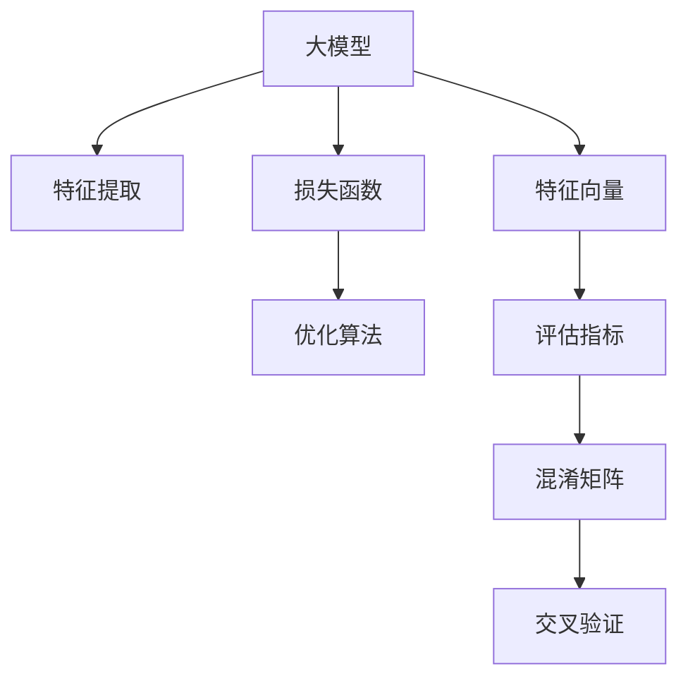

                 

# 大模型驱动的电商平台智能客户分群

大模型驱动的电商平台智能客户分群是大数据时代企业运营的重要工具之一。通过深度学习和大模型技术，企业可以实现对客户群体的精准划分与精细化运营，提升销售转化率、客户留存率和运营效率。本文将详细介绍基于大模型的客户分群算法原理与实践应用，涵盖从数据准备到模型训练的全过程。

## 1. 背景介绍

### 1.1 问题由来
在当今数字化零售时代，电商平台通过分析大量客户行为数据，可以发现潜在客户群体的特征与需求，从而进行个性化营销、精准推荐。传统的客户分群方法依赖于统计分析和经验法则，通常需要人工干预，容易陷入主观偏见，且难以应对数据量庞大、复杂多变的电商业务场景。

随着深度学习技术的迅猛发展，大模型在自然语言处理(NLP)、计算机视觉等领域取得了卓越的成绩。大数据时代，电商平台积累的客户数据日益丰富，大模型得以在这样的数据背景下大显身手。通过对大模型进行针对性的微调训练，可以从海量的客户数据中挖掘出更深层次的客户行为规律和需求模式，实现智能化的客户分群。

### 1.2 问题核心关键点
- 数据采集与预处理：客户数据的丰富性和多样性，是客户分群的基础。需要采集各类客户数据，包括交易记录、浏览记录、社交媒体互动等，并进行数据清洗、归一化、缺失值填补等预处理操作。
- 大模型选择与微调：基于深度学习的大模型，如BERT、GPT、Transformer等，拥有强大的表征学习能力。需选择合适的预训练模型，并在特定任务上微调以匹配电商客户分群的目标。
- 特征提取与建模：从电商平台的业务场景出发，设计合理的特征向量，并应用机器学习模型或深度学习模型进行建模，实现客户分群的精准划分。
- 评估与优化：使用交叉验证、混淆矩阵等方法评估模型的性能，并进行超参数调优，确保模型的泛化能力和稳定表现。
- 部署与应用：将训练好的模型部署至电商平台的推荐系统中，实现实时客户分群，指导个性化营销策略的实施。

### 1.3 问题研究意义
基于大模型的电商平台智能客户分群，对企业运营管理具有重要意义：

1. **提升客户转化率**：通过对客户进行精确分群，提供个性化推荐，能有效提升客户对商品或服务的接受度和转化率。
2. **优化客户体验**：通过分群，可制定差异化的营销策略，如个性化广告、精准推送、客户关怀等，提升客户满意度和忠诚度。
3. **降低运营成本**：智能化的客户分群减少了人工干预的需要，降低运营成本，提高运营效率。
4. **促进数据分析与应用**：大模型的引入使得客户数据更具分析价值，可支持更多复杂的商业决策。
5. **增强市场竞争力**：在激烈的市场竞争中，通过数据驱动的智能运营，提升企业竞争力。

## 2. 核心概念与联系

### 2.1 核心概念概述

为更好地理解基于大模型的客户分群算法，本节将介绍几个关键概念：

- 大模型(Deep Model)：指以深度神经网络为代表的，通过大数据训练获得的高性能模型，如图灵奖获得者Yann LeCun提出的卷积神经网络(CNN)、Google的BERT、OpenAI的GPT等。
- 特征向量(Feature Vector)：通过数据预处理得到的，用于机器学习或深度学习模型的输入。客户分群中常用的特征包括购买历史、浏览历史、评价信息等。
- 交叉验证(Cross-Validation)：一种模型评估方法，将数据集分为训练集和验证集，交替进行模型训练和验证，提高模型泛化能力。
- 混淆矩阵(Confusion Matrix)：一种模型评估工具，展示分类器在不同类别上的表现。
- 损失函数(Loss Function)：模型训练过程中，用于衡量模型预测与真实标签之间差异的函数。常见的有交叉熵损失、均方误差损失等。

这些核心概念之间的逻辑关系可以通过以下Mermaid流程图来展示：



这个流程图展示了大模型、特征提取、损失函数、优化算法、评估指标、混淆矩阵和交叉验证等概念及其相互关系：

1. 大模型通过特征提取从原始数据中提取特征向量，这些特征向量经过损失函数和优化算法的迭代优化，最终生成预测结果。
2. 评估指标和混淆矩阵用于衡量模型性能，交叉验证保证模型的泛化能力。

## 3. 核心算法原理 & 具体操作步骤

### 3.1 算法原理概述

基于大模型的电商平台智能客户分群，本质上是一个有监督的分类学习过程。其核心思想是：将大模型作为高性能的"特征提取器"，通过有监督地训练，学习不同客户群体的特征向量，从而实现对客户的精准分群。

形式化地，假设电商平台客户数据集为 $D=\{(x_i,y_i)\}_{i=1}^N$，其中 $x_i$ 为第 $i$ 个客户的特征向量，$y_i$ 为该客户的真实标签。模型的目标是找到最优参数 $\theta$，使得在训练集上损失函数最小化，同时泛化能力最强。

$$
\theta^* = \mathop{\arg\min}_{\theta} \mathcal{L}(\theta, D)
$$

其中 $\mathcal{L}$ 为模型在训练集 $D$ 上的损失函数，通常使用交叉熵损失函数。通过梯度下降等优化算法，微调过程不断更新模型参数 $\theta$，最终得到适应电商客户分群任务的最优模型参数 $\theta^*$。

### 3.2 算法步骤详解

基于大模型的客户分群算法一般包括以下关键步骤：

**Step 1: 数据准备**
- 收集电商平台各类客户数据，包括交易记录、浏览记录、社交媒体互动等。
- 对数据进行清洗、归一化、缺失值填补等预处理操作。

**Step 2: 特征提取与模型设计**
- 选择合适的特征，如用户的浏览历史、购买记录、评价信息等，构建特征向量。
- 设计深度学习模型，如BERT、GPT等，并进行微调。

**Step 3: 模型训练与优化**
- 将数据集分为训练集、验证集和测试集，使用交叉验证方法进行模型训练。
- 选择合适的优化算法，如Adam、SGD等，设置合适的超参数，如学习率、批大小、迭代轮数等。
- 在每个epoch结束后，使用验证集评估模型性能，并进行模型优化。

**Step 4: 模型评估与部署**
- 使用测试集评估模型性能，计算混淆矩阵、精度、召回率、F1分数等指标。
- 将训练好的模型部署至电商平台的推荐系统中，实现实时客户分群。

### 3.3 算法优缺点

基于大模型的客户分群算法具有以下优点：
1. 强大的表征学习能力。大模型能够从原始数据中提取出高维度的特征表示，适用于复杂多样的客户分群任务。
2. 高效的特征提取。通过大模型，能够自动学习到数据中的深层次关系，减少特征工程的工作量。
3. 可解释性强。大模型的内部工作机制经过训练后更加透明，便于理解客户分群的依据。

但同时，该算法也存在一定的局限性：
1. 对标注数据依赖高。客户分群模型依赖于标注数据，标注成本较高，且标注质量对模型效果影响大。
2. 数据质量要求高。数据预处理过程中，数据质量对模型性能影响显著，需保证数据完整性和一致性。
3. 过拟合风险高。大模型参数量庞大，训练过程中容易过拟合，需要采取正则化等措施。
4. 推理速度慢。大模型推理过程中计算量大，推理速度较慢，影响系统响应速度。

尽管存在这些局限性，但就目前而言，基于大模型的客户分群方法仍是最为高效和准确的解决方案。

### 3.4 算法应用领域

基于大模型的客户分群方法在电商平台中得到广泛应用，具体如下：

- **个性化推荐**：通过客户分群，对不同客户群体提供个性化的商品推荐，提升客户满意度和转化率。
- **精准营销**：识别高价值客户和潜在客户，制定差异化的营销策略，如定向广告、精准推送等。
- **客户细分**：将客户分为不同群体，如高价值客户、忠诚客户、新客户等，针对不同群体实施不同的运营策略。
- **用户流失预测**：通过客户分群，预测客户流失风险，及时采取措施挽回流失客户。
- **库存管理**：基于客户分群，优化库存管理，减少库存积压，提升库存周转率。

## 4. 数学模型和公式 & 详细讲解

### 4.1 数学模型构建

假设电商平台客户数据集为 $D=\{(x_i,y_i)\}_{i=1}^N$，其中 $x_i$ 为第 $i$ 个客户的特征向量，$y_i$ 为该客户的真实标签。模型的目标是通过有监督地训练，找到最优参数 $\theta$，使得在训练集上损失函数最小化，同时泛化能力最强。

定义模型 $M_{\theta}$ 在输入 $x$ 上的输出为 $\hat{y}=M_{\theta}(x)$，则损失函数为：

$$
\mathcal{L}(\theta) = -\frac{1}{N}\sum_{i=1}^N y_i \log M_{\theta}(x_i) + (1-y_i) \log (1-M_{\theta}(x_i))
$$

其中 $M_{\theta}(x_i)$ 为模型在输入 $x_i$ 上的预测值，$y_i$ 为真实标签。模型训练的目标是最小化损失函数 $\mathcal{L}(\theta)$。

### 4.2 公式推导过程

以下我们以二分类任务为例，推导交叉熵损失函数及其梯度的计算公式。

假设模型 $M_{\theta}$ 在输入 $x$ 上的输出为 $\hat{y}=M_{\theta}(x) \in [0,1]$，表示样本属于正类的概率。真实标签 $y \in \{0,1\}$。则二分类交叉熵损失函数定义为：

$$
\ell(M_{\theta}(x),y) = -[y\log \hat{y} + (1-y)\log (1-\hat{y})]
$$

将其代入经验风险公式，得：

$$
\mathcal{L}(\theta) = -\frac{1}{N}\sum_{i=1}^N [y_i\log M_{\theta}(x_i)+(1-y_i)\log(1-M_{\theta}(x_i))]
$$

根据链式法则，损失函数对参数 $\theta_k$ 的梯度为：

$$
\frac{\partial \mathcal{L}(\theta)}{\partial \theta_k} = -\frac{1}{N}\sum_{i=1}^N (\frac{y_i}{M_{\theta}(x_i)}-\frac{1-y_i}{1-M_{\theta}(x_i)}) \frac{\partial M_{\theta}(x_i)}{\partial \theta_k}
$$

其中 $\frac{\partial M_{\theta}(x_i)}{\partial \theta_k}$ 可进一步递归展开，利用自动微分技术完成计算。

在得到损失函数的梯度后，即可带入参数更新公式，完成模型的迭代优化。重复上述过程直至收敛，最终得到适应电商客户分群任务的最优模型参数 $\theta^*$。

## 5. 项目实践：代码实例和详细解释说明

### 5.1 开发环境搭建

在进行客户分群实践前，我们需要准备好开发环境。以下是使用Python进行PyTorch开发的环境配置流程：

1. 安装Anaconda：从官网下载并安装Anaconda，用于创建独立的Python环境。

2. 创建并激活虚拟环境：
```bash
conda create -n pytorch-env python=3.8 
conda activate pytorch-env
```

3. 安装PyTorch：根据CUDA版本，从官网获取对应的安装命令。例如：
```bash
conda install pytorch torchvision torchaudio cudatoolkit=11.1 -c pytorch -c conda-forge
```

4. 安装Transformers库：
```bash
pip install transformers
```

5. 安装各类工具包：
```bash
pip install numpy pandas scikit-learn matplotlib tqdm jupyter notebook ipython
```

完成上述步骤后，即可在`pytorch-env`环境中开始客户分群实践。

### 5.2 源代码详细实现

下面我们以电商平台客户分群任务为例，给出使用Transformers库对BERT模型进行客户分群的PyTorch代码实现。

首先，定义客户分群任务的数据处理函数：

```python
from transformers import BertTokenizer
from torch.utils.data import Dataset
import torch

class CustomerDataset(Dataset):
    def __init__(self, texts, labels, tokenizer, max_len=128):
        self.texts = texts
        self.labels = labels
        self.tokenizer = tokenizer
        self.max_len = max_len
        
    def __len__(self):
        return len(self.texts)
    
    def __getitem__(self, item):
        text = self.texts[item]
        label = self.labels[item]
        
        encoding = self.tokenizer(text, return_tensors='pt', max_length=self.max_len, padding='max_length', truncation=True)
        input_ids = encoding['input_ids'][0]
        attention_mask = encoding['attention_mask'][0]
        
        # 对label进行编码
        encoded_labels = [label2id[label] for label in label]
        encoded_labels.extend([label2id['O']] * (self.max_len - len(encoded_labels)))
        labels = torch.tensor(encoded_labels, dtype=torch.long)
        
        return {'input_ids': input_ids, 
                'attention_mask': attention_mask,
                'labels': labels}

# 标签与id的映射
label2id = {'O': 0, 'buy': 1, 'search': 2, 'follow': 3, 'evaluate': 4}
id2label = {v: k for k, v in label2id.items()}

# 创建dataset
tokenizer = BertTokenizer.from_pretrained('bert-base-cased')

train_dataset = CustomerDataset(train_texts, train_labels, tokenizer)
dev_dataset = CustomerDataset(dev_texts, dev_labels, tokenizer)
test_dataset = CustomerDataset(test_texts, test_labels, tokenizer)
```

然后，定义模型和优化器：

```python
from transformers import BertForTokenClassification, AdamW

model = BertForTokenClassification.from_pretrained('bert-base-cased', num_labels=len(label2id))

optimizer = AdamW(model.parameters(), lr=2e-5)
```

接着，定义训练和评估函数：

```python
from torch.utils.data import DataLoader
from tqdm import tqdm
from sklearn.metrics import classification_report

device = torch.device('cuda') if torch.cuda.is_available() else torch.device('cpu')
model.to(device)

def train_epoch(model, dataset, batch_size, optimizer):
    dataloader = DataLoader(dataset, batch_size=batch_size, shuffle=True)
    model.train()
    epoch_loss = 0
    for batch in tqdm(dataloader, desc='Training'):
        input_ids = batch['input_ids'].to(device)
        attention_mask = batch['attention_mask'].to(device)
        labels = batch['labels'].to(device)
        model.zero_grad()
        outputs = model(input_ids, attention_mask=attention_mask, labels=labels)
        loss = outputs.loss
        epoch_loss += loss.item()
        loss.backward()
        optimizer.step()
    return epoch_loss / len(dataloader)

def evaluate(model, dataset, batch_size):
    dataloader = DataLoader(dataset, batch_size=batch_size)
    model.eval()
    preds, labels = [], []
    with torch.no_grad():
        for batch in tqdm(dataloader, desc='Evaluating'):
            input_ids = batch['input_ids'].to(device)
            attention_mask = batch['attention_mask'].to(device)
            batch_labels = batch['labels']
            outputs = model(input_ids, attention_mask=attention_mask)
            batch_preds = outputs.logits.argmax(dim=2).to('cpu').tolist()
            batch_labels = batch_labels.to('cpu').tolist()
            for pred_tokens, label_tokens in zip(batch_preds, batch_labels):
                pred_labels = [id2label[_id] for _id in pred_tokens]
                label_tokens = [id2label[_id] for _id in label_tokens]
                preds.append(pred_labels[:len(label_tokens)])
                labels.append(label_tokens)
                
    print(classification_report(labels, preds))
```

最后，启动训练流程并在测试集上评估：

```python
epochs = 5
batch_size = 16

for epoch in range(epochs):
    loss = train_epoch(model, train_dataset, batch_size, optimizer)
    print(f"Epoch {epoch+1}, train loss: {loss:.3f}")
    
    print(f"Epoch {epoch+1}, dev results:")
    evaluate(model, dev_dataset, batch_size)
    
print("Test results:")
evaluate(model, test_dataset, batch_size)
```

以上就是使用PyTorch对BERT进行客户分群任务的完整代码实现。可以看到，得益于Transformers库的强大封装，我们可以用相对简洁的代码完成BERT模型的加载和训练。

### 5.3 代码解读与分析

让我们再详细解读一下关键代码的实现细节：

**CustomerDataset类**：
- `__init__`方法：初始化文本、标签、分词器等关键组件。
- `__len__`方法：返回数据集的样本数量。
- `__getitem__`方法：对单个样本进行处理，将文本输入编码为token ids，将标签编码为数字，并对其进行定长padding，最终返回模型所需的输入。

**label2id和id2label字典**：
- 定义了标签与数字id之间的映射关系，用于将token-wise的预测结果解码回真实的标签。

**训练和评估函数**：
- 使用PyTorch的DataLoader对数据集进行批次化加载，供模型训练和推理使用。
- 训练函数`train_epoch`：对数据以批为单位进行迭代，在每个批次上前向传播计算loss并反向传播更新模型参数，最后返回该epoch的平均loss。
- 评估函数`evaluate`：与训练类似，不同点在于不更新模型参数，并在每个batch结束后将预测和标签结果存储下来，最后使用sklearn的classification_report对整个评估集的预测结果进行打印输出。

**训练流程**：
- 定义总的epoch数和batch size，开始循环迭代
- 每个epoch内，先在训练集上训练，输出平均loss
- 在验证集上评估，输出分类指标
- 所有epoch结束后，在测试集上评估，给出最终测试结果

可以看到，PyTorch配合Transformers库使得BERT客户分群的代码实现变得简洁高效。开发者可以将更多精力放在数据处理、模型改进等高层逻辑上，而不必过多关注底层的实现细节。

当然，工业级的系统实现还需考虑更多因素，如模型的保存和部署、超参数的自动搜索、更灵活的任务适配层等。但核心的客户分群范式基本与此类似。

## 6. 实际应用场景

### 6.1 智能客服系统

基于大模型驱动的智能客户分群技术，可以应用于智能客服系统的构建。传统客服往往需要配备大量人力，高峰期响应缓慢，且一致性和专业性难以保证。而使用客户分群技术，可以根据客户的历史行为数据和实时交互记录，进行动态分群，为不同客户群体分配不同等级的客服资源，提供个性化、高质量的客户服务。

在技术实现上，可以收集客服系统的历史客户交互记录，将客户互动历史作为特征，利用大模型进行客户分群。分群后的客户群体可以输入到推荐系统中，实时推荐客户最关心的服务人员，实现智能排班和资源调度。如此构建的智能客服系统，能大幅提升客户咨询体验和问题解决效率。

### 6.2 个性化推荐系统

在个性化推荐系统中，客户分群技术可以识别不同类型的客户群体，如高价值客户、潜在客户、流失客户等，为每个客户群体制定差异化的推荐策略。例如，对于高价值客户，可以推荐更多高利润的商品；对于流失客户，可以主动发送召回活动。通过客户分群，可以实现个性化推荐，提升用户满意度，增加销售额。

具体而言，可以收集客户在平台上的浏览、购买、评价等行为数据，构建特征向量，利用大模型进行客户分群。将客户分群结果作为输入，结合业务规则和实时数据，进行个性化的商品推荐。在推荐模型中，客户分群的结果可以作为特征的一部分，提升推荐精度。

### 6.3 精准营销系统

精准营销是电商企业的重要业务环节。基于大模型的客户分群技术，可以识别不同客户群体，制定不同的营销策略。例如，针对潜在客户，可以推送定向广告；针对高价值客户，可以提供优惠券、个性化活动等。

在实践中，可以收集客户的浏览、购买、评价等数据，提取用户行为特征，利用大模型进行客户分群。分群后的客户群体可以输入到广告推荐系统中，实现精准的营销推广，提升广告投放效果，降低广告成本。

## 7. 工具和资源推荐

### 7.1 学习资源推荐

为了帮助开发者系统掌握客户分群技术的理论基础和实践技巧，这里推荐一些优质的学习资源：

1. 《深度学习》课程：斯坦福大学李飞飞教授主讲的深度学习入门课程，涵盖了深度学习的基本概念和常用算法。
2. 《PyTorch官方文档》：PyTorch官方文档，提供了详细的API文档和示例代码，是学习PyTorch的好资源。
3. 《自然语言处理》书籍：深度学习在自然语言处理领域的应用，介绍了BERT、GPT等大模型的构建和应用。
4. 《客户分群技术》博客：技术博客介绍了客户分群技术的原理和实现方法，适合初学者学习。
5. Kaggle竞赛：Kaggle上关于客户分群和推荐系统的竞赛，提供了丰富的实战案例和数据集。

通过对这些资源的学习实践，相信你一定能够快速掌握客户分群技术的精髓，并用于解决实际的电商问题。

### 7.2 开发工具推荐

高效的开发离不开优秀的工具支持。以下是几款用于客户分群开发的常用工具：

1. PyTorch：基于Python的开源深度学习框架，灵活动态的计算图，适合快速迭代研究。大部分预训练语言模型都有PyTorch版本的实现。
2. TensorFlow：由Google主导开发的开源深度学习框架，生产部署方便，适合大规模工程应用。同样有丰富的预训练语言模型资源。
3. Transformers库：HuggingFace开发的NLP工具库，集成了众多SOTA语言模型，支持PyTorch和TensorFlow，是进行客户分群开发的利器。
4. Weights & Biases：模型训练的实验跟踪工具，可以记录和可视化模型训练过程中的各项指标，方便对比和调优。与主流深度学习框架无缝集成。
5. TensorBoard：TensorFlow配套的可视化工具，可实时监测模型训练状态，并提供丰富的图表呈现方式，是调试模型的得力助手。
6. Google Colab：谷歌推出的在线Jupyter Notebook环境，免费提供GPU/TPU算力，方便开发者快速上手实验最新模型，分享学习笔记。

合理利用这些工具，可以显著提升客户分群任务的开发效率，加快创新迭代的步伐。

### 7.3 相关论文推荐

客户分群技术的研究源于学界的持续研究。以下是几篇奠基性的相关论文，推荐阅读：

1. Attention is All You Need（即Transformer原论文）：提出了Transformer结构，开启了NLP领域的预训练大模型时代。
2. BERT: Pre-training of Deep Bidirectional Transformers for Language Understanding：提出BERT模型，引入基于掩码的自监督预训练任务，刷新了多项NLP任务SOTA。
3. Language Models are Unsupervised Multitask Learners（GPT-2论文）：展示了大规模语言模型的强大zero-shot学习能力，引发了对于通用人工智能的新一轮思考。
4. Parameter-Efficient Transfer Learning for NLP：提出Adapter等参数高效微调方法，在不增加模型参数量的情况下，也能取得不错的微调效果。
5. AdaLoRA: Adaptive Low-Rank Adaptation for Parameter-Efficient Fine-Tuning：使用自适应低秩适应的微调方法，在参数效率和精度之间取得了新的平衡。
6. Contextual Risk Prediction of Customer Churn：研究客户流失预测任务，提出基于上下文嵌入的风险预测方法，取得了显著的性能提升。

这些论文代表了大模型驱动的客户分群技术的发展脉络。通过学习这些前沿成果，可以帮助研究者把握学科前进方向，激发更多的创新灵感。

## 8. 总结：未来发展趋势与挑战

### 8.1 总结

本文对基于大模型的电商平台智能客户分群算法进行了全面系统的介绍。首先阐述了客户分群的背景和意义，明确了微调在拓展预训练模型应用、提升下游任务性能方面的独特价值。其次，从原理到实践，详细讲解了客户分群的数学原理和关键步骤，给出了客户分群任务开发的完整代码实例。同时，本文还广泛探讨了客户分群方法在智能客服、个性化推荐等多个行业领域的应用前景，展示了客户分群技术的巨大潜力。

通过本文的系统梳理，可以看到，基于大模型的客户分群方法在大数据时代成为企业运营的重要工具，对电商平台的运营管理具有重要意义。未来，伴随大模型和客户分群技术的进一步发展，基于大数据驱动的智能运营将为电商平台带来新的突破，推动商业模式的创新和优化。

### 8.2 未来发展趋势

展望未来，大模型驱动的客户分群技术将呈现以下几个发展趋势：

1. **数据驱动与智能运营**：客户分群方法将更加依赖大数据技术，通过分析多维度数据进行智能运营决策，提升客户满意度和业务效果。
2. **跨模态融合**：客户分群技术将结合文本、图像、语音等多种模态信息，实现全维度客户画像的构建。
3. **深度学习与因果学习**：未来的客户分群模型将更多地结合深度学习和因果学习技术，增强模型的解释能力和鲁棒性。
4. **联邦学习**：客户数据往往涉及隐私问题，未来的客户分群模型将结合联邦学习技术，在保护客户隐私的前提下，实现跨平台、跨机构的数据共享和协同建模。
5. **增强智能客服**：基于客户分群技术的智能客服将更加智能、自然，能够实现多轮交互、情感分析等功能，提升客户体验。

以上趋势凸显了大模型驱动的客户分群技术的广阔前景。这些方向的探索发展，必将进一步提升客户分群的精度和效率，促进智能运营的全面落地。

### 8.3 面临的挑战

尽管大模型驱动的客户分群技术已经取得了瞩目成就，但在迈向更加智能化、普适化应用的过程中，它仍面临着诸多挑战：

1. **数据隐私与合规**：客户数据的收集、存储和处理需要遵守严格的隐私保护法规，如GDPR等。如何平衡数据利用与隐私保护，是客户分群技术需要解决的重要问题。
2. **模型可解释性**：大模型往往被认为是"黑盒"系统，难以解释其内部工作机制。如何提高模型的可解释性，以便于用户理解和信任，是客户分群技术的难点之一。
3. **过拟合与泛化**：客户分群模型的参数量庞大，容易过拟合训练数据，泛化能力不足。如何在保证模型表现的同时，防止过拟合，是客户分群技术需要解决的另一大挑战。
4. **动态变化**：客户行为和需求会随着市场变化而动态调整，如何实时更新模型，以应对新情况，是客户分群技术的又一难点。
5. **计算资源**：大模型的训练和推理需要大量的计算资源，如何降低计算成本，提高模型性能，是客户分群技术面临的现实问题。

尽管存在这些挑战，但只要技术不断进步，这些难题终将被克服，大模型驱动的客户分群技术必将为电商平台的智能运营带来新的突破。

### 8.4 研究展望

面对客户分群技术面临的挑战，未来的研究需要在以下几个方面寻求新的突破：

1. **联邦学习**：通过分布式训练，实现多机构、多平台的数据共享与协同建模，保护客户隐私的同时提高模型性能。
2. **增强学习**：结合强化学习，构建客户互动模型，实时调整客户策略，提高客户分群的效果。
3. **自监督学习**：利用无标签数据进行模型预训练，提升模型的泛化能力和数据利用效率。
4. **因果推理**：结合因果推理技术，分析客户行为背后的因果关系，提高客户分群的精确度。
5. **多模态融合**：结合文本、图像、语音等多种模态信息，构建更加全面、准确的客户画像。
6. **算法优化**：优化模型结构，提升模型的推理速度和计算效率，降低计算成本。
7. **模型可解释性**：研究可解释性技术，如模型蒸馏、可视化等，提高模型的透明度，增强用户信任。

这些研究方向的探索，必将引领客户分群技术的进一步发展，为电商平台的智能运营带来新的突破。面向未来，客户分群技术需要在技术、业务、伦理等多个层面协同创新，才能真正实现智能客户分群的目标，推动电商平台的数字化转型和智能化运营。

## 9. 附录：常见问题与解答

**Q1：客户分群是否适用于所有电商业务场景？**

A: 客户分群方法在大多数电商业务场景中都能取得不错的效果，特别是对于数据量较大的场景。但对于一些特定场景，如B2B电商、小微企业等，客户行为数据较为稀疏，效果可能不及预期。此时需要在特定领域语料上进一步预训练，再进行微调，才能获得理想效果。

**Q2：如何选择合适的客户分群特征？**

A: 客户分群特征的选择需要结合业务场景和客户行为数据进行综合考虑。通常选择如下特征：
- 浏览历史：客户在平台上的浏览记录。
- 购买历史：客户的购买记录。
- 评价信息：客户的评价内容。
- 社交媒体互动：客户在社交媒体上的行为数据。
- 客户属性：客户的性别、年龄、地域等信息。
- 活动参与度：客户参与平台的各类活动情况。

**Q3：客户分群模型如何进行超参数调优？**

A: 客户分群模型的超参数调优通常涉及学习率、批大小、迭代轮数、正则化系数等。常用的超参数调优方法包括网格搜索、随机搜索、贝叶斯优化等。

**Q4：客户分群模型在部署过程中需要注意哪些问题？**

A: 将客户分群模型部署至电商平台的推荐系统中，还需要考虑以下因素：
- 模型裁剪：去除不必要的层和参数，减小模型尺寸，加快推理速度。
- 量化加速：将浮点模型转为定点模型，压缩存储空间，提高计算效率。
- 服务化封装：将模型封装为标准化服务接口，便于集成调用。
- 弹性伸缩：根据请求流量动态调整资源配置，平衡服务质量和成本。
- 监控告警：实时采集系统指标，设置异常告警阈值，确保服务稳定性。

通过合理配置超参数和优化模型部署，可以实现高效、稳定的客户分群系统，为电商平台的智能运营提供有力支持。

**Q5：客户分群模型如何处理动态变化的数据？**

A: 客户分群模型需要定期更新，以应对市场和客户行为的动态变化。通常需要设置一定的模型更新频率，如每季度或每月进行一次模型微调。模型更新过程中，需要重新采集客户数据，进行特征提取和模型训练。

通过定期更新模型，可以确保客户分群模型的实时性和准确性，帮助电商平台及时调整营销策略，提升客户满意度和转化率。

