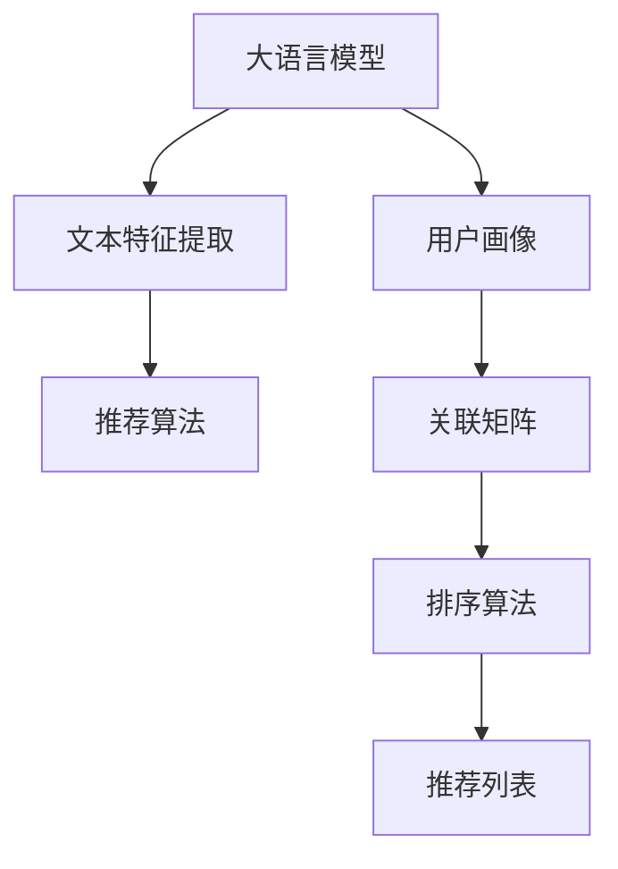

                 

# 大规模语言模型在产品推荐中的应用

> 关键词：大规模语言模型,产品推荐,自然语言处理(NLP),个性化推荐,文本相似度,用户画像,上下文感知,深度学习

## 1. 背景介绍

### 1.1 问题由来
随着电子商务平台的崛起，个性化产品推荐已成为用户体验的重要组成部分。传统的推荐系统多基于用户的浏览、购买历史，推荐算法主要关注物品的共现关系，忽略了用户偏好的多样性和动态变化。而基于大规模语言模型(Large Language Model, LLM)的产品推荐系统，通过引入文本数据，可以更好地理解用户需求和行为，提供更精准的个性化推荐。

大语言模型凭借其强大的自然语言理解能力，可以从用户的自然语言文本中提取丰富的特征，并与其他数据源进行融合，提升推荐系统的性能。

### 1.2 问题核心关键点
基于大语言模型的产品推荐系统，主要通过以下核心步骤实现：
- 利用大语言模型分析用户输入的文本描述，提取文本特征。
- 将文本特征与用户画像、历史行为数据融合，构建用户-物品关联矩阵。
- 基于关联矩阵，使用推荐算法计算并排序，生成个性化推荐列表。

大语言模型在产品推荐中的核心优势在于其强大的语义理解能力和上下文感知能力，能够从自然语言文本中挖掘用户潜在需求和行为模式。

## 2. 核心概念与联系

### 2.1 核心概念概述

为了更好地理解基于大语言模型的产品推荐系统，本节将介绍几个关键概念：

- 自然语言处理(Natural Language Processing, NLP)：利用计算机科学、人工智能和语言学的交叉技术，实现对人类语言的处理和理解。
- 推荐系统(Recommender System)：通过分析用户行为数据，为用户推荐其感兴趣的商品或内容。
- 文本相似度(Text Similarity)：衡量文本间语义相似程度的度量方法，广泛应用于信息检索、文本聚类等任务。
- 用户画像(User Profile)：根据用户行为数据，构建用户特征向量，反映用户兴趣偏好。
- 上下文感知(Context-Aware)：模型能够感知并利用上下文信息，提高推理和决策的准确性。
- 深度学习(Deep Learning)：利用多层神经网络模型，自动学习输入数据特征，实现复杂任务。

这些核心概念之间的逻辑关系可以通过以下Mermaid流程图来展示：



这个流程图展示了大语言模型在产品推荐中的核心概念及其之间的关系：

1. 大语言模型通过文本分析获得用户输入的特征表示。
2. 用户画像与文本特征进行融合，构建用户-物品关联矩阵。
3. 关联矩阵通过推荐算法计算排序，生成个性化推荐列表。

这些概念共同构成了基于大语言模型的产品推荐系统的设计框架，使得模型能够更好地理解用户需求，提供个性化推荐。

## 3. 核心算法原理 & 具体操作步骤
### 3.1 算法原理概述

基于大语言模型的产品推荐系统，主要利用大语言模型的文本特征提取和上下文感知能力，在融合用户画像和历史行为数据后，生成个性化推荐。其核心算法原理如下：

- 用户输入产品描述或评论，作为文本输入，大语言模型输出特征表示。
- 用户画像通过用户行为数据生成，主要包括用户的浏览、购买、评分等历史数据。
- 融合文本特征与用户画像，得到用户-物品关联矩阵。
- 使用推荐算法（如协同过滤、深度学习推荐等），根据关联矩阵计算物品的推荐分数。
- 根据推荐分数对物品进行排序，生成个性化推荐列表。

### 3.2 算法步骤详解

下面详细介绍基于大语言模型的产品推荐系统核心算法的详细步骤：

**Step 1: 构建用户画像**

用户画像反映了用户的历史行为数据，是推荐系统的重要组成部分。具体步骤如下：

1. 收集用户行为数据：包括用户的浏览、购买、评分等历史数据，可能还包含用户输入的文本信息（如评论、搜索记录）。
2. 数据预处理：对数据进行清洗和归一化，去除噪声和不完整数据。
3. 特征提取：从用户行为数据中提取关键特征，如购买频次、评分评价、浏览时长等。
4. 特征编码：将提取的特征向量进行编码，生成用户画像向量。

**Step 2: 利用大语言模型提取文本特征**

文本特征提取是大语言模型的核心任务之一。具体步骤如下：

1. 输入用户输入的文本（产品描述、评论等）。
2. 分词和预处理：使用分词工具将文本切分为单词或短语，并进行去停用词、词形还原等预处理。
3. 编码：将预处理后的文本转化为模型可处理的向量形式，通常使用BERT、GPT等大语言模型进行编码。
4. 特征提取：模型输出文本特征表示，包括词向量、上下文向量等。

**Step 3: 融合用户画像和文本特征**

用户画像和文本特征的融合是大语言模型在产品推荐中的关键步骤。具体步骤如下：

1. 数据对齐：将用户画像数据和文本特征向量对齐，确保数据的统一性和一致性。
2. 特征合并：将用户画像特征和文本特征进行合并，得到融合后的特征向量。
3. 上下文感知：结合用户的实时行为数据，更新和优化融合后的特征向量。

**Step 4: 构建用户-物品关联矩阵**

关联矩阵是推荐系统的核心数据结构，用于存储用户和物品之间的关联度。具体步骤如下：

1. 用户-物品映射：将用户画像和文本特征向量映射到物品库中，得到用户-物品关联矩阵。
2. 特征评分：根据融合后的特征向量，计算每个物品的评分，反映用户对物品的偏好。
3. 评分矩阵：将评分结果作为关联矩阵的值，表示用户和物品之间的关联度。

**Step 5: 生成个性化推荐列表**

最后，基于关联矩阵使用推荐算法生成个性化推荐列表。具体步骤如下：

1. 推荐算法：使用协同过滤、矩阵分解、深度学习推荐等算法，根据关联矩阵计算每个物品的推荐分数。
2. 排序：根据推荐分数对物品进行排序，生成个性化推荐列表。
3. 展示：将推荐列表展示给用户，供其选择。

### 3.3 算法优缺点

基于大语言模型的产品推荐系统具有以下优点：

- 语义理解能力强：大语言模型能够理解自然语言文本，提取丰富的特征，反映用户潜在需求和行为。
- 上下文感知好：模型能够感知并利用上下文信息，提高推荐精度。
- 可扩展性好：能够与其他数据源（如商品描述、用户评价）进行融合，提升推荐效果。
- 动态性高：能够实时更新用户画像和行为数据，适应用户需求变化。

同时，该算法也存在以下局限性：

- 数据质量要求高：需要高质量的用户行为数据和自然语言文本，标注成本较高。
- 计算资源消耗大：大语言模型和关联矩阵计算量较大，需要较高的计算资源。
- 解释性差：推荐结果缺乏可解释性，难以解释模型内部决策逻辑。
- 模型泛化能力有限：不同领域的推荐任务，需要重新训练模型，通用性有限。

尽管存在这些局限性，但就目前而言，基于大语言模型的推荐方法在电商、娱乐等众多领域已取得了显著的成效，成为产品推荐的重要手段。

### 3.4 算法应用领域

基于大语言模型的产品推荐系统已经在电商、内容推荐、广告投放等多个领域得到了广泛的应用，成为推荐技术的重要发展方向。具体应用如下：

- 电商推荐：利用用户评论、搜索记录等文本数据，提升商品推荐效果。
- 内容推荐：分析用户阅读、点赞、评论等行为，推荐相关内容。
- 广告投放：基于用户画像和行为数据，优化广告定向投放。
- 智能客服：结合用户输入的自然语言文本，生成个性化对话内容。

除了上述这些经典应用外，基于大语言模型的推荐系统还在智能家居、智慧城市、医疗健康等新兴领域展现出巨大潜力，为各行各业带来了新的发展契机。

## 4. 数学模型和公式 & 详细讲解 & 举例说明

### 4.1 数学模型构建

假设用户输入的产品描述为 $X$，用户画像特征向量为 $U$，大语言模型提取的文本特征向量为 $V$。则用户-物品关联矩阵 $R$ 可以表示为：

$$
R = V^T \cdot W \cdot U
$$

其中 $W$ 为融合权重矩阵，用于调整用户画像和文本特征的相对重要性。

推荐系统的目标是最小化用户和物品的误差，即：

$$
\min_{W} \sum_{i,j} (U_i \cdot V_j \cdot R_{ij} - \hat{R}_{ij})^2
$$

其中 $\hat{R}_{ij}$ 为真实评分。

### 4.2 公式推导过程

假设 $R_{ij}$ 为用户 $i$ 对物品 $j$ 的真实评分，$\hat{R}_{ij}$ 为模型预测评分，则推荐目标可以表示为：

$$
\min_{W} \sum_{i,j} (U_i \cdot V_j \cdot R_{ij} - \hat{R}_{ij})^2
$$

上述目标函数可以看作是一个最小二乘问题，即最小化预测评分与真实评分的误差。

为了简化问题，可以对 $R_{ij}$ 和 $\hat{R}_{ij}$ 进行归一化处理，得到标准化评分 $\tilde{R}_{ij}$ 和预测评分 $\tilde{\hat{R}}_{ij}$：

$$
\tilde{R}_{ij} = \frac{R_{ij}}{\sum_k R_{ik}}
$$
$$
\tilde{\hat{R}}_{ij} = \frac{\hat{R}_{ij}}{\sum_k \hat{R}_{ik}}
$$

则推荐目标可以重写为：

$$
\min_{W} \sum_{i,j} (U_i \cdot V_j \cdot \tilde{R}_{ij} - \tilde{\hat{R}}_{ij})^2
$$

将上式展开，得到：

$$
\min_{W} \sum_{i,j} (U_i \cdot V_j \cdot R_{ij} - \hat{R}_{ij})^2 = \min_{W} \sum_{i,j} (U_i \cdot V_j \cdot \tilde{R}_{ij} - \tilde{\hat{R}}_{ij})^2 + \sum_{i,j} (\tilde{R}_{ij} - \tilde{\hat{R}}_{ij})^2
$$

其中后一项为归一化误差，可以看作是归一化的目标函数。

上述推导展示了推荐目标的数学框架，但实际计算中还需要考虑正则化、优化算法等细节。

### 4.3 案例分析与讲解

假设某电商平台的推荐系统，需要基于用户评论生成商品推荐。具体步骤如下：

**Step 1: 构建用户画像**

1. 收集用户历史数据：包括浏览记录、购买记录、评分记录等。
2. 数据预处理：去除无效数据，进行归一化处理。
3. 特征提取：提取用户浏览时长、购买频次、评分评价等特征。
4. 特征编码：将特征向量进行编码，生成用户画像向量 $U$。

**Step 2: 利用大语言模型提取文本特征**

1. 输入用户评论：收集用户对商品的评论。
2. 分词和预处理：使用分词工具将评论切分为单词或短语，并进行去停用词、词形还原等预处理。
3. 编码：使用BERT模型对评论进行编码，得到文本特征向量 $V$。

**Step 3: 融合用户画像和文本特征**

1. 数据对齐：将用户画像向量 $U$ 和文本特征向量 $V$ 对齐，确保数据的统一性。
2. 特征合并：将用户画像特征和文本特征向量进行合并，得到融合后的特征向量 $F$。
3. 上下文感知：结合用户的实时行为数据，更新和优化融合后的特征向量 $F$。

**Step 4: 构建用户-物品关联矩阵**

1. 用户-物品映射：将用户画像和文本特征向量映射到物品库中，得到用户-物品关联矩阵 $R$。
2. 特征评分：根据融合后的特征向量 $F$，计算每个物品的评分，反映用户对物品的偏好。
3. 评分矩阵：将评分结果作为关联矩阵的值，表示用户和物品之间的关联度。

**Step 5: 生成个性化推荐列表**

1. 推荐算法：使用协同过滤、矩阵分解、深度学习推荐等算法，根据关联矩阵计算每个物品的推荐分数。
2. 排序：根据推荐分数对物品进行排序，生成个性化推荐列表。
3. 展示：将推荐列表展示给用户，供其选择。

通过上述步骤，利用大语言模型和推荐算法，电商平台可以生成更加个性化、精准的商品推荐，提升用户体验和购买转化率。

## 5. 项目实践：代码实例和详细解释说明
### 5.1 开发环境搭建

在进行产品推荐系统开发前，我们需要准备好开发环境。以下是使用Python进行PyTorch开发的环境配置流程：

1. 安装Anaconda：从官网下载并安装Anaconda，用于创建独立的Python环境。

2. 创建并激活虚拟环境：
```bash
conda create -n pytorch-env python=3.8 
conda activate pytorch-env
```

3. 安装PyTorch：根据CUDA版本，从官网获取对应的安装命令。例如：
```bash
conda install pytorch torchvision torchaudio cudatoolkit=11.1 -c pytorch -c conda-forge
```

4. 安装Transformers库：
```bash
pip install transformers
```

5. 安装各类工具包：
```bash
pip install numpy pandas scikit-learn matplotlib tqdm jupyter notebook ipython
```

完成上述步骤后，即可在`pytorch-env`环境中开始产品推荐系统开发。

### 5.2 源代码详细实现

下面我们以电商推荐系统为例，给出使用Transformers库对BERT模型进行产品推荐训练的PyTorch代码实现。

首先，定义数据处理函数：

```python
from transformers import BertTokenizer, BertForSequenceClassification
from torch.utils.data import Dataset, DataLoader
import torch

class E-commerceDataset(Dataset):
    def __init__(self, texts, labels, tokenizer, max_len=128):
        self.texts = texts
        self.labels = labels
        self.tokenizer = tokenizer
        self.max_len = max_len
        
    def __len__(self):
        return len(self.texts)
    
    def __getitem__(self, item):
        text = self.texts[item]
        label = self.labels[item]
        
        encoding = self.tokenizer(text, return_tensors='pt', max_length=self.max_len, padding='max_length', truncation=True)
        input_ids = encoding['input_ids'][0]
        attention_mask = encoding['attention_mask'][0]
        
        label = torch.tensor([label], dtype=torch.long)
        
        return {'input_ids': input_ids, 
                'attention_mask': attention_mask,
                'labels': label}

tokenizer = BertTokenizer.from_pretrained('bert-base-cased')

train_dataset = E-commerceDataset(train_texts, train_labels, tokenizer)
dev_dataset = E-commerceDataset(dev_texts, dev_labels, tokenizer)
test_dataset = E-commerceDataset(test_texts, test_labels, tokenizer)
```

然后，定义模型和优化器：

```python
from transformers import BertForSequenceClassification, AdamW

model = BertForSequenceClassification.from_pretrained('bert-base-cased', num_labels=2)

optimizer = AdamW(model.parameters(), lr=2e-5)
```

接着，定义训练和评估函数：

```python
from tqdm import tqdm
from sklearn.metrics import accuracy_score

device = torch.device('cuda') if torch.cuda.is_available() else torch.device('cpu')
model.to(device)

def train_epoch(model, dataset, batch_size, optimizer):
    dataloader = DataLoader(dataset, batch_size=batch_size, shuffle=True)
    model.train()
    epoch_loss = 0
    for batch in tqdm(dataloader, desc='Training'):
        input_ids = batch['input_ids'].to(device)
        attention_mask = batch['attention_mask'].to(device)
        labels = batch['labels'].to(device)
        model.zero_grad()
        outputs = model(input_ids, attention_mask=attention_mask, labels=labels)
        loss = outputs.loss
        epoch_loss += loss.item()
        loss.backward()
        optimizer.step()
    return epoch_loss / len(dataloader)

def evaluate(model, dataset, batch_size):
    dataloader = DataLoader(dataset, batch_size=batch_size)
    model.eval()
    preds, labels = [], []
    with torch.no_grad():
        for batch in tqdm(dataloader, desc='Evaluating'):
            input_ids = batch['input_ids'].to(device)
            attention_mask = batch['attention_mask'].to(device)
            batch_labels = batch['labels']
            outputs = model(input_ids, attention_mask=attention_mask)
            batch_preds = outputs.logits.argmax(dim=2).to('cpu').tolist()
            batch_labels = batch_labels.to('cpu').tolist()
            for pred, label in zip(batch_preds, batch_labels):
                preds.append(pred)
                labels.append(label)
                
    print('Accuracy:', accuracy_score(labels, preds))
```

最后，启动训练流程并在测试集上评估：

```python
epochs = 5
batch_size = 16

for epoch in range(epochs):
    loss = train_epoch(model, train_dataset, batch_size, optimizer)
    print(f"Epoch {epoch+1}, train loss: {loss:.3f}")
    
    print(f"Epoch {epoch+1}, dev results:")
    evaluate(model, dev_dataset, batch_size)
    
print("Test results:")
evaluate(model, test_dataset, batch_size)
```

以上就是使用PyTorch对BERT进行电商推荐系统微调的完整代码实现。可以看到，得益于Transformers库的强大封装，我们可以用相对简洁的代码完成BERT模型的加载和微调。

### 5.3 代码解读与分析

让我们再详细解读一下关键代码的实现细节：

**E-commerceDataset类**：
- `__init__`方法：初始化文本、标签、分词器等关键组件。
- `__len__`方法：返回数据集的样本数量。
- `__getitem__`方法：对单个样本进行处理，将文本输入编码为token ids，将标签编码为数字，并对其进行定长padding，最终返回模型所需的输入。

**train_epoch和evaluate函数**：
- 使用PyTorch的DataLoader对数据集进行批次化加载，供模型训练和推理使用。
- 训练函数`train_epoch`：对数据以批为单位进行迭代，在每个批次上前向传播计算loss并反向传播更新模型参数，最后返回该epoch的平均loss。
- 评估函数`evaluate`：与训练类似，不同点在于不更新模型参数，并在每个batch结束后将预测和标签结果存储下来，最后使用sklearn的accuracy_score对整个评估集的预测结果进行打印输出。

**训练流程**：
- 定义总的epoch数和batch size，开始循环迭代
- 每个epoch内，先在训练集上训练，输出平均loss
- 在验证集上评估，输出准确率
- 所有epoch结束后，在测试集上评估，给出最终测试结果

可以看到，PyTorch配合Transformers库使得BERT微调的代码实现变得简洁高效。开发者可以将更多精力放在数据处理、模型改进等高层逻辑上，而不必过多关注底层的实现细节。

当然，工业级的系统实现还需考虑更多因素，如模型的保存和部署、超参数的自动搜索、更灵活的任务适配层等。但核心的微调范式基本与此类似。

## 6. 实际应用场景
### 6.1 智能推荐引擎

基于大语言模型的产品推荐系统，广泛应用于智能推荐引擎中。智能推荐引擎通过分析用户行为数据，为用户提供个性化推荐。

在技术实现上，可以收集用户的历史浏览、购买、评分等行为数据，利用大语言模型提取文本特征，并与其他行为数据进行融合，生成用户画像。在此基础上进行推荐计算，生成个性化推荐列表。智能推荐引擎能够根据用户实时行为数据，动态更新用户画像和推荐结果，提升推荐效果。

### 6.2 内容分发平台

内容分发平台利用用户对内容的互动数据，结合大语言模型进行个性化推荐。平台收集用户阅读、点赞、评论等数据，分析用户偏好，结合大语言模型提取文本特征，生成个性化内容推荐列表。

通过这种方式，内容分发平台能够提升用户粘性和平台活跃度，提高广告收益。例如，视频平台可以根据用户评论和观看记录，推荐相关视频内容，增强用户体验。

### 6.3 广告投放系统

广告投放系统利用大语言模型提取的文本特征，结合用户画像进行精准定向投放。通过分析用户行为数据和输入的文本信息，生成广告推荐列表，提高广告投放效果和点击率。

例如，电商广告可以根据用户浏览和评论数据，推荐相关商品广告，提升广告转化率。

### 6.4 未来应用展望

随着大语言模型和推荐方法的不断发展，基于大语言模型的推荐系统将在更多领域得到应用，为各行各业带来变革性影响。

在智慧医疗领域，基于大语言模型的医疗推荐系统能够分析患者的电子病历和医疗记录，推荐合适的治疗方案和药物，提升医疗服务质量和效率。

在智能教育领域，个性化推荐系统可以根据学生的学习行为数据，推荐个性化的学习内容和练习题目，提升学习效果和教育质量。

在智慧城市治理中，推荐系统可以根据市民的实时行为数据，推荐相关的城市服务和信息，提升城市管理和公共服务的智能化水平。

此外，在企业生产、社会治理、文娱传媒等众多领域，基于大语言模型的推荐系统也将不断涌现，为各行各业带来新的发展契机。

## 7. 工具和资源推荐
### 7.1 学习资源推荐

为了帮助开发者系统掌握大语言模型在产品推荐中的应用，这里推荐一些优质的学习资源：

1. 《深度学习与推荐系统》课程：北京大学教授开设的深度学习课程，详细讲解了推荐系统的基本原理和实现方法，适合入门学习。

2. 《推荐系统实战》书籍：推荐系统领域的经典书籍，涵盖了推荐算法、工程实现等多个方面，是系统学习推荐技术的必备资料。

3. 《自然语言处理与深度学习》书籍：自然语言处理领域的权威教材，详细介绍了NLP中的各种技术，包括大语言模型的应用。

4. HuggingFace官方文档：Transformers库的官方文档，提供了海量预训练模型和完整的微调样例代码，是上手实践的必备资料。

5. Kaggle竞赛平台：提供多个推荐系统竞赛，通过参与竞赛实践推荐技术，积累经验。

通过对这些资源的学习实践，相信你一定能够快速掌握大语言模型在产品推荐中的应用，并用于解决实际的推荐问题。
###  7.2 开发工具推荐

高效的开发离不开优秀的工具支持。以下是几款用于大语言模型在产品推荐系统开发的常用工具：

1. PyTorch：基于Python的开源深度学习框架，灵活动态的计算图，适合快速迭代研究。大部分预训练语言模型都有PyTorch版本的实现。

2. TensorFlow：由Google主导开发的开源深度学习框架，生产部署方便，适合大规模工程应用。同样有丰富的预训练语言模型资源。

3. Transformers库：HuggingFace开发的NLP工具库，集成了众多SOTA语言模型，支持PyTorch和TensorFlow，是进行产品推荐系统开发的利器。

4. Weights & Biases：模型训练的实验跟踪工具，可以记录和可视化模型训练过程中的各项指标，方便对比和调优。与主流深度学习框架无缝集成。

5. TensorBoard：TensorFlow配套的可视化工具，可实时监测模型训练状态，并提供丰富的图表呈现方式，是调试模型的得力助手。

6. Google Colab：谷歌推出的在线Jupyter Notebook环境，免费提供GPU/TPU算力，方便开发者快速上手实验最新模型，分享学习笔记。

合理利用这些工具，可以显著提升大语言模型在产品推荐系统中的开发效率，加快创新迭代的步伐。

### 7.3 相关论文推荐

大语言模型在产品推荐系统中的应用源于学界的持续研究。以下是几篇奠基性的相关论文，推荐阅读：

1. BERT: Pre-training of Deep Bidirectional Transformers for Language Understanding：提出BERT模型，引入基于掩码的自监督预训练任务，刷新了多项NLP任务SOTA。

2. Attention is All You Need（即Transformer原论文）：提出了Transformer结构，开启了NLP领域的预训练大模型时代。

3. Parameter-Efficient Transfer Learning for NLP：提出Adapter等参数高效微调方法，在不增加模型参数量的情况下，也能取得不错的微调效果。

4. Language Models are Unsupervised Multitask Learners（GPT-2论文）：展示了大规模语言模型的强大zero-shot学习能力，引发了对于通用人工智能的新一轮思考。

5. Few-shot Text Classification with Pre-trained Models：研究了基于大语言模型的少样本分类问题，展示了其在推荐系统中的应用潜力。

6. Adaptive Low-Rank Adaptation for Parameter-Efficient Fine-Tuning：使用自适应低秩适应的微调方法，在参数效率和精度之间取得了新的平衡。

这些论文代表了大语言模型在产品推荐系统中的发展脉络。通过学习这些前沿成果，可以帮助研究者把握学科前进方向，激发更多的创新灵感。

## 8. 总结：未来发展趋势与挑战

### 8.1 总结

本文对基于大语言模型的产品推荐系统进行了全面系统的介绍。首先阐述了大语言模型和推荐系统在产品推荐中的应用背景，明确了推荐系统在提升用户体验和业务价值方面的独特价值。其次，从原理到实践，详细讲解了推荐系统的核心算法步骤和关键实现细节，给出了完整的代码实例。同时，本文还探讨了推荐系统在电商、内容分发、广告等多个领域的应用场景，展示了其广泛的应用前景。

通过本文的系统梳理，可以看到，基于大语言模型的推荐系统正在成为产品推荐的重要手段，极大地提升了推荐系统的性能和用户满意度。未来，伴随预训练语言模型和推荐方法的不断进步，推荐技术将进一步深入到用户需求和行为分析的各个环节，为电商、娱乐、广告等多个行业带来新的创新价值。

### 8.2 未来发展趋势

展望未来，大语言模型在产品推荐系统中的发展趋势如下：

1. 推荐算法的多样性：随着深度学习技术的不断发展，推荐算法将更加多样化，包括协同过滤、深度学习推荐、元学习推荐等，满足不同业务场景的需求。

2. 大模型和小模型相结合：为了兼顾推荐精度和计算效率，未来将更多地使用大模型和小模型相结合的方式，利用大模型提取高层次特征，小模型进行精细推荐。

3. 跨领域知识整合：推荐系统将更多地引入跨领域的知识图谱、规则库等，增强推荐内容的语义关联性和上下文相关性。

4. 实时推荐引擎：随着计算资源的提升，推荐系统将实现实时化，能够根据用户实时行为数据，动态生成推荐内容，提升用户体验。

5. 个性化推荐技术普及：大语言模型将进一步普及到更多行业和应用场景中，提升各个领域的个性化推荐水平，带来更多的业务价值。

6. 推荐系统伦理化：随着人工智能技术的不断发展，推荐系统将更多地考虑伦理和公平性问题，提升算法的透明度和可解释性，保障用户隐私和数据安全。

以上趋势凸显了大语言模型在产品推荐系统中的广阔前景。这些方向的探索发展，必将进一步提升推荐系统的性能和用户满意度，为各行各业带来更多的创新价值。

### 8.3 面临的挑战

尽管大语言模型在产品推荐系统中已取得显著成效，但在迈向更加智能化、普适化应用的过程中，它仍面临诸多挑战：

1. 数据质量要求高：推荐系统需要高质量的用户行为数据和文本数据，获取高质量数据的成本较高。如何降低数据获取成本，提高数据质量，将是未来的一个重要研究方向。

2. 计算资源消耗大：大语言模型和推荐算法的计算量较大，需要高性能的计算资源。如何优化算法，减少计算资源消耗，提高推荐系统效率，将是未来的一个重要挑战。

3. 推荐算法复杂性：推荐算法变得越来越复杂，模型训练和调优难度增加。如何提高算法的可解释性和可调性，优化模型的训练过程，将是未来的一个重要研究方向。

4. 用户隐私保护：推荐系统需要大量用户行为数据，如何保护用户隐私，防止数据泄露和滥用，将是未来的一个重要研究方向。

5. 推荐内容真实性：推荐系统可能会推荐虚假或有害信息，如何确保推荐内容的真实性和无害性，将是未来的一个重要研究方向。

6. 推荐内容多样性：推荐系统可能会过度推荐某一类商品或内容，导致用户单一化。如何增强推荐内容的多样性，防止推荐内容同质化，将是未来的一个重要研究方向。

以上挑战需要学界和产业界共同努力，从数据、算法、技术等多个层面进行深入研究，才能实现大语言模型在产品推荐系统中的高效、公平、透明的应用。

### 8.4 研究展望

面对大语言模型在产品推荐系统中面临的挑战，未来的研究方向可以从以下几个方面进行探索：

1. 无监督和半监督学习：探索无需大规模标注数据的情况下，如何利用无监督和半监督学习方式进行推荐，降低数据获取和标注成本。

2. 小模型和大模型结合：研究如何在保持推荐精度的情况下，减少大语言模型的计算资源消耗，提高推荐系统效率。

3. 跨领域知识整合：探索如何更好地将跨领域的知识图谱、规则库等融入推荐系统，增强推荐内容的语义关联性和上下文相关性。

4. 实时推荐引擎：研究如何实现实时化推荐引擎，根据用户实时行为数据，动态生成推荐内容，提升用户体验。

5. 推荐系统伦理化：研究如何提高推荐系统的透明度和可解释性，保障用户隐私和数据安全，提升算法的公平性和伦理性。

6. 推荐内容真实性：研究如何确保推荐内容的真实性和无害性，防止虚假或有害信息传播。

这些研究方向将进一步推动大语言模型在产品推荐系统中的应用，提升推荐系统的性能和用户体验，为各行各业带来更多的创新价值。

## 9. 附录：常见问题与解答

**Q1：大语言模型在推荐系统中面临哪些资源瓶颈？**

A: 大语言模型在推荐系统中面临的主要资源瓶颈包括：

1. 数据获取和标注成本高：推荐系统需要大量用户行为数据和文本数据，数据获取和标注成本较高。

2. 计算资源消耗大：大语言模型和推荐算法的计算量较大，需要高性能的计算资源。

3. 模型训练时间长：大语言模型和推荐系统需要较长的训练时间，对算力要求较高。

4. 模型复杂度高：推荐系统算法越来越复杂，模型训练和调优难度增加。

5. 推荐内容多样性不足：推荐系统可能会过度推荐某一类商品或内容，导致推荐内容同质化。

6. 用户隐私保护问题：推荐系统需要大量用户行为数据，如何保护用户隐私，防止数据泄露和滥用，将是未来的一个重要研究方向。

这些瓶颈需要从数据、算法、技术等多个层面进行优化，才能实现大语言模型在推荐系统中的高效、公平、透明的应用。

**Q2：如何提高推荐系统的精度和效率？**

A: 提高推荐系统的精度和效率，可以从以下几个方面进行优化：

1. 数据质量：获取高质量的用户行为数据和文本数据，避免噪声和缺失数据。

2. 特征工程：提取和选择对推荐结果有影响的特征，构建高维稀疏特征向量。

3. 模型选择：选择合适的推荐算法，如协同过滤、深度学习推荐等，根据具体业务场景进行选择。

4. 模型优化：利用梯度下降、正则化等优化算法，提高模型的泛化能力和鲁棒性。

5. 模型集成：利用多个模型的预测结果进行集成，提高推荐精度和稳定性。

6. 实时推荐：实现实时化推荐引擎，根据用户实时行为数据，动态生成推荐内容。

7. 超参数调优：利用超参数调优技术，优化模型参数，提高推荐效果。

8. 用户反馈：引入用户反馈机制，根据用户对推荐结果的满意度，动态调整推荐策略。

通过上述优化措施，可以提升推荐系统的精度和效率，更好地满足用户需求，提升业务价值。

**Q3：推荐系统如何处理推荐内容的多样性问题？**

A: 推荐系统处理推荐内容的多样性问题，可以从以下几个方面进行优化：

1. 数据多样化：收集多样化的数据，涵盖不同类别、不同领域的商品或内容。

2. 特征多样化：提取多样化的特征，涵盖用户兴趣、行为、社会属性等多方面特征。

3. 推荐策略多样化：采用多样化的推荐策略，如基于内容的推荐、基于协同过滤的推荐、基于混合模型的推荐等。

4. 动态推荐：根据用户实时行为数据，动态生成推荐内容，提升推荐多样性。

5. 多样性约束：在推荐算法中加入多样性约束，确保推荐内容的多样性。

6. 用户反馈：引入用户反馈机制，根据用户对推荐结果的满意度，动态调整推荐策略。

通过上述优化措施，可以增强推荐内容的多样性，防止推荐内容同质化，提升用户体验和业务价值。

**Q4：推荐系统如何处理推荐内容的真实性问题？**

A: 推荐系统处理推荐内容的真实性问题，可以从以下几个方面进行优化：

1. 数据真实性：获取真实可靠的用户行为数据和文本数据，避免虚假数据。

2. 模型真实性：选择真实性较高的推荐算法，如基于真实交易数据的推荐算法，避免虚假推荐。

3. 内容真实性：筛选真实可靠的商品或内容，避免虚假商品或内容的推荐。

4. 用户反馈：引入用户反馈机制，根据用户对推荐结果的真实性反馈，动态调整推荐策略。

5. 技术手段：利用技术手段检测推荐内容是否真实可靠，如文本相似度检测、图片相似度检测等。

通过上述优化措施，可以确保推荐内容的真实性，避免虚假或有害信息传播，提升用户信任度。

---

作者：禅与计算机程序设计艺术 / Zen and the Art of Computer Programming

