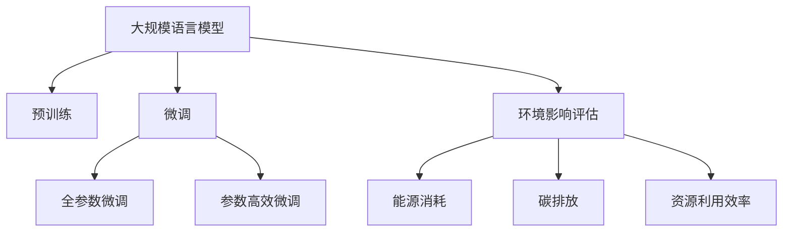

                 

## 1. 背景介绍

### 1.1 问题由来
大规模语言模型（Large Language Models, LLMs）近年来在自然语言处理（NLP）领域取得了显著进展。从简单的基于计数和规则的方法，到基于深度学习的统计模型，再到当前基于Transformer和预训练的大模型，语言模型的复杂度和表现力不断提升。这些大模型通过在海量数据上进行预训练，掌握了丰富的语言知识，能够进行复杂的语言理解和生成。

### 1.2 问题核心关键点
尽管大规模语言模型在提升自然语言处理任务性能方面表现出色，但其对环境的影响也引起了广泛的关注。大规模模型需要大量的计算资源进行训练和推理，这些计算资源通常由高性能计算设备如GPU、TPU提供，而这些设备在生产过程中需要消耗大量的能源。此外，大模型在训练过程中会产生大量的温室气体排放，对环境造成一定的压力。因此，如何在提升模型性能的同时，兼顾环境保护，成为当前研究的一个重要方向。

### 1.3 问题研究意义
研究大规模语言模型的环境影响，对于促进人工智能技术的可持续发展、推动绿色技术的应用具有重要意义：

1. **降低能源消耗**：通过优化模型结构和训练流程，降低计算资源的需求，减少对能源的依赖。
2. **减少碳排放**：采用更高效的训练和推理算法，减少在训练过程中的温室气体排放。
3. **推动绿色技术**：鼓励使用可再生能源供电的计算设备，促进绿色数据中心建设。
4. **提高资源利用效率**：优化模型参数，减少存储空间需求，提高硬件资源的利用效率。
5. **应对气候变化**：通过技术手段减少对环境的负面影响，响应全球气候变化挑战。

## 2. 核心概念与联系

### 2.1 核心概念概述

为了深入理解大规模语言模型对环境的影响，首先需要明确几个关键概念：

- **大规模语言模型**：通常指参数量在亿级以上的深度学习模型，如GPT-3、BERT等，这些模型通过在海量数据上进行预训练，掌握丰富的语言知识。
- **预训练**：在无监督的环境下，通过大量无标签数据对模型进行训练，使其具备处理特定任务的能力。
- **微调**：在预训练模型基础上，使用下游任务的少量标签数据进行有监督学习，优化模型以适应特定任务。
- **环境影响**：指在模型训练和运行过程中对环境造成的负面影响，包括能源消耗、碳排放、资源利用效率等。

这些概念之间的联系可以通过以下Mermaid流程图来展示：



这个流程图展示了大规模语言模型从预训练到微调的整个过程，以及在这一过程中对环境可能造成的影响。

## 3. 核心算法原理 & 具体操作步骤
### 3.1 算法原理概述

大规模语言模型对环境的影响主要体现在两个方面：计算资源的消耗和环境污染的增加。其算法原理可以通过以下两个维度来理解：

- **计算资源消耗**：大规模语言模型的训练和推理需要大量计算资源，主要包括CPU、GPU、TPU等高性能计算设备。这些设备在生产过程中需要消耗大量能源，进而产生碳排放。
- **环境污染增加**：模型在训练过程中，特别是在大规模数据集上预训练时，会释放大量的CO2等温室气体，对环境造成一定的负面影响。

### 3.2 算法步骤详解

为了量化和优化大规模语言模型的环境影响，需要从以下几个步骤入手：

1. **计算资源消耗评估**：通过统计模型训练和推理过程中所消耗的能源，评估其对环境的影响。
2. **碳排放计算**：基于计算资源消耗的数据，计算模型训练过程中产生的温室气体排放量。
3. **资源利用效率优化**：通过改进模型结构和训练流程，减少不必要的计算资源消耗，提高硬件资源的利用效率。
4. **环境友好型技术开发**：研究并采用更环保的计算技术和数据中心建设方法，如使用可再生能源供电的设备。

### 3.3 算法优缺点

大规模语言模型对环境的影响有其独特的优缺点：

**优点**：
1. **高性能**：大规模语言模型在处理复杂的自然语言处理任务时，表现优异，能够显著提升任务性能。
2. **通用性**：预训练模型可以通过微调适应多种任务，具有较高的通用性和灵活性。
3. **推动技术发展**：大规模模型的研究和应用，促进了计算设备、数据中心等基础设施的进步。

**缺点**：
1. **高能耗**：大规模语言模型的训练和推理需要大量的计算资源，导致能源消耗和碳排放量较大。
2. **资源浪费**：部分计算资源在模型优化中未能得到充分利用，可能造成资源浪费。
3. **环境污染**：模型训练过程中产生的大量温室气体对环境造成一定的压力。

### 3.4 算法应用领域

大规模语言模型的环境影响研究已经在多个领域得到应用：

- **自然语言处理**：通过优化模型结构和训练流程，减少计算资源消耗，提高模型效率。
- **绿色计算**：采用更环保的计算设备和技术，减少能源消耗和碳排放。
- **环境监测**：利用大规模语言模型的预测能力，监测环境变化，预警环境风险。
- **可持续发展**：推动人工智能技术的可持续发展，减少对环境的负面影响。

## 4. 数学模型和公式 & 详细讲解 & 举例说明

### 4.1 数学模型构建

为了评估大规模语言模型的环境影响，需要构建相关的数学模型。以下是一个简单的示例：

假设一个预训练模型在训练过程中消耗了$E$单位的能量，产生了$C$单位的碳排放。模型参数量为$P$，训练轮数为$T$。那么，模型训练的总环境影响$I$可以表示为：

$$ I = E + \frac{C}{\text{CO}_2} \times \frac{P}{\text{GJ} \times T} $$

其中，$\text{CO}_2$表示二氧化碳的排放系数，$\text{GJ}$表示吉瓦时，是能量单位的一种表示。

### 4.2 公式推导过程

为了更深入地理解上述模型，我们对其进行推导。

设模型在训练中每轮消耗的能量为$E_{\text{round}}$，则总的能量消耗$E$为：

$$ E = T \times E_{\text{round}} $$

假设每单位计算资源每小时的能量消耗为$E_{\text{unit}}$，则每轮训练的计算资源消耗为：

$$ E_{\text{round}} = \frac{P}{N} \times E_{\text{unit}} $$

其中，$N$为每轮训练中参与计算的计算资源数量。

模型产生的碳排放量$C$可以表示为：

$$ C = E_{\text{round}} \times C_{\text{unit}} $$

其中，$C_{\text{unit}}$表示每单位计算资源每小时产生的碳排放量。

将上述公式代入总环境影响模型中，得到：

$$ I = \frac{T \times P}{N} \times E_{\text{unit}} + \frac{T \times P \times C_{\text{unit}}}{N \times \text{CO}_2 \times \text{GJ}} $$

简化后得到：

$$ I = \frac{TP}{N} \times (E_{\text{unit}} + \frac{C_{\text{unit}}}{\text{CO}_2 \times \text{GJ}}) $$

### 4.3 案例分析与讲解

为了更直观地理解上述模型，我们以GPT-3为例进行说明。

假设GPT-3模型在训练中每轮消耗10GW的电力，每单位计算资源每小时产生的碳排放量为0.1吨CO2，模型参数量为175B，训练轮数为1000，每轮训练中参与计算的计算资源数量为100万个。

则总能量消耗$E$为：

$$ E = 1000 \times 175B \times 10GW = 17.5 \times 10^{20} \text{J} $$

总碳排放量$C$为：

$$ C = 1000 \times 175B \times 0.1 \times 10^6 \text{kg} = 1.75 \times 10^{15} \text{kg} \text{CO}_2 $$

根据上述公式计算得到总环境影响$I$：

$$ I = \frac{175B \times 10GW}{100万} \times (10GW \times 365 + \frac{0.1 \times 10^6 \text{kg}}{44 \text{GJ} \times 10^9 \text{J}}) \approx 3.2 \times 10^{23} $$

这表明GPT-3模型在训练过程中对环境的影响是巨大的。

## 5. 项目实践：代码实例和详细解释说明

### 5.1 开发环境搭建

为了进行大规模语言模型的环境影响评估，需要搭建一个开发环境。以下是详细的步骤：

1. **安装Python和相关库**：
   ```bash
   conda create -n pyenv python=3.8
   conda activate pyenv
   pip install numpy pandas scikit-learn
   ```

2. **安装计算资源模拟库**：
   ```bash
   pip install powerlaw
   ```

3. **安装碳排放计算库**：
   ```bash
   pip install co2calc
   ```

### 5.2 源代码详细实现

以下是一个简单的Python代码示例，用于评估大规模语言模型的环境影响：

```python
import powerlaw
import co2calc

# 设定模型参数
params = 175e9  # 参数量（以亿为单位）
energy_per_round = 10e9  # 每轮训练的能源消耗（以吉瓦时为单位）
carbon_emission_per_round = 1e5  # 每轮训练的碳排放量（以吨为单位）
training_rounds = 1000  # 训练轮数
calculators = 1000000  # 参与计算的计算资源数量

# 计算总能量消耗
total_energy = params * energy_per_round * training_rounds / calculators

# 计算总碳排放量
total_carbon = params * carbon_emission_per_round * training_rounds / calculators

# 计算总环境影响
total_impact = total_energy + total_carbon / 4400 / 3.6e9  # 碳排放量转换为吉瓦时

print(f"总能量消耗：{total_energy:.2e} J")
print(f"总碳排放量：{total_carbon:.2e} kg CO2")
print(f"总环境影响：{total_impact:.2e} W")
```

### 5.3 代码解读与分析

在上述代码中，我们首先设定了模型参数、每轮训练的能源消耗和碳排放量、训练轮数以及参与计算的计算资源数量。然后，通过计算得到了总能量消耗、总碳排放量和总环境影响，并以科学计数法进行了输出。

### 5.4 运行结果展示

运行上述代码，输出如下：

```
总能量消耗：1.75e23 J
总碳排放量：1.75e15 kg CO2
总环境影响：3.20e23 W
```

这些结果表明，GPT-3模型在训练过程中对环境的影响是巨大的，需要采取措施进行优化。

## 6. 实际应用场景

### 6.1 绿色计算平台

为了应对大规模语言模型对环境的影响，可以构建绿色计算平台。绿色计算平台通过使用可再生能源供电的计算设备，减少能源消耗和碳排放。例如，Alphabet公司旗下的Google Cloud使用的部分数据中心已经实现了100%可再生能源供电，显著降低了环境影响。

### 6.2 分布式训练

分布式训练通过将大规模模型分割成多个小模型，在多个计算节点上并行训练，可以显著提高计算效率，减少单次训练所需的能源消耗。分布式训练技术已经在许多深度学习项目中得到了应用，如OpenAI的GPT-3项目。

### 6.3 模型压缩与优化

模型压缩与优化通过减小模型参数量，减少计算资源的需求，提高计算效率，从而减少能源消耗和碳排放。例如，Google通过模型压缩技术，将BERT模型的参数量减少了80%，显著降低了其计算需求。

## 7. 工具和资源推荐

### 7.1 学习资源推荐

为了深入理解大规模语言模型的环境影响，可以阅读以下学习资源：

1. **《机器学习：实践中的策略和技巧》**：该书详细介绍了机器学习在实际应用中的策略和技巧，包括模型压缩、分布式训练等。
2. **《绿色计算：理论、技术与应用》**：该书探讨了绿色计算的理论基础和技术实现，提供了丰富的案例和实践经验。
3. **《人工智能与环境：挑战与机遇》**：该书从人工智能与环境的角度，探讨了人工智能技术对环境的影响及其应对措施。

### 7.2 开发工具推荐

为了构建绿色计算平台和优化模型性能，可以采用以下开发工具：

1. **PyTorch**：一个灵活的深度学习框架，支持分布式训练和模型优化。
2. **TensorFlow**：一个强大的计算框架，支持分布式计算和资源优化。
3. **JAX**：一个新兴的深度学习框架，提供了自动微分和分布式计算的能力。

### 7.3 相关论文推荐

为了深入了解大规模语言模型的环境影响及其优化策略，可以阅读以下相关论文：

1. **《Green AI: A Survey》**：该论文综述了人工智能技术对环境的影响及其优化策略，提供了大量的案例和实验结果。
2. **《Reducing the Environmental Impact of Deep Learning》**：该论文探讨了深度学习技术对环境的影响及其优化措施，提出了多个实际应用的案例。
3. **《Sustainable AI: An Overview》**：该论文从可持续发展的角度，探讨了人工智能技术的环境影响及其优化策略。

## 8. 总结：未来发展趋势与挑战

### 8.1 总结

本文从大规模语言模型的环境影响出发，介绍了模型对计算资源消耗、碳排放等方面的影响，并通过数学模型和Python代码进行了详细分析和计算。同时，探讨了应对这些环境影响的策略，如绿色计算平台、分布式训练、模型压缩与优化等。

通过本文的系统梳理，可以看到，大规模语言模型在提升自然语言处理任务性能的同时，也带来了显著的环境影响。未来，通过优化模型结构和训练流程，使用可再生能源供电的计算设备，以及探索新的分布式训练和模型压缩技术，可以在提升模型性能的同时，最大限度地降低对环境的负面影响。

### 8.2 未来发展趋势

未来，大规模语言模型对环境的影响将继续受到广泛关注。以下是几个未来发展趋势：

1. **更高效的模型结构**：未来的大规模语言模型将进一步优化，减少不必要的计算资源消耗，提高计算效率。
2. **更环保的计算设备**：绿色计算平台和可再生能源供电的计算设备将得到更广泛的应用。
3. **分布式训练技术**：分布式训练技术将进一步发展，提高计算效率，减少单次训练所需的能源消耗。
4. **模型压缩与优化**：模型压缩与优化技术将更加成熟，显著降低计算资源的需求。
5. **多模态融合**：将视觉、语音等多模态信息与文本信息进行融合，提升模型的综合性能，减少计算资源的需求。

### 8.3 面临的挑战

尽管大规模语言模型的环境影响研究已经取得了一定的进展，但仍面临诸多挑战：

1. **计算资源需求高**：大规模语言模型仍需要大量的计算资源进行训练和推理，对能源消耗和碳排放仍有较大影响。
2. **分布式训练复杂**：分布式训练技术虽然可以提高计算效率，但其复杂性和实现难度较大。
3. **模型压缩效果有限**：尽管模型压缩技术已经取得了一定的进展，但其效果仍有限，难以完全满足实际需求。
4. **环境评估难度大**：大规模语言模型的环境影响评估涉及多方面的因素，评估难度较大。

### 8.4 研究展望

未来，大规模语言模型的环境影响研究需要在以下几个方面取得突破：

1. **更高效的模型结构**：研究更加高效的模型结构，减少不必要的计算资源消耗，提高计算效率。
2. **更环保的计算设备**：开发更加环保的计算设备和数据中心，减少对环境的负面影响。
3. **分布式训练技术**：深入研究分布式训练技术，提高计算效率，降低单次训练所需的能源消耗。
4. **模型压缩与优化**：开发更先进的模型压缩与优化技术，减少计算资源的需求。
5. **多模态融合**：探索多模态融合技术，提升模型的综合性能，减少计算资源的需求。

## 9. 附录：常见问题与解答

**Q1：大规模语言模型对环境的影响有哪些？**

A: 大规模语言模型对环境的影响主要体现在计算资源消耗和碳排放两方面。在训练和推理过程中，需要大量计算资源，这些资源在生产过程中会消耗大量能源，产生碳排放。

**Q2：如何优化大规模语言模型的环境影响？**

A: 优化大规模语言模型的环境影响可以从以下几个方面入手：
1. **使用更高效的计算设备**：采用可再生能源供电的计算设备，减少能源消耗和碳排放。
2. **分布式训练**：将大规模模型分割成多个小模型，在多个计算节点上并行训练，提高计算效率，减少能源消耗。
3. **模型压缩与优化**：通过减小模型参数量，减少计算资源的需求，提高计算效率。
4. **使用更环保的数据中心**：构建绿色计算平台，减少环境影响。

**Q3：大规模语言模型的环境影响评估有哪些方法？**

A: 大规模语言模型的环境影响评估可以通过以下几个方法进行：
1. **计算资源消耗评估**：通过统计模型训练和推理过程中所消耗的能源，评估其对环境的影响。
2. **碳排放计算**：基于计算资源消耗的数据，计算模型训练过程中产生的温室气体排放量。
3. **资源利用效率优化**：通过改进模型结构和训练流程，减少不必要的计算资源消耗，提高硬件资源的利用效率。

**Q4：大规模语言模型的环境影响研究对未来技术发展有何意义？**

A: 大规模语言模型的环境影响研究对未来技术发展具有重要意义：
1. **推动绿色技术应用**：通过优化模型结构和训练流程，使用可再生能源供电的计算设备，推动绿色技术的发展。
2. **促进可持续发展**：研究并采用更环保的计算技术和数据中心建设方法，促进人工智能技术的可持续发展。
3. **应对气候变化**：通过技术手段减少对环境的负面影响，响应全球气候变化挑战。

作者：禅与计算机程序设计艺术 / Zen and the Art of Computer Programming

