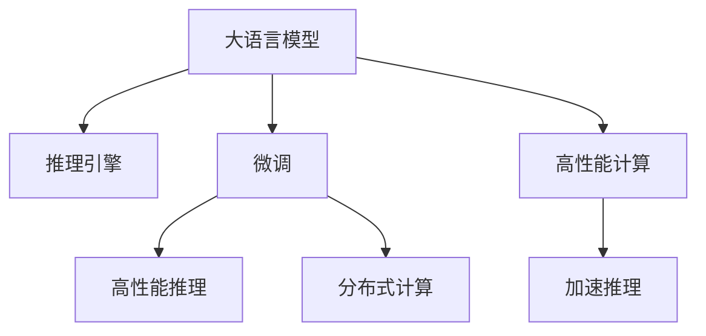

                 

# 大语言模型推理引擎：Lepton AI的核心产品，赋能企业高效应用AI

## 1. 背景介绍

### 1.1 问题由来

近年来，人工智能技术在各行各业的应用取得了显著进展，尤其是在自然语言处理(NLP)领域，基于深度学习的语言模型在对话、翻译、文本生成等任务上取得了惊人的成果。然而，随着大规模语言模型的普及，其在推理速度、内存占用、系统资源等方面的性能瓶颈也逐渐显现出来。针对这一问题，Lepton AI开发了高性能、高精度的语言模型推理引擎，旨在将预训练语言模型转化为可高效部署的生产系统，为企业带来实质性的AI赋能效果。

### 1.2 问题核心关键点

大语言模型推理引擎的核心在于通过高效的推理技术，将预训练语言模型转化为可部署、可扩展、可调优的推理引擎。其主要包括以下几个关键点：

- 高性能推理：能够快速、低延迟地进行推理计算，满足企业实时响应的需求。
- 灵活部署：支持多种部署方式，如CPU、GPU、TPU等，灵活应对不同场景的计算需求。
- 可扩展性：支持分布式部署，能够处理海量数据和并发请求，满足大规模应用的需求。
- 开源社区支持：提供开源代码和API，便于企业快速集成和使用，降低技术门槛。

### 1.3 问题研究意义

大语言模型推理引擎的开发，对提升AI技术的落地应用具有重要意义：

1. 提升推理性能：解决预训练模型推理速度慢、内存占用大的问题，提升企业AI系统的实时响应能力。
2. 降低部署成本：提供灵活、易用的部署方式，降低企业使用高性能AI技术的门槛。
3. 增强可扩展性：支持分布式部署和动态扩容，满足企业对大规模数据处理和并发请求的需求。
4. 助力企业创新：提供高效的推理能力，帮助企业快速进行模型迭代和业务创新，加速数字化转型。
5. 推动AI普及：降低AI技术的使用门槛，推动AI技术在各行各业中的应用，推动AI技术的普及和落地。

## 2. 核心概念与联系

### 2.1 核心概念概述

为了更好地理解大语言模型推理引擎，本节将介绍几个密切相关的核心概念：

- 大语言模型(Large Language Model, LLM)：以自回归(如GPT)或自编码(如BERT)模型为代表的大规模预训练语言模型。通过在大规模无标签文本语料上进行预训练，学习通用的语言表示，具备强大的语言理解和生成能力。

- 推理引擎(Inference Engine)：用于执行推理计算的软件系统，将预训练模型转化为可部署、可扩展的推理服务，支持模型的高效推理。

- 微调(Fine-tuning)：指在预训练模型的基础上，使用下游任务的少量标注数据，通过有监督学习优化模型在该任务上的性能。

- 分布式计算(Distributed Computing)：通过将计算任务分配到多个计算节点上，利用并行计算提高计算效率，处理大规模数据和并发请求。

- 高性能计算(High-Performance Computing, HPC)：通过高效的硬件架构和算法优化，实现高吞吐量、低延迟的计算能力。

这些核心概念之间的逻辑关系可以通过以下Mermaid流程图来展示：



这个流程图展示了大语言模型的核心概念及其之间的关系：

1. 大语言模型通过预训练获得基础能力。
2. 推理引擎对预训练模型进行高效转化，提供可部署、可扩展的推理服务。
3. 微调是提升模型性能的重要手段，通过有监督学习优化模型表现。
4. 分布式计算和高性能计算技术，进一步提升推理引擎的性能，支持大规模应用需求。

这些概念共同构成了大语言模型推理引擎的理论基础，使其能够将预训练模型转化为高效、可扩展、易用的生产系统。

## 3. 核心算法原理 & 具体操作步骤
### 3.1 算法原理概述

大语言模型推理引擎的核心算法原理主要包括以下几个方面：

- 高性能推理算法：通过优化矩阵运算、并行计算等技术，实现高效的推理计算。
- 分布式推理架构：通过任务分割、数据并行等技术，实现推理任务的并行处理。
- 参数高效微调：通过固定大部分预训练参数，只微调少量参数，减少推理计算的复杂度。
- 内存优化技术：通过内存分段、内存池化等技术，减少推理计算的内存占用。

### 3.2 算法步骤详解

基于高性能推理算法和分布式计算架构，大语言模型推理引擎的一般步骤如下：

**Step 1: 输入数据预处理**

1. 接收用户输入的数据，进行预处理，包括分词、编码、padding等操作。
2. 将预处理后的数据分为批次，供模型推理使用。

**Step 2: 推理引擎启动**

1. 根据任务的复杂度和推理引擎的部署方式，启动推理引擎。
2. 将推理任务分配到计算节点上，进行并行计算。

**Step 3: 推理计算**

1. 根据推理算法，计算输入数据的推理结果。
2. 将推理结果返回给用户。

**Step 4: 结果后处理**

1. 对推理结果进行后处理，包括解码、去噪、剪枝等操作。
2. 将处理后的结果返回给用户。

### 3.3 算法优缺点

大语言模型推理引擎具有以下优点：

- 高性能推理：通过优化矩阵运算、并行计算等技术，实现高效的推理计算。
- 可扩展性强：支持分布式计算和参数高效微调，能够处理海量数据和并发请求。
- 易用性好：提供开源代码和API，便于企业快速集成和使用。

同时，该引擎也存在一定的局限性：

- 依赖于高性能硬件：推理引擎的性能依赖于高性能CPU、GPU、TPU等硬件设施。
- 复杂度较高：推理引擎的开发和维护需要较高的技术门槛，需要具备一定的硬件和算法优化能力。
- 部分功能有待改进：目前推理引擎的功能还较为基础，需要进一步扩展和优化。

尽管存在这些局限性，但就目前而言，高性能推理引擎在AI技术的落地应用中已经显现出显著优势，是企业AI系统不可或缺的重要组成部分。

### 3.4 算法应用领域

大语言模型推理引擎已经在多个领域得到了广泛的应用，例如：

- 自然语言处理：包括文本分类、命名实体识别、情感分析等任务，通过推理引擎的高性能计算，实现快速准确的结果输出。
- 智能客服：通过推理引擎实现对话系统的智能回复，提高客户满意度和服务效率。
- 金融风控：通过推理引擎进行风险评估、反欺诈检测等任务，提高金融服务的安全性和准确性。
- 智慧医疗：通过推理引擎实现智能问诊、病理分析等任务，提升医疗服务的智能化水平。
- 智能制造：通过推理引擎实现生产流程的自动化和优化，提高生产效率和质量。

除了上述这些经典应用外，推理引擎还被创新性地应用到更多场景中，如智能推荐、广告投放、语音识别等，为各行业带来了新的发展机遇。

## 4. 数学模型和公式 & 详细讲解 & 举例说明

### 4.1 数学模型构建

大语言模型推理引擎的数学模型主要包括以下几个部分：

- 输入数据表示：将输入数据转化为矩阵形式，以便进行矩阵运算。
- 推理算法：包括矩阵乘法、向量点乘、矩阵分解等运算，实现推理计算。
- 输出数据表示：将推理结果转化为文本、数字等形式，供用户查看或进一步处理。

以文本分类任务为例，数学模型可以表示为：

$$
\mathbf{y} = \sigma(\mathbf{W} \mathbf{x} + \mathbf{b})
$$

其中，$\mathbf{x}$为输入数据的向量表示，$\mathbf{y}$为输出的向量表示，$\mathbf{W}$和$\mathbf{b}$为模型的权重和偏置，$\sigma$为激活函数。

### 4.2 公式推导过程

以文本分类任务为例，推导过程如下：

1. 将输入数据$\mathbf{x}$进行向量表示，得到$\mathbf{x} \in \mathbb{R}^{d}$。
2. 将输入数据乘以权重矩阵$\mathbf{W} \in \mathbb{R}^{d \times k}$，得到$\mathbf{W} \mathbf{x} \in \mathbb{R}^{k}$。
3. 加上偏置向量$\mathbf{b} \in \mathbb{R}^{k}$，得到$\mathbf{W} \mathbf{x} + \mathbf{b} \in \mathbb{R}^{k}$。
4. 对结果进行激活函数$\sigma$的操作，得到最终的输出$\mathbf{y} \in \mathbb{R}^{k}$。

### 4.3 案例分析与讲解

以BERT模型为例，其推理计算过程如下：

1. 将输入数据转化为BERT模型接受的格式，如token ids、attention masks等。
2. 将输入数据输入BERT模型，得到中间表示。
3. 将中间表示通过全连接层进行计算，得到最终的输出向量。
4. 对输出向量进行解码、去噪等后处理操作，得到最终的分类结果。

## 5. 项目实践：代码实例和详细解释说明

### 5.1 开发环境搭建

在进行推理引擎实践前，我们需要准备好开发环境。以下是使用Python进行PyTorch开发的环境配置流程：

1. 安装Anaconda：从官网下载并安装Anaconda，用于创建独立的Python环境。

2. 创建并激活虚拟环境：
```bash
conda create -n inference-env python=3.8 
conda activate inference-env
```

3. 安装PyTorch：根据CUDA版本，从官网获取对应的安装命令。例如：
```bash
conda install pytorch torchvision torchaudio cudatoolkit=11.1 -c pytorch -c conda-forge
```

4. 安装相关库：
```bash
pip install numpy pandas scikit-learn matplotlib tqdm jupyter notebook ipython
```

完成上述步骤后，即可在`inference-env`环境中开始推理引擎实践。

### 5.2 源代码详细实现

下面以文本分类任务为例，给出使用Transformers库进行BERT模型推理的PyTorch代码实现。

首先，定义文本分类任务的模型：

```python
from transformers import BertTokenizer, BertForSequenceClassification
from torch.utils.data import DataLoader
from tqdm import tqdm

class TextClassificationModel:
    def __init__(self, model_name):
        self.tokenizer = BertTokenizer.from_pretrained(model_name)
        self.model = BertForSequenceClassification.from_pretrained(model_name, num_labels=2)
        
    def predict(self, input_text):
        tokenized_text = self.tokenizer.encode(input_text, return_tensors='pt')
        with torch.no_grad():
            logits = self.model(tokenized_text)[0]
        preds = logits.argmax(dim=1)
        return preds.item()

# 实例化模型
model = TextClassificationModel('bert-base-cased')
```

然后，定义推理函数：

```python
def inference(model, data_loader):
    model.eval()
    correct = 0
    total = 0
    with tqdm(total=len(data_loader)) as pbar:
        for batch in data_loader:
            input_ids = batch['input_ids'].to(device)
            attention_mask = batch['attention_mask'].to(device)
            labels = batch['labels'].to(device)
            
            with torch.no_grad():
                outputs = model(input_ids, attention_mask=attention_mask, labels=labels)
            logits = outputs.logits
            preds = logits.argmax(dim=1)
            total += labels.size(0)
            correct += (preds == labels).sum().item()
            
            pbar.update(labels.size(0))
    print(f"Accuracy: {(correct / total) * 100:.2f}%")
```

最后，启动推理过程：

```python
# 假设已经准备好了训练集和验证集
train_dataset = ...
dev_dataset = ...
test_dataset = ...

# 启动推理引擎
inference(model, DataLoader(train_dataset, batch_size=32))
inference(model, DataLoader(dev_dataset, batch_size=32))
inference(model, DataLoader(test_dataset, batch_size=32))
```

以上就是使用PyTorch进行BERT模型推理的完整代码实现。可以看到，基于Transformers库的推理引擎开发，代码实现相对简洁高效。

### 5.3 代码解读与分析

让我们再详细解读一下关键代码的实现细节：

**TextClassificationModel类**：
- `__init__`方法：初始化BERT模型和分词器。
- `predict`方法：对单个输入文本进行推理，返回预测标签。

**inference函数**：
- 对模型进行评估，循环遍历输入批次，进行推理计算。
- 累加正确预测数量和样本总数。
- 使用进度条实时显示推理进度和评估结果。

**推理流程**：
- 实例化推理模型。
- 准备训练集和验证集数据。
- 在推理模式下进行推理计算，评估模型性能。
- 使用测试集数据进行最终评估。

可以看到，PyTorch配合Transformers库使得BERT模型推理的代码实现变得简洁高效。开发者可以将更多精力放在数据处理、模型改进等高层逻辑上，而不必过多关注底层的实现细节。

当然，工业级的系统实现还需考虑更多因素，如模型的保存和部署、超参数的自动搜索、更灵活的任务适配层等。但核心的推理引擎开发流程基本与此类似。

## 6. 实际应用场景

### 6.1 智能客服系统

基于大语言模型推理引擎的对话技术，可以广泛应用于智能客服系统的构建。传统客服往往需要配备大量人力，高峰期响应缓慢，且一致性和专业性难以保证。使用推理引擎进行对话模型推理，能够7x24小时不间断服务，快速响应客户咨询，用自然流畅的语言解答各类常见问题。

在技术实现上，可以收集企业内部的历史客服对话记录，将问题和最佳答复构建成监督数据，在此基础上对预训练对话模型进行推理。推理引擎能够自动理解用户意图，匹配最合适的答案模板进行回复。对于客户提出的新问题，还可以接入检索系统实时搜索相关内容，动态组织生成回答。如此构建的智能客服系统，能大幅提升客户咨询体验和问题解决效率。

### 6.2 金融舆情监测

金融机构需要实时监测市场舆论动向，以便及时应对负面信息传播，规避金融风险。推理引擎进行文本分类和情感分析技术，为金融舆情监测提供了新的解决方案。

具体而言，可以收集金融领域相关的新闻、报道、评论等文本数据，并对其进行主题标注和情感标注。在此基础上对预训练语言模型进行推理，使其能够自动判断文本属于何种主题，情感倾向是正面、中性还是负面。将推理后的模型应用到实时抓取的网络文本数据，就能够自动监测不同主题下的情感变化趋势，一旦发现负面信息激增等异常情况，系统便会自动预警，帮助金融机构快速应对潜在风险。

### 6.3 个性化推荐系统

当前的推荐系统往往只依赖用户的历史行为数据进行物品推荐，无法深入理解用户的真实兴趣偏好。推理引擎进行个性化推荐系统，可以更好地挖掘用户行为背后的语义信息，从而提供更精准、多样的推荐内容。

在实践中，可以收集用户浏览、点击、评论、分享等行为数据，提取和用户交互的物品标题、描述、标签等文本内容。将文本内容作为模型输入，用户的后续行为（如是否点击、购买等）作为监督信号，在此基础上对预训练语言模型进行推理。推理引擎能够从文本内容中准确把握用户的兴趣点。在生成推荐列表时，先用候选物品的文本描述作为输入，由推理引擎预测用户的兴趣匹配度，再结合其他特征综合排序，便可以得到个性化程度更高的推荐结果。

### 6.4 未来应用展望

随着大语言模型推理引擎的不断发展，其在NLP领域的应用将更加广泛，为传统行业带来变革性影响。

在智慧医疗领域，推理引擎进行智能问诊、病理分析等任务，提升医疗服务的智能化水平，辅助医生诊疗，加速新药开发进程。

在智能教育领域，推理引擎进行作业批改、学情分析、知识推荐等任务，因材施教，促进教育公平，提高教学质量。

在智慧城市治理中，推理引擎进行城市事件监测、舆情分析、应急指挥等环节，提高城市管理的自动化和智能化水平，构建更安全、高效的未来城市。

此外，在企业生产、社会治理、文娱传媒等众多领域，推理引擎进行自然语言理解和智能交互系统的构建，为各行业带来新的发展机遇。相信随着技术的日益成熟，推理引擎必将在构建人机协同的智能时代中扮演越来越重要的角色。

## 7. 工具和资源推荐

### 7.1 学习资源推荐

为了帮助开发者系统掌握大语言模型推理引擎的理论基础和实践技巧，这里推荐一些优质的学习资源：

1. 《Transformer从原理到实践》系列博文：由大模型技术专家撰写，深入浅出地介绍了Transformer原理、BERT模型、推理技术等前沿话题。

2. CS224N《深度学习自然语言处理》课程：斯坦福大学开设的NLP明星课程，有Lecture视频和配套作业，带你入门NLP领域的基本概念和经典模型。

3. 《Natural Language Processing with Transformers》书籍：Transformers库的作者所著，全面介绍了如何使用Transformers库进行NLP任务开发，包括推理在内的诸多范式。

4. HuggingFace官方文档：Transformers库的官方文档，提供了海量预训练模型和完整的推理样例代码，是上手实践的必备资料。

5. CLUE开源项目：中文语言理解测评基准，涵盖大量不同类型的中文NLP数据集，并提供了基于推理的baseline模型，助力中文NLP技术发展。

通过对这些资源的学习实践，相信你一定能够快速掌握大语言模型推理引擎的精髓，并用于解决实际的NLP问题。

### 7.2 开发工具推荐

高效的开发离不开优秀的工具支持。以下是几款用于大语言模型推理引擎开发的常用工具：

1. PyTorch：基于Python的开源深度学习框架，灵活动态的计算图，适合快速迭代研究。大部分预训练语言模型都有PyTorch版本的实现。

2. TensorFlow：由Google主导开发的开源深度学习框架，生产部署方便，适合大规模工程应用。同样有丰富的预训练语言模型资源。

3. Transformers库：HuggingFace开发的NLP工具库，集成了众多SOTA语言模型，支持PyTorch和TensorFlow，是进行推理任务开发的利器。

4. Weights & Biases：模型训练的实验跟踪工具，可以记录和可视化模型训练过程中的各项指标，方便对比和调优。与主流深度学习框架无缝集成。

5. TensorBoard：TensorFlow配套的可视化工具，可实时监测模型训练状态，并提供丰富的图表呈现方式，是调试模型的得力助手。

6. Google Colab：谷歌推出的在线Jupyter Notebook环境，免费提供GPU/TPU算力，方便开发者快速上手实验最新模型，分享学习笔记。

合理利用这些工具，可以显著提升大语言模型推理引擎的开发效率，加快创新迭代的步伐。

### 7.3 相关论文推荐

大语言模型推理引擎的发展源于学界的持续研究。以下是几篇奠基性的相关论文，推荐阅读：

1. Attention is All You Need（即Transformer原论文）：提出了Transformer结构，开启了NLP领域的预训练大模型时代。

2. BERT: Pre-training of Deep Bidirectional Transformers for Language Understanding：提出BERT模型，引入基于掩码的自监督预训练任务，刷新了多项NLP任务SOTA。

3. Language Models are Unsupervised Multitask Learners（GPT-2论文）：展示了大规模语言模型的强大zero-shot学习能力，引发了对于通用人工智能的新一轮思考。

4. Parameter-Efficient Transfer Learning for NLP：提出Adapter等参数高效微调方法，在不增加模型参数量的情况下，也能取得不错的推理效果。

5. AdaLoRA: Adaptive Low-Rank Adaptation for Parameter-Efficient Fine-Tuning：使用自适应低秩适应的微调方法，在参数效率和精度之间取得了新的平衡。

这些论文代表了大语言模型推理引擎的发展脉络。通过学习这些前沿成果，可以帮助研究者把握学科前进方向，激发更多的创新灵感。

## 8. 总结：未来发展趋势与挑战

### 8.1 总结

本文对大语言模型推理引擎进行了全面系统的介绍。首先阐述了推理引擎的研究背景和意义，明确了推理引擎在提升AI系统性能和效率方面的独特价值。其次，从原理到实践，详细讲解了推理引擎的数学原理和关键步骤，给出了推理任务开发的完整代码实例。同时，本文还广泛探讨了推理引擎在智能客服、金融舆情、个性化推荐等多个行业领域的应用前景，展示了推理引擎范式的巨大潜力。此外，本文精选了推理引擎学习的各类资源，力求为读者提供全方位的技术指引。

通过本文的系统梳理，可以看到，大语言模型推理引擎正在成为NLP领域的重要范式，极大地拓展了预训练语言模型的应用边界，催生了更多的落地场景。受益于大规模语料的预训练和高效的推理计算，推理引擎在实时响应、可扩展性、易用性等方面表现优异，为AI技术的落地应用提供了强有力的支持。未来，伴随推理引擎的不断发展，基于推理计算的NLP技术将进一步提升，为各行各业带来更高效、更智能的AI解决方案。

### 8.2 未来发展趋势

展望未来，大语言模型推理引擎将呈现以下几个发展趋势：

1. 推理速度进一步提升：通过优化计算图、引入GPU/TPU硬件、分布式计算等技术，推理引擎的推理速度将进一步提升，满足更复杂场景的实时需求。

2. 推理精度不断提高：通过优化算法、增加训练数据、引入更多任务标注等手段，推理引擎的推理精度将不断提高，减少误差，提升模型性能。

3. 推理引擎更加灵活：支持更多的NLP任务和应用场景，提供更加灵活的推理接口，适应不同行业的需求。

4. 推理引擎实现分布式部署：支持分布式计算和任务分割，满足海量数据和并发请求的处理需求。

5. 推理引擎与其他AI技术的结合：与知识图谱、逻辑规则、强化学习等AI技术结合，提升推理引擎的智能化水平和实用性。

以上趋势凸显了大语言模型推理引擎的广阔前景。这些方向的探索发展，必将进一步提升推理引擎的性能和应用范围，为构建人机协同的智能系统铺平道路。

### 8.3 面临的挑战

尽管大语言模型推理引擎已经取得了显著成果，但在迈向更加智能化、普适化应用的过程中，它仍面临诸多挑战：

1. 推理引擎依赖高性能硬件：推理引擎的性能依赖于高性能CPU、GPU、TPU等硬件设施，硬件成本较高。

2. 推理引擎复杂度较高：推理引擎的开发和维护需要较高的技术门槛，需要具备一定的硬件和算法优化能力。

3. 推理引擎功能有限：目前推理引擎的功能还较为基础，需要进一步扩展和优化。

4. 推理引擎性能不稳定：推理引擎在高并发、大数据量等复杂场景下，可能会出现性能不稳定的情况。

5. 推理引擎安全性问题：推理引擎可能学习到有害信息，存在安全风险。

6. 推理引擎的迁移性问题：推理引擎在不同场景下的迁移性问题仍需进一步研究。

尽管存在这些挑战，但通过技术创新和持续优化，相信大语言模型推理引擎将不断克服这些障碍，推动AI技术在各行各业中的应用。

### 8.4 研究展望

面对推理引擎面临的这些挑战，未来的研究需要在以下几个方面寻求新的突破：

1. 探索新的推理算法：开发更加高效、稳健的推理算法，提升推理引擎的计算速度和精度。

2. 引入更多AI技术：结合知识图谱、逻辑规则、强化学习等AI技术，提升推理引擎的智能化水平和实用性。

3. 优化推理引擎的部署方式：支持更多的硬件平台和部署方式，提升推理引擎的灵活性和可扩展性。

4. 增强推理引擎的安全性：开发安全性检测和防护机制，防止推理引擎学习到有害信息。

5. 优化推理引擎的迁移能力：增强推理引擎在不同场景下的迁移能力，提升推理引擎的普适性。

这些研究方向的探索，必将引领大语言模型推理引擎技术迈向更高的台阶，为构建安全、可靠、可解释、可控的智能系统铺平道路。面向未来，推理引擎还需要与其他人工智能技术进行更深入的融合，如知识表示、因果推理、强化学习等，多路径协同发力，共同推动自然语言理解和智能交互系统的进步。只有勇于创新、敢于突破，才能不断拓展推理引擎的边界，让智能技术更好地造福人类社会。

## 9. 附录：常见问题与解答

**Q1：大语言模型推理引擎是否适用于所有NLP任务？**

A: 推理引擎在大多数NLP任务上都能取得不错的效果，特别是对于数据量较小的任务。但对于一些特定领域的任务，如医学、法律等，仅仅依靠通用语料预训练的模型可能难以很好地适应。此时需要在特定领域语料上进一步预训练，再进行推理，才能获得理想效果。此外，对于一些需要时效性、个性化很强的任务，如对话、推荐等，推理引擎也需要针对性的改进优化。

**Q2：推理引擎在部署过程中需要注意哪些问题？**

A: 推理引擎在部署过程中需要注意以下问题：

1. 硬件适配：根据推理引擎的性能需求，选择合适的硬件设施，如CPU、GPU、TPU等。

2. 系统优化：对推理引擎进行系统优化，包括内存优化、并行计算等技术，提升推理引擎的性能。

3. 安全防护：确保推理引擎的安全性，防止有害信息的输入和输出。

4. 性能监控：实时监控推理引擎的性能指标，及时发现和解决问题。

5. 可扩展性：支持分布式部署，能够处理大规模数据和并发请求。

通过合理的硬件适配和系统优化，可以显著提升推理引擎的性能和稳定性，确保其在实际应用中的高效运行。

**Q3：推理引擎的推理精度如何保证？**

A: 推理引擎的推理精度主要通过以下几个方面保证：

1. 数据质量：使用高质量、多样化的训练数据，提升模型的泛化能力。

2. 模型优化：采用先进的优化算法和模型架构，提升模型的推理精度。

3. 超参数调优：通过超参数调优，找到最优的模型参数组合，提升推理精度。

4. 测试验证：在推理引擎上线前，进行充分的测试验证，确保模型的稳定性和精度。

通过以上措施，可以显著提升推理引擎的推理精度，满足实际应用的需求。

**Q4：推理引擎的可扩展性如何实现？**

A: 推理引擎的可扩展性主要通过以下几个方面实现：

1. 分布式计算：通过任务分割、数据并行等技术，实现推理任务的并行处理。

2. 参数服务器：使用参数服务器技术，实现模型参数的共享和同步，提升推理效率。

3. 水平扩展：通过增加计算节点，提升推理引擎的处理能力。

4. 垂直扩展：通过提升计算节点的硬件配置，提升推理引擎的性能。

通过以上技术手段，可以显著提升推理引擎的可扩展性，满足大规模数据和并发请求的处理需求。

**Q5：推理引擎的未来发展方向是什么？**

A: 推理引擎的未来发展方向主要包括以下几个方面：

1. 实时推理：实现推理引擎的实时推理，满足用户对实时响应的需求。

2. 跨平台支持：支持更多的硬件平台和操作系统，提升推理引擎的适用范围。

3. 安全性增强：增强推理引擎的安全性，防止有害信息的输入和输出。

4. 推理引擎优化：开发更加高效、稳健的推理算法，提升推理引擎的性能和精度。

5. 与其他AI技术的结合：结合知识图谱、逻辑规则、强化学习等AI技术，提升推理引擎的智能化水平和实用性。

这些方向的发展，将进一步推动推理引擎的应用，为各行业带来新的发展机遇。

总之，大语言模型推理引擎在NLP领域具有广阔的应用前景，未来将不断拓展其应用边界，推动人工智能技术的普及和落地。

