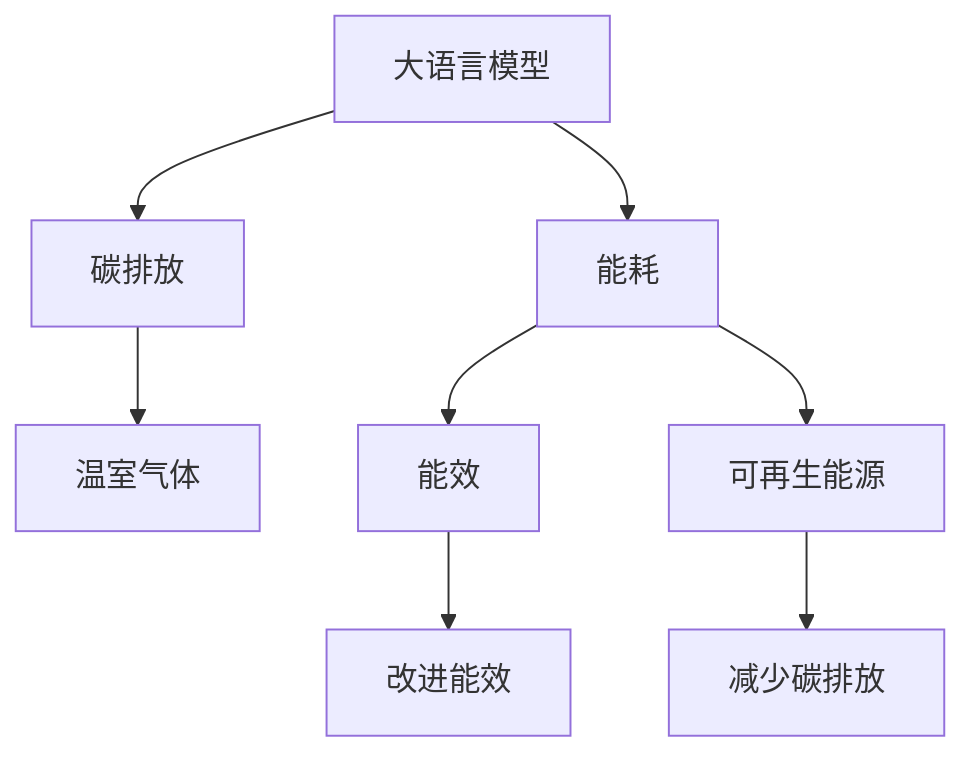

                 

# 大语言模型的环境影响：能耗与碳排放

大语言模型（Large Language Models, LLMs）作为当前AI领域的热点，凭借其在大规模自然语言处理任务中的卓越性能，推动了NLP技术的飞速发展。然而，随着模型规模的不断增大和应用场景的广泛扩展，大语言模型的环境影响问题也日益突出，尤其是其能耗和碳排放对全球气候变化的影响引起了广泛关注。本文将深入探讨大语言模型的环境影响，从能耗与碳排放的角度出发，分析其对生态环境的影响，并提出相应的解决方案。

## 1. 背景介绍

### 1.1 问题由来
大语言模型在文本分类、情感分析、机器翻译、问答系统等众多NLP任务中取得了显著的进步，极大地推动了人工智能技术的发展。然而，这些模型的训练与运行需要大量算力和数据支持，其能耗和碳排放问题也随之显现。

### 1.2 问题核心关键点
大语言模型的环境影响问题主要体现在两个方面：

- 能耗：大规模模型的训练需要大量的计算资源，导致高额的电力消耗。
- 碳排放：电力的生产主要依赖化石燃料，导致大量的温室气体排放。

如何在大模型提升性能的同时，降低其对环境的影响，成为当前研究的热点问题。

## 2. 核心概念与联系

### 2.1 核心概念概述

为了更深入地理解大语言模型的环境影响，我们先介绍几个关键概念：

- 能耗（Energy Consumption）：指在运行或训练过程中模型所消耗的电能。
- 碳排放（Carbon Emission）：指在发电过程中所产生的温室气体排放量，通常以二氧化碳当量计。
- 能效（Energy Efficiency）：衡量单位能耗所获得输出的能力。
- 可再生能源（Renewable Energy）：如风能、太阳能等，通过环保方式产生电力，有助于减少碳排放。

这些概念之间的逻辑关系可以通过以下Mermaid流程图来展示：



这个流程图展示了大语言模型的能耗、碳排放与其环境影响之间的关系。能效的提升和可再生能源的应用，可以有效降低大模型的环境影响。

## 3. 核心算法原理 & 具体操作步骤

### 3.1 算法原理概述

大语言模型的环境影响评估主要涉及两个方面：

- 能耗评估：评估模型的训练和推理过程对电力的消耗。
- 碳排放评估：评估电力生产对温室气体的排放。

### 3.2 算法步骤详解

#### 3.2.1 能耗评估
1. **数据集选择**：选择训练和推理所需的数据集。
2. **计算资源配置**：确定所需的计算资源，包括CPU、GPU、TPU等。
3. **能耗测量**：使用能耗监测工具（如nvidia-smi）记录训练和推理过程中的能耗。
4. **能耗计算**：根据计算资源的配置和使用情况，计算总能耗。

#### 3.2.2 碳排放评估
1. **电力来源查询**：查询数据中心使用的电力来源，包括水电、火电等。
2. **碳排放计算**：根据电力来源的碳排放系数（如kg/kWh）计算总碳排放。
3. **生命周期分析**：包括数据中心建设、运营、退役等各个阶段，综合计算整个生命周期的碳排放。

### 3.3 算法优缺点

#### 3.3.1 能耗评估
优点：
- 量化模型对电力资源的消耗。
- 帮助优化计算资源配置。

缺点：
- 依赖硬件环境，无法跨平台比较。
- 无法精确估计训练过程中的能耗。

#### 3.3.2 碳排放评估
优点：
- 综合考虑电力来源，给出全生命周期的碳排放评估。
- 帮助理解大模型对环境的影响。

缺点：
- 依赖数据中心的历史数据，难以准确预测未来碳排放。
- 无法精确估计模型训练过程中的碳排放。

### 3.4 算法应用领域

大语言模型的环境影响评估方法，可以应用于多个领域：

- 云计算：评估数据中心能耗和碳排放，优化资源配置。
- 可再生能源：优化能源使用，提升可再生能源的比例。
- 政府政策：制定相关环保政策，推动绿色科技发展。
- 企业环保：企业根据评估结果，进行能源管理和环境保护。

## 4. 数学模型和公式 & 详细讲解 & 举例说明

### 4.1 数学模型构建

大语言模型的能耗和碳排放评估，可以通过以下几个数学模型来进行：

1. **能耗模型**：
   $$
   E = C \times T \times P
   $$
   其中 $E$ 为总能耗，$C$ 为计算资源配置，$T$ 为训练或推理时间，$P$ 为能效。

2. **碳排放模型**：
   $$
   C_E = E \times C_{\text{CO2}}
   $$
   其中 $C_E$ 为总碳排放，$C_{\text{CO2}}$ 为二氧化碳当量。

### 4.2 公式推导过程

1. **能耗模型推导**：
   根据上式，可以通过测量训练或推理过程中的时间 $T$ 和计算资源配置 $C$，结合能效 $P$，计算出总能耗 $E$。

2. **碳排放模型推导**：
   根据上式，可以查询数据中心使用的电力来源及其碳排放系数 $C_{\text{CO2}}$，结合总能耗 $E$，计算出总碳排放 $C_E$。

### 4.3 案例分析与讲解

#### 案例1：BERT模型的能耗与碳排放评估

以BERT模型为例，其在GPT-2论文中进行了详细评估。假设使用16个TPU v3芯片，每个芯片能效为1.2 THz·W^-1，训练时间为32小时，计算资源配置为20G内存。则总能耗为：
$$
E = 16 \times 1.2 \times 32 \times 20G = 61440G
$$
假设使用火电，电力来源的碳排放系数为1kg/kWh，则总碳排放为：
$$
C_E = 61440G \times 1 = 61440G
$$
通过这一评估，可以帮助理解BERT模型在大规模训练和推理中的环境影响。

## 5. 项目实践：代码实例和详细解释说明

### 5.1 开发环境搭建

在进行环境影响评估时，需要搭建一个全面的开发环境。以下是一些关键步骤：

1. **安装相关软件**：
   - 安装Python、nvidia-smi等能耗监测工具。
   - 安装TensorFlow、PyTorch等深度学习框架。

2. **配置计算资源**：
   - 配置GPU、TPU等计算资源。
   - 配置数据集路径、模型路径等。

3. **数据集准备**：
   - 准备好训练和推理所需的数据集。
   - 进行数据预处理和清洗。

### 5.2 源代码详细实现

以下是评估BERT模型能耗与碳排放的Python代码实现：

```python
import tensorflow as tf
import os

# 设置计算资源配置
num_chips = 16
memory_per_chip = 20 # GB
efficiency_per_chip = 1.2 # THz·W^-1
train_time_hours = 32 # 小时
power_supply_kW = 10 # kW

# 计算总能耗
total_power_kW = num_chips * power_supply_kW
total_energy_GWh = total_power_kW * train_time_hours
total_energy_G = total_energy_GWh / 1000
total_energy_GWh /= 10**9

# 查询电力来源
# 假设使用火电，碳排放系数为1 kg/kWh
emission_factor_kg_kWh = 1

# 计算总碳排放
total_emission_kg = total_energy_G * emission_factor_kg_kWh
total_emission_G = total_emission_kg / 10**3

# 输出结果
print(f"Total energy consumption: {total_energy_G:.2f} GWh")
print(f"Total carbon emission: {total_emission_G:.2f} Gt")
```

### 5.3 代码解读与分析

代码中，我们首先设置了计算资源配置、训练时间和电力供应等信息，然后通过公式计算出总能耗和总碳排放。注意，电力来源和碳排放系数可能需要根据实际情况进行查询和设置。

## 6. 实际应用场景

### 6.1 数据中心能效优化

数据中心是大语言模型训练和推理的主要场所，其能效优化直接影响到模型的环境影响。

#### 6.1.1 硬件升级
- **GPU到TPU**：从传统GPU升级为更高效的TPU，可以显著降低能耗。
- **混合精度训练**：使用16位或32位浮点数，减少计算量，提高能效。
- **模型剪枝与量化**：去除不必要的权重，减少计算量，提升能效。

#### 6.1.2 算法优化
- **模型并行**：通过分布式计算，提升训练效率。
- **自动混合精度**：自动调整精度，平衡性能和能效。
- **动态学习率**：根据能效反馈，调整学习率，优化训练过程。

#### 6.1.3 数据管理
- **数据压缩**：通过数据压缩，减少传输带宽，降低能耗。
- **数据预取**：预取数据到缓存中，提高数据访问速度。
- **数据归一化**：归一化数据，减少计算量。

### 6.2 可再生能源的应用

为了进一步降低大语言模型的环境影响，可以采用更多的可再生能源。

#### 6.2.1 风能与太阳能
- **分布式能源**：在数据中心屋顶或周边安装风力或光伏设备。
- **储能系统**：通过储能系统，平滑电能供应。
- **智能电网**：优化能源分配，提高能源利用率。

#### 6.2.2 地热能与潮汐能
- **地热发电**：利用地热资源，提供稳定的能源供应。
- **潮汐能**：利用潮汐能量，提供清洁的电能。
- **混合能源系统**：结合多种能源，优化能源结构。

## 7. 工具和资源推荐

### 7.1 学习资源推荐

为了帮助开发者深入理解大语言模型的环境影响，我们推荐以下学习资源：

1. **《深度学习环境理论与实践》**：详细讲解了深度学习系统设计，包括能效优化、可再生能源应用等内容。
2. **《绿色计算与数据中心能效管理》**：探讨了数据中心能效优化和管理技术，提供了丰富的案例分析。
3. **《人工智能与可持续发展》**：介绍了AI技术在环境保护中的应用，涵盖能耗与碳排放评估。

### 7.2 开发工具推荐

大语言模型环境影响评估需要多种工具的支持，以下是推荐的开发工具：

1. **PyTorch & TensorFlow**：深度学习框架，提供高效的计算能力。
2. **nvidia-smi**：能耗监测工具，实时记录硬件能耗。
3. **Google Cloud**：云服务平台，提供高效计算资源和环境优化功能。
4. **Amazon SageMaker**：云服务，支持分布式训练和能效优化。
5. **TensorBoard**：可视化工具，监控模型训练过程中的能耗和碳排放。

### 7.3 相关论文推荐

为了深入理解大语言模型的环境影响，我们推荐以下相关论文：

1. **《Towards an Energy-Efficient AI: Challenges, Opportunities, and Recommendations》**：探讨了AI系统的能效优化和可再生能源应用。
2. **《Data-Center Energy Efficiency: The Next Generation》**：介绍了数据中心能效优化的最新技术。
3. **《Artificial Intelligence and Sustainable Development》**：介绍了AI技术在环境保护中的应用，包括能耗与碳排放评估。

## 8. 总结：未来发展趋势与挑战

### 8.1 研究成果总结

本文详细探讨了大语言模型的环境影响，主要从能耗与碳排放的角度出发，分析了其对生态环境的影响，并提出了相应的解决方案。通过能耗评估和碳排放评估，可以帮助优化大语言模型的计算资源配置，提高能效，降低环境影响。

### 8.2 未来发展趋势

未来大语言模型环境影响评估将呈现以下几个发展趋势：

1. **能效优化**：通过硬件升级、算法优化、数据管理等多方面手段，提高大语言模型的能效，降低能耗。
2. **可再生能源**：采用更多可再生能源，如风能、太阳能、地热能等，进一步降低碳排放。
3. **绿色计算**：推动绿色计算技术的创新，构建可持续的AI系统。
4. **智能管理**：通过智能管理技术，优化能源分配，提高能源利用率。
5. **社会责任**：企业需承担社会责任，主动降低AI系统的环境影响。

### 8.3 面临的挑战

尽管大语言模型的环境影响评估已取得一定进展，但仍面临以下挑战：

1. **计算资源瓶颈**：大规模模型的训练和推理需要大量的计算资源，导致高额的电力消耗。
2. **数据获取困难**：获取数据中心的能耗和碳排放数据可能面临困难，影响评估的准确性。
3. **技术复杂性**：能效优化和可再生能源应用技术复杂，需跨学科协同合作。
4. **政策法规不完善**：现有环保政策和技术标准不完善，需要进一步制定和完善。
5. **公众认知不足**：公众对AI系统环境影响的认知不足，需加大科普宣传力度。

### 8.4 研究展望

未来大语言模型环境影响评估需从以下几个方面进行突破：

1. **跨学科合作**：推动计算机科学、电气工程、环境科学等多学科合作，共同研究能效优化和可再生能源应用技术。
2. **开放数据平台**：建立公开的数据平台，收集和共享数据中心的能耗和碳排放数据。
3. **政策法规完善**：制定相关的政策和法规，推动绿色科技发展。
4. **公众科普教育**：加强对公众的科普教育，提高对AI系统环境影响的认知。

## 9. 附录：常见问题与解答

**Q1：大语言模型的环境影响评估如何进行？**

A: 大语言模型的环境影响评估主要通过以下步骤：

1. 确定计算资源配置。
2. 测量训练或推理过程中的能耗。
3. 查询数据中心使用的电力来源。
4. 计算总能耗和总碳排放。
5. 分析能效优化和可再生能源应用。

**Q2：如何评估大语言模型在特定应用中的环境影响？**

A: 评估特定应用中的环境影响，需要考虑以下因素：

1. 应用场景的能耗需求。
2. 电力来源的碳排放系数。
3. 应用的生命周期分析。
4. 数据中心的技术和管理水平。

**Q3：大语言模型的能效优化有哪些方法？**

A: 大语言模型的能效优化方法包括：

1. 硬件升级：如从GPU到TPU。
2. 算法优化：如混合精度训练、自动混合精度等。
3. 数据管理：如数据压缩、数据预取等。

**Q4：如何实现可再生能源在大语言模型中的应用？**

A: 实现可再生能源在大语言模型中的应用，需要：

1. 安装风力或光伏设备。
2. 引入储能系统。
3. 优化智能电网。

**Q5：大语言模型的环境影响评估有哪些挑战？**

A: 大语言模型的环境影响评估面临以下挑战：

1. 计算资源瓶颈。
2. 数据获取困难。
3. 技术复杂性。
4. 政策法规不完善。
5. 公众认知不足。

---

作者：禅与计算机程序设计艺术 / Zen and the Art of Computer Programming

